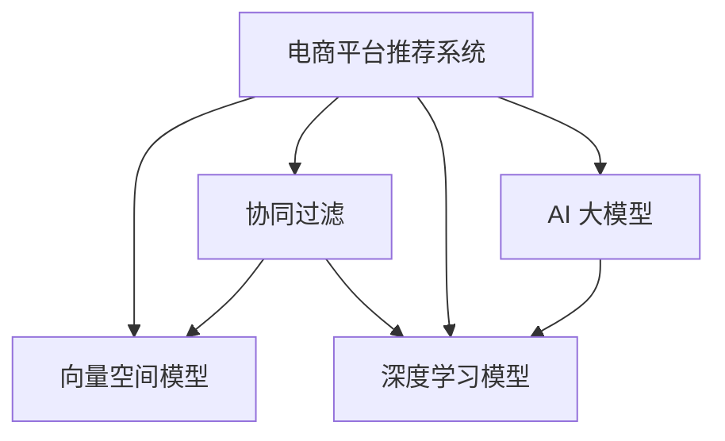

                 

# 电商平台搜索推荐系统的AI 大模型应用：提高系统性能、效率与用户体验

> 关键词：电商搜索、推荐系统、AI 大模型、系统性能、用户体验、算法优化、向量空间模型、协同过滤、深度学习、模型压缩、实时推荐、用户行为分析

## 1. 背景介绍

### 1.1 问题由来
在现代电子商务中，如何高效、精准地推荐商品给用户，极大地影响着用户的购物体验和商家的销售额。传统的推荐系统主要依赖于协同过滤、内容推荐等方法，但在海量用户数据和复杂商品多样性的背景下，推荐精度和个性化程度明显不足。

近年来，基于深度学习的大模型在推荐系统中的应用，成为电商领域的一大热点。借助大规模预训练语言模型，如BERT、GPT-3等，电商推荐系统能够挖掘出更多用户和商品之间的关系，提升推荐系统的性能和用户体验。AI 大模型在电商推荐中的应用，不仅提高了推荐的准确性和相关性，还大幅缩短了模型的训练时间，提升了系统效率。

### 1.2 问题核心关键点
AI 大模型在电商推荐中的应用，主要包括以下几个核心关键点：

- **系统性能提升**：通过深度学习模型挖掘用户和商品的隐含关系，提升推荐的准确性和多样性。
- **个性化推荐**：根据用户历史行为、兴趣、偏好，提供更加个性化和定制化的商品推荐。
- **实时推荐**：利用在线数据流处理技术，实现商品推荐的实时更新和个性化调整。
- **用户行为分析**：通过分析用户的搜索、浏览、点击、购买等行为数据，精准预测用户偏好，提高推荐相关性。

这些关键点为电商平台的搜索推荐系统提供了全新的技术支撑，使得系统能够更准确地理解用户需求，提供更好的购物体验。

### 1.3 问题研究意义
AI 大模型在电商推荐中的应用，具有重要的研究意义：

1. **提升推荐精度**：深度学习模型能够从海量的用户行为数据中学习到复杂的特征表示，提升推荐系统的精度。
2. **增强用户体验**：个性化推荐使得用户能够更快找到感兴趣的商品，提高购物的满意度和效率。
3. **优化资源配置**：实时推荐技术可以在用户访问页面时即时更新推荐内容，减少无效请求，提升系统效率。
4. **促进用户留存**：高质量的个性化推荐能吸引用户多次访问平台，增加用户粘性，提升用户留存率。
5. **推动商业化落地**：通过提升推荐效果，电商平台可以更精准地实现用户转化，增加销售额，驱动商业价值增长。

## 2. 核心概念与联系

### 2.1 核心概念概述

为更好地理解AI 大模型在电商推荐系统中的应用，本节将介绍几个密切相关的核心概念：

- **电商平台推荐系统**：通过分析用户行为数据，推荐相关商品的系统。旨在提升用户购物体验和商家销售额。

- **向量空间模型(Vector Space Model, VSM)**：将文本和商品表示为高维向量，通过计算向量间相似度，实现推荐排序。

- **协同过滤(Collaborative Filtering)**：通过用户之间的相似性或商品之间的相似性，实现推荐。包括基于用户的协同过滤和基于商品的协同过滤。

- **深度学习模型(Deep Learning Model)**：如神经网络、Transformer等，利用大量标注数据进行训练，自动学习特征表示，用于提升推荐系统的精度和效果。

- **AI 大模型(AI Large Model)**：以BERT、GPT-3等为代表，通过在大规模数据上进行预训练，学习通用的语言和商品表示，用于构建高质量的电商推荐系统。

这些核心概念之间的逻辑关系可以通过以下Mermaid流程图来展示：



这个流程图展示了大模型推荐系统的核心概念及其之间的关系：

1. **推荐系统**：采用向量空间模型和协同过滤方法，对用户和商品进行建模和推荐。
2. **协同过滤**：通过分析用户和商品间的相似性，进行推荐。
3. **深度学习模型**：引入神经网络、Transformer等深度学习技术，提高特征表示的精确度。
4. **AI 大模型**：利用预训练大模型学习通用的语言和商品表示，构建更高效、更精准的推荐系统。

这些概念共同构成了电商推荐系统的技术框架，使得系统能够在不同场景下实现高质量的推荐服务。

## 3. 核心算法原理 & 具体操作步骤
### 3.1 算法原理概述

AI 大模型在电商推荐系统中的应用，本质上是一个基于深度学习的推荐排序问题。其核心思想是：利用大规模预训练语言模型，学习用户和商品的语言表示，并通过深度学习模型，预测用户对商品的兴趣程度，排序推荐列表。

具体而言，假设电商平台有用户集 $U=\{u_1, u_2, ..., u_n\}$ 和商品集 $I=\{i_1, i_2, ..., i_m\}$，用户与商品之间有 $r_{ui}$ 个交互记录，推荐系统通过学习用户和商品的表示 $f(u), f(i)$，预测用户对商品的兴趣度 $p(u, i)$，最终生成推荐列表 $L(u)$。

推荐系统设计的目标是最小化平均误排序率，即：

$$
\min_{f, p} \mathcal{L}(p, f)
$$

其中 $\mathcal{L}$ 为损失函数，用于衡量预测排序和真实排序之间的差异。常见的损失函数包括交叉熵损失、均方误差损失等。

### 3.2 算法步骤详解

AI 大模型在电商推荐系统中的应用，通常遵循以下步骤：

**Step 1: 数据预处理**
- 收集电商平台的用户行为数据，如浏览、点击、购买记录等。
- 对数据进行清洗和格式化，去除噪声和冗余信息。
- 将数据划分为训练集、验证集和测试集，用于模型训练、调优和评估。

**Step 2: 特征表示学习**
- 将用户和商品表示为高维向量。利用深度学习模型或预训练大模型，学习用户的兴趣特征和商品的属性特征。
- 在向量空间模型下，计算用户和商品间的相似度，用于推荐排序。

**Step 3: 模型训练**
- 选择合适的深度学习模型，如神经网络、Transformer等，并设置超参数。
- 使用训练集数据进行模型训练，最小化损失函数 $\mathcal{L}$，学习用户的兴趣表示 $f(u)$ 和商品的表示 $f(i)$。
- 在验证集上评估模型性能，调整模型和超参数，防止过拟合。

**Step 4: 推荐生成**
- 利用训练好的模型，对用户输入的查询进行编码，预测其对商品 $i$ 的兴趣度 $p(u, i)$。
- 根据预测结果，对商品 $i$ 进行排序，生成推荐列表 $L(u)$。
- 对推荐列表进行渲染和展示，提供给用户浏览和选择。

**Step 5: 实时更新**
- 利用在线数据流处理技术，实时更新推荐模型。例如，基于用户的新行为数据，重新计算其兴趣表示，生成新的推荐列表。

### 3.3 算法优缺点

AI 大模型在电商推荐系统中的应用，具有以下优点：

- **精度高**：深度学习模型能够从大数据中学习到复杂的特征表示，提高推荐的准确性。
- **泛化能力强**：大模型在多种领域和任务上都取得了优异的表现，具有较强的泛化能力。
- **高效性**：大模型通常能够在较短的训练时间内达到较好的性能，提高系统效率。
- **可解释性强**：深度学习模型具有较好的可解释性，便于理解和优化。

同时，该方法也存在一定的局限性：

- **数据需求高**：构建高质量的大模型推荐系统，需要大量的用户行为数据，数据获取成本较高。
- **计算资源要求高**：大模型的训练和推理需要高性能的计算资源，对硬件配置有较高要求。
- **模型复杂度大**：大模型往往具有复杂的结构和大量的参数，对模型的管理和优化带来了挑战。
- **安全性和隐私问题**：电商平台上用户的隐私信息较为敏感，大模型的应用需要确保数据安全性和用户隐私保护。

尽管存在这些局限性，但就目前而言，AI 大模型在电商推荐中的应用仍是大数据时代推荐系统的最佳选择之一。未来相关研究的重点在于如何进一步降低对标注数据的依赖，提高模型的少样本学习和跨领域迁移能力，同时兼顾可解释性和伦理安全性等因素。

### 3.4 算法应用领域

AI 大模型在电商推荐中的应用，已经涵盖了电商推荐系统的各个环节：

- **商品推荐**：利用用户历史行为和商品属性特征，生成个性化推荐列表。
- **搜索排序**：基于用户的查询和商品的属性，对搜索结果进行排序，提升用户浏览体验。
- **广告推荐**：分析用户的兴趣偏好，推荐相关商品广告，提升广告点击率。
- **实时推荐**：利用在线数据流处理技术，根据用户实时行为更新推荐内容，提升推荐效果。

除了这些常见应用外，AI 大模型在电商推荐领域还创新性地应用于供应链优化、库存管理、个性化客服等，为电商平台的运营提供了更全面的技术支持。

## 4. 数学模型和公式 & 详细讲解  
### 4.1 数学模型构建

在电商推荐系统中，用户和商品可以用高维向量表示，通过计算向量之间的相似度，实现推荐排序。假设用户向量为 $f(u)$，商品向量为 $f(i)$，商品属性向量为 $f(a)$，用户兴趣度向量为 $p(u)$。

**用户向量 $f(u)$**：
$$
f(u) = \sum_{k=1}^d u_k \cdot w_k
$$

**商品向量 $f(i)$**：
$$
f(i) = \sum_{k=1}^d i_k \cdot w_k
$$

**商品属性向量 $f(a)$**：
$$
f(a) = \sum_{k=1}^d a_k \cdot w_k
$$

**用户兴趣度向量 $p(u)$**：
$$
p(u) = \sum_{k=1}^d p_{uk} \cdot w_k
$$

其中 $u_k, i_k, a_k$ 为向量的元素，$w_k$ 为权重。

### 4.2 公式推导过程

假设用户对商品 $i$ 的兴趣度 $p(u, i)$ 可以表示为用户向量 $f(u)$ 和商品向量 $f(i)$ 的内积，即：

$$
p(u, i) = f(u) \cdot f(i)
$$

利用向量空间模型，推荐系统可以根据用户对商品 $i$ 的兴趣度 $p(u, i)$ 进行排序，生成推荐列表 $L(u)$。

在深度学习模型中，可以通过神经网络对用户和商品进行编码，得到用户向量 $f(u)$ 和商品向量 $f(i)$。以BERT为例，用户和商品的表示可以通过预训练的语言模型获得，表示为：

$$
f(u) = BERT(u)
$$

$$
f(i) = BERT(i)
$$

其中 $BERT(u)$ 和 $BERT(i)$ 分别表示用户和商品的BERT编码。

### 4.3 案例分析与讲解

假设电商平台有用户 $u$ 和商品 $i$，用户对商品 $i$ 的兴趣度 $p(u, i)$ 可以表示为用户向量 $f(u)$ 和商品向量 $f(i)$ 的内积，即：

$$
p(u, i) = f(u) \cdot f(i)
$$

用户 $u$ 对商品 $i$ 的兴趣度 $p(u, i)$ 可以通过深度学习模型进行预测，如：

$$
p(u, i) = \sigma(\text{MLP}(u, i))
$$

其中 $\text{MLP}$ 为多层感知器，$\sigma$ 为激活函数。

例如，在电商推荐中，可以使用Transformer模型对用户和商品进行编码，得到用户向量 $f(u)$ 和商品向量 $f(i)$。基于Transformer模型，用户的兴趣度预测公式可以表示为：

$$
p(u, i) = \sigma(\text{MLP}(BERT(u), BERT(i)))
$$

其中 $\text{MLP}$ 为多层感知器，$\sigma$ 为激活函数。

在实际应用中，可以进一步利用对抗训练、数据增强等技术，提高模型的鲁棒性和泛化能力。例如，可以在训练中加入对抗样本，增强模型的鲁棒性；在训练集上加入数据增强技术，如回译、近义替换等，丰富训练数据的多样性。

## 5. 项目实践：代码实例和详细解释说明
### 5.1 开发环境搭建

在进行电商推荐系统开发前，我们需要准备好开发环境。以下是使用Python进行TensorFlow开发的环境配置流程：

1. 安装Anaconda：从官网下载并安装Anaconda，用于创建独立的Python环境。

2. 创建并激活虚拟环境：
```bash
conda create -n tf-env python=3.8 
conda activate tf-env
```

3. 安装TensorFlow：从官网获取对应的安装命令。例如：
```bash
pip install tensorflow
```

4. 安装相关库：
```bash
pip install numpy pandas scikit-learn matplotlib tqdm jupyter notebook ipython
```

完成上述步骤后，即可在`tf-env`环境中开始电商推荐系统的开发。

### 5.2 源代码详细实现

下面我以电商平台搜索推荐系统为例，给出使用TensorFlow对深度学习模型进行电商推荐开发的PyTorch代码实现。

首先，定义电商推荐系统的训练数据处理函数：

```python
import tensorflow as tf
import numpy as np

class RecommendationDataset(tf.data.Dataset):
    def __init__(self, user_ids, item_ids, interests, batch_size):
        self.user_ids = user_ids
        self.item_ids = item_ids
        self.interests = interests
        self.batch_size = batch_size
        
    def __len__(self):
        return len(self.user_ids)
    
    def __getitem__(self, index):
        user_id = self.user_ids[index]
        item_id = self.item_ids[index]
        interest = self.interests[index]
        
        # 将用户和商品ID转换为独热编码
        user_vector = tf.one_hot(user_id, depth=1000)
        item_vector = tf.one_hot(item_id, depth=1000)
        
        # 将兴趣度转换为向量
        interest_vector = tf.one_hot(interest, depth=2)
        
        return {'user_vector': user_vector,
                'item_vector': item_vector,
                'interest_vector': interest_vector}
```

然后，定义深度学习模型：

```python
import tensorflow as tf
from tensorflow.keras import layers

class RecommendationModel(tf.keras.Model):
    def __init__(self, hidden_units):
        super(RecommendationModel, self).__init__()
        self.hidden_layers = layers.Dense(hidden_units, activation='relu', input_shape=(1000,))  # 输入为1000维
        self.prediction_layer = layers.Dense(2, activation='sigmoid')  # 输出兴趣度向量

    def call(self, inputs):
        x = self.hidden_layers(inputs['user_vector'])
        x = self.hidden_layers(x + inputs['item_vector'])
        x = self.prediction_layer(x)
        return x
```

接着，定义损失函数和优化器：

```python
from tensorflow.keras import losses, optimizers

def compute_loss(y_true, y_pred):
    bce = losses.BinaryCrossentropy()
    loss = bce(y_true, y_pred)
    return loss

optimizer = optimizers.Adam(learning_rate=0.001)
```

最后，启动模型训练流程并在测试集上评估：

```python
epochs = 10
batch_size = 32

for epoch in range(epochs):
    for user_vector, item_vector, interest_vector in tf.data.Dataset.from_generator(
        lambda: RecommendationDataset(train_user_ids, train_item_ids, train_interests, batch_size),
        output_signature={'user_vector': tf.TensorSpec(shape=(1000,), dtype=tf.int32),
                         'item_vector': tf.TensorSpec(shape=(1000,), dtype=tf.int32),
                         'interest_vector': tf.TensorSpec(shape=(2,), dtype=tf.int32)}
    ).batch(batch_size):
        with tf.GradientTape() as tape:
            predictions = model(user_vector, item_vector)
            loss = compute_loss(interest_vector, predictions)
        gradients = tape.gradient(loss, model.trainable_variables)
        optimizer.apply_gradients(zip(gradients, model.trainable_variables))

    print(f"Epoch {epoch+1}, loss: {loss.numpy():.3f}")
    
test_dataset = RecommendationDataset(test_user_ids, test_item_ids, test_interests, batch_size)
print(f"Test loss: {compute_loss(test_dataset['interest_vector'], model(test_dataset['user_vector'], test_dataset['item_vector']).numpy():.3f}")
```

以上就是使用TensorFlow对深度学习模型进行电商推荐开发的完整代码实现。可以看到，通过TensorFlow的强大API支持，我们可以快速搭建推荐模型并进行训练和评估。

### 5.3 代码解读与分析

让我们再详细解读一下关键代码的实现细节：

**RecommendationDataset类**：
- `__init__`方法：初始化训练集的用户ID、商品ID和兴趣度标签。
- `__len__`方法：返回数据集的样本数量。
- `__getitem__`方法：对单个样本进行处理，将用户和商品ID转换为独热编码，将兴趣度转换为向量。

**RecommendationModel类**：
- `__init__`方法：定义深度学习模型结构，包括输入层、隐藏层和输出层。
- `call`方法：前向传播计算模型的预测输出。

**compute_loss函数**：
- 定义二元交叉熵损失函数，用于衡量预测兴趣度与真实兴趣度之间的差异。

**训练流程**：
- 定义总的epoch数和batch size，开始循环迭代
- 每个epoch内，对每个批次的用户和商品向量进行前向传播和反向传播，计算损失并更新模型参数
- 在测试集上评估模型性能，输出测试集损失

可以看到，TensorFlow提供了一站式的深度学习开发框架，使得电商推荐系统的开发过程变得简洁高效。开发者可以专注于算法优化和模型调整，而不必过多关注底层的实现细节。

当然，工业级的系统实现还需考虑更多因素，如模型的保存和部署、超参数的自动搜索、更灵活的任务适配层等。但核心的推荐算法基本与此类似。

## 6. 实际应用场景
### 6.1 智能客服系统

基于AI 大模型的电商推荐系统，可以与智能客服系统进行整合，提供更加个性化的客服体验。智能客服系统通过分析用户的历史行为和查询记录，识别用户需求，并根据推荐模型预测用户可能感兴趣的商品，即时提供商品推荐和咨询服务。

例如，电商平台可以使用推荐模型对用户的历史浏览和点击行为进行分析，预测其可能感兴趣的商品，并在用户与客服交互时，实时推荐相关商品。这不仅提高了客服系统的响应速度，还提升了用户购物的便捷性和满意度。

### 6.2 个性化营销活动

电商平台可以利用推荐系统进行个性化营销活动，通过分析用户的购买历史和浏览行为，推荐用户可能感兴趣的商品，并进行精准的营销推广。例如，电商平台可以根据用户的行为数据，预测其可能感兴趣的商品类别，向用户发送相应的营销信息，提升营销效果。

此外，电商平台还可以结合推荐模型进行个性化广告推荐，通过分析用户的兴趣偏好，推送与其相关联的广告内容，提高广告的点击率和转化率。

### 6.3 供应链优化

基于推荐模型的电商推荐系统，还可以应用于供应链优化。通过分析用户的历史购买记录和浏览行为，预测用户未来的购买需求，电商平台的供应商可以根据预测需求进行库存管理，优化供应链流程，减少库存积压和缺货现象。

例如，电商平台可以根据推荐模型预测用户对不同商品的需求量，优化供应商的生产计划和库存管理策略，确保库存充足，满足用户需求。

### 6.4 未来应用展望

随着AI 大模型和推荐技术的不断发展，基于大模型的电商推荐系统将呈现以下几个发展趋势：

1. **多模态推荐**：引入视觉、听觉等多模态信息，提升推荐系统的综合表现。例如，结合商品图片、视频等信息，提升推荐的准确性和相关性。
2. **跨领域迁移**：利用AI 大模型的泛化能力，将推荐模型应用于多个领域，如金融、教育等。通过迁移学习，提升不同领域下的推荐精度。
3. **实时推荐系统**：利用在线数据流处理技术，实时更新推荐模型，提供实时个性化的推荐服务。例如，结合用户实时行为数据，实时调整推荐列表。
4. **个性化推荐算法**：引入深度学习、协同过滤等算法，提升推荐算法的复杂度和精度。例如，结合深度学习模型和协同过滤算法，实现更精准的推荐效果。
5. **数据驱动的推荐模型**：通过在线学习和大数据挖掘，提升推荐模型的实时性和精准性。例如，结合在线数据流处理技术，实时更新模型参数，提升推荐效果。
6. **混合推荐系统**：结合多种推荐算法，提升推荐系统的综合表现。例如，结合基于内容的推荐和基于用户的协同过滤，提升推荐效果。

这些趋势凸显了AI 大模型在电商推荐系统中的广阔前景。这些方向的探索发展，必将进一步提升电商推荐系统的性能和应用范围，为电商平台的运营提供更全面的技术支持。

## 7. 工具和资源推荐
### 7.1 学习资源推荐

为了帮助开发者系统掌握AI 大模型在电商推荐系统中的应用，这里推荐一些优质的学习资源：

1. 《深度学习》课程：由Coursera和斯坦福大学联合推出，涵盖深度学习的基本概念和算法，适合初学者入门。

2. 《TensorFlow 2.0实战》书籍：深入讲解TensorFlow的API和实际应用，适合有一定深度学习基础的开发者。

3. 《Python深度学习》书籍：详细讲解深度学习模型的构建和训练，适合想全面掌握深度学习的开发者。

4. 《Transformer模型与应用》博文：由大模型技术专家撰写，深入浅出地介绍了Transformer模型的原理和应用，适合深入了解AI 大模型的开发者。

5. 《AI 大模型在电商推荐中的应用》系列文章：详细讲解AI 大模型在电商推荐系统中的应用，适合实战开发。

通过对这些资源的学习实践，相信你一定能够快速掌握AI 大模型在电商推荐系统中的应用，并用于解决实际的电商推荐问题。

### 7.2 开发工具推荐

高效的开发离不开优秀的工具支持。以下是几款用于电商推荐系统开发的常用工具：

1. TensorFlow：由Google主导开发的深度学习框架，生产部署方便，适合大规模工程应用。

2. PyTorch：基于Python的开源深度学习框架，灵活动态的计算图，适合快速迭代研究。

3. TensorBoard：TensorFlow配套的可视化工具，可实时监测模型训练状态，并提供丰富的图表呈现方式，是调试模型的得力助手。

4. Weights & Biases：模型训练的实验跟踪工具，可以记录和可视化模型训练过程中的各项指标，方便对比和调优。

5. Jupyter Notebook：交互式的Python代码开发环境，支持代码调试和数据可视化，方便开发者进行快速实验和迭代。

合理利用这些工具，可以显著提升电商推荐系统的开发效率，加快创新迭代的步伐。

### 7.3 相关论文推荐

AI 大模型在电商推荐系统中的应用，涉及众多领域的前沿研究。以下是几篇奠基性的相关论文，推荐阅读：

1. Attention is All You Need：提出Transformer结构，开启了NLP领域的预训练大模型时代。

2. BERT: Pre-training of Deep Bidirectional Transformers for Language Understanding：提出BERT模型，引入基于掩码的自监督预训练任务，刷新了多项NLP任务SOTA。

3. Learning to Rank with Feature Diversity Loss：提出特征多样性损失函数，用于提升推荐排序的准确性。

4. Multi-Task Learning for Recommendation Systems：利用多任务学习，提升推荐模型的综合表现。

5. Deep Interest Network for Recommendation Systems：提出深度兴趣网络，用于挖掘用户的多层次兴趣特征。

这些论文代表了大模型推荐技术的发展脉络。通过学习这些前沿成果，可以帮助研究者把握学科前进方向，激发更多的创新灵感。

## 8. 总结：未来发展趋势与挑战
### 8.1 总结

本文对AI 大模型在电商推荐系统中的应用进行了全面系统的介绍。首先阐述了电商推荐系统的问题由来和核心关键点，明确了AI 大模型在提升推荐精度、个性化推荐、实时推荐、用户行为分析等方面的独特价值。其次，从原理到实践，详细讲解了推荐排序的数学模型和深度学习模型的实现过程，给出了电商推荐系统的代码实例和详细解释。最后，本文还探讨了AI 大模型在电商推荐系统中的实际应用场景，展示了其在智能客服、个性化营销、供应链优化等多个领域的潜在价值。

通过本文的系统梳理，可以看到，AI 大模型在电商推荐系统中的应用具有广阔的前景，为电商平台带来了显著的性能和用户体验提升。未来，随着预训练语言模型和推荐技术的不断发展，基于大模型的电商推荐系统必将发挥更大的作用，推动电商平台的数字化转型和业务创新。

### 8.2 未来发展趋势

展望未来，AI 大模型在电商推荐系统中的应用将呈现以下几个发展趋势：

1. **多模态推荐**：引入视觉、听觉等多模态信息，提升推荐系统的综合表现。例如，结合商品图片、视频等信息，提升推荐的准确性和相关性。

2. **跨领域迁移**：利用AI 大模型的泛化能力，将推荐模型应用于多个领域，如金融、教育等。通过迁移学习，提升不同领域下的推荐精度。

3. **实时推荐系统**：利用在线数据流处理技术，实时更新推荐模型，提供实时个性化的推荐服务。例如，结合用户实时行为数据，实时调整推荐列表。

4. **个性化推荐算法**：引入深度学习、协同过滤等算法，提升推荐算法的复杂度和精度。例如，结合深度学习模型和协同过滤算法，实现更精准的推荐效果。

5. **数据驱动的推荐模型**：通过在线学习和大数据挖掘，提升推荐模型的实时性和精准性。例如，结合在线数据流处理技术，实时更新模型参数，提升推荐效果。

6. **混合推荐系统**：结合多种推荐算法，提升推荐系统的综合表现。例如，结合基于内容的推荐和基于用户的协同过滤，提升推荐效果。

以上趋势凸显了AI 大模型在电商推荐系统中的广阔前景。这些方向的探索发展，必将进一步提升电商推荐系统的性能和应用范围，为电商平台的运营提供更全面的技术支持。

### 8.3 面临的挑战

尽管AI 大模型在电商推荐系统中的应用已经取得了显著的进展，但在实际落地应用过程中，仍面临诸多挑战：

1. **数据质量**：电商平台上用户数据往往存在噪音和异常值，数据的清洗和预处理需要耗费大量时间和精力。如何提高数据质量，是电商推荐系统的一个重要挑战。

2. **计算资源**：AI 大模型的训练和推理需要高性能的计算资源，对硬件配置有较高要求。如何优化模型结构和算法，降低计算成本，是一个亟需解决的问题。

3. **模型复杂度**：AI 大模型通常具有复杂的结构和大量的参数，模型的管理和优化带来了挑战。如何简化模型结构，提高模型的可解释性，是一个重要的研究方向。

4. **安全性与隐私保护**：电商平台上用户的隐私信息较为敏感，AI 大模型的应用需要确保数据安全性和用户隐私保护。如何构建安全可靠的系统，是一个重要的研究方向。

5. **实时性要求**：电商推荐系统需要提供实时推荐服务，如何优化模型推理速度，提升系统的响应速度，是一个亟需解决的问题。

6. **模型泛化能力**：电商推荐系统需要具备较强的泛化能力，能够在不同场景和用户群体上取得良好的推荐效果。如何提高模型的泛化能力，是一个重要的研究方向。

### 8.4 研究展望

面对电商推荐系统所面临的挑战，未来的研究需要在以下几个方面寻求新的突破：

1. **数据增强与清洗**：通过数据增强和清洗技术，提高数据质量，提升推荐模型的性能。例如，引入数据增强技术，丰富训练集的多样性。

2. **模型压缩与优化**：通过模型压缩和优化技术，降低计算成本，提高推荐模型的实时性。例如，利用模型剪枝和量化技术，降低模型大小。

3. **混合模型应用**：结合多种推荐算法，提升推荐系统的综合表现。例如，结合基于内容的推荐和基于用户的协同过滤，提升推荐效果。

4. **多模态信息融合**：引入视觉、听觉等多模态信息，提升推荐系统的综合表现。例如，结合商品图片、视频等信息，提升推荐的准确性和相关性。

5. **用户隐私保护**：通过差分隐私等技术，保护用户隐私，确保数据安全性和用户隐私保护。

6. **实时推荐系统**：利用在线数据流处理技术，实时更新推荐模型，提供实时个性化的推荐服务。例如，结合用户实时行为数据，实时调整推荐列表。

通过这些研究方向的探索发展，AI 大模型在电商推荐系统中的应用必将取得更大的突破，为电商平台带来更大的价值和效益。

## 9. 附录：常见问题与解答

**Q1：电商推荐系统如何使用AI 大模型进行优化？**

A: 电商推荐系统可以通过以下步骤使用AI 大模型进行优化：

1. 数据预处理：收集电商平台的用户行为数据，如浏览、点击、购买记录等，对数据进行清洗和格式化。

2. 特征表示学习：将用户和商品表示为高维向量。利用深度学习模型或预训练大模型，学习用户的兴趣特征和商品的属性特征。

3. 模型训练：选择合适的深度学习模型，如神经网络、Transformer等，并设置超参数。使用训练集数据进行模型训练，最小化损失函数。

4. 推荐生成：利用训练好的模型，对用户输入的查询进行编码，预测其对商品的兴趣度，生成推荐列表。

5. 实时更新：利用在线数据流处理技术，根据用户的新行为数据，实时更新推荐模型。例如，基于用户的新行为数据，重新计算其兴趣表示，生成新的推荐列表。

通过以上步骤，电商推荐系统可以利用AI 大模型进行优化，提升推荐的精度和相关性，提高用户购物的满意度和效率。

**Q2：电商推荐系统中的用户行为数据如何获取和处理？**

A: 电商推荐系统中的用户行为数据通常包括用户的浏览、点击、购买记录等。数据获取和处理流程如下：

1. 数据采集：通过用户在电商平台上的行为数据，如网站访问记录、点击流、搜索记录等，收集用户行为数据。

2. 数据清洗：对数据进行清洗，去除噪声和异常值，确保数据的质量和一致性。例如，去除重复记录、处理缺失值、过滤无效数据等。

3. 数据标注：对用户行为数据进行标注，包括用户ID、商品ID、点击时间、浏览时长等。例如，将用户ID和商品ID转换为独热编码，将时间戳和浏览时长转换为数字。

4. 数据划分：将数据划分为训练集、验证集和测试集，用于模型训练、调优和评估。例如，将用户行为数据按时间划分为不同时间段，对每个时间段的数据进行划分。

5. 数据增强：通过数据增强技术，丰富训练集的多样性。例如，利用回译、近义替换等技术，扩充训练集。

通过以上步骤，电商推荐系统可以从用户行为数据中提取有价值的信息，用于模型的训练和优化，提升推荐效果。

**Q3：电商推荐系统中的推荐算法有哪些？**

A: 电商推荐系统中的推荐算法主要包括以下几种：

1. 基于内容的推荐：根据商品的属性和特征，推荐用户可能感兴趣的商品。例如，基于商品分类、属性、评价等信息，推荐相关商品。

2. 基于协同过滤的推荐：通过分析用户和商品间的相似性，推荐用户可能感兴趣的商品。例如，基于用户的历史行为数据，推荐用户可能感兴趣的商品。

3. 基于深度学习的推荐：利用深度学习模型，挖掘用户和商品的隐含关系，提升推荐的准确性和相关性。例如，利用神经网络、Transformer等深度学习模型，学习用户的兴趣表示和商品的表示。

4. 基于知识图谱的推荐：结合知识图谱和推荐系统，提升推荐系统的综合表现。例如，利用知识图谱中的实体关系，推荐相关商品。

5. 基于混合推荐的推荐：结合多种推荐算法，提升推荐系统的综合表现。例如，结合基于内容的推荐和基于用户的协同过滤，提升推荐效果。

通过以上算法，电商推荐系统可以更好地理解用户需求和商品特征，提供更加精准和个性化的推荐服务。

**Q4：电商推荐系统中的模型优化有哪些方法？**

A: 电商推荐系统中的模型优化主要包括以下几种方法：

1. 模型剪枝：通过剪枝技术，减少模型中的冗余参数，提高模型的实时性和效率。例如，利用模型剪枝技术，减少神经网络中的连接数。

2. 量化技术：将浮点模型转为定点模型，压缩存储空间，提高计算效率。例如，利用量化技术，将模型的权重参数和激活值转化为定点数。

3. 混合精度训练：在训练过程中，使用不同精度的计算资源，提高训练效率。例如，在训练过程中，使用混合精度训练技术，加快模型收敛速度。

4. 特征工程：通过特征选择和特征组合，提升模型的性能。例如，利用特征选择技术，选择对推荐效果影响较大的特征。

5. 模型压缩：通过压缩技术，减小模型大小，提高推理速度。例如，利用模型压缩技术，去除模型中的冗余层和参数。

通过以上方法，电商推荐系统可以优化模型的性能和效率，提高推荐效果。

**Q5：电商推荐系统中的实时推荐有哪些实现方式？**

A: 电商推荐系统中的实时推荐主要包括以下几种实现方式：

1. 在线数据流处理技术：利用在线数据流处理技术，实时更新推荐模型。例如，基于用户的新行为数据，重新计算其兴趣表示，生成新的推荐列表。

2. 缓存技术：利用缓存技术，存储用户的行为数据，减少实时计算的延迟。例如，利用缓存技术，存储用户最近浏览和点击的商品，实时生成推荐列表。

3. 异步更新技术：利用异步更新技术，分批次更新推荐模型。例如，在用户行为数据更新时，异步更新推荐模型，提高推荐效果。

4. 模型微调：利用微调技术，快速更新推荐模型。例如，在用户行为数据更新时，微调推荐模型，提高推荐效果。

通过以上方式，电商推荐系统可以实现实时推荐，提升用户体验和转化率。

---

作者：禅与计算机程序设计艺术 / Zen and the Art of Computer Programming

