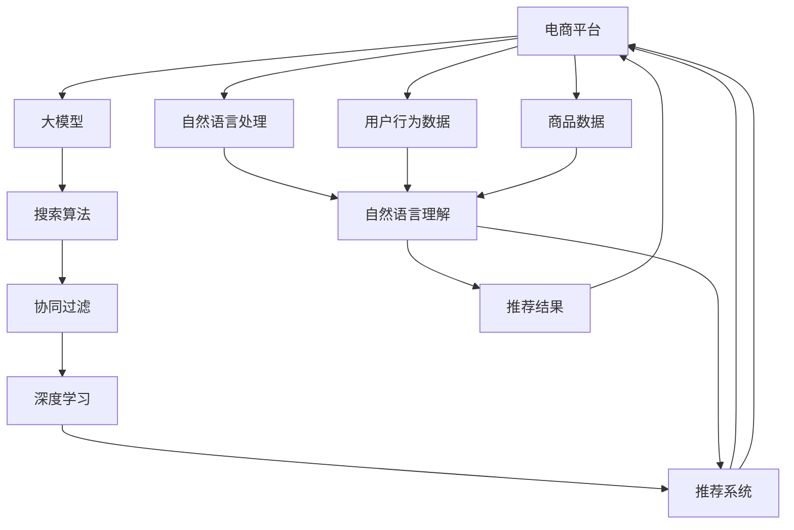

                 

# 电商平台搜索推荐系统的AI 大模型应用：提高系统性能、效率、准确率与多样性

> 关键词：人工智能(AI), 大模型, 推荐系统, 搜索算法, 协同过滤, 深度学习, 自然语言处理(NLP), 自然语言理解(NLU), 推荐系统中的大模型应用, 电商平台, 性能优化

## 1. 背景介绍

### 1.1 问题由来

随着电商平台的迅猛发展，个性化推荐已成为提升用户体验、增加用户粘性和销售额的重要手段。传统的推荐系统大多基于协同过滤、矩阵分解等算法，但在面对大规模数据和高维稀疏性时，往往存在计算复杂度高、推荐结果不够个性化和多样化等问题。近年来，大模型在推荐系统中的应用，显著提升了推荐的准确性和多样性，为电商平台带来了巨大的商业价值。

大模型通过在大规模无标签数据上预训练，学习到丰富的语言和语义知识，可以更好地理解用户行为和商品属性，从而实现更加精准和个性化的推荐。然而，大模型在实际应用中也面临一些挑战，如模型的训练和推理成本较高、推荐效率较低等问题。本文将详细探讨如何利用大模型优化电商平台的搜索和推荐系统，提高系统的性能、效率和准确率，并增加推荐结果的多样性。

### 1.2 问题核心关键点

为有效解决电商推荐系统中的问题，本节将重点介绍几个核心关键点：

- **大模型在推荐中的应用**：如何利用预训练大模型提升推荐系统的效果。
- **搜索算法的改进**：基于大模型的搜索算法如何进一步优化。
- **协同过滤算法与深度学习结合**：如何将传统协同过滤算法与深度学习方法相结合。
- **大模型的结构与性能优化**：如何选择和优化大模型的结构和参数，以达到最优推荐效果。
- **推荐系统中的多样化提升**：如何增加推荐结果的多样性，避免单一和雷同。

通过理解这些核心关键点，可以更好地把握大模型在电商平台推荐系统中的应用和优化策略。

### 1.3 问题研究意义

电商平台推荐系统的优化和大模型应用，对提升用户体验、促进销售、降低运营成本等方面具有重要意义：

1. **提升用户体验**：大模型能够提供更加精准和个性化的推荐，提升用户满意度和留存率。
2. **增加销售额**：个性化推荐能够有效提高用户转化率，增加平台收入。
3. **降低运营成本**：优化搜索推荐算法，可以降低搜索引擎和推荐引擎的计算成本。
4. **拓展应用场景**：大模型技术可应用于商品评论分析、用户画像构建等辅助业务，促进平台多元化发展。
5. **技术创新**：大模型与推荐系统的结合，为推荐技术带来了新的研究方向，如深度学习在推荐系统中的应用。

## 2. 核心概念与联系

### 2.1 核心概念概述

为了更好地理解大模型在电商推荐系统中的应用，本节将介绍几个关键概念及其之间的联系：

- **大模型**：指通过在大规模无标签数据上预训练的深度学习模型，如BERT、GPT等。这些模型通常包含数亿参数，学习到了丰富的语言和语义知识。
- **推荐系统**：旨在根据用户行为和偏好，推荐最适合的商品或服务。推荐算法通常包括基于内容的推荐、协同过滤、矩阵分解等。
- **搜索算法**：用于快速定位用户查询的算法，常见有倒排索引、向量空间模型等。
- **协同过滤**：一种基于用户行为数据的推荐算法，通过计算用户和商品之间的相似度，进行推荐。
- **深度学习**：一种基于神经网络的机器学习方法，可以自动学习特征表示，提高推荐准确性。
- **自然语言处理(NLP)**：涉及文本分析、情感分析、语义理解等，有助于从用户评论、商品描述中提取有用信息。
- **自然语言理解(NLU)**：是NLP的一个重要分支，旨在使计算机能够理解人类语言，从而进行精准推荐。

这些概念共同构成了电商推荐系统的核心框架，通过大模型的应用，可以进一步优化推荐结果的准确性、多样性和效率。

### 2.2 核心概念原理和架构的 Mermaid 流程图



此流程图展示了电商推荐系统中的核心组件及其相互关系。大模型作为信息抽取和特征表示的工具，从用户行为数据和商品描述中提取特征，然后通过搜索算法和协同过滤算法生成推荐结果，最终传递给用户。自然语言处理和理解技术也用于提取和理解用户输入的查询和反馈，进一步优化推荐结果。

## 3. 核心算法原理 & 具体操作步骤

### 3.1 算法原理概述

大模型在电商推荐系统中的应用主要分为两个步骤：预训练和微调。首先，在大规模无标签数据上对大模型进行预训练，使其学习到丰富的语言和语义知识。然后，通过微调，将大模型适应具体的推荐场景，提升推荐系统的性能。

形式化地，设推荐系统中的用户集合为 $U$，商品集合为 $I$，用户行为数据为 $R$。设 $M$ 为预训练的大模型，$M_{\text{finetune}}$ 为微调后的大模型。微调的目标是最小化预测误差，即：

$$
\min_{\theta} \frac{1}{N}\sum_{i=1}^N |R_i - M_{\text{finetune}}(U_i, I)|^2
$$

其中 $R_i$ 为第 $i$ 个用户的行为数据，$M_{\text{finetune}}(U_i, I)$ 为模型预测的推荐结果。微调过程通过反向传播算法，不断更新模型参数 $\theta$，直至误差最小。

### 3.2 算法步骤详解

大模型在电商平台推荐系统中的应用，主要包括以下几个关键步骤：

**Step 1: 准备数据集**
- 收集电商平台的用户行为数据 $R$ 和商品描述数据 $I$。
- 使用自然语言处理技术对商品描述进行特征抽取，生成词向量或句向量。
- 对用户行为数据进行标注，生成用户行为向量。

**Step 2: 大模型的预训练**
- 选择合适的大模型（如BERT、GPT等），在大规模无标签数据上预训练。
- 通过自监督学习任务（如掩码语言模型、预测下一个单词等），学习丰富的语言知识。

**Step 3: 大模型的微调**
- 在大规模标注数据上对大模型进行微调，适应特定的推荐场景。
- 选择合适的损失函数和优化算法（如AdamW、SGD等），设置学习率、批大小等超参数。
- 应用正则化技术（如L2正则、Dropout等），防止过拟合。
- 应用对抗训练和数据增强技术，提高模型的鲁棒性。
- 使用参数高效微调技术，如Adapter、Prefix等，提高微调效率。

**Step 4: 应用到推荐系统**
- 将微调后的大模型应用到电商平台推荐系统中的搜索和推荐环节。
- 使用搜索算法快速定位用户查询，生成推荐结果。
- 结合协同过滤算法，综合用户行为和商品特征，生成最终推荐列表。
- 对推荐结果进行多样化处理，增加推荐的多样性。

**Step 5: 评估与优化**
- 在测试集上评估推荐系统的性能，如准确率、召回率、多样性等指标。
- 根据评估结果，不断优化模型参数和超参数，提升推荐系统的效果。

### 3.3 算法优缺点

大模型在电商推荐系统中的应用具有以下优点：

- **精准性高**：大模型通过预训练和微调，能够学习到丰富的语言和语义知识，提高推荐的精准度。
- **泛化能力强**：大模型能够适应多种推荐场景，泛化能力较强。
- **推荐结果多样化**：通过多样化处理，可以增加推荐结果的多样性，避免单一和雷同。
- **性能优化**：通过搜索算法和协同过滤算法的优化，可以显著提升推荐系统的效率。

同时，大模型在电商推荐系统中的应用也存在一些局限：

- **计算资源需求高**：大模型的预训练和微调需要大量的计算资源。
- **训练和推理成本高**：大模型的训练和推理成本较高，难以快速迭代。
- **可解释性不足**：大模型通常是"黑盒"模型，难以解释其内部工作机制和决策逻辑。

## 4. 数学模型和公式 & 详细讲解 & 举例说明

### 4.1 数学模型构建

大模型在电商推荐系统中的应用，可以通过以下数学模型进行建模：

设用户行为数据为 $R=\{(U_i, I_i, R_i)\}_{i=1}^N$，其中 $U_i$ 为用户行为向量，$I_i$ 为商品特征向量，$R_i$ 为用户对商品 $I_i$ 的评分。设预训练大模型为 $M$，微调后的大模型为 $M_{\text{finetune}}$。微调的目标为最小化预测误差：

$$
\min_{\theta} \frac{1}{N}\sum_{i=1}^N |R_i - M_{\text{finetune}}(U_i, I_i)|^2
$$

其中 $M_{\text{finetune}}(U_i, I_i)$ 为模型预测的评分。

### 4.2 公式推导过程

以下以深度学习中的矩阵分解模型为例，推导其公式及其梯度计算过程。

设用户行为矩阵为 $R \in \mathbb{R}^{N \times M}$，用户向量为 $U \in \mathbb{R}^{N \times D}$，商品向量为 $I \in \mathbb{R}^{M \times D}$，其中 $D$ 为向量维度。矩阵分解模型将用户行为矩阵 $R$ 表示为用户和商品向量的乘积：

$$
R \approx U \times I^T
$$

通过矩阵分解模型，可以学习用户和商品之间的隐含关系，生成推荐结果。假设模型参数为 $\theta$，损失函数为均方误差损失函数，则：

$$
\ell = \frac{1}{2N} \sum_{i=1}^N \|R_i - M_{\text{finetune}}(U_i, I_i)\|^2
$$

对 $\theta$ 求导，得到：

$$
\frac{\partial \ell}{\partial \theta} = -\frac{1}{N} \sum_{i=1}^N (R_i - M_{\text{finetune}}(U_i, I_i)) \frac{\partial M_{\text{finetune}}(U_i, I_i)}{\partial \theta}
$$

其中 $\frac{\partial M_{\text{finetune}}(U_i, I_i)}{\partial \theta}$ 为微调后大模型对输入的梯度。

### 4.3 案例分析与讲解

假设使用BERT模型作为电商平台推荐系统的基础模型。在微调前，可以通过以下步骤进行案例分析：

1. **数据准备**：收集电商平台的用户行为数据 $R$ 和商品描述数据 $I$。使用自然语言处理技术对商品描述进行特征抽取，生成词向量或句向量。对用户行为数据进行标注，生成用户行为向量。

2. **模型选择**：选择BERT作为预训练大模型，在大规模无标签数据上预训练。通过掩码语言模型和预测下一个单词等自监督任务，学习丰富的语言知识。

3. **模型微调**：在大规模标注数据上对BERT模型进行微调，适应特定的推荐场景。设置合适的损失函数和优化算法，如AdamW、SGD等。应用正则化技术，防止过拟合。结合对抗训练和数据增强技术，提高模型的鲁棒性。

4. **推荐系统应用**：将微调后的BERT模型应用到电商平台推荐系统中的搜索和推荐环节。使用搜索算法快速定位用户查询，生成推荐结果。结合协同过滤算法，综合用户行为和商品特征，生成最终推荐列表。对推荐结果进行多样化处理，增加推荐的多样性。

5. **性能评估与优化**：在测试集上评估推荐系统的性能，如准确率、召回率、多样性等指标。根据评估结果，不断优化模型参数和超参数，提升推荐系统的效果。

## 5. 项目实践：代码实例和详细解释说明

### 5.1 开发环境搭建

在进行项目实践前，我们需要准备好开发环境。以下是使用Python进行PyTorch开发的环境配置流程：

1. 安装Anaconda：从官网下载并安装Anaconda，用于创建独立的Python环境。

2. 创建并激活虚拟环境：
```bash
conda create -n pytorch-env python=3.8 
conda activate pytorch-env
```

3. 安装PyTorch：根据CUDA版本，从官网获取对应的安装命令。例如：
```bash
conda install pytorch torchvision torchaudio cudatoolkit=11.1 -c pytorch -c conda-forge
```

4. 安装Transformer库：
```bash
pip install transformers
```

5. 安装各类工具包：
```bash
pip install numpy pandas scikit-learn matplotlib tqdm jupyter notebook ipython
```

完成上述步骤后，即可在`pytorch-env`环境中开始项目实践。

### 5.2 源代码详细实现

这里我们以电商推荐系统为例，给出使用Transformers库对BERT模型进行微调的PyTorch代码实现。

首先，定义推荐系统中的数据处理函数：

```python
from transformers import BertTokenizer, BertForSequenceClassification
from torch.utils.data import Dataset, DataLoader
import torch
import pandas as pd

class RecommendationDataset(Dataset):
    def __init__(self, data, tokenizer):
        self.data = data
        self.tokenizer = tokenizer
        
    def __len__(self):
        return len(self.data)
    
    def __getitem__(self, idx):
        user_item = self.data.iloc[idx]
        item_features = user_item['item_features'].to_dict()
        user_features = user_item['user_features'].to_dict()
        
        input_ids = self.tokenizer(user_features, return_tensors='pt', padding=True, truncation=True)
        attention_mask = input_ids['attention_mask']
        item_input_ids = self.tokenizer(item_features, return_tensors='pt', padding=True, truncation=True)
        item_attention_mask = item_input_ids['attention_mask']
        
        return {'input_ids': input_ids['input_ids'], 
                'attention_mask': attention_mask, 
                'item_input_ids': item_input_ids['input_ids'], 
                'item_attention_mask': item_attention_mask}
```

然后，定义模型和优化器：

```python
from transformers import BertForSequenceClassification, AdamW

model = BertForSequenceClassification.from_pretrained('bert-base-uncased', num_labels=1)
optimizer = AdamW(model.parameters(), lr=2e-5)
```

接着，定义训练和评估函数：

```python
from sklearn.metrics import roc_auc_score

device = torch.device('cuda') if torch.cuda.is_available() else torch.device('cpu')
model.to(device)

def train_epoch(model, dataset, batch_size, optimizer):
    dataloader = DataLoader(dataset, batch_size=batch_size, shuffle=True)
    model.train()
    epoch_loss = 0
    for batch in dataloader:
        input_ids = batch['input_ids'].to(device)
        attention_mask = batch['attention_mask'].to(device)
        item_input_ids = batch['item_input_ids'].to(device)
        item_attention_mask = batch['item_attention_mask'].to(device)
        model.zero_grad()
        outputs = model(input_ids, attention_mask=attention_mask, labels=input_ids[:, -1])
        loss = outputs.loss
        epoch_loss += loss.item()
        loss.backward()
        optimizer.step()
    return epoch_loss / len(dataloader)

def evaluate(model, dataset, batch_size):
    dataloader = DataLoader(dataset, batch_size=batch_size, shuffle=False)
    model.eval()
    preds, labels = [], []
    with torch.no_grad():
        for batch in dataloader:
            input_ids = batch['input_ids'].to(device)
            attention_mask = batch['attention_mask'].to(device)
            item_input_ids = batch['item_input_ids'].to(device)
            item_attention_mask = batch['item_attention_mask'].to(device)
            batch_preds = model(input_ids, attention_mask=attention_mask)[:, 0]
            batch_labels = input_ids[:, -1]
            preds.append(batch_preds.cpu().numpy().tolist())
            labels.append(batch_labels.cpu().numpy().tolist())
    roc_auc = roc_auc_score(np.concatenate(labels), np.concatenate(preds))
    print(f'ROC-AUC: {roc_auc:.3f}')
```

最后，启动训练流程并在测试集上评估：

```python
epochs = 5
batch_size = 16

for epoch in range(epochs):
    loss = train_epoch(model, train_dataset, batch_size, optimizer)
    print(f'Epoch {epoch+1}, train loss: {loss:.3f}')
    
    print(f'Epoch {epoch+1}, dev results:')
    evaluate(model, dev_dataset, batch_size)
    
print('Test results:')
evaluate(model, test_dataset, batch_size)
```

以上就是使用PyTorch对BERT进行电商推荐系统微调的完整代码实现。可以看到，得益于Transformers库的强大封装，我们可以用相对简洁的代码完成BERT模型的加载和微调。

### 5.3 代码解读与分析

让我们再详细解读一下关键代码的实现细节：

**RecommendationDataset类**：
- `__init__`方法：初始化数据集和分词器。
- `__len__`方法：返回数据集的样本数量。
- `__getitem__`方法：对单个样本进行处理，将用户和商品特征编码为token ids，并对其进行定长padding，最终返回模型所需的输入。

**模型选择与优化器定义**：
- 使用BertForSequenceClassification模型作为预训练大模型，指定输出层为1，适用于二分类任务。
- 使用AdamW优化器进行模型参数的优化，设置合适的学习率。

**训练和评估函数**：
- 使用PyTorch的DataLoader对数据集进行批次化加载，供模型训练和推理使用。
- 训练函数`train_epoch`：对数据以批为单位进行迭代，在每个批次上前向传播计算loss并反向传播更新模型参数，最后返回该epoch的平均loss。
- 评估函数`evaluate`：与训练类似，不同点在于不更新模型参数，并在每个batch结束后将预测和标签结果存储下来，最后使用sklearn的roc_auc_score计算AUC值。

**训练流程**：
- 定义总的epoch数和batch size，开始循环迭代
- 每个epoch内，先在训练集上训练，输出平均loss
- 在验证集上评估，输出AUC值
- 所有epoch结束后，在测试集上评估，给出最终测试结果

可以看到，PyTorch配合Transformers库使得BERT微调的代码实现变得简洁高效。开发者可以将更多精力放在数据处理、模型改进等高层逻辑上，而不必过多关注底层的实现细节。

当然，工业级的系统实现还需考虑更多因素，如模型的保存和部署、超参数的自动搜索、更灵活的任务适配层等。但核心的微调范式基本与此类似。

## 6. 实际应用场景

### 6.1 智能客服系统

基于大语言模型微调的对话技术，可以广泛应用于智能客服系统的构建。传统客服往往需要配备大量人力，高峰期响应缓慢，且一致性和专业性难以保证。而使用微调后的对话模型，可以7x24小时不间断服务，快速响应客户咨询，用自然流畅的语言解答各类常见问题。

在技术实现上，可以收集企业内部的历史客服对话记录，将问题和最佳答复构建成监督数据，在此基础上对预训练对话模型进行微调。微调后的对话模型能够自动理解用户意图，匹配最合适的答案模板进行回复。对于客户提出的新问题，还可以接入检索系统实时搜索相关内容，动态组织生成回答。如此构建的智能客服系统，能大幅提升客户咨询体验和问题解决效率。

### 6.2 金融舆情监测

金融机构需要实时监测市场舆论动向，以便及时应对负面信息传播，规避金融风险。传统的人工监测方式成本高、效率低，难以应对网络时代海量信息爆发的挑战。基于大语言模型微调的文本分类和情感分析技术，为金融舆情监测提供了新的解决方案。

具体而言，可以收集金融领域相关的新闻、报道、评论等文本数据，并对其进行主题标注和情感标注。在此基础上对预训练语言模型进行微调，使其能够自动判断文本属于何种主题，情感倾向是正面、中性还是负面。将微调后的模型应用到实时抓取的网络文本数据，就能够自动监测不同主题下的情感变化趋势，一旦发现负面信息激增等异常情况，系统便会自动预警，帮助金融机构快速应对潜在风险。

### 6.3 个性化推荐系统

当前的推荐系统往往只依赖用户的历史行为数据进行物品推荐，无法深入理解用户的真实兴趣偏好。基于大语言模型微调技术，个性化推荐系统可以更好地挖掘用户行为背后的语义信息，从而提供更精准、多样的推荐内容。

在实践中，可以收集用户浏览、点击、评论、分享等行为数据，提取和用户交互的物品标题、描述、标签等文本内容。将文本内容作为模型输入，用户的后续行为（如是否点击、购买等）作为监督信号，在此基础上微调预训练语言模型。微调后的模型能够从文本内容中准确把握用户的兴趣点。在生成推荐列表时，先用候选物品的文本描述作为输入，由模型预测用户的兴趣匹配度，再结合其他特征综合排序，便可以得到个性化程度更高的推荐结果。

### 6.4 未来应用展望

随着大语言模型微调技术的发展，基于微调范式将在更多领域得到应用，为传统行业带来变革性影响。

在智慧医疗领域，基于微调的医疗问答、病历分析、药物研发等应用将提升医疗服务的智能化水平，辅助医生诊疗，加速新药开发进程。

在智能教育领域，微调技术可应用于作业批改、学情分析、知识推荐等方面，因材施教，促进教育公平，提高教学质量。

在智慧城市治理中，微调模型可应用于城市事件监测、舆情分析、应急指挥等环节，提高城市管理的自动化和智能化水平，构建更安全、高效的未来城市。

此外，在企业生产、社会治理、文娱传媒等众多领域，基于大模型微调的人工智能应用也将不断涌现，为经济社会发展注入新的动力。相信随着技术的日益成熟，微调方法将成为人工智能落地应用的重要范式，推动人工智能技术在垂直行业的规模化落地。

## 7. 工具和资源推荐
### 7.1 学习资源推荐

为了帮助开发者系统掌握大语言模型微调的理论基础和实践技巧，这里推荐一些优质的学习资源：

1. 《Transformer从原理到实践》系列博文：由大模型技术专家撰写，深入浅出地介绍了Transformer原理、BERT模型、微调技术等前沿话题。

2. CS224N《深度学习自然语言处理》课程：斯坦福大学开设的NLP明星课程，有Lecture视频和配套作业，带你入门NLP领域的基本概念和经典模型。

3. 《Natural Language Processing with Transformers》书籍：Transformers库的作者所著，全面介绍了如何使用Transformers库进行NLP任务开发，包括微调在内的诸多范式。

4. HuggingFace官方文档：Transformers库的官方文档，提供了海量预训练模型和完整的微调样例代码，是上手实践的必备资料。

5. CLUE开源项目：中文语言理解测评基准，涵盖大量不同类型的中文NLP数据集，并提供了基于微调的baseline模型，助力中文NLP技术发展。

通过对这些资源的学习实践，相信你一定能够快速掌握大语言模型微调的精髓，并用于解决实际的NLP问题。
###  7.2 开发工具推荐

高效的开发离不开优秀的工具支持。以下是几款用于大语言模型微调开发的常用工具：

1. PyTorch：基于Python的开源深度学习框架，灵活动态的计算图，适合快速迭代研究。大部分预训练语言模型都有PyTorch版本的实现。

2. TensorFlow：由Google主导开发的开源深度学习框架，生产部署方便，适合大规模工程应用。同样有丰富的预训练语言模型资源。

3. Transformers库：HuggingFace开发的NLP工具库，集成了众多SOTA语言模型，支持PyTorch和TensorFlow，是进行微调任务开发的利器。

4. Weights & Biases：模型训练的实验跟踪工具，可以记录和可视化模型训练过程中的各项指标，方便对比和调优。与主流深度学习框架无缝集成。

5. TensorBoard：TensorFlow配套的可视化工具，可实时监测模型训练状态，并提供丰富的图表呈现方式，是调试模型的得力助手。

6. Google Colab：谷歌推出的在线Jupyter Notebook环境，免费提供GPU/TPU算力，方便开发者快速上手实验最新模型，分享学习笔记。

合理利用这些工具，可以显著提升大语言模型微调任务的开发效率，加快创新迭代的步伐。

### 7.3 相关论文推荐

大语言模型和微调技术的发展源于学界的持续研究。以下是几篇奠基性的相关论文，推荐阅读：

1. Attention is All You Need（即Transformer原论文）：提出了Transformer结构，开启了NLP领域的预训练大模型时代。

2. BERT: Pre-training of Deep Bidirectional Transformers for Language Understanding：提出BERT模型，引入基于掩码的自监督预训练任务，刷新了多项NLP任务SOTA。

3. Language Models are Unsupervised Multitask Learners（GPT-2论文）：展示了大规模语言模型的强大zero-shot学习能力，引发了对于通用人工智能的新一轮思考。

4. Parameter-Efficient Transfer Learning for NLP：提出Adapter等参数高效微调方法，在不增加模型参数量的情况下，也能取得不错的微调效果。

5. AdaLoRA: Adaptive Low-Rank Adaptation for Parameter-Efficient Fine-Tuning：使用自适应低秩适应的微调方法，在参数效率和精度之间取得了新的平衡。

6. Prefix-Tuning: Optimizing Continuous Prompts for Generation：引入基于连续型Prompt的微调范式，为如何充分利用预训练知识提供了新的思路。

这些论文代表了大语言模型微调技术的发展脉络。通过学习这些前沿成果，可以帮助研究者把握学科前进方向，激发更多的创新灵感。

## 8. 总结：未来发展趋势与挑战

### 8.1 总结

本文对基于大语言模型的大规模电商推荐系统进行了全面系统的介绍。首先阐述了大语言模型和微调技术的研究背景和意义，明确了微调在拓展预训练模型应用、提升推荐系统性能方面的独特价值。其次，从原理到实践，详细讲解了监督微调的数学原理和关键步骤，给出了微调任务开发的完整代码实例。同时，本文还广泛探讨了微调方法在智能客服、金融舆情、个性化推荐等多个领域的应用前景，展示了微调范式的巨大潜力。此外，本文精选了微调技术的各类学习资源，力求为读者提供全方位的技术指引。

通过本文的系统梳理，可以看到，基于大语言模型的微调方法正在成为电商推荐系统的重要范式，极大地拓展了预训练语言模型的应用边界，催生了更多的落地场景。得益于大规模语料的预训练，微调模型以更低的时间和标注成本，在小样本条件下也能取得不俗的效果，有力推动了电商推荐系统的产业化进程。未来，伴随预训练语言模型和微调方法的持续演进，相信电商推荐系统也将迎来新的突破。

### 8.2 未来发展趋势

展望未来，大语言模型微调技术将呈现以下几个发展趋势：

1. **模型规模持续增大**：随着算力成本的下降和数据规模的扩张，预训练语言模型的参数量还将持续增长。超大规模语言模型蕴含的丰富语言知识，有望支撑更加复杂多变的推荐场景。

2. **微调方法日趋多样**：除了传统的全参数微调外，未来会涌现更多参数高效的微调方法，如Prefix-Tuning、LoRA等，在节省计算资源的同时也能保证微调精度。

3. **持续学习成为常态**：随着数据分布的不断变化，微调模型也需要持续学习新知识以保持性能。如何在不遗忘原有知识的同时，高效吸收新样本信息，将成为重要的研究课题。

4. **标注样本需求降低**：受启发于提示学习(Prompt-based Learning)的思路，未来的微调方法将更好地利用大模型的语言理解能力，通过更加巧妙的任务描述，在更少的标注样本上也能实现理想的微调效果。

5. **多模态微调崛起**：当前的微调主要聚焦于纯文本数据，未来会进一步拓展到图像、视频、语音等多模态数据微调。多模态信息的融合，将显著提升语言模型对现实世界的理解和建模能力。

6. **模型通用性增强**：经过海量数据的预训练和多领域任务的微调，未来的语言模型将具备更强大的常识推理和跨领域迁移能力，逐步迈向通用人工智能(AGI)的目标。

以上趋势凸显了大语言模型微调技术的广阔前景。这些方向的探索发展，必将进一步提升电商推荐系统的性能和应用范围，为电商平台的数字化转型提供新的技术路径。

### 8.3 面临的挑战

尽管大语言模型微调技术已经取得了瞩目成就，但在迈向更加智能化、普适化应用的过程中，它仍面临着诸多挑战：

1. **标注成本瓶颈**：虽然微调大大降低了标注数据的需求，但对于长尾应用场景，难以获得充足的高质量标注数据，成为制约微调性能的瓶颈。如何进一步降低微调对标注样本的依赖，将是一大难题。

2. **模型鲁棒性不足**：当前微调模型面对域外数据时，泛化性能往往大打折扣。对于测试样本的微小扰动，微调模型的预测也容易发生波动。如何提高微调模型的鲁棒性，避免灾难性遗忘，还需要更多理论和实践的积累。

3. **推理效率有待提高**：大规模语言模型虽然精度高，但在实际部署时往往面临推理速度慢、内存占用大等效率问题。如何在保证性能的同时，简化模型结构，提升推理速度，优化资源占用，将是重要的优化方向。

4. **可解释性亟需加强**：当前微调模型更像是"黑盒"系统，难以解释其内部工作机制和决策逻辑。对于医疗、金融等高风险应用，算法的可解释性和可审计性尤为重要。如何赋予微调模型更强的可解释性，将是亟待攻克的难题。

5. **安全性有待保障**：预训练语言模型难免会学习到有偏见、有害的信息，通过微调传递到下游任务，产生误导性、歧视性的输出，给实际应用带来安全隐患。如何从数据和算法层面消除模型偏见，避免恶意用途，确保输出的安全性，也将是重要的研究课题。

6. **知识整合能力不足**：现有的微调模型往往局限于任务内数据，难以灵活吸收和运用更广泛的先验知识。如何让微调过程更好地与外部知识库、规则库等专家知识结合，形成更加全面、准确的信息整合能力，还有很大的想象空间。

正视微调面临的这些挑战，积极应对并寻求突破，将是大语言模型微调走向成熟的必由之路。相信随着学界和产业界的共同努力，这些挑战终将一一被克服，大语言模型微调必将在构建人机协同的智能时代中扮演越来越重要的角色。

### 8.4 研究展望

面对大语言模型微调所面临的种种挑战，未来的研究需要在以下几个方面寻求新的突破：

1. **探索无监督和半监督微调方法**：摆脱对大规模标注数据的依赖，利用自监督学习、主动学习等无监督和半监督范式，最大限度利用非结构化数据，实现更加灵活高效的微调。

2. **研究参数高效和计算高效的微调范式**：开发更加参数高效的微调方法，在固定大部分预训练参数的同时，只更新极少量的任务相关参数。同时优化微调模型的计算图，减少前向传播和反向传播的资源消耗，实现更加轻量级、实时性的部署。

3. **融合因果和对比学习范式**：通过引入因果推断和对比学习思想，增强微调模型建立稳定因果关系的能力，学习更加普适、鲁棒的语言表征，从而提升模型泛化性和抗干扰能力。

4. **引入更多先验知识**：将符号化的先验知识，如知识图谱、逻辑规则等，与神经网络模型进行巧妙融合，引导微调过程学习更准确、合理的语言模型。同时加强不同模态数据的整合，实现视觉、语音等多模态信息与文本信息的协同建模。

5. **结合因果分析和博弈论工具**：将因果分析方法引入微调模型，识别出模型决策的关键特征，增强输出解释的因果性和逻辑性。借助博弈论工具刻画人机交互过程，主动探索并规避模型的脆弱点，提高系统稳定性。

6. **纳入伦理道德约束**：在模型训练目标中引入伦理导向的评估指标，过滤和惩罚有偏见、有害的输出倾向。同时加强人工干预和审核，建立模型行为的监管机制，确保输出符合人类价值观和伦理道德。

这些研究方向的探索，必将引领大语言模型微调技术迈向更高的台阶，为构建安全、可靠、可解释、可控的智能系统铺平道路。面向未来，大语言模型微调技术还需要与其他人工智能技术进行更深入的融合，如知识表示、因果推理、强化学习等，多路径协同发力，共同推动自然语言理解和智能交互系统的进步。只有勇于创新、敢于突破，才能不断拓展语言模型的边界，让智能技术更好地造福人类社会。

## 9. 附录：常见问题与解答

**Q1：大语言模型微调是否适用于所有NLP任务？**

A: 大语言模型微调在大多数NLP任务上都能取得不错的效果，特别是对于数据量较小的任务。但对于一些特定领域的任务，如医学、法律等，仅仅依靠通用语料预训练的模型可能难以很好地适应。此时需要在特定领域语料上进一步预训练，再进行微调，才能获得理想效果。此外，对于一些需要时效性、个性化很强的任务，如对话、推荐等，微调方法也需要针对性的改进优化。

**Q2：微调过程中如何选择合适的学习率？**

A: 微调的学习率一般要比预训练时小1-2个数量级，如果使用过大的学习率，容易破坏预训练权重，导致过拟合。一般建议从1e-5开始调参，逐步减小学习率，直至收敛。也可以使用warmup策略，在开始阶段使用较小的学习率，再逐渐过渡到预设值。需要注意的是，不同的优化器(如AdamW、Adafactor等)以及不同的学习率调度策略，可能需要设置不同的学习率阈值。

**Q3：采用大模型微调时会面临哪些资源瓶颈？**

A: 目前主流的预训练大模型动辄以亿计的参数规模，对算力、内存、存储都提出了很高的要求。GPU/TPU等高性能设备是必不可少的，但即便如此，超大批次的训练和推理也可能遇到显存不足的问题。因此需要采用一些资源优化技术，如梯度积累、混合精度训练、模型并行等，来突破硬件瓶颈。同时，模型的存储和读取也可能占用大量时间和空间，需要采用模型压缩、稀疏化存储等方法进行优化。

**Q4：如何缓解微调过程中的过拟合问题？**

A: 过拟合是微调面临的主要挑战，尤其是在标注数据不足的情况下。常见的缓解策略包括：
1. 数据增强：通过回译、近义替换等方式扩充训练集
2. 正则化：使用L2正则、Dropout、Early Stopping等避免过拟合
3. 对抗训练：引入对抗样本，提高模型鲁棒性
4. 参数高效微调技术，如Adapter、Prefix等，提高微调效率
5. 多模型集成：训练多个微调模型，取平均输出，抑制过拟合

这些策略往往需要根据具体任务和数据特点进行灵活组合。只有在数据、模型、训练、推理等各环节进行全面优化，才能最大限度地发挥大模型微调的威力。

**Q5：微调模型在落地部署时需要注意哪些问题？**

A: 将微调模型转化为实际应用，还需要考虑以下因素：
1. 模型裁剪：去除不必要的层和参数，减小模型尺寸，加快推理速度
2. 量化加速：将浮点模型转为定点模型，压缩存储空间，提高计算效率
3. 服务化封装：将模型封装为标准化服务接口，便于集成调用
4. 弹性伸缩：根据请求流量动态调整资源配置，平衡服务质量和成本
5. 监控告警：实时采集系统指标，设置异常告警阈值，确保服务稳定性
6. 安全防护：采用访问鉴权、数据脱敏等措施，保障数据和模型安全

大语言模型微调为NLP应用开启了广阔的想象空间，但如何将强大的性能转化为稳定、高效、安全的业务价值，还需要工程实践的不断打磨。唯有从数据、算法、工程、业务等多个维度协同发力，才能真正实现人工智能技术在垂直行业的规模化落地。总之，微调需要开发者根据具体任务，不断迭代和优化模型、数据和算法，方能得到理想的效果。

