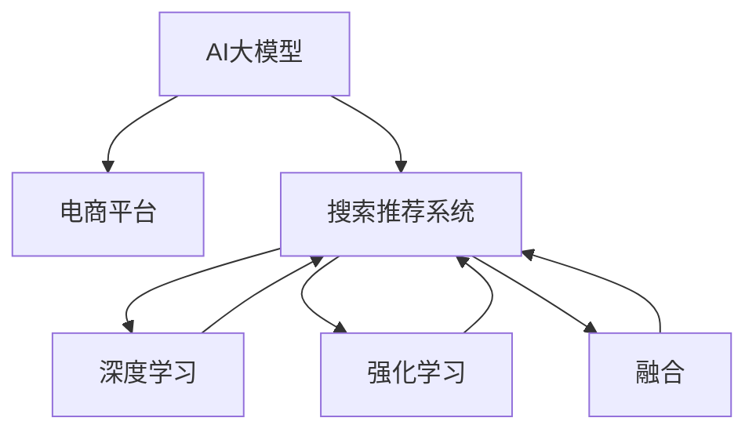

                 

# 电商平台搜索推荐系统的AI 大模型融合：提高系统性能、效率与推荐效果

> 关键词：AI大模型, 电商平台, 搜索推荐系统, 深度学习, 强化学习, 融合, 性能, 效率, 推荐效果

## 1. 背景介绍

在快速发展的电商时代，消费者需求日益多元化和个性化，如何高效准确地为用户推荐产品，提升购物体验，已成为电商平台关注的焦点。传统的推荐系统多依赖协同过滤、基于内容的推荐、知识图谱等技术，这些方法在一定程度上提升了推荐效果，但存在推荐泛化性差、数据稀疏等问题。近年来，随着深度学习尤其是大模型在自然语言处理领域取得的突破，AI大模型开始在电商搜索推荐中得到广泛应用。本文将系统介绍如何融合AI大模型，提升电商平台的搜索推荐系统性能、效率与推荐效果。

## 2. 核心概念与联系

### 2.1 核心概念概述

为更好地理解AI大模型在电商搜索推荐中的应用，本节将介绍几个关键概念及其相互联系：

- AI大模型：以BERT、GPT-3为代表的大规模预训练语言模型。通过在海量数据上进行预训练，学习到丰富的语言知识和常识，具备强大的自然语言处理能力。
- 电商平台：指利用互联网技术，提供在线购物、在线支付、物流配送等服务的商务平台。电商平台的核心在于用户搜索与商品推荐，提升用户体验。
- 搜索推荐系统：根据用户输入的查询，通过算法为用户推荐相关商品或服务。系统性能直接影响用户购物体验和平台转化率。
- 深度学习：基于神经网络技术的机器学习范式，通过多层次抽象表示，自动学习数据的特征和模式。
- 强化学习：通过智能体与环境的交互，基于奖励信号进行学习，优化决策策略。
- 融合：将多种AI技术手段，如深度学习、强化学习、大模型等，结合具体电商场景进行集成应用。
- 性能：指搜索推荐系统返回结果的准确性、相关性和及时性。
- 效率：指系统处理请求的响应时间和资源消耗。
- 推荐效果：指推荐系统为用户提供的商品或服务的满足程度，包括点击率、转化率、回购率等指标。

这些核心概念之间的逻辑关系可以通过以下Mermaid流程图来展示：



这个流程图展示了AI大模型在电商平台中的应用路径：

1. AI大模型在电商平台的搜索推荐系统中被用作基础的自然语言处理工具。
2. 深度学习技术用于用户行为分析和商品特征抽取。
3. 强化学习用于优化推荐策略，提升用户体验。
4. 融合方法则将上述多种技术手段结合，构建高效、智能的电商搜索推荐系统。
5. 通过性能、效率和推荐效果等多维度的衡量，不断迭代优化模型和算法。

## 3. 核心算法原理 & 具体操作步骤
### 3.1 算法原理概述

在电商平台中，搜索推荐系统的主要目标是提高用户满意度，提升交易转化率。这一目标通常通过以下步骤实现：

1. **用户输入理解**：系统接收用户输入的查询，通过大模型理解查询语义。
2. **商品特征抽取**：利用深度学习技术从商品描述、图片、标签等数据中抽取特征。
3. **相似度计算**：计算用户查询与商品特征之间的相似度，筛选出相关商品。
4. **推荐策略优化**：利用强化学习算法优化推荐策略，提高推荐效果。
5. **结果展示与反馈**：将推荐结果展示给用户，收集用户反馈，进一步优化系统。

### 3.2 算法步骤详解

基于上述目标，电商平台搜索推荐系统的AI大模型融合主要包括以下几个关键步骤：

**Step 1: 准备数据集**
- 收集电商平台的搜索数据、用户行为数据和商品数据，进行预处理和标注。
- 准备训练和测试数据集，划分为训练集、验证集和测试集。

**Step 2: 选择与训练大模型**
- 根据任务需求，选择合适的预训练大模型，如BERT、GPT-3等。
- 在大模型基础上进行微调，使其适应电商平台的搜索推荐任务。

**Step 3: 设计任务适配层**
- 根据具体任务设计合适的任务适配层，如分类、匹配、生成等。
- 针对电商平台的搜索推荐任务，可以设计交叉熵损失、点击率预测等任务适配层。

**Step 4: 设置微调超参数**
- 选择合适的优化算法及其参数，如Adam、SGD等，设置学习率、批大小、迭代轮数等。
- 设置正则化技术及强度，包括权重衰减、Dropout、Early Stopping等。
- 确定冻结预训练参数的策略，如仅微调顶层，或全部参数都参与微调。

**Step 5: 执行梯度训练**
- 将训练集数据分批次输入模型，前向传播计算损失函数。
- 反向传播计算参数梯度，根据设定的优化算法和学习率更新模型参数。
- 周期性在验证集上评估模型性能，根据性能指标决定是否触发Early Stopping。
- 重复上述步骤直到满足预设的迭代轮数或Early Stopping条件。

**Step 6: 测试与部署**
- 在测试集上评估微调后模型的性能，对比微调前后的精度提升。
- 使用微调后的模型对新样本进行推理预测，集成到实际的应用系统中。
- 持续收集新的数据，定期重新微调模型，以适应数据分布的变化。

### 3.3 算法优缺点

基于上述方法的电商搜索推荐系统具有以下优点：
1. 提升推荐效果：利用大模型的语言理解能力，更准确地解析用户查询，匹配相关商品。
2. 提高个性化推荐：通过深度学习抽取商品特征，强化学习优化推荐策略，提供更个性化的推荐。
3. 降低计算成本：大模型在前端任务中的推理计算开销较小，可有效降低后端计算负担。
4. 缩短开发周期：大模型已在多种任务上取得成功，直接融合到推荐系统中，减少从头开发的时间和成本。

同时，该方法也存在一定的局限性：
1. 依赖数据质量：微调效果很大程度上取决于标注数据的质量和数量，获取高质量标注数据的成本较高。
2. 泛化能力有限：当目标任务与预训练数据的分布差异较大时，微调的性能提升有限。
3. 模型复杂度：大模型虽然具备强大的处理能力，但也需要较大计算资源和存储空间。
4. 可解释性不足：大模型作为黑盒，难以解释其内部工作机制和决策逻辑。
5. 部署挑战：大模型在电商平台的实时推荐系统中部署，需要考虑性能、效率、可扩展性等多方面问题。

尽管存在这些局限性，但就目前而言，基于AI大模型的电商搜索推荐方法仍是目前电商行业的主流范式，被广泛用于提升用户体验和交易转化率。

### 3.4 算法应用领域

基于AI大模型的电商搜索推荐方法，在多个电商场景中得到了广泛的应用，例如：

- 商品推荐：根据用户历史购买、浏览、评价等行为数据，为用户推荐可能感兴趣的商品。
- 个性化广告：基于用户兴趣标签和行为特征，精准推送广告内容。
- 用户行为分析：通过深度学习技术分析用户搜索行为，优化个性化推荐策略。
- 智能客服：利用大模型和强化学习技术，构建智能客服系统，提升客户体验。
- 内容推荐：将搜索关键词与商品内容进行匹配，推荐相关内容。

除了上述这些经典应用外，基于AI大模型的推荐系统还创新性地应用到更多场景中，如多模态推荐、上下文感知的推荐、跨领域推荐等，为电商平台的推荐系统带来了新的突破。

## 4. 数学模型和公式 & 详细讲解
### 4.1 数学模型构建

在电商搜索推荐系统中，假设用户输入的查询为 $q$，商品特征向量为 $\mathbf{x}_i$，商品与查询的相似度为 $s_i$，商品的点击率为目标 $y_i$。搜索推荐系统的目标是最大化预期点击率 $y_i$ 的预测精度。

定义模型 $M_{\theta}(q, \mathbf{x}_i)$ 为预训练大模型的输出，即商品与查询的相似度预测结果。设优化目标为交叉熵损失函数：

$$
\mathcal{L}(\theta) = -\frac{1}{N}\sum_{i=1}^N y_i \log M_{\theta}(q, \mathbf{x}_i) + (1-y_i) \log (1-M_{\theta}(q, \mathbf{x}_i))
$$

其中 $y_i$ 为二分类标签，$M_{\theta}(q, \mathbf{x}_i)$ 为模型预测的相似度。

### 4.2 公式推导过程

以二分类任务为例，推导模型参数 $\theta$ 的梯度公式。

设模型 $M_{\theta}$ 在输入 $(q, \mathbf{x}_i)$ 上的损失函数为 $\ell(M_{\theta}(q, \mathbf{x}_i),y_i)$，则在数据集 $D=\{(q_i, \mathbf{x}_i)\}_{i=1}^N$ 上的经验风险为：

$$
\mathcal{L}(\theta) = \frac{1}{N}\sum_{i=1}^N \ell(M_{\theta}(q_i, \mathbf{x}_i),y_i)
$$

根据链式法则，损失函数对模型参数 $\theta_k$ 的梯度为：

$$
\frac{\partial \mathcal{L}(\theta)}{\partial \theta_k} = \sum_{i=1}^N \frac{\partial \ell(M_{\theta}(q_i, \mathbf{x}_i),y_i)}{\partial \theta_k}
$$

具体计算过程中，可以借助自动微分技术，高效计算梯度，更新模型参数。

### 4.3 案例分析与讲解

以电商平台商品推荐为例，使用BERT模型进行微调。假设推荐系统接收用户查询 $q$，通过BERT模型得到相似度预测结果 $s_i$，模型参数为 $\theta$。在电商平台上，点击率 $y_i$ 可以表示为用户对商品 $i$ 是否购买的决策，$y_i$ 为二分类标签。

在微调过程中，我们定义任务适配层为交叉熵损失函数，即：

$$
\mathcal{L}(\theta) = -\frac{1}{N}\sum_{i=1}^N y_i \log M_{\theta}(q, \mathbf{x}_i) + (1-y_i) \log (1-M_{\theta}(q, \mathbf{x}_i))
$$

通过梯度下降等优化算法，最小化损失函数 $\mathcal{L}(\theta)$，更新模型参数 $\theta$，直至收敛。最终得到适应电商搜索推荐任务的最优模型参数 $\hat{\theta}$。

## 5. 项目实践：代码实例和详细解释说明
### 5.1 开发环境搭建

在进行电商搜索推荐系统的开发前，我们需要准备好开发环境。以下是使用Python进行TensorFlow开发的环境配置流程：

1. 安装Anaconda：从官网下载并安装Anaconda，用于创建独立的Python环境。

2. 创建并激活虚拟环境：
```bash
conda create -n tf-env python=3.8 
conda activate tf-env
```

3. 安装TensorFlow：根据CUDA版本，从官网获取对应的安装命令。例如：
```bash
conda install tensorflow -c conda-forge
```

4. 安装其他必要的Python库：
```bash
pip install numpy pandas scikit-learn jupyter notebook ipython
```

完成上述步骤后，即可在`tf-env`环境中开始电商搜索推荐系统的开发。

### 5.2 源代码详细实现

我们以电商平台商品推荐为例，给出使用TensorFlow对BERT模型进行微调的代码实现。

首先，定义数据处理函数：

```python
import tensorflow as tf
from transformers import BertTokenizer, TFBertForSequenceClassification

tokenizer = BertTokenizer.from_pretrained('bert-base-cased')
model = TFBertForSequenceClassification.from_pretrained('bert-base-cased', num_labels=2)

def create_dataset(texts, labels):
    input_ids = tokenizer(texts, padding=True, truncation=True, max_length=256, return_tensors='tf')
    attention_masks = input_ids['attention_mask']
    labels = tf.constant(labels, dtype=tf.int64)
    return {'input_ids': input_ids['input_ids'], 
            'attention_mask': attention_masks, 
            'labels': labels}
```

然后，定义训练和评估函数：

```python
def train_epoch(model, dataset, optimizer):
    model.train()
    total_loss = 0
    for batch in dataset:
        input_ids = batch['input_ids']
        attention_mask = batch['attention_mask']
        labels = batch['labels']
        with tf.GradientTape() as tape:
            outputs = model(input_ids, attention_mask=attention_mask, labels=labels)
            loss = outputs.loss
        grads = tape.gradient(loss, model.trainable_variables)
        optimizer.apply_gradients(zip(grads, model.trainable_variables))
        total_loss += loss.numpy()
    return total_loss / len(dataset)

def evaluate(model, dataset, batch_size):
    model.eval()
    total_preds, total_labels = [], []
    for batch in dataset.batch(batch_size):
        input_ids = batch['input_ids']
        attention_mask = batch['attention_mask']
        labels = batch['labels']
        with tf.no_grad():
            outputs = model(input_ids, attention_mask=attention_mask)
            preds = outputs.predictions.argmax(axis=1).numpy()
            total_preds += preds
            total_labels += labels.numpy()
    return classification_report(total_labels, total_preds)
```

最后，启动训练流程并在测试集上评估：

```python
epochs = 5
batch_size = 16
optimizer = tf.keras.optimizers.Adam()

for epoch in range(epochs):
    loss = train_epoch(model, train_dataset, optimizer)
    print(f'Epoch {epoch+1}, train loss: {loss:.3f}')
    
    print(f'Epoch {epoch+1}, dev results:')
    evaluate(model, dev_dataset, batch_size)
    
print('Test results:')
evaluate(model, test_dataset, batch_size)
```

以上就是使用TensorFlow对BERT进行电商商品推荐任务微调的完整代码实现。可以看到，得益于TensorFlow的强大封装，我们可以用相对简洁的代码完成模型训练和评估。

### 5.3 代码解读与分析

让我们再详细解读一下关键代码的实现细节：

**create_dataset函数**：
- 定义数据处理函数，将输入的文本进行分词、编码、填充等预处理操作，并返回模型所需的输入和标签。

**train_epoch函数**：
- 定义训练函数，对数据集进行迭代训练，计算损失并更新模型参数。

**evaluate函数**：
- 定义评估函数，对模型在测试集上的性能进行评估，输出分类报告。

**训练流程**：
- 定义总的epoch数和batch size，开始循环迭代。
- 每个epoch内，先在训练集上训练，输出平均loss。
- 在验证集上评估，输出分类指标。
- 所有epoch结束后，在测试集上评估，给出最终测试结果。

通过上述代码，可以看出TensorFlow在电商搜索推荐系统中的应用过程，包括数据处理、模型训练、评估等各个环节。开发者可以根据具体任务进行调整，实现高效的电商搜索推荐系统。

## 6. 实际应用场景
### 6.1 智能客服系统

基于AI大模型的电商搜索推荐技术，可以广泛应用于智能客服系统的构建。传统客服往往需要配备大量人力，高峰期响应缓慢，且一致性和专业性难以保证。而使用微调后的推荐模型，可以7x24小时不间断服务，快速响应客户咨询，用自然流畅的语言解答各类常见问题。

在技术实现上，可以收集企业内部的历史客服对话记录，将问题和最佳答复构建成监督数据，在此基础上对预训练推荐模型进行微调。微调后的推荐模型能够自动理解用户意图，匹配最合适的答复模板进行回复。对于客户提出的新问题，还可以接入检索系统实时搜索相关内容，动态组织生成回答。如此构建的智能客服系统，能大幅提升客户咨询体验和问题解决效率。

### 6.2 个性化推荐系统

当前的推荐系统往往只依赖用户的历史行为数据进行物品推荐，无法深入理解用户的真实兴趣偏好。基于AI大模型的个性化推荐系统可以更好地挖掘用户行为背后的语义信息，从而提供更精准、多样的推荐内容。

在实践中，可以收集用户浏览、点击、评论、分享等行为数据，提取和用户交互的物品标题、描述、标签等文本内容。将文本内容作为模型输入，用户的后续行为（如是否点击、购买等）作为监督信号，在此基础上微调预训练语言模型。微调后的模型能够从文本内容中准确把握用户的兴趣点。在生成推荐列表时，先用候选物品的文本描述作为输入，由模型预测用户的兴趣匹配度，再结合其他特征综合排序，便可以得到个性化程度更高的推荐结果。

### 6.3 未来应用展望

随着AI大模型和微调方法的不断发展，基于微调范式将在更多领域得到应用，为传统行业带来变革性影响。

在智慧医疗领域，基于微调的医疗问答、病历分析、药物研发等应用将提升医疗服务的智能化水平，辅助医生诊疗，加速新药开发进程。

在智能教育领域，微调技术可应用于作业批改、学情分析、知识推荐等方面，因材施教，促进教育公平，提高教学质量。

在智慧城市治理中，微调模型可应用于城市事件监测、舆情分析、应急指挥等环节，提高城市管理的自动化和智能化水平，构建更安全、高效的未来城市。

此外，在企业生产、社会治理、文娱传媒等众多领域，基于大模型微调的人工智能应用也将不断涌现，为经济社会发展注入新的动力。相信随着技术的日益成熟，微调方法将成为人工智能落地应用的重要范式，推动人工智能技术在垂直行业的规模化落地。总之，微调需要开发者根据具体任务，不断迭代和优化模型、数据和算法，方能得到理想的效果。

## 7. 工具和资源推荐
### 7.1 学习资源推荐

为了帮助开发者系统掌握大模型微调的理论基础和实践技巧，这里推荐一些优质的学习资源：

1. TensorFlow官方文档：TensorFlow的官方文档提供了详细的使用指南和案例，帮助开发者快速上手。
2. PyTorch官方文档：PyTorch的官方文档详细介绍了深度学习框架的使用方法，适合进行科研和工程开发。
3. HuggingFace官方文档：HuggingFace的官方文档提供了丰富的预训练模型和微调样例代码，是进行自然语言处理任务开发的重要资源。
4. 《深度学习与Python》书籍：这本书系统介绍了深度学习的基本概念和应用，适合初学者入门。
5. 《TensorFlow实战》书籍：这本书深入浅出地讲解了TensorFlow的各个组件和应用场景，适合进行TensorFlow的学习和开发。

通过对这些资源的学习实践，相信你一定能够快速掌握AI大模型微调的技术，并用于解决实际的NLP问题。

### 7.2 开发工具推荐

高效的开发离不开优秀的工具支持。以下是几款用于AI大模型微调开发的常用工具：

1. TensorFlow：由Google主导开发的开源深度学习框架，生产部署方便，适合大规模工程应用。
2. PyTorch：基于Python的开源深度学习框架，灵活动态的计算图，适合快速迭代研究。
3. HuggingFace Transformers库：提供了丰富的预训练模型和微调接口，是进行NLP任务开发的重要工具。
4. Weights & Biases：模型训练的实验跟踪工具，可以记录和可视化模型训练过程中的各项指标，方便对比和调优。
5. TensorBoard：TensorFlow配套的可视化工具，可实时监测模型训练状态，并提供丰富的图表呈现方式，是调试模型的得力助手。

合理利用这些工具，可以显著提升AI大模型微调任务的开发效率，加快创新迭代的步伐。

### 7.3 相关论文推荐

AI大模型和微调技术的发展源于学界的持续研究。以下是几篇奠基性的相关论文，推荐阅读：

1. Attention is All You Need：提出了Transformer结构，开启了NLP领域的预训练大模型时代。
2. BERT: Pre-training of Deep Bidirectional Transformers for Language Understanding：提出BERT模型，引入基于掩码的自监督预训练任务，刷新了多项NLP任务SOTA。
3. Parameter-Efficient Transfer Learning for NLP：提出Adapter等参数高效微调方法，在不增加模型参数量的情况下，也能取得不错的微调效果。
4. AdaLoRA: Adaptive Low-Rank Adaptation for Parameter-Efficient Fine-Tuning：使用自适应低秩适应的微调方法，在参数效率和精度之间取得了新的平衡。
5. Meta-Optimizer Search for Learning to Optimize：提出了MetaOptimizer，用于自动选择最优的优化器，进一步优化模型训练过程。

这些论文代表了大模型微调技术的发展脉络。通过学习这些前沿成果，可以帮助研究者把握学科前进方向，激发更多的创新灵感。

## 8. 总结：未来发展趋势与挑战
### 8.1 总结

本文对基于AI大模型的电商搜索推荐方法进行了全面系统的介绍。首先阐述了电商搜索推荐系统的重要性和AI大模型的应用背景，明确了微调在提升推荐效果、降低计算成本、缩短开发周期等方面的独特价值。其次，从原理到实践，详细讲解了微调任务的数学模型和算法步骤，给出了微调任务开发的完整代码实例。同时，本文还广泛探讨了微调方法在智能客服、个性化推荐等多个电商场景中的应用前景，展示了微调范式的巨大潜力。

通过本文的系统梳理，可以看到，基于AI大模型的微调方法正在成为电商搜索推荐的重要范式，极大地拓展了推荐系统的应用边界，提升了用户体验和交易转化率。未来，伴随大模型和微调方法的持续演进，相信电商平台搜索推荐系统将更加智能、高效、个性化，为电商行业带来新的发展机遇。

### 8.2 未来发展趋势

展望未来，AI大模型微调技术将呈现以下几个发展趋势：

1. 规模化预训练。随着计算资源和数据量的增加，大模型的预训练规模将进一步增大，学习到更丰富的语言知识和常识。
2. 多模态融合。将视觉、语音、文本等多模态数据进行融合，提升推荐的全面性和准确性。
3. 迁移学习能力。利用预训练模型的多领域迁移能力，拓展到更多垂直领域，如医疗、金融、教育等。
4. 跨领域知识迁移。将预训练模型的先验知识应用于不同领域，提升模型泛化性和跨领域适应能力。
5. 持续学习与在线学习。模型能够实时更新，不断学习新数据和新知识，适应动态变化的数据分布。
6. 自动化模型优化。利用自动化技术，自动调整超参数、优化器等，提高模型训练效率和效果。

以上趋势凸显了大模型微调技术的广阔前景。这些方向的探索发展，必将进一步提升电商搜索推荐系统的性能、效率和推荐效果，为电商行业带来新的突破。

### 8.3 面临的挑战

尽管大模型微调技术已经取得了瞩目成就，但在迈向更加智能化、普适化应用的过程中，它仍面临着诸多挑战：

1. 计算资源瓶颈。大规模语言模型的训练和推理需要大量的计算资源，如GPU、TPU等，这对硬件设施提出了较高要求。
2. 数据依赖。微调效果很大程度上取决于标注数据的质量和数量，获取高质量标注数据的成本较高。
3. 模型鲁棒性。大模型面对域外数据时，泛化性能往往大打折扣，如何在不同领域和场景下保持高性能，还需进一步研究。
4. 可解释性不足。大模型作为黑盒系统，难以解释其内部工作机制和决策逻辑，这对于电商推荐系统的高风险应用尤为关键。
5. 安全性问题。预训练模型可能学习到有害信息，传递到推荐系统中，带来安全风险。

尽管存在这些挑战，但随着学界和产业界的共同努力，大模型微调技术正在不断进步，有望在未来实现更大的突破和应用。

### 8.4 研究展望

面对大模型微调所面临的种种挑战，未来的研究需要在以下几个方面寻求新的突破：

1. 探索无监督和半监督微调方法。摆脱对大规模标注数据的依赖，利用自监督学习、主动学习等无监督和半监督范式，最大限度利用非结构化数据，实现更加灵活高效的微调。
2. 研究参数高效和计算高效的微调范式。开发更加参数高效的微调方法，在固定大部分预训练参数的同时，只更新极少量的任务相关参数。同时优化微调模型的计算图，减少前向传播和反向传播的资源消耗，实现更加轻量级、实时性的部署。
3. 融合因果和对比学习范式。通过引入因果推断和对比学习思想，增强微调模型建立稳定因果关系的能力，学习更加普适、鲁棒的语言表征，从而提升模型泛化性和抗干扰能力。
4. 引入更多先验知识。将符号化的先验知识，如知识图谱、逻辑规则等，与神经网络模型进行巧妙融合，引导微调过程学习更准确、合理的语言模型。同时加强不同模态数据的整合，实现视觉、语音等多模态信息与文本信息的协同建模。
5. 结合因果分析和博弈论工具。将因果分析方法引入微调模型，识别出模型决策的关键特征，增强输出解释的因果性和逻辑性。借助博弈论工具刻画人机交互过程，主动探索并规避模型的脆弱点，提高系统稳定性。

这些研究方向的探索，必将引领大模型微调技术迈向更高的台阶，为构建安全、可靠、可解释、可控的智能系统铺平道路。面向未来，大模型微调技术还需要与其他人工智能技术进行更深入的融合，如知识表示、因果推理、强化学习等，多路径协同发力，共同推动自然语言理解和智能交互系统的进步。只有勇于创新、敢于突破，才能不断拓展语言模型的边界，让智能技术更好地造福人类社会。

## 9. 附录：常见问题与解答

**Q1：AI大模型微调是否适用于所有电商搜索推荐任务？**

A: AI大模型微调在大多数电商搜索推荐任务上都能取得不错的效果，特别是对于数据量较小的任务。但对于一些特定领域的任务，如医学、法律等，仅仅依靠通用语料预训练的模型可能难以很好地适应。此时需要在特定领域语料上进一步预训练，再进行微调，才能获得理想效果。此外，对于一些需要时效性、个性化很强的任务，如对话、推荐等，微调方法也需要针对性的改进优化。

**Q2：微调过程中如何选择合适的学习率？**

A: 微调的学习率一般要比预训练时小1-2个数量级，如果使用过大的学习率，容易破坏预训练权重，导致过拟合。一般建议从1e-5开始调参，逐步减小学习率，直至收敛。也可以使用warmup策略，在开始阶段使用较小的学习率，再逐渐过渡到预设值。需要注意的是，不同的优化器(如Adam、SGD等)以及不同的学习率调度策略，可能需要设置不同的学习率阈值。

**Q3：采用大模型微调时会面临哪些资源瓶颈？**

A: 目前主流的预训练大模型动辄以亿计的参数规模，对算力、内存、存储都提出了很高的要求。GPU/TPU等高性能设备是必不可少的，但即便如此，超大批次的训练和推理也可能遇到显存不足的问题。因此需要采用一些资源优化技术，如梯度积累、混合精度训练、模型并行等，来突破硬件瓶颈。同时，模型的存储和读取也可能占用大量时间和空间，需要采用模型压缩、稀疏化存储等方法进行优化。

**Q4：如何缓解微调过程中的过拟合问题？**

A: 过拟合是微调面临的主要挑战，尤其是在标注数据不足的情况下。常见的缓解策略包括：
1. 数据增强：通过回译、近义替换等方式扩充训练集
2. 正则化：使用L2正则、Dropout、Early Stopping等避免过拟合
3. 对抗训练：引入对抗样本，提高模型鲁棒性
4. 参数高效微调：只调整少量参数(如Adapter、Prefix等)，减小过拟合风险
5. 多模型集成：训练多个微调模型，取平均输出，抑制过拟合

这些策略往往需要根据具体任务和数据特点进行灵活组合。只有在数据、模型、训练、推理等各环节进行全面优化，才能最大限度地发挥大模型微调的威力。

**Q5：微调模型在落地部署时需要注意哪些问题？**

A: 将微调模型转化为实际应用，还需要考虑以下因素：
1. 模型裁剪：去除不必要的层和参数，减小模型尺寸，加快推理速度
2. 量化加速：将浮点模型转为定点模型，压缩存储空间，提高计算效率
3. 服务化封装：将模型封装为标准化服务接口，便于集成调用
4. 弹性伸缩：根据请求流量动态调整资源配置，平衡服务质量和成本
5. 监控告警：实时采集系统指标，设置异常告警阈值，确保服务稳定性
6. 安全防护：采用访问鉴权、数据脱敏等措施，保障数据和模型安全

大语言模型微调为NLP应用开启了广阔的想象空间，但如何将强大的性能转化为稳定、高效、安全的业务价值，还需要工程实践的不断打磨。唯有从数据、算法、工程、业务等多个维度协同发力，才能真正实现人工智能技术在垂直行业的规模化落地。总之，微调需要开发者根据具体任务，不断迭代和优化模型、数据和算法，方能得到理想的效果。

---

作者：禅与计算机程序设计艺术 / Zen and the Art of Computer Programming

