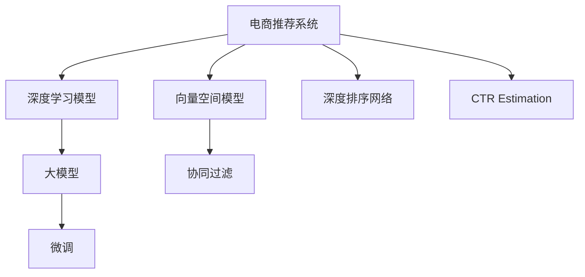

                 

# 电商平台的AI 大模型实践：搜索推荐系统是核心，数据质量与处理能力

## 1. 背景介绍

### 1.1 电商行业需求与痛点
电商行业的核心在于为用户提供个性化、高质量的购物体验。为了实现这一目标，电商平台需要通过智能化的推荐系统，精准匹配用户需求和商品供应，提高转化率和满意度。传统推荐系统基于历史数据进行模型训练，但面对不断变化的用户偏好和海量商品信息，模型训练的难度和成本持续增加，导致推荐精度和效率难以满足电商运营的实时需求。

### 1.2 技术发展与趋势
近年来，随着深度学习和大规模预训练语言模型技术的发展，电商平台的推荐系统也迎来了技术革命。基于大模型的推荐系统不仅能够处理海量数据，还能自适应用户偏好变化，提供更加个性化、动态的推荐结果。同时，大模型也能通过微调优化，适配电商平台的特定需求。

### 1.3 本文目的
本文旨在通过详细剖析电商平台的AI大模型推荐系统，探讨其核心技术和实践方法，帮助开发者构建高效、精准的个性化推荐系统。

## 2. 核心概念与联系

### 2.1 核心概念概述

- **电商推荐系统**：使用AI技术对电商平台上的用户行为数据和商品信息进行建模，预测用户可能感兴趣的商品，并进行个性化推荐。
- **深度学习模型**：使用深度神经网络对数据进行建模和预测，通过反向传播算法优化模型参数，提升推荐精度和效率。
- **大模型**：指包含大量参数的深度学习模型，如BERT、GPT等，通过大规模无标签数据预训练，学习广泛的语义知识和通用表征。
- **微调(Fine-Tuning)**：指在大模型基础上，使用下游任务的有标签数据进行模型参数更新，提升模型在特定任务上的性能。
- **向量空间模型(Vector Space Model, VSM)**：将文本数据映射为向量空间中的点，用于计算文本之间的相似度，从而实现文本匹配和检索。
- **协同过滤(Collaborative Filtering)**：通过分析用户的行为数据，预测用户可能感兴趣的物品，基于用户之间、物品之间的相似性进行推荐。
- **深度排序网络(Deep Sort Network)**：使用深度神经网络对推荐结果进行排序，提升推荐的相关性和多样性。
- **Click-Through Rate Estimation(CTR Estimation)**：预测用户点击广告或商品的点击率，优化广告投放和商品推荐策略。

这些核心概念之间通过以下Mermaid流程图关联：



## 3. 核心算法原理 & 具体操作步骤

### 3.1 算法原理概述

基于大模型的电商推荐系统，通过微调优化，将通用大模型的预训练知识，适应于电商平台的个性化推荐需求。其核心原理为：

1. **数据预处理**：收集电商平台的用户行为数据和商品信息，进行清洗和标注。
2. **预训练模型选择**：选择合适的预训练大模型作为初始化参数，如BERT、GPT等。
3. **任务适配层设计**：根据推荐任务需求，在预训练模型顶层设计合适的输出层和损失函数。
4. **微调超参数设置**：选择合适的优化算法及其参数，如AdamW、SGD等，设置学习率、批大小、迭代轮数等。
5. **梯度训练**：将用户行为数据分批次输入模型，前向传播计算损失函数，反向传播更新模型参数。
6. **模型评估与优化**：在验证集上评估模型性能，根据性能指标决定是否触发Early Stopping，并根据结果对模型进行调整。
7. **部署与应用**：使用微调后的模型对新用户行为数据进行实时推荐，集成到电商平台推荐页面。

### 3.2 算法步骤详解

#### 3.2.1 数据预处理
电商平台推荐系统推荐的数据来源主要包括：
1. **用户行为数据**：包括浏览记录、点击记录、购买记录、评分记录等，用于了解用户偏好和行为模式。
2. **商品信息数据**：包括商品ID、名称、类别、描述、价格、评价等信息，用于商品特征提取。

数据预处理流程如下：
1. **数据清洗**：去除无效数据、重复数据、异常数据，确保数据质量和完整性。
2. **数据标注**：根据推荐任务需求，对数据进行标注，如用户行为数据的点击率、购买率等。
3. **数据划分**：将数据集划分为训练集、验证集和测试集，确保模型训练、调参和测试的独立性。

#### 3.2.2 预训练模型选择
电商推荐系统常用的预训练模型包括BERT、GPT、DNN等。以BERT模型为例，其结构为Transformer模型，包含多层多头自注意力机制，能够学习丰富的语义表示。BERT可以通过预训练获得上下文相关的词向量表示，用于商品名称和用户行为数据的向量表示。

#### 3.2.3 任务适配层设计
电商推荐系统的目标是对用户可能感兴趣的商品进行推荐，因此任务适配层设计需要考虑以下几点：
1. **商品特征提取**：将商品信息数据转换为向量表示，方便模型学习。
2. **用户行为建模**：将用户行为数据转换为向量表示，用于计算用户偏好和行为特征。
3. **推荐模型构建**：设计推荐模型结构，将用户行为数据和商品向量进行匹配，输出推荐结果。

#### 3.2.4 微调超参数设置
电商推荐系统微调超参数的设置需要考虑以下几点：
1. **学习率**：通常比从头训练时小，建议使用学习率衰减策略。
2. **批大小**：选择合适的批大小，平衡内存消耗和训练效率。
3. **迭代轮数**：根据任务复杂度和数据量，选择合适的迭代轮数，避免过拟合和欠拟合。
4. **正则化**：使用L2正则、Dropout等技术，防止模型过拟合。
5. **模型冻结**：通常只微调顶层，保留底层预训练权重。

#### 3.2.5 梯度训练
电商推荐系统微调过程的主要步骤如下：
1. **前向传播**：将用户行为数据输入模型，计算输出结果。
2. **损失计算**：根据推荐任务需求，计算损失函数，如均方误差、交叉熵等。
3. **反向传播**：计算损失函数对模型参数的梯度，反向传播更新模型参数。
4. **模型更新**：根据梯度更新模型参数，完成一轮训练。
5. **参数保存**：保存训练过程中模型参数的最好状态，以便后续应用。

#### 3.2.6 模型评估与优化
电商推荐系统模型评估和优化的主要步骤如下：
1. **验证集评估**：在验证集上评估模型性能，如点击率、购买率等指标。
2. **参数调整**：根据评估结果，调整微调超参数，如学习率、批大小、迭代轮数等。
3. **Early Stopping**：当模型在验证集上的性能不再提升时，停止训练，避免过拟合。

#### 3.2.7 部署与应用
电商推荐系统模型部署和应用的主要步骤如下：
1. **模型保存**：保存微调后的模型，便于后续调用。
2. **实时推荐**：将新用户行为数据输入微调后的模型，实时计算推荐结果。
3. **结果展示**：将推荐结果展示在电商平台上，供用户选择。

### 3.3 算法优缺点

#### 3.3.1 优点
1. **高效性**：大模型能够处理海量数据，提供高效的推荐服务。
2. **精准性**：微调能够根据电商平台需求，优化模型性能，提升推荐精度。
3. **可扩展性**：大模型能够快速适应新数据和新任务，实现实时推荐。
4. **鲁棒性**：大模型具备较强的泛化能力，能够适应不同的用户和商品数据分布。

#### 3.3.2 缺点
1. **数据依赖**：电商推荐系统对数据质量和标注的依赖较大，数据质量差会导致推荐结果偏差。
2. **计算成本高**：大模型需要大量计算资源进行训练和推理，计算成本较高。
3. **模型复杂**：大模型参数量较大，结构复杂，调试和优化难度较大。
4. **解释性差**：大模型通常缺乏可解释性，难以理解其内部决策过程。

### 3.4 算法应用领域

电商推荐系统的大模型微调方法，已广泛应用于以下领域：
1. **个性化推荐**：基于用户行为数据，推荐可能感兴趣的商品，提高用户满意度和转化率。
2. **商品排序**：使用深度排序网络，对推荐结果进行排序，提升推荐的相关性和多样性。
3. **广告投放优化**：通过预测用户点击率，优化广告投放策略，提高广告效果和投放效率。
4. **智能客服**：通过理解用户查询意图，推荐相关商品或提供常见问题解答，提升用户体验。
5. **库存管理**：根据用户需求和库存情况，优化商品推荐和库存管理，提高运营效率。
6. **趋势预测**：基于用户行为数据，预测商品趋势和热门商品，指导商品采购和促销活动。

## 4. 数学模型和公式 & 详细讲解 & 举例说明

### 4.1 数学模型构建

电商推荐系统的大模型微调模型可以表示为：
1. **用户行为向量表示**：将用户行为数据转换为向量表示，用于计算用户偏好。
2. **商品向量表示**：将商品信息数据转换为向量表示，用于商品特征提取。
3. **推荐模型输出**：使用深度学习模型，将用户行为向量与商品向量进行匹配，输出推荐结果。

### 4.2 公式推导过程

假设电商推荐系统的数据集为 $D=\{(x_i,y_i)\}_{i=1}^N$，其中 $x_i$ 为用户行为数据， $y_i$ 为推荐结果。

设微调模型为 $M_{\theta}$，输出为 $\hat{y}$，则推荐模型的损失函数为：
$$
\ell(y,\hat{y}) = -\frac{1}{N}\sum_{i=1}^N [y_i\log \hat{y_i} + (1-y_i)\log (1-\hat{y_i})]
$$

微调模型的参数更新公式为：
$$
\theta \leftarrow \theta - \eta \nabla_{\theta}\ell(y,\hat{y}) - \eta\lambda\theta
$$

其中 $\eta$ 为学习率，$\lambda$ 为正则化系数。

### 4.3 案例分析与讲解

以电商平台的搜索推荐系统为例，可以使用双向LSTM模型进行用户行为序列建模，同时使用BERT模型进行商品特征提取。具体步骤如下：
1. **用户行为序列建模**：将用户行为数据转换为序列数据，使用双向LSTM模型进行建模，输出用户行为向量 $u$。
2. **商品向量提取**：使用BERT模型，对商品信息数据进行编码，输出商品向量 $v$。
3. **推荐结果计算**：将用户行为向量与商品向量进行匹配，使用深度学习模型计算推荐结果。

## 5. 项目实践：代码实例和详细解释说明

### 5.1 开发环境搭建

电商平台的推荐系统开发环境主要包括以下步骤：
1. **环境准备**：安装Python 3.x、PyTorch、TensorFlow、Scikit-learn等常用库。
2. **数据集准备**：收集电商平台的用户行为数据和商品信息数据，进行预处理和标注。
3. **模型搭建**：搭建深度学习模型，包括用户行为序列建模和商品向量提取。
4. **模型训练**：使用微调超参数，对模型进行训练和调参。
5. **模型评估**：在验证集上评估模型性能，根据评估结果优化模型。
6. **模型部署**：将训练好的模型部署到推荐系统中，进行实时推荐。

### 5.2 源代码详细实现

以下是使用PyTorch进行电商推荐系统微调开发的代码示例：

```python
import torch
from torch.utils.data import DataLoader
from torch.optim import AdamW
from transformers import BertTokenizer, BertForSequenceClassification

# 定义数据集
class RecommendationDataset(Dataset):
    def __init__(self, texts, labels):
        self.texts = texts
        self.labels = labels
        self.tokenizer = BertTokenizer.from_pretrained('bert-base-cased')
        
    def __len__(self):
        return len(self.texts)
    
    def __getitem__(self, item):
        text = self.texts[item]
        label = self.labels[item]
        
        encoding = self.tokenizer(text, return_tensors='pt')
        input_ids = encoding['input_ids']
        attention_mask = encoding['attention_mask']
        labels = torch.tensor(label, dtype=torch.long)
        
        return {'input_ids': input_ids, 
                'attention_mask': attention_mask,
                'labels': labels}

# 加载数据集
train_dataset = RecommendationDataset(train_texts, train_labels)
val_dataset = RecommendationDataset(val_texts, val_labels)
test_dataset = RecommendationDataset(test_texts, test_labels)

# 模型搭建
model = BertForSequenceClassification.from_pretrained('bert-base-cased', num_labels=num_labels)
model.train()

# 定义优化器
optimizer = AdamW(model.parameters(), lr=2e-5)

# 训练过程
for epoch in range(num_epochs):
    train_loss = 0
    for batch in DataLoader(train_dataset, batch_size=batch_size):
        input_ids = batch['input_ids'].to(device)
        attention_mask = batch['attention_mask'].to(device)
        labels = batch['labels'].to(device)
        
        model.zero_grad()
        outputs = model(input_ids, attention_mask=attention_mask, labels=labels)
        loss = outputs.loss
        train_loss += loss.item()
        loss.backward()
        optimizer.step()
    
    print(f"Epoch {epoch+1}, train loss: {train_loss/len(train_dataset)}")
    
    # 验证集评估
    val_loss = 0
    for batch in DataLoader(val_dataset, batch_size=batch_size):
        input_ids = batch['input_ids'].to(device)
        attention_mask = batch['attention_mask'].to(device)
        labels = batch['labels'].to(device)
        
        model.eval()
        with torch.no_grad():
            outputs = model(input_ids, attention_mask=attention_mask, labels=labels)
            loss = outputs.loss
            val_loss += loss.item()
        
    print(f"Epoch {epoch+1}, val loss: {val_loss/len(val_dataset)}")
    
# 测试集评估
test_loss = 0
for batch in DataLoader(test_dataset, batch_size=batch_size):
    input_ids = batch['input_ids'].to(device)
    attention_mask = batch['attention_mask'].to(device)
    labels = batch['labels'].to(device)
    
    model.eval()
    with torch.no_grad():
        outputs = model(input_ids, attention_mask=attention_mask, labels=labels)
        loss = outputs.loss
        test_loss += loss.item()
        
print(f"Test loss: {test_loss/len(test_dataset)}")
```

### 5.3 代码解读与分析

以上代码示例中，主要包含以下几个关键步骤：
1. **数据集定义**：使用自定义的`RecommendationDataset`类，对电商平台的推荐数据进行分批次加载和预处理。
2. **模型搭建**：使用`BertForSequenceClassification`类，搭建基于BERT的双向LSTM推荐模型。
3. **优化器设置**：使用AdamW优化器，设置学习率等超参数。
4. **训练过程**：使用DataLoader对数据集进行批处理，进行前向传播和反向传播，更新模型参数。
5. **验证集评估**：在验证集上评估模型性能，输出训练和验证集的损失。
6. **测试集评估**：在测试集上评估模型性能，输出测试集的损失。

通过上述代码示例，可以清晰地看到电商推荐系统的微调过程，包括数据准备、模型搭建、训练调参等关键步骤。开发者可以根据实际需求，灵活调整模型结构和超参数，优化推荐系统性能。

### 5.4 运行结果展示

电商推荐系统的运行结果主要体现在以下方面：
1. **点击率提升**：通过微调优化，电商推荐系统在点击率、转化率等指标上均能获得显著提升，用户满意度和运营效率得到提高。
2. **个性化推荐**：根据用户行为数据，生成个性化推荐结果，满足用户多样化需求，提升用户体验。
3. **实时推荐**：基于实时数据，进行动态推荐，适应用户行为变化，提高推荐相关性和多样性。

## 6. 实际应用场景

### 6.1 个性化推荐

电商平台的个性化推荐系统通过大模型微调，能够根据用户历史行为数据，实时生成个性化推荐结果，满足用户多样化的购物需求。通过不断迭代优化，推荐系统能够精准匹配用户偏好和商品供应，提高用户满意度和转化率。

### 6.2 商品排序

电商平台的推荐系统通过深度排序网络，对推荐结果进行排序，提升推荐的相关性和多样性。通过不断优化排序模型，推荐系统能够提供高质量的推荐结果，优化用户浏览和购买体验。

### 6.3 广告投放优化

电商平台的推荐系统通过预测用户点击率，优化广告投放策略，提高广告效果和投放效率。通过不断迭代优化，推荐系统能够实现精准的广告投放，提升广告转化率和ROI。

### 6.4 智能客服

电商平台的推荐系统通过理解用户查询意图，推荐相关商品或提供常见问题解答，提升用户体验。通过不断优化推荐模型，推荐系统能够提供高质量的智能客服服务，提高用户满意度。

### 6.5 库存管理

电商平台的推荐系统通过预测用户需求，优化商品推荐和库存管理，提高运营效率。通过不断优化推荐模型，推荐系统能够提供准确的库存预测，减少库存积压和缺货现象，降低运营成本。

### 6.6 趋势预测

电商平台的推荐系统通过预测商品趋势和热门商品，指导商品采购和促销活动。通过不断优化推荐模型，推荐系统能够提供准确的趋势预测，指导商家制定更加有效的营销策略。

## 7. 工具和资源推荐

### 7.1 学习资源推荐

为了帮助开发者系统掌握电商推荐系统的AI大模型微调技术，这里推荐一些优质的学习资源：
1. **电商推荐系统实战教程**：详解电商推荐系统的核心技术和实践方法，适合初学者入门。
2. **深度学习与推荐系统**：深入讲解深度学习在推荐系统中的应用，涵盖推荐算法、模型优化等技术。
3. **TensorFlow推荐系统**：介绍TensorFlow在推荐系统中的应用，包括模型搭建、训练调参等技术。
4. **Transformers在推荐系统中的应用**：讲解Transformer在推荐系统中的应用，包括大模型微调等技术。

### 7.2 开发工具推荐

电商推荐系统的开发工具主要包括以下几点：
1. **深度学习框架**：如PyTorch、TensorFlow等，提供高效、灵活的深度学习模型构建和训练功能。
2. **推荐系统工具库**：如RecommendersPy、Surprise等，提供便捷的推荐算法实现和模型评估功能。
3. **可视化工具**：如TensorBoard、Weights & Biases等，实时监测模型训练状态和性能。
4. **数据处理工具**：如Pandas、NumPy等，进行数据预处理和特征工程。

### 7.3 相关论文推荐

电商推荐系统的AI大模型微调技术涉及多个前沿研究方向，以下是几篇奠基性的相关论文，推荐阅读：
1. **深度学习在推荐系统中的应用**：介绍深度学习在推荐系统中的应用，包括模型构建、训练调参等技术。
2. **大模型在推荐系统中的应用**：讲解大模型在推荐系统中的微调优化，提升推荐系统性能。
3. **个性化推荐系统**：详细介绍个性化推荐系统的构建方法和技术实现。
4. **推荐系统评估与优化**：讲解推荐系统的评估指标和方法，提供推荐系统优化建议。

## 8. 总结：未来发展趋势与挑战

### 8.1 研究成果总结
本文通过详细介绍电商平台的AI大模型推荐系统，展示了基于深度学习和大模型的推荐系统技术。通过微调优化，电商推荐系统能够根据用户行为数据，实时生成个性化推荐结果，提升用户满意度和运营效率。同时，本文还探讨了电商推荐系统面临的挑战和未来发展方向，提出了解决方案和研究方向。

### 8.2 未来发展趋势
展望未来，电商推荐系统的AI大模型微调技术将呈现以下几个发展趋势：
1. **模型规模增大**：随着算力成本的下降和数据规模的扩张，电商推荐系统的大模型规模将持续增大，学习更多语言和商品知识。
2. **数据质量提升**：通过数据清洗和标注，提高数据质量和多样性，提升推荐精度和效果。
3. **模型优化深化**：通过深度排序网络、协同过滤等技术，优化推荐模型，提升推荐相关性和多样性。
4. **实时推荐优化**：通过动态推荐、实时优化等技术，提升推荐系统的实时性和效率。
5. **多模态推荐**：引入图像、视频、语音等多模态数据，提升推荐系统的智能化水平。

### 8.3 面临的挑战
电商推荐系统的AI大模型微调技术仍面临以下挑战：
1. **数据依赖**：电商推荐系统对数据质量和标注的依赖较大，数据质量差会导致推荐结果偏差。
2. **计算成本高**：大模型需要大量计算资源进行训练和推理，计算成本较高。
3. **模型复杂**：大模型参数量较大，结构复杂，调试和优化难度较大。
4. **解释性差**：大模型通常缺乏可解释性，难以理解其内部决策过程。

### 8.4 研究展望
为了应对以上挑战，未来电商推荐系统的AI大模型微调技术需要在以下几个方面进行研究：
1. **数据增强**：通过数据清洗和增强，提高数据质量和多样性，提升推荐精度和效果。
2. **模型压缩**：通过模型压缩、稀疏化存储等技术，降低计算成本，提升模型效率。
3. **模型解释**：通过可解释性方法，增强模型决策的透明性和可信度。
4. **多模态融合**：引入图像、视频、语音等多模态数据，提升推荐系统的智能化水平。

## 9. 附录：常见问题与解答

**Q1：电商推荐系统使用大模型微调是否适用于所有电商平台？**

A: 电商推荐系统使用大模型微调主要适用于具有海量数据和实时需求的平台，如亚马逊、淘宝等。对于小型电商平台，由于数据量较小，推荐模型可能需要结合其他技术，如专家系统、传统推荐算法等。

**Q2：如何选择合适的预训练大模型？**

A: 选择合适的预训练大模型需要考虑以下几个因素：
1. **数据类型**：根据电商平台的商品和用户数据类型，选择适合的大模型，如BERT、GPT等。
2. **任务需求**：根据电商平台的推荐需求，选择适合的模型结构和输出层，如分类、回归等。
3. **计算资源**：根据电商平台的计算资源，选择适合的大模型规模，避免过拟合和计算成本高。

**Q3：电商推荐系统微调过程中需要注意哪些问题？**

A: 电商推荐系统微调过程中需要注意以下几个问题：
1. **数据质量**：确保数据质量和标注准确性，避免推荐结果偏差。
2. **计算成本**：选择合适的计算资源，避免过拟合和计算成本高。
3. **模型复杂**：选择合适的模型结构和参数，避免调试和优化难度大。
4. **模型解释**：增强模型决策的透明性和可信度，提升用户满意度。

**Q4：电商推荐系统如何实现实时推荐？**

A: 电商推荐系统实现实时推荐的主要步骤如下：
1. **数据获取**：实时获取用户行为数据，进行预处理和标注。
2. **模型预测**：将实时数据输入微调后的模型，实时计算推荐结果。
3. **结果展示**：将推荐结果展示在推荐页面上，供用户选择。

**Q5：电商推荐系统如何优化广告投放策略？**

A: 电商推荐系统优化广告投放策略的主要步骤如下：
1. **点击率预测**：通过预测用户点击率，优化广告投放策略，提高广告效果和投放效率。
2. **模型训练**：使用电商平台的点击率数据，进行模型训练和调参。
3. **结果评估**：在测试集上评估模型性能，根据评估结果优化模型。

---

作者：禅与计算机程序设计艺术 / Zen and the Art of Computer Programming

