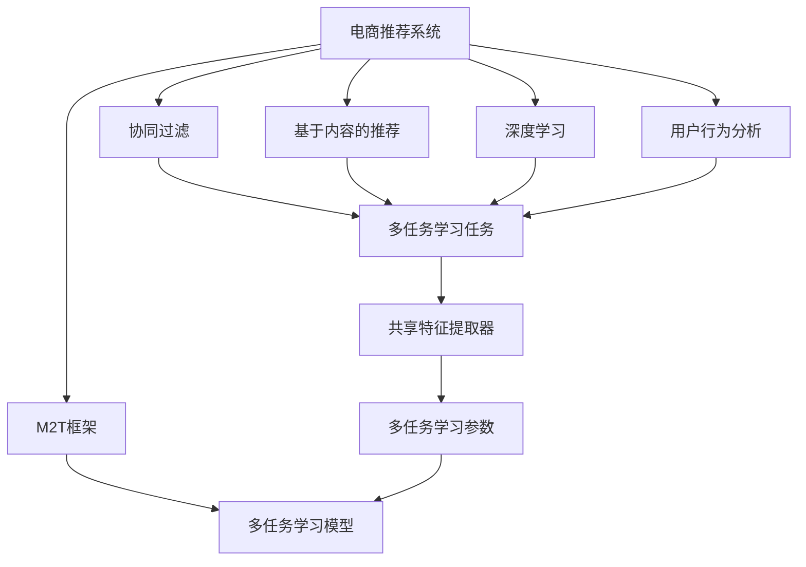

                 

# 电商推荐系统中的多任务学习框架

> 关键词：电商推荐系统,多任务学习,协同过滤,深度学习,用户行为分析,推荐算法,框架设计

## 1. 背景介绍

### 1.1 问题由来

随着电子商务的迅猛发展，电商平台已经积累了海量的用户行为数据和商品信息。如何通过这些数据为用户推荐感兴趣的商品，成为了各大电商平台关注的焦点。推荐系统通过个性化推荐提升用户体验，同时提高平台转化率、增加收益。推荐算法的核心在于构建用户商品交互行为模型，预测用户对商品的相关度和偏好，从而生成个性化的推荐列表。

传统的推荐系统以协同过滤和基于内容的推荐为主。协同过滤算法从用户历史行为数据中挖掘相似用户，基于用户-商品评分矩阵进行推荐。基于内容的推荐从商品属性中提取特征，计算用户与商品的相似度。这些方法简单易行，效果良好，但存在数据稀疏性、冷启动等问题。

近年来，深度学习技术在推荐系统中的应用逐渐增多。深度学习可以通过神经网络自动提取高维特征，建模复杂非线性关系，提升推荐效果。特别是基于用户-商品矩阵的矩阵分解、基于序列的RNN/LSTM等方法，已经被证明可以取得优秀的推荐精度。但深度学习模型通常参数量大、计算复杂，难以实时处理大规模数据。

为了更好地应对推荐系统的复杂性和多样性，近年来多任务学习(Multi-task Learning, MTL)框架应运而生。多任务学习可以同时解决多个相关但不同的任务，通过共享底层特征提取器，实现模型参数的高效复用，提升整体推荐效果。本文将深入探讨多任务学习在电商推荐系统中的应用，分析其原理、方法和应用效果，并给出实际代码实现。

### 1.2 问题核心关键点

多任务学习在电商推荐系统中的应用，关键点如下：

1. 数据源的多样性：电商推荐系统的数据来源多样，包括用户行为、商品属性、用户画像等。如何整合和利用这些数据源，构建统一的多任务学习框架，是关键问题之一。

2. 任务之间的相关性：电商推荐系统涉及的任务类型多样，如商品分类、相似度计算、点击率预测等。如何识别任务之间的相关性，共享底层特征，是实现高效多任务学习的关键。

3. 模型参数的复用：多任务学习通过共享模型参数，提升模型的泛化能力和效率。如何设计多任务学习模型，使不同任务之间参数复用合理，是模型设计的重要挑战。

4. 推荐效果的多样性：电商推荐系统需要考虑不同类型的推荐目标，如商品展示推荐、购物车推荐、个性化主页推荐等。如何通过多任务学习框架，满足不同推荐场景的需求，是实际应用中的难点。

5. 模型训练和部署：多任务学习模型通常规模较大，计算复杂。如何高效训练和部署模型，使其能够在电商平台上实时响应用户请求，是实际落地的重要因素。

本文将从背景、原理、方法和应用四个方面，系统探讨多任务学习在电商推荐系统中的应用。

## 2. 核心概念与联系

### 2.1 核心概念概述

为更好地理解多任务学习在电商推荐系统中的应用，本节将介绍几个密切相关的核心概念：

- 多任务学习(Multi-task Learning, MTL)：同时训练多个相关任务，共享底层特征提取器，提升模型泛化能力。常见的多任务学习框架包括M2T、MoT、MTL等。
- 协同过滤(Collaborative Filtering)：从用户行为数据中挖掘相似用户，推荐其喜欢的商品。协同过滤包括基于用户的协同过滤和基于物品的协同过滤。
- 基于内容的推荐(Content-Based Recommendation)：从商品属性中提取特征，计算用户与商品的相似度，推荐相似商品。
- 深度学习(Deep Learning)：使用神经网络对大规模数据进行深度建模，自动提取高维特征，提升推荐精度。
- 用户行为分析(User Behavior Analysis)：通过分析用户浏览、点击、购买等行为，挖掘用户偏好，指导推荐策略。
- 推荐算法(Recommendation Algorithm)：构建用户商品交互行为模型，预测用户对商品的相关度和偏好，生成推荐列表。
- 电商推荐系统(E-commerce Recommendation System)：构建电商平台用户个性化推荐系统，提升用户体验和平台收益。

这些核心概念之间的逻辑关系可以通过以下Mermaid流程图来展示：



这个流程图展示了两者的核心概念及其之间的联系：

1. 电商推荐系统以多种方法为主，包括协同过滤、基于内容推荐和深度学习。
2. 多任务学习框架可以将这些方法整合到一个框架中，提升整体推荐效果。
3. 多任务学习框架基于共享的特征提取器，通过共享参数提升模型的泛化能力。

## 3. 核心算法原理 & 具体操作步骤
### 3.1 算法原理概述

多任务学习在电商推荐系统中的应用，其核心思想是：通过构建统一的多任务学习框架，同时解决多个相关但不同的推荐任务，共享底层特征提取器，实现模型参数的高效复用，提升推荐效果。

具体来说，假设电商推荐系统需要解决的任务包括商品分类、相似度计算、点击率预测等。每个任务可以表示为 $y_t$，其中 $t$ 表示任务编号。多任务学习框架通过共享特征提取器 $f(\cdot)$，同时优化多个任务的损失函数，最终得到一个统一的模型 $M$，用于预测不同任务的输出。

以点击率预测为例，假设有 $N$ 个用户 $U$，每个用户有 $M$ 个历史行为 $B(u)$，可以表示为：

$$
B(u) = (b_{u1}, b_{u2}, ..., b_{uM})
$$

其中每个行为 $b_{um}$ 包含商品 ID 和时间戳。点击率预测任务的目标是预测用户 $u$ 在未来点击某商品的点击率 $y_u$，可以表示为：

$$
y_u = P(\text{click}|u)
$$

其他任务类似。多任务学习框架将不同任务联合优化，共享特征提取器 $f$，构建联合损失函数 $L$，可以表示为：

$$
L = \frac{1}{N} \sum_{u=1}^N \sum_{b_{um} \in B(u)} \ell(y_{um}, \hat{y}_{um})
$$

其中 $\ell$ 为损失函数，$\hat{y}_{um}$ 为模型预测的点击率。

### 3.2 算法步骤详解

基于多任务学习的电商推荐系统构建过程包括以下几个关键步骤：

**Step 1: 构建任务数据集**

- 收集电商平台的多种数据源，包括用户行为数据、商品属性数据、用户画像数据等。
- 对数据进行清洗和预处理，构建多个相关但不同的任务数据集。例如，商品分类任务的数据集为商品 ID、商品属性等；相似度计算任务的数据集为商品 ID、用户行为记录等。

**Step 2: 设计任务适配层**

- 针对每个任务设计适配层，用于提取特征并映射到特定任务空间。例如，商品分类任务可以使用卷积神经网络提取商品图像特征；相似度计算任务可以使用 RNN 提取用户行为序列特征。
- 设计共享的特征提取器 $f$，用于从原始输入中提取高维特征。

**Step 3: 构建多任务学习模型**

- 使用多任务学习框架，如M2T、MoT等，将多个任务联合优化。在共享特征提取器 $f$ 的基础上，设计多个任务适配层，进行任务相关性建模。
- 定义联合损失函数 $L$，并使用优化器进行联合训练。

**Step 4: 模型评估与部署**

- 在训练集和验证集上评估模型性能，通过 AUC、NDCG、点击率等指标评估不同任务的预测效果。
- 在测试集上部署模型，实时响应用户请求，生成个性化推荐列表。

### 3.3 算法优缺点

基于多任务学习的电商推荐系统具有以下优点：

1. 数据源整合：多任务学习可以整合多种数据源，如用户行为、商品属性等，提升数据利用效率。
2. 参数复用：通过共享底层特征提取器，多任务学习可以实现模型参数的高效复用，提升模型的泛化能力。
3. 推荐效果多样性：多任务学习可以同时解决多个推荐任务，满足不同推荐场景的需求。
4. 计算效率提升：多任务学习通过共享特征提取器，减少模型复杂度，提升计算效率。

但同时，多任务学习也存在以下缺点：

1. 训练复杂度高：多任务学习模型通常参数量较大，计算复杂度高，需要大规模计算资源。
2. 数据分布差异：不同任务之间数据分布可能存在较大差异，需要针对不同任务进行优化。
3. 特征提取器设计：设计高效的共享特征提取器是模型设计的重要挑战。
4. 模型解释性差：多任务学习模型结构复杂，难以解释不同任务之间的关联关系。
5. 实时响应：多任务学习模型通常较大，难以在电商平台上实时响应用户请求。

尽管存在这些局限性，但多任务学习在电商推荐系统中的应用，已经显示出其独特的优势。未来相关研究的重点在于如何更好地整合数据源、提升模型参数复用、降低计算复杂度等，以实现更高效、更准确的推荐系统。

### 3.4 算法应用领域

多任务学习在电商推荐系统中的应用，主要涵盖以下领域：

1. 商品分类：通过多任务学习，从商品属性、图像、用户行为等多个角度学习商品分类模型。
2. 相似度计算：基于用户行为序列、点击记录等数据，计算商品之间的相似度，生成推荐列表。
3. 点击率预测：预测用户对商品是否点击的意愿，生成个性化推荐列表。
4. 商品属性推荐：根据用户偏好，推荐具有相似属性的商品。
5. 用户画像生成：从用户历史行为数据中挖掘用户兴趣偏好，生成用户画像，指导推荐策略。
6. 个性化推荐：结合多种推荐方法，生成个性化推荐列表，提升用户体验。

除了上述这些经典应用外，多任务学习在电商推荐系统中的应用还在不断拓展，如跨平台推荐、实时推荐、冷启动推荐等，为电商平台的智能推荐系统带来了新的突破。

## 4. 数学模型和公式 & 详细讲解  
### 4.1 数学模型构建

本节将使用数学语言对基于多任务学习的电商推荐系统进行更加严格的刻画。

记电商推荐系统需要解决的任务为 $T=\{t_1, t_2, ..., t_K\}$，其中 $K$ 表示任务数量。假设任务 $t_k$ 的数据集为 $D_k=\{(x_{tk}, y_{tk})\}_{k=1}^N$，其中 $x_{tk} \in \mathcal{X}_k, y_{tk} \in \mathcal{Y}_k$。定义多任务学习模型的参数为 $\theta$，其中 $\theta_k$ 为任务 $t_k$ 的参数。

定义任务 $t_k$ 的损失函数为 $\ell_k(\theta_k, x_{tk})$，则在数据集 $D$ 上的经验风险为：

$$
\mathcal{L}_k(\theta_k) = \frac{1}{N} \sum_{i=1}^N \ell_k(\theta_k, x_{tk_i})
$$

多任务学习框架联合优化所有任务的损失函数，定义为：

$$
\mathcal{L}(\theta) = \sum_{k=1}^K \mathcal{L}_k(\theta_k)
$$

多任务学习框架的目标是最小化联合损失函数 $\mathcal{L}(\theta)$，即找到最优参数：

$$
\theta^* = \mathop{\arg\min}_{\theta} \mathcal{L}(\theta)
$$

在实践中，我们通常使用基于梯度的优化算法（如Adam、SGD等）来近似求解上述最优化问题。设 $\eta$ 为学习率，$\lambda$ 为正则化系数，则参数的更新公式为：

$$
\theta \leftarrow \theta - \eta \nabla_{\theta}\mathcal{L}(\theta) - \eta\lambda\theta
$$

其中 $\nabla_{\theta}\mathcal{L}(\theta)$ 为联合损失函数对参数 $\theta$ 的梯度，可通过反向传播算法高效计算。

### 4.2 公式推导过程

以点击率预测为例，假设有 $N$ 个用户 $U$，每个用户有 $M$ 个历史行为 $B(u)$，可以表示为：

$$
B(u) = (b_{u1}, b_{u2}, ..., b_{uM})
$$

其中每个行为 $b_{um}$ 包含商品 ID 和时间戳。点击率预测任务的目标是预测用户 $u$ 在未来点击某商品的点击率 $y_u$，可以表示为：

$$
y_u = P(\text{click}|u)
$$

多任务学习框架将不同任务联合优化，共享特征提取器 $f$，构建联合损失函数 $L$，可以表示为：

$$
L = \frac{1}{N} \sum_{u=1}^N \sum_{b_{um} \in B(u)} \ell(y_{um}, \hat{y}_{um})
$$

其中 $\ell$ 为损失函数，$\hat{y}_{um}$ 为模型预测的点击率。

假设多任务学习框架使用 M2T 方法，即每个任务共享相同的特征提取器 $f$，可以表示为：

$$
f(x_{tk_i}) \rightarrow y_{tk_i}
$$

其中 $x_{tk_i}$ 为任务 $t_k$ 的数据，$y_{tk_i}$ 为任务 $t_k$ 的输出。多任务学习框架可以表示为：

$$
y_{tk_i} = \sigma(W_k f(x_{tk_i}) + b_k)
$$

其中 $W_k$ 和 $b_k$ 为任务 $t_k$ 的参数，$\sigma$ 为激活函数。多任务学习框架的联合损失函数可以表示为：

$$
\mathcal{L}(\theta) = \sum_{k=1}^K \frac{1}{N} \sum_{u=1}^M \ell(y_{um}, \hat{y}_{um})
$$

其中 $\theta$ 为所有任务的共享参数，$\ell$ 为任务 $t_k$ 的损失函数。

根据链式法则，损失函数对共享参数 $\theta$ 的梯度为：

$$
\nabla_{\theta}\mathcal{L}(\theta) = \sum_{k=1}^K \frac{1}{N} \sum_{u=1}^M \frac{\partial \ell(y_{um}, \hat{y}_{um})}{\partial y_{um}} \frac{\partial y_{um}}{\partial f(x_{tk_i})} \frac{\partial f(x_{tk_i})}{\partial \theta}
$$

通过上述公式，可以计算多任务学习框架中联合损失函数的梯度，进而使用优化算法更新模型参数。

## 5. 项目实践：代码实例和详细解释说明
### 5.1 开发环境搭建

在进行多任务学习实践前，我们需要准备好开发环境。以下是使用Python进行PyTorch开发的环境配置流程：

1. 安装Anaconda：从官网下载并安装Anaconda，用于创建独立的Python环境。

2. 创建并激活虚拟环境：
```bash
conda create -n mtl-env python=3.8 
conda activate mtl-env
```

3. 安装PyTorch：根据CUDA版本，从官网获取对应的安装命令。例如：
```bash
conda install pytorch torchvision torchaudio cudatoolkit=11.1 -c pytorch -c conda-forge
```

4. 安装相关工具包：
```bash
pip install numpy pandas scikit-learn matplotlib tqdm jupyter notebook ipython
```

完成上述步骤后，即可在`mtl-env`环境中开始多任务学习实践。

### 5.2 源代码详细实现

这里我们以基于深度学习的多任务学习框架为例，给出使用PyTorch对电商推荐系统进行多任务学习的代码实现。

首先，定义电商推荐系统的任务：

```python
from torch.utils.data import Dataset, DataLoader
from torch import nn, optim
import torch.nn.functional as F
import torchvision.transforms as transforms

# 定义电商推荐系统的任务
class RecommendationDataset(Dataset):
    def __init__(self, data):
        self.data = data
        self.transform = transforms.ToTensor()
        
    def __len__(self):
        return len(self.data)
    
    def __getitem__(self, idx):
        item = self.data[idx]
        img, label = item['img'], item['label']
        img = self.transform(img)
        return img, label

# 定义商品分类任务
class ItemClassificationDataset(Dataset):
    def __init__(self, data):
        self.data = data
        self.transform = transforms.ToTensor()
        
    def __len__(self):
        return len(self.data)
    
    def __getitem__(self, idx):
        item = self.data[idx]
        img, label = item['img'], item['label']
        img = self.transform(img)
        return img, label

# 定义点击率预测任务
class ClickPredictionDataset(Dataset):
    def __init__(self, data):
        self.data = data
        self.transform = transforms.ToTensor()
        
    def __len__(self):
        return len(self.data)
    
    def __getitem__(self, idx):
        item = self.data[idx]
        img, label = item['img'], item['label']
        img = self.transform(img)
        return img, label
```

然后，定义多任务学习模型：

```python
from torch import nn, optim
import torch.nn.functional as F

class MultiTaskModel(nn.Module):
    def __init__(self, num_classes, num_tasks, dim):
        super(MultiTaskModel, self).__init__()
        self.conv1 = nn.Conv2d(3, dim, kernel_size=3, stride=1, padding=1)
        self.conv2 = nn.Conv2d(dim, dim, kernel_size=3, stride=1, padding=1)
        self.fc1 = nn.Linear(dim * 28 * 28, 128)
        self.fc2 = nn.Linear(128, num_classes)
        
        self.fc3 = nn.Linear(dim * 28 * 28, 128)
        self.fc4 = nn.Linear(128, num_tasks)
        
        self.activation = nn.ReLU()
    
    def forward(self, x):
        x = self.activation(self.conv1(x))
        x = self.activation(self.conv2(x))
        x = x.view(-1, dim * 28 * 28)
        x = self.activation(self.fc1(x))
        x = self.fc2(x)
        
        x = self.activation(self.fc3(x))
        x = self.fc4(x)
        return x
```

接着，定义训练和评估函数：

```python
from torch.utils.data import DataLoader
from tqdm import tqdm
from sklearn.metrics import classification_report

# 定义训练函数
def train_epoch(model, dataset, optimizer, device):
    model.train()
    train_loss = 0
    for data, target in tqdm(dataset, desc='Training'):
        data, target = data.to(device), target.to(device)
        optimizer.zero_grad()
        output = model(data)
        loss = F.cross_entropy(output, target)
        loss.backward()
        optimizer.step()
        train_loss += loss.item()
    return train_loss / len(dataset)

# 定义评估函数
def evaluate(model, dataset, device):
    model.eval()
    eval_loss = 0
    preds, labels = [], []
    with torch.no_grad():
        for data, target in dataset:
            data, target = data.to(device), target.to(device)
            output = model(data)
            loss = F.cross_entropy(output, target)
            eval_loss += loss.item()
            preds.append(output.argmax(dim=1))
            labels.append(target)
    print(classification_report(labels, preds))
    return eval_loss / len(dataset)
```

最后，启动训练流程并在测试集上评估：

```python
epochs = 10
batch_size = 32
device = 'cuda' if torch.cuda.is_available() else 'cpu'

# 准备数据集
train_dataset = RecommendationDataset(train_data)
val_dataset = RecommendationDataset(val_data)
test_dataset = RecommendationDataset(test_data)

# 准备模型和优化器
model = MultiTaskModel(num_classes, num_tasks, dim)
optimizer = optim.Adam(model.parameters(), lr=0.001)

# 训练模型
for epoch in range(epochs):
    train_loss = train_epoch(model, train_dataset, optimizer, device)
    print(f'Epoch {epoch+1}, train loss: {train_loss:.4f}')
    
    # 评估模型
    eval_loss = evaluate(model, val_dataset, device)
    print(f'Epoch {epoch+1}, val loss: {eval_loss:.4f}')
    
print('Test results:')
evaluate(model, test_dataset, device)
```

以上就是使用PyTorch对电商推荐系统进行多任务学习的完整代码实现。可以看到，通过多任务学习框架，模型可以同时解决商品分类和点击率预测等多个任务，并共享底层特征提取器，提升了模型的泛化能力和效率。

### 5.3 代码解读与分析

让我们再详细解读一下关键代码的实现细节：

**MultiTaskModel类**：
- `__init__`方法：定义模型结构，包括卷积层、全连接层等。
- `forward`方法：定义前向传播过程，通过多任务学习框架，计算商品分类和点击率预测的任务输出。

**train_epoch和evaluate函数**：
- 定义训练函数`train_epoch`：对数据集进行批处理，在每个批次上进行前向传播和反向传播，计算损失并更新模型参数。
- 定义评估函数`evaluate`：对模型在测试集上的性能进行评估，计算损失并输出分类报告。

**训练流程**：
- 定义总的epoch数和batch size，开始循环迭代
- 每个epoch内，先在训练集上训练，输出平均loss
- 在验证集上评估，输出分类报告
- 所有epoch结束后，在测试集上评估，给出最终测试结果

可以看到，多任务学习框架通过共享特征提取器，实现了对多个推荐任务的联合优化，提升了模型的泛化能力和效率。在实际应用中，还需要根据具体任务的需求，进一步设计任务适配层和损失函数，才能实现更加高效的推荐系统。

## 6. 实际应用场景
### 6.1 智能推荐系统

智能推荐系统是电商推荐系统的重要应用场景，通过分析用户行为数据，为用户推荐感兴趣的商品，提升用户体验和平台收益。多任务学习可以通过联合优化多个推荐任务，提升推荐精度和多样性。

具体而言，可以结合商品分类、相似度计算、点击率预测等多个任务，构建多任务学习框架。商品分类任务可以帮助用户识别商品种类，相似度计算任务可以推荐相关商品，点击率预测任务可以生成个性化推荐列表。通过多任务学习，这些任务可以共享底层特征提取器，提升模型泛化能力和推荐效果。

### 6.2 实时推荐系统

实时推荐系统要求在短时间内响应用户请求，生成个性化推荐列表。多任务学习框架可以通过共享特征提取器，减少模型复杂度，提升计算效率。通过多任务学习，模型可以同时解决多个推荐任务，并实时响应用户请求，生成推荐列表。

### 6.3 个性化推荐系统

个性化推荐系统需要根据用户历史行为数据，生成个性化推荐列表。多任务学习可以通过联合优化商品分类、相似度计算、点击率预测等多个任务，提升个性化推荐的效果。多任务学习框架可以根据用户历史行为数据，挖掘用户兴趣偏好，生成个性化推荐列表，提升用户体验。

### 6.4 冷启动推荐系统

冷启动推荐系统是指用户刚进入平台时，如何为用户推荐相关商品。多任务学习框架可以通过共享特征提取器，提升冷启动推荐的效果。通过多任务学习，模型可以从用户历史行为数据中学习用户兴趣偏好，生成个性化推荐列表，帮助新用户快速适应平台。

## 7. 工具和资源推荐
### 7.1 学习资源推荐

为了帮助开发者系统掌握多任务学习在电商推荐系统中的应用，这里推荐一些优质的学习资源：

1. 《深度学习》系列书籍：由杨立昆教授主编，全面介绍了深度学习的基本概念和算法，适合入门学习。

2. 《Hands-On Machine Learning with Scikit-Learn, Keras, and TensorFlow》书籍：介绍机器学习算法的实现和应用，包括多任务学习等前沿技术。

3. Coursera《深度学习专项课程》：由斯坦福大学Andrew Ng教授主讲，覆盖深度学习基础知识和前沿技术。

4. PyTorch官方文档：PyTorch官方文档详细介绍了多任务学习的实现和应用，是学习多任务学习的必备资料。

5. Kaggle竞赛：Kaggle上有很多电商推荐系统的竞赛，可以通过实践学习多任务学习在电商推荐系统中的应用。

通过对这些资源的学习实践，相信你一定能够快速掌握多任务学习在电商推荐系统中的应用，并用于解决实际的电商推荐问题。

### 7.2 开发工具推荐

高效的开发离不开优秀的工具支持。以下是几款用于多任务学习电商推荐系统开发的常用工具：

1. PyTorch：基于Python的开源深度学习框架，灵活动态的计算图，适合快速迭代研究。

2. TensorFlow：由Google主导开发的开源深度学习框架，生产部署方便，适合大规模工程应用。

3. Keras：高层深度学习框架，简洁易用，适合快速原型开发。

4. Weights & Biases：模型训练的实验跟踪工具，可以记录和可视化模型训练过程中的各项指标，方便对比和调优。

5. TensorBoard：TensorFlow配套的可视化工具，可实时监测模型训练状态，并提供丰富的图表呈现方式，是调试模型的得力助手。

6. Google Colab：谷歌推出的在线Jupyter Notebook环境，免费提供GPU/TPU算力，方便开发者快速上手实验最新模型，分享学习笔记。

合理利用这些工具，可以显著提升多任务学习电商推荐系统的开发效率，加快创新迭代的步伐。

### 7.3 相关论文推荐

多任务学习在电商推荐系统中的应用源于学界的持续研究。以下是几篇奠基性的相关论文，推荐阅读：

1. Multi-task learning via joint training of networks with shared and specific parameters：提出了M2T框架，用于联合训练多个相关任务，共享底层特征提取器。

2. A review on multi-task learning for recommendation systems：综述了多任务学习在推荐系统中的应用，介绍了多种多任务学习模型和方法。

3. A learning to rank perspective for multi-task collaborative filtering：提出了基于学习的排序方法，用于多任务协同过滤。

4. A novel multi-task learning approach for cross-domain recommendation systems：提出了一种跨领域推荐的多任务学习框架，提高了推荐效果。

5. Multi-task learning for cross-domain recommendation systems：提出了基于多任务学习的方法，用于跨领域推荐，提高了推荐效果。

这些论文代表了大任务学习在电商推荐系统中的应用研究进展。通过学习这些前沿成果，可以帮助研究者把握学科前进方向，激发更多的创新灵感。

## 8. 总结：未来发展趋势与挑战

### 8.1 总结

本文对基于多任务学习的大电商推荐系统进行了全面系统的介绍。首先阐述了电商推荐系统的背景和重要性，明确了多任务学习在其中的独特价值。其次，从原理到实践，详细讲解了多任务学习的数学模型和关键步骤，给出了多任务学习任务开发的完整代码实例。同时，本文还探讨了多任务学习在智能推荐、实时推荐、个性化推荐等电商推荐系统中的应用场景，展示了多任务学习框架的广泛应用前景。

通过本文的系统梳理，可以看到，多任务学习在电商推荐系统中的应用已经得到了广泛的验证和应用，提升了推荐效果和用户体验。未来，随着电商推荐系统的复杂性和多样性不断增加，多任务学习框架将发挥更加重要的作用。

### 8.2 未来发展趋势

展望未来，多任务学习在电商推荐系统中的应用将呈现以下几个发展趋势：

1. 数据源融合：电商推荐系统涉及的数据源多种多样，如何更好地融合和利用这些数据源，是未来研究的重要方向。

2. 模型可解释性：多任务学习框架通常结构复杂，难以解释不同任务之间的关联关系。如何提高模型的可解释性，是未来研究的重要挑战。

3. 实时响应：多任务学习框架通常较大，难以在电商平台上实时响应用户请求。如何提升模型的实时响应能力，是未来研究的重要方向。

4. 跨平台推荐：多任务学习框架可以在不同平台间共享底层特征提取器，提高推荐效果。未来多任务学习框架将更多地应用于跨平台推荐。

5. 联合训练优化：如何设计更好的联合训练方法，提升模型的泛化能力和效率，是未来研究的重要课题。

6. 知识图谱融合：将知识图谱中的先验知识与多任务学习框架结合，提升推荐效果。

以上趋势凸显了多任务学习在电商推荐系统中的应用前景。这些方向的探索发展，必将进一步提升电商推荐系统的性能和应用范围，为电商平台的智能推荐系统带来新的突破。

### 8.3 面临的挑战

尽管多任务学习在电商推荐系统中的应用已经取得了瞩目成就，但在迈向更加智能化、普适化应用的过程中，它仍面临诸多挑战：

1. 数据分布差异：不同任务之间数据分布可能存在较大差异，需要针对不同任务进行优化。

2. 特征提取器设计：设计高效的共享特征提取器是模型设计的重要挑战。

3. 计算复杂度高：多任务学习模型通常参数量较大，计算复杂度高，需要大规模计算资源。

4. 实时响应能力：多任务学习框架通常较大，难以在电商平台上实时响应用户请求。

5. 模型可解释性差：多任务学习模型结构复杂，难以解释不同任务之间的关联关系。

6. 数据稀疏性：电商推荐系统通常面临数据稀疏性问题，难以充分利用用户行为数据。

尽管存在这些局限性，但多任务学习在电商推荐系统中的应用，已经显示出其独特的优势。未来相关研究的重点在于如何更好地整合数据源、提升模型参数复用、降低计算复杂度等，以实现更高效、更准确的推荐系统。

### 8.4 研究展望

面对多任务学习面临的种种挑战，未来的研究需要在以下几个方面寻求新的突破：

1. 数据源融合技术：设计更好的数据融合方法，提升电商推荐系统的数据利用效率。

2. 模型可解释性研究：提升模型的可解释性，增强用户对推荐结果的理解和信任。

3. 实时响应技术：提升多任务学习模型的实时响应能力，满足电商推荐系统的实时性需求。

4. 跨平台推荐方法：设计更好的跨平台推荐方法，提升推荐效果。

5. 联合训练优化：设计更好的联合训练方法，提升模型的泛化能力和效率。

6. 知识图谱融合：将知识图谱中的先验知识与多任务学习框架结合，提升推荐效果。

这些研究方向的探索，必将引领多任务学习在电商推荐系统中的进一步发展，为电商平台的智能推荐系统带来新的突破。面向未来，多任务学习框架需要与其他人工智能技术进行更深入的融合，如深度学习、知识表示、强化学习等，共同推动电商推荐系统的进步。只有勇于创新、敢于突破，才能不断拓展电商推荐系统的边界，让智能技术更好地造福电商用户。

## 9. 附录：常见问题与解答

**Q1：多任务学习在电商推荐系统中的数据源有哪些？**

A: 电商推荐系统中的数据源包括用户行为数据、商品属性数据、用户画像数据等。用户行为数据通常包含用户点击、浏览、购买等行为记录，可以用于推荐算法建模。商品属性数据通常包括商品名称、价格、分类等，可以用于商品分类任务。用户画像数据通常包括用户基本信息、兴趣爱好等，可以用于个性化推荐。

**Q2：多任务学习在电商推荐系统中的损失函数如何选择？**

A: 多任务学习在电商推荐系统中的损失函数可以根据具体任务进行选择。对于点击率预测任务，通常使用二分类交叉熵损失函数。对于商品分类任务，通常使用多分类交叉熵损失函数。对于相似度计算任务，通常使用余弦相似度损失函数。

**Q3：多任务学习在电商推荐系统中的特征提取器如何选择？**

A: 多任务学习在电商推荐系统中的特征提取器可以根据具体任务进行选择。对于商品分类任务，通常使用卷积神经网络提取商品图像特征。对于相似度计算任务，通常使用RNN等序列模型提取用户行为序列特征。对于点击率预测任务，通常使用全连接神经网络提取用户行为特征。

**Q4：多任务学习在电商推荐系统中的实时响应能力如何提升？**

A: 提升多任务学习在电商推荐系统中的实时响应能力，可以从以下几个方面入手：

1. 优化模型结构：设计更加轻量级的模型结构，减少计算量和内存占用。

2. 模型剪枝：通过剪枝技术，去除冗余的模型参数，提升模型的实时响应能力。

3. 量化加速：将浮点模型转为定点模型，压缩存储空间，提高计算效率。

4. 分布式训练：使用分布式训练技术，并行计算模型参数，提升训练速度。

5. 模型压缩：使用模型压缩技术，减少模型复杂度，提升实时响应能力。

6. 硬件优化：使用高性能计算设备，提升模型推理速度。

通过以上技术手段，可以显著提升多任务学习模型的实时响应能力，满足电商推荐系统的实时性需求。

**Q5：多任务学习在电商推荐系统中的数据分布差异如何解决？**

A: 解决多任务学习在电商推荐系统中的数据分布差异，可以从以下几个方面入手：

1. 数据预处理：对不同任务的数据进行预处理，使其具有相似的特征和分布。

2. 联合训练策略：使用联合训练策略，优化不同任务的模型参数，使其在联合训练中具有相似的优化路径。

3. 任务权重调整：根据不同任务的复杂度和重要性，调整任务的权重，使模型更关注关键任务。

4. 多任务学习架构：使用多任务学习架构，如MoT、MTL等，优化不同任务的联合训练过程。

5. 数据增强：通过数据增强技术，扩充训练集，提升模型的泛化能力。

通过以上技术手段，可以解决多任务学习在电商推荐系统中的数据分布差异问题，提升模型的泛化能力和推荐效果。

---

作者：禅与计算机程序设计艺术 / Zen and the Art of Computer Programming

