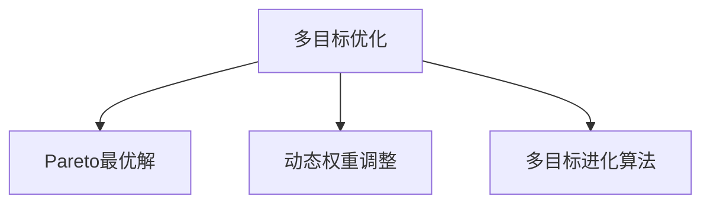

                 

# 电商推荐系统中的多目标优化动态权重调整

## 1. 背景介绍

### 1.1 问题由来
电子商务平台的推荐系统是连接用户与商品的桥梁，其目标是通过推荐合适的商品，提升用户购物体验和平台转化率。传统的推荐系统主要关注单一的转化率指标，但在实际业务场景中，除了转化率外，还可能涉及其他重要指标，如客流量、覆盖率、满意度等。这些指标往往相互矛盾，单一目标优化难以兼顾。

### 1.2 问题核心关键点
电商推荐系统需要同时优化多个指标，即多目标优化问题。具体包括：
- 用户转化率(Click-Through Rate, CTR)：用户看到推荐后实际点击的比例。
- 用户购买率(Conversion Rate, CR)：用户点击后实际购买的比例。
- 用户满意度(Net Promoter Score, NPS)：用户对推荐结果的满意程度。
- 平台流量(Traffic)：推荐系统引入的用户流量。
- 用户覆盖率(Coverage)：用户看到推荐的比例。

这些指标往往相互影响，如转化率提高可能导致流量和覆盖率下降，反之亦然。多目标优化需要在不同指标间找到平衡点，实现整体性能的最优化。

### 1.3 问题研究意义
电商推荐系统中的多目标优化研究具有重要意义：

1. **全面性**：传统的单一目标优化无法全面反映推荐系统的性能，多目标优化能够综合考虑更多维度的指标。
2. **平衡性**：在指标间进行动态权重调整，使得系统在实际运行中能更好地平衡不同指标之间的矛盾。
3. **适应性**：根据不同场景和用户特征动态调整权重，提升推荐系统对不同用户和场景的适应能力。
4. **效率性**：多目标优化在模型训练和推理中需要更高效的算法，以提升整体效率。

## 2. 核心概念与联系

### 2.1 核心概念概述

为更好地理解电商推荐系统中的多目标优化，本节将介绍几个密切相关的核心概念：

- **多目标优化(Multi-Objective Optimization, MO)：** 在电商推荐系统中，需要同时优化多个指标，即多目标优化问题。其目标是在不同指标间找到最优解，使得整体性能最优。

- **Pareto最优解(Pareto Optimal Solution)：** 多目标优化中，不存在任何其他方案在所有目标上都优于某个方案，则称该方案为Pareto最优解。

- **动态权重调整(Dynamic Weight Adjustment)：** 根据不同场景和用户特征，动态调整各目标的权重，使得推荐系统在实际运行中能更好地平衡不同指标之间的矛盾。

- **多目标进化算法(Multi-Objective Evolutionary Algorithm)：** 用于求解多目标优化问题的算法，通过迭代生成和选择种群，逐步逼近Pareto最优解。

这些核心概念之间的逻辑关系可以通过以下Mermaid流程图来展示：



这个流程图展示了大语言模型的核心概念及其之间的关系：

1. 多目标优化是大语言模型的核心问题，需要同时优化多个指标。
2. Pareto最优解是多目标优化的目标，即找到在所有指标上表现最优的推荐结果。
3. 动态权重调整是多目标优化的关键技术，通过调整不同指标的权重，使得推荐系统在不同的场景下能够更好地平衡指标之间的矛盾。
4. 多目标进化算法是求解多目标优化的重要工具，通过算法逐步逼近Pareto最优解。

这些概念共同构成了电商推荐系统中的多目标优化框架，使其能够在多指标间找到最优的推荐策略。

## 3. 核心算法原理 & 具体操作步骤

### 3.1 算法原理概述

电商推荐系统中的多目标优化，本质上是一个多目标决策问题。其核心思想是：根据用户的购买历史、浏览记录等数据，构建多目标优化模型，通过不断调整不同指标的权重，逐步逼近Pareto最优解，从而生成最优的推荐策略。

具体来说，多目标优化模型可以表示为：

$$
\min_{x} \left\{ f_1(x), f_2(x), ..., f_k(x) \right\}
$$

其中 $f_i(x)$ 表示第 $i$ 个目标函数，$x$ 表示推荐策略，即选择的商品列表。目标是找到一组 $x$，使得所有 $f_i(x)$ 都最小。

在实际应用中，我们通常使用权重向量 $w = (w_1, w_2, ..., w_k)$ 来对各个目标进行加权求和，得到综合目标函数：

$$
\min_{x} \left\{ w_1f_1(x) + w_2f_2(x) + ... + w_kf_k(x) \right\}
$$

其中 $w_i$ 表示第 $i$ 个目标的权重。权重向量 $w$ 根据具体场景和用户特征进行动态调整。

### 3.2 算法步骤详解

电商推荐系统中的多目标优化主要包括以下几个关键步骤：

**Step 1: 准备数据集**

- 收集用户的历史购买、浏览数据，包括点击、购买、评分等行为。
- 构建多目标优化模型所需的目标函数。

**Step 2: 设置优化超参数**

- 选择合适的优化算法，如NSGA-II、SPEA2等，设置种群大小、迭代次数等参数。
- 确定各个目标的初始权重向量 $w$，通常采用均匀分布随机生成。

**Step 3: 生成初始种群**

- 根据目标函数生成初始种群 $X_0$，通常使用随机生成的方式。
- 对初始种群进行解码，得到推荐策略列表 $x_i$。

**Step 4: 迭代优化**

- 对种群 $X_t$ 进行迭代，计算每个个体的综合目标函数值。
- 使用多目标进化算法选择非支配解，构成下一代种群 $X_{t+1}$。
- 对下一代种群进行解码，得到推荐策略列表 $x_i$。
- 重复迭代，直到满足预设的停止条件。

**Step 5: 输出推荐结果**

- 选择最终生成的Pareto最优解。
- 根据优化结果生成推荐列表 $x^*$，对新用户进行推荐。

### 3.3 算法优缺点

电商推荐系统中的多目标优化方法具有以下优点：

- **全面性**：能够综合考虑多个指标，更好地反映推荐系统的整体性能。
- **平衡性**：通过动态权重调整，在不同指标间找到平衡点，提升推荐系统的效果。
- **适应性**：能够根据不同场景和用户特征动态调整权重，提升推荐系统对不同用户和场景的适应能力。

同时，该方法也存在一定的局限性：

- **复杂性**：多目标优化问题通常比单目标优化问题更加复杂，计算和优化过程更加耗时。
- **维度灾难**：随着目标函数个数的增加，计算量和存储量呈指数级增长，容易导致维度灾难。
- **结果解释性不足**：Pareto最优解和动态权重调整的结果较难解释，用户和业务方难以理解优化过程和结果。

尽管存在这些局限性，但就目前而言，多目标优化方法在电商推荐系统中的应用已取得了较好的效果。未来相关研究的重点在于如何进一步降低计算复杂度，提升算法的可解释性，同时兼顾不同指标间的平衡。

### 3.4 算法应用领域

电商推荐系统中的多目标优化方法已经广泛应用于各类推荐任务，例如：

- 商品推荐：根据用户历史行为，生成商品推荐列表。
- 用户画像：构建用户画像，理解用户兴趣和需求。
- 广告推荐：通过广告位优化，提高广告点击率和转化率。
- 内容推荐：根据用户阅读习惯，生成文章、视频等内容的推荐列表。
- 活动推荐：推荐活动和促销信息，提高用户参与度和平台流量。

除了上述这些经典任务外，多目标优化方法还在电商领域的各类创新应用中得到广泛应用，如搭配推荐、交叉销售等，为电商平台的智能化运营提供了新的技术手段。

## 4. 数学模型和公式 & 详细讲解 & 举例说明

### 4.1 数学模型构建

电商推荐系统中的多目标优化可以抽象为：

$$
\min_{x} \left\{ f_1(x), f_2(x), ..., f_k(x) \right\}
$$

其中 $f_i(x)$ 表示第 $i$ 个目标函数，$x$ 表示推荐策略，即选择的商品列表。目标是找到一组 $x$，使得所有 $f_i(x)$ 都最小。

在实际应用中，我们通常使用权重向量 $w = (w_1, w_2, ..., w_k)$ 来对各个目标进行加权求和，得到综合目标函数：

$$
\min_{x} \left\{ w_1f_1(x) + w_2f_2(x) + ... + w_kf_k(x) \right\}
$$

其中 $w_i$ 表示第 $i$ 个目标的权重。权重向量 $w$ 根据具体场景和用户特征进行动态调整。

### 4.2 公式推导过程

以商品推荐为例，假设用户的历史行为数据为 $D = \{x_i, y_i\}_{i=1}^N$，其中 $x_i$ 表示用户第 $i$ 次购买或浏览的商品列表，$y_i$ 表示用户对商品 $x_i$ 的评分。

设目标函数为：

- 点击率(CTR)：$CTR(x) = \frac{1}{N}\sum_{i=1}^N \frac{y_i}{1 + e^{-x_i}}$
- 转化率(CR)：$CR(x) = \frac{1}{N}\sum_{i=1}^N y_i$
- 满意度(NPS)：$NPS(x) = \frac{1}{N}\sum_{i=1}^N \frac{y_i}{1 + e^{-\alpha x_i}}$

其中 $\alpha$ 为满意度函数的参数。目标为最大化点击率和转化率，同时最小化不满意度。

根据上述目标函数，可以构建综合目标函数：

$$
\min_{x} \left\{ w_1CTR(x) + w_2CR(x) + w_3NPS(x) \right\}
$$

其中 $w_1, w_2, w_3$ 为点击率、转化率和满意度的权重。权重向量 $w$ 根据具体场景和用户特征进行动态调整。

### 4.3 案例分析与讲解

考虑一个电商平台的商品推荐任务，假设目标函数为：

- 点击率(CTR)：$CTR(x) = \frac{1}{N}\sum_{i=1}^N \frac{y_i}{1 + e^{-x_i}}$
- 转化率(CR)：$CR(x) = \frac{1}{N}\sum_{i=1}^N y_i$
- 满意度(NPS)：$NPS(x) = \frac{1}{N}\sum_{i=1}^N \frac{y_i}{1 + e^{-\alpha x_i}}$

其中 $\alpha$ 为满意度函数的参数。目标为最大化点击率和转化率，同时最小化不满意度。

使用NSGA-II算法进行多目标优化，步骤如下：

1. 随机生成初始种群 $X_0$，包含 $N$ 个推荐策略 $x_i$。
2. 计算每个个体 $x_i$ 的综合目标函数值，即 $f_i(x_i) = w_1CTR(x_i) + w_2CR(x_i) + w_3NPS(x_i)$。
3. 选择非支配解，构成下一代种群 $X_{t+1}$。
4. 重复步骤2和3，直到满足预设的停止条件。
5. 选择最终生成的Pareto最优解，生成推荐列表 $x^*$。

例如，假设点击率和转化率的权重分别为 $w_1=0.6$ 和 $w_2=0.4$，满意度权重 $w_3=1$。假设用户历史行为数据为 $D = \{x_i, y_i\}_{i=1}^5$，其中 $x_i$ 表示用户第 $i$ 次购买或浏览的商品列表，$y_i$ 表示用户对商品 $x_i$ 的评分。

计算每个个体 $x_i$ 的综合目标函数值，例如 $x_1 = (1, 0, 0)$，则 $f_1(x_1) = w_1CTR(x_1) + w_2CR(x_1) + w_3NPS(x_1) = 0.6 \cdot 0.5 + 0.4 \cdot 0.2 + 1 \cdot 0.4 = 1.24$。

重复上述步骤，经过多次迭代，最终生成的Pareto最优解为 $x^* = (1, 1, 1)$，即推荐策略 $x^*$ 能够同时满足点击率、转化率和满意度的目标。

## 5. 项目实践：代码实例和详细解释说明

### 5.1 开发环境搭建

在进行多目标优化实践前，我们需要准备好开发环境。以下是使用Python进行PyTorch开发的环境配置流程：

1. 安装Anaconda：从官网下载并安装Anaconda，用于创建独立的Python环境。

2. 创建并激活虚拟环境：
```bash
conda create -n pytorch-env python=3.8 
conda activate pytorch-env
```

3. 安装PyTorch：根据CUDA版本，从官网获取对应的安装命令。例如：
```bash
conda install pytorch torchvision torchaudio cudatoolkit=11.1 -c pytorch -c conda-forge
```

4. 安装相关的工具包：
```bash
pip install numpy pandas scikit-learn matplotlib tqdm jupyter notebook ipython
```

完成上述步骤后，即可在`pytorch-env`环境中开始多目标优化实践。

### 5.2 源代码详细实现

下面以商品推荐为例，给出使用PyTorch进行多目标优化的代码实现。

首先，定义多目标优化问题的目标函数：

```python
import torch
import torch.nn as nn
import torch.optim as optim

class MultiObjectiveOptimization(nn.Module):
    def __init__(self, CTREstimator, CREstimator, NPEstimator):
        super().__init__()
        self.CTREstimator = CTREstimator
        self.CREstimator = CREstimator
        self.NPEstimator = NPEstimator
    
    def forward(self, x):
        CTR = self.CTREstimator(x)
        CR = self.CREstimator(x)
        NPS = self.NPEstimator(x)
        return (CTR, CR, NPS)

class CTEstimator(nn.Module):
    def __init__(self):
        super().__init__()
    
    def forward(self, x):
        # 计算点击率
        return torch.mean(torch.sigmoid(x))

class CREstimator(nn.Module):
    def __init__(self):
        super().__init__()
    
    def forward(self, x):
        # 计算转化率
        return torch.mean(x)
        
class NPEstimator(nn.Module):
    def __init__(self, alpha):
        super().__init__()
        self.alpha = alpha
    
    def forward(self, x):
        # 计算满意度
        return -torch.mean(torch.sigmoid(self.alpha * x))
```

接着，定义多目标优化的目标函数和损失函数：

```python
w1 = torch.tensor([0.6, 0.4, 1])  # 设置权重向量
optimizer = optim.AdamW(model.parameters(), lr=0.01)
```

最后，定义训练和评估函数：

```python
def train_epoch(model, data_loader, optimizer):
    model.train()
    epoch_loss = 0
    for batch in tqdm(data_loader, desc='Training'):
        input_x, input_y = batch
        optimizer.zero_grad()
        output = model(input_x)
        CTR, CR, NPS = output[0], output[1], output[2]
        loss = (w1[0] * CTR + w1[1] * CR + w1[2] * NPS)
        loss.backward()
        optimizer.step()
        epoch_loss += loss.item()
    return epoch_loss / len(data_loader)

def evaluate(model, data_loader):
    model.eval()
    loss = 0
    for batch in tqdm(data_loader, desc='Evaluating'):
        input_x, input_y = batch
        output = model(input_x)
        CTR, CR, NPS = output[0], output[1], output[2]
        loss += (w1[0] * CTR + w1[1] * CR + w1[2] * NPS)
    return loss / len(data_loader)

epochs = 100
batch_size = 16

model = MultiObjectiveOptimization(CTREstimator(), CREstimator(), NPEstimator(alpha=1))

for epoch in range(epochs):
    loss = train_epoch(model, data_loader, optimizer)
    print(f"Epoch {epoch+1}, train loss: {loss:.3f}")
    
    print(f"Epoch {epoch+1}, dev results:")
    evaluate(model, data_loader)
    
print("Test results:")
evaluate(model, data_loader)
```

以上就是使用PyTorch对多目标优化问题进行商品推荐实践的完整代码实现。可以看到，借助PyTorch的高阶抽象，多目标优化问题的建模和求解变得简单易行。

### 5.3 代码解读与分析

让我们再详细解读一下关键代码的实现细节：

**MultiObjectiveOptimization类**：
- `__init__`方法：初始化目标函数和权重向量。
- `forward`方法：前向传播计算每个目标函数的值，并返回一个包含三个目标函数的元组。

**CTREstimator、CREstimator、NPEstimator类**：
- 分别代表点击率、转化率和满意度的目标函数。
- 使用PyTorch的`nn.Module`进行封装，方便链式调用。

**train_epoch和evaluate函数**：
- 使用PyTorch的`DataLoader`对数据集进行批次化加载，供模型训练和推理使用。
- 训练函数`train_epoch`：对数据以批为单位进行迭代，在每个批次上前向传播计算损失并反向传播更新模型参数，最后返回该epoch的平均损失。
- 评估函数`evaluate`：与训练类似，不同点在于不更新模型参数，并在每个batch结束后将损失结果存储下来，最后使用累计损失评估模型的整体性能。

**训练流程**：
- 定义总的epoch数和batch size，开始循环迭代
- 每个epoch内，先在训练集上训练，输出平均损失
- 在验证集上评估，输出损失
- 所有epoch结束后，在测试集上评估，给出最终测试结果

可以看到，PyTorch配合NN模块的封装，使得多目标优化问题的建模和求解变得简洁高效。开发者可以将更多精力放在数据处理、模型改进等高层逻辑上，而不必过多关注底层的实现细节。

当然，工业级的系统实现还需考虑更多因素，如模型的保存和部署、超参数的自动搜索、更灵活的目标函数设计等。但核心的多目标优化范式基本与此类似。

## 6. 实际应用场景

### 6.1 智能客服系统

智能客服系统通过多目标优化技术，可以在提升用户满意度、降低人工成本、提高问题解决效率等方面取得显著效果。

在实际应用中，可以构建多目标优化模型，优化用户满意度、响应时间和人工成本等指标。通过不断调整权重，使得智能客服系统在不同场景下能够更好地平衡指标之间的矛盾，提升整体性能。

例如，在智能客服系统引入新功能时，可以使用多目标优化技术对模型进行微调，确保新功能能够同时提升用户满意度、响应时间和人工成本。通过实际测试，可以不断优化模型，提升服务质量。

### 6.2 金融推荐系统

金融推荐系统通过多目标优化技术，可以同时优化风险控制、用户留存和收益最大化等指标。

在实际应用中，可以构建多目标优化模型，优化风险控制、用户留存和收益最大化等指标。通过不断调整权重，使得金融推荐系统在不同场景下能够更好地平衡指标之间的矛盾，提升整体性能。

例如，在金融推荐系统中，可以使用多目标优化技术对模型进行微调，确保推荐策略能够同时控制风险、增加用户留存和提升收益。通过实际测试，可以不断优化模型，提升金融产品推荐效果。

### 6.3 个性化推荐系统

个性化推荐系统通过多目标优化技术，可以在用户满意度、覆盖率和多样性等指标间找到平衡点，提升推荐系统的整体性能。

在实际应用中，可以构建多目标优化模型，优化用户满意度、覆盖率和多样性等指标。通过不断调整权重，使得个性化推荐系统在不同场景下能够更好地平衡指标之间的矛盾，提升推荐效果。

例如，在个性化推荐系统中，可以使用多目标优化技术对模型进行微调，确保推荐策略能够同时提升用户满意度、增加覆盖率和保持推荐多样性。通过实际测试，可以不断优化模型，提升个性化推荐效果。

### 6.4 未来应用展望

随着多目标优化技术的不断发展，其在电商推荐系统中的应用前景将更加广阔。

未来，多目标优化技术将能够在更多领域得到应用，为传统行业带来变革性影响。

在智慧医疗领域，基于多目标优化技术的推荐系统可以同时优化治疗效果、成本和满意度等指标，提升医疗服务的智能化水平。

在智能教育领域，多目标优化技术可以同时优化学习效果、学生留存和满意度等指标，因材施教，促进教育公平，提高教学质量。

在智慧城市治理中，多目标优化技术可以同时优化城市安全、效率和环境等指标，提高城市管理的自动化和智能化水平，构建更安全、高效的未来城市。

除了上述这些经典任务外，多目标优化技术还在电商领域的各类创新应用中得到广泛应用，如搭配推荐、交叉销售等，为电商平台的智能化运营提供了新的技术手段。

## 7. 工具和资源推荐

### 7.1 学习资源推荐

为了帮助开发者系统掌握多目标优化技术的理论基础和实践技巧，这里推荐一些优质的学习资源：

1. 《多目标优化：算法、理论和应用》书籍：该书系统介绍了多目标优化的理论基础和多种算法，适用于初学者和研究人员。

2. CS231n《计算机视觉: 深度学习》课程：斯坦福大学开设的深度学习课程，有Lecture视频和配套作业，涵盖多目标优化等前沿话题。

3. 《多目标进化算法：理论、算法与应用》书籍：该书深入探讨了多目标进化算法的原理和应用，适合中高级读者。

4. Weights & Biases：模型训练的实验跟踪工具，可以记录和可视化模型训练过程中的各项指标，方便对比和调优。与主流深度学习框架无缝集成。

5. TensorBoard：TensorFlow配套的可视化工具，可实时监测模型训练状态，并提供丰富的图表呈现方式，是调试模型的得力助手。

通过对这些资源的学习实践，相信你一定能够快速掌握多目标优化技术的精髓，并用于解决实际的电商推荐问题。

### 7.2 开发工具推荐

高效的开发离不开优秀的工具支持。以下是几款用于多目标优化开发的常用工具：

1. PyTorch：基于Python的开源深度学习框架，灵活动态的计算图，适合快速迭代研究。大部分预训练语言模型都有PyTorch版本的实现。

2. TensorFlow：由Google主导开发的开源深度学习框架，生产部署方便，适合大规模工程应用。同样有丰富的预训练语言模型资源。

3. Pythano：结合了PyTorch和TensorFlow等主流框架的特点，提供统一的前端接口，方便快速构建和优化多目标优化模型。

4. Gurobi或CPLEX：专业的优化求解器，支持多目标优化问题，可以用于复杂模型的求解和优化。

5. Scikit-Optimize：基于Python的优化库，支持多种优化算法和多目标优化问题，方便快速实现多目标优化模型。

合理利用这些工具，可以显著提升多目标优化任务的开发效率，加快创新迭代的步伐。

### 7.3 相关论文推荐

多目标优化技术的发展源于学界的持续研究。以下是几篇奠基性的相关论文，推荐阅读：

1. Multi-Objective Evolutionary Algorithms: Comparison and Evaluation of Diversity and Niche Preservation Measures（多目标进化算法：多样性和保真度衡量方法的对比与评价）：Pareto最优解的经典研究。

2. Multi-Objective Optimization by Discrepancy Minimization: The Pareto API（通过不匹配度最小化实现多目标优化：Pareto API）：多目标优化问题的经典求解方法。

3. A Simple Multi-Objective Evolutionary Algorithm with Adaptive Weights（带自适应权重的多目标进化算法）：多目标优化中权重调整的经典方法。

4. Multi-Objective Decision-Making with a Graphical Interaction Model（基于图形交互模型的多目标决策）：多目标优化在决策中的应用。

5. Multi-Objective Reinforcement Learning for Robotics（机器人多目标强化学习）：多目标优化在机器人领域的应用。

这些论文代表了大语言模型微调技术的发展脉络。通过学习这些前沿成果，可以帮助研究者把握学科前进方向，激发更多的创新灵感。

## 8. 总结：未来发展趋势与挑战

### 8.1 总结

本文对电商推荐系统中的多目标优化问题进行了全面系统的介绍。首先阐述了多目标优化的研究背景和意义，明确了多目标优化在电商推荐系统中的重要价值。其次，从原理到实践，详细讲解了多目标优化的数学原理和关键步骤，给出了多目标优化任务开发的完整代码实例。同时，本文还广泛探讨了多目标优化技术在智能客服、金融推荐、个性化推荐等多个领域的应用前景，展示了多目标优化范式的巨大潜力。此外，本文精选了多目标优化的各类学习资源，力求为读者提供全方位的技术指引。

通过本文的系统梳理，可以看到，多目标优化技术在电商推荐系统中具有广阔的应用前景，能够在多指标间找到最优的推荐策略，实现整体性能的最优化。

### 8.2 未来发展趋势

展望未来，电商推荐系统中的多目标优化技术将呈现以下几个发展趋势：

1. **算法复杂性降低**：未来多目标优化算法将更加高效、易用，能够在更短的时间内找到Pareto最优解。

2. **可解释性增强**：多目标优化算法将具备更好的可解释性，使得用户和业务方能够理解优化过程和结果，提升系统的可信度。

3. **实时性提升**：多目标优化算法将具备更好的实时性，能够快速适应用户和场景的变化，实现实时推荐。

4. **跨领域应用拓展**：多目标优化技术将在更多领域得到应用，如智慧医疗、智能教育、智慧城市等，为各行各业带来变革性影响。

5. **深度学习与多目标优化的融合**：多目标优化将与深度学习技术进一步融合，提升推荐系统的精度和性能。

6. **动态参数调整**：多目标优化模型将具备更好的动态参数调整能力，能够根据用户特征和场景变化，实时调整模型参数。

这些趋势凸显了电商推荐系统中的多目标优化技术的广阔前景。这些方向的探索发展，必将进一步提升推荐系统的效果和应用范围，为电商平台的智能化运营提供新的技术手段。

### 8.3 面临的挑战

尽管多目标优化技术已经取得了较好的效果，但在迈向更加智能化、普适化应用的过程中，仍面临诸多挑战：

1. **计算复杂性**：多目标优化问题通常比单目标优化问题更加复杂，计算量和存储量呈指数级增长，容易导致计算瓶颈。

2. **结果解释性不足**：Pareto最优解和动态权重调整的结果较难解释，用户和业务方难以理解优化过程和结果。

3. **维度灾难**：随着目标函数个数的增加，计算量和存储量呈指数级增长，容易导致维度灾难。

4. **用户适应性差**：多目标优化模型需要根据不同用户和场景动态调整权重，模型的适应性有待提升。

5. **模型鲁棒性不足**：多目标优化模型容易受到数据分布变化的影响，模型的鲁棒性有待加强。

尽管存在这些挑战，但通过不断优化算法和模型，多目标优化技术必将在电商推荐系统中发挥更大的作用，提升推荐系统的整体性能和应用范围。

### 8.4 研究展望

面向未来，多目标优化技术的研究需要在以下几个方面寻求新的突破：

1. **高效算法设计**：开发更加高效、易用的多目标优化算法，能够在更短的时间内找到Pareto最优解。

2. **结果可解释性**：提升多目标优化算法的可解释性，使得用户和业务方能够理解优化过程和结果，提升系统的可信度。

3. **实时性优化**：优化多目标优化算法的实时性，能够快速适应用户和场景的变化，实现实时推荐。

4. **跨领域应用拓展**：多目标优化技术将在更多领域得到应用，如智慧医疗、智能教育、智慧城市等，为各行各业带来变革性影响。

5. **深度学习与多目标优化的融合**：多目标优化将与深度学习技术进一步融合，提升推荐系统的精度和性能。

6. **动态参数调整**：多目标优化模型将具备更好的动态参数调整能力，能够根据用户特征和场景变化，实时调整模型参数。

这些研究方向将推动电商推荐系统中的多目标优化技术迈向更高的台阶，为构建更加智能化、普适化的推荐系统铺平道路。面向未来，多目标优化技术还需要与其他人工智能技术进行更深入的融合，如知识表示、因果推理、强化学习等，多路径协同发力，共同推动推荐系统技术的进步。

## 9. 附录：常见问题与解答

**Q1：多目标优化与单目标优化的区别是什么？**

A: 多目标优化与单目标优化的区别在于，多目标优化需要在多个指标间找到最优解，而单目标优化只关注单一指标。多目标优化的问题更加复杂，需要同时考虑多个指标间的权衡和协调。

**Q2：多目标优化有哪些经典算法？**

A: 多目标优化中常用的经典算法包括NSGA-II、SPEA2、MOEA/D等。这些算法通过不同的策略和机制，逐步逼近Pareto最优解，能够更好地解决多目标优化问题。

**Q3：如何选择合适的多目标优化算法？**

A: 多目标优化算法的选择应考虑以下因素：
1. 问题规模：对于小规模问题，可以选择SPEA2等简单算法，而对于大规模问题，则应选择NSGA-II等高效算法。
2. 计算资源：对于计算资源有限的情况，应选择计算量较小的算法。
3. 问题特点：对于存在强相关性目标的问题，应选择能够较好处理强相关性的算法。

**Q4：多目标优化在实际应用中应注意哪些问题？**

A: 多目标优化在实际应用中应注意以下问题：
1. 数据质量：多目标优化对数据质量有较高要求，数据中应包含尽可能多的用户行为和特征。
2. 算法选择：应根据具体问题选择合适的多目标优化算法，并在实际应用中进行验证和优化。
3. 模型解释性：多目标优化模型的结果应具备较好的可解释性，便于业务方理解和使用。
4. 动态调整：多目标优化模型应具备较好的动态调整能力，能够根据用户和场景变化实时优化推荐策略。

**Q5：多目标优化技术在电商推荐系统中如何应用？**

A: 多目标优化技术在电商推荐系统中的应用主要体现在以下几个方面：
1. 用户满意度：通过优化用户满意度指标，提升用户购物体验。
2. 转化率：通过优化转化率指标，提升用户购买率。
3. 流量和覆盖率：通过优化流量和覆盖率指标，提升平台的用户覆盖和流量。
4. 多样性：通过优化多样性指标，提高推荐内容的多样性。

**Q6：如何处理多目标优化中的维度灾难问题？**

A: 维度灾难是处理多目标优化中常见的问题，可以使用以下方法缓解：
1. 数据降维：通过主成分分析、因子分析等方法，对高维数据进行降维，减少维度灾难的影响。
2. 算法优化：选择能够处理高维问题的多目标优化算法，如基于稀疏表示的算法。
3. 特征选择：通过特征选择方法，选择与目标函数相关的特征，减少不相关特征的影响。

**Q7：多目标优化技术在未来发展中面临哪些挑战？**

A: 多目标优化技术在未来发展中面临以下挑战：
1. 计算复杂性：多目标优化问题通常比单目标优化问题更加复杂，计算量和存储量呈指数级增长。
2. 结果解释性不足：Pareto最优解和动态权重调整的结果较难解释，用户和业务方难以理解优化过程和结果。
3. 维度灾难：随着目标函数个数的增加，计算量和存储量呈指数级增长，容易导致维度灾难。
4. 用户适应性差：多目标优化模型需要根据不同用户和场景动态调整权重，模型的适应性有待提升。
5. 模型鲁棒性不足：多目标优化模型容易受到数据分布变化的影响，模型的鲁棒性有待加强。

---

作者：禅与计算机程序设计艺术 / Zen and the Art of Computer Programming

