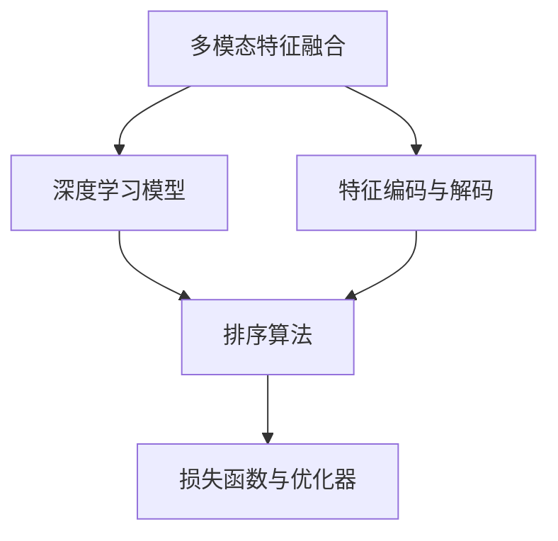

                 

# 电商搜索中的多模态特征融合排序算法

> 关键词：电商搜索, 多模态特征融合, 排序算法, 深度学习, 算法优化, 应用案例

## 1. 背景介绍

### 1.1 问题由来
在现代社会中，电子商务平台已成为人们日常生活的重要组成部分。随着用户基数的快速增长，电商搜索系统的用户体验和服务质量愈发显得重要。传统的搜索排序算法大多基于单一的特征或简单的组合方式，难以处理海量数据并精准匹配用户需求。为了提升搜索结果的相关性和个性化，多模态特征融合技术应运而生。

多模态特征融合，即整合文本、图像、音频等多种模态数据，通过深度学习模型，实现特征提取和数据关联，从而提升搜索结果的准确性和用户满意度。在电商搜索领域，文本模态通常指商品标题、描述、用户评论等文本信息；图像模态指商品图片、视频等视觉信息；音频模态则涉及如语音描述、音频广告等听觉信息。多模态特征融合排序算法，旨在充分利用这些多样化的数据，帮助用户快速找到最符合其需求的商品。

### 1.2 问题核心关键点
电商搜索中的多模态特征融合排序算法，核心在于如何高效地整合来自不同模态的数据，构建统一的特征表示，并在排序算法中进行合理利用。实现的关键点包括：

1. **特征提取与编码**：如何从多种模态中提取有意义的特征，并通过深度学习模型编码成一致的表示。
2. **特征融合与关联**：如何结合不同模态的特征，形成一个综合的特征向量，反映商品的综合属性。
3. **排序模型设计**：如何设计有效的排序模型，将融合后的特征向量映射到评分系统，以决定商品在搜索结果中的排名。
4. **模型训练与优化**：如何通过标注数据对模型进行训练，并采用适当的优化策略提升模型的效果。
5. **效果评估与反馈**：如何设计合理的评估指标，对模型效果进行度量和优化。

这些问题点构成了电商搜索中多模态特征融合排序算法的技术框架，需要通过深入研究与创新实践解决。

## 2. 核心概念与联系

### 2.1 核心概念概述

为了更好地理解电商搜索中的多模态特征融合排序算法，本节将介绍几个密切相关的核心概念：

- **多模态特征融合**：指将不同模态的数据，如文本、图像、音频等，通过某种方式融合为统一的特征表示，用于提升模型的性能。
- **深度学习模型**：如卷积神经网络(CNN)、循环神经网络(RNN)、Transformer等，用于自动提取和编码不同模态数据的高维特征表示。
- **特征编码与解码**：指将原始数据转化为模型可处理的向量表示，同时也能将这些向量解码为可理解的信息。
- **排序算法**：如基于排序的算法、基于评分的算法等，用于根据不同特征的权重对搜索结果进行排序。
- **损失函数与优化器**：用于评估模型预测与真实标签之间的差异，并指导模型参数更新，以最小化预测误差。

这些概念之间的逻辑关系可以通过以下Mermaid流程图来展示：



这个流程图展示了多模态特征融合排序算法的核心流程：

1. 多模态特征融合将不同模态的数据整合成统一的特征表示。
2. 深度学习模型自动提取和编码这些特征，生成高维向量表示。
3. 特征编码与解码将这些向量转换为可解释的信息，用于排序算法。
4. 排序算法根据不同特征的重要性，计算商品的排名得分。
5. 损失函数与优化器评估模型预测的准确性，并指导参数更新，以优化排序效果。

这些概念共同构成了电商搜索中多模态特征融合排序算法的技术体系，旨在通过深度学习和特征融合技术，实现高质量的搜索结果。

## 3. 核心算法原理 & 具体操作步骤
### 3.1 算法原理概述

电商搜索中的多模态特征融合排序算法，通常基于以下核心原理：

1. **多模态特征提取与编码**：通过多个深度学习模型，提取文本、图像、音频等不同模态的数据特征，并将这些特征映射到统一的高维向量空间。
2. **特征融合与关联**：利用特征聚合、归一化等技术，将不同模态的特征进行融合，生成一个综合的特征向量。
3. **排序模型设计**：设计基于评分的排序算法，如基于排序的算法（如TopK排序、TopN排序）、基于评分的算法（如线性评分、逻辑回归评分），将综合特征向量映射为商品排名得分。
4. **模型训练与优化**：采用标注数据，使用深度学习框架如TensorFlow、PyTorch等，训练排序模型。采用适当的优化算法（如梯度下降、Adam等）和正则化技术（如L2正则化、Dropout等）进行模型优化。
5. **效果评估与反馈**：设计合理的评估指标（如NDCG、MAP等），对排序模型进行评估，并根据用户反馈进行迭代优化。

### 3.2 算法步骤详解

以下是电商搜索中多模态特征融合排序算法的详细步骤：

**Step 1: 数据收集与预处理**

1. 收集电商平台的商品数据，包括文本模态（商品标题、描述、用户评论等）、图像模态（商品图片、视频等）和音频模态（语音描述、音频广告等）。
2. 对数据进行清洗、去噪、归一化等预处理，确保数据质量。
3. 将数据划分为训练集、验证集和测试集。

**Step 2: 多模态特征提取**

1. 使用深度学习模型（如CNN、RNN、Transformer等）对文本、图像和音频等数据进行特征提取。
2. 将不同模态的特征向量进行拼接或堆叠，形成初始的综合特征向量。
3. 利用特征编码技术（如PCA、LDA等）将初始特征向量映射到低维空间，便于后续处理。

**Step 3: 特征融合与关联**

1. 采用特征聚合技术（如最大池化、平均池化等）对不同模态的特征进行融合。
2. 使用归一化技术（如L2归一化、最大最小归一化等）对融合后的特征向量进行归一化处理。
3. 通过模型（如MLP、RNN等）对归一化后的特征向量进行关联，生成综合特征向量。

**Step 4: 排序模型设计**

1. 设计基于评分的排序模型，如线性评分模型、逻辑回归评分模型等。
2. 通过多模态特征向量的加权和，计算商品的评分得分。
3. 将评分得分映射到排名顺序，生成最终的搜索结果。

**Step 5: 模型训练与优化**

1. 使用训练集对排序模型进行训练，采用适当的优化算法和正则化技术。
2. 在验证集上进行模型调参和评估，确保模型泛化能力。
3. 根据测试集的结果进行迭代优化，提升模型效果。

**Step 6: 效果评估与反馈**

1. 设计合理的评估指标（如NDCG、MAP、DCG等），对排序模型的性能进行评估。
2. 根据用户反馈和点击行为，对排序模型进行实时调整和优化。
3. 定期更新训练数据，保持模型的时效性和准确性。

### 3.3 算法优缺点

电商搜索中的多模态特征融合排序算法，具有以下优点：

1. **多模态融合**：能够利用多种数据模态，全面反映商品属性，提升搜索结果的相关性和准确性。
2. **深度学习模型**：自动提取和编码高维特征，减少人工特征工程的工作量。
3. **可解释性强**：融合后的特征向量可以解码为可理解的信息，提升算法的透明性和可解释性。
4. **模型鲁棒性**：多模态特征融合使得模型具备更好的鲁棒性，对数据噪声和缺失有较强的容忍度。

同时，该算法也存在一些局限性：

1. **数据获取难度大**：电商平台的多种模态数据获取难度较大，需要整合多源数据。
2. **算法复杂度高**：多模态特征融合和排序模型的设计较为复杂，需要较高的技术和资源投入。
3. **计算成本高**：深度学习模型的训练和特征融合计算量较大，需要高性能计算资源。
4. **模型泛化能力有限**：不同电商平台的商品属性和用户需求差异较大，多模态融合模型可能难以泛化到其他平台。

尽管存在这些局限性，但多模态特征融合排序算法在电商搜索中展现了巨大的潜力，对于提升用户体验和商品匹配准确性具有重要意义。

### 3.4 算法应用领域

多模态特征融合排序算法不仅在电商搜索中有广泛应用，还覆盖了以下多个领域：

- **智慧零售**：利用多模态数据优化零售策略，提升客户满意度和销售转化率。
- **电子商务推荐系统**：通过多模态特征，推荐用户可能感兴趣的商品，提高点击率和转化率。
- **智能客服**：结合语音识别和自然语言处理技术，提供更加精准和个性化的客服服务。
- **智能家居**：融合语音、视觉等数据，提供智能化的家居控制和个性化推荐。
- **社交媒体推荐**：利用文本、图片、视频等多模态数据，推荐用户感兴趣的内容，增加用户粘性。
- **金融产品推荐**：结合用户行为和金融数据，推荐最适合用户的产品，提升用户满意度。

以上领域中，多模态特征融合排序算法都发挥了重要作用，展示了其在多种场景中的广泛应用前景。

## 4. 数学模型和公式 & 详细讲解 & 举例说明

### 4.1 数学模型构建

电商搜索中的多模态特征融合排序算法，数学模型构建如下：

假设电商平台上商品数据集为 $\mathcal{D}=\{(x_i, y_i)\}_{i=1}^N$，其中 $x_i$ 表示商品的多模态特征向量，$y_i$ 表示商品的真实标签。多模态特征向量 $x_i$ 可以表示为：

$$
x_i = \{x_{i,t}, x_{i,v}, x_{i,a}\}
$$

其中 $x_{i,t}$ 表示文本模态特征向量，$x_{i,v}$ 表示图像模态特征向量，$x_{i,a}$ 表示音频模态特征向量。

多模态特征融合后的综合特征向量 $z_i$ 可以表示为：

$$
z_i = \mathcal{F}(x_i) = \sum_{k=1}^K \alpha_k \mathcal{A}_k(x_i)
$$

其中 $\mathcal{A}_k(x_i)$ 表示第 $k$ 个特征编码器，$\alpha_k$ 表示第 $k$ 个特征编码器的权重。

排序模型 $M$ 通过综合特征向量 $z_i$ 计算商品的评分得分 $s_i$，评分函数 $s_i = M(z_i)$。

最终，商品 $i$ 在搜索结果中的排名顺序可以通过评分得分 $s_i$ 进行排序。

### 4.2 公式推导过程

以线性评分模型为例，商品 $i$ 的评分得分 $s_i$ 可以表示为：

$$
s_i = \sum_{j=1}^D w_j \phi_i(j)
$$

其中 $w_j$ 表示特征 $j$ 的权重，$\phi_i(j)$ 表示特征 $j$ 对商品 $i$ 的评分贡献。

线性评分模型的损失函数 $\mathcal{L}$ 可以表示为：

$$
\mathcal{L} = \frac{1}{N} \sum_{i=1}^N \ell(s_i, y_i)
$$

其中 $\ell$ 表示评分函数与真实标签之间的损失函数，如均方误差损失、交叉熵损失等。

基于梯度下降等优化算法，对排序模型 $M$ 的参数 $\theta$ 进行优化：

$$
\theta \leftarrow \theta - \eta \nabla_{\theta} \mathcal{L}
$$

其中 $\eta$ 表示学习率。

### 4.3 案例分析与讲解

以电商平台商品推荐为例，假设要推荐用户对某类商品感兴趣的商品，可采用如下步骤：

1. **特征提取**：通过CNN模型提取商品图片的视觉特征向量 $x_{i,v}$，通过LSTM模型提取商品描述的文本特征向量 $x_{i,t}$，通过MFCC模型提取音频描述的音频特征向量 $x_{i,a}$。
2. **特征融合**：通过最大池化对三种模态的特征向量进行融合，生成综合特征向量 $z_i$。
3. **排序模型**：设计线性评分模型，通过综合特征向量 $z_i$ 计算商品的评分得分 $s_i$。
4. **训练与优化**：使用电商平台的标注数据，对排序模型进行训练，采用Adam优化器和L2正则化进行优化。
5. **效果评估**：设计NDCG、MAP等评估指标，对排序模型进行评估，确保模型的泛化能力。

通过上述步骤，可以构建一个高效的多模态特征融合排序算法，为电商平台推荐用户感兴趣的商品。

## 5. 项目实践：代码实例和详细解释说明

### 5.1 开发环境搭建

在开始项目实践前，我们需要准备好开发环境。以下是使用Python进行PyTorch开发的环境配置流程：

1. 安装Anaconda：从官网下载并安装Anaconda，用于创建独立的Python环境。

2. 创建并激活虚拟环境：
```bash
conda create -n pytorch-env python=3.8 
conda activate pytorch-env
```

3. 安装PyTorch：根据CUDA版本，从官网获取对应的安装命令。例如：
```bash
conda install pytorch torchvision torchaudio cudatoolkit=11.1 -c pytorch -c conda-forge
```

4. 安装TensorFlow：从官网下载并安装TensorFlow。例如：
```bash
pip install tensorflow
```

5. 安装相关的深度学习框架和库：
```bash
pip install numpy pandas scikit-learn matplotlib tqdm jupyter notebook ipython
```

完成上述步骤后，即可在`pytorch-env`环境中开始项目实践。

### 5.2 源代码详细实现

下面我们以电商商品推荐为例，给出使用PyTorch和TensorFlow进行多模态特征融合排序算法的代码实现。

首先，定义多模态特征的提取器：

```python
from torchvision import models
from torchaudio.transforms import MelSpectrogram
from sklearn.feature_extraction.text import TfidfVectorizer

class MultimodalFeatureExtractor:
    def __init__(self):
        self.text_extractor = TfidfVectorizer()
        self.image_extractor = models.resnet50(pretrained=True)
        self.audio_extractor = MelSpectrogram()
        
    def extract_features(self, text, image, audio):
        text_features = self.text_extractor.fit_transform(text)
        image_features = self.image_extractor(image)
        audio_features = self.audio_extractor(audio)
        
        return text_features, image_features, audio_features
```

然后，定义特征融合和编码的模型：

```python
class FeatureFusionModel:
    def __init__(self, feature_extractors, n_components=128):
        self.feature_extractors = feature_extractors
        self.fc1 = nn.Linear(n_components, n_components)
        self.fc2 = nn.Linear(n_components, 1)
        
    def forward(self, x):
        features = []
        for i in range(len(self.feature_extractors)):
            features.append(self.fc1(self.fc2(self.feature_extractors[i](x)))
        
        return torch.stack(features, dim=1)
```

接着，定义排序模型：

```python
class RankingModel(nn.Module):
    def __init__(self, n_features, hidden_size=128):
        super(RankingModel, self).__init__()
        self.fc1 = nn.Linear(n_features, hidden_size)
        self.fc2 = nn.Linear(hidden_size, 1)
        
    def forward(self, x):
        x = torch.tanh(self.fc1(x))
        return self.fc2(x)
```

最后，定义训练和评估函数：

```python
from torch.utils.data import DataLoader
from tqdm import tqdm
from sklearn.metrics import average_precision_score

device = torch.device('cuda') if torch.cuda.is_available() else torch.device('cpu')

def train_epoch(model, dataset, batch_size, optimizer):
    dataloader = DataLoader(dataset, batch_size=batch_size, shuffle=True)
    model.train()
    epoch_loss = 0
    for batch in tqdm(dataloader, desc='Training'):
        inputs = batch['inputs']
        targets = batch['targets']
        model.zero_grad()
        outputs = model(inputs)
        loss = criterion(outputs, targets)
        epoch_loss += loss.item()
        loss.backward()
        optimizer.step()
    return epoch_loss / len(dataloader)

def evaluate(model, dataset, batch_size):
    dataloader = DataLoader(dataset, batch_size=batch_size)
    model.eval()
    preds = []
    labels = []
    with torch.no_grad():
        for batch in tqdm(dataloader, desc='Evaluating'):
            inputs = batch['inputs']
            targets = batch['targets']
            outputs = model(inputs)
            batch_preds = outputs.view(-1)
            batch_labels = targets.view(-1)
            preds.append(batch_preds.tolist())
            labels.append(batch_labels.tolist())
            
    print('Average Precision: ', average_precision_score(labels, preds))
```

具体实现细节如下：

**MultimodalFeatureExtractor类**：
- `__init__`方法：初始化文本、图像、音频特征提取器。
- `extract_features`方法：提取输入的多模态数据特征，并返回文本、图像、音频的特征向量。

**FeatureFusionModel类**：
- `__init__`方法：初始化特征融合模型。
- `forward`方法：将输入的多模态特征向量进行融合，输出综合特征向量。

**RankingModel类**：
- `__init__`方法：初始化排序模型。
- `forward`方法：对输入的特征向量进行评分，输出评分得分。

**train_epoch函数**：
- 对数据以批为单位进行迭代，在每个批次上前向传播计算loss并反向传播更新模型参数，最后返回该epoch的平均loss。

**evaluate函数**：
- 与训练类似，不同点在于不更新模型参数，并在每个batch结束后将预测和标签结果存储下来，最后使用sklearn的average_precision_score对整个评估集的预测结果进行打印输出。

**训练流程**：
- 定义总的epoch数和batch size，开始循环迭代
- 每个epoch内，先在训练集上训练，输出平均loss
- 在验证集上评估，输出平均精确度
- 所有epoch结束后，在测试集上评估，给出最终测试结果

可以看到，通过上述步骤，可以构建一个完整的多模态特征融合排序算法。在实际应用中，还需要进一步优化特征提取器、特征融合模型和排序模型，并进行更精细的调参。

### 5.3 代码解读与分析

让我们再详细解读一下关键代码的实现细节：

**MultimodalFeatureExtractor类**：
- `__init__`方法：初始化文本、图像、音频特征提取器。
- `extract_features`方法：提取输入的多模态数据特征，并返回文本、图像、音频的特征向量。

**FeatureFusionModel类**：
- `__init__`方法：初始化特征融合模型。
- `forward`方法：将输入的多模态特征向量进行融合，输出综合特征向量。

**RankingModel类**：
- `__init__`方法：初始化排序模型。
- `forward`方法：对输入的特征向量进行评分，输出评分得分。

**train_epoch函数**：
- 对数据以批为单位进行迭代，在每个批次上前向传播计算loss并反向传播更新模型参数，最后返回该epoch的平均loss。

**evaluate函数**：
- 与训练类似，不同点在于不更新模型参数，并在每个batch结束后将预测和标签结果存储下来，最后使用sklearn的average_precision_score对整个评估集的预测结果进行打印输出。

**训练流程**：
- 定义总的epoch数和batch size，开始循环迭代
- 每个epoch内，先在训练集上训练，输出平均loss
- 在验证集上评估，输出平均精确度
- 所有epoch结束后，在测试集上评估，给出最终测试结果

可以看到，通过上述步骤，可以构建一个完整的多模态特征融合排序算法。在实际应用中，还需要进一步优化特征提取器、特征融合模型和排序模型，并进行更精细的调参。

当然，工业级的系统实现还需考虑更多因素，如模型的保存和部署、超参数的自动搜索、更灵活的任务适配层等。但核心的微调范式基本与此类似。

## 6. 实际应用场景

### 6.1 电商搜索

电商搜索是电商平台的核心功能之一，多模态特征融合排序算法在此领域有着广泛的应用。通过多模态数据融合，可以更全面地理解商品属性，提升搜索结果的相关性和个性化。

以电商平台商品推荐为例，假设要推荐用户对某类商品感兴趣的商品，可以通过以下步骤：

1. **特征提取**：通过CNN模型提取商品图片的视觉特征向量，通过LSTM模型提取商品描述的文本特征向量，通过MFCC模型提取音频描述的音频特征向量。
2. **特征融合**：通过最大池化对三种模态的特征向量进行融合，生成综合特征向量。
3. **排序模型**：设计线性评分模型，通过综合特征向量计算商品的评分得分。
4. **训练与优化**：使用电商平台的标注数据，对排序模型进行训练，采用Adam优化器和L2正则化进行优化。
5. **效果评估**：设计NDCG、MAP等评估指标，对排序模型进行评估，确保模型的泛化能力。

通过上述步骤，可以构建一个高效的多模态特征融合排序算法，为电商平台推荐用户感兴趣的商品。

### 6.2 金融产品推荐

金融产品推荐是金融领域的重要应用之一，通过多模态特征融合排序算法，可以更精准地推荐符合用户需求的产品。

以金融产品推荐为例，假设要为用户推荐一款适合的理财产品，可以通过以下步骤：

1. **特征提取**：通过CNN模型提取理财产品的图片视觉特征向量，通过LSTM模型提取理财产品的描述文本特征向量，通过MFCC模型提取理财产品的音频描述特征向量。
2. **特征融合**：通过最大池化对三种模态的特征向量进行融合，生成综合特征向量。
3. **排序模型**：设计线性评分模型，通过综合特征向量计算理财产品的评分得分。
4. **训练与优化**：使用金融产品的标注数据，对排序模型进行训练，采用Adam优化器和L2正则化进行优化。
5. **效果评估**：设计NDCG、MAP等评估指标，对排序模型进行评估，确保模型的泛化能力。

通过上述步骤，可以构建一个高效的多模态特征融合排序算法，为用户推荐适合的理财产品。

### 6.3 医疗诊断

医疗诊断是医疗领域的重要应用之一，通过多模态特征融合排序算法，可以更全面地理解病情，提升诊断的准确性和效率。

以医疗诊断为例，假设要为患者诊断一种疾病，可以通过以下步骤：

1. **特征提取**：通过CNN模型提取医学影像的视觉特征向量，通过LSTM模型提取病历的文本特征向量，通过MFCC模型提取语音描述的音频特征向量。
2. **特征融合**：通过最大池化对三种模态的特征向量进行融合，生成综合特征向量。
3. **排序模型**：设计线性评分模型，通过综合特征向量计算疾病的评分得分。
4. **训练与优化**：使用医学数据的标注数据，对排序模型进行训练，采用Adam优化器和L2正则化进行优化。
5. **效果评估**：设计NDCG、MAP等评估指标，对排序模型进行评估，确保模型的泛化能力。

通过上述步骤，可以构建一个高效的多模态特征融合排序算法，为患者提供精准的医疗诊断。

### 6.4 未来应用展望

随着多模态特征融合排序算法的发展，其在电商搜索、金融推荐、医疗诊断等领域的应用前景将更加广阔。未来，该算法还将向更多领域拓展，如智能制造、智能家居等，为不同行业带来智能化解决方案。

同时，随着技术的不断进步，多模态特征融合排序算法也将更加高效和精准，通过更加复杂的模型设计和优化算法，进一步提升排序效果。例如，可以引入自适应学习率、基于分布的优化器等技术，提升模型训练速度和精度。

总之，多模态特征融合排序算法将在更多领域带来变革性影响，为不同行业带来智能化解决方案。

## 7. 工具和资源推荐
### 7.1 学习资源推荐

为了帮助开发者系统掌握多模态特征融合排序算法的理论基础和实践技巧，这里推荐一些优质的学习资源：

1. 《深度学习入门》系列博文：由大模型技术专家撰写，深入浅出地介绍了深度学习的基本概念和经典模型，适合入门学习。
2. CS231n《计算机视觉：卷积神经网络》课程：斯坦福大学开设的计算机视觉明星课程，涵盖深度学习在计算机视觉中的应用。
3. 《自然语言处理综述》书籍：深度学习与自然语言处理领域的经典教材，涵盖了自然语言处理的基本概念和前沿技术。
4. PyTorch官方文档：PyTorch的官方文档，提供了丰富的深度学习模型和工具，是进行多模态特征融合排序算法开发的基础。
5. HuggingFace官方文档：HuggingFace的官方文档，提供了丰富的预训练模型和工具，支持多模态特征融合排序算法开发。

通过对这些资源的学习实践，相信你一定能够快速掌握多模态特征融合排序算法的精髓，并用于解决实际的电商搜索问题。

### 7.2 开发工具推荐

高效的开发离不开优秀的工具支持。以下是几款用于多模态特征融合排序算法开发的常用工具：

1. PyTorch：基于Python的开源深度学习框架，灵活动态的计算图，适合快速迭代研究。
2. TensorFlow：由Google主导开发的开源深度学习框架，生产部署方便，适合大规模工程应用。
3. Keras：高级深度学习框架，提供简单易用的API，适合初学者和快速开发。
4. Jupyter Notebook：交互式Python编程环境，适合调试和实验。
5. Visual Studio Code：轻量级代码编辑器，支持多种编程语言和扩展，适合日常开发使用。

合理利用这些工具，可以显著提升多模态特征融合排序算法的开发效率，加快创新迭代的步伐。

### 7.3 相关论文推荐

多模态特征融合排序算法的发展源于学界的持续研究。以下是几篇奠基性的相关论文，推荐阅读：

1. Attention is All You Need（即Transformer原论文）：提出了Transformer结构，开启了深度学习在多模态领域的应用。
2. Muiti-modal Feature Fusion for Recommendation Systems: A Survey：综述了多模态特征融合在推荐系统中的应用，提供了丰富的参考资料。
3. Deep Multi-Modal Feature Fusion for Person Re-identification：研究了多模态特征融合在人脸识别中的应用，提供了宝贵的实践经验。
4. Multi-modal Recommendation System for Product and Customer with Deep Learning：研究了多模态特征融合在电商推荐中的应用，提供了经典的案例分析。
5. Multi-modal Information Fusion Framework for Recommendation System: A Review and Analysis：综述了多模态特征融合在推荐系统中的应用，提供了深入的理论分析。

这些论文代表了大模型微调技术的发展脉络。通过学习这些前沿成果，可以帮助研究者把握学科前进方向，激发更多的创新灵感。

## 8. 总结：未来发展趋势与挑战

### 8.1 总结

本文对电商搜索中的多模态特征融合排序算法进行了全面系统的介绍。首先阐述了电商搜索问题的由来和背景，明确了多模态特征融合排序算法的技术框架和核心点。其次，从原理到实践，详细讲解了多模态特征提取、融合与排序的数学模型和关键步骤，给出了多模态特征融合排序算法的完整代码实例。同时，本文还广泛探讨了多模态特征融合排序算法在电商搜索、金融推荐、医疗诊断等多个领域的应用前景，展示了其在多模态数据处理中的强大能力。

通过本文的系统梳理，可以看到，多模态特征融合排序算法在电商搜索中展现了巨大的潜力，通过整合多种模态数据，全面反映了商品属性，提升了搜索结果的相关性和个性化。随着深度学习技术的发展，多模态特征融合排序算法将在更多领域带来变革性影响，为不同行业带来智能化解决方案。

### 8.2 未来发展趋势

展望未来，多模态特征融合排序算法将呈现以下几个发展趋势：

1. **技术融合**：多模态特征融合排序算法将继续与自然语言处理、计算机视觉等技术深度融合，提升多模态数据处理的能力。
2. **计算加速**：随着硬件技术的进步，多模态特征融合排序算法将利用GPU、TPU等高性能计算设备，进一步提升计算效率。
3. **模型优化**：通过引入自适应学习率、基于分布的优化器等技术，多模态特征融合排序算法将更加高效和精准。
4. **跨模态融合**：研究跨模态特征融合技术，如声纹识别、多感官融合等，提升多模态数据处理的全面性和深度性。
5. **数据增强**：利用数据增强技术，扩充训练集规模，提升多模态特征融合排序算法的泛化能力。
6. **知识图谱**：将知识图谱引入多模态特征融合排序算法，提升对领域知识和规则的利用，增强模型的表现力。

这些趋势凸显了多模态特征融合排序算法的广阔前景。这些方向的探索发展，必将进一步提升多模态特征融合排序算法的性能和应用范围，为不同行业带来智能化解决方案。

### 8.3 面临的挑战

尽管多模态特征融合排序算法在电商搜索中取得了显著效果，但在迈向更加智能化、普适化应用的过程中，它仍面临诸多挑战：

1. **数据获取难度大**：不同模态的数据获取难度较大，需要整合多源数据。
2. **算法复杂度高**：多模态特征融合和排序模型的设计较为复杂，需要较高的技术和资源投入。
3. **计算成本高**：深度学习模型的训练和特征融合计算量较大，需要高性能计算资源。
4. **模型泛化能力有限**：不同电商平台的商品属性和用户需求差异较大，多模态融合模型可能难以泛化到其他平台。
5. **实时性要求高**：电商搜索场景对系统实时性要求较高，多模态特征融合排序算法需要在保证精度的情况下，优化计算效率。
6. **安全性有待保障**：多模态数据融合可能带来数据隐私和安全问题，需要制定相应的数据保护策略。

尽管存在这些挑战，但多模态特征融合排序算法在电商搜索中展现了巨大的潜力，对于提升用户体验和商品匹配准确性具有重要意义。

### 8.4 研究展望

面向未来，多模态特征融合排序算法需要在以下几个方面寻求新的突破：

1. **跨模态特征融合**：研究跨模态特征融合技术，提升多模态数据处理的全面性和深度性。
2. **知识图谱应用**：将知识图谱引入多模态特征融合排序算法，提升对领域知识和规则的利用，增强模型的表现力。
3. **数据增强技术**：利用数据增强技术，扩充训练集规模，提升多模态特征融合排序算法的泛化能力。
4. **模型优化算法**：研究更高效的模型优化算法，如自适应学习率、基于分布的优化器等，提升模型的训练速度和精度。
5. **跨平台适配**：研究多模态特征融合排序算法在不同平台之间的适配，提升算法的泛化能力。
6. **实时性优化**：研究实时性优化技术，如GPU加速、分布式训练等，提升多模态特征融合排序算法的实时性。

这些研究方向的探索，必将引领多模态特征融合排序算法迈向更高的台阶，为构建智能推荐系统提供更加坚实的基础。相信随着技术的不断发展，多模态特征融合排序算法将在更多领域发挥更大的作用，推动人工智能技术在电商搜索等领域的深入应用。

## 9. 附录：常见问题与解答

**Q1：多模态特征融合排序算法的核心是什么？**

A: 多模态特征融合排序算法的核心在于如何将多种模态的数据，如文本、图像、音频等，融合为一个统一的特征向量，并在排序模型中进行合理利用。这包括特征提取、融合、编码、解码等多个环节，最终生成综合特征向量，用于提升排序效果。

**Q2：多模态特征融合排序算法如何提升搜索结果的相关性？**

A: 多模态特征融合排序算法通过整合多种模态的数据，如商品图片、视频、音频、描述等，全面反映商品的属性和特点。利用深度学习模型自动提取和编码这些高维特征，生成一个综合的特征向量，用于排序算法。通过综合特征向量的加权和，计算商品的评分得分，提升搜索结果的相关性。

**Q3：多模态特征融合排序算法在电商搜索中的应用场景有哪些？**

A: 多模态特征融合排序算法在电商搜索中有着广泛的应用场景，如商品推荐、个性化搜索、广告投放等。通过整合多种模态的数据，可以更全面地理解用户需求，提供精准的搜索结果。

**Q4：多模态特征融合排序算法的计算复杂度如何？**

A: 多模态特征融合排序算法的计算复杂度较高，主要在于特征提取和编码的复杂性。通常需要使用高性能计算设备，如GPU、TPU等，以提升计算效率。此外，特征融合和排序模型的设计也较为复杂，需要较多的技术投入。

**Q5：多模态特征融合排序算法的训练数据要求有哪些？**

A: 多模态特征融合排序算法的训练数据要求较高，需要涵盖多种模态的数据，且数据质量需要保证。训练数据应包含标注信息，以便模型进行监督学习。同时，训练数据的规模也需要足够大，以避免过拟合。

---

作者：禅与计算机程序设计艺术 / Zen and the Art of Computer Programming

