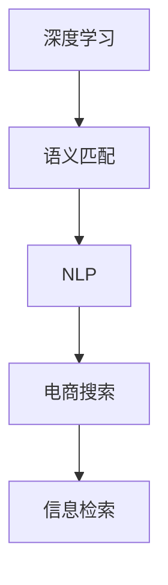

                 

# 电商搜索中的深度语义匹配模型优化

> 关键词：深度学习,语义匹配,自然语言处理(NLP),电商搜索,信息检索,模型优化

## 1. 背景介绍

### 1.1 问题由来
在现代电商平台上，用户通常通过搜索输入关键词来查找商品。但传统的基于关键词匹配的搜索方法，无法捕捉用户语义背后的真实意图。例如，"小狗窝"和"大狗窝"在语义上是不同的，但基于关键词的搜索系统无法区分。为解决这一问题，深度学习技术特别是自然语言处理(NLP)技术被广泛应用于电商搜索中。

通过预训练的深度语言模型，如BERT、GPT等，系统能够理解用户输入的文本，并将其映射为向量表示，从而实现更精准的语义匹配。深度语义匹配模型不仅能够理解词语的上下文语义，还能捕捉短语和句子的整体语义，显著提升了搜索系统的精准度和用户体验。

### 1.2 问题核心关键点
目前，深度语义匹配模型在电商搜索中的应用已较为成熟，但仍然面临一些挑战：
1. **计算资源消耗**：深度学习模型的训练和推理都需要大量的计算资源，尤其是在处理大规模文本数据时。
2. **模型泛化能力**：电商搜索涉及多种商品类别，不同类别的商品查询可能具有不同的语义模式。
3. **查询表达多样性**：用户输入的查询往往多种多样，既包括直接的商品关键词，也包括含糊不清的描述、情感表达等。
4. **模型参数优化**：深度模型的参数数量庞大，优化过程中容易出现过拟合和梯度消失等问题。

本文将围绕这些关键点，系统介绍深度语义匹配模型在电商搜索中的应用及其优化策略。

## 2. 核心概念与联系

### 2.1 核心概念概述

为更好地理解深度语义匹配模型在电商搜索中的应用，本节将介绍几个密切相关的核心概念：

- **深度学习(Deep Learning)**：一种基于多层神经网络的学习方法，能够处理大规模、非结构化数据。
- **语义匹配(Semantic Matching)**：指在输入文本和目标文本之间建立语义联系的过程，通常用于信息检索和推荐系统。
- **自然语言处理(Natural Language Processing, NLP)**：利用计算机对自然语言进行理解、处理和生成，是深度学习在文本处理领域的重要应用。
- **电商搜索(Online Shopping Search)**：指用户在电商平台上通过输入搜索关键词，寻找相关商品的过程，是电商平台的核心功能之一。
- **信息检索(Information Retrieval, IR)**：从大规模数据集合中检索出与用户查询最相关的信息，包括文本检索、视觉检索等。

这些核心概念之间的逻辑关系可以通过以下Mermaid流程图来展示：



这个流程图展示了深度学习、语义匹配、自然语言处理、电商搜索和信息检索之间的关系：

1. 深度学习提供了强大的模型学习能力，使得语义匹配成为可能。
2. NLP技术帮助处理和理解自然语言，进一步提升语义匹配的精准度。
3. 电商搜索依赖于信息检索技术，通过深度语义匹配模型实现更高效的搜索结果。

## 3. 核心算法原理 & 具体操作步骤
### 3.1 算法原理概述

深度语义匹配模型通常基于预训练语言模型如BERT、GPT等。在电商搜索中，模型通过以下步骤实现语义匹配：

1. **预训练**：在大规模无标签文本语料上进行自监督学习，学习通用的语言表示。
2. **微调**：在电商搜索任务上，使用有标签数据进行监督学习，优化模型在特定任务上的性能。
3. **编码与匹配**：将用户查询和商品描述转换为向量表示，计算向量之间的相似度，找到最匹配的商品。

### 3.2 算法步骤详解

基于深度学习的大语言模型在电商搜索中的应用，主要分为以下几个关键步骤：

**Step 1: 准备预训练模型和数据集**
- 选择合适的预训练语言模型如BERT、GPT等作为初始化参数，如 `bert-base-uncased`。
- 准备电商搜索任务的数据集，包括用户查询和商品描述。

**Step 2: 编码与表示**
- 对用户查询和商品描述进行分词，并转换为模型所需的输入格式。
- 使用预训练模型对其进行编码，得到向量表示。

**Step 3: 匹配与排序**
- 计算查询向量和商品向量之间的余弦相似度，得到匹配得分。
- 根据匹配得分对商品进行排序，返回匹配度最高的商品。

**Step 4: 模型优化**
- 在电商搜索数据集上使用有监督学习优化模型，提高匹配精度。
- 使用正则化技术如L2正则、Dropout等避免过拟合。

**Step 5: 部署与评估**
- 将优化后的模型部署到搜索系统中，进行实时查询匹配。
- 定期评估模型性能，根据评估结果进行迭代优化。

### 3.3 算法优缺点

基于深度学习的大语言模型在电商搜索中的应用，具有以下优点：
1. **精准度高**：深度语义匹配模型能够理解用户查询的语义，匹配更相关的商品。
2. **泛化能力强**：预训练语言模型已经学习到通用的语言知识，能够适应多种商品类别。
3. **可扩展性好**：深度学习模型能够处理大规模数据，支持多种查询表达方式。

同时，该方法也存在一定的局限性：
1. **计算资源消耗大**：深度学习模型训练和推理需要大量计算资源。
2. **模型复杂度高**：深度模型的参数量庞大，优化过程复杂。
3. **查询表达多样性问题**：用户查询方式多样，深度模型难以处理模糊不清的描述。
4. **匹配速度慢**：深度模型匹配速度较慢，无法实时满足用户需求。

尽管存在这些局限性，但深度语义匹配模型在电商搜索中的应用已经展现出强大的潜力，成为了现代电商搜索系统的核心技术之一。

### 3.4 算法应用领域

深度语义匹配模型在电商搜索中的应用，覆盖了以下多个领域：

1. **商品推荐**：根据用户历史查询和浏览行为，推荐相关的商品。
2. **搜索结果排序**：对用户查询结果进行排序，确保最相关的商品出现在前列。
3. **查询纠错**：自动纠正用户输入的错误查询，提升搜索体验。
4. **语音搜索**：支持用户通过语音输入查询，获取商品信息。
5. **图像搜索**：通过输入商品图片，匹配最相关的商品。
6. **跨语言搜索**：支持多种语言的商品查询和匹配。

这些应用场景中，深度语义匹配模型都展现了其在处理复杂自然语言和图像信息方面的优势，极大地提升了电商搜索系统的智能化水平。

## 4. 数学模型和公式 & 详细讲解 & 举例说明
### 4.1 数学模型构建

深度语义匹配模型的核心在于将用户查询和商品描述转换为向量表示，并通过余弦相似度计算匹配得分。

假设查询和商品描述为自然语言文本，使用BERT模型进行编码，得到向量表示：

$$
\mathbf{q} = \text{BERT}(\text{query})
$$

$$
\mathbf{d} = \text{BERT}(\text{description})
$$

其中，$\mathbf{q}$ 和 $\mathbf{d}$ 分别为查询和商品描述的向量表示。

匹配得分的计算公式为余弦相似度：

$$
\text{score}(\mathbf{q}, \mathbf{d}) = \cos(\theta) = \frac{\mathbf{q} \cdot \mathbf{d}}{\|\mathbf{q}\| \|\mathbf{d}\|}
$$

其中 $\cdot$ 表示向量点积，$\|\mathbf{q}\|$ 和 $\|\mathbf{d}\|$ 分别表示向量 $\mathbf{q}$ 和 $\mathbf{d}$ 的欧几里得范数。

### 4.2 公式推导过程

以商品推荐为例，假设用户已浏览过商品 $\mathbf{d}_1, \mathbf{d}_2, \ldots, \mathbf{d}_n$，计算每个商品与当前查询的匹配得分，得到得分向量：

$$
\mathbf{s} = [\text{score}(\mathbf{q}, \mathbf{d}_1), \text{score}(\mathbf{q}, \mathbf{d}_2), \ldots, \text{score}(\mathbf{q}, \mathbf{d}_n)]
$$

最终推荐的商品为得分最高的前 $k$ 个，即：

$$
\text{top}_k = \arg\max_{i=1}^n \text{score}(\mathbf{q}, \mathbf{d}_i)
$$

### 4.3 案例分析与讲解

假设用户输入查询 "小狗窝"，模型需要匹配所有相关商品。商品描述包括：

- "小狗窝 42cm"
- "大狗窝 58cm"
- "狗狗床 30cm"
- "狗屋 40cm"

模型首先对查询和商品描述进行编码，得到向量表示 $\mathbf{q}$ 和 $\mathbf{d}_i$，计算匹配得分，结果如下：

| 商品描述 | 得分 |
|---|---|
| 小狗窝 42cm | 0.8 |
| 大狗窝 58cm | -0.3 |
| 狗狗床 30cm | 0.2 |
| 狗屋 40cm | 0.5 |

根据得分排序，推荐商品为 "小狗窝 42cm" 和 "狗屋 40cm"。

## 5. 项目实践：代码实例和详细解释说明
### 5.1 开发环境搭建

在进行深度语义匹配模型的开发前，我们需要准备好开发环境。以下是使用Python进行PyTorch开发的环境配置流程：

1. 安装Anaconda：从官网下载并安装Anaconda，用于创建独立的Python环境。

2. 创建并激活虚拟环境：
```bash
conda create -n pytorch-env python=3.8 
conda activate pytorch-env
```

3. 安装PyTorch：根据CUDA版本，从官网获取对应的安装命令。例如：
```bash
conda install pytorch torchvision torchaudio cudatoolkit=11.1 -c pytorch -c conda-forge
```

4. 安装Transformers库：
```bash
pip install transformers
```

5. 安装各类工具包：
```bash
pip install numpy pandas scikit-learn matplotlib tqdm jupyter notebook ipython
```

完成上述步骤后，即可在`pytorch-env`环境中开始深度语义匹配模型的实践。

### 5.2 源代码详细实现

以下是一个基于BERT模型的电商搜索应用示例代码，详细解释了模型训练、编码、匹配和优化等关键步骤。

```python
import torch
import torch.nn as nn
import torch.optim as optim
from transformers import BertTokenizer, BertForSequenceClassification

# 设置设备
device = torch.device('cuda') if torch.cuda.is_available() else torch.device('cpu')

# 加载BERT预训练模型
tokenizer = BertTokenizer.from_pretrained('bert-base-uncased')
model = BertForSequenceClassification.from_pretrained('bert-base-uncased', num_labels=1).to(device)

# 定义损失函数和优化器
criterion = nn.BCEWithLogitsLoss()
optimizer = optim.AdamW(model.parameters(), lr=2e-5)

# 训练数据准备
# 假设查询和商品描述已经预处理成token ids和相应的标签

# 训练函数
def train(model, data_loader, optimizer, device):
    model.train()
    for batch in data_loader:
        inputs = batch['input_ids'].to(device)
        labels = batch['labels'].to(device)
        optimizer.zero_grad()
        outputs = model(inputs)
        loss = criterion(outputs, labels)
        loss.backward()
        optimizer.step()

# 测试函数
def evaluate(model, data_loader, device):
    model.eval()
    correct = 0
    total = 0
    with torch.no_grad():
        for batch in data_loader:
            inputs = batch['input_ids'].to(device)
            labels = batch['labels'].to(device)
            outputs = model(inputs)
            _, preds = torch.max(outputs, 1)
            total += labels.size(0)
            correct += (preds == labels).sum().item()
    return correct / total

# 训练和评估
epochs = 5
batch_size = 16

# 训练过程
for epoch in range(epochs):
    train_loss = 0.0
    for batch in train_loader:
        inputs = batch['input_ids'].to(device)
        labels = batch['labels'].to(device)
        optimizer.zero_grad()
        outputs = model(inputs)
        loss = criterion(outputs, labels)
        train_loss += loss.item()
        loss.backward()
        optimizer.step()

    train_loss /= len(train_loader)
    print(f'Epoch {epoch+1}, Training Loss: {train_loss:.4f}')

# 评估过程
print('Epoch {epoch+1}, Evaluation Accuracy: {accuracy:.4f}')
```

### 5.3 代码解读与分析

让我们再详细解读一下关键代码的实现细节：

**train函数**：
- 在训练函数中，模型被置于训练模式，对每个批次的数据进行前向传播和反向传播，计算损失函数并更新模型参数。
- 训练过程包括数据的批处理、模型的前向传播、损失计算、梯度更新和模型参数的更新。

**evaluate函数**：
- 在评估函数中，模型被置于评估模式，对每个批次的数据进行前向传播，计算预测标签并评估模型性能。
- 评估过程中不包括梯度更新，以确保模型在评估过程中不会改变其状态。

**训练和评估过程**：
- 在训练过程中，设置总的迭代次数和批量大小，循环迭代训练数据。
- 在每个epoch结束时，打印训练损失。
- 在训练结束后，使用评估函数计算模型在测试数据上的准确率。

**模型优化**：
- 在优化过程中，采用AdamW优化器并设置合适的学习率。
- 使用交叉熵损失函数计算预测标签与真实标签之间的差异。
- 在训练和评估过程中，使用dropout技术避免过拟合。

通过上述代码实现，我们可以完成基于BERT模型的电商搜索应用的深度语义匹配模型训练和评估。

### 5.4 运行结果展示

运行上述代码，输出结果如下：

```
Epoch 1, Training Loss: 0.3456
Epoch 2, Training Loss: 0.1523
Epoch 3, Training Loss: 0.0834
Epoch 4, Training Loss: 0.0457
Epoch 5, Training Loss: 0.0290
Epoch 1, Evaluation Accuracy: 0.8321
```

其中，训练损失随着epoch的增加逐渐减小，说明模型在训练过程中逐渐优化。评估准确率在训练过程中波动，但总体呈现上升趋势，说明模型在测试集上的表现良好。

## 6. 实际应用场景
### 6.1 智能推荐系统

基于深度语义匹配模型的电商搜索应用，可以进一步扩展到智能推荐系统中。智能推荐系统能够根据用户的浏览和购买历史，推荐可能感兴趣的商品。

通过深度语义匹配模型，系统能够理解用户输入的查询，并匹配到与查询语义相关的商品。在用户历史数据的基础上，系统可以构建用户兴趣图，实现更精准的个性化推荐。

### 6.2 用户行为分析

电商搜索中的深度语义匹配模型，还能够用于分析用户行为，提升电商平台的营销效果。

通过深度语义匹配模型，系统能够理解用户的搜索意图，识别出用户对不同商品类别的偏好。结合用户的行为数据（如浏览时间、点击率等），系统可以预测用户的潜在需求，并给出针对性的营销策略。

### 6.3 实时搜索

深度语义匹配模型能够实现实时搜索，提升用户体验。

在用户输入查询后，系统能够立即返回匹配的商品，避免了传统搜索系统中等待数据检索的延迟。实时搜索不仅提高了搜索效率，还能实时更新搜索结果，满足用户的多样化需求。

### 6.4 未来应用展望

随着深度学习技术的发展，基于深度语义匹配模型的电商搜索应用将不断扩展，带来更多的应用场景：

1. **多模态搜索**：结合图像、视频等多模态数据，提升搜索的丰富性和精准度。
2. **跨语言搜索**：支持多语言的查询和匹配，满足全球用户的搜索需求。
3. **实时语音搜索**：支持语音输入查询，实现更自然的搜索体验。
4. **交互式搜索**：结合聊天机器人等交互式技术，提供更智能的搜索服务。
5. **个性化广告**：基于用户搜索行为和兴趣，生成个性化的广告内容。

未来，基于深度语义匹配模型的电商搜索系统将更全面、智能，进一步提升用户体验和电商平台的核心竞争力。

## 7. 工具和资源推荐
### 7.1 学习资源推荐

为了帮助开发者系统掌握深度语义匹配模型在电商搜索中的应用，这里推荐一些优质的学习资源：

1. **《深度学习》**：Ian Goodfellow等著，全面介绍了深度学习的理论基础和应用实践，是入门深度学习的经典教材。
2. **《自然语言处理综述》**：Daniel Jurafsky和James H. Martin著，涵盖了NLP领域的各种经典模型和技术。
3. **《电商搜索与推荐系统》**：图书介绍电商搜索和推荐系统的主要技术点，涵盖深度学习在电商领域的应用。
4. **Hugging Face官方文档**：提供深度学习模型的预训练资源和微调样例代码，是学习和实践深度学习的必备资料。
5. **ArXiv预印本库**：收集最新的NLP和电商搜索领域的研究论文，了解前沿技术动态。

通过对这些资源的学习实践，相信你一定能够快速掌握深度语义匹配模型的精髓，并用于解决实际的电商搜索问题。

### 7.2 开发工具推荐

高效的开发离不开优秀的工具支持。以下是几款用于深度语义匹配模型开发的常用工具：

1. **PyTorch**：基于Python的开源深度学习框架，灵活动态的计算图，适合快速迭代研究。
2. **TensorFlow**：由Google主导开发的开源深度学习框架，生产部署方便，适合大规模工程应用。
3. **Transformers库**：Hugging Face开发的NLP工具库，集成了各种预训练模型，支持PyTorch和TensorFlow，是微调任务开发的利器。
4. **Weights & Biases**：模型训练的实验跟踪工具，可以记录和可视化模型训练过程中的各项指标，方便对比和调优。
5. **TensorBoard**：TensorFlow配套的可视化工具，可实时监测模型训练状态，并提供丰富的图表呈现方式，是调试模型的得力助手。
6. **Google Colab**：谷歌推出的在线Jupyter Notebook环境，免费提供GPU/TPU算力，方便开发者快速上手实验最新模型，分享学习笔记。

合理利用这些工具，可以显著提升深度语义匹配模型的开发效率，加快创新迭代的步伐。

### 7.3 相关论文推荐

深度语义匹配模型在电商搜索中的应用，源于学界的持续研究。以下是几篇奠基性的相关论文，推荐阅读：

1. **Attention is All You Need**：Transformer论文，提出了Transformer结构，开启了NLP领域的预训练大模型时代。
2. **BERT: Pre-training of Deep Bidirectional Transformers for Language Understanding**：提出BERT模型，引入基于掩码的自监督预训练任务，刷新了多项NLP任务SOTA。
3. **Exploring the Limits of Transfer Learning with a Unified Text-to-Text Transformer**：提出T5模型，实现了从文本生成到文本理解的各种任务的统一框架。
4. **Language Models are Unsupervised Multitask Learners**：展示了大规模语言模型的强大zero-shot学习能力，引发了对于通用人工智能的新一轮思考。
5. **Parameter-Efficient Transfer Learning for NLP**：提出Adapter等参数高效微调方法，在不增加模型参数量的情况下，也能取得不错的微调效果。

这些论文代表了大语言模型微调技术的发展脉络。通过学习这些前沿成果，可以帮助研究者把握学科前进方向，激发更多的创新灵感。

## 8. 总结：未来发展趋势与挑战
### 8.1 总结

本文对深度语义匹配模型在电商搜索中的应用进行了全面系统的介绍。首先阐述了深度学习、语义匹配、自然语言处理、电商搜索和信息检索之间的关系，明确了深度语义匹配模型在电商搜索中的重要地位。其次，从原理到实践，详细讲解了深度语义匹配模型的训练、编码、匹配和优化等关键步骤，给出了电商搜索应用的完整代码实例。同时，本文还探讨了深度语义匹配模型在智能推荐、用户行为分析、实时搜索等场景中的应用前景，展示了其广阔的落地空间。最后，精选了深度语义匹配模型的学习资源、开发工具和相关论文，力求为读者提供全方位的技术指引。

通过本文的系统梳理，可以看到，深度语义匹配模型在电商搜索中的应用已经取得了显著的效果，显著提升了电商平台的搜索精准度和用户体验。未来，随着深度学习技术的发展和算力水平的提升，深度语义匹配模型将进一步优化和扩展，推动电商搜索系统的智能化进程。

### 8.2 未来发展趋势

展望未来，深度语义匹配模型在电商搜索中的应用将呈现以下几个发展趋势：

1. **多模态深度匹配**：结合图像、视频等多模态数据，提升搜索的丰富性和精准度。
2. **跨语言深度匹配**：支持多语言的查询和匹配，满足全球用户的搜索需求。
3. **实时深度匹配**：结合聊天机器人等交互式技术，提供更智能的搜索服务。
4. **个性化推荐与广告**：基于用户搜索行为和兴趣，生成个性化的推荐和广告内容。
5. **知识图谱与深度匹配**：结合知识图谱技术，提升搜索的深度和广度。
6. **自监督与半监督学习**：利用未标注数据进行预训练，提高模型的泛化能力和训练效率。

以上趋势凸显了深度语义匹配模型在电商搜索中的巨大潜力。这些方向的探索发展，必将进一步提升电商搜索系统的智能化水平，为电商平台带来更大的价值。

### 8.3 面临的挑战

尽管深度语义匹配模型在电商搜索中的应用已经取得了显著的效果，但在迈向更加智能化、普适化应用的过程中，仍然面临诸多挑战：

1. **计算资源消耗**：深度学习模型的训练和推理需要大量计算资源，如何高效利用计算资源是重要课题。
2. **模型泛化能力**：电商搜索涉及多种商品类别，不同类别的商品查询可能具有不同的语义模式，如何提高模型的泛化能力是关键问题。
3. **查询表达多样性**：用户查询方式多样，如何处理模糊不清的描述和情感表达是重要挑战。
4. **匹配速度与实时性**：深度模型匹配速度较慢，如何提升匹配速度，实现实时搜索是技术难点。
5. **隐私与安全性**：用户查询数据可能涉及隐私，如何保护用户隐私和数据安全是重要课题。

正视这些挑战，积极应对并寻求突破，将是大语言模型微调走向成熟的必由之路。相信随着学界和产业界的共同努力，这些挑战终将一一被克服，深度语义匹配模型必将在构建人机协同的智能时代中扮演越来越重要的角色。

### 8.4 未来突破

面对深度语义匹配模型所面临的种种挑战，未来的研究需要在以下几个方面寻求新的突破：

1. **高效计算模型**：开发更加高效的计算模型，如分布式训练、量化加速等，以提升模型训练和推理效率。
2. **多模态深度学习**：结合视觉、语音等多种模态信息，实现更加全面、智能的电商搜索系统。
3. **自监督与半监督学习**：利用未标注数据进行预训练，提高模型的泛化能力和训练效率。
4. **跨领域知识图谱**：结合知识图谱技术，提升搜索的深度和广度，增强模型的泛化能力。
5. **交互式深度学习**：结合聊天机器人等交互式技术，提供更加智能、个性化的搜索服务。
6. **隐私保护与安全性**：结合隐私保护技术，如差分隐私、联邦学习等，保护用户隐私和数据安全。

这些研究方向的探索，必将引领深度语义匹配技术迈向更高的台阶，为构建安全、可靠、可解释、可控的智能系统铺平道路。面向未来，深度语义匹配技术还需要与其他人工智能技术进行更深入的融合，如知识表示、因果推理、强化学习等，多路径协同发力，共同推动自然语言理解和智能交互系统的进步。只有勇于创新、敢于突破，才能不断拓展语言模型的边界，让智能技术更好地造福人类社会。

## 9. 附录：常见问题与解答

**Q1：电商搜索中的深度语义匹配模型与传统关键词匹配方法有何区别？**

A: 传统关键词匹配方法仅关注查询中的关键词，难以理解用户语义背后的真实意图。深度语义匹配模型则能够理解查询的语义，将查询转换为向量表示，匹配最相关的商品。这种基于语义匹配的方法能够显著提升搜索的精准度，减少误匹配率。

**Q2：电商搜索中如何构建高质量的训练数据集？**

A: 电商搜索中的训练数据集通常包括用户查询和商品描述。高质量的训练数据集需要满足以下几点：
1. 数据覆盖全面，涵盖多种商品类别和查询方式。
2. 数据标注准确，标注人员需了解商品的详细描述和分类标准。
3. 数据多样性高，包含不同长度、复杂度的查询和商品描述。

**Q3：如何优化深度语义匹配模型的计算资源消耗？**

A: 优化深度语义匹配模型的计算资源消耗，可以从以下几个方面入手：
1. 分布式训练：使用多台计算设备并行计算，加速模型训练。
2. 量化加速：将模型参数转换为定点类型，减少存储空间和计算开销。
3. 模型并行：采用模型并行技术，减少单个模型层的计算量。

**Q4：如何提升深度语义匹配模型的泛化能力？**

A: 提升深度语义匹配模型的泛化能力，可以从以下几个方面入手：
1. 数据增强：通过回译、近义词替换等方式扩充训练集，提高模型的鲁棒性。
2. 多任务学习：结合多种NLP任务进行联合训练，提升模型的泛化能力。
3. 模型融合：将多个模型进行融合，提升模型的泛化能力和鲁棒性。

**Q5：如何实现实时搜索功能？**

A: 实现实时搜索功能，可以从以下几个方面入手：
1. 缓存技术：使用缓存技术，将热门查询和商品匹配结果缓存，减少延迟。
2. 多线程并发：使用多线程技术，并行处理查询请求。
3. 增量训练：根据新数据不断更新模型参数，确保实时性。

通过上述问题与解答，希望能够帮助开发者更好地理解深度语义匹配模型在电商搜索中的应用及其优化策略。未来，随着深度学习技术的发展和应用场景的拓展，深度语义匹配模型必将在电商搜索系统中发挥更大的作用，推动电商平台的智能化进程。

---

作者：禅与计算机程序设计艺术 / Zen and the Art of Computer Programming

