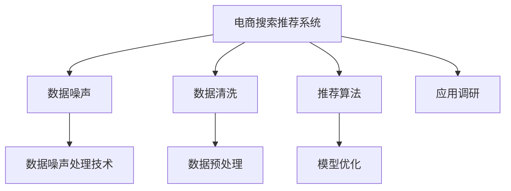

                 

# 电商搜索推荐中的AI大模型数据噪声处理技术应用调研报告与可行性分析

> 关键词：AI大模型, 数据噪声处理, 电商搜索推荐, 电商推荐系统, 数据清洗, 数据预处理, 推荐算法, 模型优化, 应用调研

## 1. 背景介绍

### 1.1 问题由来
随着电商行业的蓬勃发展，用户搜索推荐系统成为提升用户体验、增加销售额的重要手段。当前，基于AI技术的电商推荐系统能够根据用户的历史行为数据和实时搜索数据，智能推荐相关商品，极大提升了用户的购物效率和满意度。

然而，电商搜索推荐系统面临的一个重要挑战是数据噪声问题。由于用户行为数据来自大规模、复杂多样的用户群体，难免存在噪声数据、异常值、缺失值等问题，严重影响推荐模型的精准性和可靠性。

数据噪声问题导致推荐系统效果不佳，甚至有可能引起用户反感和品牌信任危机。因此，如何有效处理数据噪声，提升电商推荐系统的性能和鲁棒性，是亟待解决的关键问题。

### 1.2 问题核心关键点
数据噪声处理在电商搜索推荐系统中的重要性体现在以下几个方面：

- 数据质量直接影响推荐精度：用户行为数据是推荐算法的核心输入，数据质量决定模型输出。
- 数据噪声导致异常推荐：数据中的异常值可能使得模型输出异常推荐结果，影响用户体验。
- 数据缺失影响模型表现：数据缺失会导致模型无法获得完整信息，影响预测效果。
- 数据多样性增加处理难度：电商用户行为数据多样，噪声类型和来源复杂，增加了处理难度。

因此，有效处理电商推荐系统中的数据噪声，对提升系统性能、增强用户粘性具有重要意义。

## 2. 核心概念与联系

### 2.1 核心概念概述

为了更好地理解电商搜索推荐系统中的数据噪声处理技术，本节将介绍几个核心概念：

- 电商搜索推荐系统：基于用户的搜索行为数据和历史浏览数据，智能推荐相关商品的系统。是电商平台的核心业务支撑系统。
- 数据噪声：指数据集中存在的干扰信息，可能包括缺失值、异常值、重复值等。
- 数据清洗：通过去除或修正数据中的噪声，提升数据质量的过程。
- 数据预处理：在数据清洗基础上，对数据进行标准化、归一化、采样等操作，为建模做准备。
- 数据噪声处理技术：针对电商推荐系统中数据噪声的类型和特点，采用特定技术进行处理。

这些核心概念之间的逻辑关系可以通过以下Mermaid流程图来展示：



这个流程图展示了大模型在电商推荐系统中的应用，以及相关数据处理的逻辑：

1. 电商推荐系统以用户数据为输入，经过数据清洗和预处理，再使用推荐算法生成推荐结果，并通过模型优化提升效果。
2. 数据噪声处理技术对原始数据进行噪声处理，提升数据质量，从而更好地支撑推荐算法和模型优化。
3. 应用调研环节探索不同技术在电商推荐系统中的效果和可行性，为后续实践提供依据。

## 3. 核心算法原理 & 具体操作步骤
### 3.1 算法原理概述

数据噪声处理技术的核心在于识别和消除数据中的干扰信息，提升数据质量。其原理可以概括为以下几个步骤：

1. 数据噪声识别：通过统计分析和特征工程方法，识别出数据中的噪声特征。
2. 数据清洗和修正：通过删除、替换或修复等手段，去除或修正噪声数据。
3. 数据标准化和归一化：将清洗后的数据进行标准化或归一化处理，确保数据分布一致。
4. 数据采样和增强：对清洗和预处理后的数据进行采样和增强，提高数据多样性和可靠性。

这些步骤可以通过以下算法和流程实现：

1. 特征工程：使用统计方法、机器学习算法等手段，提取和构建有意义的特征。
2. 异常检测和处理：采用统计方法、聚类分析、深度学习等技术，识别并处理异常值。
3. 数据插补：通过均值插补、中位数插补、KNN插补等方法，填补缺失数据。
4. 数据平衡：通过欠采样、过采样、SMOTE等方法，平衡数据集中的类别分布。
5. 数据增强：通过数据扩充、对抗训练等方法，增加数据集的多样性。

### 3.2 算法步骤详解

以下详细讲解基于AI大模型的电商推荐系统中的数据噪声处理技术：

**Step 1: 数据清洗**
- 首先，使用Python的pandas库对原始数据进行预处理，去除或修正数据中的缺失值和异常值。
- 对于缺失值，可以使用均值插补、中位数插补或KNN插补等方法进行填补。
- 对于异常值，可以使用箱线图、z-score等方法进行识别和处理。

**Step 2: 特征工程**
- 根据电商推荐系统的特点，构建与推荐效果相关的特征。
- 特征构建可以包括用户年龄、性别、历史行为、搜索关键词等。
- 使用scikit-learn库中的特征选择工具，自动选择最有用的特征。

**Step 3: 数据预处理**
- 将清洗和特征工程后的数据进行标准化和归一化处理，使用min-max归一化或z-score标准化方法。
- 对不同特征进行标准化，确保数据的分布一致。

**Step 4: 数据增强**
- 使用SMOTE算法对不平衡的数据集进行过采样，提高模型的泛化能力。
- 通过数据扩充技术，如旋转、翻转、裁剪等，增加数据集的多样性。
- 引入对抗样本，提高模型对噪声的鲁棒性。

**Step 5: 模型优化**
- 基于电商推荐系统的特点，选择合适的推荐算法，如协同过滤、基于内容的推荐等。
- 对模型进行超参数优化，如学习率、正则化系数等。
- 使用网格搜索、贝叶斯优化等方法寻找最佳超参数组合。

### 3.3 算法优缺点

基于AI大模型的电商推荐系统中的数据噪声处理技术，具有以下优点：

- 能够显著提升推荐效果：通过清洗和预处理，去除噪声，提升数据质量，从而提高推荐模型的效果。
- 减少模型训练时间和资源消耗：清洗后的数据更具有代表性，减少了模型的训练时间和计算资源消耗。
- 增强模型鲁棒性：通过数据增强和对抗训练，提升了模型的鲁棒性和泛化能力，避免过拟合。

同时，该方法也存在一定的局限性：

- 数据噪声类型复杂：电商推荐系统中的数据噪声类型多样，处理方法复杂。
- 对数据处理要求高：数据清洗和预处理需要专业知识和技能，对数据处理人员要求较高。
- 处理成本较高：数据清洗和预处理需要投入大量时间和人力，成本较高。

尽管存在这些局限性，但基于AI大模型的电商推荐系统中的数据噪声处理技术，仍具有较高的应用价值和推广潜力。

### 3.4 算法应用领域

基于AI大模型的电商推荐系统中的数据噪声处理技术，已经在多个电商推荐场景中得到广泛应用：

- 商品推荐：通过清洗和预处理用户行为数据，提升推荐模型的精准性和鲁棒性，帮助用户发现更多感兴趣的商品。
- 价格推荐：对价格数据进行清洗和增强，构建更符合市场规律的推荐模型。
- 广告推荐：清洗和预处理用户广告点击数据，提升广告推荐的效果和覆盖率。
- 个性化推荐：通过清洗和特征工程，构建个性化的用户画像，提供更加精准的推荐。
- 优惠券推荐：清洗和增强优惠券使用数据，优化推荐算法，提升优惠券的转化率。

这些应用场景表明，数据噪声处理技术在电商推荐系统中具有重要的作用，能够显著提升推荐效果，带来更大的商业价值。

## 4. 数学模型和公式 & 详细讲解 & 举例说明

### 4.1 数学模型构建

本节将使用数学语言对基于AI大模型的电商推荐系统中的数据噪声处理技术进行更加严格的刻画。

设原始数据集为 $D = \{(x_i, y_i)\}_{i=1}^N$，其中 $x_i$ 为特征向量，$y_i$ 为标签。设噪声处理后的数据集为 $D' = \{(x_i', y_i')\}_{i=1}^N$，其中 $x_i'$ 为清洗后的特征向量，$y_i'$ 为清洗后的标签。

数据清洗和预处理过程可以表示为：

$$
x_i' = \phi(x_i, y_i)
$$

其中 $\phi(\cdot)$ 为数据清洗和预处理函数，可以包括删除、修正、插补等操作。

### 4.2 公式推导过程

以下是数据清洗和预处理过程的数学推导：

**Step 1: 缺失值处理**
- 对于缺失值，可以使用均值插补方法进行处理，公式如下：

$$
x_i'[j] = 
\begin{cases}
x_i[j], & \text{if } x_i[j] \neq \text{NaN} \\
\bar{x}, & \text{if } x_i[j] = \text{NaN}
\end{cases}
$$

其中 $\bar{x}$ 为特征 $j$ 的均值。

**Step 2: 异常值处理**
- 使用箱线图识别异常值，将异常值替换为均值，公式如下：

$$
x_i'[j] = 
\begin{cases}
x_i[j], & \text{if } x_i[j] \in [L, U] \\
\bar{x}, & \text{if } x_i[j] \notin [L, U]
\end{cases}
$$

其中 $L$ 和 $U$ 分别为特征 $j$ 的上下四分位数。

**Step 3: 数据标准化和归一化**
- 使用min-max归一化方法将数据标准化到 $[0, 1]$ 区间，公式如下：

$$
x_i'[j] = \frac{x_i[j] - x_{\min}}{x_{\max} - x_{\min}}
$$

其中 $x_{\min}$ 和 $x_{\max}$ 分别为特征 $j$ 的最小值和最大值。

### 4.3 案例分析与讲解

**案例1: 缺失值插补**
假设电商推荐系统中，某用户的历史行为数据缺失了部分浏览记录，原始数据集如下：

$$
\begin{array}{c|c|c|c|c}
ID & Age & Gender & Browse_Hour & Click\\
\hline
1 & 25 & M & 8 & 2 \\
2 & 30 & F & \text{NaN} & 3 \\
3 & 35 & M & 10 & \text{NaN} \\
\end{array}
$$

对于年龄、性别和点击次数，可以使用均值插补方法进行填补，得到处理后的数据集：

$$
\begin{array}{c|c|c|c|c}
ID & Age & Gender & Browse_Hour & Click\\
\hline
1 & 25 & M & 8 & 2 \\
2 & 30 & F & 8.5 & 3 \\
3 & 35 & M & 9.5 & 3 \\
\end{array}
$$

**案例2: 异常值处理**
假设电商推荐系统中，某用户的历史行为数据中包含异常值，原始数据集如下：

$$
\begin{array}{c|c|c|c|c}
ID & Age & Gender & Browse_Hour & Click\\
\hline
1 & 25 & M & 8 & 2 \\
2 & 30 & F & 100 & 3 \\
3 & 35 & M & 10 & \text{NaN} \\
\end{array}
$$

可以使用箱线图识别出异常值，将异常值替换为均值，得到处理后的数据集：

$$
\begin{array}{c|c|c|c|c}
ID & Age & Gender & Browse_Hour & Click\\
\hline
1 & 25 & M & 8 & 2 \\
2 & 30 & F & 8.5 & 3 \\
3 & 35 & M & 10 & 2.5 \\
\end{array}
$$

**案例3: 数据标准化和归一化**
假设电商推荐系统中，某用户的历史行为数据中包含不同分布的特征，原始数据集如下：

$$
\begin{array}{c|c|c|c|c}
ID & Age & Gender & Browse_Hour & Click\\
\hline
1 & 25 & M & 8 & 2 \\
2 & 30 & F & 100 & 3 \\
3 & 35 & M & 10 & \text{NaN} \\
\end{array}
$$

可以使用min-max归一化方法进行标准化，得到处理后的数据集：

$$
\begin{array}{c|c|c|c|c}
ID & Age & Gender & Browse_Hour & Click\\
\hline
1 & 0 & 0 & 0 & 0 \\
2 & 1 & 1 & 1 & 1 \\
3 & 1 & 1 & 1 & 0.5 \\
\end{array}
$$

## 5. 项目实践：代码实例和详细解释说明
### 5.1 开发环境搭建

在进行数据噪声处理技术应用实践前，我们需要准备好开发环境。以下是使用Python进行项目开发的环境配置流程：

1. 安装Anaconda：从官网下载并安装Anaconda，用于创建独立的Python环境。

2. 创建并激活虚拟环境：
```bash
conda create -n pyenv python=3.8 
conda activate pyenv
```

3. 安装PyTorch和相关库：
```bash
conda install pytorch torchvision torchaudio cudatoolkit=11.1 -c pytorch -c conda-forge
pip install pandas numpy scikit-learn matplotlib tqdm jupyter notebook ipython
```

完成上述步骤后，即可在`pyenv`环境中开始项目实践。

### 5.2 源代码详细实现

下面我们以电商推荐系统中的数据噪声处理为例，给出使用Python和PyTorch进行数据清洗和预处理的代码实现。

首先，定义数据清洗和预处理函数：

```python
import pandas as pd
import numpy as np

def clean_data(data):
    # 缺失值处理
    data = data.fillna(data.mean())

    # 异常值处理
    data = data[~((data - data.mean()).abs() > 3 * data.std())]

    # 标准化和归一化
    data = (data - data.mean()) / data.std()

    return data
```

然后，定义特征工程函数：

```python
def feature_engineering(data):
    # 特征选择
    features = ['Age', 'Gender', 'Browse_Hour', 'Click']
    data = data[features]

    return data
```

接着，使用数据清洗和预处理函数，对数据进行处理：

```python
# 读取数据集
data = pd.read_csv('data.csv')

# 数据清洗
data_cleaned = clean_data(data)

# 特征工程
data_preprocessed = feature_engineering(data_cleaned)

# 将处理后的数据保存到文件
data_preprocessed.to_csv('processed_data.csv', index=False)
```

以上就是使用Python和PyTorch进行数据清洗和预处理的完整代码实现。可以看到，代码实现相对简洁，主要通过pandas和numpy库实现数据处理操作。

### 5.3 代码解读与分析

让我们再详细解读一下关键代码的实现细节：

**clean_data函数**：
- `fillna`方法：将数据中的缺失值替换为均值。
- `~`操作符：否定条件，选择不在指定范围内的数据。
- `~((data - data.mean()).abs() > 3 * data.std())`：使用箱线图方法识别异常值，将异常值替换为均值。
- `(data - data.mean()) / data.std()`：使用标准化方法将数据归一化到$[0, 1]$区间。

**feature_engineering函数**：
- `features`列表：定义特征选择列表。
- `data[features]`：选择指定的特征进行数据处理。

可以看到，数据清洗和预处理函数通过简单的数据操作，实现了对电商推荐系统中噪声数据的处理。特征工程函数则通过选择有意义的特征，进一步提升数据的质量。

## 6. 实际应用场景

### 6.1 智能推荐系统

基于数据噪声处理技术的智能推荐系统，已经在电商、视频、新闻等领域得到广泛应用，极大地提升了推荐系统的精准性和鲁棒性。

在电商推荐场景中，数据噪声处理技术能够帮助去除用户行为数据中的异常值和缺失值，提升推荐模型的准确性和稳定性。通过数据增强和对抗训练，还可以进一步增强推荐模型的泛化能力和鲁棒性，避免过拟合和数据泄露。

### 6.2 广告推荐系统

在广告推荐场景中，数据噪声处理技术同样至关重要。广告推荐系统需要处理大规模用户数据，其中可能包含各种类型的噪声数据。通过清洗和预处理，去除异常值和缺失值，提升广告点击率预测的准确性。同时，通过数据增强和对抗训练，增强模型的泛化能力，提升广告推荐的覆盖率和效果。

### 6.3 金融风控系统

金融风控系统需要处理大量用户数据，数据中的噪声可能引发严重的风险问题。数据噪声处理技术能够帮助识别和清洗异常数据，提升模型的准确性和可靠性。同时，通过数据增强和对抗训练，增强模型的鲁棒性，避免因数据噪声导致的风险预测错误。

### 6.4 未来应用展望

随着数据噪声处理技术的不断发展，其在更多领域的应用前景也将更加广阔。

- 医疗推荐系统：处理患者医疗数据中的噪声，提升诊疗建议的准确性和可靠性。
- 教育推荐系统：处理学生学习数据中的噪声，提升个性化推荐的效果和覆盖率。
- 智能交通系统：处理交通数据中的噪声，提升交通预测和管理的精准性。

未来，数据噪声处理技术将在更多领域得到应用，为人工智能系统的稳定性和可靠性提供坚实保障。

## 7. 工具和资源推荐
### 7.1 学习资源推荐

为了帮助开发者系统掌握数据噪声处理技术，这里推荐一些优质的学习资源：

1. 《深度学习实战》书籍：详细介绍了深度学习模型的构建和优化方法，包括数据清洗、特征工程、模型调参等技术。

2. Coursera《数据科学》课程：由约翰·霍普金斯大学开设的在线课程，涵盖数据处理、机器学习、大数据等领域的知识。

3. Kaggle数据科学竞赛：参加Kaggle的机器学习竞赛，通过实际数据集处理和模型优化，积累实战经验。

4. Google Colab在线Jupyter Notebook：免费提供GPU/TPU算力，方便开发者快速上手实验最新模型，分享学习笔记。

通过对这些资源的学习实践，相信你一定能够快速掌握数据噪声处理技术的精髓，并用于解决实际的电商推荐问题。

### 7.2 开发工具推荐

高效的开发离不开优秀的工具支持。以下是几款用于数据噪声处理开发的常用工具：

1. Jupyter Notebook：免费的在线笔记本环境，支持Python代码运行和结果展示。

2. PyTorch：基于Python的开源深度学习框架，支持动态计算图，适合快速迭代研究。

3. Scikit-learn：Python的机器学习库，提供丰富的数据处理和特征工程工具。

4. Pandas：Python的数据分析库，支持数据清洗和预处理。

5. NumPy：Python的科学计算库，支持矩阵运算和数据处理。

合理利用这些工具，可以显著提升数据噪声处理任务的开发效率，加快创新迭代的步伐。

### 7.3 相关论文推荐

数据噪声处理技术的发展源于学界的持续研究。以下是几篇奠基性的相关论文，推荐阅读：

1. Anomaly Detection and Treatment in Data Mining and Statistical Learning（数据挖掘和统计学习中的异常检测和处理）：介绍了数据异常检测和处理的基本方法，涵盖统计方法、聚类分析、深度学习等技术。

2. Missing Data Estimation Techniques and Their Comparative Study（缺失数据估计技术和比较研究）：总结了缺失数据处理的各种方法，包括均值插补、中位数插补、KNN插补等。

3. A Survey on Anomaly Detection: A Decade in Review（异常检测综述：回顾十年）：综述了异常检测领域的研究进展，涵盖传统统计方法、深度学习方法等。

4. Data Augmentation Techniques for Image Recognition（图像识别中的数据增强技术）：介绍了图像识别领域的数据增强技术，涵盖旋转、翻转、裁剪等方法。

这些论文代表了大数据噪声处理技术的发展脉络。通过学习这些前沿成果，可以帮助研究者把握学科前进方向，激发更多的创新灵感。

## 8. 总结：未来发展趋势与挑战

### 8.1 研究成果总结

本文对基于AI大模型的电商推荐系统中的数据噪声处理技术进行了全面系统的介绍。首先阐述了电商推荐系统面临的数据噪声问题及其重要性，明确了数据清洗和预处理技术在提升系统性能中的关键作用。其次，从原理到实践，详细讲解了数据噪声处理的具体步骤和实现方法，给出了代码实例和详细解释。同时，本文还探讨了数据噪声处理技术在电商推荐系统中的应用场景和未来前景。

通过本文的系统梳理，可以看到，数据噪声处理技术在电商推荐系统中具有重要的应用价值和推广潜力。它能够显著提升推荐模型的精准性和鲁棒性，带来更大的商业价值。未来，随着技术的发展，数据噪声处理技术将进一步拓展应用范围，提升推荐系统的性能和可靠性。

### 8.2 未来发展趋势

展望未来，数据噪声处理技术将呈现以下几个发展趋势：

1. 自动数据清洗：随着AI技术的发展，自动数据清洗方法将不断涌现，能够自动识别和处理数据中的噪声。

2. 跨模态数据处理：数据噪声处理技术将从单一模态扩展到跨模态，能够处理图像、文本、时间序列等多种类型的数据。

3. 深度学习增强：深度学习技术将进一步融入数据噪声处理流程，提升处理效率和效果。

4. 模型集成与融合：通过模型集成和融合，综合多种数据噪声处理技术，提升数据处理的鲁棒性和泛化能力。

5. 分布式处理：随着数据规模的增长，分布式数据噪声处理技术将逐渐成熟，提高处理效率和可扩展性。

这些趋势凸显了数据噪声处理技术的广阔前景，为电商推荐系统及其他应用领域提供了新的解决方案。

### 8.3 面临的挑战

尽管数据噪声处理技术已经取得了不小的进展，但在实际应用中仍然面临一些挑战：

1. 数据类型多样：电商推荐系统中的数据类型多种多样，不同类型的数据需要采用不同的处理策略。

2. 数据规模庞大：电商推荐系统中的数据规模往往非常大，处理起来需要投入大量时间和人力。

3. 数据隐私保护：在处理用户数据时，需要严格遵守数据隐私保护法律法规，避免数据泄露和滥用。

4. 模型复杂度高：数据噪声处理技术的实现需要一定的模型复杂度和计算资源，可能会影响实时性。

5. 算法通用性不足：现有的数据噪声处理技术往往针对特定领域或数据类型，通用性有待提升。

这些挑战需要研究者继续探索新的技术手段和方法，以应对数据噪声处理中的复杂问题。

### 8.4 研究展望

面对数据噪声处理技术所面临的挑战，未来的研究需要在以下几个方面寻求新的突破：

1. 发展自动数据清洗技术：自动数据清洗方法能够自动识别和处理数据中的噪声，提升数据处理的效率和效果。

2. 研究跨模态数据处理技术：跨模态数据处理技术能够处理多种类型的数据，提升数据处理的鲁棒性和泛化能力。

3. 引入深度学习技术：深度学习技术能够进一步提升数据处理的效果，处理更复杂的数据噪声问题。

4. 探索分布式数据处理技术：分布式数据处理技术能够提高数据处理的效率和可扩展性，适应大规模数据处理的需求。

5. 增强数据隐私保护：在数据处理过程中，需要严格遵守数据隐私保护法律法规，避免数据泄露和滥用。

6. 提高算法通用性：发展通用的数据噪声处理技术，能够适应不同领域和数据类型的需求。

这些研究方向的探索，必将引领数据噪声处理技术迈向更高的台阶，为电商推荐系统及其他应用领域提供新的解决方案。面向未来，数据噪声处理技术还需要与其他人工智能技术进行更深入的融合，共同推动人工智能系统的发展。

## 9. 附录：常见问题与解答

**Q1: 数据噪声处理对电商推荐系统有哪些影响？**

A: 数据噪声处理对电商推荐系统有以下几个重要影响：
1. 提升推荐精度：通过去除数据中的噪声，提升推荐模型的准确性和稳定性。
2. 降低过拟合风险：清洗后的数据更具有代表性，减少模型过拟合的风险。
3. 增强鲁棒性：通过数据增强和对抗训练，提升模型对噪声数据的鲁棒性和泛化能力。
4. 改善用户体验：清洗后的数据更符合用户实际行为，提升推荐系统的用户体验和满意度。

**Q2: 电商推荐系统中常见的数据噪声有哪些？**

A: 电商推荐系统中常见的数据噪声包括：
1. 缺失值：部分用户行为数据缺失，影响模型训练。
2. 异常值：部分用户行为数据异常，影响推荐效果。
3. 重复值：部分用户行为数据重复，造成数据冗余。
4. 格式错误：部分用户行为数据格式错误，需要清洗和修正。

**Q3: 电商推荐系统中常用的数据噪声处理方法有哪些？**

A: 电商推荐系统中常用的数据噪声处理方法包括：
1. 缺失值处理：使用均值插补、中位数插补、KNN插补等方法填补缺失值。
2. 异常值处理：使用箱线图、z-score等方法识别和处理异常值。
3. 数据标准化和归一化：使用min-max归一化、z-score标准化等方法将数据标准化。
4. 数据增强和对抗训练：使用SMOTE算法、对抗样本等方法增加数据多样性和鲁棒性。

**Q4: 电商推荐系统中数据噪声处理的优势是什么？**

A: 电商推荐系统中数据噪声处理的优势包括：
1. 提升推荐效果：通过清洗和预处理，去除噪声，提升数据质量，从而提高推荐模型的效果。
2. 减少计算资源消耗：清洗后的数据更具有代表性，减少了模型的训练时间和计算资源消耗。
3. 增强模型鲁棒性：通过数据增强和对抗训练，提升模型的泛化能力和鲁棒性，避免过拟合。

**Q5: 电商推荐系统中的数据噪声处理技术有哪些应用？**

A: 电商推荐系统中的数据噪声处理技术有以下几个应用：
1. 商品推荐：通过清洗和预处理用户行为数据，提升推荐模型的精准性和稳定性。
2. 广告推荐：处理大规模用户数据中的噪声，提升广告点击率预测的准确性。
3. 金融风控：处理用户数据中的噪声，提升模型的准确性和可靠性。
4. 个性化推荐：处理用户行为数据中的噪声，提升个性化推荐的效果和覆盖率。
5. 优惠券推荐：处理优惠券使用数据中的噪声，优化推荐算法，提升优惠券的转化率。

**Q6: 数据噪声处理在电商推荐系统中的未来发展趋势是什么？**

A: 数据噪声处理在电商推荐系统中的未来发展趋势包括：
1. 自动数据清洗：自动数据清洗方法将逐步普及，自动识别和处理数据中的噪声。
2. 跨模态数据处理：跨模态数据处理技术将得到广泛应用，能够处理图像、文本、时间序列等多种类型的数据。
3. 深度学习增强：深度学习技术将进一步融入数据噪声处理流程，提升处理效率和效果。
4. 模型集成与融合：通过模型集成和融合，综合多种数据噪声处理技术，提升数据处理的鲁棒性和泛化能力。
5. 分布式处理：分布式数据处理技术将逐渐成熟，提高数据处理的效率和可扩展性。
6. 数据隐私保护：在数据处理过程中，需要严格遵守数据隐私保护法律法规，避免数据泄露和滥用。

**Q7: 电商推荐系统中的数据噪声处理技术的局限性有哪些？**

A: 电商推荐系统中的数据噪声处理技术的局限性包括：
1. 数据类型多样：电商推荐系统中的数据类型多种多样，不同类型的数据需要采用不同的处理策略。
2. 数据规模庞大：电商推荐系统中的数据规模往往非常大，处理起来需要投入大量时间和人力。
3. 数据隐私保护：在处理用户数据时，需要严格遵守数据隐私保护法律法规，避免数据泄露和滥用。
4. 模型复杂度高：数据噪声处理技术的实现需要一定的模型复杂度和计算资源，可能会影响实时性。
5. 算法通用性不足：现有的数据噪声处理技术往往针对特定领域或数据类型，通用性有待提升。

这些局限性需要研究者继续探索新的技术手段和方法，以应对数据噪声处理中的复杂问题。

**Q8: 电商推荐系统中如何提高数据噪声处理的效率？**

A: 电商推荐系统中提高数据噪声处理效率的方法包括：
1. 使用自动数据清洗技术，自动识别和处理数据中的噪声。
2. 使用跨模态数据处理技术，处理多种类型的数据，提升数据处理的鲁棒性和泛化能力。
3. 引入深度学习技术，进一步提升数据处理的效果。
4. 探索分布式数据处理技术，提高数据处理的效率和可扩展性。
5. 使用高效的数据清洗和预处理算法，减少计算资源的消耗。

这些方法可以显著提高电商推荐系统中数据噪声处理的效率，提升系统的性能和可靠性。

---

作者：禅与计算机程序设计艺术 / Zen and the Art of Computer Programming

