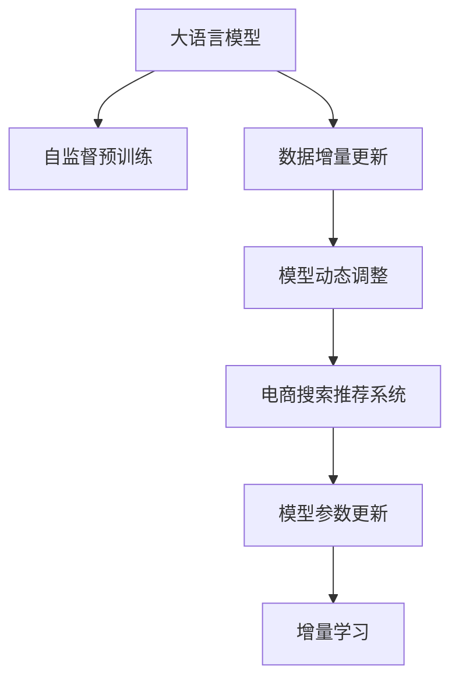

                 

# 电商搜索推荐中的AI大模型数据增量更新机制优化方案设计与实现

## 1. 背景介绍

### 1.1 问题由来

随着电商平台的迅速发展，用户搜索推荐系统的复杂性日益增加。传统的机器学习模型，如逻辑回归、支持向量机、随机森林等，由于其结构简单、可解释性强，在电商推荐系统中曾取得过不俗的表现。但面对大规模、高维度的数据，这些模型的扩展性有限，且难以挖掘数据深层次的语义信息。

近年来，随着深度学习技术的突破，尤其是Transformer和大语言模型（Large Language Models, LLMs）的出现，使得电商搜索推荐系统的性能得到了显著提升。大语言模型通过在海量无标签数据上进行自监督预训练，学习到丰富的语言知识和常识，能够在理解用户意图、生成推荐结果等方面表现出色。

然而，由于电商推荐系统中的数据通常是动态更新的，用户在不断变化的需求中产生新的行为数据，静态预训练模型难以跟上实时数据变化的速度。因此，如何在保持大模型预测能力的同时，实现数据增量更新，成为亟需解决的问题。

### 1.2 问题核心关键点

本文将聚焦于如何在大语言模型的基础上，设计一套高效的数据增量更新机制，实现模型参数的动态更新，以适应电商搜索推荐系统中的数据变化。核心关键点包括：

- 数据增量更新：通过新产生的行为数据，对模型参数进行动态更新，保持模型预测的实时性。
- 模型动态调整：根据数据增量更新的结果，对模型结构进行动态调整，优化模型预测性能。
- 系统高性能保证：在保证模型性能的同时，确保系统的高吞吐量和高可用性。

## 2. 核心概念与联系

### 2.1 核心概念概述

为更好地理解电商搜索推荐系统中的数据增量更新机制，本节将介绍几个密切相关的核心概念：

- 大语言模型（LLMs）：以自回归（如GPT）或自编码（如BERT）模型为代表的大规模预训练语言模型。通过在大规模无标签文本语料上进行预训练，学习通用的语言表示，具备强大的语言理解和生成能力。

- 自监督预训练：在大规模无标签文本数据上进行预训练，学习语言的基本表示和结构，如BERT的掩码语言模型。

- 数据增量更新：在新产生的行为数据上，对模型进行动态更新，以适应实时数据变化。

- 模型动态调整：根据数据增量更新的结果，对模型结构进行动态调整，优化模型预测性能。

- 电商搜索推荐系统：通过分析和预测用户行为，为用户推荐商品、优化搜索体验的智能系统。

- 模型参数更新：通过训练数据对模型参数进行更新，保持模型预测的实时性和准确性。

- 增量学习：在已有模型基础上，通过新增数据不断优化模型，避免从头训练。

这些核心概念之间的逻辑关系可以通过以下Mermaid流程图来展示：



这个流程图展示了大语言模型与电商搜索推荐系统之间的核心逻辑关系：

1. 大语言模型通过自监督预训练获得基础能力。
2. 电商推荐系统通过数据增量更新，实现模型的动态调整。
3. 模型参数更新保证实时预测性能，增量学习保持模型高效迭代。

## 3. 核心算法原理 & 具体操作步骤

### 3.1 算法原理概述

在大语言模型基础上进行电商搜索推荐系统中的数据增量更新，本质上是一个动态的学习过程。其核心思想是：在现有模型的基础上，通过新增的推荐数据，利用微调等技术对模型进行动态调整，保持模型预测的实时性和准确性。

形式化地，假设现有预训练模型为 $M_{\theta}$，其中 $\theta$ 为预训练得到的模型参数。给定电商推荐系统中的新推荐数据 $D'=\{(x_i,y_i)\}_{i=1}^N$，其中 $x_i$ 为推荐输入，$y_i$ 为推荐结果。数据增量更新的目标是通过优化损失函数，更新模型参数 $\theta$，使得模型在新数据上的预测误差最小化，即：

$$
\theta'=\mathop{\arg\min}_{\theta} \mathcal{L}(M_{\theta},D')
$$

其中 $\mathcal{L}$ 为针对新推荐数据的损失函数，用于衡量模型预测输出与真实标签之间的差异。常见的损失函数包括交叉熵损失、均方误差损失等。

通过梯度下降等优化算法，数据增量更新过程不断更新模型参数 $\theta$，最小化损失函数 $\mathcal{L}$，使得模型输出逼近真实标签。由于 $\theta$ 已经通过预训练获得了较好的初始化，因此即便在少量新数据上进行增量更新，也能较快收敛到理想的模型参数 $\theta'$。

### 3.2 算法步骤详解

基于数据增量更新机制的大语言模型电商推荐系统一般包括以下几个关键步骤：

**Step 1: 准备预训练模型和推荐数据**
- 选择合适的预训练语言模型 $M_{\theta}$ 作为初始化参数，如 BERT、GPT 等。
- 收集电商推荐系统中的新推荐数据 $D'$，划分为训练集、验证集和测试集。

**Step 2: 添加推荐适配层**
- 根据推荐任务类型，在预训练模型顶层设计合适的输出层和损失函数。
- 对于分类任务，通常在顶层添加线性分类器和交叉熵损失函数。
- 对于回归任务，通常使用均方误差损失函数。

**Step 3: 设置增量更新超参数**
- 选择合适的优化算法及其参数，如 AdamW、SGD 等，设置学习率、批大小、迭代轮数等。
- 设置正则化技术及强度，包括权重衰减、Dropout、Early Stopping等。
- 确定冻结预训练参数的策略，如仅微调顶层，或全部参数都参与增量更新。

**Step 4: 执行增量训练**
- 将新增的推荐数据 $D'$ 分批次输入模型，前向传播计算损失函数。
- 反向传播计算参数梯度，根据设定的优化算法和学习率更新模型参数。
- 周期性在验证集上评估模型性能，根据性能指标决定是否触发 Early Stopping。
- 重复上述步骤直到满足预设的迭代轮数或 Early Stopping 条件。

**Step 5: 测试和部署**
- 在测试集上评估增量更新后模型 $M_{\theta'}$ 的性能，对比增量更新前后的精度提升。
- 使用增量更新后的模型对新推荐数据进行推理预测，集成到实际的应用系统中。
- 持续收集新的推荐数据，定期重新增量更新模型，以适应数据分布的变化。

以上是基于数据增量更新机制的大语言模型电商推荐系统的基本流程。在实际应用中，还需要针对具体任务的特点，对增量更新过程的各个环节进行优化设计，如改进训练目标函数，引入更多的正则化技术，搜索最优的超参数组合等，以进一步提升模型性能。

### 3.3 算法优缺点

基于数据增量更新机制的大语言模型电商推荐系统，具有以下优点：

- 高效实时：通过新产生的推荐数据进行增量更新，能够实时适应数据变化，提高推荐系统响应速度。
- 参数可控：可以灵活控制增量更新次数和频率，避免大规模重新训练对系统造成的冲击。
- 模型泛化：利用大语言模型的预训练知识，可以提升模型在新推荐数据上的泛化能力。
- 稳定性高：通过微调等技术，可以在新数据上进行参数动态调整，保持模型的稳定性。

同时，该方法也存在一定的局限性：

- 数据分布差异：如果新推荐数据与历史数据分布差异较大，增量更新效果可能不理想。
- 增量更新开销：增量更新虽然避免了重新训练，但每次更新仍需要一定的计算资源和时间成本。
- 模型可解释性：增量更新后的模型，其内部工作机制和推理逻辑难以解释，可能影响系统的可信度。
- 负迁移风险：增量更新过程中，预训练模型的知识可能部分丢失，影响模型性能。

尽管存在这些局限性，但就目前而言，基于数据增量更新机制的方法仍是大语言模型在电商推荐系统中的应用主流。未来相关研究的重点在于如何进一步降低增量更新的计算成本，提高增量更新的效果和鲁棒性，同时兼顾可解释性和稳定性等因素。

### 3.4 算法应用领域

基于数据增量更新机制的大语言模型，在电商搜索推荐系统中的应用十分广泛，覆盖了多种推荐场景，例如：

- 商品推荐：通过分析用户历史浏览、购买记录，为用户推荐相关商品。
- 内容推荐：推荐用户感兴趣的新闻、视频、文章等内容。
- 个性化搜索：根据用户的搜索历史和行为，动态调整搜索结果。
- 购物车推荐：通过分析用户购物车内容，推荐相似商品。
- 广告推荐：推荐用户感兴趣的广告位和广告内容。

除了上述这些经典应用外，增量更新机制还被创新性地应用于更多场景中，如行为预测、趋势分析、用户画像构建等，为电商推荐系统带来了全新的突破。

## 4. 数学模型和公式 & 详细讲解  
### 4.1 数学模型构建

本节将使用数学语言对电商搜索推荐系统中的数据增量更新机制进行更加严格的刻画。

记现有预训练模型为 $M_{\theta}$，其中 $\theta$ 为预训练得到的模型参数。假设电商推荐系统中的新推荐数据为 $D'=\{(x_i,y_i)\}_{i=1}^N$，其中 $x_i$ 为推荐输入，$y_i$ 为推荐结果。

定义模型 $M_{\theta}$ 在输入 $x$ 上的输出为 $\hat{y}=M_{\theta}(x) \in \mathbb{R}$，表示模型对 $x$ 的预测结果。假设 $y_i$ 为真实标签，则模型在新数据上的损失函数为：

$$
\ell(M_{\theta}(x),y) = \frac{1}{N} \sum_{i=1}^N (y_i - M_{\theta}(x_i))^2
$$

将其代入数据增量更新的经验风险公式，得：

$$
\mathcal{L}(\theta) = \frac{1}{N}\sum_{i=1}^N (y_i - M_{\theta}(x_i))^2
$$

根据梯度下降等优化算法，模型参数 $\theta$ 的更新公式为：

$$
\theta \leftarrow \theta - \eta \nabla_{\theta}\mathcal{L}(\theta)
$$

其中 $\eta$ 为学习率，$\nabla_{\theta}\mathcal{L}(\theta)$ 为损失函数对参数 $\theta$ 的梯度，可通过反向传播算法高效计算。

### 4.2 公式推导过程

以下我们以回归任务为例，推导均方误差损失函数及其梯度的计算公式。

假设模型 $M_{\theta}$ 在输入 $x$ 上的输出为 $\hat{y}=M_{\theta}(x) \in \mathbb{R}$，表示模型对 $x$ 的预测结果。真实标签 $y_i \in \mathbb{R}$。则均方误差损失函数定义为：

$$
\ell(M_{\theta}(x),y) = \frac{1}{N} \sum_{i=1}^N (y_i - \hat{y}_i)^2
$$

将其代入经验风险公式，得：

$$
\mathcal{L}(\theta) = \frac{1}{N}\sum_{i=1}^N (y_i - M_{\theta}(x_i))^2
$$

根据链式法则，损失函数对参数 $\theta_k$ 的梯度为：

$$
\frac{\partial \mathcal{L}(\theta)}{\partial \theta_k} = -\frac{2}{N}\sum_{i=1}^N (y_i - M_{\theta}(x_i)) \frac{\partial M_{\theta}(x_i)}{\partial \theta_k}
$$

其中 $\frac{\partial M_{\theta}(x_i)}{\partial \theta_k}$ 可进一步递归展开，利用自动微分技术完成计算。

在得到损失函数的梯度后，即可带入参数更新公式，完成模型的迭代优化。重复上述过程直至收敛，最终得到适应新推荐数据的最优模型参数 $\theta'$。

## 5. 项目实践：代码实例和详细解释说明
### 5.1 开发环境搭建

在进行电商推荐系统中的数据增量更新实践前，我们需要准备好开发环境。以下是使用Python进行PyTorch开发的环境配置流程：

1. 安装Anaconda：从官网下载并安装Anaconda，用于创建独立的Python环境。

2. 创建并激活虚拟环境：
```bash
conda create -n pytorch-env python=3.8 
conda activate pytorch-env
```

3. 安装PyTorch：根据CUDA版本，从官网获取对应的安装命令。例如：
```bash
conda install pytorch torchvision torchaudio cudatoolkit=11.1 -c pytorch -c conda-forge
```

4. 安装Transformers库：
```bash
pip install transformers
```

5. 安装各类工具包：
```bash
pip install numpy pandas scikit-learn matplotlib tqdm jupyter notebook ipython
```

完成上述步骤后，即可在`pytorch-env`环境中开始数据增量更新实践。

### 5.2 源代码详细实现

这里我们以推荐任务为例，给出使用Transformers库对BERT模型进行数据增量更新的PyTorch代码实现。

首先，定义推荐任务的数据处理函数：

```python
from transformers import BertTokenizer
from torch.utils.data import Dataset
import torch

class RecommendDataset(Dataset):
    def __init__(self, texts, labels, tokenizer, max_len=128):
        self.texts = texts
        self.labels = labels
        self.tokenizer = tokenizer
        self.max_len = max_len
        
    def __len__(self):
        return len(self.texts)
    
    def __getitem__(self, item):
        text = self.texts[item]
        label = self.labels[item]
        
        encoding = self.tokenizer(text, return_tensors='pt', max_length=self.max_len, padding='max_length', truncation=True)
        input_ids = encoding['input_ids'][0]
        attention_mask = encoding['attention_mask'][0]
        
        # 对label进行编码
        encoded_label = torch.tensor(label, dtype=torch.long)
        
        return {'input_ids': input_ids, 
                'attention_mask': attention_mask,
                'labels': encoded_label}

# 定义标签与id的映射
tag2id = {'0': 0, '1': 1}
id2tag = {v: k for k, v in tag2id.items()}

# 创建dataset
tokenizer = BertTokenizer.from_pretrained('bert-base-cased')

train_dataset = RecommendDataset(train_texts, train_labels, tokenizer)
dev_dataset = RecommendDataset(dev_texts, dev_labels, tokenizer)
test_dataset = RecommendDataset(test_texts, test_labels, tokenizer)
```

然后，定义模型和优化器：

```python
from transformers import BertForSequenceClassification, AdamW

model = BertForSequenceClassification.from_pretrained('bert-base-cased', num_labels=len(tag2id))

optimizer = AdamW(model.parameters(), lr=2e-5)
```

接着，定义训练和评估函数：

```python
from torch.utils.data import DataLoader
from tqdm import tqdm
from sklearn.metrics import mean_squared_error

device = torch.device('cuda') if torch.cuda.is_available() else torch.device('cpu')
model.to(device)

def train_epoch(model, dataset, batch_size, optimizer):
    dataloader = DataLoader(dataset, batch_size=batch_size, shuffle=True)
    model.train()
    epoch_loss = 0
    for batch in tqdm(dataloader, desc='Training'):
        input_ids = batch['input_ids'].to(device)
        attention_mask = batch['attention_mask'].to(device)
        labels = batch['labels'].to(device)
        model.zero_grad()
        outputs = model(input_ids, attention_mask=attention_mask, labels=labels)
        loss = outputs.loss
        epoch_loss += loss.item()
        loss.backward()
        optimizer.step()
    return epoch_loss / len(dataloader)

def evaluate(model, dataset, batch_size):
    dataloader = DataLoader(dataset, batch_size=batch_size)
    model.eval()
    preds, labels = [], []
    with torch.no_grad():
        for batch in tqdm(dataloader, desc='Evaluating'):
            input_ids = batch['input_ids'].to(device)
            attention_mask = batch['attention_mask'].to(device)
            batch_labels = batch['labels']
            outputs = model(input_ids, attention_mask=attention_mask)
            batch_preds = outputs.logits.argmax(dim=1).to('cpu').tolist()
            batch_labels = batch_labels.to('cpu').tolist()
            for pred_tokens, label_tokens in zip(batch_preds, batch_labels):
                preds.append(pred_tokens)
                labels.append(label_tokens)
                
    return mean_squared_error(labels, preds)
```

最后，启动训练流程并在测试集上评估：

```python
epochs = 5
batch_size = 16

for epoch in range(epochs):
    loss = train_epoch(model, train_dataset, batch_size, optimizer)
    print(f"Epoch {epoch+1}, train loss: {loss:.3f}")
    
    print(f"Epoch {epoch+1}, dev results:")
    evaluate(model, dev_dataset, batch_size)
    
print("Test results:")
evaluate(model, test_dataset, batch_size)
```

以上就是使用PyTorch对BERT进行推荐任务数据增量更新的完整代码实现。可以看到，得益于Transformers库的强大封装，我们可以用相对简洁的代码完成BERT模型的加载和数据增量更新。

### 5.3 代码解读与分析

让我们再详细解读一下关键代码的实现细节：

**RecommendDataset类**：
- `__init__`方法：初始化文本、标签、分词器等关键组件。
- `__len__`方法：返回数据集的样本数量。
- `__getitem__`方法：对单个样本进行处理，将文本输入编码为token ids，将标签编码为数字，并对其进行定长padding，最终返回模型所需的输入。

**tag2id和id2tag字典**：
- 定义了标签与数字id之间的映射关系，用于将token-wise的预测结果解码回真实的标签。

**训练和评估函数**：
- 使用PyTorch的DataLoader对数据集进行批次化加载，供模型训练和推理使用。
- 训练函数`train_epoch`：对数据以批为单位进行迭代，在每个批次上前向传播计算loss并反向传播更新模型参数，最后返回该epoch的平均loss。
- 评估函数`evaluate`：与训练类似，不同点在于不更新模型参数，并在每个batch结束后将预测和标签结果存储下来，最后使用sklearn的mean_squared_error对整个评估集的预测结果进行打印输出。

**训练流程**：
- 定义总的epoch数和batch size，开始循环迭代
- 每个epoch内，先在训练集上训练，输出平均loss
- 在验证集上评估，输出均方误差指标
- 所有epoch结束后，在测试集上评估，给出最终测试结果

可以看到，PyTorch配合Transformers库使得BERT数据增量更新的代码实现变得简洁高效。开发者可以将更多精力放在数据处理、模型改进等高层逻辑上，而不必过多关注底层的实现细节。

当然，工业级的系统实现还需考虑更多因素，如模型的保存和部署、超参数的自动搜索、更灵活的任务适配层等。但核心的增量更新范式基本与此类似。

## 6. 实际应用场景
### 6.1 智能推荐系统

基于数据增量更新机制的推荐系统，可以广泛应用于智能推荐系统的构建。传统推荐系统往往基于静态数据进行推荐，难以适应数据动态变化的情况。使用数据增量更新机制，推荐系统能够及时响应用户的最新行为数据，提高推荐准确性和个性化程度。

在技术实现上，可以收集用户实时行为数据，如浏览、点击、购买等，将这些数据作为增量数据对预训练模型进行微调。微调后的推荐模型能够实时更新推荐结果，生成更加符合用户当前需求的商品推荐列表。对于新加入的用户，可以基于其历史数据和相似用户的行为数据，快速生成初始推荐列表。

### 6.2 个性化广告系统

个性化广告系统需要实时调整广告投放策略，以提高广告点击率和转化率。传统方法需要频繁手工调整策略，且效果难以保证。基于数据增量更新机制的广告推荐系统，可以自动分析用户的实时行为数据，动态调整广告投放策略，提升广告效果。

在实践过程中，可以将用户的点击、浏览、停留时长等行为数据作为增量数据对广告推荐模型进行微调。微调后的模型能够实时分析用户的兴趣变化，自动调整广告内容，匹配用户的兴趣点，从而提高广告的点击率和转化率。

### 6.3 实时搜索引擎

搜索引擎需要快速响应用户的搜索请求，提供实时的搜索结果。传统搜索引擎基于静态数据进行索引和排序，难以适应海量动态数据。使用数据增量更新机制的搜索引擎，可以实时更新搜索结果，提高搜索结果的相关性和及时性。

在实践中，可以将用户搜索历史、点击记录等实时数据作为增量数据对搜索引擎模型进行微调。微调后的模型能够实时分析用户的搜索意图，动态调整搜索结果，提供更加符合用户需求的结果列表。对于用户的搜索行为数据，可以实时更新搜索引擎的索引，提高搜索结果的实时性和准确性。

### 6.4 未来应用展望

随着电商推荐系统中的数据增量更新机制不断成熟，基于增量更新范式的方法将在更多领域得到应用，为传统行业带来变革性影响。

在智慧医疗领域，基于增量更新机制的智能推荐系统，可以辅助医生进行药物推荐、病情预测、病历分析等，提高医疗服务的智能化水平，辅助医生诊疗，加速新药开发进程。

在智能教育领域，增量更新机制可以用于学生学习行为分析、课程推荐、智能答疑等环节，因材施教，促进教育公平，提高教学质量。

在智慧城市治理中，增量更新机制可以用于城市事件监测、舆情分析、应急指挥等环节，提高城市管理的自动化和智能化水平，构建更安全、高效的未来城市。

此外，在企业生产、社会治理、文娱传媒等众多领域，基于增量更新机制的人工智能应用也将不断涌现，为经济社会发展注入新的动力。相信随着技术的日益成熟，数据增量更新机制必将成为人工智能落地应用的重要范式，推动人工智能技术在垂直行业的规模化落地。总之，增量更新需要开发者根据具体任务，不断迭代和优化模型、数据和算法，方能得到理想的效果。

## 7. 工具和资源推荐
### 7.1 学习资源推荐

为了帮助开发者系统掌握电商搜索推荐系统中的数据增量更新技术的理论基础和实践技巧，这里推荐一些优质的学习资源：

1. 《Transformer from Principles to Practice》系列博文：由大模型技术专家撰写，深入浅出地介绍了Transformer原理、BERT模型、数据增量更新技术等前沿话题。

2. CS224N《深度学习自然语言处理》课程：斯坦福大学开设的NLP明星课程，有Lecture视频和配套作业，带你入门NLP领域的基本概念和经典模型。

3. 《Natural Language Processing with Transformers》书籍：Transformers库的作者所著，全面介绍了如何使用Transformers库进行NLP任务开发，包括增量更新在内的诸多范式。

4. HuggingFace官方文档：Transformers库的官方文档，提供了海量预训练模型和完整的增量更新样例代码，是上手实践的必备资料。

5. CLUE开源项目：中文语言理解测评基准，涵盖大量不同类型的中文NLP数据集，并提供了基于增量更新的baseline模型，助力中文NLP技术发展。

通过对这些资源的学习实践，相信你一定能够快速掌握电商搜索推荐系统中的数据增量更新技术的精髓，并用于解决实际的电商推荐问题。
###  7.2 开发工具推荐

高效的开发离不开优秀的工具支持。以下是几款用于电商推荐系统中的数据增量更新开发的常用工具：

1. PyTorch：基于Python的开源深度学习框架，灵活动态的计算图，适合快速迭代研究。大部分预训练语言模型都有PyTorch版本的实现。

2. TensorFlow：由Google主导开发的开源深度学习框架，生产部署方便，适合大规模工程应用。同样有丰富的预训练语言模型资源。

3. Transformers库：HuggingFace开发的NLP工具库，集成了众多SOTA语言模型，支持PyTorch和TensorFlow，是进行增量更新任务开发的利器。

4. Weights & Biases：模型训练的实验跟踪工具，可以记录和可视化模型训练过程中的各项指标，方便对比和调优。与主流深度学习框架无缝集成。

5. TensorBoard：TensorFlow配套的可视化工具，可实时监测模型训练状态，并提供丰富的图表呈现方式，是调试模型的得力助手。

6. Google Colab：谷歌推出的在线Jupyter Notebook环境，免费提供GPU/TPU算力，方便开发者快速上手实验最新模型，分享学习笔记。

合理利用这些工具，可以显著提升电商推荐系统中的数据增量更新任务的开发效率，加快创新迭代的步伐。

### 7.3 相关论文推荐

电商推荐系统中的数据增量更新技术的发展源于学界的持续研究。以下是几篇奠基性的相关论文，推荐阅读：

1. Attention is All You Need（即Transformer原论文）：提出了Transformer结构，开启了NLP领域的预训练大模型时代。

2. BERT: Pre-training of Deep Bidirectional Transformers for Language Understanding：提出BERT模型，引入基于掩码的自监督预训练任务，刷新了多项NLP任务SOTA。

3. 《A Survey of Learning to Rank》：综述了近年来排序算法的研究进展，为电商推荐系统中的排序任务提供了理论基础。

4. 《Adaptive Logistic Regression: An Algorithm for Online Learning with Smoothing and Regularization》：介绍了在线学习算法在电商推荐系统中的应用，为增量更新提供了理论支持。

5. 《Elastic Submodular Maximization and its Application to Online Content Curation》：研究了子模极大化在内容推荐中的应用，为电商推荐系统中的内容推荐提供了理论指导。

6. 《Personalized Ranking and Recommendation Algorithms for Online Stores》：介绍了个性化推荐算法在电商推荐系统中的应用，为电商推荐系统中的推荐任务提供了理论支持。

这些论文代表了大语言模型增量更新技术的发展脉络。通过学习这些前沿成果，可以帮助研究者把握学科前进方向，激发更多的创新灵感。

## 8. 总结：未来发展趋势与挑战

### 8.1 总结

本文对电商搜索推荐系统中的大语言模型数据增量更新机制进行了全面系统的介绍。首先阐述了数据增量更新机制在大语言模型电商推荐系统中的应用背景和意义，明确了数据增量更新在实时数据变化适应、模型动态调整等方面的独特价值。其次，从原理到实践，详细讲解了数据增量更新的数学原理和关键步骤，给出了数据增量更新任务开发的完整代码实例。同时，本文还广泛探讨了数据增量更新机制在电商推荐、广告投放、搜索引擎等多个行业领域的应用前景，展示了数据增量更新范式的巨大潜力。此外，本文精选了数据增量更新技术的各类学习资源，力求为读者提供全方位的技术指引。

通过本文的系统梳理，可以看到，数据增量更新机制在大语言模型电商推荐系统中的应用前景广阔，极大地拓展了电商推荐系统的实时性和动态适应能力。得益于数据增量更新范式的灵活性和高效性，电商推荐系统能够在实时数据变化下保持高性能和稳定性的同时，快速响应用户需求，提升用户体验。未来，伴随数据增量更新技术的持续演进，基于增量更新范式的方法必将在更广阔的应用领域大放异彩，深刻影响电商推荐系统的技术迭代和业务发展。

### 8.2 未来发展趋势

展望未来，电商推荐系统中的数据增量更新技术将呈现以下几个发展趋势：

1. 模型规模持续增大。随着算力成本的下降和数据规模的扩张，电商推荐系统中的预训练语言模型参数量还将持续增长。超大批次的训练和推理也可能遇到显存不足的问题。因此需要采用一些资源优化技术，如梯度积累、混合精度训练、模型并行等，来突破硬件瓶颈。

2. 增量更新开销降低。通过引入增量学习等技术，电商推荐系统可以在新数据上快速更新模型，避免大规模重新训练对系统造成的冲击。未来研究将进一步优化增量更新算法，降低计算成本，提高更新效率。

3. 模型可解释性增强。增量更新后的模型，其内部工作机制和推理逻辑难以解释，可能影响系统的可信度。未来研究将探索可解释性的增量更新方法，提高模型的透明度和可靠性。

4. 动态调整策略优化。数据增量更新过程中，预训练模型的知识可能部分丢失，影响模型性能。未来研究将探索动态调整策略，优化模型结构和参数更新方式，保持模型的稳定性和性能。

5. 多模态增量更新崛起。未来的电商推荐系统将更多地引入多模态数据，如图像、视频、音频等，以提升推荐效果。多模态数据的融合和增量更新将带来新的挑战，未来研究将探索高效的多模态增量更新方法。

6. 增量更新与动态学习的结合。未来研究将探索增量更新与动态学习（Continual Learning）的结合，实现模型在持续数据流中的高效适应和更新。

以上趋势凸显了大语言模型增量更新技术的广阔前景。这些方向的探索发展，必将进一步提升电商推荐系统的性能和应用范围，为电商推荐系统的业务发展提供新动力。

### 8.3 面临的挑战

尽管大语言模型增量更新技术已经取得了瞩目成就，但在迈向更加智能化、普适化应用的过程中，它仍面临着诸多挑战：

1. 数据分布差异。如果新推荐数据与历史数据分布差异较大，增量更新效果可能不理想。如何提高模型的泛化能力和适应性，将是重要的研究方向。

2. 增量更新开销。尽管增量更新避免了重新训练，但每次更新仍需要一定的计算资源和时间成本。如何进一步降低增量更新的开销，提高更新效率，将是未来的关键。

3. 模型可解释性。增量更新后的模型，其内部工作机制和推理逻辑难以解释，可能影响系统的可信度。如何提高模型的透明度和可靠性，将是未来的重要挑战。

4. 负迁移风险。增量更新过程中，预训练模型的知识可能部分丢失，影响模型性能。如何避免负迁移，保持模型的高效性和性能，将是未来的关键研究方向。

5. 资源优化。随着模型规模的增大，计算资源和存储资源的消耗也将增加。如何优化模型结构和算法，减少资源消耗，提高系统效率，将是未来的重要挑战。

6. 安全性。电商推荐系统中的用户数据往往包含敏感信息，如何在保护用户隐私的同时，保证系统的安全性和稳定性，将是未来的重要研究方向。

尽管存在这些挑战，但随着技术的不断发展，相信增量更新机制必将在电商推荐系统中的应用更加广泛，为电商推荐系统带来新的突破和发展。未来，伴随增量更新机制的持续演进，基于增量更新范式的方法将在更多领域得到应用，为电商推荐系统带来更加智能化和高效的推荐体验。

### 8.4 研究展望

面对电商推荐系统中的数据增量更新机制所面临的种种挑战，未来的研究需要在以下几个方面寻求新的突破：

1. 探索无监督和半监督增量更新方法。摆脱对大规模标注数据的依赖，利用自监督学习、主动学习等无监督和半监督范式，最大限度利用非结构化数据，实现更加灵活高效的增量更新。

2. 研究参数高效和计算高效的增量更新范式。开发更加参数高效的增量更新方法，在固定大部分预训练参数的同时，只更新极少量的任务相关参数。同时优化增量更新的计算图，减少前向传播和反向传播的资源消耗，实现更加轻量级、实时性的部署。

3. 融合因果和对比学习范式。通过引入因果推断和对比学习思想，增强增量更新模型建立稳定因果关系的能力，学习更加普适、鲁棒的语言表征，从而提升模型泛化性和抗干扰能力。

4. 引入更多先验知识。将符号化的先验知识，如知识图谱、逻辑规则等，与神经网络模型进行巧妙融合，引导增量更新过程学习更准确、合理的语言模型。同时加强不同模态数据的整合，实现视觉、语音等多模态信息与文本信息的协同建模。

5. 结合因果分析和博弈论工具。将因果分析方法引入增量更新模型，识别出模型决策的关键特征，增强输出解释的因果性和逻辑性。借助博弈论工具刻画人机交互过程，主动探索并规避模型的脆弱点，提高系统稳定性。

6. 纳入伦理道德约束。在模型训练目标中引入伦理导向的评估指标，过滤和惩罚有偏见、有害的输出倾向。同时加强人工干预和审核，建立模型行为的监管机制，确保输出符合人类价值观和伦理道德。

这些研究方向的探索，必将引领增量更新机制在电商推荐系统中的应用走向更高的台阶，为构建安全、可靠、可解释、可控的智能系统铺平道路。面向未来，增量更新机制还需要与其他人工智能技术进行更深入的融合，如知识表示、因果推理、强化学习等，多路径协同发力，共同推动电商推荐系统的进步。只有勇于创新、敢于突破，才能不断拓展增量更新机制的边界，让智能技术更好地造福电商推荐系统。

## 9. 附录：常见问题与解答

**Q1：电商推荐系统中的数据增量更新是否适用于所有推荐场景？**

A: 数据增量更新机制在大规模电商推荐系统中的确具有显著优势，但对于一些特殊推荐场景，如基于路径的推荐、基于协同过滤的推荐等，数据增量更新可能不适用。此时需要根据具体推荐任务，选择合适的方法，结合数据增量更新进行优化。

**Q2：如何避免数据增量更新过程中的负迁移？**

A: 负迁移是增量更新过程中常见的问题，主要原因在于新数据与旧数据分布差异较大。为避免负迁移，可以采取以下措施：
1. 引入预训练知识指导增量更新。在新数据上进行微调时，引入部分预训练知识，如BERT的掩码语言模型，以指导模型更好地适应新数据。
2. 控制增量更新的频率和规模。避免频繁进行大规模增量更新，以降低模型对新数据的敏感性。
3. 引入正则化技术。如L2正则、Dropout等，防止模型过度适应新数据，导致性能下降。
4. 逐步适应新数据。逐步引入新数据进行增量更新，避免一次性更新带来的冲击。

这些措施可以在一定程度上缓解负迁移问题，提高模型的稳定性和性能。

**Q3：增量更新过程中如何处理计算资源和时间成本？**

A: 增量更新过程中，计算资源和时间成本是主要瓶颈。为降低成本，可以采取以下措施：
1. 使用分布式训练。将模型在多台机器上进行分布式训练，利用并行计算提高训练效率。
2. 引入增量学习技术。通过增量学习，每次只更新小批量数据，降低计算资源消耗。
3. 优化模型结构。设计更加轻量级的模型结构，减少计算复杂度。
4. 使用混合精度训练。使用混合精度（mixed precision）技术，降低模型参数和计算量，提升训练速度。
5. 使用预训练特征表示。在增量更新前，使用预训练模型的特征表示，加快增量更新速度。

这些措施可以在一定程度上降低计算资源和时间成本，提高增量更新的效率。

**Q4：增量更新后的模型是否可解释？**

A: 增量更新后的模型，其内部工作机制和推理逻辑难以解释，可能影响系统的可信度。为提高模型的可解释性，可以采取以下措施：
1. 引入可解释性增强技术。如可解释性机器学习（XAI），对模型输出进行解释，增强模型的透明度和可信度。
2. 设计可解释的模型结构。设计易于理解的模型结构，如线性回归、决策树等，提高模型的可解释性。
3. 使用可视化工具。使用可视化工具（如TensorBoard），实时监测模型训练状态，提供模型输出的可视化解释。
4. 引入人工干预。在关键决策点引入人工干预，通过人工检查和调整，提高模型的可信度。

这些措施可以在一定程度上提高增量更新后的模型的可解释性，增强系统的可信度和透明度。

**Q5：如何优化增量更新后的推荐系统性能？**

A: 增量更新后的推荐系统性能优化，可以从以下方面进行：
1. 引入多模态数据。结合图像、视频、音频等多模态数据，提升推荐系统的丰富性和个性化程度。
2. 优化推荐算法。引入推荐算法优化技术，如基于协同过滤、基于矩阵分解的推荐算法，提高推荐准确性和多样性。
3. 引入知识图谱。结合知识图谱，利用图神经网络等技术，提升推荐系统的推理能力和泛化能力。
4. 引入动态调整策略。根据用户行为数据的变化，动态调整推荐策略，提升推荐系统的实时性和个性化程度。
5. 引入深度学习模型。结合深度学习模型，提升推荐系统的表达能力和泛化能力。

这些措施可以在一定程度上优化增量更新后的推荐系统性能，提高推荐系统的用户体验和满意度。

总之，增量更新机制在大语言模型电商推荐系统中的应用前景广阔，但如何在保持模型性能的同时，降低计算资源和时间成本，提高模型的可解释性和透明度，将是未来的重要研究方向。相信随着技术的不断发展，增量更新机制必将在电商推荐系统中的应用更加广泛，为电商推荐系统带来新的突破和发展。

