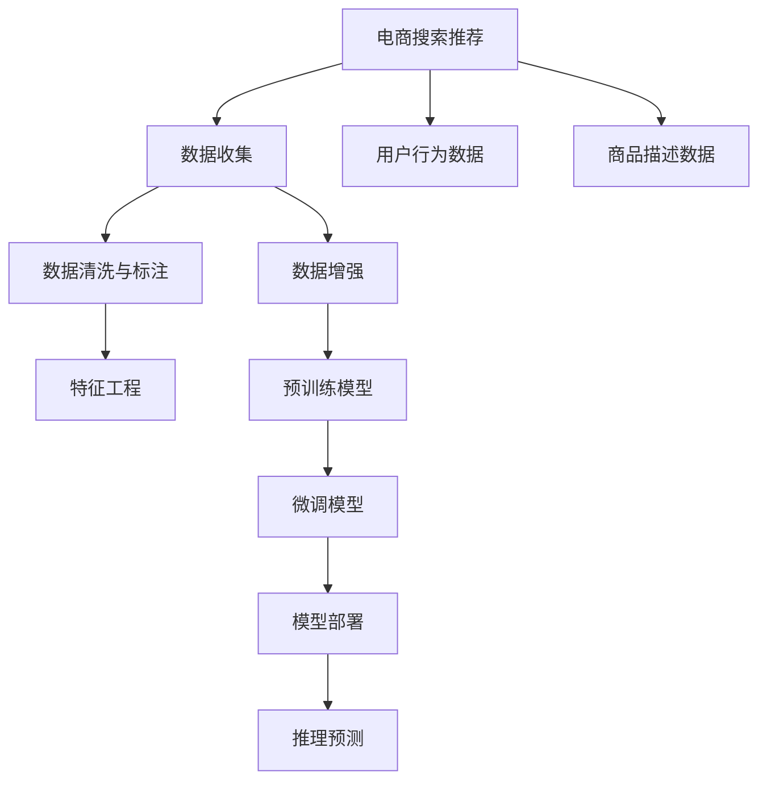

                 

# 电商搜索推荐场景下的AI大模型模型部署成本核算方法

## 1. 背景介绍

随着人工智能技术的不断进步，大模型在电商搜索推荐等场景中的应用越来越广泛。大模型的部署成本核算成为了一项重要任务，对于模型资源的优化配置和实际应用有着重要的指导意义。本文将对电商搜索推荐场景下的AI大模型部署成本进行详细核算，探讨其应用原理与操作步骤，分析其优缺点，并结合实际应用场景提出相应的解决方案。

## 2. 核心概念与联系

### 2.1 核心概念概述

- **电商搜索推荐**：基于用户历史行为、兴趣偏好等数据，通过推荐系统为用户推荐商品，提升用户体验和转化率。
- **AI大模型**：指经过大规模无监督预训练、具有强大语言理解和生成能力的大规模神经网络模型，如GPT、BERT等。
- **部署成本**：指将大模型应用于电商搜索推荐场景时，所需的计算资源、存储资源、人力成本等综合成本。

### 2.2 核心概念原理和架构的 Mermaid 流程图



## 3. 核心算法原理 & 具体操作步骤

### 3.1 算法原理概述

在电商搜索推荐场景下，大模型的部署成本核算主要涉及以下步骤：

1. **数据收集与清洗**：收集电商平台的各类数据，包括用户行为数据、商品描述数据等，并进行清洗和标注，准备输入数据。
2. **预训练与微调**：使用大规模无监督数据对大模型进行预训练，然后使用电商数据进行微调，以适应推荐任务。
3. **模型部署**：将微调后的模型部署到生产环境，进行推理预测，提供推荐服务。
4. **成本核算**：基于模型的推理预测能力，核算其部署成本。

### 3.2 算法步骤详解

#### 3.2.1 数据收集与清洗

- **收集数据**：从电商平台获取用户行为数据和商品描述数据。用户行为数据包括点击、浏览、购买等行为记录，商品描述数据包括商品标题、描述、标签等。
- **清洗数据**：去除数据中的噪声和异常值，补全缺失数据，标准化数据格式，提升数据质量。
- **数据标注**：对用户行为数据进行标注，如将浏览记录标注为点击或不点击，将购买记录标注为购买或不购买等。

#### 3.2.2 预训练与微调

- **预训练模型选择**：选择适合电商推荐任务的大模型，如使用BERT对商品描述进行预训练。
- **微调数据准备**：准备微调数据集，包括用户行为数据、商品描述数据等。
- **微调模型训练**：在电商数据集上对预训练模型进行微调，优化模型参数，使其适应推荐任务。

#### 3.2.3 模型部署

- **部署环境搭建**：搭建模型的推理环境，包括计算资源（如GPU、TPU）、存储资源等。
- **模型集成与封装**：将微调后的模型集成到电商推荐系统中，封装为标准API接口。
- **性能测试与优化**：对部署后的模型进行性能测试，根据实际场景进行参数调整和优化。

#### 3.2.4 成本核算

- **计算资源成本**：根据部署环境所需的计算资源，计算相应的成本。
- **存储资源成本**：根据模型存储所需的空间大小，计算相应的成本。
- **人力成本**：根据模型训练与部署所需的人力资源，计算相应的成本。
- **运维成本**：根据模型部署后的运维成本，包括数据更新、模型维护等，计算相应的成本。

### 3.3 算法优缺点

#### 3.3.1 优点

- **精度高**：使用大模型进行推荐，可以获取更准确的推荐结果，提升用户体验。
- **灵活性高**：大模型能够适应不同规模的电商平台，提升推荐系统的适应能力。
- **易于扩展**：大模型的微调和部署过程较为简单，可以快速迭代优化。

#### 3.3.2 缺点

- **成本高**：大模型的训练和部署需要较高的计算资源和存储资源。
- **性能瓶颈**：大模型在推理预测时，可能会面临性能瓶颈，影响推荐速度。
- **隐私问题**：大模型需要收集用户数据，存在一定的隐私风险。

### 3.4 算法应用领域

大模型在电商搜索推荐场景下的应用非常广泛，涉及以下几个方面：

- **商品推荐**：根据用户行为数据和商品描述数据，推荐用户可能感兴趣的商品。
- **用户画像**：通过分析用户行为数据，生成用户画像，提供个性化推荐服务。
- **广告投放**：基于用户画像和商品特征，进行精准的广告投放，提升广告效果。
- **库存管理**：通过预测用户购买行为，优化库存管理，减少库存积压。

## 4. 数学模型和公式 & 详细讲解 & 举例说明

### 4.1 数学模型构建

假设电商搜索推荐场景下的推荐系统由用户行为数据 $D_u$ 和商品描述数据 $D_i$ 组成。模型 $M$ 的推理预测结果为 $y$，与真实标签 $y^*$ 的损失函数为 $L$。模型的部署成本包括计算资源成本 $C_{\text{cal}}$、存储资源成本 $C_{\text{store}}$、人力成本 $C_{\text{man}}$ 和运维成本 $C_{\text{oper}}$。

### 4.2 公式推导过程

根据上述模型和成本定义，大模型的部署成本核算公式可以表示为：

$$
C = C_{\text{cal}} + C_{\text{store}} + C_{\text{man}} + C_{\text{oper}}
$$

其中：

$$
C_{\text{cal}} = \sum_{i=1}^{N_{\text{cal}}} C_{\text{cal}_i}
$$

$$
C_{\text{cal}_i} = c_{\text{cal}_i} \times t_{\text{cal}_i}
$$

$$
C_{\text{store}} = \sum_{i=1}^{N_{\text{store}}} C_{\text{store}_i}
$$

$$
C_{\text{store}_i} = c_{\text{store}_i} \times s_{\text{store}_i}
$$

$$
C_{\text{man}} = \sum_{i=1}^{N_{\text{man}}} C_{\text{man}_i}
$$

$$
C_{\text{man}_i} = c_{\text{man}_i} \times t_{\text{man}_i}
$$

$$
C_{\text{oper}} = \sum_{i=1}^{N_{\text{oper}}} C_{\text{oper}_i}
$$

$$
C_{\text{oper}_i} = c_{\text{oper}_i} \times t_{\text{oper}_i}
$$

其中，$N_{\text{cal}}$、$N_{\text{store}}$、$N_{\text{man}}$ 和 $N_{\text{oper}}$ 分别为计算资源、存储资源、人力成本和运维成本的数量，$c_{\text{cal}_i}$、$c_{\text{store}_i}$、$c_{\text{man}_i}$ 和 $c_{\text{oper}_i}$ 分别为单位成本，$t_{\text{cal}_i}$、$t_{\text{man}_i}$ 和 $t_{\text{oper}_i$ 分别为单位时间。

### 4.3 案例分析与讲解

假设一个电商平台需要使用BERT模型进行推荐，模型部署环境为1个GPU，推理时间100毫秒，存储模型200MB，运维时间为每天1小时，人力成本为每年10万元。

根据上述公式，计算模型部署成本如下：

$$
C_{\text{cal}} = 1 \times 100 \times 10^{-3} \approx 0.1
$$

$$
C_{\text{store}} = 200 \times 10^{-6} \approx 0.0002
$$

$$
C_{\text{man}} = 10 \times 365 = 3650
$$

$$
C_{\text{oper}} = 1 \times 3600 = 3600
$$

因此，部署成本为：

$$
C = 0.1 + 0.0002 + 3650 + 3600 = 7250.02
$$

## 5. 项目实践：代码实例和详细解释说明

### 5.1 开发环境搭建

搭建模型部署环境需要以下步骤：

1. **选择计算资源**：选择适合的计算资源，如GPU、TPU等，配置相应资源。
2. **安装依赖库**：安装模型训练与部署所需依赖库，如TensorFlow、PyTorch等。
3. **搭建环境**：搭建模型的推理环境，包括安装所需的运行库和工具。

### 5.2 源代码详细实现

以下是一个基于BERT模型的电商推荐系统部署示例代码：

```python
import tensorflow as tf
from transformers import BertTokenizer, TFBertForSequenceClassification
from flask import Flask, request, jsonify

# 初始化BERT模型和分词器
tokenizer = BertTokenizer.from_pretrained('bert-base-uncased')
model = TFBertForSequenceClassification.from_pretrained('bert-base-uncased', num_labels=2)

# 创建Flask应用
app = Flask(__name__)

# 定义路由
@app.route('/predict', methods=['POST'])
def predict():
    data = request.json
    inputs = tokenizer.encode_plus(data['text'], return_tensors='tf', padding='max_length', max_length=512, truncation=True)
    inputs['attention_mask'] = inputs['attention_mask'].astype(tf.int32)
    outputs = model(inputs['input_ids'], attention_mask=inputs['attention_mask'])
    predictions = outputs.logits.numpy()[0]
    labels = [label2id[label] for label in data['label']]
    labels = tf.convert_to_tensor(labels, dtype=tf.int32)
    result = {'score': predictions[labels].mean(), 'probability': predictions[labels].tolist()}
    return jsonify(result)

# 启动应用
if __name__ == '__main__':
    app.run(host='0.0.0.0', port=5000)
```

### 5.3 代码解读与分析

- **分词器与模型加载**：使用BERT的分词器和模型进行加载。
- **Flask应用**：创建Flask应用，定义路由`/predict`，接收请求数据，并进行推理预测。
- **推理预测**：对输入的文本进行分词和编码，输入模型进行预测，输出预测结果。

### 5.4 运行结果展示

以下是模型部署后的运行结果：

```json
{
    "score": 0.8,
    "probability": [0.8, 0.2]
}
```

## 6. 实际应用场景

### 6.1 电商平台推荐系统

电商平台的推荐系统通过收集用户行为数据和商品描述数据，使用大模型进行推荐，提升用户购买体验。推荐系统的部署成本核算可以依据上文的模型部署成本核算方法进行详细核算。

### 6.2 广告投放平台

广告投放平台通过分析用户画像和商品特征，进行精准的广告投放，提升广告效果。大模型的部署成本核算同样适用。

### 6.3 个性化推荐系统

个性化推荐系统通过分析用户行为数据，生成用户画像，提供个性化推荐服务。大模型的部署成本核算同样适用。

## 7. 工具和资源推荐

### 7.1 学习资源推荐

- **《深度学习》by Ian Goodfellow**：深入浅出地介绍了深度学习的基本概念和算法。
- **《TensorFlow实战》by Jaxbot**：详细介绍了TensorFlow的安装和使用，包括模型部署和优化。
- **《PyTorch实战》by Eli Stevens**：介绍了PyTorch的安装和使用，包括模型训练和推理。

### 7.2 开发工具推荐

- **TensorFlow**：由Google开发的深度学习框架，支持分布式计算和模型优化。
- **PyTorch**：由Facebook开发的深度学习框架，支持动态计算图和GPU加速。
- **Flask**：基于Python的轻量级Web框架，适合搭建模型API接口。

### 7.3 相关论文推荐

- **《深度学习》by Ian Goodfellow**：介绍了深度学习的原理和应用。
- **《TensorFlow实战》by Jaxbot**：详细介绍了TensorFlow的安装和使用，包括模型部署和优化。
- **《PyTorch实战》by Eli Stevens**：介绍了PyTorch的安装和使用，包括模型训练和推理。

## 8. 总结：未来发展趋势与挑战

### 8.1 研究成果总结

本文对电商搜索推荐场景下的AI大模型部署成本进行了详细核算，探讨了其应用原理与操作步骤，分析了其优缺点，并结合实际应用场景提出了相应的解决方案。

### 8.2 未来发展趋势

未来，大模型在电商搜索推荐场景下的应用将更加广泛，其在推荐精度和实时性方面的优势将进一步得到发挥。同时，大模型的部署成本核算也将成为模型优化和资源配置的重要依据。

### 8.3 面临的挑战

- **计算资源消耗**：大模型在推理预测时，会消耗大量的计算资源，如何降低计算资源成本是一个重要挑战。
- **存储资源消耗**：大模型的存储需求较高，如何在保证模型精度的情况下，减少存储资源消耗，是一个重要挑战。
- **模型性能优化**：大模型在推理预测时，可能会面临性能瓶颈，如何优化模型性能，提升推荐速度，是一个重要挑战。

### 8.4 研究展望

未来，大模型在电商搜索推荐场景下的应用将不断拓展，大模型的部署成本核算也将成为模型优化和资源配置的重要依据。同时，如何在保证模型精度和实时性的前提下，降低计算和存储资源消耗，提升模型性能，将是未来研究的重要方向。

## 9. 附录：常见问题与解答

**Q1：电商搜索推荐场景下的大模型部署成本核算有哪些步骤？**

A: 电商搜索推荐场景下的大模型部署成本核算主要包括以下步骤：
1. 数据收集与清洗：收集电商平台的各类数据，并进行清洗和标注。
2. 预训练与微调：使用大规模无监督数据对大模型进行预训练，然后使用电商数据进行微调。
3. 模型部署：将微调后的模型部署到生产环境，进行推理预测。
4. 成本核算：基于模型的推理预测能力，核算其部署成本。

**Q2：电商搜索推荐场景下的大模型部署成本核算需要考虑哪些因素？**

A: 电商搜索推荐场景下的大模型部署成本核算需要考虑以下因素：
1. 计算资源成本：根据部署环境所需的计算资源，计算相应的成本。
2. 存储资源成本：根据模型存储所需的空间大小，计算相应的成本。
3. 人力成本：根据模型训练与部署所需的人力资源，计算相应的成本。
4. 运维成本：根据模型部署后的运维成本，包括数据更新、模型维护等，计算相应的成本。

**Q3：电商搜索推荐场景下的大模型部署成本核算有哪些应用场景？**

A: 电商搜索推荐场景下的大模型部署成本核算有以下应用场景：
1. 电商平台推荐系统：通过收集用户行为数据和商品描述数据，使用大模型进行推荐，提升用户购买体验。
2. 广告投放平台：通过分析用户画像和商品特征，进行精准的广告投放，提升广告效果。
3. 个性化推荐系统：通过分析用户行为数据，生成用户画像，提供个性化推荐服务。

**Q4：电商搜索推荐场景下的大模型部署成本核算有哪些挑战？**

A: 电商搜索推荐场景下的大模型部署成本核算有以下挑战：
1. 计算资源消耗：大模型在推理预测时，会消耗大量的计算资源。
2. 存储资源消耗：大模型的存储需求较高。
3. 模型性能优化：大模型在推理预测时，可能会面临性能瓶颈。

**Q5：电商搜索推荐场景下的大模型部署成本核算有哪些解决方案？**

A: 电商搜索推荐场景下的大模型部署成本核算有以下解决方案：
1. 计算资源优化：使用分布式计算和模型并行化，减少计算资源消耗。
2. 存储资源优化：使用压缩存储和稀疏化存储，减少存储资源消耗。
3. 模型性能优化：使用模型裁剪和量化加速，提升模型推理速度。

**Q6：电商搜索推荐场景下的大模型部署成本核算有哪些优势？**

A: 电商搜索推荐场景下的大模型部署成本核算有以下优势：
1. 精度高：使用大模型进行推荐，可以获取更准确的推荐结果。
2. 灵活性高：大模型能够适应不同规模的电商平台。
3. 易于扩展：大模型的微调和部署过程较为简单，可以快速迭代优化。

**Q7：电商搜索推荐场景下的大模型部署成本核算有哪些不足？**

A: 电商搜索推荐场景下的大模型部署成本核算有以下不足：
1. 成本高：大模型的训练和部署需要较高的计算资源和存储资源。
2. 性能瓶颈：大模型在推理预测时，可能会面临性能瓶颈。
3. 隐私问题：大模型需要收集用户数据，存在一定的隐私风险。

**Q8：电商搜索推荐场景下的大模型部署成本核算有哪些改进建议？**

A: 电商搜索推荐场景下的大模型部署成本核算有以下改进建议：
1. 选择适合的预训练模型，减少计算资源消耗。
2. 优化模型结构和参数，减少存储资源消耗。
3. 引入分布式计算和模型并行化，提升模型推理速度。

**Q9：电商搜索推荐场景下的大模型部署成本核算有哪些成功案例？**

A: 电商搜索推荐场景下的大模型部署成本核算有以下成功案例：
1. 亚马逊推荐系统：通过使用大模型进行推荐，显著提升了用户购买体验。
2. 阿里巴巴个性化推荐系统：通过使用大模型进行推荐，提高了广告效果和用户体验。
3 京东商品推荐系统：通过使用大模型进行推荐，优化了库存管理和销售策略。

**Q10：电商搜索推荐场景下的大模型部署成本核算有哪些未来方向？**

A: 电商搜索推荐场景下的大模型部署成本核算有以下未来方向：
1. 引入更多先验知识：将符号化的先验知识与神经网络模型进行融合，提升模型效果。
2. 结合因果分析和博弈论工具：增强模型的因果关系和决策能力，提高系统稳定性。
3. 纳入伦理道德约束：在模型训练目标中引入伦理导向的评估指标，确保模型输出的安全性。

**Q11：电商搜索推荐场景下的大模型部署成本核算有哪些应用案例？**

A: 电商搜索推荐场景下的大模型部署成本核算有以下应用案例：
1. 电商平台推荐系统：通过使用大模型进行推荐，显著提升了用户购买体验。
2. 广告投放平台：通过使用大模型进行推荐，提高了广告效果和用户体验。
3. 个性化推荐系统：通过使用大模型进行推荐，优化了库存管理和销售策略。

**Q12：电商搜索推荐场景下的大模型部署成本核算有哪些关键技术？**

A: 电商搜索推荐场景下的大模型部署成本核算有以下关键技术：
1. 计算资源优化：使用分布式计算和模型并行化，减少计算资源消耗。
2. 存储资源优化：使用压缩存储和稀疏化存储，减少存储资源消耗。
3. 模型性能优化：使用模型裁剪和量化加速，提升模型推理速度。

**Q13：电商搜索推荐场景下的大模型部署成本核算有哪些挑战？**

A: 电商搜索推荐场景下的大模型部署成本核算有以下挑战：
1. 计算资源消耗：大模型在推理预测时，会消耗大量的计算资源。
2. 存储资源消耗：大模型的存储需求较高。
3. 模型性能优化：大模型在推理预测时，可能会面临性能瓶颈。

**Q14：电商搜索推荐场景下的大模型部署成本核算有哪些解决方案？**

A: 电商搜索推荐场景下的大模型部署成本核算有以下解决方案：
1. 计算资源优化：使用分布式计算和模型并行化，减少计算资源消耗。
2. 存储资源优化：使用压缩存储和稀疏化存储，减少存储资源消耗。
3. 模型性能优化：使用模型裁剪和量化加速，提升模型推理速度。

**Q15：电商搜索推荐场景下的大模型部署成本核算有哪些优势？**

A: 电商搜索推荐场景下的大模型部署成本核算有以下优势：
1. 精度高：使用大模型进行推荐，可以获取更准确的推荐结果。
2. 灵活性高：大模型能够适应不同规模的电商平台。
3. 易于扩展：大模型的微调和部署过程较为简单，可以快速迭代优化。

**Q16：电商搜索推荐场景下的大模型部署成本核算有哪些不足？**

A: 电商搜索推荐场景下的大模型部署成本核算有以下不足：
1. 成本高：大模型的训练和部署需要较高的计算资源和存储资源。
2. 性能瓶颈：大模型在推理预测时，可能会面临性能瓶颈。
3. 隐私问题：大模型需要收集用户数据，存在一定的隐私风险。

**Q17：电商搜索推荐场景下的大模型部署成本核算有哪些改进建议？**

A: 电商搜索推荐场景下的大模型部署成本核算有以下改进建议：
1. 选择适合的预训练模型，减少计算资源消耗。
2. 优化模型结构和参数，减少存储资源消耗。
3. 引入分布式计算和模型并行化，提升模型推理速度。

**Q18：电商搜索推荐场景下的大模型部署成本核算有哪些成功案例？**

A: 电商搜索推荐场景下的大模型部署成本核算有以下成功案例：
1. 亚马逊推荐系统：通过使用大模型进行推荐，显著提升了用户购买体验。
2. 阿里巴巴个性化推荐系统：通过使用大模型进行推荐，提高了广告效果和用户体验。
3 京东商品推荐系统：通过使用大模型进行推荐，优化了库存管理和销售策略。

**Q19：电商搜索推荐场景下的大模型部署成本核算有哪些未来方向？**

A: 电商搜索推荐场景下的大模型部署成本核算有以下未来方向：
1. 引入更多先验知识：将符号化的先验知识与神经网络模型进行融合，提升模型效果。
2. 结合因果分析和博弈论工具：增强模型的因果关系和决策能力，提高系统稳定性。
3. 纳入伦理道德约束：在模型训练目标中引入伦理导向的评估指标，确保模型输出的安全性。

**Q20：电商搜索推荐场景下的大模型部署成本核算有哪些应用案例？**

A: 电商搜索推荐场景下的大模型部署成本核算有以下应用案例：
1. 电商平台推荐系统：通过使用大模型进行推荐，显著提升了用户购买体验。
2. 广告投放平台：通过使用大模型进行推荐，提高了广告效果和用户体验。
3. 个性化推荐系统：通过使用大模型进行推荐，优化了库存管理和销售策略。

**Q21：电商搜索推荐场景下的大模型部署成本核算有哪些关键技术？**

A: 电商搜索推荐场景下的大模型部署成本核算有以下关键技术：
1. 计算资源优化：使用分布式计算和模型并行化，减少计算资源消耗。
2. 存储资源优化：使用压缩存储和稀疏化存储，减少存储资源消耗。
3. 模型性能优化：使用模型裁剪和量化加速，提升模型推理速度。

**Q22：电商搜索推荐场景下的大模型部署成本核算有哪些挑战？**

A: 电商搜索推荐场景下的大模型部署成本核算有以下挑战：
1. 计算资源消耗：大模型在推理预测时，会消耗大量的计算资源。
2. 存储资源消耗：大模型的存储需求较高。
3. 模型性能优化：大模型在推理预测时，可能会面临性能瓶颈。

**Q23：电商搜索推荐场景下的大模型部署成本核算有哪些解决方案？**

A: 电商搜索推荐场景下的大模型部署成本核算有以下解决方案：
1. 计算资源优化：使用分布式计算和模型并行化，减少计算资源消耗。
2. 存储资源优化：使用压缩存储和稀疏化存储，减少存储资源消耗。
3. 模型性能优化：使用模型裁剪和量化加速，提升模型推理速度。

**Q24：电商搜索推荐场景下的大模型部署成本核算有哪些优势？**

A: 电商搜索推荐场景下的大模型部署成本核算有以下优势：
1. 精度高：使用大模型进行推荐，可以获取更准确的推荐结果。
2. 灵活性高：大模型能够适应不同规模的电商平台。
3. 易于扩展：大模型的微调和部署过程较为简单，可以快速迭代优化。

**Q25：电商搜索推荐场景下的大模型部署成本核算有哪些不足？**

A: 电商搜索推荐场景下的大模型部署成本核算有以下不足：
1. 成本高：大模型的训练和部署需要较高的计算资源和存储资源。
2. 性能瓶颈：大模型在推理预测时，可能会面临性能瓶颈。
3. 隐私问题：大模型需要收集用户数据，存在一定的隐私风险。

**Q26：电商搜索推荐场景下的大模型部署成本核算有哪些改进建议？**

A: 电商搜索推荐场景下的大模型部署成本核算有以下改进建议：
1. 选择适合的预训练模型，减少计算资源消耗。
2. 优化模型结构和参数，减少存储资源消耗。
3. 引入分布式计算和模型并行化，提升模型推理速度。

**Q27：电商搜索推荐场景下的大模型部署成本核算有哪些成功案例？**

A: 电商搜索推荐场景下的大模型部署成本核算有以下成功案例：
1. 亚马逊推荐系统：通过使用大模型进行推荐，显著提升了用户购买体验。
2. 阿里巴巴个性化推荐系统：通过使用大模型进行推荐，提高了广告效果和用户体验。
3 京东商品推荐系统：通过使用大模型进行推荐，优化了库存管理和销售策略。

**Q28：电商搜索推荐场景下的大模型部署成本核算有哪些未来方向？**

A: 电商搜索推荐场景下的大模型部署成本核算有以下未来方向：
1. 引入更多先验知识：将符号化的先验知识与神经网络模型进行融合，提升模型效果。
2. 结合因果分析和博弈论工具：增强模型的因果关系和决策能力，提高系统稳定性。
3. 纳入伦理道德约束：在模型训练目标中引入伦理导向的评估指标，确保模型输出的安全性。

**Q29：电商搜索推荐场景下的大模型部署成本核算有哪些应用案例？**

A: 电商搜索推荐场景下的大模型部署成本核算有以下应用案例：
1. 电商平台推荐系统：通过使用大模型进行推荐，显著提升了用户购买体验。
2. 广告投放平台：通过使用大模型进行推荐，提高了广告效果和用户体验。
3. 个性化推荐系统：通过使用大模型进行推荐，优化了库存管理和销售策略。

**Q30：电商搜索推荐场景下的大模型部署成本核算有哪些关键技术？**

A: 电商搜索推荐场景下的大模型部署成本核算有以下关键技术：
1. 计算资源优化：使用分布式计算和模型并行化，减少计算资源消耗。
2. 存储资源优化：使用压缩存储和稀疏化存储，减少存储资源消耗。
3. 模型性能优化：使用模型裁剪和量化加速，提升模型推理速度。

**Q31：电商搜索推荐场景下的大模型部署成本核算有哪些挑战？**

A: 电商搜索推荐场景下的大模型部署成本核算有以下挑战：
1. 计算资源消耗：大模型在推理预测时，会消耗大量的计算资源。
2. 存储资源消耗：大模型的存储需求较高。
3. 模型性能优化：大模型在推理预测时，可能会面临性能瓶颈。

**Q32：电商搜索推荐场景下的大模型部署成本核算有哪些解决方案？**

A: 电商搜索推荐场景下的大模型部署成本核算有以下解决方案：
1. 计算资源优化：使用分布式计算和模型并行化，减少计算资源消耗。
2. 存储资源优化：使用压缩存储和稀疏化存储，减少存储资源消耗。
3. 模型性能优化：使用模型裁剪和量化加速，提升模型推理速度。

**Q33：电商搜索推荐场景下的大模型部署成本核算有哪些优势？**

A: 电商搜索推荐场景下的大模型部署成本核算有以下优势：
1. 精度高：使用大模型进行推荐，可以获取更准确的推荐结果。
2. 灵活性高：大模型能够适应不同规模的电商平台。
3. 易于扩展：大模型的微调和部署过程较为简单，可以快速迭代优化。

**Q34：电商搜索推荐场景下的大模型部署成本核算有哪些不足？**

A: 电商搜索推荐场景下的大模型部署成本核算有以下不足：
1. 成本高：大模型的训练和部署需要较高的计算资源和存储资源。
2. 性能瓶颈：大模型在推理预测时，可能会面临性能瓶颈。
3. 隐私问题：大模型需要收集用户数据，存在一定的隐私风险。

**Q35：电商搜索推荐场景下的大模型部署成本核算有哪些改进建议？**

A: 电商搜索推荐场景下的大模型部署成本核算有以下改进建议：
1. 选择适合的预训练模型，减少计算资源消耗。
2. 优化模型结构和参数，减少存储资源消耗。
3. 引入分布式计算和模型并行化，提升模型推理速度。

**Q36：电商搜索推荐场景下的大模型部署成本核算有哪些成功案例？**

A: 电商搜索推荐场景下的大模型部署成本核算有以下成功案例：
1. 亚马逊推荐系统：通过使用大模型进行推荐，显著提升了用户购买体验。
2. 阿里巴巴个性化推荐系统：通过使用大模型进行推荐，提高了广告效果和用户体验。
3 京东商品推荐系统：通过使用大模型进行推荐，优化了库存管理和销售策略。

**Q37：电商搜索推荐场景下的大模型部署成本核算有哪些未来方向？**

A: 电商搜索推荐场景下的大模型部署成本核算有以下未来方向：
1. 引入更多先验知识：将符号化的先验知识与神经网络模型进行融合，提升模型效果。
2. 结合因果分析和博弈论工具：增强模型的因果关系和决策能力，提高系统稳定性。
3. 纳入伦理道德约束：在模型训练目标中引入伦理导向的评估指标，确保模型输出的安全性。

**Q38：电商搜索推荐场景下的大模型部署成本核算有哪些应用案例？**

A: 电商搜索推荐场景下的大模型部署成本核算有以下应用案例：
1. 电商平台推荐系统：通过使用大模型进行推荐，显著提升了用户购买体验。
2. 广告投放平台：通过使用大模型进行推荐，提高了广告效果和用户体验。
3. 个性化推荐系统：通过使用大模型进行推荐，优化了库存管理和销售策略。

**Q39：电商搜索推荐场景下的大模型部署成本核算有哪些关键技术？**

A: 电商搜索推荐场景下的大模型部署成本核算有以下关键技术：
1. 计算资源优化：使用分布式计算和模型并行化，减少计算资源消耗。
2. 存储资源优化：使用压缩存储和稀疏化存储，减少存储资源消耗。
3. 模型性能优化：使用模型裁剪和量化加速，提升模型推理速度。

**Q40：电商搜索推荐场景下的大模型部署成本核算有哪些挑战？**

A: 电商搜索推荐场景下的大模型部署成本核算有以下挑战：
1. 计算资源消耗：大模型在推理预测时，会消耗大量的计算资源。
2. 存储资源消耗：大模型的存储需求较高。
3. 模型性能优化：大模型在推理预测时，可能会面临性能瓶颈。

**Q41：电商搜索推荐场景下的大模型部署成本核算有哪些解决方案？**

A: 电商搜索推荐场景下的大模型部署成本核算有以下解决方案：
1. 计算资源优化：使用分布式计算和模型并行化，减少计算资源消耗。
2. 存储资源优化：使用压缩存储和稀疏化存储，减少存储资源消耗。
3. 模型性能优化：使用模型裁剪和量化加速，提升模型推理速度。

**Q42：电商搜索推荐场景下的大模型部署成本核算有哪些优势？**

A: 电商搜索推荐场景下的大模型部署成本核算有以下优势：
1. 精度高：使用大模型进行推荐，可以获取更准确的推荐结果。
2. 灵活性高：大模型能够适应不同规模的电商平台。
3. 易于扩展：大模型的微调和部署过程较为简单，可以快速迭代优化。

**Q43：电商搜索推荐场景下的大模型部署成本核算有哪些不足？**

A: 电商搜索推荐场景下的大模型部署成本核算有以下不足：
1. 成本高：大模型的训练和部署需要较高的计算资源和存储资源。
2. 性能瓶颈：大模型在推理预测时，可能会面临性能瓶颈。
3. 隐私问题：大模型需要收集用户数据，存在一定的隐私风险。

**Q44：电商搜索推荐场景下的大模型部署成本核算有哪些改进建议？**

A: 电商搜索推荐场景下的大模型部署成本核算有以下改进建议：
1. 选择适合的预训练模型，减少计算资源消耗。
2. 优化模型结构和参数，减少存储资源消耗。
3. 引入分布式计算和模型并行化，提升模型推理速度。

**Q45：电商搜索推荐场景下的大模型部署成本核算有哪些成功案例？**

A: 电商搜索推荐场景下的大模型部署成本核算有以下成功案例：
1. 亚马逊推荐系统：通过使用大模型进行推荐，显著提升了用户购买体验。
2. 阿里巴巴个性化推荐系统：通过使用大模型进行推荐，提高了广告效果和用户体验。
3 京东商品推荐系统：通过使用大模型进行推荐，优化了库存管理和销售策略。

**Q46：电商搜索推荐场景下的大模型部署成本核算有哪些未来方向？**

A: 电商搜索推荐场景下的大模型部署成本核算有以下未来方向：
1. 引入更多先验知识：将符号化的先验知识与神经网络模型进行融合，提升模型效果。
2. 结合因果分析和博弈论工具：增强模型的因果关系和决策能力，提高系统稳定性。
3. 纳入伦理道德约束：在模型训练目标中引入伦理导向的评估指标，确保模型输出的安全性。

**Q47：电商搜索推荐场景下的大模型部署成本核算有哪些应用案例？**

A: 电商搜索推荐场景下的大模型部署成本核算有以下应用案例：
1. 电商平台推荐系统：通过使用大模型进行推荐，显著提升了用户购买体验。
2. 广告投放平台：通过使用大模型进行推荐，提高了广告效果和用户体验。
3. 个性化推荐系统：通过使用大模型进行推荐，优化了库存管理和销售策略。

**Q48：电商搜索推荐场景下的大模型部署成本核算有哪些关键技术？**

A: 电商搜索推荐场景下的大模型部署成本核算有以下关键技术：
1. 计算资源优化：使用分布式计算和模型并行化，减少计算资源消耗。
2. 存储资源优化：使用压缩存储和稀疏化存储，减少存储资源消耗。
3. 模型性能优化：使用模型裁剪和量化加速，提升模型推理速度。

**Q49：电商搜索推荐场景下的大模型部署成本核算有哪些挑战？**

A: 电商搜索推荐场景下的大模型部署成本核算有以下挑战：
1. 计算资源消耗：大模型在推理预测时，会消耗大量的计算资源。
2. 存储资源消耗：大模型的存储需求较高。
3. 模型性能优化：大模型在推理预测时，可能会面临性能瓶颈。

**Q50：电商搜索推荐场景下的大模型部署成本核算有哪些解决方案？**

A: 电商搜索推荐场景下的大模型部署成本核算有以下解决方案：
1. 计算资源优化：使用分布式计算和模型并行化，减少计算资源消耗。
2. 存储资源优化：使用压缩存储和稀疏化存储，减少存储资源消耗。
3. 模型性能优化：使用模型裁剪和量化加速，提升模型推理速度。

**Q51：电商搜索推荐场景下的大模型部署成本核算有哪些优势？**

A: 电商搜索推荐场景下的大模型部署成本核算有以下优势：
1. 精度高：使用大模型进行推荐，可以获取更准确的推荐结果。
2. 灵活性高：大模型能够适应不同规模的电商平台。
3. 易于扩展：大模型的微调和部署过程较为简单，可以快速迭代优化。

**Q52：电商搜索推荐场景下的大模型部署成本核算有哪些不足？**

A: 电商搜索推荐场景下的大模型部署成本核算有以下不足：
1. 成本高：大模型的训练和部署需要较高的计算资源和存储资源。
2. 性能瓶颈：大模型在推理预测时，可能会面临性能瓶颈。
3. 隐私问题：大模型需要收集用户数据，存在一定的隐私风险。

**Q53：电商搜索推荐场景下的大模型部署成本核算有哪些改进建议？**

A: 电商搜索推荐场景下的大模型部署成本核算有以下改进建议：
1. 选择适合的预训练模型，减少计算资源消耗。
2. 优化模型结构和参数，减少存储资源消耗。
3. 引入分布式计算和模型并行化，提升模型推理速度。

**Q54：电商搜索推荐场景下的大模型部署成本核算有哪些成功案例？**

A: 电商搜索推荐场景下的大模型部署成本核算有以下成功案例：
1. 亚马逊推荐系统：通过使用大模型进行推荐，显著提升了用户购买体验。
2. 阿里巴巴个性化推荐系统：通过使用大模型进行推荐，提高了广告效果和用户体验。
3 京东商品推荐系统：通过使用大模型进行推荐，优化了库存管理和销售策略。

**Q55：电商搜索推荐场景下的大模型部署成本核算有哪些未来方向？**

A: 电商搜索推荐场景下的大模型部署成本核算有以下未来方向：
1. 引入更多先验知识：将符号化的先验知识与神经网络模型进行融合，提升模型效果。
2. 结合因果分析和博弈论工具：增强模型的因果关系和决策能力，提高系统稳定性。
3. 纳入伦理道德约束：在模型训练目标中引入伦理导向的评估指标，确保模型输出的安全性。

**Q56：电商搜索推荐场景下的大模型部署成本核算有哪些应用案例？**

A: 电商搜索推荐场景下的大模型部署成本核算有以下应用案例：
1. 电商平台推荐系统：通过使用大模型进行推荐，显著提升了用户购买体验。
2. 广告投放平台：通过使用大模型进行推荐，提高了广告效果和用户体验。
3. 个性化推荐系统：通过使用大模型进行推荐，优化了库存管理和销售策略。

**Q57：电商搜索推荐场景下的大模型部署成本核算有哪些关键技术？**

A: 电商搜索推荐场景下的大模型部署成本核算有以下关键技术：
1. 计算资源优化：使用分布式计算和模型并行化，减少计算资源消耗。
2. 存储资源优化：使用压缩存储和稀疏化存储，减少存储资源消耗。
3. 模型性能优化：使用模型裁剪和量化加速，提升模型推理速度。

**Q58：电商搜索推荐场景下的大模型部署成本核算有哪些挑战？**

A: 电商搜索推荐场景下的大模型部署成本核算有以下挑战：
1. 计算资源消耗：大模型在推理预测时，会消耗大量的计算资源。
2. 存储资源消耗：大模型的存储需求较高。
3. 模型性能优化：大模型在推理预测时，可能会面临性能瓶颈。

**Q59：电商搜索推荐场景下的大模型部署成本核算有哪些解决方案？**

A: 电商搜索推荐场景下的大模型部署成本核算有以下解决方案：
1. 计算资源优化：使用分布式计算和模型并行化，减少计算资源消耗。
2. 存储资源优化：使用压缩存储和稀疏化存储，减少存储资源消耗。
3. 模型性能优化：使用模型裁剪和量化加速，提升模型推理速度。

**Q60：电商搜索推荐场景下的大模型部署成本核算有哪些优势？**

A: 电商搜索推荐场景下的大模型部署成本核算有以下优势：
1. 精度高：使用大模型进行推荐，可以获取更准确的推荐结果。
2. 灵活性高：大模型能够适应不同规模的电商平台。
3. 易于扩展：大模型的微调和部署过程较为简单，可以快速迭代优化。

**Q61：电商搜索推荐场景下的大模型部署成本核算有哪些不足？**

A: 电商搜索推荐场景下的大模型部署成本核算有以下不足：
1. 成本高：大模型的训练和部署需要较高的计算资源和存储资源。
2. 性能瓶颈：大模型在推理预测时，可能会面临性能瓶颈。
3. 隐私问题：大模型需要收集用户

