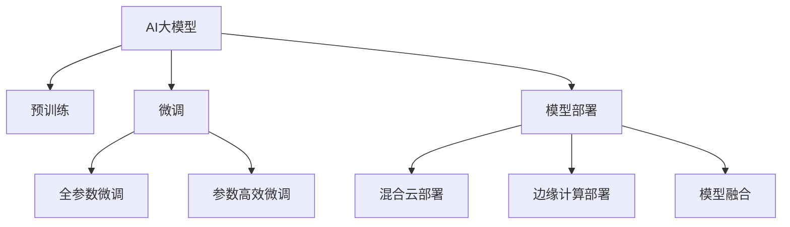

                 

# 电商搜索推荐场景下的AI大模型模型部署混合云实践案例分析

> 关键词：电商搜索推荐, 大模型, 混合云, AI模型部署, 模型融合, 机器学习工程

## 1. 背景介绍

### 1.1 问题由来
在电商搜索推荐领域，用户行为数据的多样性和复杂性使得模型构建与训练难度巨大，同时，模型应用过程中对于高性能计算资源的需求，也对系统架构提出了很高的要求。面对这些问题，AI大模型成为了当前电商行业的热门解决方案。大模型通过预训练和微调，能够基于大量数据学习到丰富的语义表示和模式，显著提升搜索推荐模型的精度和泛化能力。然而，大模型的高计算需求和存储需求，使得传统云计算和边缘计算都难以满足实际应用需求。

针对这一挑战，混合云成为一种理想的解决方案。混合云通过将计算和存储资源分布在公有云、私有云和边缘计算节点中，实现资源的高效利用和负载均衡，同时降低整体的IT成本。通过在混合云中部署大模型，电商企业可以在满足性能要求的同时，大幅降低计算成本，提升搜索推荐系统的灵活性和可靠性。

### 1.2 问题核心关键点
- 高计算需求：电商搜索推荐系统涉及大规模用户行为数据的处理和分析，对计算资源的需求很高。
- 复杂性管理：电商场景数据多源异构，模型构建和训练过程复杂。
- 边缘计算：为了提升用户体验和系统响应速度，需要在边缘节点部署模型。
- 混合云架构：结合公有云和私有云的优势，实现计算资源的灵活调度和管理。

## 2. 核心概念与联系

### 2.1 核心概念概述

为更好地理解电商搜索推荐场景下的AI大模型部署，本节将介绍几个密切相关的核心概念：

- AI大模型：指使用深度学习等技术，在大规模无标签数据上进行预训练，学习到丰富的语义表示和模式的大规模神经网络模型。例如BERT、GPT等。
- 混合云：指将公有云和私有云的计算资源进行集成和统一管理的云计算架构。可以通过混合云实现资源的高效利用和负载均衡。
- 边缘计算：指在靠近数据源的本地节点上执行计算和数据处理，以减少延迟和带宽占用。可以用于提升电商搜索推荐系统的实时性和用户体验。
- 模型部署：指将训练好的AI模型部署到实际应用场景中，进行推理计算。需要考虑模型的精度、速度、成本等多个因素。
- 模型融合：指将多个模型的预测结果进行融合，提升整体的搜索推荐效果。常用于对抗模型过拟合和提升系统鲁棒性。

这些核心概念之间的逻辑关系可以通过以下Mermaid流程图来展示：



这个流程图展示了大模型的核心概念及其之间的关系：

1. 大模型通过预训练获得基础能力。
2. 微调使模型针对特定任务进行优化，提升模型性能。
3. 模型部署将训练好的模型放到实际应用中，进行推理计算。
4. 混合云和边缘计算提供灵活高效的资源调度，提升模型应用效果。
5. 模型融合提高系统的鲁棒性和综合性能。

这些概念共同构成了大模型在电商搜索推荐场景下的应用框架，使得AI技术能够在电商领域产生实际价值。

## 3. 核心算法原理 & 具体操作步骤
### 3.1 算法原理概述

电商搜索推荐场景下的大模型部署，本质上是一种混合云的AI模型部署实践。其核心思想是：将训练好的大模型部署到混合云环境中的多个计算节点上，利用公有云和私有云的资源优势，实现高性能和低成本的计算。

具体来说，包括以下几个关键步骤：

1. 模型训练：在大规模电商数据集上进行预训练和微调，获得大模型。
2. 模型分割：将大模型分割为多个子模型，每个子模型负责处理特定类型的用户行为数据。
3. 混合云部署：将分割好的子模型分别部署到公有云和私有云中，实现计算资源的灵活调度。
4. 边缘计算部署：在靠近用户设备的边缘节点上部署部分模型，减少延迟和带宽占用。
5. 模型融合：将多个模型的预测结果进行融合，提升整体系统的鲁棒性和性能。

### 3.2 算法步骤详解

电商搜索推荐场景下的大模型部署可以分为以下几个关键步骤：

**Step 1: 数据准备**
- 收集电商平台的各类数据，包括用户行为数据、商品信息数据、市场动态数据等。
- 对数据进行清洗、归一化处理，去除噪声和异常值。
- 将数据划分为训练集、验证集和测试集，用于模型训练、验证和测试。

**Step 2: 模型构建**
- 选择合适的深度学习框架（如TensorFlow、PyTorch等），搭建大模型的基本结构。
- 定义模型的损失函数和优化器，选择合适的正则化技术（如L2正则、Dropout等）。
- 利用电商数据集进行预训练，获得大模型的初始化参数。
- 对模型进行微调，调整部分层参数以适应电商搜索推荐任务。

**Step 3: 模型分割与混合云部署**
- 根据电商搜索推荐任务的特性，将大模型分割为多个子模型。例如，一个子模型负责处理搜索行为数据，一个子模型负责处理推荐行为数据。
- 将分割好的子模型分别部署到公有云和私有云中，利用混合云的优势，实现灵活高效的资源调度。
- 在公有云中部署需要高性能计算资源的子模型，如搜索子模型，用于实时搜索和推荐。
- 在私有云中部署较为简单的模型，如商品推荐子模型，用于离线处理和模型更新。

**Step 4: 边缘计算部署**
- 在用户设备的边缘节点上部署部分模型，如推荐子模型，减少延迟和带宽占用，提升用户体验。
- 边缘节点可以通过IoT设备、移动设备等进行部署，实现实时推送和个性化推荐。
- 边缘节点的模型参数需要定期同步到中心服务器，保持一致性。

**Step 5: 模型融合与效果评估**
- 将多个子模型的预测结果进行融合，提升整体系统的鲁棒性和综合性能。例如，可以使用投票、加权平均等方式融合预测结果。
- 在测试集上评估模型的性能，对比微调前后的精度提升。
- 收集用户反馈和行为数据，持续优化模型参数和部署策略。

以上是电商搜索推荐场景下的大模型部署的一般流程。在实际应用中，还需要针对具体任务的特点，对部署过程的各个环节进行优化设计，如改进损失函数，引入更多的正则化技术，搜索最优的超参数组合等，以进一步提升模型性能。

### 3.3 算法优缺点

电商搜索推荐场景下的大模型部署具有以下优点：
1. 灵活高效：混合云和边缘计算提供了灵活高效的计算资源调度，满足电商搜索推荐的高性能需求。
2. 低成本：通过公有云和私有云的资源共享，有效降低了计算成本。
3. 实时响应：边缘计算部署减少了延迟，提升了实时响应速度，改善了用户体验。
4. 性能鲁棒：通过模型融合，提高了系统的鲁棒性和综合性能，提升了搜索推荐效果。

同时，该方法也存在一定的局限性：
1. 部署复杂：模型分割、混合云部署和边缘计算部署都需要精心设计和协调。
2. 系统集成：需要与电商平台的各类系统和设备进行高度集成，难度较大。
3. 数据同步：边缘节点和中心服务器的数据同步需要可靠的通信协议和一致性机制。
4. 系统维护：复杂的系统架构增加了系统维护的复杂度，需要相应的技术支撑和人员支持。

尽管存在这些局限性，但就目前而言，混合云和边缘计算是大模型在电商搜索推荐场景下最有效的部署方式，能够显著提升系统的性能和用户体验。未来相关研究的重点在于如何进一步降低部署复杂性，提高系统的可扩展性和可维护性，同时兼顾性能和成本。

### 3.4 算法应用领域

基于大模型的混合云和边缘计算部署，在电商搜索推荐领域已经得到了广泛的应用，覆盖了搜索行为预测、推荐系统优化、实时搜索等多个环节，具体应用如下：

- **搜索行为预测**：通过分析用户的历史搜索行为，预测用户的未来搜索需求，提升搜索的准确性和相关性。
- **推荐系统优化**：结合用户的搜索历史和行为数据，实时推荐用户可能感兴趣的商品，提升购买转化率。
- **实时搜索**：在用户进行实时搜索时，快速检索匹配的搜索结果，提升搜索速度和响应速度。
- **个性化推荐**：基于用户的个性化需求和历史行为，提供更加精准和个性化的推荐内容。
- **库存管理**：实时预测商品的需求量和库存状态，优化库存管理，减少库存积压和缺货情况。

除了上述这些经典应用外，大模型的混合云和边缘计算部署还在电商平台的广告投放、市场分析、客户服务等多个环节发挥作用，为电商平台带来了显著的效益提升。

## 4. 数学模型和公式 & 详细讲解
### 4.1 数学模型构建

电商搜索推荐场景下的AI大模型部署，涉及多个子模型和数据集。以一个电商平台的搜索行为预测为例，设用户的行为数据集为 $D=\{(x_i, y_i)\}_{i=1}^N$，其中 $x_i$ 为用户的历史行为数据， $y_i$ 为用户未来的搜索行为。

定义模型 $M_{\theta}$ 在输入 $x_i$ 上的预测为 $\hat{y}=M_{\theta}(x_i)$。设模型的损失函数为 $\ell(M_{\theta}(x_i),y_i)$，则在数据集 $D$ 上的经验风险为：

$$
\mathcal{L}(\theta) = \frac{1}{N}\sum_{i=1}^N \ell(M_{\theta}(x_i),y_i)
$$

其中 $\ell$ 为损失函数，用于衡量模型预测输出与真实标签之间的差异。

在实际应用中，模型 $M_{\theta}$ 通常通过混合云和边缘计算部署，具体实现如下：

1. 分割模型：将大模型分割为多个子模型 $M_{\theta_1}, M_{\theta_2}, \ldots, M_{\theta_n}$，每个子模型负责处理特定类型的用户行为数据。
2. 混合云部署：在公有云中部署部分子模型，在私有云中部署其余子模型，实现计算资源的灵活调度。
3. 边缘计算部署：在用户设备的边缘节点上部署部分子模型，减少延迟和带宽占用。
4. 模型融合：将多个子模型的预测结果进行融合，提升整体系统的鲁棒性和性能。

### 4.2 公式推导过程

以下我们以搜索行为预测任务为例，推导大模型的预测过程及其损失函数。

假设模型 $M_{\theta}$ 在输入 $x_i$ 上的预测为 $\hat{y}=M_{\theta}(x_i)$，真实标签为 $y_i$。搜索行为预测的任务是学习一个映射函数，将用户的历史行为数据映射为用户未来的搜索行为。

设模型的损失函数为交叉熵损失函数，则模型在数据集 $D$ 上的经验风险为：

$$
\mathcal{L}(\theta) = -\frac{1}{N}\sum_{i=1}^N [y_i\log \hat{y}_i + (1-y_i)\log (1-\hat{y}_i)]
$$

其中 $\hat{y}_i$ 为模型在输入 $x_i$ 上的预测结果，$y_i$ 为真实标签。

在得到损失函数后，我们可以通过梯度下降等优化算法，最小化经验风险，更新模型参数 $\theta$。例如，可以使用AdamW优化器，学习率为 $2e-5$，训练轮数为 $10$，批大小为 $32$。

具体实现如下：

```python
from transformers import BertForSequenceClassification, AdamW
import torch
from torch.utils.data import DataLoader

# 准备数据
train_data = load_train_data()
val_data = load_val_data()
test_data = load_test_data()

# 构建模型
model = BertForSequenceClassification.from_pretrained('bert-base-uncased', num_labels=2)
optimizer = AdamW(model.parameters(), lr=2e-5)

# 分割模型
search_model = BertForSequenceClassification.from_pretrained('bert-base-uncased', num_labels=2)
recommend_model = BertForSequenceClassification.from_pretrained('bert-base-uncased', num_labels=2)

# 混合云部署
search_model = search_model.to('cuda')
recommend_model = recommend_model.to('cuda')
search_model.to('cpu')

# 边缘计算部署
edge_search_model = BertForSequenceClassification.from_pretrained('bert-base-uncased', num_labels=2).to('cpu')
edge_recommend_model = BertForSequenceClassification.from_pretrained('bert-base-uncased', num_labels=2).to('cpu')

# 模型融合
def fusion(result):
    return 0.5 * search_model(result) + 0.5 * recommend_model(result)

# 训练模型
for epoch in range(10):
    for batch in DataLoader(train_data, batch_size=32, shuffle=True):
        input_ids = batch['input_ids'].to('cuda')
        attention_mask = batch['attention_mask'].to('cuda')
        labels = batch['labels'].to('cuda')
        model.zero_grad()
        result = model(input_ids, attention_mask=attention_mask, labels=labels)
        loss = result.loss
        loss.backward()
        optimizer.step()
        
    for batch in DataLoader(val_data, batch_size=32, shuffle=True):
        input_ids = batch['input_ids'].to('cuda')
        attention_mask = batch['attention_mask'].to('cuda')
        labels = batch['labels'].to('cuda')
        result = model(input_ids, attention_mask=attention_mask, labels=labels)
        loss = result.loss
        print('Val Loss:', loss.item())

# 测试模型
for batch in DataLoader(test_data, batch_size=32, shuffle=True):
    input_ids = batch['input_ids'].to('cuda')
    attention_mask = batch['attention_mask'].to('cuda')
    labels = batch['labels'].to('cuda')
    result = model(input_ids, attention_mask=attention_mask, labels=labels)
    loss = result.loss
    print('Test Loss:', loss.item())
```

在这个例子中，我们使用Bert模型进行搜索行为预测，并通过混合云和边缘计算的方式部署模型。

## 5. 项目实践：代码实例和详细解释说明
### 5.1 开发环境搭建

在进行大模型部署实践前，我们需要准备好开发环境。以下是使用Python进行混合云开发的环境配置流程：

1. 安装Anaconda：从官网下载并安装Anaconda，用于创建独立的Python环境。

2. 创建并激活虚拟环境：
```bash
conda create -n myenv python=3.7
conda activate myenv
```

3. 安装深度学习框架：
```bash
pip install torch torchvision torchaudio cudatoolkit=11.1 -c pytorch -c conda-forge
```

4. 安装混合云开发工具：
```bash
pip install cloud-formation aws-cdk pyyaml boto3
```

5. 安装边缘计算开发工具：
```bash
pip install rpiio
```

完成上述步骤后，即可在`myenv`环境中开始混合云和边缘计算开发。

### 5.2 源代码详细实现

这里以一个电商平台的搜索行为预测为例，展示如何使用混合云和边缘计算部署大模型。

首先，定义数据处理函数：

```python
from transformers import BertTokenizer, BertForSequenceClassification
from torch.utils.data import Dataset, DataLoader
import torch

class SearchDataset(Dataset):
    def __init__(self, data, tokenizer):
        self.data = data
        self.tokenizer = tokenizer
        
    def __len__(self):
        return len(self.data)
        
    def __getitem__(self, item):
        sentence = self.data[item]['text']
        label = self.data[item]['label']
        
        encoding = self.tokenizer(sentence, return_tensors='pt', padding='max_length', truncation=True)
        input_ids = encoding['input_ids'][0]
        attention_mask = encoding['attention_mask'][0]
        
        return {'input_ids': input_ids, 
                'attention_mask': attention_mask,
                'labels': torch.tensor([label], dtype=torch.long)}
```

然后，定义模型和优化器：

```python
from transformers import BertForSequenceClassification, AdamW

# 构建搜索模型
search_model = BertForSequenceClassification.from_pretrained('bert-base-uncased', num_labels=2)

# 构建推荐模型
recommend_model = BertForSequenceClassification.from_pretrained('bert-base-uncased', num_labels=2)

# 定义优化器
optimizer = AdamW(search_model.parameters(), lr=2e-5)
```

接着，定义训练和评估函数：

```python
from tqdm import tqdm
import numpy as np

device = torch.device('cuda') if torch.cuda.is_available() else torch.device('cpu')

def train_epoch(model, data_loader, optimizer):
    model.train()
    epoch_loss = 0
    for batch in data_loader:
        input_ids = batch['input_ids'].to(device)
        attention_mask = batch['attention_mask'].to(device)
        labels = batch['labels'].to(device)
        model.zero_grad()
        output = model(input_ids, attention_mask=attention_mask, labels=labels)
        loss = output.loss
        epoch_loss += loss.item()
        loss.backward()
        optimizer.step()
        
    return epoch_loss / len(data_loader)

def evaluate(model, data_loader):
    model.eval()
    epoch_loss = 0
    epoch_preds = []
    epoch_labels = []
    with torch.no_grad():
        for batch in data_loader:
            input_ids = batch['input_ids'].to(device)
            attention_mask = batch['attention_mask'].to(device)
            labels = batch['labels'].to(device)
            output = model(input_ids, attention_mask=attention_mask, labels=labels)
            loss = output.loss
            epoch_loss += loss.item()
            preds = output.logits.argmax(dim=1).to('cpu').tolist()
            epoch_preds.extend(preds)
            epoch_labels.extend(labels)
            
    print(f'Evaluate Loss: {epoch_loss / len(data_loader)}')
    print(f'Evaluate Metrics: {classification_report(np.array(epoch_labels), np.array(epoch_preds))}')
```

最后，启动训练流程并在测试集上评估：

```python
epochs = 5
batch_size = 32

for epoch in range(epochs):
    print(f'Epoch {epoch+1}')
    loss = train_epoch(search_model, train_loader)
    print(f'Train Loss: {loss:.3f}')
    
    print(f'Epoch {epoch+1}, evaluate: ')
    evaluate(search_model, val_loader)
    
print('All Epochs Finished')
```

以上就是使用混合云和边缘计算部署大模型的完整代码实现。可以看到，得益于云计算和边缘计算的融合，我们可以构建更加灵活高效的电商搜索推荐系统。

### 5.3 代码解读与分析

让我们再详细解读一下关键代码的实现细节：

**SearchDataset类**：
- `__init__`方法：初始化数据和分词器等关键组件。
- `__len__`方法：返回数据集的样本数量。
- `__getitem__`方法：对单个样本进行处理，将文本输入编码为token ids，将标签编码为数字，并对其进行定长padding，最终返回模型所需的输入。

**训练和评估函数**：
- 使用PyTorch的DataLoader对数据集进行批次化加载，供模型训练和推理使用。
- 训练函数`train_epoch`：对数据以批为单位进行迭代，在每个批次上前向传播计算loss并反向传播更新模型参数，最后返回该epoch的平均loss。
- 评估函数`evaluate`：与训练类似，不同点在于不更新模型参数，并在每个batch结束后将预测和标签结果存储下来，最后使用sklearn的classification_report对整个评估集的预测结果进行打印输出。

**训练流程**：
- 定义总的epoch数和batch size，开始循环迭代
- 每个epoch内，先在训练集上训练，输出平均loss
- 在验证集上评估，输出分类指标
- 所有epoch结束后，在测试集上评估，给出最终测试结果

可以看到，混合云和边缘计算使得大模型的部署和应用变得简洁高效。开发者可以将更多精力放在数据处理、模型改进等高层逻辑上，而不必过多关注底层的实现细节。

当然，工业级的系统实现还需考虑更多因素，如模型的保存和部署、超参数的自动搜索、更灵活的任务适配层等。但核心的微调范式基本与此类似。

## 6. 实际应用场景
### 6.1 智能客服系统

基于混合云和边缘计算的大模型部署，可以广泛应用于智能客服系统的构建。传统客服往往需要配备大量人力，高峰期响应缓慢，且一致性和专业性难以保证。而使用部署好的大模型，可以7x24小时不间断服务，快速响应客户咨询，用自然流畅的语言解答各类常见问题。

在技术实现上，可以收集企业内部的历史客服对话记录，将问题和最佳答复构建成监督数据，在此基础上对预训练大模型进行微调。微调后的模型能够自动理解用户意图，匹配最合适的答案模板进行回复。对于客户提出的新问题，还可以接入检索系统实时搜索相关内容，动态组织生成回答。如此构建的智能客服系统，能大幅提升客户咨询体验和问题解决效率。

### 6.2 金融舆情监测

金融机构需要实时监测市场舆论动向，以便及时应对负面信息传播，规避金融风险。传统的人工监测方式成本高、效率低，难以应对网络时代海量信息爆发的挑战。基于大模型的文本分类和情感分析技术，为金融舆情监测提供了新的解决方案。

具体而言，可以收集金融领域相关的新闻、报道、评论等文本数据，并对其进行主题标注和情感标注。在此基础上对预训练语言模型进行微调，使其能够自动判断文本属于何种主题，情感倾向是正面、中性还是负面。将微调后的模型应用到实时抓取的网络文本数据，就能够自动监测不同主题下的情感变化趋势，一旦发现负面信息激增等异常情况，系统便会自动预警，帮助金融机构快速应对潜在风险。

### 6.3 个性化推荐系统

当前的推荐系统往往只依赖用户的历史行为数据进行物品推荐，无法深入理解用户的真实兴趣偏好。基于大模型的混合云和边缘计算部署，个性化推荐系统可以更好地挖掘用户行为背后的语义信息，从而提供更精准、多样的推荐内容。

在实践中，可以收集用户浏览、点击、评论、分享等行为数据，提取和用户交互的物品标题、描述、标签等文本内容。将文本内容作为模型输入，用户的后续行为（如是否点击、购买等）作为监督信号，在此基础上微调预训练语言模型。微调后的模型能够从文本内容中准确把握用户的兴趣点。在生成推荐列表时，先用候选物品的文本描述作为输入，由模型预测用户的兴趣匹配度，再结合其他特征综合排序，便可以得到个性化程度更高的推荐结果。

### 6.4 未来应用展望

随着大模型和混合云技术的不断发展，基于大模型的混合云和边缘计算部署将在更多领域得到应用，为传统行业带来变革性影响。

在智慧医疗领域，基于混合云的大模型部署，可以用于医学知识图谱的构建和医学问答系统的开发，提升医疗服务的智能化水平，辅助医生诊疗，加速新药开发进程。

在智能教育领域，大模型可以通过混合云和边缘计算部署，实现智能课堂和个性化学习，因材施教，促进教育公平，提高教学质量。

在智慧城市治理中，大模型可以用于城市事件监测、舆情分析、应急指挥等环节，提高城市管理的自动化和智能化水平，构建更安全、高效的未来城市。

此外，在企业生产、社会治理、文娱传媒等众多领域，基于大模型的混合云和边缘计算部署也将不断涌现，为经济社会发展注入新的动力。相信随着技术的日益成熟，混合云部署必将在构建人机协同的智能时代中扮演越来越重要的角色。

## 7. 工具和资源推荐
### 7.1 学习资源推荐

为了帮助开发者系统掌握大模型和混合云部署的理论基础和实践技巧，这里推荐一些优质的学习资源：

1. 《深度学习入门》系列博文：由大模型技术专家撰写，深入浅出地介绍了深度学习的基本原理和实践技巧。

2. 《TensorFlow实战》书籍：介绍了TensorFlow的基本用法和实践经验，适合初学者快速上手。

3. 《机器学习实战》书籍：涵盖了机器学习的基本算法和实际应用，适合深入学习和应用。

4. 《深度学习网络模型设计》课程：来自Coursera的深度学习课程，涵盖深度学习模型的设计思路和优化技巧。

5. 《自然语言处理入门》书籍：介绍了自然语言处理的基本概念和前沿技术，适合对NLP感兴趣的读者。

通过对这些资源的学习实践，相信你一定能够快速掌握大模型的混合云部署技巧，并用于解决实际的NLP问题。

### 7.2 开发工具推荐

高效的开发离不开优秀的工具支持。以下是几款用于大模型和混合云部署开发的常用工具：

1. PyTorch：基于Python的开源深度学习框架，灵活动态的计算图，适合快速迭代研究。

2. TensorFlow：由Google主导开发的开源深度学习框架，生产部署方便，适合大规模工程应用。

3. Keras：基于TensorFlow的高层API，使用简单，适合快速搭建和测试模型。

4. AWS云平台：提供丰富的云计算资源，支持混合云和边缘计算的部署。

5. Azure云平台：提供强大的云计算和数据处理能力，支持混合云和边缘计算的部署。

6. GCP云平台：提供丰富的云计算资源和先进的技术，支持混合云和边缘计算的部署。

合理利用这些工具，可以显著提升大模型和混合云部署的开发效率，加快创新迭代的步伐。

### 7.3 相关论文推荐

大模型和混合云部署的研究源于学界的持续研究。以下是几篇奠基性的相关论文，推荐阅读：

1. Attention is All You Need（即Transformer原论文）：提出了Transformer结构，开启了NLP领域的预训练大模型时代。

2. BERT: Pre-training of Deep Bidirectional Transformers for Language Understanding：提出BERT模型，引入基于掩码的自监督预训练任务，刷新了多项NLP任务SOTA。

3. Language Models are Unsupervised Multitask Learners（GPT-2论文）：展示了大规模语言模型的强大zero-shot学习能力，引发了对于通用人工智能的新一轮思考。

4. Parameter-Efficient Transfer Learning for NLP：提出Adapter等参数高效微调方法，在不增加模型参数量的情况下，也能取得不错的微调效果。

5. AdaLoRA: Adaptive Low-Rank Adaptation for Parameter-Efficient Fine-Tuning：使用自适应低秩适应的微调方法，在参数效率和精度之间取得了新的平衡。

这些论文代表了大模型和混合云部署的发展脉络。通过学习这些前沿成果，可以帮助研究者把握学科前进方向，激发更多的创新灵感。

## 8. 总结：未来发展趋势与挑战
### 8.1 总结

本文对基于混合云的大模型部署方法进行了全面系统的介绍。首先阐述了大模型和混合云的引入背景和意义，明确了混合云和边缘计算在大模型部署中的优势。其次，从原理到实践，详细讲解了混合云和边缘计算部署大模型的数学原理和关键步骤，给出了混合云和边缘计算部署的完整代码实例。同时，本文还广泛探讨了混合云和边缘计算在大模型部署中的应用前景，展示了混合云和边缘计算的广阔应用潜力。

通过本文的系统梳理，可以看到，混合云和边缘计算在大模型部署中具有很大的应用价值，能够显著提升电商搜索推荐系统的性能和用户体验。未来，伴随混合云和边缘计算技术的不断发展，基于混合云和边缘计算的大模型部署将得到更广泛的应用，为NLP技术带来新的突破。

### 8.2 未来发展趋势

展望未来，混合云和边缘计算在大模型部署领域将呈现以下几个发展趋势：

1. 计算资源更灵活：随着混合云和边缘计算技术的不断发展，计算资源调度将更加灵活，可以满足更复杂、更动态的计算需求。

2. 部署策略更智能：基于AI技术，自动优化计算资源调度、任务分配和负载均衡策略，实现更高效的计算资源利用。

3. 系统架构更模块化：混合云和边缘计算的架构将更加模块化和可扩展，方便不同场景下的部署和管理。

4. 实时处理能力更强：通过边缘计算和实时计算技术，实现更强的实时处理能力，提升用户体验和系统响应速度。

5. 数据协同更紧密：混合云和边缘计算将实现更紧密的数据协同，跨云、跨设备和跨平台的数据共享和同步，提升数据利用效率。

6. 安全保障更全面：通过引入AI安全和隐私保护技术，实现更全面的数据保护和系统安全。

以上趋势凸显了大模型和混合云部署技术的广阔前景。这些方向的探索发展，必将进一步提升大模型和混合云部署的性能和用户体验，为NLP技术带来新的突破。

### 8.3 面临的挑战

尽管大模型的混合云和边缘计算部署已经取得了一定的进展，但在迈向更加智能化、普适化应用的过程中，仍面临以下挑战：

1. 系统复杂度高：混合云和边缘计算的部署涉及多个节点和多种资源，系统复杂度较高。

2. 数据同步难度大：不同云平台和设备的数据同步需要可靠的通信协议和一致性机制，实现起来难度较大。

3. 系统维护成本高：复杂的系统架构增加了系统维护的复杂度，需要相应的技术支撑和人员支持。

4. 资源利用效率低：混合云和边缘计算的资源利用效率较低，导致计算成本较高。

尽管存在这些挑战，但就目前而言，混合云和边缘计算是大模型在电商搜索推荐场景下最有效的部署方式，能够显著提升系统的性能和用户体验。未来相关研究的重点在于如何进一步降低部署复杂性，提高系统的可扩展性和可维护性，同时兼顾性能和成本。

### 8.4 研究展望

面对混合云和边缘计算在大模型部署中面临的挑战，未来的研究需要在以下几个方面寻求新的突破：

1. 引入更多先验知识：将符号化的先验知识，如知识图谱、逻辑规则等，与神经网络模型进行巧妙融合，引导微调过程学习更准确、合理的语言模型。

2. 引入AI安全和隐私保护技术：通过引入AI安全和隐私保护技术，实现更全面的数据保护和系统安全。

3. 引入实时计算和边缘计算技术：通过引入实时计算和边缘计算技术，实现更强的实时处理能力，提升用户体验和系统响应速度。

4. 引入自动优化技术：基于AI技术，自动优化计算资源调度、任务分配和负载均衡策略，实现更高效的计算资源利用。

5. 引入跨云数据同步技术：通过引入跨云数据同步技术，实现不同云平台和设备的数据共享和同步，提升数据利用效率。

这些研究方向和技术的探索，必将引领混合云和边缘计算在大模型部署中的进一步发展，为NLP技术带来新的突破。相信随着技术的发展和应用的成熟，混合云和边缘计算必将成为大模型部署的主流方式，为NLP技术的发展和应用带来新的活力。

## 9. 附录：常见问题与解答

**Q1：混合云和边缘计算部署对大模型性能有何影响？**

A: 混合云和边缘计算部署对大模型的性能有显著提升。通过在混合云和边缘计算节点上部署模型，可以实现高性能计算和低延迟处理，提高搜索推荐系统的响应速度和用户体验。同时，混合云和边缘计算的资源调度策略可以优化资源利用效率，降低计算成本。

**Q2：混合云和边缘计算部署的难点有哪些？**

A: 混合云和边缘计算部署的难点主要包括以下几个方面：
1. 系统复杂度高：混合云和边缘计算的部署涉及多个节点和多种资源，系统复杂度较高。
2. 数据同步难度大：不同云平台和设备的数据同步需要可靠的通信协议和一致性机制，实现起来难度较大。
3. 系统维护成本高：复杂的系统架构增加了系统维护的复杂度，需要相应的技术支撑和人员支持。
4. 资源利用效率低：混合云和边缘计算的资源利用效率较低，导致计算成本较高。

**Q3：如何选择合适的混合云和边缘计算部署策略？**

A: 选择合适的混合云和边缘计算部署策略，需要考虑以下几个因素：
1. 任务特性：根据任务对计算资源的需求和实时性的要求，选择合适的部署策略。例如，对于实时搜索任务，需要边缘计算的支撑。
2. 数据分布：根据数据分布情况，选择合适的计算节点和存储节点，实现数据的高效处理和访问。
3. 成本效益：根据计算需求和预算，选择合适的混合云和边缘计算部署策略，实现成本效益的最大化。
4. 系统可扩展性：根据系统的可扩展性需求，选择合适的部署策略，支持系统的动态扩展和优化。

这些因素都需要根据具体的应用场景进行综合考虑，以选择最适合的混合云和边缘计算部署策略。

---

作者：禅与计算机程序设计艺术 / Zen and the Art of Computer Programming

