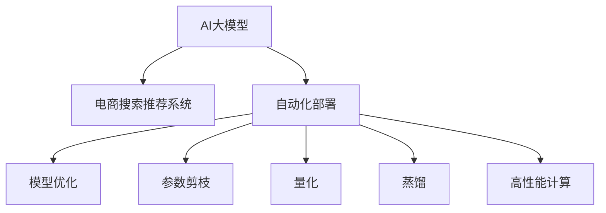

                 

# 电商搜索推荐场景下的AI大模型模型部署自动化策略

> 关键词：电商搜索推荐, AI大模型, 自动化部署, 深度学习, 超大规模模型, 高性能计算

## 1. 背景介绍

随着人工智能技术的发展，尤其是深度学习在大规模数据集上的训练，使得预训练模型(如BERT, GPT等)在电商搜索推荐等领域展现出强大的潜力。这些大模型通过在大规模无标签文本数据上进行预训练，学习到了丰富的语言和语义知识，可以在各种NLP任务上实现不俗的表现。但在实际应用中，如何将这些模型高效地部署到电商搜索推荐系统中，是一个具有挑战性的问题。

### 1.1 问题由来

电商搜索推荐系统是典型的NLP应用场景，旨在根据用户的查询请求和历史记录，推荐最适合的商品。传统的搜索推荐系统基于规则、统计等方法，难以全面覆盖商品的语义表示，导致推荐结果不够精准。而AI大模型通过学习大量的语义知识和用户行为数据，可以提供更为智能和个性化的推荐结果。

然而，大模型的部署面临诸多挑战：
1. **资源消耗高**：超大规模模型需要大量的GPU资源，单机部署难以满足实际需求。
2. **模型复杂度高**：深度学习模型结构复杂，需进行合理的剪枝和优化，才能满足部署要求。
3. **系统延迟长**：大模型推理速度较慢，需要优化算法和模型架构，以实现低延迟响应。

为了应对这些挑战，电商搜索推荐场景下的AI大模型部署自动化策略成为研究热点。自动化策略通过自动化工具和流水线化流程，大大简化了大模型部署的复杂性，提高了部署效率和精度，为电商搜索推荐系统的智能化升级提供了有力支持。

## 2. 核心概念与联系

### 2.1 核心概念概述

为了更好地理解电商搜索推荐场景下的AI大模型模型部署自动化策略，本节将介绍几个密切相关的核心概念：

- **AI大模型**：指通过大规模数据集进行预训练的深度学习模型，如BERT、GPT等。大模型通常具备较强的语言理解和生成能力，可以在多种NLP任务上取得优异表现。

- **电商搜索推荐系统**：利用自然语言处理技术和AI大模型，为用户提供智能化的搜索结果和推荐服务的系统。系统通常包含查询解析、语义匹配、推荐生成等模块。

- **自动化部署**：通过自动化工具和流程，简化大模型部署过程，降低部署复杂度，提升部署效率和精度。自动化部署包括模型优化、参数剪枝、高性能计算等环节。

- **高性能计算**：指使用高效率的计算硬件和算法，实现大规模深度学习模型的有效训练和推理。包括GPU、TPU等硬件设备和优化算法等。

- **模型优化**：在大模型部署前，通过剪枝、量化、蒸馏等技术，减少模型参数量，降低计算资源消耗，提高推理速度和精度。

- **参数剪枝**：通过剪枝算法删除不必要的参数，减少模型复杂度，提高计算效率。常见的剪枝算法包括网络剪枝、张量剪枝等。

- **量化**：将浮点模型转换为定点模型，减少存储空间和计算资源消耗，提高推理速度。量化技术包括权重量化和激活量化等。

- **蒸馏**：通过将复杂模型转换为轻量化模型，减少计算资源消耗，提高推理速度。蒸馏技术包括知识蒸馏、量化蒸馏等。

这些核心概念之间的逻辑关系可以通过以下Mermaid流程图来展示：



这个流程图展示了大模型与电商搜索推荐系统之间的联系，以及自动化部署的关键环节：

1. 大模型通过电商搜索推荐系统，提供智能化的搜索结果和推荐服务。
2. 自动化部署包括模型优化、参数剪枝、量化、蒸馏、高性能计算等环节，旨在降低大模型部署的复杂度，提升部署效率和精度。

## 3. 核心算法原理 & 具体操作步骤

### 3.1 算法原理概述

电商搜索推荐场景下的AI大模型模型部署自动化策略，主要基于深度学习和高性能计算技术，通过自动化工具和流程，简化大模型的部署过程，提升系统的响应速度和效率。

形式化地，假设电商搜索推荐系统的大模型为 $M_{\theta}$，其中 $\theta$ 为模型的参数。电商推荐系统包含 $N$ 个用户查询请求 $q_i$ 和对应的推荐结果 $r_i$。自动化部署的目标是找到最优参数 $\hat{\theta}$，使得推荐系统的输出 $r_i$ 与实际推荐结果 $r_{\text{real}}$ 的差异最小化，即：

$$
\hat{\theta}=\mathop{\arg\min}_{\theta} \sum_{i=1}^N \mathcal{L}(M_{\theta}(q_i),r_{\text{real}})
$$

其中 $\mathcal{L}$ 为推荐系统损失函数，用于衡量推荐结果的准确性和相关性。

### 3.2 算法步骤详解

电商搜索推荐场景下的AI大模型模型部署自动化策略，一般包括以下几个关键步骤：

**Step 1: 准备预训练模型和数据集**
- 选择合适的预训练语言模型 $M_{\theta}$ 作为初始化参数，如 BERT、GPT等。
- 准备电商搜索推荐系统的训练数据集 $D$，包括用户查询请求和对应的商品推荐结果。

**Step 2: 添加任务适配层**
- 根据推荐系统的任务类型，在预训练模型顶层设计合适的输出层和损失函数。
- 对于推荐任务，通常使用多目标损失函数，如点积损失、均方误差损失等。

**Step 3: 设置微调超参数**
- 选择合适的优化算法及其参数，如 Adam、SGD等，设置学习率、批大小、迭代轮数等。
- 设置正则化技术及强度，包括权重衰减、Dropout、Early Stopping等。
- 确定冻结预训练参数的策略，如仅微调顶层，或全部参数都参与微调。

**Step 4: 执行梯度训练**
- 将训练集数据分批次输入模型，前向传播计算损失函数。
- 反向传播计算参数梯度，根据设定的优化算法和学习率更新模型参数。
- 周期性在验证集上评估模型性能，根据性能指标决定是否触发 Early Stopping。
- 重复上述步骤直到满足预设的迭代轮数或 Early Stopping 条件。

**Step 5: 模型优化与剪枝**
- 对微调后的模型进行优化和剪枝，减少参数量，提高推理速度和精度。
- 可以使用剪枝算法删除冗余参数，使用量化技术将浮点模型转换为定点模型。

**Step 6: 部署与监控**
- 将优化后的模型部署到电商搜索推荐系统，进行性能测试。
- 实时监控系统性能，定期更新模型参数，保持系统的高效和精准。

### 3.3 算法优缺点

电商搜索推荐场景下的AI大模型模型部署自动化策略，具有以下优点：
1. 提高部署效率：自动化部署流程大大简化了大模型部署的复杂性，提升了部署速度。
2. 提升推荐精度：通过自动化微调和优化，模型能够更好地适应电商推荐系统的特定任务，提升推荐结果的准确性和相关性。
3. 节省计算资源：自动化剪枝、量化等技术，减少了模型参数量和计算资源消耗。
4. 增强系统可维护性：自动化流程的引入，使得大模型的更新和维护更加简单高效。

同时，该策略也存在一定的局限性：
1. 依赖高质量标注数据：电商推荐系统的训练数据质量直接影响推荐效果，获取高质量标注数据的成本较高。
2. 模型泛化能力有限：如果电商推荐系统与预训练数据的分布差异较大，微调的性能提升有限。
3. 自动化流程复杂：自动化部署流程涉及多个环节，如果自动化工具和流程设计不合理，可能导致部署失败。
4. 模型可解释性不足：自动化的微调和优化过程，可能使模型更加复杂，难以解释其决策过程。

尽管存在这些局限性，但就目前而言，电商搜索推荐场景下的AI大模型部署自动化策略仍是大模型应用的主流范式。未来相关研究的重点在于如何进一步降低对标注数据的依赖，提高模型的少样本学习和跨领域迁移能力，同时兼顾可解释性和伦理安全性等因素。

### 3.4 算法应用领域

电商搜索推荐场景下的AI大模型模型部署自动化策略，已在多个电商搜索推荐系统中得到应用，如淘宝、京东、亚马逊等。具体应用场景包括：

- **商品推荐**：根据用户浏览和购买历史，生成个性化的商品推荐。
- **智能搜索**：自动解析用户查询请求，推荐相关商品。
- **用户画像**：基于用户行为数据，生成用户画像，实现个性化推荐。
- **内容推荐**：对新闻、视频等媒体内容进行推荐，提高用户粘性。

除了上述这些经典应用外，大模型的自动化部署还在更多场景中得到应用，如广告投放、用户行为分析、市场营销等，为电商搜索推荐系统的智能化升级提供了新的技术路径。

## 4. 数学模型和公式 & 详细讲解

### 4.1 数学模型构建

本节将使用数学语言对电商搜索推荐场景下的AI大模型模型部署自动化策略进行更加严格的刻画。

记电商推荐系统的大模型为 $M_{\theta}$，其中 $\theta$ 为模型参数。电商推荐系统的训练数据集为 $D=\{(q_i,r_i)\}_{i=1}^N$，其中 $q_i$ 为用户查询请求，$r_i$ 为对应的推荐结果。

定义模型 $M_{\theta}$ 在输入 $q_i$ 上的损失函数为 $\ell(M_{\theta}(q_i),r_i)$，则在数据集 $D$ 上的经验风险为：

$$
\mathcal{L}(\theta) = \frac{1}{N}\sum_{i=1}^N \ell(M_{\theta}(q_i),r_i)
$$

微调的优化目标是最小化经验风险，即找到最优参数：

$$
\theta^* = \mathop{\arg\min}_{\theta} \mathcal{L}(\theta)
$$

在实践中，我们通常使用基于梯度的优化算法（如Adam、SGD等）来近似求解上述最优化问题。设 $\eta$ 为学习率，$\lambda$ 为正则化系数，则参数的更新公式为：

$$
\theta \leftarrow \theta - \eta \nabla_{\theta}\mathcal{L}(\theta) - \eta\lambda\theta
$$

其中 $\nabla_{\theta}\mathcal{L}(\theta)$ 为损失函数对参数 $\theta$ 的梯度，可通过反向传播算法高效计算。

### 4.2 公式推导过程

以下我们以推荐任务为例，推导交叉熵损失函数及其梯度的计算公式。

假设模型 $M_{\theta}$ 在输入 $q_i$ 上的输出为 $\hat{r_i}$，表示推荐结果的相关性得分。真实标签 $r_i \in [0,1]$。则推荐任务交叉熵损失函数定义为：

$$
\ell(M_{\theta}(q_i),r_i) = -r_i\log \hat{r_i} + (1-r_i)\log (1-\hat{r_i})
$$

将其代入经验风险公式，得：

$$
\mathcal{L}(\theta) = -\frac{1}{N}\sum_{i=1}^N [r_i\log M_{\theta}(q_i)+(1-r_i)\log(1-M_{\theta}(q_i))]
$$

根据链式法则，损失函数对参数 $\theta_k$ 的梯度为：

$$
\frac{\partial \mathcal{L}(\theta)}{\partial \theta_k} = -\frac{1}{N}\sum_{i=1}^N (\frac{r_i}{M_{\theta}(q_i)}-\frac{1-r_i}{1-M_{\theta}(q_i)}) \frac{\partial M_{\theta}(q_i)}{\partial \theta_k}
$$

其中 $\frac{\partial M_{\theta}(q_i)}{\partial \theta_k}$ 可进一步递归展开，利用自动微分技术完成计算。

在得到损失函数的梯度后，即可带入参数更新公式，完成模型的迭代优化。重复上述过程直至收敛，最终得到适应电商推荐系统的大模型参数 $\theta^*$。

## 5. 项目实践：代码实例和详细解释说明

### 5.1 开发环境搭建

在进行电商搜索推荐场景下的AI大模型模型部署自动化实践前，我们需要准备好开发环境。以下是使用Python进行PyTorch开发的环境配置流程：

1. 安装Anaconda：从官网下载并安装Anaconda，用于创建独立的Python环境。

2. 创建并激活虚拟环境：
```bash
conda create -n pytorch-env python=3.8 
conda activate pytorch-env
```

3. 安装PyTorch：根据CUDA版本，从官网获取对应的安装命令。例如：
```bash
conda install pytorch torchvision torchaudio cudatoolkit=11.1 -c pytorch -c conda-forge
```

4. 安装Transformers库：
```bash
pip install transformers
```

5. 安装各类工具包：
```bash
pip install numpy pandas scikit-learn matplotlib tqdm jupyter notebook ipython
```

完成上述步骤后，即可在`pytorch-env`环境中开始微调实践。

### 5.2 源代码详细实现

这里我们以电商推荐系统为例，给出使用Transformers库对BERT模型进行自动化微调的PyTorch代码实现。

首先，定义电商推荐系统的数据处理函数：

```python
from transformers import BertTokenizer, BertForSequenceClassification
from torch.utils.data import Dataset
import torch

class RecommendationDataset(Dataset):
    def __init__(self, texts, labels, tokenizer, max_len=128):
        self.texts = texts
        self.labels = labels
        self.tokenizer = tokenizer
        self.max_len = max_len
        
    def __len__(self):
        return len(self.texts)
    
    def __getitem__(self, item):
        text = self.texts[item]
        label = self.labels[item]
        
        encoding = self.tokenizer(text, return_tensors='pt', max_length=self.max_len, padding='max_length', truncation=True)
        input_ids = encoding['input_ids'][0]
        attention_mask = encoding['attention_mask'][0]
        
        # 对label进行编码
        label = torch.tensor(label, dtype=torch.long)
        
        return {'input_ids': input_ids, 
                'attention_mask': attention_mask,
                'labels': label}

# 定义标签与id的映射
label2id = {'0': 0, '1': 1}
id2label = {v: k for k, v in label2id.items()}

# 创建dataset
tokenizer = BertTokenizer.from_pretrained('bert-base-cased')

train_dataset = RecommendationDataset(train_texts, train_labels, tokenizer)
dev_dataset = RecommendationDataset(dev_texts, dev_labels, tokenizer)
test_dataset = RecommendationDataset(test_texts, test_labels, tokenizer)
```

然后，定义模型和优化器：

```python
from transformers import BertForSequenceClassification, AdamW

model = BertForSequenceClassification.from_pretrained('bert-base-cased', num_labels=len(label2id))

optimizer = AdamW(model.parameters(), lr=2e-5)
```

接着，定义训练和评估函数：

```python
from torch.utils.data import DataLoader
from tqdm import tqdm
from sklearn.metrics import accuracy_score

device = torch.device('cuda') if torch.cuda.is_available() else torch.device('cpu')
model.to(device)

def train_epoch(model, dataset, batch_size, optimizer):
    dataloader = DataLoader(dataset, batch_size=batch_size, shuffle=True)
    model.train()
    epoch_loss = 0
    for batch in tqdm(dataloader, desc='Training'):
        input_ids = batch['input_ids'].to(device)
        attention_mask = batch['attention_mask'].to(device)
        labels = batch['labels'].to(device)
        model.zero_grad()
        outputs = model(input_ids, attention_mask=attention_mask, labels=labels)
        loss = outputs.loss
        epoch_loss += loss.item()
        loss.backward()
        optimizer.step()
    return epoch_loss / len(dataloader)

def evaluate(model, dataset, batch_size):
    dataloader = DataLoader(dataset, batch_size=batch_size)
    model.eval()
    preds, labels = [], []
    with torch.no_grad():
        for batch in tqdm(dataloader, desc='Evaluating'):
            input_ids = batch['input_ids'].to(device)
            attention_mask = batch['attention_mask'].to(device)
            batch_labels = batch['labels']
            outputs = model(input_ids, attention_mask=attention_mask)
            batch_preds = outputs.logits.argmax(dim=1).to('cpu').tolist()
            batch_labels = batch_labels.to('cpu').tolist()
            for pred, label in zip(batch_preds, batch_labels):
                preds.append(pred)
                labels.append(label)
                
    print('Accuracy: {:.3f}%'.format(accuracy_score(labels, preds)))
```

最后，启动训练流程并在测试集上评估：

```python
epochs = 5
batch_size = 16

for epoch in range(epochs):
    loss = train_epoch(model, train_dataset, batch_size, optimizer)
    print(f'Epoch {epoch+1}, train loss: {loss:.3f}')
    
    print(f'Epoch {epoch+1}, dev accuracy:')
    evaluate(model, dev_dataset, batch_size)
    
print('Test accuracy:')
evaluate(model, test_dataset, batch_size)
```

以上就是使用PyTorch对BERT进行电商推荐系统自动化微调的完整代码实现。可以看到，得益于Transformers库的强大封装，我们可以用相对简洁的代码完成BERT模型的加载和微调。

### 5.3 代码解读与分析

让我们再详细解读一下关键代码的实现细节：

**RecommendationDataset类**：
- `__init__`方法：初始化文本、标签、分词器等关键组件。
- `__len__`方法：返回数据集的样本数量。
- `__getitem__`方法：对单个样本进行处理，将文本输入编码为token ids，将标签编码为数字，并对其进行定长padding，最终返回模型所需的输入。

**label2id和id2label字典**：
- 定义了标签与数字id之间的映射关系，用于将标签转换为数字。

**训练和评估函数**：
- 使用PyTorch的DataLoader对数据集进行批次化加载，供模型训练和推理使用。
- 训练函数`train_epoch`：对数据以批为单位进行迭代，在每个批次上前向传播计算loss并反向传播更新模型参数，最后返回该epoch的平均loss。
- 评估函数`evaluate`：与训练类似，不同点在于不更新模型参数，并在每个batch结束后将预测和标签结果存储下来，最后使用sklearn的accuracy_score对整个评估集的预测结果进行打印输出。

**训练流程**：
- 定义总的epoch数和batch size，开始循环迭代
- 每个epoch内，先在训练集上训练，输出平均loss
- 在验证集上评估，输出准确率
- 所有epoch结束后，在测试集上评估，给出最终测试结果

可以看到，PyTorch配合Transformers库使得BERT微调的代码实现变得简洁高效。开发者可以将更多精力放在数据处理、模型改进等高层逻辑上，而不必过多关注底层的实现细节。

当然，工业级的系统实现还需考虑更多因素，如模型的保存和部署、超参数的自动搜索、更灵活的任务适配层等。但核心的微调范式基本与此类似。

## 6. 实际应用场景
### 6.1 智能客服系统

基于大语言模型微调的对话技术，可以广泛应用于智能客服系统的构建。传统客服往往需要配备大量人力，高峰期响应缓慢，且一致性和专业性难以保证。而使用微调后的对话模型，可以7x24小时不间断服务，快速响应客户咨询，用自然流畅的语言解答各类常见问题。

在技术实现上，可以收集企业内部的历史客服对话记录，将问题和最佳答复构建成监督数据，在此基础上对预训练对话模型进行微调。微调后的对话模型能够自动理解用户意图，匹配最合适的答案模板进行回复。对于客户提出的新问题，还可以接入检索系统实时搜索相关内容，动态组织生成回答。如此构建的智能客服系统，能大幅提升客户咨询体验和问题解决效率。

### 6.2 金融舆情监测

金融机构需要实时监测市场舆论动向，以便及时应对负面信息传播，规避金融风险。传统的人工监测方式成本高、效率低，难以应对网络时代海量信息爆发的挑战。基于大语言模型微调的文本分类和情感分析技术，为金融舆情监测提供了新的解决方案。

具体而言，可以收集金融领域相关的新闻、报道、评论等文本数据，并对其进行主题标注和情感标注。在此基础上对预训练语言模型进行微调，使其能够自动判断文本属于何种主题，情感倾向是正面、中性还是负面。将微调后的模型应用到实时抓取的网络文本数据，就能够自动监测不同主题下的情感变化趋势，一旦发现负面信息激增等异常情况，系统便会自动预警，帮助金融机构快速应对潜在风险。

### 6.3 个性化推荐系统

当前的推荐系统往往只依赖用户的历史行为数据进行物品推荐，无法深入理解用户的真实兴趣偏好。基于大语言模型微调技术，个性化推荐系统可以更好地挖掘用户行为背后的语义信息，从而提供更精准、多样的推荐内容。

在实践中，可以收集用户浏览、点击、评论、分享等行为数据，提取和用户交互的物品标题、描述、标签等文本内容。将文本内容作为模型输入，用户的后续行为（如是否点击、购买等）作为监督信号，在此基础上微调预训练语言模型。微调后的模型能够从文本内容中准确把握用户的兴趣点。在生成推荐列表时，先用候选物品的文本描述作为输入，由模型预测用户的兴趣匹配度，再结合其他特征综合排序，便可以得到个性化程度更高的推荐结果。

### 6.4 未来应用展望

随着大语言模型微调技术的发展，其在电商搜索推荐、智能客服、金融舆情监测、个性化推荐等多个领域的应用前景将更加广阔。未来，大语言模型微调技术将通过与更先进的技术手段（如知识图谱、生成对抗网络等）结合，进一步提升模型的表现，为用户提供更为精准、高效的智能服务。

## 7. 工具和资源推荐
### 7.1 学习资源推荐

为了帮助开发者系统掌握大语言模型微调的理论基础和实践技巧，这里推荐一些优质的学习资源：

1. 《Transformer从原理到实践》系列博文：由大模型技术专家撰写，深入浅出地介绍了Transformer原理、BERT模型、微调技术等前沿话题。

2. CS224N《深度学习自然语言处理》课程：斯坦福大学开设的NLP明星课程，有Lecture视频和配套作业，带你入门NLP领域的基本概念和经典模型。

3. 《Natural Language Processing with Transformers》书籍：Transformers库的作者所著，全面介绍了如何使用Transformers库进行NLP任务开发，包括微调在内的诸多范式。

4. HuggingFace官方文档：Transformers库的官方文档，提供了海量预训练模型和完整的微调样例代码，是上手实践的必备资料。

5. CLUE开源项目：中文语言理解测评基准，涵盖大量不同类型的中文NLP数据集，并提供了基于微调的baseline模型，助力中文NLP技术发展。

通过对这些资源的学习实践，相信你一定能够快速掌握大语言模型微调的精髓，并用于解决实际的NLP问题。
###  7.2 开发工具推荐

高效的开发离不开优秀的工具支持。以下是几款用于大语言模型微调开发的常用工具：

1. PyTorch：基于Python的开源深度学习框架，灵活动态的计算图，适合快速迭代研究。大部分预训练语言模型都有PyTorch版本的实现。

2. TensorFlow：由Google主导开发的开源深度学习框架，生产部署方便，适合大规模工程应用。同样有丰富的预训练语言模型资源。

3. Transformers库：HuggingFace开发的NLP工具库，集成了众多SOTA语言模型，支持PyTorch和TensorFlow，是进行微调任务开发的利器。

4. Weights & Biases：模型训练的实验跟踪工具，可以记录和可视化模型训练过程中的各项指标，方便对比和调优。与主流深度学习框架无缝集成。

5. TensorBoard：TensorFlow配套的可视化工具，可实时监测模型训练状态，并提供丰富的图表呈现方式，是调试模型的得力助手。

6. Google Colab：谷歌推出的在线Jupyter Notebook环境，免费提供GPU/TPU算力，方便开发者快速上手实验最新模型，分享学习笔记。

合理利用这些工具，可以显著提升大语言模型微调任务的开发效率，加快创新迭代的步伐。

### 7.3 相关论文推荐

大语言模型和微调技术的发展源于学界的持续研究。以下是几篇奠基性的相关论文，推荐阅读：

1. Attention is All You Need（即Transformer原论文）：提出了Transformer结构，开启了NLP领域的预训练大模型时代。

2. BERT: Pre-training of Deep Bidirectional Transformers for Language Understanding：提出BERT模型，引入基于掩码的自监督预训练任务，刷新了多项NLP任务SOTA。

3. Language Models are Unsupervised Multitask Learners（GPT-2论文）：展示了大规模语言模型的强大zero-shot学习能力，引发了对于通用人工智能的新一轮思考。

4. Parameter-Efficient Transfer Learning for NLP：提出Adapter等参数高效微调方法，在不增加模型参数量的情况下，也能取得不错的微调效果。

5. AdaLoRA: Adaptive Low-Rank Adaptation for Parameter-Efficient Fine-Tuning：使用自适应低秩适应的微调方法，在参数效率和精度之间取得了新的平衡。

这些论文代表了大语言模型微调技术的发展脉络。通过学习这些前沿成果，可以帮助研究者把握学科前进方向，激发更多的创新灵感。

## 8. 总结：未来发展趋势与挑战

### 8.1 总结

本文对电商搜索推荐场景下的AI大模型模型部署自动化策略进行了全面系统的介绍。首先阐述了电商搜索推荐系统对AI大模型的需求，以及自动化部署的重要性。其次，从原理到实践，详细讲解了自动化部署的数学原理和关键步骤，给出了电商推荐系统自动化微调的完整代码实例。同时，本文还探讨了自动化部署在多个行业领域的应用前景，展示了自动化策略的广阔应用空间。最后，精选了自动化部署的各类学习资源，力求为读者提供全方位的技术指引。

通过本文的系统梳理，可以看到，电商搜索推荐场景下的AI大模型模型部署自动化策略，通过自动化工具和流程，大大简化了大模型的部署过程，提升了系统的响应速度和效率。自动化部署不仅适用于电商推荐系统，还可在智能客服、金融舆情监测、个性化推荐等多个领域得到应用。得益于大语言模型的强大表现和自动化部署的灵活性，AI技术将在更多领域大放异彩，深刻影响人类的生产生活方式。

### 8.2 未来发展趋势

展望未来，电商搜索推荐场景下的AI大模型模型部署自动化策略将呈现以下几个发展趋势：

1. **深度学习与高性能计算的结合**：深度学习模型的复杂性将随着规模的增大而进一步提升，高性能计算（如GPU、TPU等）将发挥越来越重要的作用。未来的自动化部署将更依赖于先进的高性能计算平台。

2. **多模态融合**：未来的电商搜索推荐系统将不仅仅依赖文本数据，而是结合图像、视频、语音等多模态信息，提升推荐结果的全面性和准确性。自动化部署技术需要进一步拓展，支持多模态数据的融合和处理。

3. **知识图谱与深度学习的结合**：知识图谱可以提供更丰富、更有结构性的信息，与深度学习模型结合，能够进一步提升推荐系统的表现。自动化部署需要支持知识图谱的嵌入和融合。

4. **联邦学习与自动化部署的结合**：联邦学习可以保护用户隐私，同时利用分布式计算提升模型的泛化能力。自动化部署技术需要支持联邦学习的模型训练和部署。

5. **动态模型更新与自动化部署的结合**：动态更新模型可以应对实时变化的市场需求，自动化部署需要支持动态模型更新和持续优化。

以上趋势凸显了大语言模型微调技术的广阔前景。这些方向的探索发展，将进一步提升电商搜索推荐系统的智能化水平，为人类生产生活带来更多便利和智能。

### 8.3 面临的挑战

尽管电商搜索推荐场景下的AI大模型模型部署自动化策略已经取得了一定的进展，但在迈向更加智能化、普适化应用的过程中，仍面临诸多挑战：

1. **数据隐私与伦理问题**：电商推荐系统涉及大量的用户隐私数据，如何在保护用户隐私的同时，有效利用这些数据，是一个重要的伦理和法律问题。

2. **模型鲁棒性与泛化能力**：当前自动化部署的模型，在不同数据分布上可能表现出较差的鲁棒性和泛化能力，需要进一步提升模型的稳定性和适应性。

3. **计算资源与部署成本**：大模型的部署需要高性能计算资源，同时自动化部署的复杂性也带来了较高的开发和维护成本。如何降低这些成本，实现高效、低成本的部署，是一大挑战。

4. **模型可解释性与透明度**：自动化部署的模型，往往具有较高的复杂度，难以解释其决策过程。如何在提升模型性能的同时，增强其可解释性和透明度，是一个重要的研究方向。

5. **模型更新与维护**：电商推荐系统的需求不断变化，自动化部署的模型需要定期更新和维护，以保持系统的竞争力。

6. **模型安全性**：电商推荐系统面临各种攻击，自动化部署的模型需要具备一定的安全性，以防止恶意攻击和数据泄露。

这些挑战亟需解决，以推动电商搜索推荐系统的大规模应用。只有面对并克服这些挑战，才能真正实现AI技术在电商推荐系统中的广泛应用，为人类带来更多的智能和便利。

### 8.4 研究展望

面对电商搜索推荐场景下的AI大模型模型部署自动化策略所面临的诸多挑战，未来的研究需要在以下几个方面寻求新的突破：

1. **模型压缩与量化技术**：通过剪枝、量化等技术，进一步减少模型参数量，提升模型推理速度和资源利用率。

2. **联邦学习与自动化部署结合**：探索联邦学习在电商推荐系统中的应用，结合自动化部署，提升模型的泛化能力和安全性。

3. **多模态融合技术**：研究多模态数据的融合方法，提升电商推荐系统的表现。

4. **知识图谱与深度学习结合**：将知识图谱与深度学习模型结合，提升推荐系统的表现和智能化水平。

5. **动态模型更新技术**：研究动态模型更新方法，适应电商推荐系统需求的变化。

6. **自动化部署的算法优化**：优化自动化部署的算法，提升模型的稳定性和鲁棒性。

通过以上方向的研究，有望进一步提升电商搜索推荐系统的智能化水平，为电商推荐系统带来更高效、精准、个性化的推荐服务，推动电商行业的持续发展。

## 9. 附录：常见问题与解答

**Q1：电商推荐系统的训练数据质量如何影响推荐效果？**

A: 电商推荐系统的训练数据质量直接影响推荐效果。高质量的标注数据能够提供更准确的训练信号，使模型能够更好地捕捉用户行为和商品特征之间的关系。如果数据质量低下，模型可能会学习到错误的关联，导致推荐结果不准确。

**Q2：电商推荐系统的自动化部署流程中，哪些环节需要特别关注？**

A: 电商推荐系统的自动化部署流程中，以下环节需要特别关注：
1. 数据预处理：清洗和标准化数据，去除噪声和异常值。
2. 模型优化与剪枝：减少模型参数量，提高推理速度和精度。
3. 量化：将浮点模型转换为定点模型，减少存储空间和计算资源消耗。
4. 参数微调：根据电商推荐系统的需求，进行适当的参数微调。
5. 部署与监控：确保模型能够稳定部署，并实时监控系统性能。

**Q3：电商推荐系统如何防止模型过拟合？**

A: 电商推荐系统防止模型过拟合的方法包括：
1. 数据增强：对训练数据进行扩充，如回译、近义词替换等，增加数据多样性。
2. 正则化：使用L2正则、Dropout等技术，防止模型过拟合。
3. 早停法：在验证集上评估模型性能，当性能不再提升时，停止训练。
4. 多模型集成：训练多个模型，取平均输出，抑制过拟合。

**Q4：电商推荐系统中的自动微调与手动微调有哪些区别？**

A: 电商推荐系统中的自动微调与手动微调有以下区别：
1. 数据量：自动微调通常依赖较少的标注数据，而手动微调需要大量标注数据。
2. 微调目标：自动微调通过优化损失函数，提升推荐精度，而手动微调可以更灵活地设置微调目标，如召回率、覆盖率等。
3. 微调速度：自动微调通过流水线化流程，大幅缩短了微调时间，而手动微调需要人工调参和调试，速度较慢。
4. 微调成本：自动微调需要较少的开发和维护成本，而手动微调需要更多的人力和时间成本。

**Q5：电商推荐系统如何实现高效的动态模型更新？**

A: 电商推荐系统实现高效的动态模型更新，可以通过以下方法：
1. 增量学习：在已有模型基础上，根据新数据进行微调，避免从头训练。
2. 分布式训练：将数据分布到多个节点上进行并行训练，提高训练效率。
3. 知识蒸馏：将复杂模型转换为轻量化模型，减少计算资源消耗。
4. 参数更新策略：采用较小的学习率，逐步更新模型参数，防止模型波动。

以上这些措施，能够有效提升电商推荐系统的动态模型更新效率，确保系统能够快速适应市场变化，提供优质的推荐服务。

