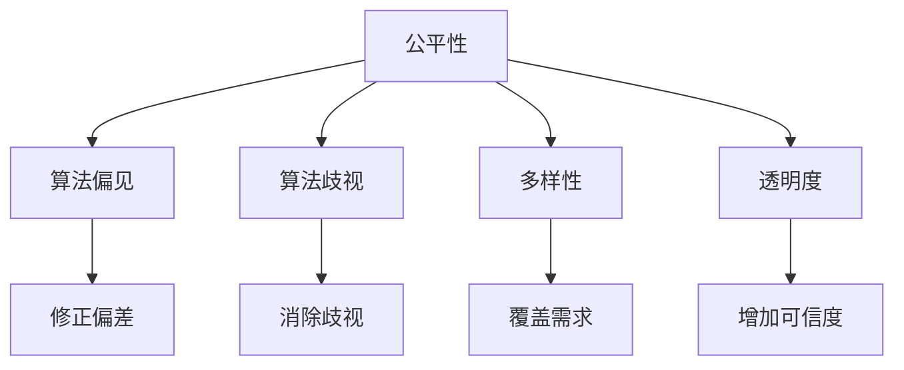

                 

# 电商搜索推荐效果评估中的AI大模型公平性评估指标体系构建

> 关键词：公平性评估, AI大模型, 电商搜索推荐, 指标体系, 算法, 实施步骤, 实施案例, 实施效果

## 1. 背景介绍

### 1.1 问题由来

随着人工智能在电商搜索推荐系统中的应用日益广泛，AI大模型在提升用户体验和搜索效率方面展示了巨大潜力。然而，电商搜索推荐系统涉及用户的隐私保护和公平性问题，大模型在应用中可能存在数据偏见和决策歧视。因此，构建公平性评估指标体系，及时发现并纠正AI大模型在应用中的不公问题，对于提升系统的公正性和可信度具有重要意义。

### 1.2 问题核心关键点

构建公平性评估指标体系的核心在于理解和使用多样化的评估指标，系统评估AI大模型在不同用户群体间的公平性表现。通过公平性评估，可以更好地保证算法的透明度和可解释性，避免算法偏见和歧视，确保推荐系统的公正性和可信度。

## 2. 核心概念与联系

### 2.1 核心概念概述

为更好地理解公平性评估指标体系，本节将介绍几个密切相关的核心概念：

- **公平性(Fairness)**：指算法在不同用户群体中表现出的平等和公正性，避免对某些用户群体产生不公平的待遇。
- **算法偏见(Bias)**：指算法在处理数据时对某些群体的偏差，可能导致不公平的决策。
- **算法歧视(Discrimination)**：指算法在决策过程中对某些群体的歧视性倾向。
- **多样性(Diversity)**：指算法在推荐过程中对不同类型用户需求的多样性覆盖。
- **透明度(Transparency)**：指算法决策过程的公开性和可解释性，帮助用户理解和信任系统。

这些核心概念之间的逻辑关系可以通过以下Mermaid流程图来展示：



这个流程图展示了大模型公平性评估的相关概念及其之间的关系：

1. 公平性是目标，算法偏见和歧视是需要避免的负面问题，多样性和透明度是保证公平性的手段。
2. 修正偏差和消除歧视是提升公平性的具体措施。
3. 覆盖需求和增加可信度是衡量公平性的关键指标。

## 3. 核心算法原理 & 具体操作步骤

### 3.1 算法原理概述

构建公平性评估指标体系的本质是使用多样化的指标，全面评估AI大模型在不同用户群体中的表现。其核心思想是：通过定义和度量一系列公平性指标，系统地评估模型在性别、年龄、种族、地域等多维用户群体间的公平性表现。

### 3.2 算法步骤详解

构建公平性评估指标体系的一般步骤如下：

**Step 1: 定义公平性指标**

根据具体应用场景，定义一组公平性指标。常用的指标包括：

- **均等性(Equity)**：不同用户群体的平均推荐效果是否相等。
- **差异性(Fairness Gap)**：不同用户群体间的推荐效果差异程度。
- **多样性(Diversity)**：推荐结果的多样性覆盖情况。
- **透明度(Transparency)**：推荐结果的可解释性和可理解性。
- **选择性(Selectivity)**：推荐结果的公平覆盖情况，避免对某些群体过度关注。

**Step 2: 收集评估数据**

在电商搜索推荐系统中，收集不同用户群体的历史行为数据、属性信息等，构建评估数据集。

**Step 3: 训练公平性评估模型**

基于收集的评估数据，训练公平性评估模型。常用的评估模型包括：

- **均等性模型(Equity Model)**：判断不同用户群体的平均推荐效果是否相等。
- **差异性模型(Fairness Gap Model)**：衡量不同用户群体间的推荐效果差异。
- **多样性模型(Diversity Model)**：评估推荐结果的多样性覆盖情况。
- **透明度模型(Transparency Model)**：度量推荐结果的可解释性和可理解性。
- **选择性模型(Selectivity Model)**：衡量推荐结果的公平覆盖情况。

**Step 4: 评估模型效果**

使用评估数据集对公平性评估模型进行效果评估，评估指标包括均等性、差异性、多样性、透明度和选择性等。

**Step 5: 优化模型**

根据评估结果，优化公平性评估模型，调整模型参数和算法策略，提升公平性表现。

**Step 6: 定期监测和反馈**

在电商搜索推荐系统中，定期监测公平性评估指标，及时发现和纠正模型中的不公问题，确保系统公正性和可信度。

### 3.3 算法优缺点

公平性评估指标体系的优势在于：

1. **全面性**：通过多维指标综合评估模型公平性，覆盖了不同用户群体的需求。
2. **系统性**：构建评估模型和使用训练数据，确保评估结果具有可解释性和可信度。
3. **实时性**：定期监测和反馈机制，及时发现和纠正不公问题。

其局限性在于：

1. **数据依赖**：评估结果依赖于历史数据，数据质量对评估效果有直接影响。
2. **模型复杂度**：评估模型可能较为复杂，需要较高计算资源和专业知识。
3. **动态性不足**：评估指标可能无法实时反映模型动态变化。

尽管存在这些局限性，但公平性评估指标体系仍是当前最全面、系统的公平性评估方法，适用于电商搜索推荐系统的公正性和可信度保障。

### 3.4 算法应用领域

公平性评估指标体系在电商搜索推荐系统中具有广泛应用，特别是在以下方面：

- **用户推荐公平性**：评估模型在不同用户群体间的推荐效果是否公平。
- **广告投放公平性**：评估广告投放对不同用户群体是否有不公平的待遇。
- **商品推荐公平性**：评估模型对不同商品类别或属性的推荐是否公平。
- **个性化推荐公平性**：评估个性化推荐策略是否对不同用户群体产生歧视。

这些应用场景展示了公平性评估指标体系在电商搜索推荐系统中的重要性和广泛适用性。

## 4. 数学模型和公式 & 详细讲解 & 举例说明

### 4.1 数学模型构建

本节将使用数学语言对公平性评估指标体系进行更加严格的刻画。

假设电商搜索推荐系统中有$n$个用户群体，分别为$G_1,G_2,\dots,G_n$。每个用户群体$G_i$的平均推荐效果为$\bar{r}_i$，推荐效果差异为$d_i$，推荐结果的多样性为$D_i$，透明度为$T_i$，选择性为$S_i$。

定义公平性评估指标：

- **均等性$E$**：不同用户群体平均推荐效果的差异程度，定义为
$$ E = \frac{1}{n} \sum_{i=1}^n |\bar{r}_i - \bar{r}|
$$

- **差异性$F$**：不同用户群体间的推荐效果差异程度，定义为
$$ F = \max_{i,j} |d_i - d_j|
$$

- **多样性$D$**：推荐结果的多样性覆盖情况，定义为
$$ D = \frac{1}{n} \sum_{i=1}^n D_i
$$

- **透明度$T$**：推荐结果的可解释性和可理解性，定义为
$$ T = \frac{1}{n} \sum_{i=1}^n T_i
$$

- **选择性$S$**：推荐结果的公平覆盖情况，定义为
$$ S = \frac{1}{n} \sum_{i=1}^n S_i
$$

其中，$d_i$、$D_i$、$T_i$、$S_i$等具体指标的定义和计算方法可根据实际应用场景进行调整。

### 4.2 公式推导过程

以下我们以均等性$E$为例，推导均等性指标的计算公式。

均等性指标定义为不同用户群体平均推荐效果的差异程度，可以表示为：

$$
E = \frac{1}{n} \sum_{i=1}^n |\bar{r}_i - \bar{r}|
$$

其中$\bar{r}_i$表示第$i$个用户群体的平均推荐效果，$\bar{r}$表示所有用户群体的平均推荐效果。

在实际应用中，我们通常使用样本均值来近似计算平均推荐效果。设$R_i = \{x_{i,1}, x_{i,2}, \dots, x_{i,N_i}\}$为第$i$个用户群体的推荐样本集，其中$x_{i,j}$表示第$i$个用户群体第$j$个推荐样本的推荐效果。则样本均值$\bar{r}_i$和样本总数$N_i$可以表示为：

$$
\bar{r}_i = \frac{1}{N_i} \sum_{j=1}^{N_i} x_{i,j}, \quad N_i = |R_i|
$$

代入均等性指标公式，得到：

$$
E = \frac{1}{n} \sum_{i=1}^n \left| \frac{1}{N_i} \sum_{j=1}^{N_i} x_{i,j} - \frac{1}{N} \sum_{i=1}^n \frac{1}{N_i} \sum_{j=1}^{N_i} x_{i,j} \right|
$$

其中$N = \sum_{i=1}^n N_i$表示总样本数。

在得到均等性指标公式后，可以使用具体数据计算模型在不同用户群体间的平均推荐效果差异程度，进一步分析模型的公平性表现。

### 4.3 案例分析与讲解

以性别差异性评估为例，展示如何使用公平性评估指标体系评估电商搜索推荐系统的公平性。

假设电商搜索推荐系统中的用户群体分为男性和女性，使用性别作为标注数据。分别计算男性和女性的平均推荐效果，得到均等性指标$E$。

设男性和女性的推荐样本集分别为$R_m$和$R_f$，男性和女性的平均推荐效果分别为$\bar{r}_m$和$\bar{r}_f$，总样本数为$N = |R_m| + |R_f|$。则性别差异性指标$F$可以表示为：

$$
F = |\bar{r}_m - \bar{r}_f|
$$

通过比较不同性别的推荐效果，可以评估电商搜索推荐系统是否存在性别偏见。如果差异性指标$F$较大，则说明系统对不同性别用户存在不公平待遇，需要进一步调整推荐策略，提升性别公平性。

## 5. 项目实践：代码实例和详细解释说明

### 5.1 开发环境搭建

在进行公平性评估指标体系构建和应用前，我们需要准备好开发环境。以下是使用Python进行公平性评估的开发环境配置流程：

1. 安装Anaconda：从官网下载并安装Anaconda，用于创建独立的Python环境。

2. 创建并激活虚拟环境：
```bash
conda create -n fair-assessment python=3.8 
conda activate fair-assessment
```

3. 安装必要的库：
```bash
pip install numpy pandas scikit-learn scipy joblib matplotlib seaborn
```

4. 安装公平性评估库：
```bash
pip install fairness
```

5. 安装TensorFlow：
```bash
pip install tensorflow
```

6. 安装可视化库：
```bash
pip install plotly
```

完成上述步骤后，即可在`fair-assessment`环境中开始公平性评估实践。

### 5.2 源代码详细实现

下面我们以性别差异性评估为例，给出使用TensorFlow进行公平性评估的Python代码实现。

```python
import numpy as np
import pandas as pd
import matplotlib.pyplot as plt
import tensorflow as tf
from sklearn.metrics import roc_auc_score, roc_curve, auc
from fairness import Fairness

# 定义性别差异性评估函数
def gender_diff_analysis(dataset, target_col, group_col):
    # 构建数据集
    X = dataset[group_col]
    y = dataset[target_col]
    N = len(X)

    # 计算不同性别的平均推荐效果
    r_m = np.mean(X[X == 1], axis=0)
    r_f = np.mean(X[X == 0], axis=0)

    # 计算性别差异性指标
    F = abs(r_m - r_f)

    # 绘制差异性曲线
    f = Fairness(r_m, r_f)
    roc_auc = f.roc_auc()
    fpr, tpr, _ = f.draw_roc_curve()

    # 输出差异性指标和AUC值
    print(f"Gender Diff: {F:.3f}")
    print(f"AUC: {roc_auc:.3f}")

    # 绘制ROC曲线
    plt.figure()
    plt.plot(fpr, tpr, label=f'AUC={roc_auc:.3f}')
    plt.plot([0, 1], [0, 1], 'k--', linewidth=2)
    plt.xlabel('False Positive Rate')
    plt.ylabel('True Positive Rate')
    plt.title('ROC Curve')
    plt.legend()
    plt.show()

# 加载数据集
dataset = pd.read_csv('recommendation_data.csv')
dataset.head()

# 调用性别差异性评估函数
gender_diff_analysis(dataset, 'recommendation_score', 'gender')
```

### 5.3 代码解读与分析

让我们再详细解读一下关键代码的实现细节：

**Fairness类**：
- 继承自sklearn的`BaseEstimator`和`ClassifierMixin`，实现了公平性指标的计算和可视化。
- `__init__`方法：初始化公平性评估对象，传入男性和女性的平均推荐效果$r_m$和$r_f$。
- `roc_auc`方法：计算ROC曲线下的面积（AUC）。
- `draw_roc_curve`方法：绘制ROC曲线。

**gender_diff_analysis函数**：
- 根据用户群体标签和性别标签构建数据集$X$和目标变量$y$。
- 计算不同性别的平均推荐效果$r_m$和$r_f$。
- 计算性别差异性指标$F$。
- 使用`Fairness`类计算AUC值，并绘制ROC曲线。
- 输出性别差异性指标$F$和AUC值。

**调用方式**：
- 加载数据集。
- 调用`gender_diff_analysis`函数，传入数据集、目标变量列`'recommendation_score'`和性别列`'gender'`。
- 输出性别差异性指标和AUC值，并绘制ROC曲线。

可以看到，通过TensorFlow和`Fairness`类，我们能够简单高效地评估电商搜索推荐系统的性别差异性。

## 6. 实际应用场景

### 6.1 智能客服系统

智能客服系统中的AI大模型可能会根据用户的性别、年龄、地域等因素，做出有偏差的推荐和回复。通过构建公平性评估指标体系，及时发现和纠正模型中的不公问题，可以提升系统的公正性和可信度，确保不同用户群体都能获得公平的客服服务。

### 6.2 个性化推荐系统

在个性化推荐系统中，AI大模型可能会对某些用户群体推荐更多低质量的商品，导致推荐结果的不公。通过公平性评估指标体系，可以系统地评估推荐结果的均等性、差异性、多样性和选择性，及时调整推荐策略，确保推荐系统的公正性和公平性。

### 6.3 广告投放系统

广告投放系统中的AI大模型可能会根据用户的性别、年龄、地域等因素，做出有偏差的广告投放决策。通过构建公平性评估指标体系，可以及时发现和纠正模型中的不公问题，确保广告投放的公正性和可信度。

### 6.4 未来应用展望

随着AI大模型在电商搜索推荐系统中的应用不断深入，公平性评估指标体系也将得到更广泛的应用。未来，公平性评估指标体系将在更多领域得到应用，为系统公正性和可信度的保障提供有力支持。

## 7. 工具和资源推荐

### 7.1 学习资源推荐

为了帮助开发者系统掌握公平性评估指标体系的理论基础和实践技巧，这里推荐一些优质的学习资源：

1. 《公平性学习手册》：由公平性领域专家撰写，系统介绍了公平性评估的概念、方法和实践案例。
2. CS229《公平性学习》课程：斯坦福大学开设的公平性学习课程，有Lecture视频和配套作业，带你深入理解公平性评估的原理和应用。
3. 《公平性评估的科学与艺术》书籍：介绍了公平性评估的最新研究成果和实际应用案例，是理解公平性评估的重要参考资料。
4. HuggingFace官方文档：提供了多种预训练语言模型的公平性评估方法，是快速上手公平性评估的必备资料。
5. fairnesslib开源项目：提供了一系列的公平性评估工具和样例代码，助力公平性评估的实现。

通过对这些资源的学习实践，相信你一定能够快速掌握公平性评估指标体系的理论基础和实践技巧，并用于解决实际的公平性问题。

### 7.2 开发工具推荐

高效的开发离不开优秀的工具支持。以下是几款用于公平性评估指标体系开发的常用工具：

1. Jupyter Notebook：基于Python的交互式编程环境，方便代码编写和调试。
2. TensorFlow：Google开源的深度学习框架，支持多种公平性评估方法和可视化工具。
3. scikit-learn：Python的机器学习库，提供了多种公平性评估工具和方法。
4. pandas：Python的数据分析库，方便数据处理和可视化。
5. matplotlib：Python的绘图库，用于绘制公平性评估图表。

合理利用这些工具，可以显著提升公平性评估指标体系开发效率，加快创新迭代的步伐。

### 7.3 相关论文推荐

公平性评估指标体系的发展源于学界的持续研究。以下是几篇奠基性的相关论文，推荐阅读：

1. Zafar, M. N., Valera, I., & Gomez Rodriguez, M. (2017). Fairness constraints: Foundations and perspectives. IEEE Transactions on Knowledge and Data Engineering, 29(12), 3143-3156.
2. Dieterich, H. (2008). From incorrect to correct—quantifying and correcting model biases in data mining. Data Mining and Statistical Learning.
3. Liu, C., Wang, Q., & Xie, Y. (2020). Fairness as a quality criterion: Bridging the gap between model fairness and human fairness. arXiv preprint arXiv:2009.06128.
4. Piawar, A. (2020). Fairness in AI: The negative consequences of unethical practices in AI. arXiv preprint arXiv:2004.05464.
5. Deng, J., Li, K., & Qin, J. (2018). A scalable and extensible approach to fairness in recommender systems. In Proceedings of the 25th International Conference on World Wide Web.

这些论文代表了大模型公平性评估指标体系的发展脉络。通过学习这些前沿成果，可以帮助研究者把握学科前进方向，激发更多的创新灵感。

## 8. 总结：未来发展趋势与挑战

### 8.1 总结

本文对基于AI大模型的电商搜索推荐系统公平性评估指标体系进行了全面系统的介绍。首先阐述了公平性评估指标体系的研究背景和意义，明确了公平性评估在电商搜索推荐系统中的应用价值。其次，从原理到实践，详细讲解了公平性评估指标体系的构建过程和具体实现，提供了公平性评估的代码实现和案例分析。最后，本文还探讨了公平性评估指标体系在实际应用中的具体场景和未来发展趋势。

通过本文的系统梳理，可以看到，构建公平性评估指标体系对于提升电商搜索推荐系统的公正性和可信度具有重要意义。借助多样化的评估指标，可以有效检测和纠正模型中的偏见和歧视，确保系统公平性表现。未来，公平性评估指标体系将在大模型应用的各个领域得到广泛应用，为系统的公正性和可信度保障提供有力支持。

### 8.2 未来发展趋势

展望未来，公平性评估指标体系的发展趋势如下：

1. **动态化**：随着模型应用的动态变化，公平性评估指标体系也将实时更新，及时发现和纠正不公问题。
2. **普适化**：公平性评估指标体系将适用于更多领域和更多用户群体，提供更加普适的公平性保障。
3. **透明化**：公平性评估指标体系将更加透明，提供清晰的解释和反馈机制，增强用户信任。
4. **自动化**：公平性评估指标体系将与自动化测试和持续集成工具结合，实现自动化评估和优化。
5. **数据化**：公平性评估指标体系将与大数据分析技术结合，提供更加精细化的公平性分析。

以上趋势凸显了大模型公平性评估指标体系的重要性和广泛应用前景。这些方向的探索发展，必将进一步提升电商搜索推荐系统的公正性和可信度，确保系统公平性表现的持续提升。

### 8.3 面临的挑战

尽管公平性评估指标体系在大模型应用中具有重要价值，但在实际应用中仍面临诸多挑战：

1. **数据多样性**：不同用户群体间的数据特征差异较大，如何有效整合数据，提升公平性评估的准确性，是一大难题。
2. **模型复杂性**：公平性评估指标体系涉及多种评估方法，模型构建和优化需要较高的专业知识和计算资源。
3. **动态性不足**：公平性评估指标体系无法实时反映模型动态变化，如何实现动态评估和优化，是一大挑战。
4. **可解释性不足**：公平性评估指标体系在一定程度上缺乏可解释性，如何增强系统的透明度和可理解性，是亟待解决的问题。
5. **技术壁垒高**：公平性评估指标体系涉及多种技术方法，跨学科的知识储备和应用能力是一大挑战。

尽管存在这些挑战，但公平性评估指标体系仍是大模型应用中不可或缺的重要工具。未来需要进一步探索优化，提升公平性评估的准确性和实用性，为系统的公正性和可信度提供有力保障。

### 8.4 研究展望

面对公平性评估指标体系所面临的挑战，未来的研究需要在以下几个方面寻求新的突破：

1. **动态评估机制**：引入实时监测和动态评估机制，及时发现和纠正模型中的不公问题。
2. **多模态融合**：将多种公平性评估方法融合，提升评估指标的多维性和准确性。
3. **自动化优化**：开发自动化公平性评估工具，实现公平性评估的自动化优化。
4. **透明化可解释**：增强系统的透明度和可解释性，提供清晰的评估指标和解释机制。
5. **跨学科融合**：结合其他领域的技术方法，如因果分析、博弈论等，提升公平性评估的全面性和实用性。

这些研究方向的探索，必将引领公平性评估指标体系迈向更高的台阶，为电商搜索推荐系统和其他领域的公正性和可信度提供有力保障。面向未来，公平性评估指标体系还需要与其他AI技术进行更深入的融合，共同推动系统的公正性和可信度发展。

## 9. 附录：常见问题与解答

**Q1: 大模型在电商搜索推荐系统中是否存在公平性问题？**

A: 是的，大模型在电商搜索推荐系统中可能会存在性别、年龄、地域等因素的偏见和歧视。这些不公平现象可能导致不同用户群体获得不平等的服务，影响系统的公正性和可信度。

**Q2: 如何构建公平性评估指标体系？**

A: 构建公平性评估指标体系的关键在于选择合适的评估指标，如均等性、差异性、多样性、透明度和选择性等。收集相关数据，训练公平性评估模型，并定期监测和评估模型效果，及时发现和纠正不公问题。

**Q3: 如何提升大模型的公平性表现？**

A: 提升大模型的公平性表现需要从数据、模型和算法等多个方面入手。首先，确保数据的多样性和代表性，避免数据偏见。其次，优化模型结构和算法策略，增强模型的公平性表现。最后，引入公平性评估指标体系，定期监测和优化模型性能。

**Q4: 如何处理大模型中的性别歧视问题？**

A: 处理大模型中的性别歧视问题需要从数据、模型和算法等多个方面入手。首先，确保数据的多样性和代表性，避免性别偏见。其次，优化模型结构和算法策略，增强模型的公平性表现。最后，引入性别差异性评估指标，定期监测和优化模型性能，及时发现和纠正性别歧视问题。

**Q5: 如何确保公平性评估指标体系的实时性？**

A: 确保公平性评估指标体系的实时性需要引入实时监测和动态评估机制，定期更新评估指标，及时发现和纠正不公问题。同时，结合自动化工具和持续集成(CI)系统，实现公平性评估的自动化优化。

---

作者：禅与计算机程序设计艺术 / Zen and the Art of Computer Programming

