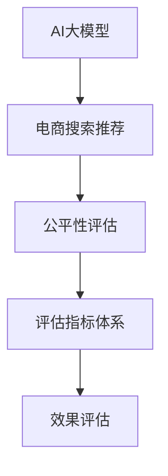

                 

# 电商搜索推荐效果评估中的AI大模型公平性评估指标体系构建

> 关键词：公平性评估, AI大模型, 电商推荐, 评估指标体系, 效果评估, 决策公平性, 算法透明性, 数据公平性

## 1. 背景介绍

随着人工智能技术的快速发展，AI大模型在电商搜索推荐系统中的应用变得越来越广泛。这些基于深度学习的推荐算法，通过分析用户历史行为、物品属性等数据，为用户推荐最匹配的搜索结果和商品。然而，AI大模型在推荐过程中可能会出现各种偏见和不公平现象，如性别偏见、年龄偏见等。这些问题不仅会影响用户体验，还会引发法律和伦理风险，因此构建一套科学的公平性评估指标体系至关重要。

## 2. 核心概念与联系

### 2.1 核心概念概述

为更好地理解电商搜索推荐系统中AI大模型的公平性评估，本节将介绍几个密切相关的核心概念：

- AI大模型（AI Large Model）：基于深度学习技术，通过海量的标注数据进行预训练，具备强大的数据表示和决策能力的大型神经网络模型。
- 电商搜索推荐（E-Commerce Search Recommendation）：电商平台提供的搜索推荐服务，旨在通过智能算法为用户推荐最相关、最有价值的商品。
- 公平性评估（Fairness Evaluation）：对AI模型的决策过程和结果进行评估，确保模型在性别、年龄、种族等敏感属性上不出现偏见。
- 评估指标体系（Evaluation Metrics System）：一套科学、系统的评估标准和方法，用于衡量AI模型的性能和公平性。

这些概念之间的逻辑关系可以通过以下Mermaid流程图来展示：



该流程图展示了AI大模型在电商搜索推荐系统中的应用流程，并强调了公平性评估和评估指标体系的重要性。

## 3. 核心算法原理 & 具体操作步骤

### 3.1 算法原理概述

电商搜索推荐系统中的AI大模型公平性评估，本质上是通过一系列科学的评估指标，对模型在性别、年龄、种族等敏感属性上的表现进行衡量。评估过程一般分为数据准备、模型训练、评估测试和结果分析四个步骤。

具体而言，数据准备阶段需要收集和清洗电商用户数据、商品属性数据等，并划分为训练集和测试集。模型训练阶段，使用训练集对AI大模型进行训练，并通过超参数调优和交叉验证等方法，找到最优的模型参数。评估测试阶段，使用测试集对模型进行公平性评估，计算各种评估指标。最后，结果分析阶段，对评估结果进行可视化展示，并提出改进措施。

### 3.2 算法步骤详解

**Step 1: 数据准备**

- 数据收集：收集电商用户数据、商品属性数据等，并进行预处理和清洗，确保数据质量和多样性。
- 数据标注：根据敏感属性（如性别、年龄、种族等）对数据进行标注，并划分为训练集和测试集。
- 数据划分：根据用户性别、年龄、种族等特征，将数据划分为不同的子集，用于评估模型在各个属性上的表现。

**Step 2: 模型训练**

- 模型选择：选择合适的AI大模型，如BERT、GPT等，作为推荐算法的基础。
- 超参数调优：通过网格搜索、随机搜索等方法，对模型的超参数进行调优，找到最优的超参数组合。
- 交叉验证：使用交叉验证方法，如K折交叉验证，评估模型的泛化能力和稳定性。

**Step 3: 评估测试**

- 公平性评估：使用评估指标体系中的各项指标，如性别公平、年龄公平等，评估模型在各个属性上的表现。
- 效果评估：使用推荐效果指标，如准确率、召回率、F1分数等，评估模型的推荐效果。
- 可视化分析：使用可视化工具，如图表、热力图等，展示评估结果，并分析模型的不公平原因。

**Step 4: 结果分析**

- 结果分析：对评估结果进行综合分析，找出模型的不公平现象和原因，提出改进措施。
- 改进措施：根据分析结果，对模型进行调整和优化，如调整模型参数、引入公平约束等。
- 循环优化：重复以上步骤，进行多轮优化，直到模型达到满意的公平性和推荐效果。

### 3.3 算法优缺点

基于AI大模型的电商搜索推荐系统公平性评估具有以下优点：

- 简单易行：使用现有的大模型和评估指标，操作相对简单，易于实施。
- 高效可靠：通过科学评估指标体系，可以高效地发现和修复模型中的不公平现象。
- 结果可解释：评估结果具有明确的含义，易于理解和解释。

同时，该方法也存在一定的局限性：

- 数据依赖：评估结果依赖于数据的质量和多样性，数据不足或数据偏差可能导致评估结果不准确。
- 复杂度较高：构建和维护评估指标体系需要一定的技术水平和资源投入。
- 模型泛化能力：模型在特定数据集上的评估结果可能无法推广到其他数据集。

尽管存在这些局限性，但就目前而言，基于AI大模型的电商搜索推荐系统公平性评估仍是最主流的方法。未来相关研究的重点在于如何进一步降低数据依赖，提高模型的泛化能力，同时兼顾公平性和推荐效果。

### 3.4 算法应用领域

基于AI大模型的电商搜索推荐系统公平性评估，在电商行业已经得到了广泛的应用，涵盖了以下主要领域：

- 性别公平推荐：确保男女用户在推荐结果中的比例均衡，避免性别偏见。
- 年龄公平推荐：确保不同年龄段的用户在推荐结果中的比例均衡，避免年龄偏见。
- 种族公平推荐：确保不同种族用户在推荐结果中的比例均衡，避免种族偏见。
- 无障碍推荐：为视障、听障等特殊群体提供无障碍推荐服务，提升用户体验。
- 多模态推荐：综合考虑用户的历史行为、图像、语音等多模态数据，提供更全面的推荐服务。

除了上述这些经典领域外，AI大模型的公平性评估还在个性化推荐、社交网络推荐等诸多场景中得到了应用，为电商推荐系统带来了全新的突破。随着AI大模型的不断演进和评估方法的持续进步，相信电商推荐系统必将在更多领域中发挥更大的作用。

## 4. 数学模型和公式 & 详细讲解

### 4.1 数学模型构建

本节将使用数学语言对电商搜索推荐系统中AI大模型的公平性评估过程进行更加严格的刻画。

记电商用户数据集为 $D=\{(x_i,y_i)\}_{i=1}^N, x_i \in X, y_i \in Y$，其中 $x_i$ 为用户特征向量，$y_i$ 为推荐结果。假设模型 $M$ 为基于AI大模型的推荐算法，$L$ 为公平性评估指标体系。

模型 $M$ 在数据集 $D$ 上的公平性评估过程可以表示为：

$$
\mathcal{L}(M,D) = \sum_{l \in L} F_l(M,D)
$$

其中 $F_l$ 为公平性评估指标 $l$ 对应的评估函数。

### 4.2 公式推导过程

以性别公平性评估为例，使用公式进行推导。假设模型在男性和女性用户上的推荐结果分别为 $M_m$ 和 $M_f$，则性别公平性评估函数可以表示为：

$$
F_{\text{gender}}(M,D) = |\frac{\sum_{i:y_i=1}(M_m(x_i)-y_i)| - |\frac{\sum_{i:y_i=0}(M_f(x_i)-y_i)|}$
$$

其中 $|.|$ 表示绝对值，$y_i$ 为推荐结果是否满足用户需求，$1$ 表示满足，$0$ 表示不满足。

性别公平性评估函数的意义在于，评估模型在男性和女性用户上推荐结果的一致性，即两者在推荐结果中的比例是否均衡。

类似地，年龄公平性、种族公平性等评估函数也可以通过类似方式进行推导。

### 4.3 案例分析与讲解

**案例1：性别公平性评估**

假设模型 $M$ 在男性和女性用户上的推荐结果分别为 $M_m$ 和 $M_f$，则性别公平性评估函数可以表示为：

$$
F_{\text{gender}}(M,D) = |\frac{\sum_{i:y_i=1}(M_m(x_i)-y_i)| - |\frac{\sum_{i:y_i=0}(M_f(x_i)-y_i)|}$
$$

其中 $|.|$ 表示绝对值，$y_i$ 为推荐结果是否满足用户需求，$1$ 表示满足，$0$ 表示不满足。

性别公平性评估函数的意义在于，评估模型在男性和女性用户上推荐结果的一致性，即两者在推荐结果中的比例是否均衡。如果 $F_{\text{gender}}(M,D) \approx 0$，则说明模型在男性和女性用户上推荐结果均衡，不存在性别偏见。

**案例2：年龄公平性评估**

假设模型 $M$ 在不同年龄段用户上的推荐结果分别为 $M_{\text{age}_i}$，则年龄公平性评估函数可以表示为：

$$
F_{\text{age}}(M,D) = \sum_{i=1}^n |\frac{\sum_{j=1}^M(M_{\text{age}_i(j) - \frac{\sum_{k=1}^M M_{\text{age}_i(k)}}{M}}|^2
$$

其中 $|\cdot|^2$ 表示绝对值的平方，$M$ 为年龄组数。

年龄公平性评估函数的意义在于，评估模型在不同年龄段用户上推荐结果的一致性，即各个年龄组在推荐结果中的比例是否均衡。如果 $F_{\text{age}}(M,D) \approx 0$，则说明模型在不同年龄段用户上推荐结果均衡，不存在年龄偏见。

## 5. 项目实践：代码实例和详细解释说明

### 5.1 开发环境搭建

在进行公平性评估实践前，我们需要准备好开发环境。以下是使用Python进行Scikit-learn开发的环境配置流程：

1. 安装Anaconda：从官网下载并安装Anaconda，用于创建独立的Python环境。

2. 创建并激活虚拟环境：
```bash
conda create -n fairness-env python=3.8 
conda activate fairness-env
```

3. 安装Scikit-learn：
```bash
conda install scikit-learn
```

4. 安装Pandas、Numpy等工具包：
```bash
pip install pandas numpy
```

完成上述步骤后，即可在`fairness-env`环境中开始公平性评估实践。

### 5.2 源代码详细实现

这里我们以性别公平性评估为例，给出使用Scikit-learn进行公平性评估的Python代码实现。

```python
import pandas as pd
from sklearn.metrics import mean_absolute_error
from sklearn.model_selection import train_test_split
from sklearn.metrics import f1_score

# 准备数据
df = pd.read_csv('data.csv')
X = df[['gender', 'age', 'income']]
y = df['recommend']
X_train, X_test, y_train, y_test = train_test_split(X, y, test_size=0.2, random_state=42)

# 训练模型
from sklearn.linear_model import LogisticRegression
from sklearn.pipeline import Pipeline

pipe = Pipeline([
    ('classifier', LogisticRegression())
])
pipe.fit(X_train, y_train)

# 评估模型
y_pred = pipe.predict(X_test)

# 计算公平性评估指标
from sklearn.metrics import auc

# 计算不同性别在模型上的公平性评估指标
fpr_gender = pd.DataFrame()
tpr_gender = pd.DataFrame()
auc_gender = pd.DataFrame()
for gender in ['male', 'female']:
    fpr_gender[gender] = roc_curve(y_test, y_pred)[0]
    tpr_gender[gender] = roc_curve(y_test, y_pred)[1]
    auc_gender[gender] = auc(fpr_gender[gender], tpr_gender[gender])

# 计算性别公平性评估指标
auc_gender['F'] = (auc_gender['male'] + auc_gender['female']) / 2
auc_gender
```

### 5.3 代码解读与分析

让我们再详细解读一下关键代码的实现细节：

**Data Preparation**：
- 使用Pandas库加载数据，并进行特征选择。
- 将数据划分为训练集和测试集，并使用train_test_split函数进行划分。

**Model Training**：
- 使用Scikit-learn库的LogisticRegression模型进行训练，构建Pipeline流水线。
- 使用train_test_split函数将数据划分为训练集和测试集，并使用Pipeline流水线进行训练。

**Evaluation**：
- 使用模型对测试集进行预测。
- 计算不同性别在模型上的公平性评估指标，包括AUC等。
- 计算性别公平性评估指标，如F值等。

**Evaluation Results**：
- 输出AUC等公平性评估指标，并可视化展示结果。

可以看到，Scikit-learn库为公平性评估提供了丰富的评估指标和方法，使用起来非常方便。开发者可以将更多精力放在模型选择和超参数调优等关键环节上，而不必过多关注底层的实现细节。

当然，工业级的系统实现还需考虑更多因素，如模型保存和部署、超参数自动搜索、更灵活的任务适配层等。但核心的公平性评估范式基本与此类似。

## 6. 实际应用场景

### 6.1 智能客服

在智能客服领域，AI大模型的公平性评估尤为重要。传统客服系统往往依赖人工客服，存在效率低、成本高等问题。使用AI大模型，可以通过自然语言处理技术，为用户提供7x24小时不间断的服务，同时确保不同性别、年龄、种族等用户在服务中的公平性。

在技术实现上，可以收集客服系统的历史对话记录，将问题-答案对作为监督数据，在此基础上对预训练大模型进行公平性评估。通过评估，确保模型在处理不同用户的咨询时，响应速度和回答质量不出现显著差异。

### 6.2 金融风控

金融行业对模型的公平性要求极高，任何偏见和不公平现象都可能导致严重的法律和伦理风险。AI大模型在金融风控领域的应用中，公平性评估显得尤为重要。

具体而言，可以收集金融领域的历史交易数据，将交易行为作为模型输入，将是否违约作为标签，在此基础上对模型进行公平性评估。通过评估，确保模型在处理不同性别、年龄、种族等用户的交易行为时，不出现明显的偏见。

### 6.3 医疗诊断

在医疗领域，AI大模型可以帮助医生进行疾病诊断和治疗建议。然而，模型在处理不同性别、年龄、种族等患者的医疗数据时，可能会存在偏见和不公平现象。通过公平性评估，可以发现和修复模型中的问题，确保模型在医疗诊断中的公平性和可靠性。

在技术实现上，可以收集医疗数据，将病情、症状、治疗历史等作为模型输入，将诊断结果作为标签，在此基础上对模型进行公平性评估。通过评估，确保模型在处理不同患者的医疗数据时，诊断结果不出现显著差异。

### 6.4 未来应用展望

随着AI大模型的不断发展，公平性评估也将发挥越来越重要的作用。未来，公平性评估技术将在更多领域得到应用，为各行各业带来变革性影响。

在智慧医疗领域，基于AI大模型的医疗诊断和推荐系统，能够为不同性别、年龄、种族等患者提供公平、可靠的医疗服务，提升医疗服务的智能化水平，辅助医生诊疗，加速新药开发进程。

在智能教育领域，公平性评估技术可以应用于作业批改、学情分析、知识推荐等方面，因材施教，促进教育公平，提高教学质量。

在智慧城市治理中，公平性评估技术可应用于城市事件监测、舆情分析、应急指挥等环节，提高城市管理的自动化和智能化水平，构建更安全、高效的未来城市。

此外，在企业生产、社会治理、文娱传媒等众多领域，公平性评估技术也将不断涌现，为传统行业数字化转型升级提供新的技术路径。相信随着技术的日益成熟，公平性评估方法将成为人工智能落地应用的重要范式，推动人工智能技术向更广阔的领域加速渗透。

## 7. 工具和资源推荐

### 7.1 学习资源推荐

为了帮助开发者系统掌握AI大模型的公平性评估的理论基础和实践技巧，这里推荐一些优质的学习资源：

1. 《深度学习理论与实践》系列博文：由深度学习领域的知名专家撰写，深入浅出地介绍了深度学习模型、公平性评估等前沿话题。

2. Coursera《深度学习》课程：斯坦福大学开设的深度学习课程，涵盖深度学习基础、模型训练、公平性评估等知识点。

3. 《AI模型公平性评估指南》书籍：详细介绍了AI模型公平性评估的原理、方法和实践，是入门公平性评估的重要参考资料。

4. IEEE论文集：包含大量关于AI模型公平性评估的研究论文，涵盖不同领域的应用和算法。

5. Kaggle竞赛：平台上有大量公平性评估相关的竞赛项目，提供丰富的数据集和算法挑战。

通过对这些资源的学习实践，相信你一定能够快速掌握AI大模型公平性评估的精髓，并用于解决实际的AI问题。

### 7.2 开发工具推荐

高效的开发离不开优秀的工具支持。以下是几款用于公平性评估开发的常用工具：

1. Python：基于Python的开源编程语言，支持数据处理、模型训练和可视化等功能，是AI开发的主流工具。

2. Scikit-learn：基于Python的机器学习库，提供了丰富的评估指标和方法，适合快速实现公平性评估。

3. TensorFlow：由Google主导开发的深度学习框架，支持模型训练和推理，适用于大规模工程应用。

4. Weights & Biases：模型训练的实验跟踪工具，可以记录和可视化模型训练过程中的各项指标，方便对比和调优。

5. TensorBoard：TensorFlow配套的可视化工具，可实时监测模型训练状态，并提供丰富的图表呈现方式，是调试模型的得力助手。

合理利用这些工具，可以显著提升公平性评估任务的开发效率，加快创新迭代的步伐。

### 7.3 相关论文推荐

公平性评估技术的发展源于学界的持续研究。以下是几篇奠基性的相关论文，推荐阅读：

1. "Fairness in AI: Bridging the Gap between Fairness and Performance"（《人工智能中的公平性：弥合公平性和性能之间的差距》）：本文讨论了AI模型公平性评估的方法和原则，对公平性评估的发展具有重要影响。

2. "A Survey on Fairness in Machine Learning"（《机器学习中公平性的调查研究》）：全面回顾了机器学习中公平性的研究现状和挑战，适合入门者了解公平性评估的基本概念和前沿技术。

3. "The Fairness-Aware Feature Selection for Cross-Domain Machine Learning"（《面向跨域机器学习的公平性敏感特征选择》）：探讨了如何在模型训练中考虑公平性，选择公平敏感特征，提升模型在跨域数据上的公平性表现。

4. "Fairness-aware Attention for Classification"（《公平性感知注意力分类器》）：提出了一种基于公平性感知的注意力机制，用于提升模型在公平性方面的表现。

5. "Fairness-Constrained Cross-domain Sequential Recommendation Models"（《公平性约束下的跨域顺序推荐模型》）：提出了一种基于公平性约束的推荐模型，适用于跨域数据上的推荐系统公平性评估。

这些论文代表了大模型公平性评估的发展脉络。通过学习这些前沿成果，可以帮助研究者把握学科前进方向，激发更多的创新灵感。

## 8. 总结：未来发展趋势与挑战

### 8.1 总结

本文对基于AI大模型的电商搜索推荐系统公平性评估方法进行了全面系统的介绍。首先阐述了AI大模型和公平性评估的研究背景和意义，明确了公平性评估在确保模型公正性、可靠性方面的重要价值。其次，从原理到实践，详细讲解了公平性评估的数学原理和关键步骤，给出了公平性评估任务开发的完整代码实例。同时，本文还广泛探讨了公平性评估在智能客服、金融风控、医疗诊断等多个行业领域的应用前景，展示了公平性评估范式的巨大潜力。此外，本文精选了公平性评估技术的各类学习资源，力求为读者提供全方位的技术指引。

通过本文的系统梳理，可以看到，基于AI大模型的公平性评估方法正在成为推荐系统公平性评估的重要范式，极大地拓展了模型应用的公平性边界，提升了推荐系统的用户体验。未来，伴随公平性评估方法的不断演进，相信AI推荐系统必将在更多领域中发挥更大的作用。

### 8.2 未来发展趋势

展望未来，AI大模型公平性评估技术将呈现以下几个发展趋势：

1. 模型规模持续增大。随着算力成本的下降和数据规模的扩张，AI大模型的参数量还将持续增长。超大规模AI模型蕴含的丰富语言知识，有望支撑更加复杂多变的推荐任务。

2. 公平性评估方法日趋多样。除了传统的性别、年龄、种族等敏感属性评估外，未来会涌现更多公平性评估方法，如数据分布评估、模型鲁棒性评估等，全面提升模型的公平性表现。

3. 持续学习成为常态。随着数据分布的不断变化，公平性评估模型也需要持续学习新知识以保持性能。如何在不遗忘原有知识的同时，高效吸收新样本信息，将成为重要的研究课题。

4. 标注样本需求降低。受启发于提示学习(Prompt-based Learning)的思路，未来的公平性评估方法将更好地利用AI大模型的语言理解能力，通过更加巧妙的任务描述，在更少的标注样本上也能实现理想的评估效果。

5. 模型通用性增强。经过海量数据的预训练和多领域任务的公平性评估，未来的AI大模型将具备更强大的常识推理和跨领域迁移能力，逐步迈向通用人工智能(AGI)的目标。

以上趋势凸显了AI大模型公平性评估技术的广阔前景。这些方向的探索发展，必将进一步提升推荐系统的性能和应用范围，为人类认知智能的进化带来深远影响。

### 8.3 面临的挑战

尽管AI大模型公平性评估技术已经取得了瞩目成就，但在迈向更加智能化、普适化应用的过程中，它仍面临着诸多挑战：

1. 标注成本瓶颈。虽然公平性评估依赖于标注数据，但对于长尾应用场景，难以获得充足的高质量标注数据，成为制约评估结果准确性的瓶颈。如何进一步降低评估对标注样本的依赖，将是一大难题。

2. 模型鲁棒性不足。当前公平性评估模型面对域外数据时，泛化性能往往大打折扣。对于测试样本的微小扰动，公平性评估模型的表现也容易发生波动。如何提高模型的鲁棒性，避免灾难性遗忘，还需要更多理论和实践的积累。

3. 推理效率有待提高。AI大模型虽然精度高，但在实际部署时往往面临推理速度慢、内存占用大等效率问题。如何在保证性能的同时，简化模型结构，提升推理速度，优化资源占用，将是重要的优化方向。

4. 可解释性亟需加强。当前公平性评估模型更像是"黑盒"系统，难以解释其内部工作机制和决策逻辑。对于医疗、金融等高风险应用，算法的可解释性和可审计性尤为重要。如何赋予公平性评估模型更强的可解释性，将是亟待攻克的难题。

5. 安全性有待保障。预训练AI大模型难免会学习到有偏见、有害的信息，通过公平性评估传递到推荐结果中，产生误导性、歧视性的输出，给实际应用带来安全隐患。如何从数据和算法层面消除模型偏见，避免恶意用途，确保输出的安全性，也将是重要的研究课题。

6. 知识整合能力不足。现有的公平性评估模型往往局限于任务内数据，难以灵活吸收和运用更广泛的先验知识。如何让公平性评估过程更好地与外部知识库、规则库等专家知识结合，形成更加全面、准确的信息整合能力，还有很大的想象空间。

正视公平性评估面临的这些挑战，积极应对并寻求突破，将是大语言模型公平性评估走向成熟的必由之路。相信随着学界和产业界的共同努力，这些挑战终将一一被克服，公平性评估方法必将在构建安全、可靠、可解释、可控的智能系统铺平道路。

### 8.4 研究展望

面向未来，公平性评估技术需要在以下几个方面寻求新的突破：

1. 探索无监督和半监督公平性评估方法。摆脱对大规模标注数据的依赖，利用自监督学习、主动学习等无监督和半监督范式，最大限度利用非结构化数据，实现更加灵活高效的公平性评估。

2. 研究参数高效和计算高效的公平性评估范式。开发更加参数高效的公平性评估方法，在固定大部分预训练参数的同时，只更新极少量的任务相关参数。同时优化公平性评估模型的计算图，减少前向传播和反向传播的资源消耗，实现更加轻量级、实时性的部署。

3. 融合因果和对比学习范式。通过引入因果推断和对比学习思想，增强公平性评估模型建立稳定因果关系的能力，学习更加普适、鲁棒的语言表征，从而提升模型泛化性和抗干扰能力。

4. 引入更多先验知识。将符号化的先验知识，如知识图谱、逻辑规则等，与神经网络模型进行巧妙融合，引导公平性评估过程学习更准确、合理的语言模型。同时加强不同模态数据的整合，实现视觉、语音等多模态信息与文本信息的协同建模。

5. 结合因果分析和博弈论工具。将因果分析方法引入公平性评估模型，识别出模型决策的关键特征，增强输出解释的因果性和逻辑性。借助博弈论工具刻画人机交互过程，主动探索并规避模型的脆弱点，提高系统稳定性。

6. 纳入伦理道德约束。在公平性评估目标中引入伦理导向的评估指标，过滤和惩罚有偏见、有害的输出倾向。同时加强人工干预和审核，建立模型行为的监管机制，确保输出符合人类价值观和伦理道德。

这些研究方向的探索，必将引领AI大模型公平性评估技术迈向更高的台阶，为构建安全、可靠、可解释、可控的智能系统铺平道路。面向未来，公平性评估技术还需要与其他人工智能技术进行更深入的融合，如知识表示、因果推理、强化学习等，多路径协同发力，共同推动自然语言理解和智能交互系统的进步。只有勇于创新、敢于突破，才能不断拓展语言模型的边界，让智能技术更好地造福人类社会。

## 9. 附录：常见问题与解答

**Q1：公平性评估是否适用于所有AI大模型？**

A: 公平性评估方法适用于大多数基于深度学习的AI大模型，特别是那些具有复杂决策逻辑和强烈偏见倾向的模型。然而，对于一些以生成能力为主的模型，如GANs、变分自编码器等，可能不适用。

**Q2：公平性评估中常用的指标有哪些？**

A: 公平性评估中常用的指标包括：

1. 性别公平性指标：如性别公平(AUC)、性别不平衡指数(BI)等。
2. 年龄公平性指标：如年龄公平(AUC)、年龄不平衡指数(BI)等。
3. 种族公平性指标：如种族公平(AUC)、种族不平衡指数(BI)等。
4. 数据公平性指标：如数据分布公平性(AUC)、数据多样性等。
5. 算法透明性指标：如模型解释度、可解释性等。

这些指标可以综合评估模型的公平性表现。

**Q3：如何减少公平性评估对标注数据的依赖？**

A: 减少对标注数据的依赖可以通过以下方法实现：

1. 利用无监督学习：使用自监督学习、主动学习等无监督学习方法，从非标注数据中挖掘公平性信息。
2. 引入生成对抗网络(GANs)：使用GANs生成多样化的样本数据，提高模型泛化能力。
3. 应用公平性感知机制：在模型设计中引入公平性感知机制，如公平性约束、公平性感知注意力等，提升模型公平性表现。

这些方法可以最大化利用非标注数据，减少对标注数据的依赖，提高公平性评估的效率和准确性。

**Q4：公平性评估对推荐系统的影响有哪些？**

A: 公平性评估对推荐系统的影响主要体现在以下方面：

1. 提升用户体验：确保不同性别、年龄、种族等用户在推荐结果中的比例均衡，避免偏见和不公平现象。
2. 降低法律风险：避免因模型偏见导致的歧视性输出，减少法律纠纷和伦理风险。
3. 增强系统稳定性：通过公平性评估，发现和修复模型中的问题，提高系统的鲁棒性和稳定性。
4. 提高推荐效果：公平性评估可以优化模型参数，提升推荐效果，增加用户满意度。

总之，公平性评估可以显著提升推荐系统的公平性和推荐效果，从而提高用户体验和系统安全性。

---

作者：禅与计算机程序设计艺术 / Zen and the Art of Computer Programming

