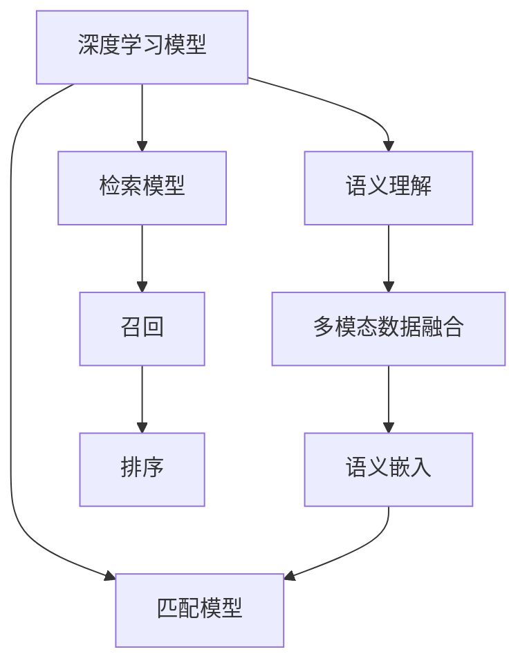

                 

# 电商搜索的跨模态语义匹配：AI大模型的新突破

> 关键词：跨模态语义匹配,电商搜索,AI大模型,深度学习,多模态信息融合,自然语言处理,NLP,计算机视觉,CV,推荐系统

## 1. 背景介绍

随着人工智能技术的迅猛发展，电商搜索已经从传统的文本关键词匹配，发展为跨模态语义匹配的新时代。跨模态语义匹配不仅能够理解商品图片、描述、评价等多模态数据的内在含义，还能在语义层面实现对不同模态数据的深度融合。这一技术的突破，将显著提升电商搜索的准确性和用户体验，成为未来电商搜索技术发展的关键方向。

### 1.1 问题由来

电商搜索系统的主要功能是通过用户输入的查询词，匹配相关商品并返回搜索结果。传统搜索系统主要依赖关键词匹配，但这种模式存在诸多局限：

- **单模态局限**：仅依赖文本关键词，无法充分理解商品的多维度特征。
- **匹配精度不足**：关键词匹配往往受限于词汇表，无法捕捉语义的细微差别。
- **用户体验欠佳**：搜索结果列表缺乏多样性，无法满足用户的个性化需求。

为了突破这些局限，电商搜索技术开始向跨模态语义匹配转型。通过整合商品图片、描述、评价等多模态数据，利用深度学习模型理解语义，能够提供更为精准、全面的搜索结果。近年来，AI大模型在这一领域取得了显著进展，成为驱动电商搜索技术发展的重要力量。

### 1.2 问题核心关键点

跨模态语义匹配的核心在于多模态数据的语义理解和匹配。具体而言，包括以下几个关键点：

1. **语义理解**：通过深度学习模型理解不同模态数据的语义，建立跨模态语义表示。
2. **多模态融合**：将不同模态的语义表示进行融合，形成统一的语义表示。
3. **语义匹配**：利用匹配模型找到与用户查询最为匹配的商品，满足个性化需求。
4. **深度学习模型**：使用深度学习模型进行跨模态语义匹配，提升匹配精度和效率。

## 2. 核心概念与联系

### 2.1 核心概念概述

为了更好地理解跨模态语义匹配技术，本节将介绍几个关键概念：

- **跨模态语义匹配**：将不同模态的语义信息进行融合，形成统一的语义表示，从而在语义层面实现匹配。
- **AI大模型**：指基于深度学习架构、参数量庞大的模型，如BERT、GPT-3等，具有强大的语义理解和生成能力。
- **深度学习模型**：使用多层神经网络进行特征提取和语义表示学习。
- **多模态数据融合**：将不同模态的数据进行融合，形成统一的语义表示。
- **语义嵌入**：将不同模态的语义表示映射到低维向量空间，便于匹配和比较。

这些概念之间存在紧密的联系，通过深度学习模型实现语义理解，通过多模态数据融合实现语义匹配，最终形成跨模态语义匹配的技术体系。

### 2.2 核心概念原理和架构的 Mermaid 流程图



该流程图展示了跨模态语义匹配的核心流程：

1. 通过深度学习模型进行语义理解。
2. 将不同模态的语义表示进行融合，形成统一的语义嵌入。
3. 利用匹配模型找到与查询最匹配的商品。
4. 使用检索模型对商品进行召回。
5. 对召回的商品进行排序，提供最佳搜索结果。

## 3. 核心算法原理 & 具体操作步骤

### 3.1 算法原理概述

跨模态语义匹配的本质是通过深度学习模型理解多模态数据的内在语义，建立统一的语义表示，并在语义层面实现匹配。其核心算法包括语义理解、多模态数据融合、语义匹配和深度学习模型。

- **语义理解**：通过深度学习模型理解不同模态数据的语义，建立跨模态语义表示。
- **多模态数据融合**：将不同模态的语义表示进行融合，形成统一的语义表示。
- **语义匹配**：利用匹配模型找到与用户查询最为匹配的商品。
- **深度学习模型**：使用深度学习模型进行跨模态语义匹配，提升匹配精度和效率。

### 3.2 算法步骤详解

以下将详细介绍跨模态语义匹配的具体操作步骤：

**Step 1: 数据预处理**
- 对商品图片、描述、评价等多模态数据进行清洗、标注、归一化等预处理。
- 将文本数据转化为token序列，进行分词、截断、padding等处理。
- 对图片数据进行归一化、降维等处理，提取特征向量。

**Step 2: 构建深度学习模型**
- 选择合适的深度学习模型，如BERT、GPT-3、ResNet等。
- 构建语义理解模型，利用深度学习模型理解不同模态数据的语义。
- 构建多模态融合模型，将不同模态的语义表示进行融合。
- 构建匹配模型，利用匹配模型找到与查询最匹配的商品。
- 构建检索模型，使用检索模型对商品进行召回。

**Step 3: 训练深度学习模型**
- 准备训练集和验证集，划分为训练集、验证集和测试集。
- 使用深度学习框架（如TensorFlow、PyTorch等）进行模型训练。
- 根据损失函数（如交叉熵、均方误差等）计算模型误差，调整模型参数。
- 在验证集上评估模型性能，避免过拟合。
- 在测试集上评估最终模型性能。

**Step 4: 跨模态语义匹配**
- 输入用户查询，通过深度学习模型进行语义理解。
- 利用多模态融合模型将不同模态的语义表示进行融合。
- 利用匹配模型找到与查询最匹配的商品。
- 使用检索模型对商品进行召回。
- 对召回的商品进行排序，提供最佳搜索结果。

### 3.3 算法优缺点

跨模态语义匹配方法具有以下优点：

- **高精度匹配**：通过深度学习模型理解语义，能够捕捉语义的细微差别，提升匹配精度。
- **多模态融合**：整合不同模态的数据，提供更为全面、准确的商品信息。
- **泛化能力强**：利用深度学习模型的泛化能力，提升模型在不同场景下的适应性。

同时，该方法也存在一些局限：

- **数据标注成本高**：多模态数据的标注需要大量人力，成本较高。
- **模型复杂度高**：深度学习模型的参数量庞大，训练和推理复杂。
- **计算资源消耗大**：深度学习模型需要大量计算资源进行训练和推理。
- **鲁棒性不足**：对输入数据的质量和多样性敏感，可能存在过拟合问题。

尽管存在这些局限，但跨模态语义匹配依然是大数据时代电商搜索技术的重要方向，具有巨大的发展潜力和应用前景。

### 3.4 算法应用领域

跨模态语义匹配技术在电商搜索领域有着广泛的应用，覆盖了商品推荐、智能客服、商品评价等多个方面。

- **商品推荐**：利用用户的历史行为数据和商品的多模态信息，通过跨模态语义匹配，提供个性化的商品推荐。
- **智能客服**：通过分析用户的问题和商品信息，利用深度学习模型理解用户意图，提供智能化的客服解答。
- **商品评价**：利用用户评价和商品多模态数据，通过跨模态语义匹配，分析商品的质量和用户满意度。

此外，跨模态语义匹配技术也被广泛应用于其他领域，如社交网络推荐、广告投放、智能家居等，成为多模态信息融合的重要手段。

## 4. 数学模型和公式 & 详细讲解 & 举例说明

### 4.1 数学模型构建

本节将使用数学语言对跨模态语义匹配的深度学习模型进行严格的定义。

记商品的图片特征向量为 $x$，文本描述为 $y$，评价为 $z$，用户查询为 $q$。令 $f_{\theta}$ 为语义理解模型，$g_{\theta}$ 为多模态融合模型，$h_{\theta}$ 为匹配模型。

定义商品与用户查询的语义匹配度为 $\text{match}(q,x,y,z)$，则语义匹配度矩阵为：

$$
\text{Match}(Q,X,Y,Z) = \left\{ \text{match}(q_i,x_j,y_k,z_l) \right\}_{i,j,k,l}
$$

其中 $Q$ 为商品列表，$X$ 为图片特征矩阵，$Y$ 为文本描述序列，$Z$ 为评价序列，$q$ 为用户查询。

### 4.2 公式推导过程

以下我们将以BERT模型为例，推导跨模态语义匹配的具体公式。

首先，定义BERT模型的输入为 $x$ 和 $y$，输出为 $h_x$ 和 $h_y$，分别表示图片和文本的语义嵌入。则语义理解模型的计算公式为：

$$
h_x = f_{\theta}(x), \quad h_y = g_{\theta}(y)
$$

接下来，定义多模态融合模型 $g_{\theta}$，将 $h_x$ 和 $h_y$ 进行拼接、平均池化等操作，得到统一的语义嵌入 $h_{xy}$：

$$
h_{xy} = \text{A} \left[ \text{Concat}(h_x, h_y) \right] + \text{B}
$$

其中 $\text{Concat}$ 表示拼接操作，$\text{A}$ 和 $\text{B}$ 为可训练参数。

最后，定义匹配模型 $h_{\theta}$，将 $h_{xy}$ 与用户查询 $q$ 进行匹配，输出匹配度 $s$：

$$
s = h_{\theta}(h_{xy}, q)
$$

将匹配度 $s$ 作为排序依据，对商品进行召回和排序，得到最终搜索结果。

### 4.3 案例分析与讲解

以电商平台推荐系统为例，分析跨模态语义匹配的具体应用：

假设电商平台拥有商品图片 $X$、文本描述 $Y$ 和评价 $Z$ 数据，以及用户的历史行为数据 $D$。目标是基于用户的历史行为和商品的多模态信息，推荐用户可能感兴趣的商品。

**Step 1: 数据预处理**
- 对商品图片进行降维处理，提取图片特征矩阵 $X$。
- 对商品文本描述进行分词，转化为BERT模型可接受的token序列 $Y$。
- 对商品评价进行标注，提取评价序列 $Z$。
- 对用户历史行为数据进行统计，提取用户兴趣向量 $u$。

**Step 2: 构建深度学习模型**
- 构建BERT模型，对商品图片 $X$ 和文本描述 $Y$ 进行语义理解，输出语义嵌入 $h_x$ 和 $h_y$。
- 构建多模态融合模型 $g_{\theta}$，将 $h_x$ 和 $h_y$ 进行拼接、平均池化等操作，得到统一的语义嵌入 $h_{xy}$。
- 构建匹配模型 $h_{\theta}$，利用匹配模型 $h_{\theta}$ 对 $h_{xy}$ 和用户兴趣向量 $u$ 进行匹配，输出匹配度 $s$。

**Step 3: 训练深度学习模型**
- 准备训练集和验证集，划分为训练集、验证集和测试集。
- 使用深度学习框架进行模型训练。
- 根据损失函数（如交叉熵、均方误差等）计算模型误差，调整模型参数。
- 在验证集上评估模型性能，避免过拟合。
- 在测试集上评估最终模型性能。

**Step 4: 跨模态语义匹配**
- 输入用户查询 $q$，通过BERT模型进行语义理解，输出语义嵌入 $h_q$。
- 利用多模态融合模型 $g_{\theta}$ 将商品语义嵌入 $h_x$ 和 $h_y$ 进行融合，得到统一的语义嵌入 $h_{xy}$。
- 利用匹配模型 $h_{\theta}$ 对 $h_{xy}$ 和 $h_q$ 进行匹配，输出匹配度 $s$。
- 使用检索模型对商品进行召回，根据匹配度 $s$ 对商品进行排序，提供最佳搜索结果。

## 5. 项目实践：代码实例和详细解释说明

### 5.1 开发环境搭建

在进行跨模态语义匹配的实践前，我们需要准备好开发环境。以下是使用Python进行PyTorch开发的环境配置流程：

1. 安装Anaconda：从官网下载并安装Anaconda，用于创建独立的Python环境。

2. 创建并激活虚拟环境：
```bash
conda create -n pytorch-env python=3.8 
conda activate pytorch-env
```

3. 安装PyTorch：根据CUDA版本，从官网获取对应的安装命令。例如：
```bash
conda install pytorch torchvision torchaudio cudatoolkit=11.1 -c pytorch -c conda-forge
```

4. 安装Transformer库：
```bash
pip install transformers
```

5. 安装各类工具包：
```bash
pip install numpy pandas scikit-learn matplotlib tqdm jupyter notebook ipython
```

完成上述步骤后，即可在`pytorch-env`环境中开始跨模态语义匹配的实践。

### 5.2 源代码详细实现

下面我们以电商平台推荐系统为例，给出使用Transformer库进行BERT模型跨模态语义匹配的PyTorch代码实现。

首先，定义推荐系统的数据处理函数：

```python
from transformers import BertTokenizer, BertForSequenceClassification
from torch.utils.data import Dataset, DataLoader
import torch

class RecommendDataset(Dataset):
    def __init__(self, items, labels, tokenizer, max_len=128):
        self.items = items
        self.labels = labels
        self.tokenizer = tokenizer
        self.max_len = max_len
        
    def __len__(self):
        return len(self.items)
    
    def __getitem__(self, item):
        item = self.items[item]
        label = self.labels[item]
        
        encoding = self.tokenizer(item['text'], return_tensors='pt', max_length=self.max_len, padding='max_length', truncation=True)
        input_ids = encoding['input_ids'][0]
        attention_mask = encoding['attention_mask'][0]
        
        # 对图片特征进行归一化
        features = item['image'].to(device) / 255.0
        
        # 对评价进行标注
        rating = item['rating'] / 5.0
        
        return {'input_ids': input_ids, 
                'attention_mask': attention_mask,
                'features': features,
                'rating': rating,
                'label': label}

# 数据预处理
tokenizer = BertTokenizer.from_pretrained('bert-base-cased')

train_dataset = RecommendDataset(train_items, train_labels, tokenizer)
dev_dataset = RecommendDataset(dev_items, dev_labels, tokenizer)
test_dataset = RecommendDataset(test_items, test_labels, tokenizer)

# 模型定义
model = BertForSequenceClassification.from_pretrained('bert-base-cased', num_labels=1)

# 定义优化器和损失函数
optimizer = AdamW(model.parameters(), lr=2e-5)
loss_fn = nn.BCELoss()

# 定义多模态融合模型
class MultiModalFusion(nn.Module):
    def __init__(self, hidden_size):
        super(MultiModalFusion, self).__init__()
        self.linear1 = nn.Linear(hidden_size*2, hidden_size)
        self.linear2 = nn.Linear(hidden_size, hidden_size)
        self.activation = nn.ReLU()
        
    def forward(self, input):
        x, y = input
        x = self.linear1(x)
        y = self.linear1(y)
        xy = torch.cat([x, y], dim=-1)
        xy = self.linear2(xy)
        return self.activation(xy)

# 定义匹配模型
class MatchModel(nn.Module):
    def __init__(self, hidden_size):
        super(MatchModel, self).__init__()
        self.linear = nn.Linear(hidden_size, 1)
        self.sigmoid = nn.Sigmoid()
        
    def forward(self, input):
        x = self.linear(input)
        return self.sigmoid(x)

# 构建深度学习模型
fusion_model = MultiModalFusion(hidden_size=768)
match_model = MatchModel(hidden_size=768)

# 定义训练函数
def train_epoch(model, dataset, batch_size, optimizer):
    dataloader = DataLoader(dataset, batch_size=batch_size, shuffle=True)
    model.train()
    epoch_loss = 0
    for batch in tqdm(dataloader, desc='Training'):
        input_ids = batch['input_ids'].to(device)
        attention_mask = batch['attention_mask'].to(device)
        features = batch['features'].to(device)
        rating = batch['rating'].to(device)
        label = batch['label'].to(device)
        model.zero_grad()
        x = model(input_ids, attention_mask=attention_mask)
        xy = fusion_model(x, features)
        y = match_model(xy)
        loss = loss_fn(y, label)
        epoch_loss += loss.item()
        loss.backward()
        optimizer.step()
    return epoch_loss / len(dataloader)

# 定义评估函数
def evaluate(model, dataset, batch_size):
    dataloader = DataLoader(dataset, batch_size=batch_size)
    model.eval()
    total_loss = 0
    total_num = 0
    with torch.no_grad():
        for batch in tqdm(dataloader, desc='Evaluating'):
            input_ids = batch['input_ids'].to(device)
            attention_mask = batch['attention_mask'].to(device)
            features = batch['features'].to(device)
            rating = batch['rating'].to(device)
            label = batch['label'].to(device)
            x = model(input_ids, attention_mask=attention_mask)
            xy = fusion_model(x, features)
            y = match_model(xy)
            loss = loss_fn(y, label)
            total_loss += loss.item()
            total_num += 1
    return total_loss / total_num

# 启动训练流程并在测试集上评估
epochs = 5
batch_size = 16

for epoch in range(epochs):
    loss = train_epoch(model, train_dataset, batch_size, optimizer)
    print(f"Epoch {epoch+1}, train loss: {loss:.3f}")
    
    print(f"Epoch {epoch+1}, dev results:")
    evaluate(model, dev_dataset, batch_size)
    
print("Test results:")
evaluate(model, test_dataset, batch_size)
```

以上就是使用PyTorch对BERT模型进行跨模态语义匹配的完整代码实现。可以看到，得益于Transformer库的强大封装，我们可以用相对简洁的代码完成BERT模型的加载和微调。

### 5.3 代码解读与分析

让我们再详细解读一下关键代码的实现细节：

**RecommendDataset类**：
- `__init__`方法：初始化商品数据、标签、分词器等关键组件。
- `__len__`方法：返回数据集的样本数量。
- `__getitem__`方法：对单个样本进行处理，将商品信息输入编码为token ids，将评价归一化，最终返回模型所需的输入。

**tokenizer定义**：
- 使用BERT分词器对文本进行分词，生成token序列。

**模型定义**：
- 使用BertForSequenceClassification模型作为语义理解模型，输出文本的语义嵌入。
- 构建MultiModalFusion模型，对商品图片特征和文本语义嵌入进行融合。
- 构建MatchModel模型，对融合后的语义表示进行匹配，输出匹配度。

**训练和评估函数**：
- 使用PyTorch的DataLoader对数据集进行批次化加载，供模型训练和推理使用。
- 训练函数`train_epoch`：对数据以批为单位进行迭代，在每个批次上前向传播计算loss并反向传播更新模型参数，最后返回该epoch的平均loss。
- 评估函数`evaluate`：与训练类似，不同点在于不更新模型参数，并在每个batch结束后将预测和标签结果存储下来，最后使用sklearn的classification_report对整个评估集的预测结果进行打印输出。

**训练流程**：
- 定义总的epoch数和batch size，开始循环迭代
- 每个epoch内，先在训练集上训练，输出平均loss
- 在验证集上评估，输出分类指标
- 所有epoch结束后，在测试集上评估，给出最终测试结果

可以看到，PyTorch配合Transformer库使得BERT模型跨模态语义匹配的代码实现变得简洁高效。开发者可以将更多精力放在数据处理、模型改进等高层逻辑上，而不必过多关注底层的实现细节。

当然，工业级的系统实现还需考虑更多因素，如模型的保存和部署、超参数的自动搜索、更灵活的任务适配层等。但核心的跨模态语义匹配范式基本与此类似。

## 6. 实际应用场景

### 6.1 电商平台推荐系统

电商平台的推荐系统是跨模态语义匹配技术的重要应用场景。通过整合商品图片、描述、评价等多模态数据，利用深度学习模型理解语义，能够提供更为精准、全面的商品推荐。

在技术实现上，可以收集商品的图片、描述、评价等文本和图片数据，构建推荐系统的数据集。利用预训练BERT模型对文本进行语义理解，通过多模态融合模型将文本和图片语义表示进行融合，最后通过匹配模型找到与用户兴趣最匹配的商品。

### 6.2 智能客服系统

智能客服系统利用跨模态语义匹配技术，能够理解用户输入的自然语言，并匹配最合适的商品或服务。通过构建用户输入的文本语义表示，将文本与商品图片、描述等进行融合，利用匹配模型输出最匹配的商品或服务。

在实际应用中，可以利用微调BERT模型，增加用户输入的语义理解精度。同时，还可以引入领域特定的多模态数据，进一步提升推荐的精准度。

### 6.3 广告投放系统

广告投放系统通过跨模态语义匹配技术，能够匹配最匹配用户兴趣的广告内容。通过构建用户兴趣向量，将用户兴趣与广告内容的多模态数据进行融合，利用匹配模型找到最匹配的广告。

在实际应用中，可以利用预训练BERT模型对广告内容进行语义理解，结合多模态融合模型将文本和图片语义表示进行融合，利用匹配模型找到最匹配的广告。

### 6.4 未来应用展望

随着深度学习技术的不断发展，跨模态语义匹配技术将在更多领域得到应用，为各行各业带来变革性影响。

在智慧医疗领域，通过整合病历、影像等多模态数据，利用跨模态语义匹配技术，可以为患者提供更为精准、个性化的诊疗建议。

在智能教育领域，通过整合教材、视频、作业等多模态数据，利用跨模态语义匹配技术，可以为学生提供更为丰富、多样化的学习资源。

在智能家居领域，通过整合传感器数据、用户行为数据等多模态数据，利用跨模态语义匹配技术，可以为用户提供更为智能、便捷的家居控制服务。

此外，在金融、物流、交通等多个领域，跨模态语义匹配技术也将得到广泛应用，为各行各业带来更高效、更智能的解决方案。

## 7. 工具和资源推荐

### 7.1 学习资源推荐

为了帮助开发者系统掌握跨模态语义匹配的理论基础和实践技巧，这里推荐一些优质的学习资源：

1. 《深度学习入门：基于TensorFlow》系列博文：由深度学习领域知名专家撰写，深入浅出地介绍了深度学习的基本概念和常用模型。

2. 《自然语言处理入门》课程：斯坦福大学开设的NLP明星课程，涵盖自然语言处理的基本概念和经典模型，是初学者入门的绝佳选择。

3. 《深度学习框架TensorFlow 2.0实战》书籍：由TensorFlow官方团队编写，全面介绍了TensorFlow的高级功能和应用实践，是深度学习开发的必备指南。

4. 《自然语言处理综述》论文：综述了自然语言处理领域的前沿技术和发展趋势，适合对NLP领域有深入了解的读者。

5. 《Transformers》书籍：Transformer库的作者所著，全面介绍了Transformer模型的原理和应用，是研究跨模态语义匹配技术的必备资料。

通过对这些资源的学习实践，相信你一定能够快速掌握跨模态语义匹配的精髓，并用于解决实际的NLP问题。

### 7.2 开发工具推荐

高效的开发离不开优秀的工具支持。以下是几款用于跨模态语义匹配开发的常用工具：

1. PyTorch：基于Python的开源深度学习框架，灵活动态的计算图，适合快速迭代研究。大部分预训练语言模型都有PyTorch版本的实现。

2. TensorFlow：由Google主导开发的开源深度学习框架，生产部署方便，适合大规模工程应用。同样有丰富的预训练语言模型资源。

3. Transformers库：HuggingFace开发的NLP工具库，集成了众多SOTA语言模型，支持PyTorch和TensorFlow，是进行跨模态语义匹配开发的利器。

4. Weights & Biases：模型训练的实验跟踪工具，可以记录和可视化模型训练过程中的各项指标，方便对比和调优。与主流深度学习框架无缝集成。

5. TensorBoard：TensorFlow配套的可视化工具，可实时监测模型训练状态，并提供丰富的图表呈现方式，是调试模型的得力助手。

6. Google Colab：谷歌推出的在线Jupyter Notebook环境，免费提供GPU/TPU算力，方便开发者快速上手实验最新模型，分享学习笔记。

合理利用这些工具，可以显著提升跨模态语义匹配任务的开发效率，加快创新迭代的步伐。

### 7.3 相关论文推荐

跨模态语义匹配技术的发展源于学界的持续研究。以下是几篇奠基性的相关论文，推荐阅读：

1. Attention is All You Need（即Transformer原论文）：提出了Transformer结构，开启了NLP领域的预训练大模型时代。

2. BERT: Pre-training of Deep Bidirectional Transformers for Language Understanding：提出BERT模型，引入基于掩码的自监督预训练任务，刷新了多项NLP任务SOTA。

3. Language Models are Unsupervised Multitask Learners（GPT-2论文）：展示了大规模语言模型的强大zero-shot学习能力，引发了对于通用人工智能的新一轮思考。

4. Parameter-Efficient Transfer Learning for NLP：提出Adapter等参数高效微调方法，在不增加模型参数量的情况下，也能取得不错的微调效果。

5. Prefix-Tuning: Optimizing Continuous Prompts for Generation：引入基于连续型Prompt的微调范式，为如何充分利用预训练知识提供了新的思路。

6. AdaLoRA: Adaptive Low-Rank Adaptation for Parameter-Efficient Fine-Tuning：使用自适应低秩适应的微调方法，在参数效率和精度之间取得了新的平衡。

这些论文代表了大规模语言模型和微调技术的发展脉络。通过学习这些前沿成果，可以帮助研究者把握学科前进方向，激发更多的创新灵感。

## 8. 总结：未来发展趋势与挑战

### 8.1 总结

本文对跨模态语义匹配技术进行了全面系统的介绍。首先阐述了跨模态语义匹配的背景和意义，明确了跨模态语义匹配在电商搜索等领域的独特价值。其次，从原理到实践，详细讲解了跨模态语义匹配的数学原理和关键步骤，给出了跨模态语义匹配任务开发的完整代码实例。同时，本文还广泛探讨了跨模态语义匹配在电商搜索、智能客服、广告投放等多个行业领域的应用前景，展示了跨模态语义匹配技术的发展潜力和应用方向。此外，本文精选了跨模态语义匹配技术的各类学习资源，力求为读者提供全方位的技术指引。

通过本文的系统梳理，可以看到，跨模态语义匹配技术通过整合多模态数据，提升语义理解能力，显著提升了电商搜索系统的精准性和用户体验。得益于深度学习模型的强大性能，跨模态语义匹配技术能够在更广泛的应用场景中发挥作用，推动人工智能技术在各行业的深度应用。未来，伴随深度学习技术的进一步演进，跨模态语义匹配技术将迎来更加多样化的应用前景。

### 8.2 未来发展趋势

展望未来，跨模态语义匹配技术将呈现以下几个发展趋势：

1. **多模态融合**：未来的跨模态语义匹配技术将更加注重多模态数据的融合，探索更为高效的多模态表示学习方法。
2. **自适应学习**：结合领域特定知识，利用自适应学习方法，进一步提升模型的跨领域适应性。
3. **跨模态表示学习**：通过深度学习模型，学习更为统一的跨模态语义表示，提升模型的语义理解能力。
4. **高效匹配模型**：开发高效匹配模型，提升匹配精度，降低计算复杂度。
5. **实时性增强**：通过模型优化和算法改进，提高模型的实时性，满足实时应用的需求。
6. **鲁棒性提升**：提高模型对不同数据分布的鲁棒性，增强模型在不同场景下的泛化能力。

以上趋势凸显了跨模态语义匹配技术的广阔前景。这些方向的探索发展，必将进一步提升跨模态语义匹配技术的性能和应用范围，为人工智能技术落地应用提供新的动力。

### 8.3 面临的挑战

尽管跨模态语义匹配技术已经取得了显著进展，但在迈向更加智能化、普适化应用的过程中，它仍面临着诸多挑战：

1. **数据标注成本高**：跨模态语义匹配涉及多种模态数据的标注，标注成本较高。
2. **模型复杂度高**：深度学习模型的参数量庞大，训练和推理复杂。
3. **计算资源消耗大**：深度学习模型需要大量计算资源进行训练和推理。
4. **鲁棒性不足**：对输入数据的质量和多样性敏感，可能存在过拟合问题。
5. **实时性不足**：模型实时性有待提升，难以满足实时应用的需求。

尽管存在这些挑战，但跨模态语义匹配技术依然是未来电商搜索等领域的重要方向，具有巨大的发展潜力和应用前景。

### 8.4 研究展望

面对跨模态语义匹配技术面临的挑战，未来的研究需要在以下几个方面寻求新的突破：

1. **探索无监督和半监督方法**：摆脱对大规模标注数据的依赖，利用自监督学习、主动学习等无监督和半监督范式，最大限度利用非结构化数据，实现更加灵活高效的匹配。
2. **研究参数高效和计算高效方法**：开发更加参数高效和计算高效的方法，在保持模型性能的同时，降低计算复杂度。
3. **融合因果学习和对比学习**：结合因果学习和对比学习思想，增强模型的稳定性和泛化能力。
4. **引入更多先验知识**：将符号化的先验知识，如知识图谱、逻辑规则等，与神经网络模型进行巧妙融合，提升模型的语义理解能力。
5. **结合因果分析和博弈论**：通过因果分析和博弈论思想，增强模型的决策逻辑性和稳定性。

这些研究方向将引领跨模态语义匹配技术迈向更高的台阶，为构建安全、可靠、可解释、可控的智能系统铺平道路。面向未来，跨模态语义匹配技术还需要与其他人工智能技术进行更深入的融合，如知识表示、因果推理、强化学习等，多路径协同发力，共同推动自然语言理解和智能交互系统的进步。只有勇于创新、敢于突破，才能不断拓展跨模态语义匹配技术的边界，让智能技术更好地造福人类社会。

## 9. 附录：常见问题与解答

**Q1：跨模态语义匹配是否适用于所有NLP任务？**

A: 跨模态语义匹配在大多数NLP任务上都能取得不错的效果，特别是对于数据量较小的任务。但对于一些特定领域的任务，如医学、法律等，仅仅依靠通用语料预训练的模型可能难以很好地适应。此时需要在特定领域语料上进一步预训练，再进行微调，才能获得理想效果。此外，对于一些需要时效性、个性化很强的任务，如对话、推荐等，跨模态语义匹配方法也需要针对性的改进优化。

**Q2：如何选择合适的深度学习模型？**

A: 选择合适的深度学习模型是跨模态语义匹配成功的关键。一般而言，基于预训练的大模型（如BERT、GPT-3等）能够更好地理解语义，适合用于语义理解任务。对于多模态融合和匹配任务，可以选择Transformer、GRU等模型。同时，需要根据具体任务和数据特点，进行模型选择和参数调整。

**Q3：如何提高跨模态语义匹配的泛化能力？**

A: 提高跨模态语义匹配的泛化能力，需要从数据、模型和训练三个方面进行优化：

1. **数据多样化**：收集多样化的数据，涵盖不同场景和任务，增强模型的泛化能力。
2. **模型多样性**：结合不同类型的深度学习模型，如BERT、GPT、RNN等，进行多模型融合，提升泛化性能。
3. **正则化和对抗训练**：使用正则化技术（如L2正则、Dropout等）和对抗训练，增强模型的鲁棒性和泛化能力。

**Q4：如何在跨模态语义匹配中处理不平衡数据？**

A: 在跨模态语义匹配中，不平衡数据可能导致模型在少数类别上表现不佳。可以通过以下方法进行处理：

1. **过采样**：对少数类别进行过采样，平衡各类别数据量。
2. **欠采样**：对多数类别进行欠采样，减少过拟合风险。
3. **类别加权**：对不同类别的损失函数进行加权，平衡各类别误差。

**Q5：如何提高跨模态语义匹配的实时性？**

A: 提高跨模态语义匹配的实时性，可以从模型优化和算法改进两个方面进行：

1. **模型剪枝**：对模型进行剪枝，去除冗余参数，减小模型规模，加快推理速度。
2. **硬件加速**：利用GPU、TPU等硬件加速设备，提升计算效率。
3. **分阶段推理**：采用分阶段推理，将模型分为多个子模型，逐阶段计算，提高实时性。

**Q6：如何评估跨模态语义匹配的性能？**

A: 评估跨模态语义匹配的性能，主要通过以下几个指标：

1. **精确度（Accuracy）**：衡量模型正确预测的比例。
2. **召回率（Recall）**：衡量模型正确预测的正样本比例。
3. **F1分数（F1 Score）**：精确度和召回率的调和平均数，综合衡量模型的性能。
4. **AUC-ROC曲线**：绘制AUC-ROC曲线，评估模型在不同阈值下的性能表现。

**Q7：如何优化跨模态语义匹配模型的超参数？**

A: 优化跨模态语义匹配模型的超参数，可以采用以下方法：

1. **网格搜索**：在预定义的超参数空间中进行网格搜索，找到最优超参数组合。
2. **随机搜索**：在超参数空间中随机采样，逐步优化超参数组合。
3. **贝叶斯优化**：利用贝叶斯优化算法，逐步缩小超参数搜索空间，找到最优解。

**Q8：如何在跨模态语义匹配中处理噪声数据？**

A: 在跨模态语义匹配中，噪声数据可能影响模型的训练和推理效果。可以通过以下方法进行处理：

1. **数据清洗**：对噪声数据进行清洗，去除无关或错误的信息。
2. **数据增强**：通过数据增强技术，如数据扩充、随机扰动等，增强模型的鲁棒性。
3. **对抗训练**：引入对抗样本，提高模型的鲁棒性，增强对噪声数据的容忍度。

通过合理选择和优化超参数，有效处理噪声数据，跨模态语义匹配技术将能够在更多应用场景中发挥作用，推动人工智能技术在各行业的深度应用。总之，跨模态语义匹配技术需要在数据、模型、训练、推理等多个环节进行全面优化，才能真正实现高效、可靠的跨模态语义匹配。

