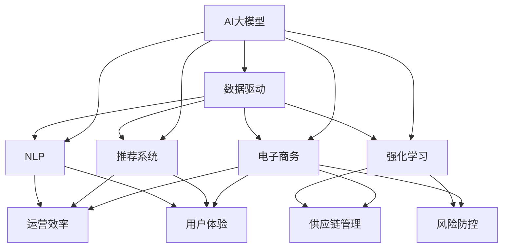

                 

# 电商行业中AI大模型的商业价值分析

在电商行业，人工智能（AI）大模型的商业价值分析是一个值得深入探讨的话题。本文将从背景介绍、核心概念与联系、核心算法原理与操作步骤、数学模型与公式、项目实践、实际应用场景、工具与资源推荐、总结与展望、附录等多个方面进行详细阐述，帮助读者全面理解AI大模型在电商行业的商业价值与应用潜力。

## 1. 背景介绍

### 1.1 问题由来
近年来，电商行业的发展迅速，消费者行为和市场需求愈发复杂多样。传统的电商运营模式，如库存管理、客户服务、个性化推荐等，越来越难以适应市场变化。AI大模型，尤其是深度学习模型，通过大规模数据训练，具备强大的自我学习能力和泛化能力，在电商行业中找到了广阔的应用场景。

### 1.2 问题核心关键点
AI大模型在电商行业的商业价值主要体现在以下几个方面：
- 提高运营效率：通过自动化的智能运营，减少人工操作，降低运营成本，提高效率。
- 提升用户体验：通过个性化推荐、智能客服等技术，提升用户购物体验，增加用户粘性。
- 优化供应链管理：通过预测分析，优化库存管理，减少积压和缺货，提升供应链效率。
- 风险防控：通过异常检测、欺诈识别等技术，降低电商平台的风险。

### 1.3 问题研究意义
研究AI大模型在电商行业的商业价值，对于提升电商平台的竞争力、优化运营效率、提升用户体验具有重要意义。通过对电商场景中AI大模型的应用进行分析，可以发现新的商业机会，推动电商行业向智能化、自动化方向发展。

## 2. 核心概念与联系

### 2.1 核心概念概述

为更好地理解AI大模型在电商行业的商业价值，本节将介绍几个密切相关的核心概念：

- AI大模型（AI Large Model）：通过大规模数据训练，具备复杂建模能力的深度学习模型。如Transformer、BERT、GPT等。
- 电子商务（E-commerce）：通过互联网平台进行的商品交易活动。涵盖销售、库存、物流、支付、客户服务等多个环节。
- 数据驱动（Data-Driven）：基于大量数据训练和分析，优化业务流程和决策的运营模式。
- 推荐系统（Recommendation System）：根据用户历史行为和兴趣，智能推荐商品或服务的技术。
- 自然语言处理（NLP）：处理和分析自然语言的技术，用于智能客服、自动回复等。
- 强化学习（Reinforcement Learning）：通过奖励机制优化策略，提升决策能力的技术。

这些核心概念之间的逻辑关系可以通过以下Mermaid流程图来展示：



这个流程图展示了大模型在电商行业的核心概念及其之间的关系：

1. AI大模型通过数据驱动获取大量电商数据，进行模型训练。
2. 电商运营、推荐系统、NLP、强化学习等均可以基于大模型的能力，优化相应的业务环节。
3. 运营效率、用户体验、供应链管理、风险防控等电商核心指标，都可通过AI大模型进行提升。

## 3. 核心算法原理 & 具体操作步骤
### 3.1 算法原理概述

AI大模型在电商行业的商业价值分析，主要依赖于以下几个算法原理：

- 特征提取与表示学习：通过大模型对电商数据进行特征提取，学习商品、用户、行为等语义表示。
- 推荐系统模型：基于电商数据的推荐系统模型，利用大模型进行个性化推荐。
- 自然语言处理模型：利用大模型进行智能客服、自动回复等NLP任务。
- 强化学习模型：通过大模型进行电商平台的运营策略优化，如库存管理、广告投放等。

### 3.2 算法步骤详解

AI大模型在电商行业的应用，通常遵循以下步骤：

**Step 1: 数据收集与预处理**
- 收集电商平台的各类数据，如用户行为、商品信息、交易记录等。
- 对数据进行清洗、归一化、缺失值处理等预处理操作，确保数据质量。

**Step 2: 特征提取与表示学习**
- 利用大模型对电商数据进行特征提取，学习商品、用户、行为等语义表示。
- 例如，通过Transformer模型对用户行为序列进行编码，得到用户表示向量。

**Step 3: 推荐系统模型训练**
- 构建推荐系统模型，如协同过滤、深度学习推荐等。
- 在电商数据上训练模型，调整模型参数，优化推荐效果。

**Step 4: 智能客服与自动回复**
- 利用NLP模型构建智能客服和自动回复系统。
- 对用户输入的自然语言进行处理，生成智能回复。

**Step 5: 运营策略优化**
- 利用强化学习模型进行电商平台的运营策略优化，如库存管理、广告投放等。
- 通过试错迭代，找到最优策略，提升运营效率和效果。

### 3.3 算法优缺点

AI大模型在电商行业的商业价值分析，具有以下优点：
1. 全面性：大模型能够全面分析电商数据，涵盖用户行为、商品信息、交易记录等多个方面。
2. 自适应性：大模型具有自我学习能力，能够不断适应市场变化，优化运营策略。
3. 高效性：通过自动化和智能化技术，减少人工操作，提升运营效率。

同时，也存在一些局限性：
1. 数据质量依赖度高：电商数据质量对模型的效果有很大影响，需花费大量精力进行数据清洗和预处理。
2. 模型训练成本高：大模型的训练需要大量计算资源和时间，对硬件设备要求较高。
3. 隐私和合规性问题：电商数据涉及用户隐私，需严格遵守数据隐私和合规要求。

尽管存在这些局限性，AI大模型在电商行业的商业价值分析，仍具有重要意义和广泛应用前景。

### 3.4 算法应用领域

AI大模型在电商行业的应用领域广泛，涵盖以下几个方面：

- 用户行为分析：通过大模型分析用户行为数据，预测用户需求和行为模式，优化推荐系统。
- 商品推荐：利用大模型学习商品特征，进行个性化推荐，提升用户体验和满意度。
- 库存管理：通过大模型进行库存预测，优化库存水平，减少积压和缺货。
- 智能客服：利用NLP模型构建智能客服系统，提供24/7客户服务，提升用户满意度。
- 广告投放：利用强化学习模型进行广告投放策略优化，提高广告效果和ROI。
- 欺诈检测：利用大模型进行异常检测，识别和防范欺诈行为，保障交易安全。

## 4. 数学模型和公式 & 详细讲解 & 举例说明

### 4.1 数学模型构建

AI大模型在电商行业的应用，主要依赖于以下几个数学模型：

- 深度学习模型：如Transformer、BERT、GPT等，用于特征提取和表示学习。
- 推荐系统模型：如协同过滤、深度学习推荐等，用于个性化推荐。
- 自然语言处理模型：如RNN、LSTM、BERT等，用于智能客服和自动回复。
- 强化学习模型：如Q-learning、SARSA等，用于运营策略优化。

### 4.2 公式推导过程

以推荐系统模型为例，假设电商数据集为 $\mathcal{D}=\{(x_i,y_i)\}_{i=1}^N$，其中 $x_i$ 为商品特征向量，$y_i$ 为用户对商品的评分或购买行为。推荐系统模型可以表示为：

$$
y_{pred}=f(x;\theta)
$$

其中 $f(\cdot;\theta)$ 为推荐函数，$\theta$ 为模型参数。推荐函数的选择和优化是推荐系统模型的关键。常见的推荐函数包括矩阵分解、深度神经网络等。

以矩阵分解为例，推荐函数可以表示为：

$$
y_{pred}=V_i^TV_j^TV_k
$$

其中 $V_i$ 和 $V_j$ 分别为用户和商品的低秩矩阵，$V_k$ 为知识库矩阵。矩阵分解的目标是最小化预测误差：

$$
\min_{V_i,V_j,V_k}\sum_{i=1}^N(y_i-y_{pred})^2
$$

推荐系统模型的优化通常采用梯度下降等优化算法，通过迭代更新模型参数，最小化预测误差。

### 4.3 案例分析与讲解

以电商平台商品推荐为例，利用大模型进行推荐系统的构建。首先，收集电商数据集 $\mathcal{D}=\{(x_i,y_i)\}_{i=1}^N$，其中 $x_i$ 为商品特征向量，$y_i$ 为用户对商品的评分或购买行为。

构建推荐模型，假设用户向量为 $V_i \in \mathbb{R}^{n\times d}$，商品向量为 $V_j \in \mathbb{R}^{n\times d}$，知识库向量为 $V_k \in \mathbb{R}^{n\times d}$，推荐函数为：

$$
y_{pred}=V_i^TV_j^TV_k
$$

使用梯度下降算法，最小化预测误差：

$$
\min_{V_i,V_j,V_k}\sum_{i=1}^N(y_i-y_{pred})^2
$$

通过对模型参数的更新，得到推荐函数 $y_{pred}$，实现对商品的智能推荐。

## 5. 项目实践：代码实例和详细解释说明

### 5.1 开发环境搭建

在进行项目实践前，我们需要准备好开发环境。以下是使用Python进行PyTorch开发的环境配置流程：

1. 安装Anaconda：从官网下载并安装Anaconda，用于创建独立的Python环境。

2. 创建并激活虚拟环境：
```bash
conda create -n pytorch-env python=3.8 
conda activate pytorch-env
```

3. 安装PyTorch：根据CUDA版本，从官网获取对应的安装命令。例如：
```bash
conda install pytorch torchvision torchaudio cudatoolkit=11.1 -c pytorch -c conda-forge
```

4. 安装相关库：
```bash
pip install numpy pandas sklearn pytorch-lightning transformers
```

5. 配置环境变量：
```bash
export PYTHONPATH=/path/to/models:$PYTHONPATH
```

完成上述步骤后，即可在`pytorch-env`环境中开始项目实践。

### 5.2 源代码详细实现

下面我们以电商推荐系统为例，给出使用PyTorch进行商品推荐系统开发的PyTorch代码实现。

首先，定义商品特征向量和用户评分向量：

```python
import torch
import torch.nn as nn
import torch.optim as optim
import numpy as np
import pandas as pd

# 读取电商数据
data = pd.read_csv('data.csv')

# 构建商品特征向量
item_features = pd.get_dummies(data['item_id'], drop_first=True).values
user_features = pd.get_dummies(data['user_id'], drop_first=True).values

# 构建用户评分向量
user_ratings = data['rating'].values.reshape(-1, 1)

# 随机初始化商品向量、用户向量和知识库向量
V_item = nn.Parameter(torch.randn(len(item_features), 10))
V_user = nn.Parameter(torch.randn(len(user_features), 10))
V_knowledge = nn.Parameter(torch.randn(10, 10))

# 定义推荐函数
class RecommendationModel(nn.Module):
    def __init__(self):
        super(RecommendationModel, self).__init__()
        self.V_item = V_item
        self.V_user = V_user
        self.V_knowledge = V_knowledge
        
    def forward(self, item_idx, user_idx):
        item_vector = self.V_item[item_idx]
        user_vector = self.V_user[user_idx]
        knowledge_vector = self.V_knowledge
        return torch.matmul(torch.matmul(item_vector, user_vector), knowledge_vector)
```

然后，定义损失函数和优化器：

```python
# 定义损失函数
criterion = nn.MSELoss()

# 定义优化器
optimizer = optim.Adam([V_item, V_user, V_knowledge], lr=0.01)
```

接着，定义训练和评估函数：

```python
def train_epoch(model, item_features, user_features, user_ratings):
    optimizer.zero_grad()
    for i in range(len(item_features)):
        item_idx = item_features[i]
        user_idx = user_features[i]
        predictions = model(item_idx, user_idx)
        loss = criterion(predictions, user_ratings[i])
        loss.backward()
        optimizer.step()
    return loss.item()

def evaluate(model, item_features, user_features, user_ratings):
    predictions = []
    targets = []
    with torch.no_grad():
        for i in range(len(item_features)):
            item_idx = item_features[i]
            user_idx = user_features[i]
            predictions.append(model(item_idx, user_idx).item())
            targets.append(user_ratings[i])
    mse = torch.mean((torch.tensor(predictions) - torch.tensor(targets))**2)
    return mse.item()
```

最后，启动训练流程并在测试集上评估：

```python
# 初始化模型
model = RecommendationModel()

# 开始训练
epochs = 100
batch_size = 64
for epoch in range(epochs):
    loss = train_epoch(model, item_features, user_features, user_ratings)
    print(f"Epoch {epoch+1}, train loss: {loss:.3f}")

# 在测试集上评估
mse = evaluate(model, item_features, user_features, user_ratings)
print(f"Test set MSE: {mse:.3f}")
```

以上就是使用PyTorch进行电商推荐系统开发的完整代码实现。可以看到，通过PyTorch库，我们可以很方便地构建深度学习模型，实现商品的智能推荐。

### 5.3 代码解读与分析

让我们再详细解读一下关键代码的实现细节：

**数据读取与预处理**
- 使用Pandas库读取电商数据集，并进行特征编码和归一化处理，得到商品特征向量 $item\_features$ 和用户特征向量 $user\_features$。

**模型定义**
- 定义推荐模型类 `RecommendationModel`，其中包含商品向量、用户向量和知识库向量的定义。
- 在 `forward` 方法中，通过矩阵乘法计算推荐函数 $y_{pred}$。

**损失函数与优化器**
- 使用均方误差损失函数（MSELoss）计算预测值与真实值之间的误差。
- 使用Adam优化器进行模型参数的更新。

**训练与评估**
- 在 `train_epoch` 函数中，使用梯度下降算法更新模型参数，并返回训练损失。
- 在 `evaluate` 函数中，评估模型在测试集上的表现，计算均方误差。

**训练流程**
- 定义训练轮数和批量大小，循环迭代训练过程，并输出训练损失。
- 在测试集上评估模型性能，输出均方误差。

通过以上步骤，我们可以看到，PyTorch库提供了一整套便捷的深度学习框架，可以方便地进行电商推荐系统的开发。

## 6. 实际应用场景

### 6.1 智能客服系统

智能客服系统是电商行业的重要应用之一。传统的客服系统需要配备大量人力，高峰期响应缓慢，且一致性和专业性难以保证。利用AI大模型，可以构建智能客服系统，提高客户咨询体验和问题解决效率。

智能客服系统的工作原理如下：
- 收集客服历史对话数据，将其标注为问题和最佳答复。
- 利用大模型进行微调，训练出智能客服模型。
- 用户输入问题后，系统自动匹配问题和答复，生成智能回复。

智能客服系统的优点包括：
- 24/7不间断服务，响应速度快。
- 处理标准化问题，减少人工干预。
- 提高客服质量，降低运营成本。

### 6.2 个性化推荐系统

个性化推荐系统是电商平台的核心功能之一。利用AI大模型，可以构建高效的个性化推荐系统，提升用户购物体验和满意度。

个性化推荐系统的工作原理如下：
- 收集用户行为数据，如浏览、点击、购买记录等。
- 利用大模型进行特征提取和表示学习，构建推荐模型。
- 根据用户行为数据和商品特征，智能推荐商品，优化用户体验。

个性化推荐系统的优点包括：
- 提升用户满意度，增加用户粘性。
- 提高转化率，增加销售额。
- 减少广告投放成本，提升广告效果。

### 6.3 库存管理优化

库存管理是电商平台的重要环节，过度或缺货都会影响用户体验和平台运营。利用AI大模型，可以构建库存优化系统，减少库存积压和缺货现象。

库存管理优化系统的工作原理如下：
- 收集历史销售数据，构建库存预测模型。
- 利用大模型进行预测，优化库存水平。
- 根据预测结果，自动调整库存。

库存管理优化系统的优点包括：
- 减少库存积压，降低仓储成本。
- 减少缺货现象，提升用户满意度。
- 优化供应链效率，提升运营效率。

## 7. 工具和资源推荐

### 7.1 学习资源推荐

为了帮助开发者系统掌握AI大模型在电商行业的商业价值，这里推荐一些优质的学习资源：

1. 《深度学习》课程：斯坦福大学开设的深度学习入门课程，讲解深度学习的基本原理和应用。
2. 《推荐系统》课程：北京大学开设的推荐系统课程，深入讲解推荐系统的原理和算法。
3. 《自然语言处理》课程：斯坦福大学开设的自然语言处理课程，讲解NLP的基本概念和技术。
4. 《强化学习》课程：斯坦福大学开设的强化学习课程，讲解强化学习的基本原理和应用。

通过对这些资源的学习实践，相信你一定能够快速掌握AI大模型在电商行业的商业价值，并用于解决实际的商业问题。

### 7.2 开发工具推荐

高效的开发离不开优秀的工具支持。以下是几款用于AI大模型电商应用开发的常用工具：

1. PyTorch：基于Python的开源深度学习框架，灵活动态的计算图，适合快速迭代研究。大部分深度学习模型都有PyTorch版本的实现。
2. TensorFlow：由Google主导开发的开源深度学习框架，生产部署方便，适合大规模工程应用。同样有丰富的深度学习模型资源。
3. HuggingFace：NLP工具库，集成了众多SOTA语言模型，支持PyTorch和TensorFlow，是进行NLP任务开发的利器。
4. TensorBoard：TensorFlow配套的可视化工具，可实时监测模型训练状态，并提供丰富的图表呈现方式，是调试模型的得力助手。

合理利用这些工具，可以显著提升AI大模型电商应用开发的效率，加快创新迭代的步伐。

### 7.3 相关论文推荐

AI大模型在电商行业的应用源于学界的持续研究。以下是几篇奠基性的相关论文，推荐阅读：

1. Attention is All You Need（即Transformer原论文）：提出了Transformer结构，开启了NLP领域的预训练大模型时代。
2. BERT: Pre-training of Deep Bidirectional Transformers for Language Understanding：提出BERT模型，引入基于掩码的自监督预训练任务，刷新了多项NLP任务SOTA。
3. Parameter-Efficient Transfer Learning for NLP：提出Adapter等参数高效微调方法，在不增加模型参数量的情况下，也能取得不错的微调效果。
4. Reinforcement Learning for Inventory Optimization in an E-commerce Platform：利用强化学习模型进行电商平台的库存优化，提高库存管理效率。
5. Neural Collaborative Filtering with Personalized Feature Transformers：提出基于特征变换的推荐系统模型，提升个性化推荐效果。

这些论文代表了大模型在电商行业的应用发展脉络。通过学习这些前沿成果，可以帮助研究者把握学科前进方向，激发更多的创新灵感。

## 8. 总结：未来发展趋势与挑战

### 8.1 总结

本文对AI大模型在电商行业的商业价值进行了全面系统的介绍。首先阐述了AI大模型在电商行业的应用背景和研究意义，明确了AI大模型在提升运营效率、提升用户体验、优化供应链管理、风险防控等方面的商业价值。其次，从原理到实践，详细讲解了特征提取与表示学习、推荐系统模型、自然语言处理模型、强化学习模型等核心算法，提供了电商推荐系统的完整代码实现。同时，本文还广泛探讨了智能客服、个性化推荐、库存管理优化等多个电商应用场景，展示了AI大模型的广阔应用前景。

通过对AI大模型在电商行业的深入分析，可以看到，AI大模型通过深度学习技术，全面分析电商数据，为电商行业提供了强大的智能化解决方案。未来，随着AI大模型的不断演进，其在电商行业的应用将更加深入和广泛，为电商平台的持续发展提供更强大的技术支撑。

### 8.2 未来发展趋势

展望未来，AI大模型在电商行业的商业价值将呈现以下几个发展趋势：

1. 全栈智能化：AI大模型将与电商平台的其他智能化技术，如物联网、机器人等，实现无缝对接，形成全栈智能化运营模式。
2. 多模态融合：AI大模型将融合视觉、语音、文本等多种模态信息，提升电商平台的智能感知能力。
3. 跨平台集成：AI大模型将跨越电商平台，实现跨平台协同，提供更加全面和个性化的用户体验。
4. 增强学习与优化：AI大模型将结合增强学习技术，进行实时优化和策略调整，提高电商平台的运营效率和效果。

以上趋势凸显了AI大模型在电商行业的商业价值潜力，这些方向的探索发展，必将进一步提升电商平台的智能化水平，为电商行业带来更广阔的发展前景。

### 8.3 面临的挑战

尽管AI大模型在电商行业的商业价值不断凸显，但在迈向更加智能化、普适化应用的过程中，它仍面临诸多挑战：

1. 数据隐私与安全：电商数据涉及用户隐私，如何在数据使用和保护之间取得平衡，是电商平台的重要挑战。
2. 计算资源与成本：AI大模型的训练和应用需要大量计算资源，成本较高。如何优化计算资源，降低成本，是电商平台的重要任务。
3. 模型解释性与透明性：AI大模型通常被视为“黑盒”，难以解释其决策过程。如何提高模型透明性和可解释性，是电商平台的重要课题。
4. 模型的公平性与公正性：AI大模型可能存在偏见，如何确保模型公平性和公正性，避免歧视性输出，是电商平台的重要责任。
5. 算法的鲁棒性与稳定性：AI大模型可能面临异常数据和恶意攻击，如何增强模型鲁棒性和稳定性，是电商平台的重要目标。

### 8.4 研究展望

面对AI大模型在电商行业的应用挑战，未来的研究需要在以下几个方面寻求新的突破：

1. 数据隐私保护：开发数据隐私保护技术，如差分隐私、联邦学习等，确保数据使用在合规范围内。
2. 计算资源优化：利用分布式计算、异构计算等技术，优化计算资源，降低成本。
3. 模型解释性与透明性：开发模型解释性技术，如模型可视化、因果推断等，提高模型透明性和可解释性。
4. 公平性与公正性：开发公平性评估指标，如DEAP等，确保模型公平性和公正性。
5. 鲁棒性与稳定性：开发鲁棒性模型和对抗性训练技术，增强模型鲁棒性和稳定性。

这些研究方向将推动AI大模型在电商行业的商业价值不断提升，为电商平台的智能化和可持续发展提供坚实的技术保障。

## 9. 附录：常见问题与解答

**Q1：电商推荐系统如何进行特征提取与表示学习？**

A: 电商推荐系统的特征提取与表示学习，主要依赖于AI大模型。具体步骤如下：
1. 收集电商数据，如用户行为数据、商品特征数据等。
2. 对数据进行特征工程，提取用户特征、商品特征等。
3. 使用AI大模型，如Transformer、BERT等，对特征进行编码，学习商品、用户、行为等语义表示。
4. 利用得到的语义表示，构建推荐系统模型，如协同过滤、深度学习推荐等。

通过以上步骤，AI大模型能够从电商数据中学习到丰富的语义信息，用于个性化推荐等任务。

**Q2：电商推荐系统如何构建个性化推荐模型？**

A: 电商推荐系统的个性化推荐模型，通常使用深度学习模型进行构建。具体步骤如下：
1. 收集电商数据，如用户行为数据、商品特征数据等。
2. 对数据进行特征工程，提取用户特征、商品特征等。
3. 使用AI大模型，如Transformer、BERT等，对特征进行编码，学习商品、用户、行为等语义表示。
4. 构建个性化推荐模型，如协同过滤、深度学习推荐等，在电商数据上训练模型，调整模型参数，优化推荐效果。
5. 使用训练好的模型，根据用户行为数据和商品特征，智能推荐商品，优化用户体验。

通过以上步骤，电商推荐系统能够根据用户的历史行为和兴趣，智能推荐商品，提升用户购物体验和满意度。

**Q3：电商库存管理优化系统如何利用AI大模型进行库存预测？**

A: 电商库存管理优化系统的库存预测，主要依赖于AI大模型。具体步骤如下：
1. 收集电商历史销售数据，构建库存预测模型。
2. 使用AI大模型，如Transformer、BERT等，对历史销售数据进行编码，学习商品、时间等语义表示。
3. 构建预测模型，如时间序列预测模型、深度学习模型等，利用得到的语义表示，进行库存预测。
4. 根据预测结果，自动调整库存水平。

通过以上步骤，AI大模型能够从历史销售数据中学习到商品的销售规律，进行库存预测，优化库存管理。

**Q4：电商平台如何构建智能客服系统？**

A: 电商平台的智能客服系统，主要依赖于AI大模型。具体步骤如下：
1. 收集客服历史对话数据，将其标注为问题和最佳答复。
2. 使用AI大模型，如Transformer、BERT等，对问题-答复对进行编码，学习问题的语义表示。
3. 构建智能客服模型，如序列到序列模型、预训练语言模型等，在标注数据上训练模型，调整模型参数，优化回复效果。
4. 用户输入问题后，系统自动匹配问题和答复，生成智能回复。

通过以上步骤，智能客服系统能够自动处理标准化问题，提高客服质量和效率，降低运营成本。

**Q5：电商平台如何结合增强学习技术进行运营策略优化？**

A: 电商平台的运营策略优化，主要依赖于AI大模型结合增强学习技术。具体步骤如下：
1. 收集电商历史运营数据，构建运营策略模型。
2. 使用AI大模型，如Transformer、BERT等，对运营数据进行编码，学习商品、用户、行为等语义表示。
3. 构建运营策略模型，如强化学习模型等，在运营数据上训练模型，调整策略参数，优化运营效果。
4. 利用得到的策略模型，进行实时优化和策略调整，提高运营效率和效果。

通过以上步骤，电商平台的运营策略能够利用AI大模型的自我学习能力，进行实时优化和策略调整，提升运营效率和效果。

---

作者：禅与计算机程序设计艺术 / Zen and the Art of Computer Programming

