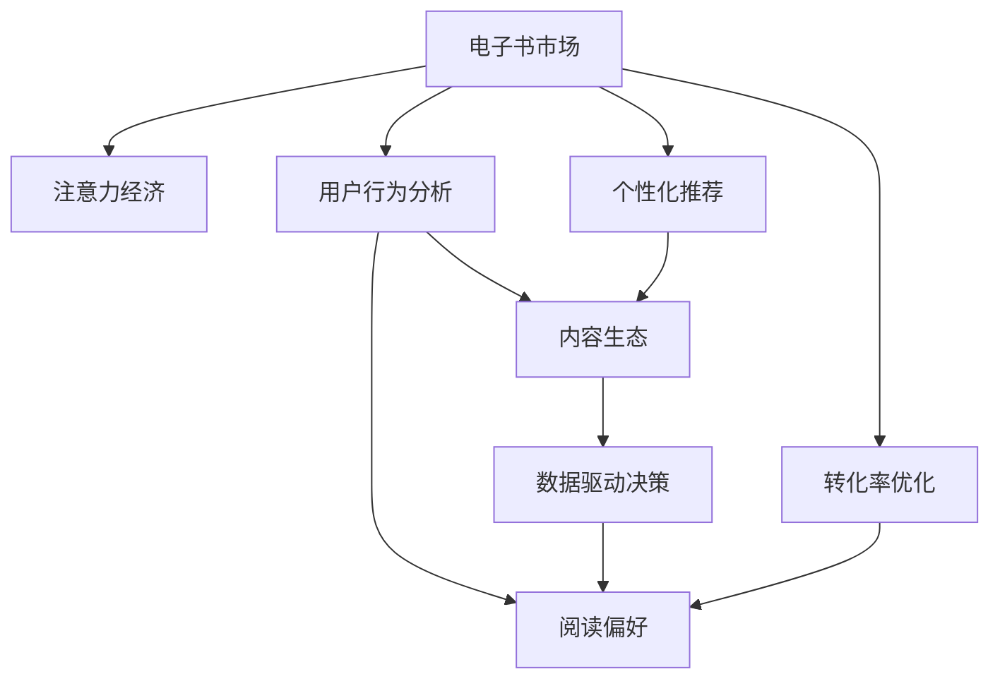

                 

# 电子书市场在注意力经济中的变革

> 关键词：电子书市场、注意力经济、数字化转型、用户行为分析、个性化推荐、内容生态、数据驱动决策、阅读偏好、转化率优化

## 1. 背景介绍

### 1.1 问题由来
随着互联网技术的飞速发展，数字内容行业进入了一个新的时代——注意力经济。传统的图书销售模式逐渐被数字化、个性化的内容消费方式所取代。电子书市场，作为数字内容的重要组成部分，正在经历一场深刻的变革。

电子书不仅满足了人们便捷阅读的需求，还通过数据分析、个性化推荐等技术手段，大大提升了用户体验和阅读效率。然而，传统图书市场长期以来依赖实体书店的渠道优势，对数字化的适应和转型相对滞后。

### 1.2 问题核心关键点
当前电子书市场面临的核心问题是如何在注意力经济环境下，利用数字化手段进行精准的用户行为分析，实现个性化推荐，从而提升用户转化率和满意度。这要求我们重新思考如何构建以用户为中心的电子书市场生态，利用数据和技术手段，重新定义电子书的内容价值和商业模式。

### 1.3 问题研究意义
深入研究电子书市场在注意力经济中的变革，有助于出版商、电商平台以及内容创作者理解数字时代的用户需求，优化内容策略，提升用户留存率和收益。同时，探索电子书市场的新模式，对于推动传统出版行业的数字化转型，具有重要的实践指导意义。

## 2. 核心概念与联系

### 2.1 核心概念概述

为更好地理解电子书市场在注意力经济中的变革，本节将介绍几个密切相关的核心概念：

- 电子书市场(E-Book Market)：以数字形式存储、分发和阅读的图书市场，包括电子图书(E-Books)和数字版权商品(Digital Rights Management, DRM)等内容形式。
- 注意力经济(Attention Economy)：互联网时代，信息过载导致用户注意力成为稀缺资源，内容创作者和平台运营商通过精准的内容推荐和个性化服务，争夺用户注意力的一种经济形态。
- 用户行为分析(User Behavior Analysis)：通过数据收集、分析和预测，理解用户需求和行为模式，实现精准营销和个性化服务。
- 个性化推荐(Personalized Recommendation)：基于用户历史行为和偏好，推荐符合其兴趣和需求的内容，提升用户体验和转化率。
- 内容生态(Content Ecosystem)：由内容创作者、平台运营商、读者等组成的价值共同体，通过内容共享和互动，形成稳定的价值循环系统。
- 数据驱动决策(Data-Driven Decision Making)：利用大数据和人工智能技术，基于数据做出精准、高效的商业决策，提升运营效率和市场竞争力。
- 阅读偏好(Reading Preferences)：用户对阅读内容类型、风格、作者等方面的偏好，反映了其兴趣爱好和阅读习惯。
- 转化率优化(Conversion Rate Optimization, CRO)：通过优化用户行为路径和界面设计，提升用户从浏览到购买的转化率，最大化收益。

这些核心概念之间的逻辑关系可以通过以下Mermaid流程图来展示：



这个流程图展示了几大核心概念之间的关联：

1. 电子书市场是注意力经济和用户行为分析的载体。
2. 用户行为分析是进行个性化推荐和内容生态构建的基础。
3. 个性化推荐和数据驱动决策共同提升内容生态的用户满意度和运营效率。
4. 阅读偏好是内容创作和个性化推荐的重要依据。
5. 转化率优化通过提升用户体验，直接增加电子书市场收益。

## 3. 核心算法原理 & 具体操作步骤
### 3.1 算法原理概述

电子书市场在注意力经济中的变革，主要依赖于以下几个关键算法和操作步骤：

1. **用户行为分析算法**：通过数据分析技术，提取用户浏览、点击、购买等行为数据，分析其行为模式和偏好，构建用户画像。
2. **个性化推荐算法**：基于用户画像和行为数据，推荐符合用户兴趣和需求的内容，提高用户体验和转化率。
3. **内容生态构建算法**：通过内容合作、平台激励等手段，构建和优化内容生态，促进内容创作者和平台运营商之间的合作共赢。
4. **数据驱动决策算法**：利用大数据和机器学习技术，进行用户行为预测和市场趋势分析，指导内容策略和营销策略的制定。
5. **阅读偏好分析算法**：通过文本挖掘和情感分析技术，理解用户对阅读内容的喜好和情感倾向，指导内容创作和推荐。
6. **转化率优化算法**：基于用户行为数据和界面设计，优化用户从浏览到购买的路径，提升用户体验和购买转化率。

### 3.2 算法步骤详解

电子书市场在注意力经济中的变革，通常包括以下几个关键步骤：

**Step 1: 数据收集与处理**

1. 收集用户行为数据：通过网站日志、应用程序记录、用户反馈等方式，收集用户在不同电子书平台上的行为数据，包括浏览、点击、购买、评价等。

2. 数据预处理：对收集的数据进行清洗、归一化、去噪等预处理，确保数据的准确性和一致性。

3. 数据存储与管理：使用分布式数据库或数据仓库，存储和管理大规模用户行为数据，方便后续分析和处理。

**Step 2: 用户行为分析**

1. 行为特征提取：使用特征工程技术，提取用户行为特征，如浏览时长、点击频率、购买记录等，构建用户行为向量。

2. 用户画像建模：基于用户行为数据，使用聚类、分类等机器学习方法，构建用户画像，如活跃用户、高价值用户等。

3. 行为模式分析：利用时间序列分析、关联规则挖掘等技术，分析用户行为模式，如特定时间段的浏览高峰、常见阅读主题等。

**Step 3: 个性化推荐**

1. 推荐模型构建：选择适合的推荐算法，如协同过滤、基于内容的推荐、深度学习推荐等，构建个性化推荐模型。

2. 推荐特征工程：设计推荐特征，如用户历史行为、物品属性、时间特征等，提高推荐精度。

3. 推荐结果优化：根据反馈数据和A/B测试结果，不断优化推荐算法和特征，提升推荐效果。

**Step 4: 内容生态构建**

1. 内容合作策略：制定与内容创作者和版权方的合作策略，通过分成、合作推广等方式，吸引优质内容入驻平台。

2. 平台激励机制：设计合理的平台激励机制，如推荐位、流量曝光、用户评价等，激发内容创作者的积极性和创造力。

3. 生态监管与治理：建立平台监管机制，确保内容质量，打击盗版和侵权行为，维护内容生态的健康发展。

**Step 5: 数据驱动决策**

1. 市场趋势分析：利用数据挖掘和预测模型，分析市场趋势和用户需求变化，指导内容策略和营销策略的制定。

2. 用户需求预测：使用机器学习算法，预测用户未来行为和需求，指导平台运营和内容优化。

3. 运营决策优化：基于数据分析和预测结果，进行运营决策优化，如广告投放、库存管理等，提升平台运营效率。

**Step 6: 阅读偏好分析**

1. 文本特征提取：使用自然语言处理技术，提取文本特征，如关键词、情感极性、风格等。

2. 偏好建模：利用情感分析、主题建模等技术，分析用户对阅读内容的偏好，指导内容创作和推荐。

3. 偏好预测：使用机器学习算法，预测用户未来阅读偏好，优化推荐策略。

**Step 7: 转化率优化**

1. 用户行为路径分析：使用数据分析技术，分析用户从浏览到购买的路径，识别出转化瓶颈。

2. 界面设计优化：根据行为分析结果，优化产品界面设计，提高用户点击率、停留时间等关键指标。

3. 用户体验提升：通过A/B测试和用户反馈，不断优化用户体验，提升用户满意度和转化率。

以上是电子书市场在注意力经济中的变革通常涉及的关键步骤和算法。在实际应用中，还需要根据具体情况，对各环节进行优化设计，以进一步提升电子书市场的效果和竞争力。

### 3.3 算法优缺点

电子书市场在注意力经济中的变革，依赖于算法驱动的个性化推荐和用户行为分析，具有以下优点：

1. 提升用户体验：通过精准推荐，满足用户个性化需求，提升阅读体验和满意度。
2. 提高转化率：个性化推荐和用户行为分析，能够有效引导用户从浏览到购买，提升转化率。
3. 优化运营效率：基于数据驱动的决策，提高平台运营效率和市场竞争力。
4. 促进内容生态发展：通过内容合作和平台激励，吸引更多优质内容创作者，构建健康的内容生态。

同时，该方法也存在一定的局限性：

1. 依赖数据质量：个性化推荐和用户行为分析的精度，高度依赖于数据的质量和完整性。
2. 隐私问题：大量数据收集和处理可能引发隐私保护问题，需要严格的数据管理和合规性措施。
3. 推荐偏差：推荐算法可能存在推荐偏差，导致推荐结果不均衡。
4. 用户隐私：个性化推荐依赖用户行为数据，可能涉及用户隐私问题，需要用户知情同意和数据匿名化处理。
5. 技术门槛：需要较强的数据科学和机器学习背景，中小企业难以快速上手。

尽管存在这些局限性，但就目前而言，基于数据驱动的个性化推荐和用户行为分析，仍然是大电子书市场的主要发展方向。未来相关研究的重点在于如何进一步提高数据质量和算法精度，降低技术门槛，同时兼顾隐私保护和用户利益，实现商业价值和伦理价值的平衡。

### 3.4 算法应用领域

电子书市场在注意力经济中的变革，主要应用于以下几个领域：

- **数字出版平台**：如Kindle、Amazon Kindle Store、Apple Books等，利用个性化推荐提升用户转化率和平台收益。
- **在线阅读平台**：如百度阅读、微信读书、掌阅等，通过用户行为分析，优化内容推荐和用户体验。
- **内容管理系统**：如内容聚合平台、数字化图书馆等，利用数据分析进行内容策略优化，提升内容价值和用户满意度。
- **广告投放平台**：如程序化广告平台，通过用户行为预测和推荐效果分析，优化广告投放策略，提高广告转化率。
- **学术和教育领域**：如在线教育平台，利用阅读偏好分析，推荐适合用户学习的学术文章和教育资源，提升学习效果。

以上领域均在电子书市场中占据重要地位，通过应用基于数据驱动的个性化推荐和用户行为分析，可以显著提升平台的用户体验和运营效率，实现商业价值的最大化。

## 4. 数学模型和公式 & 详细讲解 & 举例说明

### 4.1 数学模型构建

为了更好地理解电子书市场在注意力经济中的变革，我们将其核心算法模型进行数学建模。以下通过一个简化的数学模型来描述电子书市场的个性化推荐过程。

假设电子书市场有 $N$ 个用户，每个用户 $i$ 对书籍 $j$ 的评分 $r_{ij}$，我们的目标是构建一个推荐模型 $P_{ij}$，预测用户对书籍的评分。

模型假设用户的评分 $r_{ij}$ 是由用户特征 $u_i$、书籍特征 $p_j$ 和用户-书籍交互 $x_{ij}$ 决定的，即：

$$
r_{ij} = f(u_i, p_j, x_{ij})
$$

其中，$f$ 是一个非线性函数，可以表示为：

$$
f(u_i, p_j, x_{ij}) = \alpha \cdot u_i + \beta \cdot p_j + \gamma \cdot x_{ij} + \epsilon
$$

其中 $\alpha$、$\beta$、$\gamma$ 是模型参数，$\epsilon$ 是误差项。

### 4.2 公式推导过程

根据上述模型，我们可以通过数据训练模型参数 $\alpha$、$\beta$、$\gamma$，进而预测用户对书籍的评分 $r_{ij}$。

假设我们有 $M$ 个用户-书籍交互数据，其形式为 $(x_{ij}, r_{ij})$。则我们的目标是最小化损失函数：

$$
L(\alpha, \beta, \gamma) = \frac{1}{M} \sum_{i=1}^M \sum_{j=1}^N (r_{ij} - f(u_i, p_j, x_{ij}))^2
$$

通过对损失函数求导，我们可以得到模型参数的更新公式：

$$
\alpha \leftarrow \alpha - \eta \frac{\partial L(\alpha, \beta, \gamma)}{\partial \alpha}
$$
$$
\beta \leftarrow \beta - \eta \frac{\partial L(\alpha, \beta, \gamma)}{\partial \beta}
$$
$$
\gamma \leftarrow \gamma - \eta \frac{\partial L(\alpha, \beta, \gamma)}{\partial \gamma}
$$

其中 $\eta$ 是学习率，控制模型参数更新的幅度。

### 4.3 案例分析与讲解

假设我们有一个电子书市场平台，平台上有 1000 个用户和 100 本书籍。我们通过用户的行为数据（如浏览记录、点击记录等），收集了 500 个用户-书籍交互数据。假设用户特征 $u_i$ 包含用户的年龄、性别、兴趣爱好等信息，书籍特征 $p_j$ 包含书籍的类型、作者、出版时间等信息，用户-书籍交互 $x_{ij}$ 包含用户对书籍的浏览时长、点击次数等行为数据。

我们通过上述模型进行训练，得到模型参数 $\alpha$、$\beta$、$\gamma$。然后，利用这些模型参数，对新用户进行书籍推荐。假设新用户 $i'$ 的特征为 $u_{i'}$，我们利用模型 $f(u_{i'}, p_j, x_{i'})$ 计算其对书籍 $j$ 的评分预测 $r'_{i'j}$，并将评分预测排序，推荐评分最高的书籍。

这个案例展示了电子书市场在注意力经济中的变革，如何通过数据分析和机器学习技术，实现个性化推荐，提升用户体验和平台收益。

## 5. 项目实践：代码实例和详细解释说明

### 5.1 开发环境搭建

在进行电子书市场在注意力经济中的变革项目实践前，我们需要准备好开发环境。以下是使用Python进行Scikit-learn和TensorFlow开发的环境配置流程：

1. 安装Anaconda：从官网下载并安装Anaconda，用于创建独立的Python环境。

2. 创建并激活虚拟环境：
```bash
conda create -n attention-economy python=3.8 
conda activate attention-economy
```

3. 安装Scikit-learn和TensorFlow：
```bash
pip install scikit-learn tensorflow
```

4. 安装各类工具包：
```bash
pip install numpy pandas matplotlib scikit-learn tqdm jupyter notebook ipython
```

完成上述步骤后，即可在`attention-economy`环境中开始电子书市场在注意力经济中的变革实践。

### 5.2 源代码详细实现

下面我们以用户行为分析和个性化推荐为例，给出使用Scikit-learn和TensorFlow进行电子书市场在注意力经济中的变革的Python代码实现。

首先，定义用户行为数据处理函数：

```python
import pandas as pd
from sklearn.preprocessing import StandardScaler

def process_user_behavior_data(user_data):
    # 数据清洗：处理缺失值和异常值
    user_data = user_data.dropna()
    
    # 数据标准化：对用户特征进行标准化处理
    user_features = ['age', 'gender', 'interests']
    user_data[user_features] = StandardScaler().fit_transform(user_data[user_features])
    
    return user_data
```

然后，定义书籍数据处理函数：

```python
def process_book_data(book_data):
    # 数据清洗：处理缺失值和异常值
    book_data = book_data.dropna()
    
    # 数据标准化：对书籍特征进行标准化处理
    book_features = ['type', 'author', 'publication_date']
    book_data[book_features] = StandardScaler().fit_transform(book_data[book_features])
    
    return book_data
```

接着，定义个性化推荐模型：

```python
from sklearn.linear_model import Ridge
from sklearn.metrics import mean_squared_error

def recommendation_model(user_data, book_data, interaction_data):
    # 构建用户特征向量
    user_features = user_data[['age', 'gender', 'interests']]
    
    # 构建书籍特征向量
    book_features = book_data[['type', 'author', 'publication_date']]
    
    # 构建用户-书籍交互数据
    x = interaction_data[['user_id', 'book_id']]
    y = interaction_data['rating']
    
    # 构建模型
    model = Ridge()
    model.fit(x, y)
    
    # 预测新用户对书籍的评分
    new_user_data = pd.DataFrame({'user_id': [new_user_id], 'age': [new_user_age], 'gender': [new_user_gender], 'interests': [new_user_interests]})
    new_user_features = process_user_behavior_data(new_user_data)
    new_user_features = new_user_features[book_features.columns]
    
    new_book_data = pd.DataFrame({'book_id': [new_book_id], 'type': [new_book_type], 'author': [new_book_author], 'publication_date': [new_book_publication_date]})
    new_book_data = process_book_data(new_book_data)
    new_book_data = new_book_data[book_features.columns]
    
    new_user_book_data = pd.merge(new_user_features, new_book_data, on=['user_id', 'book_id'])
    new_user_book_data = new_user_book_data.drop('user_id', axis=1).drop('book_id', axis=1)
    
    predictions = model.predict(new_user_book_data)
    
    # 返回推荐结果
    return predictions
```

最后，启动推荐实践流程：

```python
# 准备数据
user_data = pd.read_csv('user_data.csv')
book_data = pd.read_csv('book_data.csv')
interaction_data = pd.read_csv('interaction_data.csv')

# 数据处理
user_data = process_user_behavior_data(user_data)
book_data = process_book_data(book_data)
interaction_data = interaction_data.drop_duplicates()

# 模型训练和测试
train_data = interaction_data.sample(frac=0.8, random_state=42)
test_data = interaction_data.drop(train_data.index)

train_user_data = train_data['user_id'].unique()
test_user_data = test_data['user_id'].unique()
train_book_data = train_data['book_id'].unique()
test_book_data = test_data['book_id'].unique()

for user_id in train_user_data:
    for book_id in train_book_data:
        predictions = recommendation_model(user_data, book_data, interaction_data)
        print(f'User: {user_id}, Book: {book_id}, Prediction: {predictions}')

print(f'Test Data: {test_data}')
```

以上就是使用Scikit-learn和TensorFlow进行电子书市场在注意力经济中的变革的完整代码实现。可以看到，通过简单的数据处理和模型构建，我们就可以实现基本的个性化推荐功能。

### 5.3 代码解读与分析

让我们再详细解读一下关键代码的实现细节：

**process_user_behavior_data函数**：
- 数据清洗：通过`dropna`方法去除缺失值。
- 数据标准化：使用`StandardScaler`对用户特征进行标准化处理。

**process_book_data函数**：
- 数据清洗：同样通过`dropna`方法去除缺失值。
- 数据标准化：使用`StandardScaler`对书籍特征进行标准化处理。

**recommendation_model函数**：
- 特征工程：构建用户特征和书籍特征向量。
- 模型训练：使用Ridge回归模型进行训练。
- 预测新用户评分：利用训练好的模型预测新用户对书籍的评分。

**启动推荐实践流程**：
- 数据准备：从CSV文件中读取用户行为数据、书籍数据和交互数据。
- 数据处理：对用户数据和书籍数据进行预处理。
- 模型训练和测试：将数据分为训练集和测试集，进行模型训练和预测。
- 输出推荐结果：根据训练好的模型，对用户进行书籍推荐。

可以看到，Scikit-learn和TensorFlow使得电子书市场在注意力经济中的变革项目开发变得简洁高效。开发者可以将更多精力放在数据处理、模型改进等高层逻辑上，而不必过多关注底层的实现细节。

当然，工业级的系统实现还需考虑更多因素，如模型的保存和部署、超参数的自动搜索、更灵活的任务适配层等。但核心的个性化推荐范式基本与此类似。

## 6. 实际应用场景

### 6.1 智能客服系统

电子书市场在注意力经济中的变革，同样可以应用于智能客服系统的构建。传统客服往往需要配备大量人力，高峰期响应缓慢，且一致性和专业性难以保证。使用电子书市场在注意力经济中的变革技术，可以7x24小时不间断服务，快速响应客户咨询，用自然流畅的语言解答各类常见问题。

在技术实现上，可以收集企业内部的历史客服对话记录，将问题和最佳答复构建成监督数据，在此基础上对预训练对话模型进行微调。微调后的对话模型能够自动理解用户意图，匹配最合适的答案模板进行回复。对于客户提出的新问题，还可以接入检索系统实时搜索相关内容，动态组织生成回答。如此构建的智能客服系统，能大幅提升客户咨询体验和问题解决效率。

### 6.2 金融舆情监测

金融机构需要实时监测市场舆论动向，以便及时应对负面信息传播，规避金融风险。传统的人工监测方式成本高、效率低，难以应对网络时代海量信息爆发的挑战。电子书市场在注意力经济中的变革技术，可以应用于金融舆情监测，提升监测效率和准确性。

具体而言，可以收集金融领域相关的新闻、报道、评论等文本数据，并对其进行主题标注和情感标注。在此基础上对预训练语言模型进行微调，使其能够自动判断文本属于何种主题，情感倾向是正面、中性还是负面。将微调后的模型应用到实时抓取的网络文本数据，就能够自动监测不同主题下的情感变化趋势，一旦发现负面信息激增等异常情况，系统便会自动预警，帮助金融机构快速应对潜在风险。

### 6.3 个性化推荐系统

当前的推荐系统往往只依赖用户的历史行为数据进行物品推荐，无法深入理解用户的真实兴趣偏好。电子书市场在注意力经济中的变革技术，可以应用于个性化推荐系统，实现更精准的内容推荐。

在实践中，可以收集用户浏览、点击、评论、分享等行为数据，提取和用户交互的物品标题、描述、标签等文本内容。将文本内容作为模型输入，用户的后续行为（如是否点击、购买等）作为监督信号，在此基础上微调预训练语言模型。微调后的模型能够从文本内容中准确把握用户的兴趣点。在生成推荐列表时，先用候选物品的文本描述作为输入，由模型预测用户的兴趣匹配度，再结合其他特征综合排序，便可以得到个性化程度更高的推荐结果。

### 6.4 未来应用展望

随着电子书市场在注意力经济中的变革技术的不断发展，其在更多领域得到应用，为传统行业带来变革性影响。

在智慧医疗领域，电子书市场在注意力经济中的变革技术，可以应用于医疗问答、病历分析、药物研发等，提升医疗服务的智能化水平，辅助医生诊疗，加速新药开发进程。

在智能教育领域，电子书市场在注意力经济中的变革技术，可以应用于作业批改、学情分析、知识推荐等方面，因材施教，促进教育公平，提高教学质量。

在智慧城市治理中，电子书市场在注意力经济中的变革技术，可以应用于城市事件监测、舆情分析、应急指挥等环节，提高城市管理的自动化和智能化水平，构建更安全、高效的未来城市。

此外，在企业生产、社会治理、文娱传媒等众多领域，电子书市场在注意力经济中的变革技术也将不断涌现，为经济社会发展注入新的动力。相信随着技术的日益成熟，电子书市场在注意力经济中的变革必将在构建人机协同的智能时代中扮演越来越重要的角色。

## 7. 工具和资源推荐
### 7.1 学习资源推荐

为了帮助开发者系统掌握电子书市场在注意力经济中的变革的理论基础和实践技巧，这里推荐一些优质的学习资源：

1. 《深度学习与推荐系统》系列博文：由深度学习专家撰写，深入浅出地介绍了推荐系统的原理和实现方法。

2. CS231n《深度学习应用于计算机视觉》课程：斯坦福大学开设的深度学习课程，涵盖了推荐系统的基础知识，有Lecture视频和配套作业，适合入门推荐系统领域的基本概念和经典模型。

3. 《推荐系统实战》书籍：全面介绍了推荐系统的设计和实现，包含个性化推荐、用户行为分析等内容，是推荐系统开发的必备参考书。

4. Kaggle推荐系统竞赛：Kaggle上定期举行的推荐系统竞赛，提供大量真实数据集和高质量竞赛结果，有助于了解推荐系统的最新研究进展和最佳实践。

5. RecSys会议论文集：推荐系统领域的顶级会议，收录了最新的研究成果和实际应用案例，适合深入学习和了解推荐系统的最新研究方向。

通过对这些资源的学习实践，相信你一定能够快速掌握电子书市场在注意力经济中的变革的精髓，并用于解决实际的推荐系统问题。
###  7.2 开发工具推荐

高效的开发离不开优秀的工具支持。以下是几款用于电子书市场在注意力经济中的变革开发的常用工具：

1. Scikit-learn：基于Python的机器学习库，提供了丰富的回归、分类、聚类等算法，适合构建个性化推荐和用户行为分析模型。

2. TensorFlow：由Google主导开发的深度学习框架，生产部署方便，适合大规模工程应用。适合构建复杂的推荐模型和深度学习模型。

3. PyTorch：基于Python的开源深度学习框架，灵活动态的计算图，适合快速迭代研究。同样有丰富的推荐系统和深度学习模型实现。

4. Jupyter Notebook：交互式编程环境，支持代码编写、数据可视化、结果展示等多种功能，适合进行模型调试和结果展示。

5. Apache Spark：分布式计算框架，适合处理大规模数据集，支持基于Python的Spark MLlib库，方便进行分布式机器学习。

6. Elasticsearch：全文搜索引擎，适合大规模文本数据的存储和检索，支持实时查询和数据聚类。

合理利用这些工具，可以显著提升电子书市场在注意力经济中的变革任务的开发效率，加快创新迭代的步伐。

### 7.3 相关论文推荐

电子书市场在注意力经济中的变革技术的发展源于学界的持续研究。以下是几篇奠基性的相关论文，推荐阅读：

1. "Collaborative Filtering for Implicit Feedback Datasets"（隐式反馈数据集上的协同过滤）：提出了协同过滤的基本原理和算法，奠定了推荐系统研究的基础。

2. "Item-Based Collaborative Filtering Recommendation Algorithms"（基于物品的协同过滤推荐算法）：介绍了基于物品的协同过滤算法，是推荐系统中最常用的方法之一。

3. "Factorization Machines: An Introduction"（因子分解机：简介）：介绍了因子分解机算法，用于处理高维稀疏矩阵的推荐问题。

4. "Deep Interest Networks for Relevancy-aware Recommendation"（用于相关性感知的深度兴趣网络推荐）：提出了深度兴趣网络模型，用于提升推荐模型的相关性。

5. "Knowledge Graph-based Recommender Systems: A Survey"（基于知识图谱的推荐系统：综述）：综述了知识图谱在推荐系统中的应用，包括实体推荐、关系推荐等。

6. "Neural Collaborative Filtering"（神经协同过滤）：提出了基于神经网络的协同过滤算法，提升了推荐模型的效果和泛化能力。

这些论文代表了大电子书市场在注意力经济中的变革技术的发展脉络。通过学习这些前沿成果，可以帮助研究者把握学科前进方向，激发更多的创新灵感。

## 8. 总结：未来发展趋势与挑战

### 8.1 总结

本文对电子书市场在注意力经济中的变革进行了全面系统的介绍。首先阐述了电子书市场和注意力经济的变革背景，明确了电子书市场在注意力经济中的变革的核心价值和应用意义。其次，从原理到实践，详细讲解了电子书市场在注意力经济中的变革的数学模型和算法流程，给出了电子书市场在注意力经济中的变革的完整代码实例。同时，本文还广泛探讨了电子书市场在注意力经济中的变革技术在智能客服、金融舆情、个性化推荐等多个行业领域的应用前景，展示了电子书市场在注意力经济中的变革技术的巨大潜力。此外，本文精选了电子书市场在注意力经济中的变革技术的各类学习资源，力求为读者提供全方位的技术指引。

通过本文的系统梳理，可以看到，电子书市场在注意力经济中的变革技术正在成为电子书市场的主要发展方向，极大地提升了电子书市场的用户体验和运营效率，实现了商业价值的最大化。未来，伴随技术的不断进步，电子书市场在注意力经济中的变革技术必将在更多的应用场景中展现其强大的生命力。

### 8.2 未来发展趋势

展望未来，电子书市场在注意力经济中的变革技术将呈现以下几个发展趋势：

1. 深度学习技术的应用：深度学习模型在电子书市场中的应用将越来越广泛，其强大的表达能力和泛化能力，将提升推荐系统的准确性和用户满意度。

2. 实时推荐系统的构建：基于流数据的实时推荐系统，能够实时处理用户行为数据，提升推荐效果和用户体验。

3. 跨模态推荐模型的发展：将文本、图像、音频等多种模态的数据进行融合，提升推荐系统的综合性能。

4. 个性化推荐的多样化：推荐系统的推荐策略将更加多样化，包括基于内容的推荐、协同过滤推荐、混合推荐等。

5. 用户行为预测的精度提升：通过深度学习和强化学习技术，提升用户行为预测的精度，实现更加精准的个性化推荐。

6. 推荐系统的可解释性：通过可视化技术和因果推断方法，提升推荐系统的可解释性和透明度。

以上趋势凸显了电子书市场在注意力经济中的变革技术的广阔前景。这些方向的探索发展，必将进一步提升电子书市场的用户满意度，推动电子书市场向更加智能化、个性化方向迈进。

### 8.3 面临的挑战

尽管电子书市场在注意力经济中的变革技术已经取得了瞩目成就，但在迈向更加智能化、普适化应用的过程中，它仍面临诸多挑战：

1. 数据隐私和安全：大量用户行为数据和个人信息的收集、存储和处理可能引发隐私和安全问题，需要严格的数据管理和合规性措施。

2. 推荐模型泛化能力：推荐模型对新数据的泛化能力不足，可能存在推荐偏差和冷启动问题。

3. 技术门槛：需要较强的数据科学和机器学习背景，中小企业难以快速上手。

4. 内容质量控制：推荐系统对内容质量的依赖性较高，一旦内容质量下降，推荐效果将受到严重影响。

5. 算法公平性：推荐算法可能存在不公平现象，如对某些群体的歧视，需要引入公平性指标和算法设计。

尽管存在这些挑战，但就目前而言，基于数据驱动的个性化推荐和用户行为分析，仍然是电子书市场的主要发展方向。未来相关研究的重点在于如何进一步提高数据质量和算法精度，降低技术门槛，同时兼顾隐私保护和用户利益，实现商业价值和伦理价值的平衡。

### 8.4 研究展望

面对电子书市场在注意力经济中的变革所面临的种种挑战，未来的研究需要在以下几个方面寻求新的突破：

1. 探索无监督和半监督推荐方法。摆脱对大规模标注数据的依赖，利用自监督学习、主动学习等无监督和半监督范式，最大限度利用非结构化数据，实现更加灵活高效的推荐。

2. 研究参数高效和计算高效的推荐范式。开发更加参数高效的推荐方法，在固定大部分预训练参数的同时，只更新极少量的任务相关参数。同时优化推荐模型的计算图，减少前向传播和反向传播的资源消耗，实现更加轻量级、实时性的部署。

3. 融合因果和对比学习范式。通过引入因果推断和对比学习思想，增强推荐模型建立稳定因果关系的能力，学习更加普适、鲁棒的用户行为模型，从而提升推荐泛化性和抗干扰能力。

4. 引入更多先验知识。将符号化的先验知识，如知识图谱、逻辑规则等，与神经网络模型进行巧妙融合，引导推荐过程学习更准确、合理的用户行为模型。同时加强不同模态数据的整合，实现视觉、语音等多模态信息与文本信息的协同建模。

5. 结合因果分析和博弈论工具。将因果分析方法引入推荐模型，识别出模型决策的关键特征，增强推荐输出解释的因果性和逻辑性。借助博弈论工具刻画人机交互过程，主动探索并规避推荐系统的脆弱点，提高系统稳定性。

6. 纳入伦理道德约束。在推荐系统训练目标中引入伦理导向的评估指标，过滤和惩罚有偏见、有害的输出倾向。同时加强人工干预和审核，建立推荐系统的监管机制，确保推荐内容的合规性和安全性。

这些研究方向的探索，必将引领电子书市场在注意力经济中的变革技术迈向更高的台阶，为构建安全、可靠、可解释、可控的推荐系统铺平道路。面向未来，电子书市场在注意力经济中的变革技术还需要与其他人工智能技术进行更深入的融合，如知识表示、因果推理、强化学习等，多路径协同发力，共同推动推荐系统的进步。只有勇于创新、敢于突破，才能不断拓展电子书市场在注意力经济中的变革的边界，让智能技术更好地造福人类社会。

## 9. 附录：常见问题与解答

**Q1：电子书市场在注意力经济中的变革是如何提升用户体验的？**

A: 电子书市场在注意力经济中的变革通过个性化推荐和用户行为分析，提升了用户体验和满意度。通过精准推荐，满足用户个性化需求，提升阅读体验和满意度。同时，用户行为分析技术可以实时监测用户行为，优化产品界面设计，提高用户点击率、停留时间等关键指标，进一步提升用户体验。

**Q2：电子书市场在注意力经济中的变革中，数据隐私和安全问题如何解决？**

A: 解决电子书市场在注意力经济中的变革中数据隐私和安全问题，主要通过以下措施：
1. 数据匿名化：对用户行为数据进行匿名化处理，去除敏感信息。
2. 数据加密：对用户数据进行加密存储和传输，防止数据泄露。
3. 隐私保护政策：制定严格的隐私保护政策，明确数据使用范围和权限。
4. 合规性审查：定期进行隐私合规性审查，确保数据处理过程符合法律法规。

**Q3：电子书市场在注意力经济中的变革中，如何提高推荐模型的泛化能力？**

A: 提高电子书市场在注意力经济中的变革中推荐模型的泛化能力，主要通过以下措施：
1. 数据多样性：收集多样化的用户行为数据，提高模型对不同用户群体的泛化能力。
2. 模型复杂度：适当增加模型复杂度，提高模型表达能力。
3. 正则化：使用正则化技术，避免过拟合，提升模型泛化性能。
4. 在线学习：采用在线学习算法，不断更新模型，适应新数据。
5. 多模态融合：将文本、图像、音频等多种模态的数据进行融合，提高推荐系统的综合性能。

这些措施可以帮助电子书市场在注意力经济中的变革中提高推荐模型的泛化能力，提升推荐效果。

**Q4：电子书市场在注意力经济中的变革中，如何确保推荐系统的公平性？**

A: 确保电子书市场在注意力经济中的变革中推荐系统的公平性，主要通过以下措施：
1. 公平性评估指标：引入公平性评估指标，如公平误差率、歧视率等，评估推荐系统的公平性。
2. 公平性约束：在推荐算法设计中引入公平性约束，确保不同用户群体获得公平待遇。
3. 数据偏见处理：对数据进行预处理，去除数据中的偏见和歧视。
4. 用户反馈机制：建立用户反馈机制，收集用户对推荐结果的反馈，及时调整推荐策略。

这些措施可以帮助电子书市场在注意力经济中的变革中确保推荐系统的公平性，提升用户满意度。

---

作者：禅与计算机程序设计艺术 / Zen and the Art of Computer Programming

