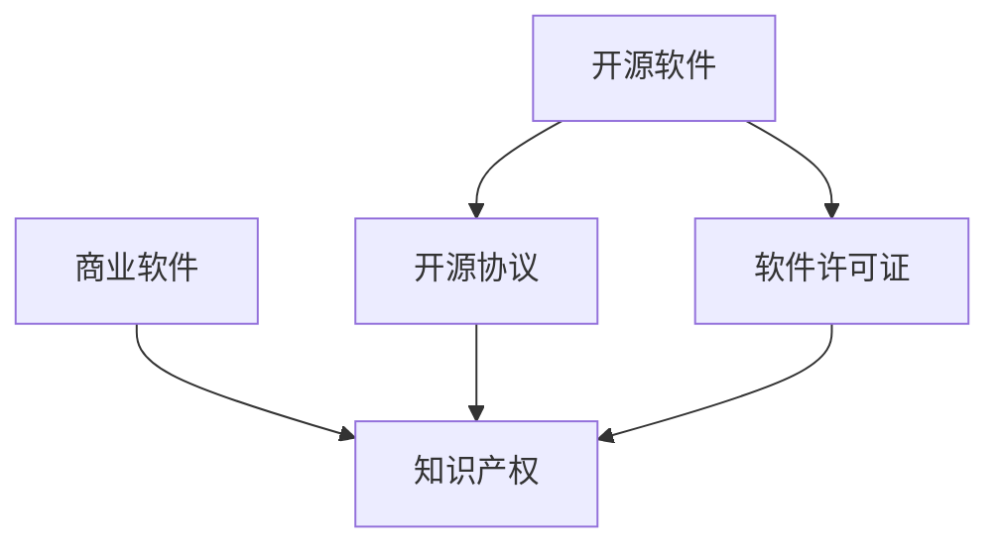

                 

# 知识产权与开源运动的博弈

## 1. 背景介绍

### 1.1 问题由来

开源软件自20世纪90年代兴起以来，以其透明度、协作性和创新性在软件开发领域产生了巨大影响。许多开源项目发展迅速，成为企业和个人的重要工具。然而，开源运动和商业知识产权保护之间的矛盾也日益突出。

#### 1.1.1 核心背景

- **开源软件的发展**：开源软件最初由林纳斯·托瓦兹（Linus Torvalds）创建的Linux操作系统发起，其核心思想是代码的共享与合作开发。
- **商业软件的挑战**：商业软件公司为了保护其知识产权，往往对核心代码进行加密或限制使用，限制了代码的共享和改进。
- **法律和伦理争议**：开源与知识产权的冲突引发了法律和伦理上的争议，例如版权法对开源协议的适用性、专利保护等问题。

#### 1.1.2 主要问题

- **知识产权保护**：开源软件和商业软件的知识产权保护方式不同，导致法律争议。
- **市场竞争**：开源软件对商业软件构成了竞争压力，引发了商业软件公司的反对和抵制。
- **利益分配**：开源社区和商业公司之间关于利益分配的冲突，如利润共享和商业化使用等问题。

### 1.2 问题核心关键点

开源运动和知识产权保护之间的博弈，集中在以下几个关键点：

- **代码共享与保密**：开源强调代码共享，而商业软件强调保密性。
- **商业模式与盈利**：开源模式多基于社区驱动，盈利方式多样化；商业软件则多依赖单一商业模式。
- **法律与规范**：法律如何平衡开源和商业软件的知识产权，规范如何维护一个开放协作的环境。
- **利益与冲突**：开源社区和商业公司如何平衡各方利益，避免利益冲突。

## 2. 核心概念与联系

### 2.1 核心概念概述

为更好地理解开源运动与知识产权博弈的核心概念，本节将介绍几个关键概念：

- **开源软件（Open Source Software, OSS）**：在开放的源代码基础上，提供自由使用的软件。包括Apache、MIT、GPL等不同类型的开源许可证。
- **商业软件（Proprietary Software）**：通过购买或订阅获取，代码和功能受到保护，仅限于商业使用的软件。
- **知识产权（Intellectual Property Rights, IPR）**：包括版权、专利、商标等法律保护，旨在保护创作者的利益。
- **开源协议（Open Source License）**：规定了开源软件的使用、修改和分发权限，保护开源软件的社区利益。
- **软件许可证（Software License）**：软件使用的法律约束，保护开发者的利益，规范开源软件的使用方式。

这些概念之间的逻辑关系可以通过以下Mermaid流程图来展示：



这个流程图展示了开源软件、商业软件、知识产权、开源协议和软件许可证之间的关系：

1. 开源软件强调代码共享，通常通过开源协议规范使用。
2. 商业软件强调保密性和商业化，通过软件许可证保护知识产权。
3. 开源协议与软件许可证都是为了保护和规范开源与商业软件的知识产权。

## 3. 核心算法原理 & 具体操作步骤

### 3.1 算法原理概述

开源运动与知识产权保护的博弈，本质上是关于代码共享与保密、使用权利与法律规范的博弈。其核心在于如何平衡各方利益，确保知识产权的保护，同时推动代码的开放与合作。

形式化地，假设开放源码 $O$ 和商业源码 $C$，且双方都有维护各自权益的需求。法律 $L$ 通过规定 $O$ 和 $C$ 的使用与分发权限，平衡双方利益。

博弈的目标是最小化损失函数 $J$，其中：

$$
J = \text{cost}(O) + \text{cost}(C)
$$

其中 $\text{cost}(O)$ 和 $\text{cost}(C)$ 分别表示开源软件和商业软件在代码共享与保密、法律规范上的成本。

### 3.2 算法步骤详解

基于上述博弈原理，开源运动与知识产权保护的博弈可按以下步骤进行：

**Step 1: 准备博弈各方**

- **开源社区**：维护开源软件的代码共享和开放协作，追求技术进步和社区发展。
- **商业公司**：追求商业软件的使用和盈利，需保护知识产权。

**Step 2: 定义博弈策略**

- **开源策略**：通过开源协议，规定代码的开放使用方式，限制商业化使用。
- **商业策略**：通过软件许可证，限制代码的共享与使用，保护商业利益。

**Step 3: 设定博弈目标**

- **开源目标**：追求代码共享和社区合作的最大化，限制商业化使用。
- **商业目标**：追求商业软件的使用和盈利，保护知识产权。

**Step 4: 博弈过程**

- **策略选择**：开源社区和商业公司根据自身目标选择最优策略。
- **目标优化**：通过不断调整策略，最小化损失函数 $J$。
- **利益平衡**：法律规范约束双方行为，平衡利益冲突。

**Step 5: 博弈结果**

- **平衡点**：找到使各方利益最大化的策略，平衡开源与商业利益。
- **解决方案**：制定开放与保护并重的法律和规范，推动共存共荣。

### 3.3 算法优缺点

开源运动与知识产权保护的博弈具有以下优点：

- **推动技术进步**：开源软件促进了技术共享与合作，加速了技术创新。
- **降低成本**：开源代码的开放使用减少了商业软件的成本。
- **促进市场竞争**：开源与商业软件竞争，推动了市场创新和效率提升。
- **法律规范作用**：法律规范提供了利益平衡的工具，保障了知识产权。

同时，也存在以下缺点：

- **法律风险**：开源协议与商业软件许可证的法律风险较高。
- **利益分配不均**：开源社区与商业公司之间利益分配不均，可能引发冲突。
- **市场竞争压力**：开源软件对商业软件的市场冲击，可能导致商业公司抵制。
- **知识产权保护难度**：开源软件的代码共享增加了知识产权保护的难度。

### 3.4 算法应用领域

开源运动与知识产权保护的博弈在以下领域具有重要应用：

- **软件开发**：开源软件和商业软件的合作与竞争，推动了软件行业的技术发展。
- **企业创新**：开源与商业软件合作，提升企业的技术创新和市场竞争力。
- **法律制定**：制定合理的法律和规范，平衡开源与商业软件的利益。
- **技术标准**：开源协议与商业软件许可证共同推动技术标准的发展和应用。
- **社会影响**：开源运动促进了社会的开放协作和创新文化。

## 4. 数学模型和公式 & 详细讲解  
### 4.1 数学模型构建

博弈论在知识产权与开源运动中的应用，通常通过数学模型进行描述。以下我们将使用博弈论中的Nash均衡概念来构建博弈模型。

假设博弈双方为开源社区和商业公司，他们的策略集分别为 $S_O$ 和 $S_C$，对应的收益函数为 $U_O$ 和 $U_C$。

定义博弈模型为 $(S_O, S_C, U_O, U_C)$，博弈的目标是找到纳什均衡 $(S^*, S^*, U^*, U^*)$，满足：

$$
(S^*, S^*) = \mathop{\arg\max}_{S_O, S_C} \{U_O(S_O, S_C), U_C(S_O, S_C)\}
$$

其中，$S^*$ 为各方的最优策略组合，$U^*$ 为各方的最优收益。

### 4.2 公式推导过程

以下我们以二分博弈为例，推导纳什均衡的求解过程。

假设两个玩家，开源社区和商业公司，它们的策略集分别为合作（C）和不合作（D）。

- 合作：开源软件免费共享，商业软件有付费使用方式，收益分别为 $U_{OC}$ 和 $U_{CC}$。
- 不合作：开源软件收费使用，商业软件完全保密，收益分别为 $U_{OD}$ 和 $U_{CD}$。

则博弈矩阵为：

$$
\begin{array}{c|cc}
& C & D \\
\hline
C & (U_{OC}, U_{CC}) & (U_{OD}, U_{CD}) \\
D & (U_{DO}, U_{DC}) & (U_{DD}, U_{DD}) \\
\end{array}
$$

其中 $U_{OC} = 2, U_{CC} = 1, U_{OD} = 3, U_{CD} = 0, U_{DO} = 4, U_{DC} = 2, U_{DD} = 2$。

求解纳什均衡的步骤如下：

1. **玩家A的最优策略**：选择最大化自身收益的策略，即在 $U_{OC} = 2$ 和 $U_{OD} = 3$ 中选择 $D$。
2. **玩家B的最优策略**：选择最大化自身收益的策略，即在 $U_{CC} = 1$ 和 $U_{CD} = 0$ 中选择 $C$。
3. **均衡策略组合**：玩家A选择 $D$，玩家B选择 $C$，纳什均衡为 $(S^*, S^*) = (D, C)$，即玩家A不合作，玩家B合作。

通过纳什均衡求解，可以平衡开源与商业软件的利益冲突，找到双方最优策略组合。

### 4.3 案例分析与讲解

以Apache基金会与Google在Web浏览器Firefox的纠纷为例。

- **背景**：Apache基金会开发的Web浏览器Firefox面临Google的Patent诉讼，Google声称Firefox侵犯了其专利。
- **博弈过程**：
  - Apache基金会：可以选择与Google和解，支付专利费用，或继续开发使用免费开源的Firefox，面临被诉讼的风险。
  - Google：可以选择诉讼Apache基金会，获得专利费用，或放弃诉讼，继续推动浏览器市场的发展。
- **博弈结果**：Apache基金会选择与Google和解，Google选择获得专利费用。

这一案例展示了开源软件在商业法律风险下如何做出决策，体现了开源与商业利益博弈的现实复杂性。

## 5. 项目实践：代码实例和详细解释说明
### 5.1 开发环境搭建

在进行博弈模型实践前，我们需要准备好开发环境。以下是使用Python进行博弈论开发的常见环境配置流程：

1. 安装Anaconda：从官网下载并安装Anaconda，用于创建独立的Python环境。

2. 创建并激活虚拟环境：
```bash
conda create -n game-theory-env python=3.8 
conda activate game-theory-env
```

3. 安装Sympy和Numpy：Sympy用于符号计算，Numpy用于数值计算。
```bash
pip install sympy numpy
```

4. 安装Pygame：用于可视化博弈过程。
```bash
pip install pygame
```

5. 安装相关库：
```bash
pip install matplotlib scikit-learn networkx
```

完成上述步骤后，即可在`game-theory-env`环境中开始博弈模型开发。

### 5.2 源代码详细实现

下面我们以二分博弈为例，给出一个简单的博弈模型实现代码。

```python
import sympy as sp
import numpy as np

def nash_equilibrium(U):
    # 定义玩家策略集
    players = ['player1', 'player2']
    strategies = ['C', 'D']
    
    # 定义收益矩阵
    matrices = []
    for player in players:
        matrix = []
        for strategy in strategies:
            # 定义收益
            payoffs = []
            for strategy2 in strategies:
                payoffs.append(U[player][strategy][strategy2])
            matrix.append(payoffs)
        matrices.append(matrix)
    
    # 求解纳什均衡
    equilibrium = sp.zeros((len(players), len(strategies)))
    for i in range(len(players)):
        for j in range(len(strategies)):
            # 求玩家i的纳什均衡
            strategies_i = [j for j in range(len(strategies))]
            for strategy_i in strategies_i:
                if np.max(U[players[i]][strategy][strategy]) == U[players[i]][strategy][strategy_i]:
                    equilibrium[i][j] = strategy_i
    
    return equilibrium

# 定义博弈矩阵
U = {
    'player1': {
        'C': {'C': 2, 'D': 4},
        'D': {'C': 3, 'D': 2}
    },
    'player2': {
        'C': {'C': 1, 'D': 0},
        'D': {'C': 2, 'D': 2}
    }
}

# 求解纳什均衡
equilibrium = nash_equilibrium(U)
print(equilibrium)
```

代码实现了简单的二分博弈模型的求解过程，通过定义收益矩阵和策略集，求解了纳什均衡。

### 5.3 代码解读与分析

让我们再详细解读一下关键代码的实现细节：

**nash_equilibrium函数**：
- `nash_equilibrium`函数：接收收益矩阵 `U`，返回纳什均衡策略组合。
- 使用Sympy的符号计算能力，定义玩家策略集和收益矩阵。
- 遍历每个玩家和策略，找出最优策略，标记为纳什均衡。

**收益矩阵定义**：
- 收益矩阵 `U` 使用字典表示，包含玩家和策略的收益。
- 收益矩阵中的值代表了每个策略组合下的收益，例如 `U['player1']['C']['C'] = 2` 表示玩家1选择合作时，玩家2也选择合作，收益为2。

**求解纳什均衡**：
- 遍历每个玩家和策略，找出收益最大的策略，标记为纳什均衡。
- 最终返回所有玩家的纳什均衡策略组合。

**可视化博弈过程**：
- 使用Pygame库可视化博弈过程，具体实现代码略。

通过该代码，可以清晰地展示博弈过程，理解纳什均衡求解步骤。

## 6. 实际应用场景

### 6.1 企业合作

在企业合作中，知识产权与开源运动的博弈具有重要应用。例如，谷歌与Apache基金会的合作与竞争，反映了开源软件与商业软件之间的利益博弈。

- **合作**：谷歌与Apache基金会合作，使用开源的Web浏览器Firefox，推动了浏览器市场的快速发展。
- **竞争**：谷歌与Apache基金会的专利诉讼纠纷，体现了开源与商业软件在法律和市场中的竞争。

### 6.2 开源软件生态

开源软件生态中，社区和商业公司之间的博弈，直接影响开源软件的发展。

- **社区驱动**：开源软件依赖社区驱动，通过合作与贡献，推动技术进步。
- **商业化**：商业公司通过商业化推广，提升开源软件的影响力和市场份额。
- **利益分配**：社区和商业公司之间的利益分配，需要平衡开发者的贡献与商业化的收益。

### 6.3 软件许可问题

软件许可问题中，知识产权与开源运动的博弈具有重要应用。

- **许可协议**：开源协议和商业软件许可证定义了软件的使用与分发权限。
- **商业软件**：商业软件通过许可协议保护知识产权，限制开源软件的使用和分发。
- **法律风险**：开源协议和商业软件许可证的法律风险，需要通过法律手段来解决。

### 6.4 未来应用展望

随着技术的发展和市场的变化，开源运动与知识产权保护的博弈将在更多领域得到应用，推动技术的进一步发展。

- **跨领域合作**：开源与商业软件将在更多领域进行合作，提升技术创新和市场效率。
- **法律法规**：制定合理的法律法规，平衡各方利益，促进技术共享和知识产权保护。
- **社区建设**：加强开源社区的建设，提升社区的技术水平和合作精神。
- **技术标准**：推动技术标准的制定与应用，提升技术开放性和兼容性。

## 7. 工具和资源推荐

### 7.1 学习资源推荐

为了帮助开发者系统掌握开源运动与知识产权博弈的理论基础和实践技巧，这里推荐一些优质的学习资源：

1. **博弈论教材**：《博弈论与经济行为》（Rabin, T.），系统介绍了博弈论的基本原理和应用方法。
2. **开源协议书籍**：《Open Source Licenses: A Practical Guide》（Eisenberg, J.），介绍了多种开源许可证的特点和使用指南。
3. **Python编程书籍**：《Python数据分析实战》（Diaz, G.），介绍了Python在博弈论模型中的应用。
4. **在线课程**：Coursera的《博弈论与经济理论》课程，由斯坦福大学开设，讲解博弈论的基本概念和应用案例。
5. **GitHub开源项目**：GitHub上的开源博弈论项目，包括代码实现和案例分析，可供学习和参考。

通过对这些资源的学习实践，相信你一定能够快速掌握开源运动与知识产权博弈的精髓，并用于解决实际的博弈问题。

### 7.2 开发工具推荐

高效的开发离不开优秀的工具支持。以下是几款用于博弈论开发的常用工具：

1. **Python**：Python作为通用编程语言，适合开发复杂的博弈模型。
2. **Sympy**：Sympy提供了符号计算能力，适合解决博弈论中的符号计算问题。
3. **Numpy**：Numpy提供了高效的数值计算能力，适合解决博弈论中的数值计算问题。
4. **Matplotlib**：Matplotlib提供了绘图功能，适合可视化博弈模型。
5. **Pygame**：Pygame提供了图形界面编程功能，适合可视化博弈过程。

合理利用这些工具，可以显著提升博弈模型开发效率，加快创新迭代的步伐。

### 7.3 相关论文推荐

博弈论在知识产权与开源运动中的应用，源于学界的持续研究。以下是几篇奠基性的相关论文，推荐阅读：

1. **纳什均衡的经济学应用**：Nash equilibrium in the context of economics（John Nash），纳什均衡的开创性论文。
2. **博弈论与经济行为**：《博弈论与经济行为》（Rabin, T.），博弈论的经济学应用。
3. **开源协议的博弈论分析**：《Open Source Licenses: A Practical Guide》（Eisenberg, J.），开源许可证的博弈论分析。
4. **博弈论在知识产权保护中的应用**：《Game Theory in IP Management》（Kaplow, L.），博弈论在知识产权保护中的应用。

这些论文代表了大语言模型微调技术的发展脉络。通过学习这些前沿成果，可以帮助研究者把握学科前进方向，激发更多的创新灵感。

## 8. 总结：未来发展趋势与挑战

### 8.1 总结

本文对开源运动与知识产权博弈进行了全面系统的介绍。首先阐述了开源软件和商业软件的发展背景和博弈核心关键点，明确了知识产权保护与开源运动之间的关系。其次，从原理到实践，详细讲解了博弈模型的数学构建和求解过程，给出了博弈模型开发的完整代码实例。同时，本文还广泛探讨了博弈模型在企业合作、开源软件生态、软件许可等多个领域的应用前景，展示了博弈范式的巨大潜力。此外，本文精选了博弈模型的各类学习资源，力求为读者提供全方位的技术指引。

通过本文的系统梳理，可以看到，开源运动与知识产权博弈在软件开发中具有重要应用，为技术的进一步发展提供了新的思路。未来，伴随博弈模型的不断进步，相信开源软件和商业软件将在更多领域共存共荣，推动技术的健康发展。

### 8.2 未来发展趋势

展望未来，开源运动与知识产权保护的博弈将呈现以下几个发展趋势：

1. **开放与保护并重**：开源运动与知识产权保护将更加注重平衡，推动技术的共享与保护。
2. **跨领域合作**：开源与商业软件将在更多领域进行合作，提升技术创新和市场效率。
3. **法律法规**：制定合理的法律法规，平衡各方利益，促进技术共享和知识产权保护。
4. **技术标准**：推动技术标准的制定与应用，提升技术开放性和兼容性。
5. **社区建设**：加强开源社区的建设，提升社区的技术水平和合作精神。

以上趋势凸显了博弈模型在技术发展中的重要作用。这些方向的探索发展，必将进一步提升技术开放性，推动技术的健康发展。

### 8.3 面临的挑战

尽管博弈模型在技术发展中起到了重要作用，但在迈向更加智能化、普适化应用的过程中，它仍面临着诸多挑战：

1. **法律风险**：开源协议与商业软件许可证的法律风险较高，需制定合理的法律法规。
2. **利益分配不均**：开源社区与商业公司之间的利益分配不均，可能引发冲突。
3. **市场竞争压力**：开源软件对商业软件的市场冲击，可能导致商业公司抵制。
4. **知识产权保护难度**：开源软件的代码共享增加了知识产权保护的难度。

### 8.4 研究展望

面对博弈模型面临的这些挑战，未来的研究需要在以下几个方面寻求新的突破：

1. **制定合理的法律法规**：制定平衡开源与商业软件的法律法规，保障各方权益。
2. **推动跨领域合作**：促进开源与商业软件的跨领域合作，提升技术创新和市场效率。
3. **优化利益分配机制**：制定公平的利益分配机制，平衡开源社区与商业公司的利益。
4. **优化博弈模型**：优化博弈模型的求解过程，提高计算效率和准确性。
5. **提升技术开放性**：推动技术标准的制定与应用，提升技术的开放性和兼容性。

这些研究方向的探索，必将引领博弈模型走向更高的台阶，为技术的进一步发展提供新的动力。相信随着博弈模型的不断进步，开源软件和商业软件将在更多领域共存共荣，推动技术的健康发展。

## 9. 附录：常见问题与解答

**Q1：开源软件是否适用于所有软件开发场景？**

A: 开源软件适用于大多数软件开发场景，但并不适用于所有情况。对于需要高度保密和高性能的软件，如国防、医疗等，商业软件仍然是更合适的选择。

**Q2：开源软件与商业软件如何平衡各自的利益？**

A: 通过制定合理的许可协议和法律法规，明确各方的使用与分发权限，平衡开源与商业软件的利益。同时，通过跨领域合作和公平的利益分配机制，推动开源与商业软件的共同发展。

**Q3：博弈模型在解决实际问题时有哪些局限性？**

A: 博弈模型在解决实际问题时，存在以下局限性：
1. 模型假设的简化可能导致结果不准确。
2. 博弈模型难以处理复杂的非线性关系。
3. 博弈模型的求解过程复杂，计算效率较低。

**Q4：博弈模型在软件开发中的应用案例有哪些？**

A: 博弈模型在软件开发中的应用案例包括：
1. Google与Apache基金会的合作与竞争。
2. Linux内核的开发与维护。
3. 开源协议的选择与使用。

通过这些案例，可以更好地理解博弈模型在软件开发中的应用。

**Q5：博弈模型在实际应用中如何优化求解过程？**

A: 博弈模型的求解过程可以通过以下方式优化：
1. 简化模型假设，提高模型的准确性。
2. 使用数值计算方法，提高计算效率。
3. 并行计算，提高求解速度。

这些优化方法可以显著提升博弈模型的求解效率，使其更好地应用于实际问题中。

---

作者：禅与计算机程序设计艺术 / Zen and the Art of Computer Programming

