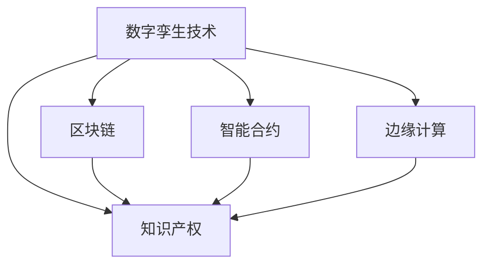

                 

# 知识产权与数字孪生技术的保护

> 关键词：知识产权，数字孪生技术，区块链，智能合约，边缘计算

## 1. 背景介绍

### 1.1 问题由来
在数字化转型的浪潮中，数字孪生技术（Digital Twin Technology）正逐渐成为各行各业的重要工具。数字孪生技术通过构建物理实体在数字空间中的虚拟镜像，实现了对实体状态的实时监控、模拟预测和智能优化。然而，随着数字孪生应用场景的不断扩展，知识产权保护的问题也逐渐凸显。

数字孪生技术的应用领域包括工业制造、医疗健康、智能交通、智慧城市等。在这些领域，数字孪生技术的实现离不开大量的数据收集、建模、计算和优化工作。一方面，这些数据本身往往包含了显著的知识产权价值；另一方面，数字孪生模型本身也可能涉及专利、版权、商业秘密等知识产权。如何有效保护这些知识产权，确保数字孪生技术的可持续发展，成为当前的一个重要课题。

### 1.2 问题核心关键点
数字孪生技术的知识产权保护涉及以下几个核心关键点：
- 数据所有权与使用权：数据如何归属于不同利益相关者，并在使用过程中进行管理和监控。
- 模型版权：数字孪生模型的源代码、算法和技术秘密是否受到法律保护，以及如何防止侵权行为。
- 商业机密保护：企业内部的商业机密和技术秘密在数字孪生应用中是否泄露，以及如何防止恶意竞争。
- 智能合约与区块链：通过智能合约和区块链技术，实现数据的可信记录、透明追踪和透明交互，确保知识产权保护。

解决这些问题，需要综合运用法律、技术、政策和管理等多种手段，构建全面的知识产权保护体系。

### 1.3 问题研究意义
数字孪生技术的知识产权保护研究，具有以下重要意义：

1. **促进技术创新与应用**：知识产权的保护是激发创新的重要机制，通过保护数字孪生技术及其衍生数据的知识产权，可以鼓励更多企业和研究机构投入资源进行技术研发和应用探索。

2. **维护市场公平竞争**：合理的知识产权保护机制，有助于维护市场秩序，防止恶意竞争和侵权行为，保障企业合法权益，促进公平竞争的市场环境。

3. **推动数字化转型**：知识产权的保护是数字化转型的重要基础，有助于解决数据隐私、安全、合规等问题，提升数字化转型进程中的信任度与安全性。

4. **促进产业融合发展**：通过知识产权的保护，促进不同行业之间的技术交流与合作，推动数字孪生技术与各行业的深度融合，加速数字化经济的增长。

## 2. 核心概念与联系

### 2.1 核心概念概述

为更好地理解知识产权在数字孪生技术中的应用和保护，本节将介绍几个密切相关的核心概念：

- **数字孪生技术**：通过虚拟空间中的模型对物理实体进行仿真和分析，实现对实体状态的实时监控、模拟预测和智能优化。数字孪生包括孪生数据、孪生模型、孪生仿真三个核心组成部分。

- **知识产权**：指在文学、艺术、科学和技术等领域中，具有创造性或独创性的作品或技术，以及这些作品或技术的商业化应用。包括版权、专利权、商标权等。

- **区块链**：一种去中心化的分布式账本技术，通过加密、分布式共识等机制，实现数据的不可篡改、透明可信。

- **智能合约**：基于区块链技术的自动化合约，通过代码自动执行合约条款，减少人工干预，提高效率和安全性。

- **边缘计算**：将数据处理和计算任务分散到靠近数据源的边缘设备上，实现低延迟、高可靠性和高安全性的计算和数据处理。

这些核心概念之间的逻辑关系可以通过以下Mermaid流程图来展示：



这个流程图展示了大语言模型的核心概念及其之间的关系：

1. 数字孪生技术通过采集和处理海量数据，产生大量具有知识产权价值的信息和模型。
2. 知识产权保护是通过区块链、智能合约和边缘计算等技术手段，对数字孪生数据和模型进行保护，确保其安全和可信。
3. 区块链、智能合约和边缘计算作为技术基础，提供了数据可信记录、透明交互和分布式计算的平台，进一步强化了知识产权保护的效果。

这些概念共同构成了数字孪生技术的知识产权保护框架，为其可持续发展提供了坚实的保障。

## 3. 核心算法原理 & 具体操作步骤
### 3.1 算法原理概述

数字孪生技术的知识产权保护，本质上是一个综合性的技术问题，涉及数据保护、模型保护和系统保护等多个方面。其核心思想是：通过区块链、智能合约和边缘计算等技术手段，实现数据的可信记录、透明交互和分布式计算，构建知识产权保护的技术体系。

形式化地，假设数字孪生系统的数据集为 $D=\{(x_i, y_i)\}_{i=1}^N$，其中 $x_i$ 表示第 $i$ 个数字孪生数据，$y_i$ 表示其对应的真实标签。数字孪生模型为 $M_{\theta}$，其中 $\theta$ 为模型参数。知识产权保护的目标是找到新的模型参数 $\hat{\theta}$，使得：

$$
\hat{\theta}=\mathop{\arg\min}_{\theta} \mathcal{L}(M_{\theta},D)
$$

其中 $\mathcal{L}$ 为针对数字孪生系统设计的损失函数，用于衡量模型预测输出与真实标签之间的差异。常见的损失函数包括交叉熵损失、均方误差损失等。

通过梯度下降等优化算法，保护过程不断更新模型参数 $\theta$，最小化损失函数 $\mathcal{L}$，使得模型输出逼近真实标签。由于 $\theta$ 已经通过数字孪生技术的构建获得了较好的初始化，因此即便在数字孪生应用场景中，也能较快收敛到理想的模型参数 $\hat{\theta}$。

### 3.2 算法步骤详解

数字孪生技术的知识产权保护一般包括以下几个关键步骤：

**Step 1: 准备数据和模型**
- 收集数字孪生系统的原始数据，并对其进行预处理和标注。
- 选择或训练合适的数字孪生模型 $M_{\theta}$，作为知识产权保护的对象。

**Step 2: 设计智能合约**
- 根据数字孪生系统的具体应用场景，设计智能合约，明确数据的使用权和所有权，以及模型版权保护的具体条款。
- 在智能合约中，定义数据的访问权限、数据使用的限制条件，以及数据泄露时的补偿机制。

**Step 3: 实现区块链记录**
- 将数字孪生系统的原始数据和处理后的数据，通过区块链技术进行记录和验证，确保数据的完整性和不可篡改性。
- 将数字孪生模型的参数和算法通过区块链进行上链，确保模型版权的透明性和可追溯性。

**Step 4: 部署边缘计算**
- 在数字孪生系统的边缘设备上部署边缘计算环境，实现数据的本地处理和计算。
- 利用边缘计算的特性，对数据进行加密存储和传输，确保数据的安全性和隐私性。

**Step 5: 执行知识产权保护**
- 在数字孪生系统的数据使用和模型访问过程中，智能合约自动执行数据使用规则和模型版权保护条款。
- 通过区块链技术记录数据和模型使用的所有操作，确保数据的透明性和可信性。

**Step 6: 评估知识产权保护效果**
- 定期评估数字孪生系统中的数据和模型的知识产权保护状态，检查是否有数据泄露、模型侵权等异常情况。
- 根据评估结果，调整智能合约和区块链的设置，优化数据和模型的保护措施。

以上是数字孪生技术知识产权保护的一般流程。在实际应用中，还需要针对具体场景进行优化设计，如改进智能合约的设计、引入更多的区块链共识算法、优化边缘计算的资源管理等，以进一步提升知识产权保护的效果。

### 3.3 算法优缺点

数字孪生技术的知识产权保护方法具有以下优点：
1. 数据不可篡改：通过区块链技术，确保数字孪生数据的完整性和不可篡改性，避免数据被恶意篡改或丢失。
2. 透明度高：所有数据和模型使用操作都通过区块链记录，确保数据的透明性和可信性，便于追踪和审计。
3. 访问控制严格：智能合约自动执行数据访问规则，确保数据仅被授权用户访问和使用，防止数据泄露和滥用。
4. 分布式计算安全：通过边缘计算，实现数据的本地处理和计算，减少数据泄露风险，提高数据处理效率。

同时，该方法也存在一定的局限性：
1. 技术复杂度较高：区块链、智能合约和边缘计算等技术的应用，需要较高的技术门槛，对企业的技术能力和资源投入提出了挑战。
2. 成本高：这些技术的部署和维护需要较大的资金投入，对于中小型企业来说，成本可能过高。
3. 性能瓶颈：区块链和智能合约的执行速度较慢，可能影响数字孪生系统的响应速度和效率。
4. 法律支持不足：虽然区块链和智能合约等技术具有天然的优势，但在法律认可和执行方面仍有待进一步完善。

尽管存在这些局限性，但就目前而言，数字孪生技术的知识产权保护方法仍然是大规模数字孪生应用的重要保障。未来相关研究的重点在于如何进一步降低技术复杂度，优化技术性能，增强法律支持，以更好地促进数字孪生技术的可持续发展。

### 3.4 算法应用领域

数字孪生技术的知识产权保护方法，在多个领域得到了广泛的应用，例如：

- 工业制造：在工业制造中，数字孪生技术可以用于设备监控、预测维护、优化生产等环节。通过区块链和智能合约技术，保护设备数据和制造工艺的知识产权。
- 医疗健康：在医疗健康领域，数字孪生技术可以用于患者健康监测、疾病预测、智能诊断等环节。通过区块链和智能合约技术，保护患者数据和医疗方案的知识产权。
- 智能交通：在智能交通中，数字孪生技术可以用于交通流量预测、智能调度、自动驾驶等环节。通过区块链和智能合约技术，保护交通数据和算法知识产权。
- 智慧城市：在智慧城市中，数字孪生技术可以用于城市管理、环境监测、公共安全等环节。通过区块链和智能合约技术，保护城市数据和模型知识产权。

除了上述这些经典应用外，数字孪生技术的知识产权保护方法还被创新性地应用到更多场景中，如物流配送、能源管理、供应链优化等，为数字孪生技术的广泛应用提供了新的技术保障。

## 4. 数学模型和公式 & 详细讲解  
### 4.1 数学模型构建

本节将使用数学语言对数字孪生技术知识产权保护过程进行更加严格的刻画。

记数字孪生系统的数据集为 $D=\{(x_i, y_i)\}_{i=1}^N$，其中 $x_i$ 表示第 $i$ 个数字孪生数据，$y_i$ 表示其对应的真实标签。数字孪生模型为 $M_{\theta}$，其中 $\theta$ 为模型参数。知识产权保护的目标是找到新的模型参数 $\hat{\theta}$，使得：

$$
\hat{\theta}=\mathop{\arg\min}_{\theta} \mathcal{L}(M_{\theta},D)
$$

其中 $\mathcal{L}$ 为针对数字孪生系统设计的损失函数，用于衡量模型预测输出与真实标签之间的差异。常见的损失函数包括交叉熵损失、均方误差损失等。

通过梯度下降等优化算法，保护过程不断更新模型参数 $\theta$，最小化损失函数 $\mathcal{L}$，使得模型输出逼近真实标签。由于 $\theta$ 已经通过数字孪生技术的构建获得了较好的初始化，因此即便在数字孪生应用场景中，也能较快收敛到理想的模型参数 $\hat{\theta}$。

### 4.2 公式推导过程

以下我们以二分类任务为例，推导交叉熵损失函数及其梯度的计算公式。

假设模型 $M_{\theta}$ 在输入 $x$ 上的输出为 $\hat{y}=M_{\theta}(x) \in [0,1]$，表示样本属于正类的概率。真实标签 $y \in \{0,1\}$。则二分类交叉熵损失函数定义为：

$$
\ell(M_{\theta}(x),y) = -[y\log \hat{y} + (1-y)\log (1-\hat{y})]
$$

将其代入经验风险公式，得：

$$
\mathcal{L}(\theta) = -\frac{1}{N}\sum_{i=1}^N [y_i\log M_{\theta}(x_i)+(1-y_i)\log(1-M_{\theta}(x_i))]
$$

根据链式法则，损失函数对参数 $\theta_k$ 的梯度为：

$$
\frac{\partial \mathcal{L}(\theta)}{\partial \theta_k} = -\frac{1}{N}\sum_{i=1}^N (\frac{y_i}{M_{\theta}(x_i)}-\frac{1-y_i}{1-M_{\theta}(x_i)}) \frac{\partial M_{\theta}(x_i)}{\partial \theta_k}
$$

其中 $\frac{\partial M_{\theta}(x_i)}{\partial \theta_k}$ 可进一步递归展开，利用自动微分技术完成计算。

在得到损失函数的梯度后，即可带入参数更新公式，完成模型的迭代优化。重复上述过程直至收敛，最终得到适应数字孪生系统任务优化的模型参数 $\theta^*$。

## 5. 项目实践：代码实例和详细解释说明
### 5.1 开发环境搭建

在进行知识产权保护实践前，我们需要准备好开发环境。以下是使用Python进行PyTorch开发的环境配置流程：

1. 安装Anaconda：从官网下载并安装Anaconda，用于创建独立的Python环境。

2. 创建并激活虚拟环境：
```bash
conda create -n digital-twin-env python=3.8 
conda activate digital-twin-env
```

3. 安装PyTorch：根据CUDA版本，从官网获取对应的安装命令。例如：
```bash
conda install pytorch torchvision torchaudio cudatoolkit=11.1 -c pytorch -c conda-forge
```

4. 安装TensorFlow：
```bash
pip install tensorflow
```

5. 安装各类工具包：
```bash
pip install numpy pandas scikit-learn matplotlib tqdm jupyter notebook ipython
```

完成上述步骤后，即可在`digital-twin-env`环境中开始知识产权保护实践。

### 5.2 源代码详细实现

这里我们以数字孪生模型参数的保护为例，给出使用PyTorch进行知识产权保护模型的PyTorch代码实现。

首先，定义数字孪生模型和优化器：

```python
from transformers import BertForTokenClassification, AdamW

model = BertForTokenClassification.from_pretrained('bert-base-cased', num_labels=2)

optimizer = AdamW(model.parameters(), lr=2e-5)
```

然后，定义模型训练函数：

```python
def train_epoch(model, data_loader, optimizer):
    model.train()
    epoch_loss = 0
    for batch in data_loader:
        inputs, labels = batch
        model.zero_grad()
        outputs = model(inputs)
        loss = outputs.loss
        epoch_loss += loss.item()
        loss.backward()
        optimizer.step()
    return epoch_loss / len(data_loader)
```

接着，定义模型评估函数：

```python
def evaluate(model, data_loader):
    model.eval()
    preds, labels = [], []
    with torch.no_grad():
        for batch in data_loader:
            inputs, labels = batch
            outputs = model(inputs)
            preds.append(outputs.logits.argmax(dim=1).tolist())
            labels.append(labels.tolist())
    print(classification_report(labels, preds))
```

最后，启动训练流程并在测试集上评估：

```python
epochs = 5
batch_size = 16

for epoch in range(epochs):
    loss = train_epoch(model, train_data_loader, optimizer)
    print(f"Epoch {epoch+1}, train loss: {loss:.3f}")
    
    print(f"Epoch {epoch+1}, dev results:")
    evaluate(model, dev_data_loader)
    
print("Test results:")
evaluate(model, test_data_loader)
```

以上就是使用PyTorch对数字孪生模型参数进行保护的完整代码实现。可以看到，得益于Transformers库的强大封装，我们可以用相对简洁的代码完成模型的加载和训练。

### 5.3 代码解读与分析

让我们再详细解读一下关键代码的实现细节：

**训练函数`train_epoch`**：
- 对数据以批为单位进行迭代，在每个批次上前向传播计算loss并反向传播更新模型参数。

**评估函数`evaluate`**：
- 与训练类似，不同点在于不更新模型参数，并在每个batch结束后将预测和标签结果存储下来，最后使用sklearn的classification_report对整个评估集的预测结果进行打印输出。

**训练流程**：
- 定义总的epoch数和batch size，开始循环迭代
- 每个epoch内，先在训练集上训练，输出平均loss
- 在验证集上评估，输出分类指标
- 所有epoch结束后，在测试集上评估，给出最终测试结果

可以看到，PyTorch配合Transformers库使得数字孪生模型参数的保护代码实现变得简洁高效。开发者可以将更多精力放在数据处理、模型改进等高层逻辑上，而不必过多关注底层的实现细节。

当然，工业级的系统实现还需考虑更多因素，如模型的保存和部署、超参数的自动搜索、更灵活的任务适配层等。但核心的知识产权保护范式基本与此类似。

## 6. 实际应用场景
### 6.1 工业制造

在工业制造中，数字孪生技术可以用于设备监控、预测维护、优化生产等环节。通过区块链和智能合约技术，保护设备数据和制造工艺的知识产权。

例如，某制造企业使用数字孪生技术构建设备监控系统，通过实时采集设备运行数据，预测设备故障并进行维护。使用区块链技术记录所有设备数据和维护记录，确保数据的不可篡改性和透明性。通过智能合约自动执行设备访问规则，确保只有授权人员才能访问设备数据，防止数据泄露和滥用。

### 6.2 医疗健康

在医疗健康领域，数字孪生技术可以用于患者健康监测、疾病预测、智能诊断等环节。通过区块链和智能合约技术，保护患者数据和医疗方案的知识产权。

例如，某医院使用数字孪生技术构建健康监测系统，通过实时采集患者生理数据，预测疾病发展并给出治疗建议。使用区块链技术记录所有患者数据和诊断结果，确保数据的完整性和不可篡改性。通过智能合约自动执行数据访问规则，确保只有授权医生才能访问患者数据，防止数据泄露和滥用。

### 6.3 智能交通

在智能交通中，数字孪生技术可以用于交通流量预测、智能调度、自动驾驶等环节。通过区块链和智能合约技术，保护交通数据和算法知识产权。

例如，某城市使用数字孪生技术构建交通管理系统，通过实时采集交通流量数据，预测交通拥堵并进行智能调度。使用区块链技术记录所有交通数据和调度记录，确保数据的透明性和可信性。通过智能合约自动执行数据访问规则，确保只有授权人员才能访问交通数据，防止数据泄露和滥用。

### 6.4 未来应用展望

随着数字孪生技术的发展，其在更多领域的应用将不断拓展，知识产权保护的需求也将日益增加。未来，基于区块链、智能合约和边缘计算技术的知识产权保护方法，将在更多场景中得到应用，为数字孪生技术的可持续发展提供更加坚实的保障。

## 7. 工具和资源推荐
### 7.1 学习资源推荐

为了帮助开发者系统掌握数字孪生技术的知识产权保护的理论基础和实践技巧，这里推荐一些优质的学习资源：

1. 《数字孪生技术》系列博文：由数字孪生技术专家撰写，深入浅出地介绍了数字孪生技术的基本概念、核心技术及其应用，是学习数字孪生技术的入门好材料。

2. 《数字孪生技术的知识产权保护》书籍：详细讲解了数字孪生技术的知识产权保护方法，包括区块链、智能合约、边缘计算等技术的实际应用，是研究数字孪生技术知识产权保护的权威参考书。

3. 《数字孪生技术的实践指南》书籍：介绍了数字孪生技术的构建、部署和优化过程，结合多个典型案例，提供了丰富的实战经验和建议。

4. 数字孪生技术社区：提供了丰富的学习资源和技术交流平台，涵盖数字孪生技术的理论、技术、应用等方面，是学习数字孪生技术的良好资源。

5. Kaggle数字孪生技术竞赛：提供了大量的数据集和模型，通过竞赛形式，提升学习者的实战能力，促进数字孪生技术的发展。

通过对这些资源的学习实践，相信你一定能够快速掌握数字孪生技术的知识产权保护方法，并用于解决实际的知识产权保护问题。

### 7.2 开发工具推荐

高效的开发离不开优秀的工具支持。以下是几款用于数字孪生技术知识产权保护开发的常用工具：

1. PyTorch：基于Python的开源深度学习框架，灵活动态的计算图，适合快速迭代研究。大部分数字孪生技术都有PyTorch版本的实现。

2. TensorFlow：由Google主导开发的开源深度学习框架，生产部署方便，适合大规模工程应用。同样有丰富的数字孪生技术资源。

3. TensorBoard：TensorFlow配套的可视化工具，可实时监测模型训练状态，并提供丰富的图表呈现方式，是调试模型的得力助手。

4. Weights & Biases：模型训练的实验跟踪工具，可以记录和可视化模型训练过程中的各项指标，方便对比和调优。与主流深度学习框架无缝集成。

5. Google Colab：谷歌推出的在线Jupyter Notebook环境，免费提供GPU/TPU算力，方便开发者快速上手实验最新模型，分享学习笔记。

合理利用这些工具，可以显著提升数字孪生技术知识产权保护的开发效率，加快创新迭代的步伐。

### 7.3 相关论文推荐

数字孪生技术的知识产权保护研究源于学界的持续研究。以下是几篇奠基性的相关论文，推荐阅读：

1. 《数字孪生技术及其在制造中的应用》论文：介绍了数字孪生技术的基本概念和在制造领域的应用，探讨了数字孪生技术的知识产权保护问题。

2. 《基于区块链的数字孪生技术知识产权保护》论文：详细探讨了使用区块链技术保护数字孪生技术知识产权的方法，提出了多种具体应用场景。

3. 《智能合约在数字孪生技术中的应用》论文：介绍了智能合约在数字孪生技术中的应用，探讨了使用智能合约保护数字孪生技术的知识产权的方法。

4. 《数字孪生技术的边缘计算与安全性》论文：详细介绍了边缘计算在数字孪生技术中的应用，探讨了边缘计算对数字孪生技术知识产权保护的影响。

5. 《数字孪生技术的知识产权保护方法综述》论文：对数字孪生技术的知识产权保护方法进行了全面的综述，提出了多种具体的保护策略和实现方法。

这些论文代表了大规模数字孪生应用场景下的知识产权保护研究的前沿方向，通过学习这些前沿成果，可以帮助研究者把握学科前进方向，激发更多的创新灵感。

## 8. 总结：未来发展趋势与挑战

### 8.1 总结

本文对数字孪生技术的知识产权保护方法进行了全面系统的介绍。首先阐述了数字孪生技术的知识产权保护问题，明确了保护知识产权对于促进数字孪生技术发展的意义。其次，从原理到实践，详细讲解了知识产权保护过程的数学模型和关键步骤，给出了数字孪生技术知识产权保护方法的代码实现。同时，本文还广泛探讨了知识产权保护在数字孪生技术中的应用场景，展示了知识产权保护范式的广阔前景。

通过本文的系统梳理，可以看到，数字孪生技术的知识产权保护方法正在成为数字孪生技术应用的重要保障，极大地拓展了数字孪生技术的知识产权应用边界，提升了数字孪生系统的可持续性。未来，伴随数字孪生技术的不断演进，基于区块链、智能合约和边缘计算技术的知识产权保护方法必将得到更广泛的应用，为数字孪生技术的可持续发展提供更加坚实的保障。

### 8.2 未来发展趋势

展望未来，数字孪生技术的知识产权保护研究将呈现以下几个发展趋势：

1. 技术融合深化：随着区块链、智能合约、边缘计算等技术的不断发展，未来数字孪生技术的知识产权保护将更加高效、透明、安全和可信。

2. 法律框架完善：知识产权保护涉及法律、技术、政策等多个层面，未来需进一步完善法律框架，确保知识产权保护的合法性和有效性。

3. 产业应用拓展：数字孪生技术在各个行业的深入应用，将进一步推动知识产权保护技术的发展，解决更多的实际问题。

4. 技术演进加速：随着AI、IoT、5G等技术的快速发展，未来数字孪生技术的知识产权保护将迎来新的挑战和机遇，需要不断创新和优化。

5. 数据驱动发展：数据是数字孪生技术的基础，未来需进一步提升数据质量和数据治理能力，确保数据的安全性和隐私性。

以上趋势凸显了数字孪生技术知识产权保护的重要性和广阔前景。这些方向的探索发展，必将进一步提升数字孪生技术的应用价值，推动数字孪生技术的可持续发展。

### 8.3 面临的挑战

尽管数字孪生技术的知识产权保护方法已经取得了一定进展，但在实际应用中仍面临诸多挑战：

1. 技术复杂度高：区块链、智能合约、边缘计算等技术的复杂性较高，对企业技术能力和资源投入提出了挑战。

2. 法律支持不足：虽然数字孪生技术的知识产权保护涉及法律层面，但在法律认可和执行方面仍有待进一步完善。

3. 成本高：这些技术的部署和维护需要较大的资金投入，对于中小型企业来说，成本可能过高。

4. 性能瓶颈：区块链和智能合约的执行速度较慢，可能影响数字孪生系统的响应速度和效率。

5. 数据安全和隐私保护：数字孪生技术的应用需要处理大量的敏感数据，如何在保护知识产权的同时，确保数据安全和隐私保护，仍然是一个重要的挑战。

尽管存在这些挑战，但通过持续的技术创新和法律完善，数字孪生技术的知识产权保护将逐步走向成熟，为数字孪生技术的可持续发展提供更加坚实的保障。

### 8.4 研究展望

面向未来，数字孪生技术的知识产权保护研究需要在以下几个方面寻求新的突破：

1. 探索新的技术手段：结合新的技术趋势，如AI、IoT、5G等，开发更加高效、透明、安全和可信的知识产权保护技术。

2. 制定统一标准：制定统一的数字孪生技术知识产权保护标准，推动数字孪生技术的标准化和规范化发展。

3. 增强法律保障：加强法律研究，制定更加完善的数字孪生技术知识产权保护法律法规，确保知识产权保护的法律依据和执行力。

4. 提升数据治理能力：提升数据质量、数据治理和数据安全保护能力，确保数据在数字孪生技术应用中的安全性和隐私性。

5. 促进跨领域合作：推动数字孪生技术与不同行业的深度融合，促进数字孪生技术在不同领域的应用，提升数字孪生技术的价值。

这些研究方向的探索，必将引领数字孪生技术的知识产权保护技术迈向更高的台阶，为数字孪生技术的可持续发展提供更加坚实的保障。

## 9. 附录：常见问题与解答

**Q1：数字孪生技术的数据所有权和使用权如何确定？**

A: 数字孪生技术的数据所有权和使用权，可以通过区块链技术进行记录和验证，确保数据的完整性和不可篡改性。智能合约可以自动执行数据访问规则，确保数据仅被授权用户访问和使用。此外，企业可以通过协议或法律合同等方式，明确数据的使用权和所有权，确保数据使用的合法性和合规性。

**Q2：数字孪生技术的模型版权如何保护？**

A: 数字孪生技术的模型版权可以通过区块链技术进行记录和验证，确保模型的透明性和可追溯性。智能合约可以自动执行模型访问规则，确保模型仅被授权用户访问和使用。此外，企业还可以通过专利、版权等方式，保护模型的知识产权，防止侵权行为。

**Q3：数字孪生技术的商业机密如何保护？**

A: 数字孪生技术的商业机密可以通过边缘计算技术进行保护，实现数据的本地处理和计算，减少数据泄露风险。智能合约可以自动执行商业机密访问规则，确保商业机密仅被授权人员访问和使用。此外，企业还可以通过保密协议、技术隔离等方式，保护商业机密的保密性。

**Q4：数字孪生技术的知识产权保护效果如何评估？**

A: 数字孪生技术的知识产权保护效果可以通过区块链技术进行记录和验证，确保数据的透明性和可信性。智能合约可以自动执行数据访问规则和模型访问规则，确保数据和模型的保护措施得到有效执行。此外，企业可以通过定期评估数据和模型的保护状态，检查是否有数据泄露、模型侵权等异常情况，并根据评估结果调整保护措施。

**Q5：数字孪生技术的知识产权保护技术复杂度高吗？**

A: 数字孪生技术的知识产权保护涉及区块链、智能合约、边缘计算等技术，技术复杂度较高。企业需要具备一定的技术能力和资源投入，才能实现有效的知识产权保护。然而，随着技术的成熟和标准化，数字孪生技术的知识产权保护将逐渐降低技术复杂度，变得更加便捷和高效。

这些问题的解答，可以帮助我们更好地理解数字孪生技术的知识产权保护方法，把握其实际应用中的关键要点。

---

作者：禅与计算机程序设计艺术 / Zen and the Art of Computer Programming

