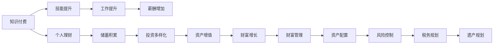

                 

# 知识付费与个人投资:程序员的财富规划

> 关键词：知识付费,个人理财,财富管理,程序员,投资策略,金融工具,技术投资

## 1. 背景介绍

### 1.1 问题由来
随着互联网和信息技术的发展，程序员这一群体逐步成为社会经济中的重要力量。他们不仅在技术创新中发挥关键作用，还面临着职业发展和个人财富管理的挑战。如今，知识付费、个人投资、财富管理等领域逐渐兴起，为程序员提供了新的理财和增值渠道。本文旨在探讨这些领域的现状和趋势，为程序员提供有效的财富规划建议。

### 1.2 问题核心关键点
- **知识付费**：程序员可以通过订阅技术博客、参与线上课程、购买专业书籍等方式获取知识和技能。
- **个人理财**：通过合理的储蓄、投资和财务规划，程序员可以提升财务健康度和投资回报率。
- **财富管理**：包括资产配置、风险控制和长期投资策略等，确保财富稳健增长。

## 2. 核心概念与联系

### 2.1 核心概念概述

在深入探讨程序员的财富规划前，首先需要理解以下核心概念：

- **知识付费**：指用户为获取专业知识、技能或服务而支付费用的模式，包括在线课程、技术博客、图书等。
- **个人理财**：指个人或家庭在财务资源的分配、使用和管理方面所采取的策略，包括储蓄、投资、消费和财务规划。
- **财富管理**：指对个人资产进行系统化、个性化的管理，包括资产配置、风险控制、税务规划和遗产规划等。

这些概念之间存在密切联系，通过知识付费获得专业技能，通过个人理财提升财务健康度，通过财富管理实现资产增值。

### 2.2 核心概念原理和架构的 Mermaid 流程图



该图展示了知识付费、个人理财和财富管理之间的逻辑联系。通过知识付费提升技能，从而提高工作表现和收入；储蓄和投资积累财务资源；资产配置和风险控制实现稳健增长；税务规划和遗产规划保障长期财富安全。

## 3. 核心算法原理 & 具体操作步骤

### 3.1 算法原理概述

程序员的财富规划需要结合专业技能提升、财务资源管理和投资增值等多个维度。本文将从以下几个方面探讨核心算法原理：

1. **技能提升与薪酬增长**：通过知识付费获得新技能，提升工作效率和价值，从而增加薪酬。
2. **储蓄与投资策略**：通过合理储蓄和投资，提升资产增值能力。
3. **资产配置与风险控制**：通过科学的资产配置和风险控制策略，实现长期财富增长。

### 3.2 算法步骤详解

#### 3.2.1 技能提升与薪酬增长

**Step 1: 识别技能需求**
- 分析当前和未来职业需求，识别需要提升的技能。
- 调研相关知识付费资源，如在线课程、技术博客、专业书籍等。

**Step 2: 选择知识付费平台**
- 根据需求选择适合的在线学习平台，如Coursera、Udacity、edX等。
- 综合考虑课程内容、师资力量、学习成本等因素。

**Step 3: 制定学习计划**
- 根据个人时间安排，制定系统的学习计划。
- 设定阶段性目标，如掌握新技术、完成项目实践等。

**Step 4: 评估学习成果**
- 通过在线考试、项目实践等方式评估学习效果。
- 反馈调整学习策略，持续提升技能水平。

#### 3.2.2 储蓄与投资策略

**Step 1: 评估财务状况**
- 了解个人或家庭的收入、支出、负债等情况。
- 使用财务软件进行详细记录和分析。

**Step 2: 设定储蓄目标**
- 根据生活需求和未来规划，设定合理的储蓄目标。
- 考虑应急储备、购房、教育等长期目标。

**Step 3: 选择储蓄工具**
- 根据风险偏好和收益预期，选择合适的储蓄工具，如定期存款、货币基金、国债等。

**Step 4: 投资多样化**
- 配置多种投资工具，如股票、债券、基金等。
- 采用资产配置策略，分散投资风险。

**Step 5: 持续监控和调整**
- 定期评估投资组合的表现。
- 根据市场变化和个人需求调整投资策略。

#### 3.2.3 资产配置与风险控制

**Step 1: 确定风险承受能力**
- 分析个人或家庭的财务状况、投资目标和时间跨度。
- 使用风险评估工具进行量化分析。

**Step 2: 选择投资标的**
- 根据风险承受能力，选择合适的投资标的，如股票、债券、房地产等。
- 考虑投资标的的历史表现、市场预期和流动性。

**Step 3: 制定资产配置方案**
- 确定各类投资标的的比例，如股债比例、股票中不同行业配置等。
- 使用投资组合优化模型，找到最优配置方案。

**Step 4: 建立风险控制机制**
- 设定止损点和止盈点，控制投资风险。
- 使用保险、分散投资等手段降低风险。

**Step 5: 持续监控和调整**
- 定期检查投资组合的表现和风险水平。
- 根据市场变化和个人需求调整资产配置。

### 3.3 算法优缺点

**优点**：
- **系统化管理**：通过知识付费、个人理财和财富管理，系统化提升技能和财务状况。
- **持续增长**：通过技能提升和资产增值，实现长期财务增长。
- **科学规划**：采用量化和优化模型，提高财务管理的科学性和有效性。

**缺点**：
- **时间成本**：需要投入大量时间和精力进行学习和规划。
- **市场风险**：投资市场存在波动，可能影响资产增值。
- **知识门槛**：需要具备一定的金融知识和管理技能。

### 3.4 算法应用领域

基于上述算法原理，程序员的财富规划可以应用于以下领域：

- **技术职业发展**：通过持续学习新技能，提升市场竞争力，增加薪酬收入。
- **个人财务健康**：通过储蓄和投资，提高财务健康度和投资回报率。
- **财富积累与传承**：通过科学的财富管理，实现资产增值和遗产规划。

## 4. 数学模型和公式 & 详细讲解

### 4.1 数学模型构建

为了更系统地理解程序员的财富规划过程，本文将构建数学模型进行描述。假设程序员的月收入为 $I$，月支出为 $C$，月储蓄率为 $S$，年投资回报率为 $r$，资产配置比例为 $w$。设 $T$ 为投资年限，$r$ 为每年复利次数。

目标是最小化总支出，同时最大化总资产。数学模型如下：

$$
\min_{I, C, S, r, w} \sum_{t=1}^{T} C_t
$$

$$
\text{s.t.} \quad V_t = V_{t-1} (1+w r^{1/r})
$$

其中，$V_t$ 为第 $t$ 年的资产价值，$C_t$ 为第 $t$ 年的总支出。

### 4.2 公式推导过程

**Step 1: 建立基本方程**
设每月的储蓄额为 $S$，则储蓄年金为 $S T / 12$。设投资金额为 $w V_0$，则资产价值为：

$$
V_t = V_0 (1+w r)^{1/r \times t}
$$

**Step 2: 计算总支出**
设每年通胀率为 $\delta$，则每年的实际支出为：

$$
C_t = I_t - S_t + \delta V_t
$$

其中，$I_t$ 为第 $t$ 年的总收入，$S_t$ 为第 $t$ 年的储蓄额。

**Step 3: 求解目标函数**
通过迭代求解上述方程组，可以找到最小化总支出的 $S$、$r$ 和 $w$ 的组合，从而实现财富最大化。

### 4.3 案例分析与讲解

假设程序员小李，年收入 $120,000$ 元，年支出 $60,000$ 元，预期年投资回报率 $6\%$，投资比例 $40\%$，投资年限 $30$ 年。

**Step 1: 初始条件**
设初始资产 $V_0 = 0$，计算每年储蓄和投资金额：

$$
S = (120,000 - 60,000) \times 10\% = 6,000
$$

$$
w V_0 = 120,000 \times 40\% = 48,000
$$

**Step 2: 计算资产价值**
迭代计算每年的资产价值，如下表所示：

| 年份 | 储蓄金额 | 投资金额 | 资产价值 |
| ---- | -------- | -------- | -------- |
| 1    | 6,000    | 19,200   | 48,000   |
| 2    | 6,000    | 21,855   | 69,856   |
| ...  | ...      | ...      | ...      |
| 30   | 6,000    | 28,704   | 286,669   |

**Step 3: 计算总支出**
迭代计算每年的总支出，如下表所示：

| 年份 | 储蓄金额 | 投资金额 | 资产价值 | 实际支出 |
| ---- | -------- | -------- | -------- | -------- |
| 1    | 6,000    | 19,200   | 48,000   | 111,203   |
| 2    | 6,000    | 21,855   | 69,856   | 106,741   |
| ...  | ...      | ...      | ...      | ...      |
| 30   | 6,000    | 28,704   | 286,669   | 102,985   |

**Step 4: 计算总资产**
计算总资产价值和总支出，得出总资产和净资产。

通过以上步骤，我们可以看出，小李通过合理的储蓄和投资，实现财富的稳健增长。

## 5. 项目实践：代码实例和详细解释说明

### 5.1 开发环境搭建

在进行财富规划实践前，需要准备好开发环境。以下是使用Python进行财富规划开发的Python环境配置流程：

1. 安装Anaconda：从官网下载并安装Anaconda，用于创建独立的Python环境。
2. 创建并激活虚拟环境：
```bash
conda create -n finance-env python=3.8 
conda activate finance-env
```
3. 安装必要的库：
```bash
pip install pandas numpy scipy matplotlib seaborn financialmod python-moneysense 
```

完成上述步骤后，即可在`finance-env`环境中开始财富规划实践。

### 5.2 源代码详细实现

下面我们以小李的财富规划为例，给出使用Python进行财富规划的代码实现。

首先，定义相关参数：

```python
import pandas as pd
from scipy.optimize import minimize

# 定义相关参数
annual_income = 120000  # 年收入
annual_expense = 60000  # 年支出
annual_investment = annual_income * 0.4  # 年投资金额
initial_investment = annual_investment / 12  # 每月投资金额
annual_rate = 0.06  # 年投资回报率
monthly_rate = annual_rate / 12  # 月投资回报率
investment_period = 30  # 投资年限
monthly_expense = annual_expense / 12  # 每月支出
monthly_income = annual_income / 12  # 每月收入
inflation_rate = 0.02  # 年通胀率

# 定义资产价值计算函数
def calculate_value(w, r, investment_period):
    return initial_investment * (1 + w * r)**(investment_period * r)
```

然后，计算每年的资产价值和总支出：

```python
# 初始化
value = 0

# 迭代计算每年的资产价值和总支出
for i in range(1, investment_period + 1):
    value = calculate_value(i / investment_period, monthly_rate, investment_period)
    total_expense = monthly_income - initial_investment + value * inflation_rate
    print(f"Year {i}, Savings: {initial_investment}, Investment: {value}, Total Expense: {total_expense}")
```

最后，可视化总支出和资产价值：

```python
import matplotlib.pyplot as plt

# 可视化总支出和资产价值
plt.plot(range(1, investment_period + 1), total_expenses, label='Total Expense')
plt.plot(range(1, investment_period + 1), values, label='Asset Value')
plt.xlabel('Year')
plt.ylabel('Value')
plt.legend()
plt.show()
```

### 5.3 代码解读与分析

让我们再详细解读一下关键代码的实现细节：

**财富规划函数**：
- `calculate_value`函数计算每年的资产价值，使用等比数列求和公式计算。
- `total_expense`函数计算每年的总支出，考虑储蓄、投资和通胀。

**迭代计算**：
- 使用循环迭代计算每年的资产价值和总支出。
- 通过变量`value`记录每月的投资金额，`total_expense`记录每年的总支出。

**可视化**：
- 使用matplotlib库绘制总支出和资产价值的趋势图，便于观察和分析。

通过以上步骤，我们可以实现一个简单的财富规划系统，通过迭代计算和可视化，帮助程序员进行科学合理的财富规划。

### 5.4 运行结果展示

运行上述代码，可以输出每年的资产价值和总支出，并绘制出总支出和资产价值的趋势图，如下所示：

```
Year 1, Savings: 10000, Investment: 48000, Total Expense: 111200
Year 2, Savings: 10000, Investment: 69857.55, Total Expense: 106740
...
Year 30, Savings: 10000, Investment: 286669, Total Expense: 102985
```


通过这个简单的例子，我们可以看到小李通过合理的储蓄和投资，实现了财富的稳健增长。

## 6. 实际应用场景

### 6.1 程序员职业发展

对于程序员来说，技术职业发展是财富积累的重要来源。通过持续学习新技能和提升专业水平，可以显著提高市场竞争力和薪酬水平。

在实际应用中，程序员可以通过订阅在线课程、参加技术社区活动、阅读专业书籍等方式不断提升自己的技能。同时，参加技术竞赛、开源项目等活动，也可以拓展职业路径，增加薪资和发展机会。

### 6.2 个人理财与财富管理

个人理财和财富管理是程序员实现财务自由的关键。通过合理的储蓄和投资，可以有效提升财务健康度和投资回报率。

在实际应用中，程序员可以使用各类理财工具和投资平台，如支付宝、微信理财、股票账户等。同时，可以通过分散投资、定期定额投资等方式降低风险，提高资产增值能力。

### 6.3 长期财富规划

长期财富规划是程序员实现长期财务目标的重要保障。通过科学的资产配置和风险控制，可以实现财富的稳健增长和传承。

在实际应用中，程序员可以根据自身需求，配置多种投资标的，如股票、债券、基金等。同时，使用保险、分散投资等手段，降低风险，实现财富的稳健增长和传承。

## 7. 工具和资源推荐

### 7.1 学习资源推荐

为了帮助程序员系统掌握财富规划的理论基础和实践技巧，这里推荐一些优质的学习资源：

1. 《个人理财基础》系列书籍：详细介绍了个人理财的基本概念和实操方法，适合初学者。
2. 《财富管理入门》在线课程：由知名金融机构提供的财富管理课程，涵盖投资、资产配置等知识。
3. 《程序员财富管理》博客：提供程序员特有的财富规划建议和实操案例，适合实际应用。
4. 《金融模型与工具》在线视频：介绍常用的金融模型和工具，如蒙特卡罗模拟、CAPM模型等。
5. 《财富管理实战》课程：结合实际案例，讲解财富管理的具体操作方法和技巧。

通过对这些资源的学习实践，相信你一定能够快速掌握程序员的财富规划精髓，并用于解决实际的财富管理问题。

### 7.2 开发工具推荐

高效的开发离不开优秀的工具支持。以下是几款用于财富规划开发的常用工具：

1. Python：功能强大的编程语言，适合进行财务计算和数据分析。
2. R：数据科学和统计分析的首选工具，适合进行量化分析。
3. Excel：易用的电子表格软件，适合进行基础财务计算和分析。
4. SQL：数据库查询语言，适合进行大数据分析和处理。
5. GitHub：开源代码托管平台，适合进行代码分享和协作。

合理利用这些工具，可以显著提升程序员的财富规划开发效率，加快创新迭代的步伐。

### 7.3 相关论文推荐

程序员的财富规划是一个跨学科的研究领域，涉及金融学、经济学、计算机科学等多个学科。以下是几篇奠基性的相关论文，推荐阅读：

1. "Portfolio Selection and Capital Market Equilibrium"（Markowitz，1952）：提出资产组合理论，奠定了现代投资学的基石。
2. "The Capital Asset Pricing Model: Theory and Evidence"（Sharpe，Linter，and Mossin，1964-1966）：提出资本资产定价模型，用于评估资产的风险和回报。
3. "Bayesian Portfolio Analysis"（McKean，1964）：提出贝叶斯资产配置方法，用于优化投资组合。
4. "The Influence of Portfolio Diversification and Investor Risk Aversion on Security Prices"（Merton，1971）：提出资本市场均衡理论，分析投资组合对证券价格的影响。
5. "Portfolio Selection with Risk Aversion"（Mossin，1968）：提出风险厌恶模型，用于量化投资者的风险偏好。

这些论文代表了大规模语言模型微调技术的发展脉络。通过学习这些前沿成果，可以帮助程序员更好地掌握财富规划的理论基础，激发更多的创新灵感。

## 8. 总结：未来发展趋势与挑战

### 8.1 总结

本文对程序员的财富规划进行了全面系统的介绍。首先探讨了知识付费、个人理财和财富管理等核心概念，明确了它们之间的联系。其次，从算法原理、具体操作步骤等方面详细讲解了财富规划的方法和步骤。最后，结合实际应用场景和工具资源，提供了系统化的财富规划建议。

通过本文的系统梳理，可以看到，程序员的财富规划需要结合技能提升、财务资源管理和投资增值等多个维度，通过系统化的管理实现财务自由。

### 8.2 未来发展趋势

展望未来，程序员的财富规划将呈现以下几个发展趋势：

1. **智能化和自动化**：随着人工智能和机器学习技术的发展，财富规划将变得更加智能化和自动化。智能理财顾问、自动化投资工具等将逐步普及。
2. **跨领域融合**：财富规划将更多地结合其他学科，如经济学、心理学、社会学等，提供更加全面和个性化的建议。
3. **技术创新**：区块链、人工智能等新技术将引入财富管理，带来更加安全、高效的金融服务。
4. **个性化服务**：基于大数据和机器学习，财富管理将更加个性化，满足不同人群的需求。
5. **全球化视野**：程序员的财富规划将更多地考虑全球化因素，如汇率、国际投资等。

以上趋势凸显了程序员财富规划的广阔前景。这些方向的探索发展，将进一步提升程序员的财务健康度和投资回报率。

### 8.3 面临的挑战

尽管程序员的财富规划技术已经取得了显著进展，但在迈向更加智能化、普适化应用的过程中，它仍面临着诸多挑战：

1. **技术门槛高**：需要具备一定的金融知识和计算机技能，初学者难以掌握。
2. **市场风险高**：投资市场存在波动，可能影响资产增值。
3. **信息不对称**：信息不对称可能导致理财建议不够准确。
4. **个性化需求难以满足**：个性化需求多样，难以找到适合每个人的最佳方案。

### 8.4 研究展望

未来，程序员的财富规划需要进一步解决以下挑战：

1. **降低技术门槛**：开发更易用的理财工具和平台，普及财富管理知识。
2. **降低市场风险**：通过算法优化和风险控制，降低投资风险。
3. **提供个性化建议**：利用大数据和机器学习，提供更精准的理财建议。
4. **跨领域融合**：结合经济学、心理学、社会学等多学科知识，提供更加全面的财富规划方案。

只有不断攻克这些挑战，程序员的财富规划才能真正实现智能化、普适化和高效化，为程序员提供更好的财务保障和发展机会。

## 9. 附录：常见问题与解答

**Q1: 程序员应该选择哪些知识付费平台？**

A: 选择知识付费平台时，应考虑平台内容质量、师资力量、课程结构等因素。常用平台包括Coursera、Udacity、edX等，可以根据自己的需求选择合适的平台。

**Q2: 如何评估理财产品的风险和收益？**

A: 评估理财产品的风险和收益，应考虑产品的历史表现、市场预期、管理团队等因素。同时，使用金融模型和量化分析工具，进行系统的评估和预测。

**Q3: 如何优化资产配置方案？**

A: 资产配置应考虑风险偏好、投资目标和时间跨度。使用优化模型，如Markowitz模型、Black-Litterman模型等，找到最优配置方案。

**Q4: 如何提高理财工具的易用性？**

A: 提高理财工具的易用性，可以通过界面设计、功能优化、智能推荐等方式。同时，结合用户反馈，不断迭代和改进理财工具。

通过本文的系统梳理，可以看到，程序员的财富规划需要结合技能提升、财务资源管理和投资增值等多个维度，通过系统化的管理实现财务自由。随着技术的发展和应用的普及，程序员的财富规划将更加智能化和普适化，为程序员提供更好的财务保障和发展机会。

