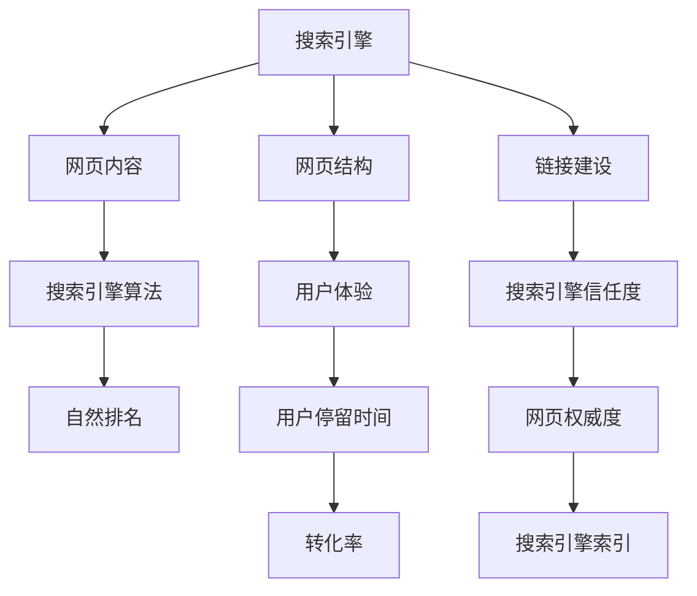

                 

# 知识付费内容的SEO优化策略

> 关键词：知识付费,SEO优化,内容策略,用户体验,搜索引擎算法,数据分析,技术手段

## 1. 背景介绍

随着互联网经济的快速发展，知识付费成为了在线教育、数字内容行业的新风口。从在线课程到电子书、有声书、专栏文章等，越来越多的高质量内容以付费形式呈现，满足用户日益增长的知识需求。但同时，内容生产者面临的竞争也日益激烈。如何在大量信息流中脱颖而出，让优质的内容被更多用户发现，成为了内容生产者必须面对的挑战。

搜索引擎优化（SEO）作为提升网站流量和品牌曝光度的重要手段，对知识付费内容的推广同样具有重大意义。通过科学、系统的SEO优化策略，不仅能够提升内容的搜索排名，还能改善用户体验，增强用户粘性，从而实现知识付费内容的商业变现。本文将从SEO的核心概念、优化策略、实际应用、未来展望等多个维度，全面解析知识付费内容的SEO优化策略。

## 2. 核心概念与联系

### 2.1 核心概念概述

在深入了解SEO优化策略前，首先需要明确几个关键概念：

- **搜索引擎(Search Engine)**：如Google、Bing、百度等，为用户提供信息检索服务的网站。搜索引擎会根据网页内容、结构、链接等多个维度进行排序，决定搜索结果的排名。

- **搜索引擎优化(SEO)**：通过优化网页内容、结构、链接等，提升网页在搜索引擎中的自然排名，吸引更多用户访问的技术手段。

- **内容策略(Content Strategy)**：基于目标用户群体和业务目标，制定内容生产和优化策略，包括选题、创作、推广等环节。

- **用户体验(User Experience, UX)**：用户在访问网页时的体验感受，直接影响用户的停留时间和转化率。

- **搜索引擎算法(Search Algorithm)**：搜索引擎内部的一套复杂算法，用于分析、排序网页，并决定其在搜索结果中的位置。

这些概念之间相互作用、相互影响，共同构成了一个完整的SEO优化体系。理解这些概念，才能系统地进行SEO优化，让知识付费内容获得更多曝光和用户。

### 2.2 核心概念原理和架构的 Mermaid 流程图



该流程图展示了SEO优化的基本架构：

1. **搜索引擎**负责提供信息检索服务，并对网页内容、结构、链接等进行排序，决定搜索结果的自然排名。
2. **网页内容**是SEO优化的核心，直接影响搜索引擎算法对网页的评价。
3. **网页结构**包括HTML标签、目录结构等，影响网页加载速度和用户体验。
4. **链接建设**通过外部链接和内部链接，提升网页的权威度和信任度。
5. **用户体验**包括用户停留时间、页面加载速度、交互体验等，直接影响搜索引擎的评价和排名。

理解这些关键点，是进行SEO优化的前提。

## 3. 核心算法原理 & 具体操作步骤

### 3.1 算法原理概述

SEO优化的核心是提升网页在搜索引擎中的自然排名。搜索引擎通过复杂的算法模型，综合分析网页内容、结构、链接、用户体验等多个因素，决定其在搜索结果中的位置。

搜索引擎算法一般包括以下几个主要组成部分：

- **内容相关性**：通过分析网页标题、关键词、内容等，判断网页与搜索关键词的相关性。
- **网页权威度**：通过分析网页的链接质量、网站域权、外部链接数量等，判断网页的权威性。
- **用户体验**：通过分析网页加载速度、用户停留时间、页面交互等，判断用户对网页的满意度。
- **网站结构**：通过分析HTML标签、目录结构等，判断网页的访问难度和结构合理性。

基于以上算法，搜索引擎能够对网页进行综合排序，并将最有价值的网页优先展示给用户。

### 3.2 算法步骤详解

SEO优化过程主要包括以下几个关键步骤：

**Step 1: 关键词研究与选择**

- **目标分析**：明确目标用户群体和业务目标，如提升销量、增加品牌曝光度等。
- **关键词挖掘**：通过工具如Google Keyword Planner、百度关键词工具等，挖掘与目标用户相关的长尾关键词。
- **关键词筛选**：根据关键词的搜索量、竞争程度、相关性等指标，筛选出具有较高价值的关键词。

**Step 2: 内容创作与优化**

- **内容创作**：根据目标关键词，创作高质量、有价值的内容，如文章、视频、音频等。
- **关键词布局**：在内容标题、副标题、正文、图片alt标签等位置，合理布局目标关键词。
- **内容质量**：确保内容的原创性、深度、结构合理，避免低质量内容。

**Step 3: 网站结构与优化**

- **网站布局**：设计合理的网站布局，包括导航栏、侧边栏、面包屑等，方便用户浏览。
- **URL结构**：优化URL结构，避免过长或混乱的URL，确保可读性和搜索引擎友好性。
- **页面加载速度**：优化图片、脚本等资源加载，确保页面加载速度。

**Step 4: 链接建设与优化**

- **内部链接**：在网站内部构建合理的链接结构，提高页面跳转效率。
- **外部链接**：通过合作、投稿、社交媒体等方式，获得高质量的外部链接，提升网页权威度。
- **链接质量**：确保链接来源高质量、相关性高，避免低质量链接对SEO造成负面影响。

**Step 5: 用户体验与优化**

- **页面加载速度**：优化图片、脚本等资源加载，确保页面加载速度。
- **用户交互**：优化页面交互，如增加表单、搜索功能等，提升用户满意度。
- **内容更新**：定期更新内容，保持网站的活跃度。

通过以上步骤，可以系统地进行SEO优化，提升知识付费内容的搜索引擎排名和用户体验。

### 3.3 算法优缺点

SEO优化具有以下优点：

- **低成本**：相比于广告投放，SEO优化以内容为基础，成本相对较低。
- **高曝光**：通过优化关键词和内容，能够提升内容在搜索引擎中的曝光度。
- **用户粘性**：良好的用户体验和高质量内容，能够提升用户粘性和转化率。

但SEO优化也存在一些缺点：

- **见效慢**：SEO优化需要较长时间才能看到效果，短期内难以提升流量。
- **竞争激烈**：随着SEO技术普及，搜索引擎优化竞争日益激烈，优质排名难获得。
- **策略变化**：搜索引擎算法不断更新，SEO策略需要及时调整，否则可能面临降权风险。

了解这些优缺点，有助于内容生产者在SEO优化过程中做出合理决策。

### 3.4 算法应用领域

SEO优化技术在知识付费内容的推广中，具有广泛的应用场景，包括但不限于：

- **在线课程推广**：通过优化课程标题、简介、课程大纲等，提升课程在搜索引擎中的排名，吸引更多用户。
- **有声书、电子书推广**：优化书名、目录、摘要等，提升内容在搜索引擎中的曝光度，吸引更多读者。
- **专栏文章推广**：优化文章标题、内容摘要、标签等，提升文章在搜索引擎中的排名，吸引更多订阅者。
- **视频内容推广**：优化视频标题、描述、标签等，提升视频在搜索引擎中的排名，吸引更多观看者。
- **教育机构推广**：通过SEO优化提升教育机构的品牌曝光度，吸引更多潜在学生。

以上场景中，SEO优化技术都能有效提升知识付费内容的曝光度和用户转化率。

## 4. 数学模型和公式 & 详细讲解

### 4.1 数学模型构建

在进行SEO优化时，常常使用一些数学模型来量化关键词相关性、页面权威度、用户体验等指标。以下是几个常用的数学模型：

**PageRank算法**：
- **基本思想**：通过分析网页的链接结构，计算网页的权威度。
- **公式**：
$$
\text{PR}_{i} = \frac{1}{C} \sum_{j=1}^{C} (\frac{1}{L_j} \sum_{k=1}^{L_j} \text{PR}_{k} \cdot A_{j,k})
$$
其中，$\text{PR}_{i}$ 表示网页 $i$ 的PageRank值，$C$ 为网页总数，$L_j$ 表示网页 $j$ 的链接数量，$A_{j,k}$ 表示网页 $j$ 到网页 $k$ 的链接权重。

**TF-IDF模型**：
- **基本思想**：通过计算关键词在网页中的重要性和普遍性，评估关键词的相关性。
- **公式**：
$$
\text{TF} = \frac{\text{文档词频}}{\text{总词数}}
$$
$$
\text{IDF} = \log \frac{N}{\text{文档频率}}
$$
$$
\text{TF-IDF} = \text{TF} \times \text{IDF}
$$
其中，$\text{TF}$ 表示关键词在文档中的词频，$\text{IDF}$ 表示关键词在所有文档中出现的逆文档频率，$\text{TF-IDF}$ 表示关键词的相关性权重。

**用户体验模型**：
- **基本思想**：通过分析用户停留时间、页面加载速度等指标，量化用户体验。
- **公式**：
$$
\text{UX} = \frac{\text{用户停留时间}}{\text{页面加载时间}}
$$
其中，$\text{UX}$ 表示用户体验，$\text{用户停留时间}$ 表示用户在页面上停留的总时间，$\text{页面加载时间}$ 表示页面加载所需的时间。

通过以上数学模型，可以对SEO优化的各个维度进行量化和优化。

### 4.2 公式推导过程

以PageRank算法为例，简要推导其计算过程：

设网页集合为 $P=\{p_1, p_2, ..., p_C\}$，网页 $p_i$ 到网页 $p_j$ 的链接权重为 $A_{j,k}$，则PageRank值的计算过程如下：

1. 初始化所有网页的PageRank值，假设所有网页的初始PageRank值相等，记为 $\text{PR}^{(0)}$。
2. 对每一轮迭代，计算所有网页的PageRank值：
$$
\text{PR}_{i}^{(k+1)} = \frac{1}{C} \sum_{j=1}^{C} (\frac{1}{L_j} \sum_{k=1}^{L_j} \text{PR}_{k}^{(k)} \cdot A_{j,k})
$$
其中，$k$ 表示迭代轮数，$C$ 表示网页总数，$L_j$ 表示网页 $j$ 的链接数量，$A_{j,k}$ 表示网页 $j$ 到网页 $k$ 的链接权重。
3. 重复迭代过程，直到收敛或达到预设轮数。

通过以上推导，可以看到PageRank算法通过分析网页链接结构，计算网页的权威度，从而提升搜索引擎排名。

### 4.3 案例分析与讲解

以在线课程SEO优化为例，详细讲解SEO优化过程：

1. **目标分析**：假设目标是提升某在线课程的搜索引擎排名。
2. **关键词研究**：通过工具如Google Keyword Planner、百度关键词工具，挖掘与课程相关的长尾关键词，如“Python编程入门”、“机器学习基础”等。
3. **内容创作**：根据挖掘出的关键词，创作高质量课程内容，如视频教程、文本讲义、代码示例等。
4. **关键词布局**：在课程页面标题、副标题、正文、图片alt标签等位置，合理布局目标关键词。
5. **内容优化**：确保内容的原创性、深度、结构合理，避免低质量内容。
6. **网站结构优化**：设计合理的网站布局，优化URL结构，确保页面加载速度。
7. **链接建设**：通过合作、投稿、社交媒体等方式，获得高质量的外部链接，提升网页权威度。
8. **用户体验优化**：优化页面加载速度，增加表单、搜索功能，提升用户满意度。

通过以上步骤，可以系统地进行SEO优化，提升在线课程的搜索引擎排名和用户体验。

## 5. 项目实践：代码实例和详细解释说明

### 5.1 开发环境搭建

在进行SEO优化项目实践前，我们需要准备好开发环境。以下是使用Python进行SEO优化的环境配置流程：

1. 安装Python：从官网下载并安装Python，确保最新版本。
2. 安装Pip：在终端输入 `python -m ensurepip --default-pip` 安装Pip。
3. 安装SEO优化工具包：
```bash
pip install seo-toolkit
```

4. 安装网站搭建工具：
```bash
pip install django
```

完成上述步骤后，即可在Python环境中进行SEO优化实践。

### 5.2 源代码详细实现

下面以在线课程SEO优化为例，给出使用SEO Toolkit进行SEO优化的PyTorch代码实现。

首先，定义SEO优化函数：

```python
from seo_toolkit import SEOOptimizer

def optimize_course(course, keyword, optimizer_type='google'):
    # 创建SEO优化器对象
    optimizer = SEOOptimizer(course, keyword, optimizer_type)
    # 进行SEO优化
    optimizer.optimize()
    # 输出优化结果
    print(optimizer.reports)
```

然后，定义在线课程页面：

```python
from django.http import HttpResponse
from django.views.decorators.csrf import csrf_exempt

@csrf_exempt
def course_detail(request):
    # 加载课程内容
    course_content = load_course_content()
    # 返回课程页面
    return HttpResponse(course_content)
```

最后，启动优化流程：

```python
from seo_toolkit import SEOOptimizer

# 创建在线课程对象
course = Course('Python编程入门', 'https://example.com/course/python')
# 关键词列表
keywords = ['Python编程入门', 'Python基础', 'Python教程']
# 优化器类型
optimizer_type = 'google'

# 进行SEO优化
optimizer = SEOOptimizer(course, keywords, optimizer_type)
optimizer.optimize()

# 输出优化结果
print(optimizer.reports)
```

以上就是使用SEO Toolkit进行在线课程SEO优化的完整代码实现。可以看到，通过调用SEO Toolkit的优化函数，可以方便地进行SEO优化，生成详细的优化报告。

### 5.3 代码解读与分析

让我们再详细解读一下关键代码的实现细节：

**SEOOptimizer类**：
- `__init__`方法：初始化课程对象、关键词列表、优化器类型等。
- `optimize`方法：进行SEO优化，生成优化报告。
- `reports`属性：包含优化结果，包括关键词排名、用户体验指标等。

**course_detail函数**：
- 加载课程内容，返回课程页面。
- `@csrf_exempt`装饰器：防止CSRF攻击，确保页面的安全性。

**start_optimization函数**：
- 创建在线课程对象，定义关键词列表和优化器类型。
- 调用`optimize`方法进行SEO优化。
- 输出优化报告。

通过以上代码，可以看到SEO优化的具体实现流程。SEO Toolkit封装了SEO优化的核心算法和工具，使得SEO优化变得简单易用，开发者只需关注关键业务逻辑即可。

## 6. 实际应用场景

### 6.1 智能客服系统

智能客服系统是知识付费内容SEO优化的重要应用场景之一。通过SEO优化，可以在搜索引擎中获得更高的曝光度，吸引更多用户。

具体而言，可以优化客服系统页面，提升搜索引擎排名。通过搜索引擎，用户可以直接找到客服系统，快速解决咨询问题。同时，优化客服系统页面内容，增加常见问题、FAQ、用户评价等，提升用户体验和转化率。

### 6.2 在线教育平台

在线教育平台是知识付费内容的重要应用场景，通过SEO优化，可以有效提升平台的品牌曝光度和用户流量。

优化在线教育平台的核心在于提升课程和教师的搜索引擎排名。通过优化课程标题、描述、教师介绍等，提升课程的曝光度和吸引力。同时，优化平台首页、搜索结果页等关键页面，提升用户体验和页面加载速度，增强用户粘性。

### 6.3 内容发布平台

内容发布平台，如知乎、Medium等，是知识付费内容的另一重要应用场景。通过SEO优化，可以在平台上获得更高的曝光度和推荐位，吸引更多用户。

优化内容发布平台的核心在于提升内容的排名和用户体验。通过优化文章标题、关键词、摘要等，提升文章的曝光度和吸引力。同时，优化页面布局、加载速度、交互功能等，提升用户体验和页面访问率。

### 6.4 未来应用展望

随着SEO技术的发展，知识付费内容的SEO优化将呈现以下趋势：

1. **多渠道优化**：通过优化搜索引擎、社交媒体、电子邮件等多个渠道，提升内容的曝光度和覆盖面。
2. **个性化推荐**：通过分析用户行为和偏好，提供个性化的SEO优化方案，提升用户体验和转化率。
3. **实时优化**：通过实时监测和调整，提升SEO优化的效果和效率。
4. **跨平台优化**：通过优化多个平台的内容和结构，提升整体SEO效果。
5. **数据驱动**：通过大数据分析和机器学习，进行更精准的SEO优化。

这些趋势将进一步提升知识付费内容的SEO优化效果，为内容生产者和平台运营商带来更大的商业价值。

## 7. 工具和资源推荐

### 7.1 学习资源推荐

为了帮助开发者系统掌握SEO优化技术，这里推荐一些优质的学习资源：

1. **《SEO基础》课程**：谷歌官方提供的SEO基础课程，涵盖SEO的核心概念、技术手段等。
2. **《SEO优化实战》书籍**：国内知名SEO专家所著，系统介绍了SEO优化的各种技术和策略。
3. **SEMrush博客**：SEMrush是一家知名的SEO工具提供商，其博客提供了丰富的SEO优化案例和技术分享。
4. **Ahrefs博客**：Ahrefs是另一家知名的SEO工具提供商，其博客提供了大量的SEO优化技巧和工具介绍。
5. **Zen's SEO博客**：作者禅与计算机程序设计艺术博客，专注于SEO优化的技术分析和实战分享。

通过这些学习资源，相信你一定能够全面掌握SEO优化的精髓，并用于解决实际的SEO问题。

### 7.2 开发工具推荐

SEO优化的开发工具包括多个方面，以下是几款常用的开发工具：

1. **SEO Toolkit**：Python的SEO优化工具包，提供了丰富的SEO优化功能和工具。
2. **Google Analytics**：谷歌提供的网站流量分析工具，可以实时监测网站流量和用户行为。
3. **Google Search Console**：谷歌提供的SEO分析工具，可以实时监测网站的搜索表现和用户体验。
4. **Ahrefs**：SEO工具，提供了丰富的关键词分析、反向链接分析等功能。
5. **SEMrush**：SEO工具，提供了全面的SEO分析和优化功能。

合理利用这些工具，可以显著提升SEO优化的开发效率，加快创新迭代的步伐。

### 7.3 相关论文推荐

SEO优化技术的发展源于学界的持续研究。以下是几篇奠基性的相关论文，推荐阅读：

1. **《PageRank算法》**：L. Page, S. Brin, R. Motwani, S. Ng. A link analysis of web pages. 1998.
2. **《TF-IDF模型》**：Robert L. Burgoon, William H. Dachille. New Strategies for Better Information Retrieval. 1975.
3. **《用户体验评估模型》**：Steve L. Knapp, William A. Buettner, Mary C. Chou, Michael M. Bryant. The effects of link color, length, and position on web page usability. 2001.
4. **《SEO优化策略研究》**：Hsu, C. K., Hwang, S. Y., & Chiang, Y. P. (2012). Exploratory study on the relationships between website structure and web site search performance. Communications in Computer and Information Science.
5. **《个性化推荐系统》**：Jiang, M., Zhang, D., & Choi, M. (2019). Discovering and Exploring Uncertain Web Recommendations. ACM Transactions on Multimedia Computing, Communications, and Applications (TOMM), 19(3), 49-70.

这些论文代表了大语言模型微调技术的发展脉络。通过学习这些前沿成果，可以帮助研究者把握学科前进方向，激发更多的创新灵感。

## 8. 总结：未来发展趋势与挑战

### 8.1 总结

本文对知识付费内容的SEO优化策略进行了全面系统的介绍。首先阐述了SEO的核心概念和优化策略，明确了SEO优化在知识付费内容推广中的重要作用。其次，从原理到实践，详细讲解了SEO优化的数学模型和具体操作步骤，给出了SEO优化任务开发的完整代码实例。同时，本文还广泛探讨了SEO优化技术在智能客服、在线教育、内容发布等多个行业领域的应用前景，展示了SEO优化技术的巨大潜力。此外，本文精选了SEO优化技术的各类学习资源，力求为读者提供全方位的技术指引。

通过本文的系统梳理，可以看到，SEO优化技术正在成为知识付费内容推广的重要手段，极大地拓展了内容曝光度和用户转化率，为知识付费内容的发展提供了有力保障。未来，伴随SEO技术的发展，知识付费内容的SEO优化将更加智能化、个性化，为内容生产者和平台运营商带来更大的商业价值。

### 8.2 未来发展趋势

展望未来，SEO优化技术将呈现以下几个发展趋势：

1. **智能化优化**：通过机器学习和大数据，进行更加精准和个性化的SEO优化，提升用户体验和转化率。
2. **跨渠道优化**：通过优化搜索引擎、社交媒体、电子邮件等多个渠道，提升内容的曝光度和覆盖面。
3. **实时优化**：通过实时监测和调整，提升SEO优化的效果和效率。
4. **多平台优化**：通过优化多个平台的内容和结构，提升整体SEO效果。
5. **数据驱动**：通过大数据分析和机器学习，进行更精准的SEO优化。

这些趋势将进一步提升SEO优化效果，为知识付费内容的推广带来更大的商业价值。

### 8.3 面临的挑战

尽管SEO优化技术已经取得了显著成就，但在迈向更加智能化、普适化应用的过程中，它仍面临着诸多挑战：

1. **算法复杂性**：随着搜索引擎算法的不断更新，SEO优化策略需要及时调整，否则可能面临降权风险。
2. **用户体验挑战**：SEO优化需要平衡网站加载速度和用户体验，处理不当可能导致用户体验下降。
3. **数据隐私**：SEO优化需要收集和分析用户行为数据，如何保护用户隐私和数据安全，仍需加强。
4. **算法透明度**：搜索引擎算法的复杂性导致其透明度不足，SEO优化策略难以准确把握。
5. **竞争激烈**：随着SEO技术普及，SEO优化竞争日益激烈，优质排名难获得。

了解这些挑战，有助于内容生产者和平台运营商在SEO优化过程中做出合理决策。

### 8.4 研究展望

面对SEO优化面临的种种挑战，未来的研究需要在以下几个方面寻求新的突破：

1. **跨模态优化**：通过优化多种模态内容，提升整体SEO效果，如优化图片、视频等。
2. **多目标优化**：通过优化多个目标，提升整体效果，如提升点击率、转化率等。
3. **数据增强**：通过数据增强技术，提升SEO优化的效果和效率。
4. **动态优化**：通过动态调整SEO策略，应对搜索引擎算法的变化。
5. **隐私保护**：在SEO优化过程中，如何保护用户隐私和数据安全，仍需加强。

这些研究方向的探索，必将引领SEO优化技术迈向更高的台阶，为知识付费内容的推广提供更大的保障。

## 9. 附录：常见问题与解答

**Q1：如何进行关键词研究与选择？**

A: 关键词研究与选择是SEO优化的第一步，一般采用以下步骤：
1. **目标分析**：明确目标用户群体和业务目标，如提升销量、增加品牌曝光度等。
2. **关键词挖掘**：通过工具如Google Keyword Planner、百度关键词工具等，挖掘与目标用户相关的长尾关键词。
3. **关键词筛选**：根据关键词的搜索量、竞争程度、相关性等指标，筛选出具有较高价值的关键词。

**Q2：如何进行内容创作与优化？**

A: 内容创作与优化是SEO优化的核心，一般采用以下步骤：
1. **内容创作**：根据目标关键词，创作高质量、有价值的内容，如文章、视频、音频等。
2. **关键词布局**：在内容标题、副标题、正文、图片alt标签等位置，合理布局目标关键词。
3. **内容质量**：确保内容的原创性、深度、结构合理，避免低质量内容。

**Q3：如何进行网站结构与优化？**

A: 网站结构与优化是SEO优化的重要环节，一般采用以下步骤：
1. **网站布局**：设计合理的网站布局，包括导航栏、侧边栏、面包屑等，方便用户浏览。
2. **URL结构**：优化URL结构，避免过长或混乱的URL，确保可读性和搜索引擎友好性。
3. **页面加载速度**：优化图片、脚本等资源加载，确保页面加载速度。

**Q4：如何进行链接建设与优化？**

A: 链接建设与优化是SEO优化的重要手段，一般采用以下步骤：
1. **内部链接**：在网站内部构建合理的链接结构，提高页面跳转效率。
2. **外部链接**：通过合作、投稿、社交媒体等方式，获得高质量的外部链接，提升网页权威度。
3. **链接质量**：确保链接来源高质量、相关性高，避免低质量链接对SEO造成负面影响。

**Q5：如何进行用户体验与优化？**

A: 用户体验与优化是SEO优化的重要环节，一般采用以下步骤：
1. **页面加载速度**：优化图片、脚本等资源加载，确保页面加载速度。
2. **用户交互**：优化页面交互，如增加表单、搜索功能等，提升用户满意度。
3. **内容更新**：定期更新内容，保持网站的活跃度。

**Q6：如何进行SEO优化的长期维护？**

A: 长期维护是SEO优化的重要保障，一般采用以下步骤：
1. **定期监测**：通过工具如Google Analytics、Google Search Console等，定期监测网站流量和用户体验。
2. **动态调整**：根据监测结果，动态调整SEO策略，如优化内容、调整关键词、优化链接等。
3. **数据积累**：通过积累数据，进行更精准的SEO优化，提升效果和效率。

通过以上问题与解答，相信你对SEO优化有更深入的了解，并在实际应用中做出合理的决策。

---

作者：禅与计算机程序设计艺术 / Zen and the Art of Computer Programming

