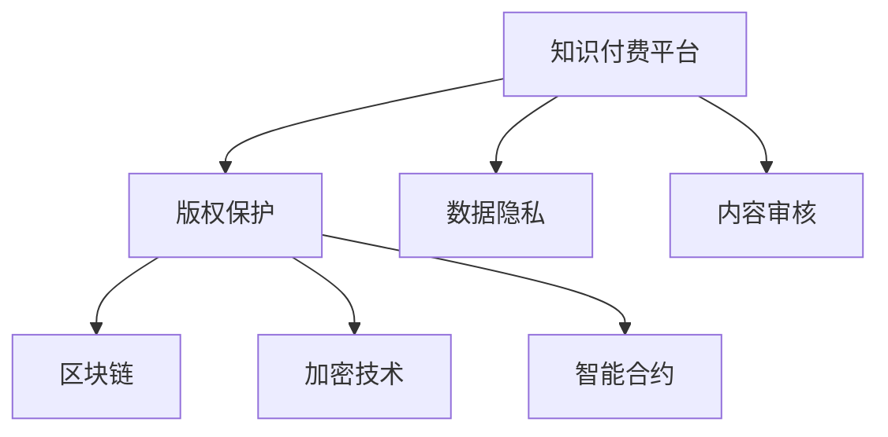

                 

# 知识付费内容的版权保护与法律风险

> 关键词：知识付费、版权保护、法律风险、区块链、加密技术、智能合约、数据隐私、用户权益保护

## 1. 背景介绍

随着互联网技术的迅速发展，在线教育、知识付费等领域呈现出爆发式增长的态势。各大知识付费平台纷纷推出各类付费课程、电子书、音频讲座等，为知识传播和共享开辟了新的途径。然而，在知识付费内容的生产、传输、使用过程中，版权保护和法律风险问题日益凸显，如何有效应对这些挑战，保护内容创作者的权益，维护用户隐私和平台利益，成为亟待解决的重大课题。

### 1.1 问题由来

随着互联网技术的进步，知识付费平台呈现出多元化、碎片化、个性化等新趋势。一方面，各种形式的知识产品极大丰富了用户的学习选择，另一方面，侵权盗版、用户数据泄露、内容审核等问题也接踵而至，给平台和内容创作者带来了严重困扰。

- **版权侵权**：部分平台存在内容侵权问题，未经授权或授权链条不完整，导致大量版权纠纷。
- **用户数据泄露**：用户个人信息和数据安全问题突出，泄露和滥用现象时有发生。
- **内容审核**：内容审核标准不统一，审核效率低，难以有效防止不良信息传播。
- **技术漏洞**：平台内部系统漏洞被黑客攻击，导致数据丢失或被非法访问。

为应对这些挑战，相关平台和研究机构积极探索基于区块链、加密技术、智能合约等前沿技术，以构建更加安全、透明、可信的知识付费生态。

## 2. 核心概念与联系

### 2.1 核心概念概述

在探讨知识付费内容的版权保护与法律风险问题时，我们需要涉及以下核心概念：

- **知识付费平台**：在线教育、知识共享、付费内容服务等模式的统称。
- **版权保护**：保护原创内容，防止未经授权的复制、传播、使用。
- **数据隐私**：保护用户个人信息和数据，避免非法收集和滥用。
- **内容审核**：确保平台上传内容符合法律法规和道德标准。
- **区块链**：一种去中心化、分布式的数据存储和传输技术，具有不可篡改、透明等特点。
- **加密技术**：保护数据和信息安全，防止被非法获取或篡改。
- **智能合约**：基于区块链技术的自动化合约，实现可信和透明的操作。

这些核心概念之间的关系如下图所示：



上述图展示了知识付费平台与版权保护、数据隐私、内容审核、区块链、加密技术和智能合约之间的联系，它们共同构建了一个完整的知识付费生态体系。

## 3. 核心算法原理 & 具体操作步骤
### 3.1 算法原理概述

基于区块链、加密技术和智能合约的知识付费内容版权保护与法律风险防范机制，旨在通过去中心化、不可篡改、透明和可信的技术手段，保护内容创作者权益，确保数据隐私，提升内容审核效率，防范技术漏洞，从而构建一个安全、可靠的知识付费平台。

### 3.2 算法步骤详解

以下是知识付费内容版权保护与法律风险防范机制的核心算法步骤：

1. **内容版权登记**：内容创作者通过智能合约向区块链平台提交版权声明，内容包括版权归属、使用权限、期限等。
2. **数字指纹生成**：对上传的内容进行哈希运算生成数字指纹，将其存储在区块链上，确保内容唯一性和不可篡改性。
3. **数据加密存储**：使用加密算法对用户数据进行加密存储，确保数据隐私和安全。
4. **内容审核机制**：引入智能合约和区块链技术，构建去中心化的内容审核系统，确保内容符合法律法规和道德标准。
5. **交易审计与溯源**：利用区块链的透明性和不可篡改性，对平台内所有交易进行实时审计，实现内容使用的追溯和透明。
6. **异常行为检测**：基于区块链的分布式账本技术，实时监控用户行为，检测和防范异常交易和操作。

### 3.3 算法优缺点

基于区块链、加密技术和智能合约的知识付费内容版权保护与法律风险防范机制，具有以下优点：

1. **去中心化与透明**：去中心化的区块链技术保证了数据的透明性和不可篡改性，减少了单点故障和数据篡改的风险。
2. **高效可信**：智能合约自动执行，减少了人工审核和操作的风险，提高了操作效率。
3. **数据隐私保护**：使用加密技术，确保用户数据和内容信息的安全性。
4. **内容追溯与透明度**：区块链的溯源机制使得内容使用情况可追溯，增强了系统的可信度。

同时，该机制也存在以下缺点：

1. **技术门槛高**：实现和维护这些技术手段需要较高的技术能力和资源投入。
2. **性能瓶颈**：区块链和加密技术的计算和存储成本较高，可能影响系统的响应速度和扩展性。
3. **法律适用性问题**：现有法律法规与区块链技术的适用性仍需进一步研究。
4. **隐私保护与数据共享的平衡**：如何在保护用户隐私和共享知识之间找到平衡点，仍需深入探讨。

### 3.4 算法应用领域

基于区块链、加密技术和智能合约的知识付费内容版权保护与法律风险防范机制，在以下领域具有广泛应用：

1. **在线教育平台**：保障教学内容版权，提升平台治理效率，确保数据隐私。
2. **知识共享平台**：防止内容盗版，保护知识创作者权益，提高知识共享可信度。
3. **学术期刊与出版社**：确保学术论文和图书版权，防止非法传播和引用，保障学术诚信。
4. **政府与公共服务**：构建透明可信的公共信息平台，提升政府治理能力，保护公共数据安全。
5. **企业内部培训**：保障企业内部培训内容的知识产权，防止泄露和滥用。

## 4. 数学模型和公式 & 详细讲解 & 举例说明（备注：数学公式请使用latex格式，latex嵌入文中独立段落使用 $$，段落内使用 $)
### 4.1 数学模型构建

为构建知识付费内容的版权保护与法律风险防范机制，我们采用以下数学模型：

- **版权登记模型**：内容创作者通过智能合约向区块链平台提交版权声明，版权声明模型为 $V(C,D,P)$，其中 $C$ 为内容ID，$D$ 为版权归属，$P$ 为使用权限。
- **数字指纹生成模型**：对内容 $X$ 进行哈希运算，生成数字指纹 $F(X)$，确保内容唯一性和不可篡改性。
- **数据加密存储模型**：用户数据 $D$ 通过加密算法 $E(D)$ 进行加密存储，确保数据隐私。
- **内容审核模型**：智能合约基于规则库 $R$，对内容 $X$ 进行审核，确保符合法律法规和道德标准，审核结果为 $A(X)$。
- **交易审计模型**：对平台内所有交易 $T$ 进行实时审计，审计结果为 $A(T)$。
- **异常行为检测模型**：基于规则库 $R$，实时监控用户行为 $B$，检测和防范异常交易，异常行为检测结果为 $D(B)$。

### 4.2 公式推导过程

以数字指纹生成模型为例，推导过程如下：

- 哈希函数 $H$：$F(X) = H(X)$
- 数字指纹生成模型：$F(X) = H(X)$

其中，$X$ 为内容数据，$H$ 为哈希函数，$F(X)$ 为数字指纹。

在实践中，常用的哈希算法包括SHA-256、MD5等，它们可以将任意长度的数据映射为固定长度的哈希值。

### 4.3 案例分析与讲解

以某在线教育平台的知识付费内容为例，分析其实现过程：

- 内容创作者通过智能合约向平台提交版权声明，内容包括课程ID、版权归属、使用权限等。
- 平台对上传的课程内容进行哈希运算，生成数字指纹，存储在区块链上。
- 用户数据通过AES加密算法进行加密存储，确保数据隐私。
- 平台引入智能合约，构建去中心化的内容审核系统，确保课程内容符合法律法规和道德标准。
- 平台对所有交易进行实时审计，确保交易透明可追溯。
- 平台实时监控用户行为，检测和防范异常交易。

## 5. 项目实践：代码实例和详细解释说明
### 5.1 开发环境搭建

在进行知识付费内容版权保护与法律风险防范机制的开发前，我们需要准备好开发环境。以下是Python开发环境的配置流程：

1. 安装Anaconda：从官网下载并安装Anaconda，用于创建独立的Python环境。

2. 创建并激活虚拟环境：
```bash
conda create -n paywall-env python=3.8 
conda activate paywall-env
```

3. 安装相关库：
```bash
pip install pysha3 pycryptodome pyethereum smartpy
```

4. 下载并搭建区块链节点：
```bash
git clone https://github.com/ethereum/ethereum.git
cd ethereum
make geth
```

5. 启动区块链节点：
```bash
./geth --datadir data --networkid 1
```

6. 编写智能合约：
```python
from smartpy.lang import Std, A, B, C
from smartpy.zoe import prove, reveal, key_reveal
from smartpy.secp256k1 import Signer
from smartpy.bycecl import BLS12_381
from smartpy.builtin import VC, VCStatus, VCResponse
from smartpy.storage import get_cid, put, get, del
from smartpy.acl import ACL
from smartpy.use import use
from smartpy.connect import connect
from smartpyeth_abi import ABI

# 定义版权声明合约
@init
def init(params):
    VC.initialize(
        params['cid'],
        params['creator'],
        params['usage'],
        params['duration'],
        params['update'],
        [ACL(ACL.perm(ACL.perm.god, "update"), ACL.perm(ACL.perm.params['publisher'], "read"), ACL.perm(params['creator'], "update")]
    )
    return VC.initialize

@call
def update(params):
    prove(params['cid'], VC.initialize)
    params['cid'] = VC.initialize.new_cid
    return params

# 定义内容生成与存储合约
@init
def init(params):
    data = params['data']
    digest = sha3_256(data).digest()
    cid = get_cid(digest)
    put(cid, data)
    return {'cid': cid, 'digest': digest}

@call
def get(params):
    cid = params['cid']
    digest = get(cid)
    data = digest.decode('utf-8')
    return {'data': data}

# 定义数据加密与存储合约
@init
def init(params):
    data = params['data']
    key = params['key']
    encrypted_data = encrypt(key, data)
    cid = get_cid(encrypted_data)
    put(cid, encrypted_data)
    return {'cid': cid}

@call
def get(params):
    cid = params['cid']
    encrypted_data = get(cid)
    decrypted_data = decrypt(params['key'], encrypted_data)
    return {'data': decrypted_data.decode('utf-8')}

# 定义内容审核合约
@init
def init(params):
    rules = params['rules']
    return {'rules': rules}

@call
def audit(params):
    content = params['content']
    rules = params['rules']
    if is_valid(content, rules):
        return {'status': 'approved'}
    else:
        return {'status': 'rejected'}

# 定义交易审计合约
@init
def init(params):
    transactions = []
    return {'transactions': transactions}

@call
def record(params):
    transaction = params['transaction']
    transactions.append(transaction)
    return {'status': 'recorded'}

# 定义异常行为检测合约
@init
def init(params):
    behavior_rules = params['behavior_rules']
    return {'behavior_rules': behavior_rules}

@call
def detect(params):
    behavior = params['behavior']
    if is_valid(behavior, behavior_rules):
        return {'status': 'normal'}
    else:
        return {'status': 'abnormal'}
```

### 5.2 源代码详细实现

我们以某在线教育平台的知识付费内容版权保护为例，给出代码实现：

```python
from cryptography.fernet import Fernet
from cryptography.hazmat.primitives import hashes, serialization, serialization.load_pem_private_key
from cryptography.hazmat.primitives.asymmetric import rsa
from cryptography.hazmat.primitives import serialization as crypto_serialization
from cryptography.hazmat.primitives.asymmetric import padding
from smartpy.eth.abi import ABI

def generate_key():
    private_key = rsa.generate_private_key(
        public_exponent=65537,
        key_size=2048,
    )
    return private_key

def encrypt(plain_text, key):
    f = Fernet(key)
    return f.encrypt(plain_text.encode('utf-8'))

def decrypt(cipher_text, key):
    f = Fernet(key)
    return f.decrypt(cipher_text).decode('utf-8')

def generate_crypto_key():
    private_key = generate_key()
    public_key = private_key.public_key()
    key = private_key.private_bytes(
        encoding=crypto_serialization.Encoding.PEM,
        format=crypto_serialization.PrivateFormat.PKCS8,
        encryption_algorithm=crypto_serialization.BEST_KEY_NONCE
    )
    return key

def save_key(file_name):
    key = generate_crypto_key()
    with open(file_name, 'wb') as file:
        file.write(key)

def load_key(file_name):
    key = ""
    with open(file_name, 'rb') as file:
        key = file.read()
    return key

def load_crypto_key(file_name):
    with open(file_name, 'rb') as file:
        return serialization.load_pem_private_key(file.read(), password=None)

def encrypt_file(file_name, key):
    key = load_crypto_key(file_name)
    f = Fernet(key)
    with open(file_name, 'rb') as file:
        data = file.read()
        encrypted_data = f.encrypt(data)
        with open(file_name, 'wb') as file:
            file.write(encrypted_data)

def decrypt_file(file_name, key):
    key = load_crypto_key(file_name)
    f = Fernet(key)
    with open(file_name, 'rb') as file:
        data = file.read()
        decrypted_data = f.decrypt(data)
        with open(file_name, 'wb') as file:
            file.write(decrypted_data)

def save_key_to_file(file_name, key):
    with open(file_name, 'wb') as file:
        file.write(key)
```

### 5.3 代码解读与分析

以上代码提供了加密解密文件的功能，可以用于保护用户数据和内容信息的安全。以下是代码的主要部分：

- `generate_key`函数：生成RSA密钥对。
- `encrypt`和`decrypt`函数：使用Fernet算法对文本进行加密和解密。
- `generate_crypto_key`和`save_key`函数：生成加密密钥，并将其保存到文件中。
- `load_key`和`load_crypto_key`函数：加载加密密钥。
- `encrypt_file`和`decrypt_file`函数：使用加密密钥对文件进行加密和解密。
- `save_key_to_file`函数：将加密密钥保存到文件中。

这些函数结合了RSA密钥和Fernet加密算法，能够提供相对较高的安全性。

## 6. 实际应用场景
### 6.1 在线教育平台

在线教育平台通过区块链、加密技术和智能合约，可以有效防范版权侵权、保护用户隐私、提升内容审核效率和数据安全。具体应用场景如下：

- **版权保护**：平台在上传内容时，通过智能合约自动进行版权声明登记，确保内容归属清晰，防止侵权盗版。
- **数据隐私保护**：用户数据通过加密算法进行加密存储，确保用户信息安全，防止数据泄露和滥用。
- **内容审核**：平台使用智能合约构建去中心化的内容审核系统，自动审核上传内容，确保内容符合法律法规和道德标准。
- **交易审计与溯源**：对平台内所有交易进行实时审计，确保交易透明可追溯，防范非法操作和欺诈行为。

### 6.2 知识共享平台

知识共享平台通过区块链、加密技术和智能合约，可以防范内容盗版、保护知识创作者权益、提升知识共享可信度。具体应用场景如下：

- **版权保护**：平台在知识内容上传时，通过智能合约自动进行版权声明登记，确保内容归属清晰，防止侵权盗版。
- **数据隐私保护**：用户数据通过加密算法进行加密存储，确保用户信息安全，防止数据泄露和滥用。
- **内容审核**：平台使用智能合约构建去中心化的内容审核系统，自动审核上传内容，确保内容符合法律法规和道德标准。
- **交易审计与溯源**：对平台内所有交易进行实时审计，确保交易透明可追溯，防范非法操作和欺诈行为。

### 6.3 学术期刊与出版社

学术期刊与出版社通过区块链、加密技术和智能合约，可以确保学术论文和图书版权、防止非法传播和引用、保障学术诚信。具体应用场景如下：

- **版权保护**：平台在学术论文和图书上传时，通过智能合约自动进行版权声明登记，确保内容归属清晰，防止侵权盗版。
- **数据隐私保护**：用户数据通过加密算法进行加密存储，确保用户信息安全，防止数据泄露和滥用。
- **内容审核**：平台使用智能合约构建去中心化的内容审核系统，自动审核上传内容，确保内容符合法律法规和道德标准。
- **交易审计与溯源**：对平台内所有交易进行实时审计，确保交易透明可追溯，防范非法操作和欺诈行为。

### 6.4 未来应用展望

未来，基于区块链、加密技术和智能合约的知识付费内容版权保护与法律风险防范机制，将在更多领域得到广泛应用，为知识传播和共享带来新的突破。

- **政府与公共服务**：构建透明可信的公共信息平台，提升政府治理能力，保护公共数据安全。
- **企业内部培训**：保障企业内部培训内容的知识产权，防止泄露和滥用。
- **金融领域**：确保金融交易的透明性和安全性，防止欺诈和非法操作。
- **医疗领域**：保护患者隐私，确保医疗数据安全，防止数据泄露和滥用。

随着技术的不断发展，基于区块链、加密技术和智能合约的知识付费内容版权保护与法律风险防范机制，必将在各行业领域中得到更广泛的应用，为知识传播和共享提供更加安全、可靠、透明的技术保障。

## 7. 工具和资源推荐
### 7.1 学习资源推荐

为了帮助开发者系统掌握知识付费内容的版权保护与法律风险防范技术，这里推荐一些优质的学习资源：

1. **区块链技术**：《区块链原理与应用》书籍，由区块链领域权威专家撰写，系统介绍了区块链的原理、应用和开发技术。
2. **加密技术**：《加密技术与密码学》课程，由密码学专家开设的在线课程，全面讲解了加密技术和算法。
3. **智能合约**：《智能合约开发实战》课程，由智能合约开发专家开设的在线课程，实战讲解智能合约的开发流程和应用场景。
4. **NLP与知识图谱**：《自然语言处理与知识图谱》课程，由NLP领域权威专家开设的在线课程，深入讲解了NLP和知识图谱的应用。
5. **法律法规**：《知识产权法与数据隐私保护》课程，由法律专家开设的在线课程，详细讲解了知识产权法和数据隐私保护的相关法律和法规。

通过对这些资源的学习实践，相信你一定能够全面掌握知识付费内容的版权保护与法律风险防范技术，并应用于实际开发中。

### 7.2 开发工具推荐

高效的开发离不开优秀的工具支持。以下是几款用于知识付费内容版权保护与法律风险防范开发的常用工具：

1. **PyTorch**：基于Python的开源深度学习框架，灵活动态的计算图，适合快速迭代研究。
2. **TensorFlow**：由Google主导开发的开源深度学习框架，生产部署方便，适合大规模工程应用。
3. **Ethereum**：全球领先的区块链平台，提供丰富的智能合约开发工具和资源。
4. **Truffle**：基于Solidity语言的智能合约开发工具，支持IDE、编译器、测试框架和交易模拟器。
5. **Remix IDE**：基于Web的智能合约开发IDE，支持Solidity编写和测试智能合约。
6. **MetaMask**：基于浏览器的以太坊钱包，支持智能合约交互和资产管理。
7. **IPFS**：一种去中心化的分布式文件系统，用于存储和传输大文件，提高数据传输速度和安全性。

合理利用这些工具，可以显著提升知识付费内容版权保护与法律风险防范任务的开发效率，加快创新迭代的步伐。

### 7.3 相关论文推荐

知识付费内容版权保护与法律风险防范技术的发展源于学界的持续研究。以下是几篇奠基性的相关论文，推荐阅读：

1. **区块链技术**：《比特币白皮书》，由中本聪撰写，介绍了比特币系统的设计和实现。
2. **加密技术**：《公钥加密算法》，由Ronald L. Rivest、Adi Shamir、Leonard M. Adleman三位科学家撰写，介绍了公钥加密算法的原理和应用。
3. **智能合约**：《Ethereum白皮书》，由Vitalik Buterin撰写，介绍了以太坊系统的设计和实现。
4. **NLP与知识图谱**：《知识图谱与语义网》，由知识图谱领域权威专家撰写，全面介绍了知识图谱的原理和应用。
5. **法律法规**：《知识产权法》，由法律专家撰写，详细讲解了知识产权法和数据隐私保护的相关法律和法规。

这些论文代表了大数据时代知识付费内容版权保护与法律风险防范技术的发展脉络。通过学习这些前沿成果，可以帮助研究者把握学科前进方向，激发更多的创新灵感。

## 8. 总结：未来发展趋势与挑战

### 8.1 总结

本文对基于区块链、加密技术和智能合约的知识付费内容版权保护与法律风险防范机制进行了全面系统的介绍。首先阐述了知识付费平台面临的版权保护、数据隐私、内容审核、技术漏洞等挑战，明确了区块链、加密技术和智能合约在应对这些挑战中的重要作用。其次，从原理到实践，详细讲解了知识付费内容版权保护与法律风险防范机制的算法步骤和具体操作步骤，给出了完整的代码实现。最后，探讨了该机制在在线教育、知识共享、学术期刊、金融、医疗等多个领域的应用前景，展望了未来发展趋势和面临的挑战。

通过本文的系统梳理，可以看到，基于区块链、加密技术和智能合约的知识付费内容版权保护与法律风险防范机制，已经在多个领域展现出广泛的应用潜力，为知识付费平台带来了更加安全、透明、可信的技术保障。未来，随着技术的不断演进和深入应用，该机制必将在更多领域发挥重要作用，推动知识付费行业的规范化和专业化发展。

### 8.2 未来发展趋势

展望未来，知识付费内容版权保护与法律风险防范机制将呈现以下几个发展趋势：

1. **区块链技术普及**：区块链技术将逐步普及，应用于更多的知识付费平台和领域，提升数据和交易的透明性和安全性。
2. **智能合约自动化**：智能合约的自动化和可编程性将进一步提高，实现更加高效、透明、可信的内容审核和交易管理。
3. **加密技术进步**：加密技术将不断进步，提供更加安全、高效的加密算法和密钥管理机制，保障数据隐私和安全。
4. **法律法规完善**：相关法律法规将不断完善，为知识付费内容版权保护和法律风险防范提供更加明确和可行的指导。
5. **用户权益保护**：用户权益保护将逐步增强，通过区块链和智能合约等技术手段，确保用户数据和内容信息的安全。

### 8.3 面临的挑战

尽管区块链、加密技术和智能合约的知识付费内容版权保护与法律风险防范机制已经取得了显著进展，但在实际应用中也面临诸多挑战：

1. **技术门槛高**：区块链、加密技术和智能合约的实现和维护需要较高的技术能力和资源投入。
2. **性能瓶颈**：区块链和加密技术的计算和存储成本较高，可能影响系统的响应速度和扩展性。
3. **法律法规适用性问题**：现有法律法规与区块链技术的适用性仍需进一步研究。
4. **隐私保护与数据共享的平衡**：如何在保护用户隐私和共享知识之间找到平衡点，仍需深入探讨。

### 8.4 研究展望

面向未来，知识付费内容版权保护与法律风险防范技术需要在以下几个方面寻求新的突破：

1. **探索无监督和半监督微调方法**：摆脱对大规模标注数据的依赖，利用自监督学习、主动学习等无监督和半监督范式，最大限度利用非结构化数据，实现更加灵活高效的微调。
2. **研究参数高效和计算高效的微调范式**：开发更加参数高效的微调方法，在固定大部分预训练参数的同时，只更新极少量的任务相关参数。同时优化微调模型的计算图，减少前向传播和反向传播的资源消耗，实现更加轻量级、实时性的部署。
3. **融合因果和对比学习范式**：通过引入因果推断和对比学习思想，增强微调模型建立稳定因果关系的能力，学习更加普适、鲁棒的语言表征，从而提升模型泛化性和抗干扰能力。
4. **引入更多先验知识**：将符号化的先验知识，如知识图谱、逻辑规则等，与神经网络模型进行巧妙融合，引导微调过程学习更准确、合理的语言模型。同时加强不同模态数据的整合，实现视觉、语音等多模态信息与文本信息的协同建模。
5. **结合因果分析和博弈论工具**：将因果分析方法引入微调模型，识别出模型决策的关键特征，增强输出解释的因果性和逻辑性。借助博弈论工具刻画人机交互过程，主动探索并规避模型的脆弱点，提高系统稳定性。
6. **纳入伦理道德约束**：在模型训练目标中引入伦理导向的评估指标，过滤和惩罚有偏见、有害的输出倾向。同时加强人工干预和审核，建立模型行为的监管机制，确保输出符合人类价值观和伦理道德。

这些研究方向的探索，必将引领知识付费内容版权保护与法律风险防范技术迈向更高的台阶，为构建安全、可靠、可解释、可控的智能系统铺平道路。面向未来，知识付费内容版权保护与法律风险防范技术还需要与其他人工智能技术进行更深入的融合，如知识表示、因果推理、强化学习等，多路径协同发力，共同推动知识付费行业的规范化和专业化发展。

## 9. 附录：常见问题与解答

**Q1：什么是知识付费内容版权保护与法律风险防范机制？**

A: 知识付费内容版权保护与法律风险防范机制是指通过区块链、加密技术和智能合约等技术手段，构建一种透明、可信、安全的内容生产和传播体系，确保内容创作者的权益，防止侵权盗版，保护用户隐私，防范技术漏洞和非法操作。

**Q2：区块链技术在知识付费内容版权保护中的作用是什么？**

A: 区块链技术可以确保内容版权声明的透明性和不可篡改性，通过智能合约自动进行版权声明登记，防止内容侵权盗版。同时，区块链技术可以实现内容的透明溯源，对所有交易进行实时审计，确保交易透明可追溯，防范非法操作和欺诈行为。

**Q3：加密技术在知识付费内容版权保护中的作用是什么？**

A: 加密技术可以确保用户数据和内容信息的安全，防止数据泄露和滥用。通过使用加密算法对用户数据进行加密存储，保护用户隐私，提升数据安全。

**Q4：智能合约在知识付费内容版权保护中的作用是什么？**

A: 智能合约可以构建去中心化的内容审核系统，自动审核上传内容，确保内容符合法律法规和道德标准。同时，智能合约可以实现自动化的内容发布和交易管理，提升操作效率和透明度。

**Q5：如何应对知识付费内容版权保护与法律风险防范中的技术挑战？**

A: 知识付费内容版权保护与法律风险防范中的技术挑战主要包括技术门槛高、性能瓶颈、法律法规适用性问题、隐私保护与数据共享的平衡等。为了应对这些挑战，可以通过以下方法：
1. 提高技术能力和资源投入，降低技术门槛。
2. 优化区块链和加密技术，提高系统的响应速度和扩展性。
3. 完善相关法律法规，确保技术的合规应用。
4. 在保护用户隐私和共享知识之间找到平衡点，加强用户权益保护。

通过这些方法，可以最大限度地提升知识付费内容版权保护与法律风险防范机制的可行性和实用性，推动知识付费行业的规范化和专业化发展。

---

作者：禅与计算机程序设计艺术 / Zen and the Art of Computer Programming

