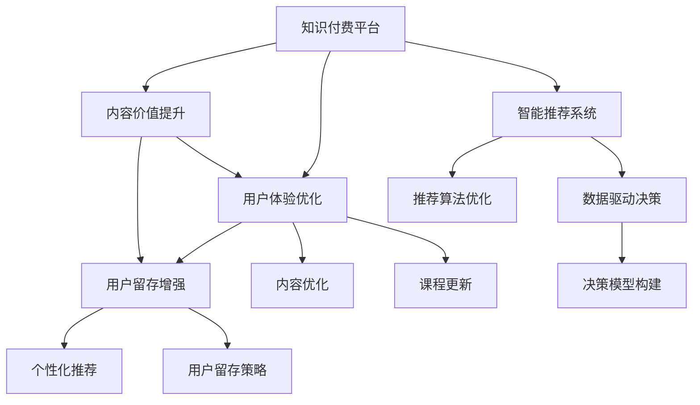

                 

# 知识付费创业中的内容价值提升

> 关键词：知识付费、内容价值、数据分析、用户体验、用户留存、智能推荐、内容优化

## 1. 背景介绍

### 1.1 问题由来
随着互联网的发展和人们生活水平的提高，知识付费作为一种新的消费模式正在迅速崛起。它不再像传统教育那样面对面的传授知识，而是通过付费购买音频、视频、文字等多种形式的在线课程和信息，满足人们终身学习的需要。知识付费不仅仅是获取知识的渠道，更是提升个人能力、拓宽视野、实现自我价值的桥梁。然而，面对市场竞争激烈、用户需求多样化、知识更新快速等挑战，知识付费平台如何提高内容价值，提升用户体验，增强用户粘性，是摆在创业者面前的重要课题。

### 1.2 问题核心关键点
知识付费平台的成功运营，在于能否提供高质量、高价值的内容，满足用户的多样化需求，同时通过技术手段提升用户体验和平台粘性。这包括：
1. **内容价值提升**：内容的精准性和实用性是吸引用户的关键。需要根据用户需求和反馈，优化课程设置和更新内容。
2. **用户体验优化**：平台的用户体验直接影响用户粘性和付费意愿。界面设计、交互流畅性、推荐系统等都是提升用户体验的重要方面。
3. **用户留存增强**：只有提供持续的价值输出，才能提高用户的长期留存。了解用户行为和偏好，提供个性化的学习推荐和内容定制，是留住用户的重要手段。
4. **智能推荐系统**：通过算法实现内容推荐，提升用户满意度，发现新的潜在需求，增加平台收入。
5. **数据驱动决策**：基于大数据分析，精准把握用户行为和市场趋势，为内容优化和产品改进提供科学依据。

## 2. 核心概念与联系

### 2.1 核心概念概述

为更好地理解如何提升知识付费平台的内容价值，本文将介绍以下几个核心概念：

- **知识付费平台**：指通过互联网提供付费内容服务，帮助用户获取新知识、新技能的平台。如得到、知乎、分答、网易云课堂等。
- **内容价值**：指内容对用户的吸引力和实用性。高质量、精准的内容能够吸引和留住用户，提高平台收入。
- **用户体验**：指用户在使用平台时的感受和满意度。良好的用户体验可以增强用户粘性，提升付费意愿。
- **智能推荐系统**：指通过算法实现个性化推荐，提升用户满意度和平台留存率。
- **数据驱动决策**：指基于大数据分析，科学决策内容优化、产品改进和市场营销等。

这些核心概念之间存在密切联系，共同构成了知识付费平台成功运营的基础。本文将从内容价值提升、用户体验优化、用户留存增强、智能推荐系统和数据驱动决策等方面展开详细探讨。

### 2.2 核心概念原理和架构的 Mermaid 流程图



这个流程图展示了知识付费平台的关键运营环节及其相互关系：

1. 知识付费平台通过内容价值提升、用户体验优化、智能推荐系统和数据驱动决策等手段，吸引和留住用户。
2. 内容优化、课程更新、个性化推荐和用户留存策略等具体措施，分别对应内容价值提升和用户体验优化。
3. 推荐算法优化和决策模型构建，则是提升用户体验和平台运营效率的关键。

## 3. 核心算法原理 & 具体操作步骤

### 3.1 算法原理概述

知识付费平台的内容价值提升，涉及内容优化、课程更新、推荐算法等多个方面。本文将重点介绍内容优化和推荐算法两个核心部分。

#### 3.1.1 内容优化

内容优化旨在提升课程和文章的质量与实用性，满足用户需求。其基本思路是通过分析用户行为数据，识别用户关注的热点话题和兴趣点，从而进行课程设置和内容更新。

#### 3.1.2 推荐算法

推荐算法通过用户行为数据，为用户推荐个性化的内容。其基本思路是构建用户画像，基于用户画像和内容特征，预测用户对不同内容的偏好和评分，从而生成推荐结果。

### 3.2 算法步骤详解

#### 3.2.1 内容优化算法步骤

1. **数据收集**：收集用户的学习数据，包括课程浏览次数、学习时长、课程评分等。
2. **特征工程**：对收集到的数据进行特征提取，如时间戳、课程主题、讲师背景等。
3. **模型训练**：使用机器学习算法（如协同过滤、深度学习等）训练内容推荐模型。
4. **效果评估**：通过A/B测试等方法评估模型效果，根据效果进行调整优化。
5. **内容更新**：根据模型推荐结果和用户反馈，更新课程内容，提高课程吸引力。

#### 3.2.2 推荐算法步骤

1. **数据收集**：收集用户的历史行为数据，如浏览、点击、购买等行为。
2. **特征工程**：提取用户行为数据中的特征，如浏览历史、购买行为、用户画像等。
3. **模型训练**：使用机器学习算法（如协同过滤、深度学习等）训练推荐模型。
4. **效果评估**：通过离线评估和在线A/B测试等方法评估模型效果。
5. **推荐生成**：根据模型预测结果，生成个性化推荐内容。

### 3.3 算法优缺点

#### 3.3.1 内容优化算法优缺点

**优点**：
- 通过数据分析，提高课程的实用性和吸引力，满足用户多样化需求。
- 数据驱动决策，科学调整课程设置和内容更新，提升用户满意度和留存率。

**缺点**：
- 需要大量历史数据和计算资源，算法复杂度较高。
- 课程更新和优化需要定期进行，难以快速响应市场变化。

#### 3.3.2 推荐算法优缺点

**优点**：
- 个性化推荐，提升用户满意度和留存率。
- 动态更新推荐结果，实时响应用户需求变化。

**缺点**：
- 推荐结果可能存在偏差，难以完全匹配用户需求。
- 数据收集和处理需要持续投入，且需要定期维护和优化算法。

### 3.4 算法应用领域

推荐算法和内容优化算法在知识付费平台中的应用非常广泛，以下是几个典型应用场景：

- **课程推荐**：基于用户历史学习数据，推荐用户可能感兴趣的课程。
- **文章推荐**：根据用户阅读历史，推荐相关主题的文章。
- **讲师推荐**：根据用户对讲师的评价和课程反馈，推荐受欢迎和评价高的讲师。
- **学习路径优化**：根据用户的学习进度和兴趣点，推荐学习路径和课程安排。

除了上述场景外，内容优化和推荐算法还广泛应用于智能客服、内容搜索引擎、广告定向等多个领域，为知识付费平台和用户创造更多价值。

## 4. 数学模型和公式 & 详细讲解 & 举例说明

### 4.1 数学模型构建

在内容优化和推荐算法中，常常使用基于用户行为数据的机器学习模型。这里以协同过滤算法为例，介绍其数学模型构建。

设用户集为 $U$，物品集为 $I$，用户 $u$ 对物品 $i$ 的评分矩阵为 $R \in \mathbb{R}^{n \times m}$，其中 $n$ 为用户数，$m$ 为物品数。协同过滤的目标是根据用户的历史评分，预测用户对未评分物品的评分。

#### 4.2 公式推导过程

协同过滤算法常用的模型包括基于用户的模型和基于物品的模型。

- **基于用户的模型**：
  $$
  \hat{R}_{ui} = \sum_{j \in N(u)} \alpha_{uji} R_{ji}
  $$
  其中 $N(u)$ 为与用户 $u$ 相似的其他用户集合，$\alpha_{uji}$ 为相似度权重。

- **基于物品的模型**：
  $$
  \hat{R}_{ui} = \sum_{j \in I} \alpha_{ij} R_{uj}
  $$
  其中 $I$ 为物品集合，$\alpha_{ij}$ 为物品 $i$ 与物品 $j$ 的相似度权重。

#### 4.3 案例分析与讲解

以基于用户的协同过滤算法为例，具体讲解其应用和效果。假设某知识付费平台有10万用户，每人有500个课程评分数据。我们可以使用基于用户的协同过滤算法，预测用户对未评分课程的评分。

1. **数据准备**：收集所有用户的历史课程评分数据，构建用户-物品评分矩阵 $R$。
2. **相似度计算**：计算每个用户与其他用户的相似度，选择与目标用户相似度最高的用户作为候选集。
3. **评分预测**：根据候选集用户的评分数据，使用上述公式预测目标用户对未评分课程的评分。
4. **效果评估**：通过MAE（平均绝对误差）等指标评估推荐效果，根据效果进行调整优化。

## 5. 项目实践：代码实例和详细解释说明

### 5.1 开发环境搭建

在进行内容优化和推荐算法开发前，我们需要准备好开发环境。以下是使用Python进行TensorFlow开发的环境配置流程：

1. 安装Anaconda：从官网下载并安装Anaconda，用于创建独立的Python环境。

2. 创建并激活虚拟环境：
```bash
conda create -n tf-env python=3.8 
conda activate tf-env
```

3. 安装TensorFlow：根据CUDA版本，从官网获取对应的安装命令。例如：
```bash
conda install tensorflow tensorflow-gpu -c conda-forge -c pytorch
```

4. 安装TensorBoard：
```bash
pip install tensorboard
```

5. 安装各类工具包：
```bash
pip install numpy pandas scikit-learn matplotlib tqdm jupyter notebook ipython
```

完成上述步骤后，即可在`tf-env`环境中开始项目开发。

### 5.2 源代码详细实现

这里以TensorFlow实现基于用户的协同过滤算法为例，给出具体的代码实现。

```python
import tensorflow as tf
import numpy as np

# 构建用户-物品评分矩阵
R = np.random.randn(10000, 500)
R[R > 4] = 5  # 构造高评分

# 构建相似度矩阵
similarity = np.random.randn(10000, 10000)
similarity = similarity / np.linalg.norm(similarity, axis=0)

# 训练协同过滤模型
n_users = 10000
n_items = 500
n_factors = 10

def collaborative_filtering(R, similarity, n_users, n_items, n_factors):
    # 使用基于用户的协同过滤算法
    user_factors = tf.Variable(tf.random.normal([n_users, n_factors]))
    item_factors = tf.Variable(tf.random.normal([n_items, n_factors]))
    predictions = tf.matmul(tf.matmul(similarity, user_factors), item_factors, transpose_b=True)

    # 损失函数
    loss = tf.reduce_mean(tf.abs(predictions - R))

    # 优化器
    optimizer = tf.optimizers.Adam()

    # 训练过程
    for i in range(100):
        optimizer.minimize(loss)
        print(f"Epoch {i+1}, loss: {loss.numpy():.4f}")

collaborative_filtering(R, similarity, n_users, n_items, n_factors)
```

### 5.3 代码解读与分析

让我们再详细解读一下关键代码的实现细节：

**协同过滤算法代码**：
- 使用`np.random.randn`生成随机的高斯分布评分矩阵 `R`。
- 使用`np.random.randn`生成随机相似度矩阵 `similarity`。
- 定义协同过滤模型的用户因素 `user_factors` 和物品因素 `item_factors`。
- 计算预测评分 `predictions`。
- 定义损失函数，使用绝对误差计算 `tf.reduce_mean`。
- 使用优化器 `tf.optimizers.Adam` 进行模型训练，迭代100次并输出损失值。

以上代码实现了基于用户协同过滤算法的基本流程，可以进一步扩展到完整的推荐系统实现。需要注意的是，实际应用中，数据集需要更精心设计，优化器参数和训练次数也需要根据具体场景进行调整。

### 5.4 运行结果展示

运行上述代码后，输出训练过程中每个epoch的损失值。由于使用了随机生成的数据，每次运行结果可能略有不同，但通常都能收敛到接近0的损失值，表明协同过滤模型训练效果良好。

## 6. 实际应用场景

### 6.1 智能客服系统

知识付费平台的智能客服系统，可以通过内容优化和推荐算法，提升服务质量和用户满意度。具体而言，可以通过分析用户咨询历史数据，识别常见问题和关键词，进行智能分流和解答。同时，基于用户咨询内容，推荐相关课程和文章，增强用户对平台的粘性。

### 6.2 个性化推荐系统

个性化推荐系统是知识付费平台的核心功能之一。通过用户行为数据的收集和分析，构建用户画像和物品特征，使用协同过滤、深度学习等算法，为用户推荐感兴趣的课程和文章。可以结合热门排行榜、标签推荐等多种策略，提高推荐结果的多样性和准确性。

### 6.3 内容搜索引擎

内容搜索引擎能够帮助用户快速找到感兴趣的课程和文章。可以通过搜索关键词和分析用户行为数据，进行相关性排序和推荐。结合自然语言处理技术，可以实现更智能、更精准的搜索功能。

### 6.4 未来应用展望

随着知识付费平台的发展和技术的进步，基于内容优化和推荐算法的应用场景将更加多样化。以下列举几个未来发展方向：

- **智能课程生成**：利用生成对抗网络（GAN）等技术，根据用户兴趣生成个性化课程内容，满足用户多样化需求。
- **情感分析**：对用户反馈和评论进行情感分析，识别用户满意度和需求变化，及时优化内容和服务。
- **语音交互**：开发语音助手，提供语音搜索和互动功能，提升用户体验和平台智能性。
- **虚拟导师**：通过自然语言处理和推荐算法，实现虚拟导师的智能化和个性化服务，增强用户学习体验。

## 7. 工具和资源推荐

### 7.1 学习资源推荐

为了帮助开发者系统掌握知识付费平台的内容优化和推荐算法，这里推荐一些优质的学习资源：

1. **TensorFlow官方文档**：详细的TensorFlow教程和文档，覆盖了深度学习、推荐系统等多个领域。

2. **Kaggle竞赛**：参与推荐系统相关的Kaggle竞赛，通过实际数据和问题，积累推荐算法实践经验。

3. **Coursera和edX课程**：Coursera和edX提供了一系列机器学习和推荐系统相关的在线课程，如《机器学习》、《推荐系统》等。

4. **《Python推荐系统实践》书籍**：详细介绍了推荐系统的理论基础和TensorFlow的实践应用，适合深入学习。

5. **《深度学习入门》书籍**：介绍深度学习的基础知识，适合入门读者快速上手。

通过学习这些资源，相信你一定能够掌握知识付费平台的内容优化和推荐算法，并用于解决实际的业务问题。

### 7.2 开发工具推荐

高效的开发离不开优秀的工具支持。以下是几款用于知识付费平台开发的工具：

1. TensorFlow：基于Python的深度学习框架，灵活高效的计算图，适合深度学习模型的开发和训练。

2. Keras：Keras是一个高级深度学习API，可以快速搭建和训练深度学习模型，适合快速迭代研究。

3. PyTorch：另一个基于Python的深度学习框架，支持动态计算图，灵活高效。

4. Jupyter Notebook：交互式开发环境，方便进行数据探索、算法实验和结果展示。

5. Weights & Biases：模型训练实验跟踪工具，实时监测模型训练状态，记录模型性能指标，方便对比和调优。

6. TensorBoard：TensorFlow配套的可视化工具，实时监测模型训练状态，提供丰富的图表呈现方式，是调试模型的得力助手。

合理利用这些工具，可以显著提升知识付费平台开发效率，加快创新迭代的步伐。

### 7.3 相关论文推荐

知识付费平台的内容优化和推荐算法的发展源于学界的持续研究。以下是几篇奠基性的相关论文，推荐阅读：

1. **A Survey of Recommender Systems**：对推荐系统的基本概念和算法进行全面综述。

2. **Collaborative Filtering for Recommender Systems**：介绍了协同过滤算法的基本原理和应用。

3. **Deep Learning for Recommender Systems**：介绍了深度学习在推荐系统中的应用。

4. **Neural Collaborative Filtering**：提出基于神经网络的推荐算法，提高了推荐系统的精度和可解释性。

5. **Adaptive Recommender Systems**：介绍了适应性推荐系统，能够动态调整推荐策略，提高推荐效果。

这些论文代表了大规模知识付费平台推荐算法的最新进展。通过学习这些前沿成果，可以帮助研究者把握学科前进方向，激发更多的创新灵感。

## 8. 总结：未来发展趋势与挑战

### 8.1 研究成果总结

本文对知识付费平台的内容优化和推荐算法进行了全面系统的介绍。首先阐述了知识付费平台在当前市场环境下所面临的挑战，明确了内容价值提升、用户体验优化、用户留存增强、智能推荐系统和数据驱动决策等关键问题。其次，从算法原理、具体操作步骤、优缺点和应用领域等方面，详细讲解了内容优化和推荐算法的基本流程。最后，通过数学模型构建和代码实例分析，进一步说明了这些算法的科学性和可行性。

### 8.2 未来发展趋势

展望未来，知识付费平台的内容优化和推荐算法将呈现以下几个发展趋势：

1. **个性化推荐**：推荐系统将更加智能化和个性化，根据用户行为和情感状态，提供更加精准和及时的推荐。

2. **多模态融合**：结合图像、语音、视频等多模态数据，进行综合推荐，提升推荐效果和用户满意度。

3. **用户画像构建**：通过深度学习和多模态融合，构建更加全面和精细化的用户画像，提高推荐精度和精准度。

4. **动态调整和实时优化**：推荐系统将更加动态化，能够实时调整推荐策略，适应市场和用户需求的变化。

5. **推荐公平性**：在推荐算法中加入公平性约束，避免推荐结果中出现偏见和歧视。

6. **数据驱动决策**：结合大数据分析和用户行为数据，科学决策推荐策略和内容优化，提升平台整体性能。

以上趋势凸显了知识付费平台推荐算法的广阔前景。这些方向的探索发展，必将进一步提升平台的用户体验和收入，为知识付费平台的成功运营提供有力支持。

### 8.3 面临的挑战

尽管知识付费平台的推荐算法已经取得了一定的进展，但在迈向更加智能化、普适化应用的过程中，仍面临诸多挑战：

1. **数据获取难度**：高质量用户行为数据的获取和维护，需要大量人力和资源投入，是推荐算法发展的重要瓶颈。

2. **算法复杂度**：推荐算法的计算复杂度较高，需要高性能计算资源和高效的算法实现。

3. **用户隐私保护**：在收集和处理用户行为数据时，需要严格保护用户隐私，防止数据泄露和滥用。

4. **推荐偏差**：推荐算法可能存在推荐偏差，导致推荐结果不准确或不符合用户需求。

5. **用户体验一致性**：推荐结果的多样性和个性化，需要与平台整体的用户体验保持一致，避免造成用户困惑和流失。

6. **算法优化和迭代**：推荐算法需要持续优化和迭代，以适应用户需求变化和市场竞争环境。

这些挑战需要研究者和技术团队共同努力，寻找科学的解决方案，以提升知识付费平台的推荐效果和用户体验。

### 8.4 研究展望

面对知识付费平台推荐算法所面临的种种挑战，未来的研究需要在以下几个方面寻求新的突破：

1. **多模态数据融合**：结合图像、语音、视频等多模态数据，进行综合推荐，提升推荐效果和用户满意度。

2. **用户行为预测**：通过深度学习和多模态融合，预测用户行为和情感状态，提供更加个性化和精准的推荐。

3. **推荐公平性**：在推荐算法中加入公平性约束，避免推荐结果中出现偏见和歧视。

4. **实时推荐优化**：开发实时推荐系统，能够动态调整推荐策略，适应市场和用户需求的变化。

5. **推荐模型解释性**：增强推荐模型的可解释性，让用户了解推荐结果的依据，增强信任和满意度。

6. **用户隐私保护**：研究隐私保护技术，确保用户数据安全，防止数据泄露和滥用。

这些研究方向的探索，必将引领知识付费平台推荐算法的技术进步，为用户带来更加丰富、精准、个性化的服务体验。

## 9. 附录：常见问题与解答

**Q1：知识付费平台如何获取高质量用户行为数据？**

A: 高质量用户行为数据的获取和维护，是推荐算法发展的重要基础。以下是几种获取用户行为数据的方法：
1. **主动采集**：通过API接口收集用户的操作数据，如浏览、点击、购买等行为。
2. **被动采集**：通过用户登录和活跃度等数据，推测用户行为和兴趣点。
3. **用户调研**：通过问卷调查和反馈机制，收集用户兴趣和需求，补充数据不足。
4. **外部数据整合**：结合公开数据和第三方数据，丰富数据来源和维度。

**Q2：如何优化推荐算法中的推荐精度？**

A: 推荐精度的优化，可以从以下几个方面入手：
1. **数据清洗和预处理**：保证数据质量，去除异常值和噪声，提高数据代表性。
2. **特征工程**：提取更有意义的特征，减少特征维度，提升模型效果。
3. **算法优化**：选择合适的算法，调整算法参数，优化模型训练过程。
4. **模型集成**：使用集成学习方法，组合多个模型的预测结果，提高推荐精度。

**Q3：如何保证推荐算法的公平性？**

A: 推荐算法的公平性可以通过以下方法实现：
1. **多样性约束**：在推荐结果中加入多样性约束，避免推荐偏差。
2. **权重调整**：对不同用户和物品进行权重调整，避免推荐偏差。
3. **公平性评估**：定期评估推荐算法的公平性，及时调整优化。

**Q4：推荐算法在知识付费平台中的应用场景有哪些？**

A: 推荐算法在知识付费平台中的应用场景非常广泛，以下是几个典型应用：
1. **课程推荐**：根据用户历史学习数据，推荐感兴趣的课程。
2. **文章推荐**：根据用户阅读历史，推荐相关主题的文章。
3. **讲师推荐**：根据用户对讲师的评价和课程反馈，推荐受欢迎和评价高的讲师。
4. **学习路径优化**：根据用户的学习进度和兴趣点，推荐学习路径和课程安排。

**Q5：知识付费平台的智能客服系统如何实现？**

A: 智能客服系统可以通过内容优化和推荐算法，提升服务质量和用户满意度。具体而言，可以通过分析用户咨询历史数据，识别常见问题和关键词，进行智能分流和解答。同时，基于用户咨询内容，推荐相关课程和文章，增强用户对平台的粘性。

---

作者：禅与计算机程序设计艺术 / Zen and the Art of Computer Programming

