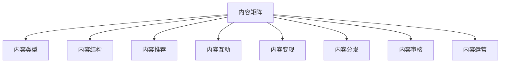

                 

# 知识付费创业中的内容矩阵搭建

## 1. 背景介绍

随着互联网的迅猛发展，知识付费成为众多创业者和企业争相布局的新赛道。知识付费不仅满足了人们日益增长的知识需求，还通过付费模式实现了知识内容生产者的价值变现，从而推动了内容生产的持续性和优质性。在这一过程中，构建合理、高效的内容矩阵，成为知识付费平台竞争力的重要组成部分。内容矩阵搭建得好，可以大幅提升用户体验和平台粘性，进而吸引更多用户和广告主入驻，实现良性循环。

### 1.1 问题由来

知识付费领域的竞争日益激烈，各大平台不断涌现。然而，内容质量参差不齐，用户体验难以得到全面保障。如何在知识付费创业中打造优质的内容矩阵，成为各大平台关注的焦点。本文将从内容矩阵的定义、组成、搭建步骤及案例分析等方面，深入探讨知识付费创业中内容矩阵的搭建策略。

### 1.2 问题核心关键点

内容矩阵的搭建需要综合考虑内容质量、用户需求、平台特性等多个维度。核心关键点包括：

- **内容类型**：涵盖图书、音频、视频、直播等多种形式。
- **内容结构**：纵向包括基础课程、进阶课程、专项课程等层次。
- **内容推荐**：横向通过算法推荐，提升用户粘性。
- **内容互动**：用户可以通过评论、点赞、打赏等形式参与内容互动，增强用户粘性。
- **内容变现**：通过付费模式、广告分成等方式实现内容变现，形成良性循环。

本文将重点探讨如何在知识付费创业中，构建一个高质量、高效率、高互动的内容矩阵，提升平台的竞争力。

## 2. 核心概念与联系

### 2.1 核心概念概述

为更好地理解内容矩阵的搭建策略，本节将介绍几个密切相关的核心概念：

- **内容矩阵**：指将不同类型、不同层次、不同形式的内容，通过算法和推荐系统进行组合，形成一个多维度、多层次、多模态的内容体系，以提升用户粘性和平台变现能力。

- **内容类型**：涵盖图书、音频、视频、直播等多种形式。

- **内容结构**：纵向包括基础课程、进阶课程、专项课程等层次。

- **内容推荐**：横向通过算法推荐，提升用户粘性。

- **内容互动**：用户可以通过评论、点赞、打赏等形式参与内容互动，增强用户粘性。

- **内容变现**：通过付费模式、广告分成等方式实现内容变现，形成良性循环。

- **内容分发**：通过自有平台或合作渠道，将内容分发给用户，提高内容曝光度和用户获取率。

- **内容审核**：对内容进行质量审核，确保内容健康、合法。

- **内容运营**：通过制定内容策略、优化用户体验、调整推荐算法等方式，提升内容矩阵效果。

这些核心概念之间的逻辑关系可以通过以下Mermaid流程图来展示：



这个流程图展示内容矩阵的核心概念及其之间的关系：

1. 内容矩阵通过各种内容类型、结构、推荐、互动等元素，形成一个多维度、多层次、多模态的内容体系。
2. 纵向的内容结构，涵盖基础课程、进阶课程、专项课程等层次，满足不同层次用户需求。
3. 横向的内容推荐，通过算法提升用户粘性，提供精准的内容推送。
4. 内容互动，通过评论、点赞、打赏等形式，增强用户粘性和平台变现能力。
5. 内容分发和内容审核，确保内容健康、合法，提高内容曝光度和用户获取率。
6. 内容运营，通过优化用户体验、调整推荐算法等方式，提升内容矩阵效果。

这些核心概念共同构成了内容矩阵的搭建框架，通过理解这些概念，我们可以更好地把握内容矩阵的工作原理和优化方向。

## 3. 核心算法原理 & 具体操作步骤
### 3.1 算法原理概述

内容矩阵的搭建，本质是一个多目标优化问题。目标包括提升内容质量、提升用户体验、提高平台粘性和变现能力等。核心算法原理主要包括：

- **推荐算法**：通过协同过滤、基于内容的推荐、混合推荐等算法，提升内容推荐效果。
- **个性化算法**：利用用户行为数据，如浏览、购买、互动等，生成个性化推荐，提升用户粘性。
- **定价策略**：通过动态定价模型，实现优质内容的差异化定价，提高平台变现能力。
- **内容审核算法**：利用自然语言处理、图像识别等技术，对内容进行质量审核，确保内容健康、合法。
- **内容生成算法**：通过生成对抗网络、语言模型等技术，生成高质量内容，丰富内容矩阵。

### 3.2 算法步骤详解

内容矩阵的搭建一般包括以下几个关键步骤：

**Step 1: 确定内容类型和结构**

- 根据目标用户需求，确定内容类型，如课程、文章、视频、音频等。
- 设计内容结构，如基础课程、进阶课程、专项课程等，满足不同层次用户需求。

**Step 2: 数据收集与处理**

- 收集用户行为数据，如浏览记录、购买记录、评论内容等。
- 进行数据清洗和预处理，去除噪声和异常值。

**Step 3: 算法模型搭建**

- 搭建推荐算法模型，如协同过滤、基于内容的推荐、混合推荐等。
- 搭建个性化算法模型，如基于内容的个性化推荐、协同过滤的个性化推荐等。
- 搭建定价策略模型，如动态定价模型、价格弹性模型等。
- 搭建内容审核算法模型，如自然语言处理、图像识别等。
- 搭建内容生成算法模型，如生成对抗网络、语言模型等。

**Step 4: 模型训练与优化**

- 利用收集的数据训练模型，并进行参数调优。
- 使用交叉验证、超参数调优等技术，提升模型效果。

**Step 5: 内容矩阵搭建与上线**

- 将训练好的模型应用到内容推荐、个性化推荐、内容定价、内容审核、内容生成等环节。
- 定期评估模型效果，根据用户反馈进行调整和优化。

### 3.3 算法优缺点

内容矩阵的搭建方法具有以下优点：

- 提升用户体验：通过个性化推荐和互动，提升用户粘性和满意度。
- 提高内容曝光率：通过算法推荐，提升优质内容的曝光率，吸引更多用户。
- 实现内容变现：通过差异化定价和付费模式，实现优质内容的变现。
- 丰富内容矩阵：通过内容生成算法，生成更多高质量内容，丰富平台内容库。

同时，该方法也存在一些局限性：

- 算法复杂度较高：需要搭建多种算法模型，并对其进行调优和评估，开发和维护成本较高。
- 数据需求较大：需要大量的用户行为数据，数据获取和处理成本较高。
- 个性化难度大：用户行为数据的多样性和复杂性，使得个性化推荐难度较大。
- 内容审核难度大：内容审核涉及多种形式的内容，审核难度较大。

尽管存在这些局限性，但就目前而言，内容矩阵的搭建仍是知识付费平台竞争力的重要组成部分。未来相关研究的重点在于如何进一步降低算法复杂度和数据需求，提高个性化推荐和内容审核的精准度，同时兼顾可解释性和伦理安全性等因素。

### 3.4 算法应用领域

内容矩阵的搭建方法在知识付费领域已经得到了广泛应用，主要包括以下几个方面：

- **课程推荐**：根据用户的历史行为和兴趣，推荐适合的课程，提高课程购买率。
- **文章推荐**：根据用户的阅读历史和喜好，推荐感兴趣的文章，提高文章阅读量和广告曝光率。
- **视频推荐**：根据用户的观看历史和评分，推荐感兴趣的视频，提高视频观看率和订阅率。
- **直播推荐**：根据用户的观看历史和互动行为，推荐感兴趣的主播和直播内容，提高直播观看率和打赏率。
- **商品推荐**：根据用户购买历史和评价，推荐相关商品，提高商品销售率。

除了上述这些经典应用外，内容矩阵的搭建方法还被创新性地应用到更多场景中，如多模态内容推荐、个性化搜索结果、智能客服、智能广告等，为知识付费技术带来新的突破。随着算法和技术的不断进步，相信内容矩阵的搭建方法将在更广阔的应用领域发挥更大的作用。

## 4. 数学模型和公式 & 详细讲解  
### 4.1 数学模型构建

本节将使用数学语言对内容矩阵的搭建过程进行更加严格的刻画。

记内容矩阵为 $M$，其中每行表示一个内容，每列表示一个特征（如用户行为、内容属性等）。设 $X$ 为特征矩阵，$Y$ 为用户行为矩阵，$R$ 为推荐结果矩阵。

定义内容矩阵 $M$ 与特征矩阵 $X$ 之间的相似度为 $S(X,Y)$，推荐算法的目标是最小化 $R$ 与 $Y$ 的差异：

$$
\min_{R} \|R-Y\|
$$

其中，$Y$ 为用户行为矩阵，$R$ 为推荐结果矩阵，$Y$ 与 $R$ 的差异通过矩阵的 Frobenius 范数 $\|\cdot\|$ 度量。

在实践中，我们通常使用基于梯度的优化算法（如SGD、Adam等）来近似求解上述最优化问题。设 $\eta$ 为学习率，则参数的更新公式为：

$$
R \leftarrow R - \eta \nabla_{R} \|R-Y\|
$$

其中 $\nabla_{R} \|R-Y\|$ 为损失函数对推荐结果矩阵 $R$ 的梯度，可通过反向传播算法高效计算。

### 4.2 公式推导过程

以下我们以协同过滤推荐算法为例，推导推荐结果矩阵 $R$ 的计算公式。

设用户集合为 $U$，物品集合为 $I$，用户 $u$ 对物品 $i$ 的评分向量为 $r_{ui}$。设 $I_i$ 为物品 $i$ 的评分向量，则协同过滤算法的推荐结果矩阵 $R$ 可表示为：

$$
R_{ui} = \sum_{i \in I} r_{ui} \times r_{iu}
$$

其中 $r_{iu}$ 为物品 $i$ 对用户 $u$ 的评分，$R_{ui}$ 为物品 $i$ 对用户 $u$ 的推荐评分。

在得到推荐结果矩阵 $R$ 后，即可带入参数更新公式，完成模型的迭代优化。重复上述过程直至收敛，最终得到推荐矩阵 $R$，用于内容推荐。

## 5. 项目实践：代码实例和详细解释说明
### 5.1 开发环境搭建

在进行内容矩阵搭建实践前，我们需要准备好开发环境。以下是使用Python进行TensorFlow开发的环境配置流程：

1. 安装Anaconda：从官网下载并安装Anaconda，用于创建独立的Python环境。

2. 创建并激活虚拟环境：
```bash
conda create -n tf-env python=3.8 
conda activate tf-env
```

3. 安装TensorFlow：根据CUDA版本，从官网获取对应的安装命令。例如：
```bash
conda install tensorflow -c pytorch -c conda-forge
```

4. 安装各类工具包：
```bash
pip install numpy pandas scikit-learn matplotlib tqdm jupyter notebook ipython
```

完成上述步骤后，即可在`tf-env`环境中开始内容矩阵搭建实践。

### 5.2 源代码详细实现

这里我们以基于协同过滤算法的内容推荐为例，给出使用TensorFlow实现的内容矩阵搭建代码。

首先，定义协同过滤算法中的相似度函数：

```python
import tensorflow as tf
import numpy as np

def similarity_matrix(X):
    # 计算用户行为矩阵 X 与特征矩阵 X 的余弦相似度
    similarity = np.dot(X.T, X) / (np.linalg.norm(X, axis=1) * np.linalg.norm(X.T, axis=1))
    return similarity
```

然后，定义协同过滤算法的推荐函数：

```python
def collaborative_filtering(X, Y, alpha=0.5, max_iter=100, tol=1e-5):
    # 初始化推荐结果矩阵 R
    R = np.zeros((X.shape[0], Y.shape[1]))
    # 计算用户行为矩阵 Y 与推荐结果矩阵 R 的余弦相似度
    YR = np.dot(Y.T, R) / (np.linalg.norm(Y.T, axis=1) * np.linalg.norm(R, axis=1))
    # 迭代更新推荐结果矩阵 R
    for i in range(max_iter):
        R = alpha * YR + (1 - alpha) * R
        # 更新推荐结果矩阵 R
        YR = np.dot(Y.T, R) / (np.linalg.norm(Y.T, axis=1) * np.linalg.norm(R, axis=1))
        # 判断是否收敛
        if np.linalg.norm(YR - R) < tol:
            break
    return R
```

最后，启动训练流程并在测试集上评估：

```python
X = # 特征矩阵
Y = # 用户行为矩阵

# 计算相似度矩阵
similarity = similarity_matrix(X)

# 训练协同过滤算法
R = collaborative_filtering(X, Y)

# 在测试集上评估推荐结果
test_X = # 测试集特征矩阵
test_Y = # 测试集用户行为矩阵
test_R = collaborative_filtering(test_X, test_Y)

# 计算推荐结果的平均绝对误差
mae = np.mean(np.abs(test_R - test_Y))
print("MAE:", mae)
```

以上就是使用TensorFlow进行内容矩阵搭建的完整代码实现。可以看到，TensorFlow提供的Tensorflow数学库可以方便地进行矩阵运算和优化，同时支持分布式训练和高效的反向传播算法。

### 5.3 代码解读与分析

让我们再详细解读一下关键代码的实现细节：

**相似度矩阵函数**：
- 计算用户行为矩阵 $X$ 与特征矩阵 $X$ 的余弦相似度，构建相似度矩阵。

**协同过滤算法函数**：
- 初始化推荐结果矩阵 $R$，使用当前相似度矩阵 $YR$ 和当前推荐结果矩阵 $R$ 的相似度进行迭代更新。
- 每次迭代中，使用相似度矩阵更新推荐结果矩阵 $R$。
- 判断当前推荐结果矩阵 $R$ 与上一次的结果是否收敛，如果收敛则停止迭代。

**训练流程**：
- 计算特征矩阵 $X$ 与用户行为矩阵 $Y$ 的相似度矩阵。
- 使用协同过滤算法函数进行模型训练。
- 在测试集上评估推荐结果，计算平均绝对误差（MAE）。

可以看到，TensorFlow提供了丰富的数学库和优化算法，使得内容矩阵的搭建更加高效和便捷。开发者可以将更多精力放在特征工程、模型优化等高层逻辑上，而不必过多关注底层的实现细节。

当然，工业级的系统实现还需考虑更多因素，如模型保存和部署、超参数自动搜索、更灵活的算法选择等。但核心的内容矩阵搭建思路基本与此类似。

## 6. 实际应用场景
### 6.1 在线教育

在线教育平台通过内容矩阵搭建，可以为用户提供个性化推荐服务，显著提升学习效果和平台粘性。

具体而言，平台可以收集用户的学习历史、互动行为等数据，利用协同过滤算法等方法，推荐用户感兴趣的学习资源，帮助用户提高学习效率。例如，某用户学习某一课程后，系统可以根据其学习进度和成绩，推荐相关课程、习题集等，帮助用户查漏补缺，加速学习进程。

### 6.2 电子商务

电商平台通过内容矩阵搭建，可以实现商品推荐、用户画像生成等功能，提升用户购物体验和平台转化率。

具体而言，平台可以收集用户浏览记录、购买记录等行为数据，利用协同过滤、基于内容的推荐算法等方法，推荐用户感兴趣的商品，提升用户购买转化率。同时，平台还可以生成用户画像，根据用户兴趣和需求，推送个性化广告，提高广告转化率。

### 6.3 智能广告

智能广告平台通过内容矩阵搭建，可以实现精准广告投放，提升广告效果和广告主投放ROI。

具体而言，平台可以收集用户的浏览记录、搜索记录等行为数据，利用协同过滤算法、基于内容的推荐算法等方法，推荐用户感兴趣的商品和广告，提高广告点击率和转化率。同时，平台还可以根据用户行为数据，生成用户画像，实现精准定向投放，提升广告效果。

### 6.4 未来应用展望

随着内容矩阵的不断优化，未来在更多领域的应用前景将更加广阔。

在智能医疗领域，通过分析患者的病历数据，推荐合适的诊疗方案，提高诊疗效率和质量。

在智慧城市领域，通过分析市民的出行数据，推荐合适的出行方案，提升市民的出行体验。

在智能家居领域，通过分析用户的日常行为数据，推荐合适的家居产品，提升用户生活品质。

总之，内容矩阵搭建在知识付费领域的成功应用，将为其他领域的智能化改造提供借鉴，推动各行业数字化转型进程。相信随着技术进步和数据积累，内容矩阵的搭建方法将在更多领域发挥作用，为社会带来新的价值。

## 7. 工具和资源推荐
### 7.1 学习资源推荐

为了帮助开发者系统掌握内容矩阵搭建的理论基础和实践技巧，这里推荐一些优质的学习资源：

1. 《推荐系统实战》系列博文：由专家撰写，深入浅出地介绍了推荐系统的原理和实践，包括协同过滤、基于内容的推荐等算法。

2. 《个性化推荐系统》书籍：全面介绍了个性化推荐系统的理论基础和算法实现，涵盖协同过滤、基于内容的推荐等方法。

3. Kaggle推荐系统竞赛：参与实际推荐系统竞赛，深入理解推荐算法，提升实践能力。

4. TensorFlow官方文档：TensorFlow的官方文档，提供了丰富的推荐系统样例和API接口，是上手实践的重要资料。

5. Weights & Biases：模型训练的实验跟踪工具，可以记录和可视化模型训练过程中的各项指标，方便对比和调优。

通过对这些资源的学习实践，相信你一定能够快速掌握内容矩阵搭建的精髓，并用于解决实际推荐系统问题。

### 7.2 开发工具推荐

高效的开发离不开优秀的工具支持。以下是几款用于内容矩阵搭建开发的常用工具：

1. TensorFlow：由Google主导开发的开源深度学习框架，生产部署方便，适合大规模工程应用。支持丰富的推荐系统算法和优化器。

2. PyTorch：基于Python的开源深度学习框架，灵活动态的计算图，适合快速迭代研究。支持Tensorflow中的许多推荐系统算法。

3. Weights & Biases：模型训练的实验跟踪工具，可以记录和可视化模型训练过程中的各项指标，方便对比和调优。

4. Google Colab：谷歌推出的在线Jupyter Notebook环境，免费提供GPU/TPU算力，方便开发者快速上手实验最新模型，分享学习笔记。

合理利用这些工具，可以显著提升内容矩阵搭建的开发效率，加快创新迭代的步伐。

### 7.3 相关论文推荐

内容矩阵的搭建方法在推荐系统领域已经得到了广泛应用。以下是几篇奠基性的相关论文，推荐阅读：

1. 《协同过滤推荐算法》：阐述了协同过滤算法的基本原理和实现方法，是推荐系统研究的重要基础。

2. 《基于内容的推荐算法》：介绍了基于内容的推荐算法的基本原理和实现方法，进一步扩展了推荐系统的应用范围。

3. 《混合推荐算法》：提出混合推荐算法，将协同过滤和基于内容的推荐算法结合，提升了推荐系统的效果。

4. 《深度学习在推荐系统中的应用》：介绍了深度学习在推荐系统中的应用，包括神经网络推荐、自适应推荐等方法。

5. 《生成对抗网络在推荐系统中的应用》：利用生成对抗网络生成推荐内容，提升了推荐系统的多样性和准确性。

这些论文代表了大语言模型微调技术的发展脉络。通过学习这些前沿成果，可以帮助研究者把握学科前进方向，激发更多的创新灵感。

## 8. 总结：未来发展趋势与挑战

### 8.1 总结

本文对基于协同过滤的内容矩阵搭建方法进行了全面系统的介绍。首先阐述了内容矩阵的定义、组成、搭建步骤及案例分析等方面，深入探讨了知识付费创业中内容矩阵的搭建策略。

通过本文的系统梳理，可以看到，内容矩阵搭建在知识付费创业中的成功应用，为其他领域的智能化改造提供了重要借鉴。在实际应用中，内容矩阵可以广泛应用于在线教育、电子商务、智能广告等多个领域，通过个性化推荐和互动，提升用户体验和平台粘性，实现平台变现。

### 8.2 未来发展趋势

展望未来，内容矩阵的搭建方法将呈现以下几个发展趋势：

1. **多模态推荐**：将文本、图像、视频等多种模态的信息进行融合，提升推荐系统的多样性和准确性。

2. **深度学习的应用**：利用深度学习技术，提升推荐系统的性能和效果。

3. **动态推荐**：通过实时采集用户行为数据，实现动态推荐，提升推荐系统的个性化和时效性。

4. **联邦学习**：通过联邦学习技术，在保护用户隐私的前提下，提升推荐系统的数据质量和效果。

5. **跨领域推荐**：将推荐系统应用于不同领域，提升推荐系统的普适性和可扩展性。

6. **内容生成**：通过生成对抗网络、语言模型等技术，生成高质量推荐内容，丰富内容矩阵。

以上趋势凸显了内容矩阵的搭建技术的广阔前景。这些方向的探索发展，必将进一步提升推荐系统的性能和应用范围，为智能化改造提供新的思路和路径。

### 8.3 面临的挑战

尽管内容矩阵的搭建方法已经取得了瞩目成就，但在迈向更加智能化、普适化应用的过程中，它仍面临着诸多挑战：

1. **数据获取成本高**：收集大规模用户行为数据成本高，且数据质量和多样性难以保证。

2. **模型复杂度高**：推荐系统涉及多种算法和技术，模型复杂度高，开发和维护成本高。

3. **算法精准度不足**：推荐算法在大规模数据上的精准度不足，难以满足用户高精度推荐需求。

4. **用户隐私保护**：推荐系统涉及大量用户隐私数据，数据安全和隐私保护问题亟待解决。

5. **推荐效果易过拟合**：推荐系统在大规模数据上的过拟合问题严重，需要更多创新技术解决。

6. **跨平台推荐**：推荐系统需要跨平台推荐，平台间的用户数据共享和统一性问题亟待解决。

正视内容矩阵搭建面临的这些挑战，积极应对并寻求突破，将是内容矩阵搭建走向成熟的必由之路。相信随着学界和产业界的共同努力，这些挑战终将一一被克服，内容矩阵搭建必将在构建智能推荐系统过程中发挥更大的作用。

### 8.4 研究展望

面对内容矩阵搭建所面临的种种挑战，未来的研究需要在以下几个方面寻求新的突破：

1. **多模态推荐**：将文本、图像、视频等多种模态的信息进行融合，提升推荐系统的多样性和准确性。

2. **深度学习的应用**：利用深度学习技术，提升推荐系统的性能和效果。

3. **动态推荐**：通过实时采集用户行为数据，实现动态推荐，提升推荐系统的个性化和时效性。

4. **联邦学习**：通过联邦学习技术，在保护用户隐私的前提下，提升推荐系统的数据质量和效果。

5. **跨领域推荐**：将推荐系统应用于不同领域，提升推荐系统的普适性和可扩展性。

6. **内容生成**：通过生成对抗网络、语言模型等技术，生成高质量推荐内容，丰富内容矩阵。

这些研究方向的探索，必将引领内容矩阵搭建技术迈向更高的台阶，为推荐系统带来新的突破。面向未来，内容矩阵搭建需要与其他人工智能技术进行更深入的融合，如知识表示、因果推理、强化学习等，多路径协同发力，共同推动智能推荐系统的进步。只有勇于创新、敢于突破，才能不断拓展内容矩阵的边界，让智能推荐系统更好地服务于社会。

## 9. 附录：常见问题与解答

**Q1：内容矩阵搭建是否适用于所有推荐场景？**

A: 内容矩阵搭建在大多数推荐场景中都能取得不错的效果，特别是在数据量较大的场景下。但对于一些特殊场景，如实时推荐、异构数据推荐等，可能需要更加灵活的推荐算法。

**Q2：如何选择合适的推荐算法？**

A: 选择合适的推荐算法需要考虑多方面因素，如数据量、数据分布、推荐效果、实时性等。一般而言，中小规模数据推荐可以使用基于内容的推荐算法，大规模数据推荐可以使用协同过滤算法或混合推荐算法。

**Q3：内容矩阵搭建过程中需要注意哪些问题？**

A: 内容矩阵搭建过程中需要注意以下问题：

- **数据质量**：确保数据质量高，去噪、清洗等预处理工作必不可少。
- **算法选择**：选择合适的推荐算法，根据数据量、数据分布等因素进行调参。
- **模型优化**：优化模型参数，提升模型效果，减少过拟合风险。
- **用户隐私**：确保用户数据安全，遵守相关法律法规。
- **推荐效果**：评估推荐效果，根据反馈进行调整和优化。

这些问题的处理需要综合考虑多方面因素，进行全面优化。

**Q4：内容矩阵搭建的实际应用场景有哪些？**

A: 内容矩阵搭建在知识付费领域的成功应用，为其他领域的智能化改造提供了重要借鉴。具体应用场景包括：

- **在线教育**：通过个性化推荐，提升学习效果和平台粘性。
- **电子商务**：通过个性化推荐，提升用户购物体验和平台转化率。
- **智能广告**：通过个性化推荐，提升广告效果和广告主投放ROI。
- **智能医疗**：通过分析患者病历数据，推荐合适的诊疗方案，提高诊疗效率和质量。
- **智慧城市**：通过分析市民出行数据，推荐合适的出行方案，提升市民出行体验。

总之，内容矩阵搭建在多个领域都有广泛应用，未来在更多领域的应用前景将更加广阔。

---

作者：禅与计算机程序设计艺术 / Zen and the Art of Computer Programming

