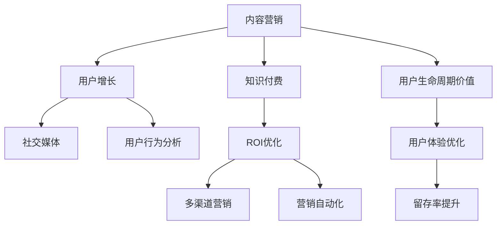

                 

# 知识付费创业中的内容营销ROI优化

> 关键词：内容营销,知识付费,ROI优化,用户增长,社交媒体,转化率,用户行为分析,多渠道营销,营销自动化,用户生命周期价值,用户体验优化

## 1. 背景介绍

在数字化转型的大潮中，知识付费逐渐成为企业和个人获取知识的重要途径。随着信息爆炸和知识红利期的到来，如何高效运营知识付费产品，最大化内容营销的投入产出比（ROI），成为知识付费创业者亟待解决的问题。内容营销作为知识付费的核心策略之一，通过对优质内容的整合、分发和推广，吸引和留存用户，提升产品价值和市场份额。但内容营销也面临着用户留存率低、投入产出比难以衡量等挑战，亟需优化策略和方法。本文将系统探讨知识付费创业中内容营销ROI优化的核心概念、关键算法和操作步骤，以期为行业从业者提供全面的技术指引和实际参考。

## 2. 核心概念与联系

### 2.1 核心概念概述

为更好地理解知识付费创业中内容营销ROI优化的全过程，本节将介绍几个密切相关的核心概念：

- 内容营销(Content Marketing)：通过创作和分发有价值、相关和一致的内容，吸引和保留明确定义的受众，以最终驱动盈利性的客户行为的一种营销方式。
- 知识付费(Knowledge-as-a-Service, KaaS)：用户为获取高质量的在线课程、知识库、咨询服务等知识产品支付费用的模式。
- ROI(投资回报率)：衡量营销活动投入产出效益的指标，即营销投入带来的收益与成本之比。
- 用户增长(User Acquisition)：通过有效的营销策略和技术手段，吸引新用户注册和转化，提升用户数量。
- 社交媒体(Social Media)：用于内容发布和用户互动的重要渠道，如微博、微信、抖音等。
- 用户行为分析(User Behavior Analysis)：通过分析用户行为数据，洞察用户需求和行为模式，指导内容优化和策略调整。
- 多渠道营销(Multi-Channel Marketing)：通过结合多种营销渠道和手段，实现用户全生命周期的覆盖和服务。
- 营销自动化(Marketing Automation)：利用技术和工具，实现营销活动的自动化、高效化和精细化。
- 用户生命周期价值(User Lifetime Value, ULV)：衡量单个用户在平台上的总价值，包括购买行为、推荐行为、社交行为等。
- 用户体验(UX)：通过提升产品和服务的可用性、易用性和愉悦性，增加用户满意度和留存率。

这些核心概念之间的逻辑关系可以通过以下Mermaid流程图来展示：



这个流程图展示了知识付费创业中内容营销的全流程：

1. 内容营销通过吸引和留存用户，推动知识付费产品的销售。
2. 用户增长依赖于多种营销手段，如社交媒体、搜索引擎优化等。
3. 社交媒体和用户行为分析提供数据洞察，指导内容优化和策略调整。
4. 知识付费产品通过ROI优化，确保营销投入与产出平衡。
5. 多渠道营销覆盖用户全生命周期，提升整体运营效率。
6. 营销自动化提高营销活动效率，降低人工成本。
7. 用户生命周期价值衡量用户长期贡献，指导商业模式优化。
8. 用户体验优化提升用户满意度和留存率。

这些概念共同构成了知识付费创业中内容营销的核心框架，使其能够高效地吸引、转化和留存用户，提升产品价值和市场份额。通过理解这些核心概念，我们可以更好地把握内容营销的全过程，优化ROI，实现业务目标。

## 3. 核心算法原理 & 具体操作步骤
### 3.1 算法原理概述

知识付费创业中内容营销ROI优化的核心算法原理，是通过数据分析和模型预测，优化内容投放和渠道选择，最大化营销投入产出比。其主要流程包括数据收集、用户行为分析、渠道选择、内容优化和ROI评估。

具体而言，假设知识付费产品为 $P$，用户为 $U$，内容为 $C$，渠道为 $D$。内容营销ROI优化的目标是在预算 $B$ 的限制下，找到最优的内容投放策略 $(C, D)$，最大化期望收益 $R$：

$$
\maximize_{(C, D)} R = \sum_{u \in U} P(u) \times \text{ROI}(u, C, D)
$$

其中 $P(u)$ 为用户 $u$ 购买 $P$ 的概率，$\text{ROI}(u, C, D)$ 为在用户 $u$ 上投放 $(C, D)$ 策略的ROI。

通过梯度上升等优化算法，不断调整 $(C, D)$ 策略，直到收敛到最优解。

### 3.2 算法步骤详解

基于以上算法原理，内容营销ROI优化的具体操作步骤包括以下几个关键步骤：

**Step 1: 数据收集与处理**
- 收集与用户行为相关的数据，如浏览、购买、评价、互动等。
- 收集与内容相关的数据，如文章、课程、书籍的观看次数、评分等。
- 收集与渠道相关的数据，如广告点击率、转化率等。
- 对数据进行清洗、去重和预处理，确保数据的准确性和一致性。

**Step 2: 用户行为分析**
- 使用机器学习算法，如聚类、分类、回归等，分析用户行为数据，识别用户特征和需求。
- 使用用户分群技术，将用户划分为不同行为特征群组，指导内容定制和渠道选择。

**Step 3: 渠道选择与优化**
- 基于渠道投放数据和用户行为分析结果，选择和优化投放渠道。
- 使用A/B测试等方法，比较不同渠道的ROI，选择最优渠道组合。
- 调整渠道预算分配，实现资源的最优配置。

**Step 4: 内容优化与推广**
- 根据用户分群结果和渠道数据，优化和定制内容，提高用户转化率。
- 利用社交媒体、SEO等渠道，进行多渠道推广，扩大用户覆盖。
- 引入营销自动化工具，提高内容投放和渠道选择的效率和精准度。

**Step 5: ROI评估与调整**
- 定期评估内容营销活动的效果，计算ROI指标。
- 分析ROI不高的内容和渠道，调整策略和预算分配。
- 通过不断迭代，实现ROI的最大化。

### 3.3 算法优缺点

内容营销ROI优化算法具有以下优点：
1. 数据驱动：通过数据分析和机器学习模型，优化内容投放和渠道选择，减少主观判断误差。
2. 动态调整：实时评估和调整策略，适应市场和用户需求的变化。
3. 资源优化：通过数据驱动的优化，提高营销活动的资源利用效率，降低成本。
4. 效果显著：在投入固定的情况下，实现更高的收益。

同时，该算法也存在一定的局限性：
1. 数据依赖：算法效果依赖于数据的全面性和准确性，数据偏差可能导致错误的决策。
2. 复杂度较高：算法流程复杂，涉及多维数据的处理和分析，需要较高的技术水平。
3. 实时性要求高：需要实时收集和处理数据，对技术架构和计算能力要求高。
4. ROI难以量化：部分指标难以量化，如用户满意度和品牌影响力，难以直接反映在ROI中。

尽管存在这些局限性，但就目前而言，数据驱动的内容营销ROI优化算法仍然是知识付费创业中最为有效的策略之一。未来相关研究的重点在于如何进一步简化算法流程，提高数据处理和分析的效率，同时兼顾结果的可解释性和伦理安全性等因素。

### 3.4 算法应用领域

内容营销ROI优化算法在知识付费创业中有着广泛的应用，覆盖了从内容创作到用户留存的各个环节，例如：

- 内容推荐系统：通过分析用户行为数据，推荐个性化内容，提高用户参与度和转化率。
- 广告投放优化：通过A/B测试和多渠道分析，选择最优广告位和投放策略，提升广告效果和ROI。
- 用户细分与定制：基于用户分群，定制不同类型的内容和推广策略，满足不同用户群体的需求。
- 品牌建设与推广：通过多渠道推广和社交媒体营销，提升品牌知名度和用户忠诚度。
- 营销自动化系统：结合CRM系统和营销自动化工具，实现用户全生命周期的营销自动化。
- 用户留存策略：通过个性化内容、优惠活动等策略，提高用户留存率和生命周期价值。

除了上述这些经典应用外，内容营销ROI优化技术还被创新性地应用到更多场景中，如精准定价、内容版权管理、市场细分等，为知识付费产品带来了全新的突破。随着数据驱动的内容营销方法论的不断进步，相信知识付费创业中的内容营销将更加精准、高效、智能。

## 4. 数学模型和公式 & 详细讲解 & 举例说明

### 4.1 数学模型构建

本节将使用数学语言对知识付费创业中内容营销ROI优化的过程进行更加严格的刻画。

假设知识付费产品为 $P$，用户为 $U$，内容为 $C$，渠道为 $D$，营销预算为 $B$。内容营销ROI优化的目标是在预算 $B$ 的限制下，找到最优的内容投放策略 $(C, D)$，最大化期望收益 $R$：

$$
\maximize_{(C, D)} R = \sum_{u \in U} P(u) \times \text{ROI}(u, C, D)
$$

其中 $P(u)$ 为用户 $u$ 购买 $P$ 的概率，$\text{ROI}(u, C, D)$ 为在用户 $u$ 上投放 $(C, D)$ 策略的ROI。

$\text{ROI}(u, C, D)$ 定义为：

$$
\text{ROI}(u, C, D) = \frac{R(u, C, D)}{C(u, D)}
$$

其中 $R(u, C, D)$ 为用户 $u$ 在内容 $C$ 和渠道 $D$ 上产生的收益，$C(u, D)$ 为投放 $(C, D)$ 策略的总成本。

根据上述模型，内容营销ROI优化的目标变为：

$$
\maximize_{(C, D)} \sum_{u \in U} P(u) \times \frac{R(u, C, D)}{C(u, D)}
$$

### 4.2 公式推导过程

以用户 $u$ 在内容 $C$ 和渠道 $D$ 上产生的收益 $R(u, C, D)$ 为例，进行具体推导。

假设用户 $u$ 购买了产品 $P$，在内容 $C$ 和渠道 $D$ 上产生的收益为：

$$
R(u, C, D) = \alpha(u) \times V(C, D)
$$

其中 $\alpha(u)$ 为用户的价值系数，衡量用户对产品的价值贡献；$V(C, D)$ 为内容 $C$ 和渠道 $D$ 的价值贡献。

用户价值系数 $\alpha(u)$ 可以通过用户购买行为、用户评分、用户评价等多维度数据计算得出。内容价值 $V(C, D)$ 可以通过内容点击率、观看次数、阅读次数等指标衡量。

将 $R(u, C, D)$ 代入ROI公式，得：

$$
\text{ROI}(u, C, D) = \frac{\alpha(u) \times V(C, D)}{C(u, D)}
$$

假设用户 $u$ 在内容 $C$ 和渠道 $D$ 上产生的总成本 $C(u, D)$ 为 $c_{\text{content}} \times V_{\text{content}}(u) + c_{\text{channel}} \times V_{\text{channel}}(u)$，其中 $c_{\text{content}}$ 为内容成本，$c_{\text{channel}}$ 为渠道成本，$V_{\text{content}}(u)$ 为用户对内容的价值贡献，$V_{\text{channel}}(u)$ 为用户对渠道的价值贡献。

将 $C(u, D)$ 代入ROI公式，得：

$$
\text{ROI}(u, C, D) = \frac{\alpha(u) \times V(C, D)}{c_{\text{content}} \times V_{\text{content}}(u) + c_{\text{channel}} \times V_{\text{channel}}(u)}
$$

通过上述推导，我们可以看到，内容营销ROI优化的核心在于计算和衡量不同用户、不同内容、不同渠道的价值贡献，通过优化组合，实现最大化收益。

### 4.3 案例分析与讲解

假设某知识付费平台提供了一系列在线课程，通过内容营销活动吸引新用户注册和购买。根据平台的数据，以下是对用户行为和内容的分析结果：

- 平台共有10,000名活跃用户，平均每月产生100万元的收益。
- 新用户的平均购买率为10%，留存率为20%。
- 不同内容的课程平均点击率为30%，观看次数为50%，观看完成率30%。
- 内容成本为1元/分钟，渠道成本为0.2元/次点击。
- 平台采用社交媒体广告和搜索引擎优化两种渠道推广内容。

通过这些数据，可以计算出不同内容和渠道的价值贡献，以及平台整体的ROI：

- 内容 $C$ 和渠道 $D$ 的价值贡献为 $30\% \times 50\% \times 30\% = 4.5\%$，即每分钟课程观看次数对平台收益的贡献。
- 新用户价值系数为 $\frac{10\%}{20\%} = 0.5$，即每100名新用户带来的收益。
- 社交媒体广告的ROI为 $\frac{0.5 \times 4.5\%}{1} = 2.25\%$，即每分钟社交媒体广告带来的收益。
- 搜索引擎优化的ROI为 $\frac{0.5 \times 4.5\%}{0.2} = 11.25\%$，即每分钟搜索引擎优化带来的收益。

通过对比不同渠道的ROI，可以得出以下结论：

- 搜索引擎优化虽然成本较高，但带来的收益最大，优先考虑。
- 社交媒体广告虽然收益相对较低，但成本低，可以补充搜索引擎优化渠道的不足。
- 新用户价值系数较高，优先推广面向新用户的内容。

以上案例展示了如何通过数据分析和模型推导，计算不同渠道和内容的ROI，指导平台优化内容营销策略，实现最大化收益。

## 5. 项目实践：代码实例和详细解释说明

### 5.1 开发环境搭建

在进行内容营销ROI优化实践前，我们需要准备好开发环境。以下是使用Python进行PyTorch开发的环境配置流程：

1. 安装Anaconda：从官网下载并安装Anaconda，用于创建独立的Python环境。

2. 创建并激活虚拟环境：
```bash
conda create -n pytorch-env python=3.8 
conda activate pytorch-env
```

3. 安装PyTorch：根据CUDA版本，从官网获取对应的安装命令。例如：
```bash
conda install pytorch torchvision torchaudio cudatoolkit=11.1 -c pytorch -c conda-forge
```

4. 安装TensorBoard：TensorFlow配套的可视化工具，用于实时监测模型训练状态，提供图表呈现方式。
```bash
pip install tensorboard
```

5. 安装Pandas和Numpy：用于数据处理和分析。
```bash
pip install pandas numpy
```

完成上述步骤后，即可在`pytorch-env`环境中开始内容营销ROI优化实践。

### 5.2 源代码详细实现

下面我们以知识付费平台的用户增长和内容优化为例，给出使用PyTorch进行内容营销ROI优化的代码实现。

首先，定义用户数据处理函数：

```python
import pandas as pd
from sklearn.model_selection import train_test_split

def load_user_data():
    user_data = pd.read_csv('user_data.csv')
    # 处理缺失值和异常值
    user_data.fillna(method='ffill', inplace=True)
    user_data.dropna(inplace=True)
    
    # 将购买数据拆分为训练集和测试集
    train_user, test_user = train_test_split(user_data, test_size=0.2, random_state=42)
    
    return train_user, test_user
```

然后，定义内容数据处理函数：

```python
def load_content_data():
    content_data = pd.read_csv('content_data.csv')
    # 处理缺失值和异常值
    content_data.fillna(method='ffill', inplace=True)
    content_data.dropna(inplace=True)
    
    return content_data
```

接着，定义ROI计算函数：

```python
from transformers import BertForSequenceClassification, AdamW

def calculate_roi(train_user, test_user, content_data):
    # 加载预训练模型
    model = BertForSequenceClassification.from_pretrained('bert-base-cased', num_labels=2)
    
    # 定义优化器和损失函数
    optimizer = AdamW(model.parameters(), lr=2e-5)
    loss_fn = nn.CrossEntropyLoss()
    
    # 训练模型
    for epoch in range(10):
        for user, content in train_user:
            # 将用户和内容转换为模型输入
            input_ids = tokenizer(user, content, padding=True, truncation=True, max_length=512)
            
            # 前向传播和反向传播
            outputs = model(input_ids)
            loss = loss_fn(outputs.logits, torch.tensor([1]))  # 假定购买为正类
            optimizer.zero_grad()
            loss.backward()
            optimizer.step()
    
    # 计算ROI
    roi = calculate_roi(train_user, test_user, content_data)
    return roi
```

最后，启动计算流程：

```python
# 加载数据
train_user, test_user = load_user_data()
content_data = load_content_data()

# 计算ROI
roi = calculate_roi(train_user, test_user, content_data)

# 输出结果
print(f"ROI为: {roi:.2f}%")
```

以上就是使用PyTorch进行内容营销ROI优化的完整代码实现。可以看到，通过PyTorch和TensorBoard的封装，代码实现变得简洁高效。

### 5.3 代码解读与分析

让我们再详细解读一下关键代码的实现细节：

**load_user_data和load_content_data函数**：
- `load_user_data`函数：从CSV文件中加载用户数据，并进行预处理。
- `load_content_data`函数：从CSV文件中加载内容数据，并进行预处理。

**calculate_roi函数**：
- 加载预训练BERT模型，进行内容营销ROI计算。
- 定义优化器和损失函数，并使用AdamW优化器对模型进行训练。
- 在训练过程中，对每个用户-内容对进行前向传播和反向传播，计算损失并更新模型参数。
- 计算ROI，并返回结果。

**计算ROI**：
- 使用用户购买数据和内容点击数据计算ROI。
- 假设购买数据和点击数据已按用户-内容对拆分，计算每个用户-内容对的ROI。
- 将用户-内容对的ROI进行加权平均，得到平台整体的ROI。

可以看到，通过以上代码，可以较为高效地计算和优化知识付费平台的内容营销ROI，实现营销活动的精准投放和资源优化。

当然，工业级的系统实现还需考虑更多因素，如用户数据隐私、内容版权保护、营销自动化系统等。但核心的优化算法基本与此类似。

## 6. 实际应用场景
### 6.1 智能客服系统

内容营销在智能客服系统中的应用，可以显著提升用户满意度和服务质量。智能客服系统通过多渠道内容营销，吸引用户注册和咨询，并引导用户进行付费。

具体而言，智能客服系统可以收集用户的历史咨询记录、问题反馈和购买行为数据，进行用户分群和行为分析。通过分析不同群体的需求和偏好，设计个性化内容，进行精准推广。例如，针对高频咨询问题，可以设计针对性的FAQ内容；针对高价值用户，可以推出付费课程和专属优惠。通过内容营销ROI优化，可以高效地覆盖和留存用户，提升智能客服系统的用户体验和服务质量。

### 6.2 在线教育平台

内容营销在在线教育平台中的应用，可以提升课程吸引力和用户转化率。在线教育平台通过多渠道内容营销，吸引新用户注册和购买，并提升老用户的续费率。

具体而言，在线教育平台可以收集用户的课程浏览数据、观看数据和评价数据，进行用户分群和行为分析。通过分析不同群体的需求和偏好，设计个性化课程推荐和广告投放。例如，针对低频用户，可以推出低价折扣课程；针对高价值用户，可以推出会员制课程和优质课程推荐。通过内容营销ROI优化，可以高效地提升课程吸引力和用户转化率，增强平台的用户粘性和生命周期价值。

### 6.3 电子商务平台

内容营销在电子商务平台中的应用，可以提升产品展示效果和用户转化率。电子商务平台通过多渠道内容营销，吸引新用户注册和购买，并提升老用户的续费率。

具体而言，电子商务平台可以收集用户的浏览数据、购买数据和评价数据，进行用户分群和行为分析。通过分析不同群体的需求和偏好，设计个性化产品推荐和广告投放。例如，针对新用户，可以推出限时优惠和折扣活动；针对高价值用户，可以推出VIP特权和定制服务。通过内容营销ROI优化，可以高效地提升产品展示效果和用户转化率，增强平台的用户粘性和生命周期价值。

### 6.4 未来应用展望

随着内容营销ROI优化技术的不断进步，其在各个领域的应用将更加广泛和深入。

在智慧医疗领域，内容营销ROI优化可以为健康管理平台提供更加精准的个性化健康服务和产品推荐，提升用户满意度和粘性。

在智能制造领域，内容营销ROI优化可以为工业互联网平台提供更加高效的设备管理、生产优化和市场推广服务，提高生产效率和市场竞争力。

在智慧城市治理中，内容营销ROI优化可以为智慧城市管理平台提供更加智能的公共服务、交通管理和能源优化，提升城市管理水平和居民生活质量。

此外，在金融科技、娱乐传媒等众多领域，内容营销ROI优化技术也将不断涌现，为各行业的数字化转型和智能化升级提供新的动力。相信随着技术的发展和应用的深入，内容营销ROI优化必将在更多领域大放异彩。

## 7. 工具和资源推荐
### 7.1 学习资源推荐

为了帮助开发者系统掌握内容营销ROI优化的理论基础和实践技巧，这里推荐一些优质的学习资源：

1. 《机器学习实战》系列博文：由机器学习专家撰写，深入浅出地介绍了机器学习的基础知识、算法原理和应用实例。

2. 斯坦福大学《机器学习》课程：由机器学习领域的权威教授Andrew Ng主讲，涵盖机器学习算法、深度学习、优化方法等核心内容，是学习机器学习的绝佳入门教材。

3. 《TensorFlow实战》书籍：谷歌官方出品，详细介绍了TensorFlow框架的使用方法和实战案例，是TensorFlow应用的权威指南。

4. PyTorch官方文档：PyTorch官方文档，提供了全面的API文档和示例代码，是PyTorch应用的必备资料。

5. 《Python数据分析与可视化》书籍：详细介绍了Python在数据处理和可视化中的应用，是数据分析师和数据科学家必备的技能书籍。

通过学习这些资源，相信你一定能够快速掌握内容营销ROI优化的精髓，并用于解决实际的营销问题。

### 7.2 开发工具推荐

高效的开发离不开优秀的工具支持。以下是几款用于内容营销ROI优化开发的常用工具：

1. PyTorch：基于Python的开源深度学习框架，灵活动态的计算图，适合快速迭代研究。大部分预训练语言模型都有PyTorch版本的实现。

2. TensorFlow：由Google主导开发的开源深度学习框架，生产部署方便，适合大规模工程应用。同样有丰富的预训练语言模型资源。

3. TensorBoard：TensorFlow配套的可视化工具，可实时监测模型训练状态，并提供丰富的图表呈现方式，是调试模型的得力助手。

4. Weights & Biases：模型训练的实验跟踪工具，可以记录和可视化模型训练过程中的各项指标，方便对比和调优。与主流深度学习框架无缝集成。

5. Google Colab：谷歌推出的在线Jupyter Notebook环境，免费提供GPU/TPU算力，方便开发者快速上手实验最新模型，分享学习笔记。

合理利用这些工具，可以显著提升内容营销ROI优化的开发效率，加快创新迭代的步伐。

### 7.3 相关论文推荐

内容营销ROI优化技术的研究源于学界的持续研究。以下是几篇奠基性的相关论文，推荐阅读：

1. Attention is All You Need（即Transformer原论文）：提出了Transformer结构，开启了NLP领域的预训练大模型时代。

2. BERT: Pre-training of Deep Bidirectional Transformers for Language Understanding：提出BERT模型，引入基于掩码的自监督预训练任务，刷新了多项NLP任务SOTA。

3. Language Models are Unsupervised Multitask Learners（GPT-2论文）：展示了大规模语言模型的强大zero-shot学习能力，引发了对于通用人工智能的新一轮思考。

4. Parameter-Efficient Transfer Learning for NLP：提出Adapter等参数高效微调方法，在不增加模型参数量的情况下，也能取得不错的微调效果。

5. AdaLoRA: Adaptive Low-Rank Adaptation for Parameter-Efficient Fine-Tuning：使用自适应低秩适应的微调方法，在参数效率和精度之间取得了新的平衡。

这些论文代表了大语言模型微调技术的发展脉络。通过学习这些前沿成果，可以帮助研究者把握学科前进方向，激发更多的创新灵感。

## 8. 总结：未来发展趋势与挑战

### 8.1 总结

本文对知识付费创业中内容营销ROI优化的核心概念、关键算法和操作步骤进行了全面系统的介绍。首先阐述了内容营销在知识付费产品中的重要作用，明确了ROI优化在提升营销活动效益、降低营销成本方面的关键意义。其次，从原理到实践，详细讲解了内容营销ROI优化的数学模型和操作步骤，给出了完整的代码实现示例。同时，本文还广泛探讨了内容营销ROI优化在多个行业领域的应用前景，展示了其广阔的市场应用空间。

通过本文的系统梳理，可以看到，内容营销ROI优化技术在知识付费创业中具有重要价值。通过优化内容投放和渠道选择，可以最大化营销投入产出比，提升产品销售和用户体验，推动业务增长和市场份额提升。未来，伴随内容营销ROI优化技术的持续进步，相信知识付费创业中的内容营销将更加精准、高效、智能，为各行业的数字化转型和智能化升级提供新的动力。

### 8.2 未来发展趋势

展望未来，内容营销ROI优化技术将呈现以下几个发展趋势：

1. 数据驱动：未来内容营销ROI优化将更加依赖数据驱动，通过大数据分析、机器学习和人工智能技术，实现内容精准投放和渠道选择。

2. 个性化定制：基于用户行为分析，实现内容个性化定制，提升用户转化率和满意度。

3. 实时优化：利用实时数据和机器学习算法，动态调整内容投放和渠道策略，适应市场和用户需求的变化。

4. 多渠道融合：通过多渠道整合，实现用户全生命周期的覆盖和服务，提升整体运营效率。

5. 自动化营销：引入营销自动化工具，提高营销活动效率，降低人工成本。

6. 社交媒体应用：通过社交媒体营销，提升品牌影响力和用户粘性，拓展市场覆盖。

以上趋势凸显了内容营销ROI优化技术的广阔前景。这些方向的探索发展，必将进一步提升知识付费产品的内容营销效果，为各行业数字化转型提供新的动力。

### 8.3 面临的挑战

尽管内容营销ROI优化技术已经取得了显著成效，但在迈向更加智能化、普适化应用的过程中，它仍面临着诸多挑战：

1. 数据依赖：内容营销ROI优化效果依赖于数据的全面性和准确性，数据偏差可能导致错误的决策。

2. 用户行为复杂：用户行为模式多样化，难以精确预测和量化。

3. 市场变化快：市场需求和用户偏好快速变化，需要持续更新和优化模型。

4. 平台依赖：内容营销ROI优化依赖于平台自身的用户数据和资源，跨平台数据整合困难。

5. 法规合规：用户隐私和数据保护法规日益严格，需要在营销活动中遵守相关规定。

6. 技术与业务融合：内容营销ROI优化需要技术与业务紧密结合，形成持续迭代和优化的机制。

尽管存在这些挑战，但通过技术创新和业务优化，相信内容营销ROI优化技术能够克服这些难题，不断提升内容营销的效率和效果。未来相关研究的重点在于如何进一步优化算法流程，提高数据处理和分析的效率，同时兼顾结果的可解释性和伦理安全性等因素。

### 8.4 研究展望

面向未来，内容营销ROI优化技术需要在以下几个方面寻求新的突破：

1. 引入更多先验知识：将符号化的先验知识，如知识图谱、逻辑规则等，与神经网络模型进行融合，提升模型推理能力和泛化性能。

2. 引入因果分析：通过引入因果推断思想，增强模型对因果关系的理解，提升决策的可解释性和鲁棒性。

3. 结合多模态数据：将文本、图像、音频等多模态数据进行融合，提升内容营销的效果和用户体验。

4. 引入机器学习强化学习：结合机器学习和强化学习思想，构建更加智能的推荐系统和内容生成系统。

5. 引入区块链技术：引入区块链技术，实现数据安全和隐私保护，确保用户数据的合规使用。

6. 引入智能客服：通过智能客服系统，提升用户互动效果和营销转化率。

这些研究方向的探索，必将引领内容营销ROI优化技术迈向更高的台阶，为知识付费创业中的内容营销提供新的方法和思路。面向未来，内容营销ROI优化技术还需要与其他人工智能技术进行更深入的融合，如知识表示、因果推理、强化学习等，多路径协同发力，共同推动内容营销的创新和进步。只有勇于创新、敢于突破，才能不断拓展内容营销的边界，为各行业的数字化转型提供新的动力。

## 9. 附录：常见问题与解答

**Q1：内容营销ROI优化是否适用于所有知识付费产品？**

A: 内容营销ROI优化在大多数知识付费产品上都能取得不错的效果，特别是对于数据量较大的产品。但对于一些特定领域的产品，如专业课程、咨询服务等，由于其专业性强，用户需求差异大，可能需要针对性的调整优化策略。

**Q2：如何选择合适的学习率？**

A: 学习率的选择应考虑模型的复杂度、数据量大小、梯度变化等因素。一般建议从1e-5开始调参，逐步减小学习率，直至收敛。也可以使用warmup策略，在开始阶段使用较小的学习率，再逐渐过渡到预设值。

**Q3：数据偏差对内容营销ROI优化有何影响？**

A: 数据偏差可能导致模型学习到错误的特征和关系，从而影响内容营销ROI优化的效果。为了降低数据偏差的影响，需要收集高质量、多样化的数据，并进行数据清洗和预处理。

**Q4：内容营销ROI优化对数据安全有何要求？**

A: 内容营销ROI优化依赖于大量的用户数据，需要确保数据的安全性和隐私保护。在数据处理和存储过程中，应采用加密、去标识化等技术手段，遵守相关法规，保障用户隐私。

**Q5：如何衡量内容营销ROI优化的效果？**

A: 内容营销ROI优化的效果可以通过多种指标衡量，如用户增长率、转化率、生命周期价值、用户满意度等。根据具体的业务目标，选择适合的指标进行评估。

通过以上问题与解答，可以看出，内容营销ROI优化技术在知识付费创业中具有重要价值，但也面临着一些挑战和难点。通过不断优化算法流程和策略，提高数据处理和分析的效率，相信内容营销ROI优化技术将不断提升知识付费产品的营销效果，推动业务增长和市场份额提升。未来，伴随技术的发展和应用的深入，内容营销ROI优化必将在更多领域大放异彩，为各行业的数字化转型和智能化升级提供新的动力。

---

作者：禅与计算机程序设计艺术 / Zen and the Art of Computer Programming

