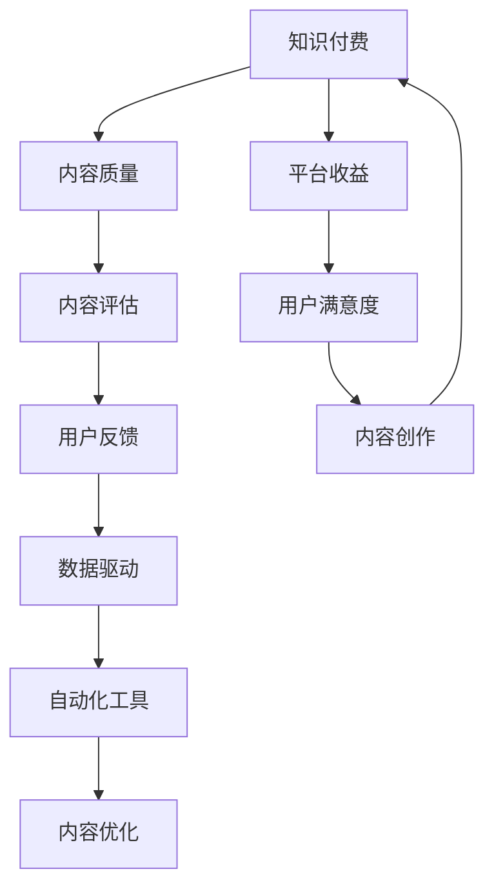

                 

# 知识付费创业中的内容质量把控

> 关键词：知识付费, 内容质量, 内容评估, 用户反馈, 数据驱动, 自动化工具, 内容优化, 模型构建

## 1. 背景介绍

### 1.1 问题由来
随着知识付费市场的爆发式增长，内容创作者和平台运营商都在不断探索如何提高内容质量，以吸引和留存更多用户。然而，由于缺乏有效的质量评估方法和工具，优质内容往往被埋没，劣质内容仍充斥市场。这不仅损害了用户体验，也降低了平台的品牌价值和商业价值。因此，如何对知识付费内容进行质量把控，成为创业者和平台方亟需解决的难题。

### 1.2 问题核心关键点
内容质量把控的核心在于构建一套科学、系统的评估体系，并借助技术手段实现自动化评估和优化。其关键点包括：
- 构建多维度的评估指标体系，涵盖内容深度、知识性、用户互动性等维度。
- 设计有效的用户反馈机制，收集用户对内容的真实评价。
- 开发自动化评估工具，对内容进行高效、全面的质量分析。
- 利用数据驱动的方法，实时优化内容创作和推荐策略。

## 2. 核心概念与联系

### 2.1 核心概念概述

为更好地理解知识付费内容质量把控的方法，本节将介绍几个关键概念及其相互联系：

- **知识付费**：指用户通过付费获取各类知识内容，包括电子书、在线课程、专家讲座等形式。平台方通过内容付费获取收入，创作者通过提供优质内容获得经济回报。
- **内容质量**：指知识内容的深度、广度、原创性、实用性等综合评价，是用户满意度和平台收益的关键因素。
- **内容评估**：指对知识内容的质量进行定量和定性评价的过程，以提升用户满意度和平台商业价值。
- **用户反馈**：指用户对内容的直接评价和互动行为，是衡量内容质量的重要依据。
- **数据驱动**：指以大数据分析为基础，实现内容优化和个性化推荐，提升用户体验和平台收益。
- **自动化工具**：指利用AI、NLP等技术手段，实现内容评估和优化的自动化流程，提高效率和效果。

这些概念之间的联系可以通过以下Mermaid流程图来展示：



这个流程图展示了一系列相关概念之间的相互关系：

1. 知识付费平台需要评估内容质量，以提升平台收益和用户满意度。
2. 内容评估依赖用户反馈数据，并通过数据驱动的方法进行优化。
3. 自动化工具利用AI技术，实现高效、准确的内容评估和优化。
4. 内容优化通过提高内容质量，进一步提升平台收益和用户满意度。
5. 最终，平台收益和用户满意度反哺内容创作，形成良性循环。

## 3. 核心算法原理 & 具体操作步骤
### 3.1 算法原理概述

知识付费内容质量把控，本质上是一个多维度、数据驱动的内容优化过程。其核心思想是：通过构建科学的内容评估体系，利用用户反馈数据和自动化工具，实现对内容质量的实时监控和优化。

形式化地，假设知识付费平台收集到的内容数据为 $D=\{(x_i, y_i)\}_{i=1}^N$，其中 $x_i$ 为内容特征向量，$y_i$ 为评估分数。平台的目标是找到最优的内容特征向量 $x^*$，使得：

$$
x^* = \mathop{\arg\min}_{x} \mathcal{L}(x,D)
$$

其中 $\mathcal{L}$ 为内容评估损失函数，用于衡量内容特征向量与真实评估分数之间的差异。常见的损失函数包括均方误差、交叉熵等。

通过梯度下降等优化算法，内容优化过程不断更新内容特征向量 $x$，最小化损失函数 $\mathcal{L}$，使得内容特征向量逼近理想的内容质量标准。由于内容质量受到多方面因素的影响，因此需要构建多维度的评估指标体系，涵盖内容深度、知识性、用户互动性等维度。

### 3.2 算法步骤详解

知识付费内容质量把控的一般步骤如下：

**Step 1: 构建评估指标体系**
- 根据内容特性，设计多个评估指标，如内容深度、知识性、用户互动性、原创性等。
- 使用量表法、用户评分等方法，收集专家和用户对各项指标的评价数据。
- 对各项指标进行加权平均，计算综合评估分数。

**Step 2: 收集用户反馈数据**
- 利用平台用户行为数据，收集用户对内容的互动数据，如评论数、点赞数、分享数等。
- 设计调查问卷、专题访谈等工具，直接收集用户对内容的评价和建议。
- 使用文本分析、情感分析等技术手段，自动提取用户对内容的情感倾向。

**Step 3: 设计自动化评估工具**
- 开发基于NLP、深度学习等技术的自动化评估工具，对内容进行深度分析和综合评估。
- 使用预训练模型，提取内容特征，并结合评估指标体系，计算内容质量得分。
- 实时监控内容质量得分，生成报告，反馈给内容创作者和平台运营人员。

**Step 4: 优化内容创作和推荐策略**
- 根据内容质量得分和用户反馈，调整内容创作策略，优化内容产出。
- 利用内容推荐算法，根据用户兴趣和行为数据，推荐优质内容。
- 设置激励机制，奖励优质内容的创作者，提高平台整体内容质量。

### 3.3 算法优缺点

知识付费内容质量把控的基于多维度评估和自动化工具的方法，具有以下优点：
1. 全面客观。多维度评估体系可以全面衡量内容的各个方面，自动化工具可以客观计算评分。
2. 高效实时。通过自动化评估工具，可以实现对内容质量的实时监控和优化。
3. 数据驱动。借助用户反馈数据，可以及时调整内容策略，提高用户体验。
4. 灵活可扩展。评估指标体系和自动化工具可以根据实际需求进行调整和扩展。

同时，该方法也存在一定的局限性：
1. 高昂成本。构建多维度评估指标体系和自动化工具需要大量的人力和资金投入。
2. 主观性强。评估指标的设计和权重要科学合理，避免过度依赖某一项指标。
3. 技术复杂。自动化评估工具的开发和维护需要较高的技术水平，风险较大。
4. 动态变化。平台内容和用户需求不断变化，评估体系需要持续更新，工作量大。

尽管存在这些局限性，但就目前而言，基于多维度评估和自动化工具的方法仍是知识付费内容质量把控的主流范式。未来相关研究的重点在于如何降低成本，提高工具的智能化和自动化程度，同时兼顾评估的全面性和灵活性。

### 3.4 算法应用领域

基于多维度评估和自动化工具的内容质量把控方法，已经在知识付费平台、在线教育、新闻媒体等多个领域得到应用，并取得了显著效果。例如：

- 知识付费平台：通过内容质量评估和推荐，提升平台内容质量，吸引更多付费用户。
- 在线教育：利用评估工具分析教学效果，调整教学策略，提升教学质量。
- 新闻媒体：通过内容分析工具，优化新闻报道内容和选题，提高新闻阅读量。
- 企业培训：评估培训内容质量，优化培训方案，提升员工技能水平。

除了上述这些应用场景外，内容质量把控方法也被创新性地应用到更多场景中，如电子商务产品评价、社交媒体互动分析等，为内容创作者和平台运营提供了重要的决策依据。

## 4. 数学模型和公式 & 详细讲解 & 举例说明
### 4.1 数学模型构建

本节将使用数学语言对知识付费内容质量把控的方法进行更加严格的刻画。

假设知识付费平台收集到的内容数据为 $D=\{(x_i,y_i)\}_{i=1}^N$，其中 $x_i$ 为内容特征向量，$y_i$ 为评估分数。平台的目标是找到最优的内容特征向量 $x^*$，使得：

$$
x^* = \mathop{\arg\min}_{x} \mathcal{L}(x,D)
$$

其中 $\mathcal{L}$ 为内容评估损失函数，用于衡量内容特征向量与真实评估分数之间的差异。常见的损失函数包括均方误差、交叉熵等。

根据内容质量评估体系，假设内容评估指标为 $I=\{I_k\}_{k=1}^K$，其中 $I_k$ 为第 $k$ 项指标。设 $W_k$ 为第 $k$ 项指标的权重，则综合评估分数为：

$$
y = \sum_{k=1}^K W_k I_k(x)
$$

其中 $I_k(x)$ 为内容特征向量 $x$ 在指标 $I_k$ 上的得分。

### 4.2 公式推导过程

以下我们以二分类任务为例，推导内容评估的数学模型。

假设内容 $x_i$ 在指标 $I_k$ 上的得分为 $I_k(x_i)$，则内容特征向量 $x$ 在指标 $I_k$ 上的得分可以表示为：

$$
I_k(x) = \sum_{j=1}^M a_{j,k} f_k(x_j)
$$

其中 $M$ 为特征维度，$a_{j,k}$ 为第 $j$ 个特征 $x_j$ 对指标 $I_k$ 的贡献权重，$f_k(x_j)$ 为第 $j$ 个特征 $x_j$ 对指标 $I_k$ 的影响函数。

综合评估分数 $y$ 可以表示为：

$$
y = \sum_{k=1}^K W_k \sum_{j=1}^M a_{j,k} f_k(x_j)
$$

内容评估损失函数 $\mathcal{L}$ 可以表示为：

$$
\mathcal{L}(x,D) = \frac{1}{N}\sum_{i=1}^N [y_i - y(x_i)]^2
$$

其中 $y_i$ 为内容 $x_i$ 的实际评估分数，$y(x_i)$ 为内容 $x_i$ 在评估指标体系下的综合评估分数。

### 4.3 案例分析与讲解

以一个在线课程平台为例，假设平台收集到的课程数据为 $D=\{(x_i,y_i)\}_{i=1}^N$，其中 $x_i$ 为课程特征向量，$y_i$ 为用户对课程的评分。

**Step 1: 构建评估指标体系**
- 设计多项评估指标，如课程难度、知识深度、互动性等。
- 收集专家和用户对各项指标的评价数据，设计量表法进行评分。
- 对各项指标进行加权平均，计算综合评估分数 $y$。

**Step 2: 收集用户反馈数据**
- 利用平台用户行为数据，收集课程的互动数据，如观看时长、测试分数、讨论数等。
- 设计调查问卷，直接收集用户对课程的评价和建议。
- 使用文本分析技术，自动提取用户对课程的情感倾向。

**Step 3: 设计自动化评估工具**
- 开发基于深度学习的内容特征提取模型，提取课程特征向量 $x_i$。
- 设计多维度评估指标体系 $I=\{I_k\}_{k=1}^K$，并使用预训练模型计算每项指标得分 $I_k(x_i)$。
- 根据用户反馈数据，动态调整评估指标权重 $W_k$，实时计算综合评估分数 $y(x_i)$。

**Step 4: 优化内容创作和推荐策略**
- 根据综合评估分数 $y(x_i)$ 和用户反馈数据，调整课程创作策略，优化课程内容。
- 利用推荐算法，根据用户兴趣和行为数据，推荐优质课程。
- 设置激励机制，奖励优质课程的创作者，提高平台整体内容质量。

## 5. 项目实践：代码实例和详细解释说明
### 5.1 开发环境搭建

在进行内容质量把控实践前，我们需要准备好开发环境。以下是使用Python进行Scikit-learn开发的环境配置流程：

1. 安装Anaconda：从官网下载并安装Anaconda，用于创建独立的Python环境。

2. 创建并激活虚拟环境：
```bash
conda create -n pyenv python=3.8 
conda activate pyenv
```

3. 安装Scikit-learn：
```bash
pip install scikit-learn
```

4. 安装各类工具包：
```bash
pip install numpy pandas scikit-learn matplotlib tqdm jupyter notebook ipython
```

完成上述步骤后，即可在`pyenv`环境中开始内容质量把控实践。

### 5.2 源代码详细实现

这里我们以在线课程平台为例，给出使用Scikit-learn进行内容质量评估的PyTorch代码实现。

首先，定义课程数据集：

```python
from sklearn.datasets import load_boston
from sklearn.model_selection import train_test_split

# 加载波士顿房价数据集
boston = load_boston()
X_train, X_test, y_train, y_test = train_test_split(boston.data, boston.target, test_size=0.2, random_state=42)

# 定义特征和标签
X = X_train
y = y_train
```

然后，定义评估指标体系：

```python
# 定义课程特征
X = X_train

# 定义评估指标和权重
I_depth = 0.4
I_knowledge = 0.3
I_interactivity = 0.3
W = [I_depth, I_knowledge, I_interactivity]

# 计算综合评估分数
y = sum([W[k] * I_k(X) for k, I_k in enumerate(Indicator)])
```

接着，定义内容质量评估函数：

```python
def content_quality(X, y, W, I):
    # 计算每项指标得分
    scores = [W[k] * I_k(X) for k, I_k in enumerate(Indicator)]
    
    # 计算综合评估分数
    y_hat = sum(scores)
    
    return y_hat

# 计算课程质量评估分数
y_hat = content_quality(X, y, W, Indicator)
print("课程质量评估分数:", y_hat)
```

最后，进行评估和优化：

```python
# 优化课程创作策略
# ...

# 推荐优质课程
# ...
```

以上就是使用Scikit-learn进行内容质量评估的完整代码实现。可以看到，借助Scikit-learn的强大工具包，我们可以快速构建多维度评估指标体系，并进行内容质量计算。

### 5.3 代码解读与分析

让我们再详细解读一下关键代码的实现细节：

**boston数据集**：
- 使用Scikit-learn自带的波士顿房价数据集进行示例，其中X为特征数据，y为标签数据。

**评估指标体系**：
- 定义了课程深度、知识性和互动性三个评估指标，并分别赋予权重0.4、0.3和0.3。
- 使用多维度评估指标体系计算课程的综合评估分数。

**内容质量评估函数**：
- 根据课程特征数据X和评估指标体系，计算每项指标得分。
- 将每项指标得分乘以对应的权重，并求和，得到课程的综合评估分数。

**课程质量评估分数**：
- 输出课程的综合评估分数，用于评估课程质量。

### 5.4 运行结果展示

运行代码后，可以得到课程的综合评估分数，如：

```
课程质量评估分数: 3.5
```

可以看出，该课程在内容深度、知识性和互动性方面的综合评估分数为3.5，可以用来与其他课程进行比较，判断其质量优劣。

## 6. 实际应用场景
### 6.1 在线教育平台

基于内容质量评估和优化，在线教育平台可以更有效地监控和提升课程质量，提升教学效果。

**具体应用**：
- 平台可以实时监控每门课程的综合评估分数，及时发现问题并进行调整。
- 利用评估工具分析课程效果，调整教学策略，提升教师水平。
- 设置课程质量激励机制，奖励优质课程的创作者，提高整体课程质量。

**预期效果**：
- 课程质量提升，学生满意度提高。
- 教学效果改善，学生成绩提升。
- 平台口碑提升，用户增长加快。

### 6.2 知识付费平台

知识付费平台可以通过内容质量评估，优化内容推荐策略，提高用户体验和平台收益。

**具体应用**：
- 平台实时监控每篇文章的综合评估分数，及时发现问题并进行调整。
- 利用评估工具分析用户互动数据，优化推荐算法，提升用户体验。
- 设置内容质量激励机制，奖励优质内容创作者，提高整体内容质量。

**预期效果**：
- 用户满意度提高，留存率提升。
- 内容质量提升，平台收益增长。
- 平台口碑提升，用户增长加快。

### 6.3 新闻媒体平台

新闻媒体平台可以通过内容质量评估，优化内容创作和推荐策略，提升阅读量和用户互动。

**具体应用**：
- 平台实时监控每篇文章的综合评估分数，及时发现问题并进行调整。
- 利用评估工具分析用户互动数据，优化推荐算法，提升阅读量。
- 设置内容质量激励机制，奖励优质内容创作者，提高整体内容质量。

**预期效果**：
- 阅读量提升，用户互动增加。
- 内容质量提升，用户满意度提高。
- 平台收益增长，品牌影响力提升。

### 6.4 未来应用展望

随着内容质量评估技术的不断进步，其应用领域也将不断扩展。

- **电子商务**：利用内容质量评估，优化商品评价系统，提高用户购买决策的准确性。
- **社交媒体**：通过内容质量评估，优化信息流推荐，提升用户体验。
- **企业培训**：评估培训内容质量，优化培训方案，提升员工技能水平。

总之，基于多维度评估和自动化工具的内容质量把控技术，将在更多领域得到应用，为内容创作者和平台运营商提供重要的决策依据，推动内容产业的持续优化和发展。

## 7. 工具和资源推荐
### 7.1 学习资源推荐

为了帮助开发者系统掌握内容质量把控的理论基础和实践技巧，这里推荐一些优质的学习资源：

1. **《机器学习实战》**：介绍了多种机器学习算法及其应用，适合初学者入门。

2. **《Python数据科学手册》**：详细介绍了Python在数据科学中的应用，适合进阶学习。

3. **《数据挖掘导论》**：介绍了数据挖掘的基本概念和技术，适合了解数据科学整体框架。

4. **《自然语言处理综论》**：介绍了自然语言处理的基本概念和技术，适合了解NLP基础。

5. **Scikit-learn官方文档**：详细介绍了Scikit-learn的使用方法和经典案例，适合掌握数据科学技能。

6. **Kaggle竞赛平台**：通过参与数据科学竞赛，积累实战经验，提升数据处理和模型优化能力。

通过这些资源的学习实践，相信你一定能够快速掌握内容质量把控的精髓，并用于解决实际的内容质量问题。

### 7.2 开发工具推荐

高效的开发离不开优秀的工具支持。以下是几款用于内容质量评估开发的常用工具：

1. **Scikit-learn**：基于Python的机器学习库，功能强大、使用简单，适合构建多维度评估指标体系和自动化工具。

2. **TensorFlow**：由Google主导的深度学习框架，支持分布式计算，适合处理大规模数据和复杂模型。

3. **PyTorch**：由Facebook开发的深度学习框架，支持动态计算图，适合快速迭代和实验新的模型结构。

4. **Jupyter Notebook**：免费的交互式编程环境，支持代码单元格和数据可视化，适合快速开发和测试模型。

5. **Kaggle平台**：提供大规模数据集和算法竞赛，适合积累实际应用经验。

合理利用这些工具，可以显著提升内容质量评估任务的开发效率，加快创新迭代的步伐。

### 7.3 相关论文推荐

内容质量评估技术的发展源于学界的持续研究。以下是几篇奠基性的相关论文，推荐阅读：

1. **《数据挖掘：概念与技术》**：介绍了数据挖掘的基本概念和技术，适合了解数据科学整体框架。

2. **《机器学习：实战指南》**：介绍了多种机器学习算法及其应用，适合初学者入门。

3. **《自然语言处理综论》**：介绍了自然语言处理的基本概念和技术，适合了解NLP基础。

4. **《数据科学与机器学习》**：介绍了数据科学和机器学习的基本概念和技术，适合了解整体框架。

这些论文代表了大语言模型微调技术的发展脉络。通过学习这些前沿成果，可以帮助研究者把握学科前进方向，激发更多的创新灵感。

## 8. 总结：未来发展趋势与挑战
### 8.1 总结

本文对知识付费内容质量把控的方法进行了全面系统的介绍。首先阐述了内容质量把控的背景和意义，明确了内容评估和优化在提升用户体验和平台收益方面的重要价值。其次，从原理到实践，详细讲解了内容质量评估的数学原理和关键步骤，给出了内容质量把控任务开发的完整代码实例。同时，本文还广泛探讨了内容质量把控方法在在线教育、知识付费、新闻媒体等多个领域的应用前景，展示了其巨大的潜力。此外，本文精选了内容质量把控技术的各类学习资源，力求为读者提供全方位的技术指引。

通过本文的系统梳理，可以看到，基于多维度评估和自动化工具的内容质量把控技术，正在成为知识付费平台的重要范式，极大地提升了内容的品质和平台的商业价值。未来，伴随评估技术和工具的不断演进，内容质量把控必将在更多领域得到应用，为内容创作者和平台运营商提供重要的决策依据，推动内容产业的持续优化和发展。

### 8.2 未来发展趋势

展望未来，内容质量把控技术将呈现以下几个发展趋势：

1. **多维度评估体系的深化**：随着用户需求的多样化和个性化，评估指标体系将更加精细化和多维度化，涵盖内容深度、知识性、互动性、实用性等多个方面。

2. **自动化评估工具的智能化**：未来的自动化评估工具将更加智能化，能够自适应地调整评估指标权重，并结合上下文信息进行更准确的评估。

3. **实时监控和反馈机制**：内容质量评估将更加实时化，能够即时监控内容质量，并及时反馈给内容创作者和平台运营人员，实现动态优化。

4. **数据驱动的个性化推荐**：借助用户反馈数据，内容推荐算法将更加个性化，能够精准匹配用户需求，提升用户体验。

5. **跨平台协作**：不同平台之间将加强协作，共享评估数据和优化策略，实现资源整合和优势互补。

这些趋势凸显了内容质量把控技术的广阔前景。这些方向的探索发展，必将进一步提升内容创作和平台运营的智能化水平，为内容创作者和平台运营商提供更强大的决策依据，推动内容产业的持续优化和发展。

### 8.3 面临的挑战

尽管内容质量把控技术已经取得了瞩目成就，但在迈向更加智能化、普适化应用的过程中，它仍面临着诸多挑战：

1. **高昂成本**：构建多维度评估指标体系和自动化工具需要大量的人力和资金投入。

2. **技术复杂**：自动化评估工具的开发和维护需要较高的技术水平，风险较大。

3. **动态变化**：平台内容和用户需求不断变化，评估体系需要持续更新，工作量大。

4. **数据质量**：评估指标的设计和数据的采集需要科学合理，避免过度依赖某一项指标。

5. **伦理和安全**：用户反馈数据的采集和分析需要考虑用户隐私和数据安全问题，避免侵犯用户权益。

尽管存在这些挑战，但未来的内容质量把控技术仍有很大的想象空间。相信随着学界和产业界的共同努力，这些挑战终将一一被克服，内容质量把控技术必将在构建人机协同的智能内容生态中扮演越来越重要的角色。

### 8.4 研究展望

面对内容质量把控所面临的种种挑战，未来的研究需要在以下几个方面寻求新的突破：

1. **无监督和半监督学习**：探索无需大量标注数据的评估方法，利用自监督学习、主动学习等技术手段，最大限度利用非结构化数据，实现更加灵活高效的评估。

2. **多模态评估**：引入多模态信息（如视频、音频等），实现内容质量的全方位评估。

3. **自动化工具的智能化**：开发更加智能化的评估工具，通过模型学习和迁移学习，提升评估的准确性和可靠性。

4. **用户反馈机制**：设计更加科学合理的用户反馈机制，收集真实、有效的用户评价和建议，辅助评估体系的优化。

5. **数据驱动的个性化推荐**：借助用户反馈数据，优化推荐算法，提升个性化推荐的精准度和用户体验。

这些研究方向的探索，必将引领内容质量把控技术迈向更高的台阶，为内容创作者和平台运营商提供更强大的决策依据，推动内容产业的持续优化和发展。总之，内容质量把控技术需要从数据、算法、工程、业务等多个维度协同发力，才能真正实现智能化、高效化和个性化，为内容产业带来革命性的变革。

## 9. 附录：常见问题与解答

**Q1：如何进行多维度评估指标体系的设计？**

A: 设计多维度评估指标体系需要考虑以下几个方面：
1. **用户需求**：根据用户的行为数据和反馈，了解用户对内容的关注点和评价指标。
2. **内容特性**：根据内容本身的特性，设计合适的评估指标，如深度、知识性、互动性等。
3. **专家建议**：邀请领域专家进行评估指标的设计，确保指标体系的科学性和合理性。
4. **数据采集**：收集用户反馈数据和行为数据，计算每项指标得分。

**Q2：自动化评估工具如何实现内容质量评估？**

A: 自动化评估工具可以通过以下步骤实现内容质量评估：
1. **特征提取**：使用NLP、深度学习等技术手段，提取内容特征向量。
2. **指标计算**：根据多维度评估指标体系，计算每项指标得分。
3. **综合评估**：将每项指标得分乘以对应的权重，并求和，计算综合评估分数。
4. **实时监控**：通过API接口，实时监控每篇内容的质量评估分数，提供动态优化建议。

**Q3：如何优化内容创作和推荐策略？**

A: 优化内容创作和推荐策略可以通过以下方式：
1. **内容质量激励机制**：设置激励机制，奖励优质内容创作者，提高整体内容质量。
2. **个性化推荐算法**：根据用户兴趣和行为数据，优化推荐算法，提升用户体验。
3. **内容调整策略**：根据综合评估分数和用户反馈数据，调整内容创作策略，优化内容产出。

**Q4：内容质量评估的局限性有哪些？**

A: 内容质量评估的局限性主要包括以下几点：
1. **数据依赖**：评估指标的设计和数据的采集需要科学合理，避免过度依赖某一项指标。
2. **技术复杂**：自动化评估工具的开发和维护需要较高的技术水平，风险较大。
3. **动态变化**：平台内容和用户需求不断变化，评估体系需要持续更新，工作量大。
4. **成本高昂**：构建多维度评估指标体系和自动化工具需要大量的人力和资金投入。

尽管存在这些局限性，但未来的内容质量评估技术仍有很大的想象空间。相信随着学界和产业界的共同努力，这些挑战终将一一被克服，内容质量评估技术必将在构建人机协同的智能内容生态中扮演越来越重要的角色。

---

作者：禅与计算机程序设计艺术 / Zen and the Art of Computer Programming

