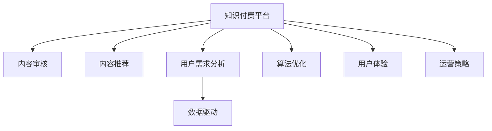

                 

# 知识付费创业中的内容质量把控

> 关键词：知识付费, 内容质量, 用户需求, 数据驱动, 算法优化, 用户体验, 运营策略

## 1. 背景介绍

### 1.1 问题由来

随着互联网和移动互联网的普及，知识付费市场迅速崛起，成为互联网经济发展的新增长点。内容付费、课程分销、智能推荐等业务模式应运而生，吸引了大量用户关注。然而，知识付费领域的竞争也日趋激烈，优秀的创作者和平台需要不断提升内容质量，以满足用户日益增长的需求。

### 1.2 问题核心关键点

内容质量是知识付费平台的核心竞争力，直接决定了用户留存率和付费转化率。高质量的内容能够吸引更多用户，提升用户体验，增加平台价值。因此，如何从内容审核、内容推荐、内容更新等多个环节提升内容质量，成为知识付费平台运营的关键。

## 2. 核心概念与联系

### 2.1 核心概念概述

为了更好地理解知识付费平台的内容质量把控策略，本节将介绍几个密切相关的核心概念：

- **知识付费平台**：以内容为核心，通过付费机制获取和分享知识的服务平台，如得到、知乎、腾讯课堂等。
- **内容审核**：对平台内容进行筛选、审核和筛选的过程，确保内容合规、质量可靠。
- **内容推荐**：利用算法模型和数据分析，向用户推荐符合其兴趣和需求的高质量内容。
- **用户需求分析**：通过调查问卷、行为分析等方式，了解用户的学习动机、兴趣点和消费习惯。
- **数据驱动**：以大数据为依据，驱动内容质量优化和运营策略调整。
- **算法优化**：利用机器学习、深度学习等技术手段，不断优化推荐算法，提升内容质量。
- **用户体验**：通过界面设计、交互优化等手段，提升用户在学习过程中的体验。
- **运营策略**：制定合理的推广策略、价格策略、时间策略，提升平台的运营效率和用户留存率。

这些核心概念之间的逻辑关系可以通过以下Mermaid流程图来展示：



这个流程图展示了许多核心概念之间的相互关系：

1. 知识付费平台通过内容审核、内容推荐等环节提升内容质量。
2. 用户需求分析是内容推荐和用户体验优化的基础。
3. 数据驱动和算法优化是提升内容质量的重要手段。
4. 用户体验和运营策略互相影响，共同影响平台的用户留存和转化。

## 3. 核心算法原理 & 具体操作步骤
### 3.1 算法原理概述

知识付费平台的内容质量把控，本质上是一个数据驱动的优化过程。其核心思想是：通过分析用户行为数据，利用算法模型和数据分析技术，持续优化内容质量和推荐算法，从而提升用户满意度和平台收益。

形式化地，假设知识付费平台有用户 $U$ 和内容 $C$，平台的目标是最大化用户满意度 $S(U,C)$ 和平台收益 $P(U,C)$。可以通过以下优化目标来表达：

$$
\max_{C} S(U,C) + \lambda P(U,C)
$$

其中 $\lambda$ 为平台收益与用户满意度之间的权衡系数。通过优化上述目标，平台能够综合考虑用户需求和平台盈利，制定最优的内容策略。

### 3.2 算法步骤详解

知识付费平台的内容质量把控一般包括以下几个关键步骤：

**Step 1: 用户行为数据收集**

- 收集用户在学习过程中的行为数据，包括浏览、点击、点赞、收藏、评论等。
- 收集用户在课程分销、内容付费等环节的行为数据，了解用户付费意愿和行为。
- 利用数据收集技术，如埋点、日志记录、行为分析等手段，获取完整的数据信息。

**Step 2: 数据预处理与清洗**

- 对收集到的数据进行预处理，包括数据去重、缺失值填充、异常值检测等。
- 对处理后的数据进行清洗，去除噪声数据和无关数据，确保数据质量和完整性。

**Step 3: 用户需求分析**

- 通过调查问卷、行为分析等方式，了解用户的学习动机、兴趣点和消费习惯。
- 分析用户的历史行为数据，挖掘用户的学习规律和偏好。
- 利用用户画像技术，建立用户兴趣模型和行为模型。

**Step 4: 内容审核**

- 利用自然语言处理技术，对用户提交的内容进行初步审核，识别低质量、违法违规内容。
- 建立内容审核机制，由人工或自动化方式对内容进行筛选，确保内容合规。
- 利用规则引擎和决策树等工具，实现自动化的内容审核。

**Step 5: 内容推荐**

- 利用协同过滤、内容推荐算法、深度学习等技术，生成用户个性化推荐列表。
- 分析用户行为数据，识别热门内容、热门课程等，进行内容推广和轮播。
- 定期更新推荐算法模型，提升推荐效果和个性化程度。

**Step 6: 内容质量优化**

- 利用用户反馈数据，评估内容质量和用户满意度。
- 根据用户行为数据，分析内容受欢迎程度和用户偏好，进行内容更新和优化。
- 引入A/B测试和多臂老虎机等技术，测试和优化推荐算法。

**Step 7: 用户体验优化**

- 通过界面设计、交互优化等手段，提升用户的学习体验。
- 引入直播、视频、互动等多元化的内容形式，提升用户粘性。
- 利用NLP技术，实现智能客服、智能搜索等功能，提升用户服务体验。

**Step 8: 运营策略调整**

- 根据用户行为数据，调整课程定价、优惠策略、推广活动等运营策略。
- 根据内容质量数据，调整内容发布时间、频率、主题等策略。
- 定期分析运营数据，评估运营效果，进行策略优化。

以上是知识付费平台内容质量把控的一般流程。在实际应用中，还需要针对具体平台特点，对各个环节进行优化设计，如引入实时数据分析、引入多用户协同推荐等，以进一步提升内容质量和用户满意度。

### 3.3 算法优缺点

知识付费平台的内容质量把控方法具有以下优点：
1. 数据驱动：通过大数据分析，实时优化内容策略，提升用户满意度和平台收益。
2. 个性化推荐：利用机器学习算法，生成个性化推荐列表，提高用户粘性和转化率。
3. 持续优化：不断测试和优化推荐算法，确保内容质量和用户体验。
4. 灵活调整：根据用户反馈和运营数据，灵活调整内容策略，快速响应市场变化。

同时，该方法也存在一定的局限性：
1. 数据依赖：内容质量把控高度依赖用户数据和行为数据，数据质量影响效果。
2. 模型复杂：复杂的推荐算法需要大量的计算资源和算法知识，实现难度较大。
3. 隐私风险：大量收集和分析用户数据，可能带来隐私风险，需要严格的数据保护措施。
4. 公平性问题：个性化推荐可能导致信息孤岛，用户可能无法接触到更多的优质内容。
5. 内容多样性：大量用户需求各异，个性化推荐可能难以覆盖所有用户需求，内容多样性有待提升。

尽管存在这些局限性，但就目前而言，基于用户行为数据和推荐算法的内容质量把控方法仍是目前知识付费平台的主流范式。未来相关研究的重点在于如何进一步降低数据依赖，提高模型的可解释性和公平性，同时兼顾内容多样性和隐私保护等因素。

### 3.4 算法应用领域

知识付费平台的内容质量把控方法在多个领域得到了广泛应用，例如：

- **在线教育**：通过推荐算法和用户行为分析，推荐符合用户学习需求的高质量课程和资源。
- **智能金融**：利用大数据和推荐算法，为用户提供个性化的金融产品推荐和投资建议。
- **健康管理**：分析用户健康数据，推荐个性化的健康管理方案和医疗资源。
- **娱乐内容**：通过推荐算法和用户行为分析，为用户推荐符合其兴趣和需求的影视、音乐、游戏等内容。
- **智能客服**：利用NLP技术和推荐算法，为用户提供精准的问题解答和内容推荐。

除了上述这些经典应用外，知识付费平台的内容质量把控方法还被创新性地应用到更多场景中，如智能购物、智能旅游、智能学习等，为用户带来更个性化的服务体验。

## 4. 数学模型和公式 & 详细讲解 & 举例说明

### 4.1 数学模型构建

本节将使用数学语言对知识付费平台的内容质量把控过程进行更加严格的刻画。

假设知识付费平台有 $N$ 个用户，每个用户有 $M$ 个内容可供选择。记用户 $u$ 对内容 $c$ 的满意度为 $S(u,c)$，满意度可以通过用户行为数据（如点击、观看时间等）来计算。记用户 $u$ 对平台收益的贡献为 $P(u)$，收益可以通过用户付费次数、时长等来计算。

定义平台总满意度 $S$ 和总收益 $P$ 分别为：

$$
S = \sum_{u=1}^N \sum_{c=1}^M S(u,c)
$$

$$
P = \sum_{u=1}^N P(u)
$$

平台的优化目标是最小化用户满意度 $S$ 和平台收益 $P$ 的差距，即：

$$
\min_{C} \|S - P\|
$$

其中 $\| \cdot \|$ 表示范数，用于衡量两个函数之间的距离。

### 4.2 公式推导过程

以下我们以协同过滤算法为例，推导推荐系统的损失函数及其梯度计算。

假设用户 $u$ 对内容 $c$ 的满意度为 $S(u,c)$，内容 $c$ 的收益为 $P(c)$，推荐算法输出的推荐评分 $r(u,c)$，损失函数 $\ell(u,c)$ 定义为：

$$
\ell(u,c) = S(u,c) - r(u,c)
$$

推荐系统的目标是最小化损失函数，即：

$$
\min_{r} \sum_{u=1}^N \sum_{c=1}^M \ell(u,c)
$$

采用平方误差损失函数，则推荐评分 $r(u,c)$ 的梯度为：

$$
\nabla_r \ell(u,c) = (r(u,c) - S(u,c))
$$

将所有用户和内容的损失函数相加，得总损失函数：

$$
\mathcal{L}(r) = \frac{1}{2} \sum_{u=1}^N \sum_{c=1}^M \ell(u,c)^2
$$

通过梯度下降等优化算法，最小化上述损失函数，即可得到最优的推荐评分 $r(u,c)$。

在得到推荐评分的梯度后，即可带入参数更新公式，完成模型的迭代优化。重复上述过程直至收敛，最终得到最优的推荐评分 $r(u,c)$。

## 5. 项目实践：代码实例和详细解释说明

### 5.1 开发环境搭建

在进行内容质量把控的实践前，我们需要准备好开发环境。以下是使用Python进行PyTorch开发的环境配置流程：

1. 安装Anaconda：从官网下载并安装Anaconda，用于创建独立的Python环境。

2. 创建并激活虚拟环境：
```bash
conda create -n pytorch-env python=3.8 
conda activate pytorch-env
```

3. 安装PyTorch：根据CUDA版本，从官网获取对应的安装命令。例如：
```bash
conda install pytorch torchvision torchaudio cudatoolkit=11.1 -c pytorch -c conda-forge
```

4. 安装相关库：
```bash
pip install torch torchtext sklearn pandas matplotlib
```

完成上述步骤后，即可在`pytorch-env`环境中开始内容质量把控的实践。

### 5.2 源代码详细实现

这里我们以协同过滤推荐算法为例，使用PyTorch实现内容质量把控的推荐系统。

首先，定义推荐算法的数据处理函数：

```python
import torch
import torch.nn as nn
import torchtext

class RecommendationModel(nn.Module):
    def __init__(self, n_users, n_items, embed_dim=64):
        super(RecommendationModel, self).__init__()
        self.user_embedding = nn.Embedding(n_users, embed_dim)
        self.item_embedding = nn.Embedding(n_items, embed_dim)
        self.linear = nn.Linear(embed_dim*2, 1)

    def forward(self, user_ids, item_ids):
        user_embeds = self.user_embedding(user_ids)
        item_embeds = self.item_embedding(item_ids)
        embeddings = torch.cat([user_embeds, item_embeds], dim=1)
        scores = self.linear(embeddings)
        return scores
```

然后，定义训练和评估函数：

```python
from torch.utils.data import DataLoader
from sklearn.metrics import mean_squared_error

def train_epoch(model, optimizer, train_loader):
    model.train()
    epoch_loss = 0
    for batch in train_loader:
        user_ids, item_ids, labels = batch
        scores = model(user_ids, item_ids)
        loss = nn.BCELoss()(scores, labels)
        optimizer.zero_grad()
        loss.backward()
        optimizer.step()
        epoch_loss += loss.item()
    return epoch_loss / len(train_loader)

def evaluate(model, test_loader):
    model.eval()
    test_loss = 0
    test_rmse = 0
    for batch in test_loader:
        user_ids, item_ids, labels = batch
        scores = model(user_ids, item_ids)
        loss = nn.BCELoss()(scores, labels)
        test_loss += loss.item()
        test_rmse += mean_squared_error(scores.view(-1), labels.view(-1), squared=False)
    test_rmse /= len(test_loader.dataset)
    return test_loss, test_rmse
```

最后，启动训练流程并在测试集上评估：

```python
from torchtext.datasets import MovieLens
from torchtext.data import Field, TabularDataset

fields = [Field(tokenize='spacy', use_vocab=False), Field(tokenize='spacy', use_vocab=False)]
train_data, test_data = MovieLens(root='./', splits=('train', 'test'), fields=fields)

train_loader = DataLoader(train_data, batch_size=128, shuffle=True)
test_loader = DataLoader(test_data, batch_size=128, shuffle=False)

model = RecommendationModel(len(train_data) - 1, len(train_data[1].targets), embed_dim=64)
optimizer = torch.optim.Adam(model.parameters(), lr=0.001)

epochs = 10

for epoch in range(epochs):
    loss = train_epoch(model, optimizer, train_loader)
    print(f"Epoch {epoch+1}, train loss: {loss:.3f}")
    
    test_loss, rmse = evaluate(model, test_loader)
    print(f"Epoch {epoch+1}, test loss: {test_loss:.3f}, rmse: {rmse:.3f}")
```

以上就是使用PyTorch对协同过滤推荐算法进行内容质量把控的完整代码实现。可以看到，得益于PyTorch的强大封装，我们可以用相对简洁的代码完成推荐系统的构建和优化。

### 5.3 代码解读与分析

让我们再详细解读一下关键代码的实现细节：

**RecommendationModel类**：
- `__init__`方法：初始化用户和物品的嵌入层，以及线性层。
- `forward`方法：定义前向传播计算，接收用户ID和物品ID，计算推荐评分。

**train_epoch函数**：
- 在每个epoch内，遍历训练集，计算损失并更新模型参数。
- 利用Adam优化器进行参数更新，损失函数使用交叉熵损失。

**evaluate函数**：
- 在测试集上评估模型性能，计算损失和RMSE（均方根误差）。
- 使用sklearn的mean_squared_error函数计算RMSE，作为推荐效果指标。

**训练流程**：
- 设置总epoch数和批大小，开始循环迭代。
- 每个epoch内，先在训练集上训练，输出平均损失。
- 在测试集上评估，输出测试损失和RMSE。

可以看到，PyTorch配合TensorFlow库使得推荐算法的代码实现变得简洁高效。开发者可以将更多精力放在数据处理、模型改进等高层逻辑上，而不必过多关注底层的实现细节。

当然，工业级的系统实现还需考虑更多因素，如模型的保存和部署、超参数的自动搜索、更灵活的任务适配层等。但核心的推荐范式基本与此类似。

## 6. 实际应用场景

### 6.1 在线教育

在线教育平台可以利用协同过滤推荐算法，为用户推荐符合其学习兴趣和需求的高质量课程。平台通过收集用户的学习行为数据，分析用户的学习动机和偏好，从而实现个性化推荐。

例如，某在线教育平台可以收集用户的学习时间、观看次数、考试分数等行为数据，结合用户画像和兴趣模型，生成个性化的课程推荐列表。用户在学习过程中，系统会根据用户的学习行为数据，实时更新推荐算法，推荐符合用户当前学习需求的高质量课程。

### 6.2 智能金融

智能金融平台可以利用大数据和协同过滤推荐算法，为用户提供个性化的金融产品推荐和投资建议。平台通过收集用户的投资行为数据，分析用户的风险偏好和投资需求，从而实现个性化推荐。

例如，某智能金融平台可以收集用户的交易记录、投资偏好、收益历史等行为数据，结合用户画像和兴趣模型，生成个性化的金融产品推荐列表。用户在进行投资时，系统会根据用户的投资行为数据，实时更新推荐算法，推荐符合用户投资需求的高质量金融产品。

### 6.3 健康管理

健康管理平台可以利用协同过滤推荐算法，为用户推荐个性化的健康管理方案和医疗资源。平台通过收集用户的健康数据，分析用户的健康需求和偏好，从而实现个性化推荐。

例如，某健康管理平台可以收集用户的健康数据、运动数据、饮食数据等行为数据，结合用户画像和兴趣模型，生成个性化的健康管理方案推荐列表。用户在使用健康管理平台时，系统会根据用户的健康行为数据，实时更新推荐算法，推荐符合用户健康需求的高质量健康管理方案。

### 6.4 未来应用展望

随着大数据和人工智能技术的发展，基于协同过滤推荐算法的知识付费平台内容质量把控方法将呈现以下几个发展趋势：

1. 多模态推荐：未来的推荐系统将融合多种数据源，如文本、图像、视频等，实现多模态推荐，提升推荐的丰富性和多样性。

2. 实时推荐：未来的推荐系统将实现实时推荐，根据用户当前行为数据，动态更新推荐内容，提升推荐的即时性和相关性。

3. 深度学习应用：未来的推荐系统将更多地利用深度学习技术，如CNN、RNN、Transformer等，提升推荐的效果和准确性。

4. 用户行为预测：未来的推荐系统将通过深度学习模型，预测用户未来的行为，实现精准推荐，提升用户体验和转化率。

5. 多用户协同推荐：未来的推荐系统将利用多用户协同过滤，实现跨用户、跨场景的推荐，提升推荐的多样性和丰富性。

6. 场景感知推荐：未来的推荐系统将结合用户场景，实现场景感知推荐，提升推荐的精准性和个性化程度。

这些趋势将引领知识付费平台的内容质量把控方法向更加智能化、个性化和多样化的方向发展，为用户提供更加精准、高效的服务体验。

## 7. 工具和资源推荐

### 7.1 学习资源推荐

为了帮助开发者系统掌握知识付费平台的内容质量把控技术，这里推荐一些优质的学习资源：

1. 《深度学习》系列博文：由大模型技术专家撰写，深入浅出地介绍了深度学习算法和推荐系统原理。

2. 《推荐系统实战》课程：由斯坦福大学教授开设的推荐系统课程，涵盖了推荐算法、数据处理、系统实现等方面的内容。

3. 《Recommender Systems: Algorithms and Practical Considerations》书籍：推荐系统领域的经典书籍，详细介绍了推荐算法、数据处理和系统实现的各个环节。

4. Kaggle推荐系统竞赛：利用公开数据集，进行推荐系统设计和竞赛，体验推荐算法的实际应用。

5. TensorFlow推荐系统官方文档：TensorFlow推荐系统库的官方文档，提供了丰富的样例代码和算法解释，适合初学者学习和实践。

通过对这些资源的学习实践，相信你一定能够快速掌握推荐算法的核心技术，并用于解决实际的推荐问题。

### 7.2 开发工具推荐

高效的开发离不开优秀的工具支持。以下是几款用于知识付费平台内容质量把控开发的常用工具：

1. PyTorch：基于Python的开源深度学习框架，灵活动态的计算图，适合快速迭代研究。大部分推荐算法都有PyTorch版本的实现。

2. TensorFlow：由Google主导开发的开源深度学习框架，生产部署方便，适合大规模工程应用。推荐系统的经典算法，如协同过滤、内容推荐等，都有TensorFlow版本的实现。

3. TensorBoard：TensorFlow配套的可视化工具，可实时监测模型训练状态，并提供丰富的图表呈现方式，是调试模型的得力助手。

4. Weights & Biases：模型训练的实验跟踪工具，可以记录和可视化模型训练过程中的各项指标，方便对比和调优。与主流深度学习框架无缝集成。

5. Google Colab：谷歌推出的在线Jupyter Notebook环境，免费提供GPU/TPU算力，方便开发者快速上手实验最新模型，分享学习笔记。

合理利用这些工具，可以显著提升推荐系统的开发效率，加快创新迭代的步伐。

### 7.3 相关论文推荐

推荐系统的发展源于学界的持续研究。以下是几篇奠基性的相关论文，推荐阅读：

1. "Collaborative Filtering for Implicit Feedback Datasets"：详细介绍了协同过滤算法的基本原理和应用。

2. "Item-based Collaborative Filtering Recommendation Algorithms"：介绍了基于项目的协同过滤算法和其实现方法。

3. "Factorization Machines with Side Information"：介绍了因子分解机算法及其在大规模推荐系统中的应用。

4. "Deep Neural Networks for Recommender Systems"：介绍了深度学习在推荐系统中的应用，如CNN、RNN、Transformer等。

5. "Adversarial Regularization of Recommendation Systems"：介绍了对抗性推荐系统的构建和应用。

这些论文代表了大数据和人工智能技术在推荐系统中的应用，是学习推荐系统原理和实现的重要参考资料。

## 8. 总结：未来发展趋势与挑战

### 8.1 总结

本文对知识付费平台的内容质量把控方法进行了全面系统的介绍。首先阐述了知识付费平台运营的核心竞争力在于内容质量，详细讲解了从用户行为数据收集、数据预处理、用户需求分析、内容审核、内容推荐、内容质量优化、用户体验优化、运营策略调整等多个环节提升内容质量的方法。

通过本文的系统梳理，可以看到，知识付费平台的内容质量把控方法已经成为平台运营的重要环节，通过数据驱动和算法优化，显著提升了用户满意度和平台收益。未来，伴随数据量和技术手段的不断进步，内容质量把控技术还将迎来更多的创新和突破，为知识付费平台的发展提供强有力的支撑。

### 8.2 未来发展趋势

展望未来，知识付费平台的内容质量把控技术将呈现以下几个发展趋势：

1. 数据质量不断提升。随着数据采集和处理技术的进步，数据质量将不断提升，推荐算法的性能和效果也将随之提升。

2. 推荐算法不断优化。未来的推荐系统将更多地利用深度学习技术，如CNN、RNN、Transformer等，提升推荐的效果和准确性。

3. 多模态推荐逐步普及。未来的推荐系统将融合多种数据源，如文本、图像、视频等，实现多模态推荐，提升推荐的丰富性和多样性。

4. 实时推荐成为常态。未来的推荐系统将实现实时推荐，根据用户当前行为数据，动态更新推荐内容，提升推荐的即时性和相关性。

5. 跨平台协同推荐增加。未来的推荐系统将利用多平台协同过滤，实现跨平台、跨场景的推荐，提升推荐的多样性和丰富性。

6. 用户行为预测加强。未来的推荐系统将通过深度学习模型，预测用户未来的行为，实现精准推荐，提升用户体验和转化率。

这些趋势将引领知识付费平台的内容质量把控方法向更加智能化、个性化和多样化的方向发展，为用户提供更加精准、高效的服务体验。

### 8.3 面临的挑战

尽管知识付费平台的内容质量把控方法已经取得了显著进展，但在迈向更加智能化、普适化应用的过程中，它仍面临诸多挑战：

1. 数据依赖问题。内容质量把控高度依赖用户数据和行为数据，数据质量影响效果。如何获取高质量数据，是推荐系统面临的首要挑战。

2. 推荐算法复杂。复杂的推荐算法需要大量的计算资源和算法知识，实现难度较大。如何在算法效率和效果之间找到平衡，是推荐系统的重要挑战。

3. 隐私风险问题。大量收集和分析用户数据，可能带来隐私风险，需要严格的数据保护措施。如何在推荐系统中保护用户隐私，是推荐系统的重要挑战。

4. 公平性问题。个性化推荐可能导致信息孤岛，用户可能无法接触到更多的优质内容。如何在推荐系统中实现公平性，是推荐系统的重要挑战。

5. 内容多样性问题。大量用户需求各异，个性化推荐可能难以覆盖所有用户需求，内容多样性有待提升。如何在推荐系统中实现内容多样性，是推荐系统的重要挑战。

尽管存在这些挑战，但通过不断优化推荐算法，改进数据采集和处理技术，提升用户隐私保护，知识付费平台的内容质量把控方法将不断进步，为平台运营提供强有力的支撑。

### 8.4 研究展望

面对知识付费平台内容质量把控所面临的挑战，未来的研究需要在以下几个方面寻求新的突破：

1. 无监督和半监督推荐方法。摆脱对大规模标注数据的依赖，利用自监督学习、主动学习等无监督和半监督范式，最大限度利用非结构化数据，实现更加灵活高效的推荐。

2. 参数高效和计算高效的推荐方法。开发更加参数高效的推荐方法，在固定大部分预训练参数的同时，只更新极少量的任务相关参数。同时优化推荐模型的计算图，减少前向传播和反向传播的资源消耗，实现更加轻量级、实时性的部署。

3. 融合因果和对比学习范式。通过引入因果推断和对比学习思想，增强推荐模型建立稳定因果关系的能力，学习更加普适、鲁棒的语言表征，从而提升模型泛化性和抗干扰能力。

4. 引入更多先验知识。将符号化的先验知识，如知识图谱、逻辑规则等，与神经网络模型进行巧妙融合，引导推荐过程学习更准确、合理的语言模型。同时加强不同模态数据的整合，实现视觉、语音等多模态信息与文本信息的协同建模。

5. 结合因果分析和博弈论工具。将因果分析方法引入推荐模型，识别出模型决策的关键特征，增强输出解释的因果性和逻辑性。借助博弈论工具刻画人机交互过程，主动探索并规避模型的脆弱点，提高系统稳定性。

6. 纳入伦理道德约束。在推荐目标中引入伦理导向的评估指标，过滤和惩罚有偏见、有害的输出倾向。同时加强人工干预和审核，建立推荐行为的监管机制，确保输出符合人类价值观和伦理道德。

这些研究方向的探索，必将引领知识付费平台的内容质量把控方法迈向更高的台阶，为推荐系统的发展提供新的动力。相信通过不断创新和突破，知识付费平台的内容质量把控方法必将在推荐系统领域大放异彩，为用户提供更加精准、高效的服务体验。

## 9. 附录：常见问题与解答

**Q1：知识付费平台的内容质量把控是否适用于所有NLP任务？**

A: 知识付费平台的内容质量把控方法在大多数NLP任务上都能取得不错的效果，特别是对于数据量较小的任务。但对于一些特定领域的任务，如医学、法律等，仅仅依靠通用语料预训练的模型可能难以很好地适应。此时需要在特定领域语料上进一步预训练，再进行微调，才能获得理想效果。此外，对于一些需要时效性、个性化很强的任务，如对话、推荐等，微调方法也需要针对性的改进优化。

**Q2：推荐系统如何选择合适的学习率？**

A: 推荐系统的学习率一般要比预训练时小1-2个数量级，如果使用过大的学习率，容易破坏预训练权重，导致过拟合。一般建议从1e-5开始调参，逐步减小学习率，直至收敛。也可以使用warmup策略，在开始阶段使用较小的学习率，再逐渐过渡到预设值。需要注意的是，不同的优化器(如AdamW、Adafactor等)以及不同的学习率调度策略，可能需要设置不同的学习率阈值。

**Q3：推荐系统在落地部署时需要注意哪些问题？**

A: 将推荐系统转化为实际应用，还需要考虑以下因素：
1. 模型裁剪：去除不必要的层和参数，减小模型尺寸，加快推理速度
2. 量化加速：将浮点模型转为定点模型，压缩存储空间，提高计算效率
3. 服务化封装：将模型封装为标准化服务接口，便于集成调用
4. 弹性伸缩：根据请求流量动态调整资源配置，平衡服务质量和成本
5. 监控告警：实时采集系统指标，设置异常告警阈值，确保服务稳定性
6. 安全防护：采用访问鉴权、数据脱敏等措施，保障数据和模型安全

推荐系统为知识付费平台提供了重要的用户推荐功能，但如何将强大的性能转化为稳定、高效、安全的业务价值，还需要工程实践的不断打磨。唯有从数据、算法、工程、业务等多个维度协同发力，才能真正实现推荐系统在垂直行业的规模化落地。总之，推荐需要开发者根据具体平台，不断迭代和优化模型、数据和算法，方能得到理想的效果。

---

作者：禅与计算机程序设计艺术 / Zen and the Art of Computer Programming

