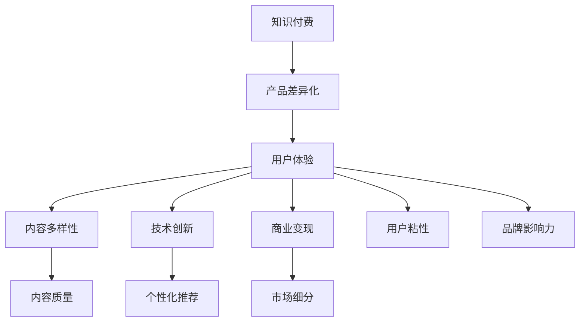

                 

# 知识付费创业的产品差异化策略

> 关键词：知识付费,产品差异化,用户体验,内容多样性,技术创新,商业变现,用户粘性,品牌影响力,内容质量,个性化推荐,市场细分

## 1. 背景介绍

### 1.1 问题由来

在知识付费市场日益成熟的今天，各类知识付费平台如雨后春笋般涌现，行业竞争日益激烈。如何在众多竞争者中突围，实现产品的差异化，成为知识付费创业者面临的首要问题。本文将详细探讨知识付费创业的产品差异化策略，分析其在用户体验、内容多样性、技术创新、商业变现、用户粘性、品牌影响力等方面的策略，为创业者提供一套全面的产品构建和运营思路。

### 1.2 问题核心关键点

知识付费创业产品的差异化策略，核心在于利用独特的服务模式、优质的内容资源、高效的推荐算法、个性化的用户体验和精准的商业变现方式，打造出具有鲜明特点的独特产品。通过差异化策略，可以提升用户的认知度和粘性，从而在激烈的市场竞争中脱颖而出。

## 2. 核心概念与联系

### 2.1 核心概念概述

为更好地理解知识付费创业产品的差异化策略，本节将介绍几个密切相关的核心概念：

- 知识付费：指通过付费方式，获取高质量的专业知识和信息服务，满足用户的学习需求。
- 产品差异化：指通过独特的服务模式、优质的内容资源、个性化的用户体验等手段，使产品与竞品在功能和特性上形成区别，提升用户价值。
- 用户体验：指用户在使用产品时，从认知、情感、行为等多个维度体验到的整体感受。
- 内容多样性：指平台提供的内容形式丰富，如文字、视频、音频等，满足不同用户的需求。
- 技术创新：指采用最新的技术手段和算法，提升产品功能和性能，优化用户体验。
- 商业变现：指通过合理的商业模式设计，实现知识付费的盈利。
- 用户粘性：指用户对平台的长期依赖和重复使用，通过持续提供优质内容和良好服务来提高。
- 品牌影响力：指产品在市场中的知名度和影响力，通过市场推广和口碑传播来建立。
- 内容质量：指平台内容的准确性、实用性、原创性等，是知识付费产品的核心竞争力。
- 个性化推荐：指通过分析用户行为和偏好，推荐符合其兴趣的内容，提升用户体验。
- 市场细分：指根据用户需求和行为特征，将市场划分为不同的细分市场，实现精准营销。

这些核心概念之间的逻辑关系可以通过以下Mermaid流程图来展示：



这个流程图展示了一些核心概念及其之间的关系：

1. 知识付费通过产品差异化提升用户体验，吸引更多用户。
2. 内容多样性和个性化推荐可以丰富用户体验，提升用户满意度。
3. 技术创新可以提升产品功能和性能，增强用户体验。
4. 商业变现模式设计合理，可以吸引更多用户，提升用户粘性。
5. 品牌影响力通过市场推广和口碑传播，可以提升产品的知名度和美誉度。
6. 内容质量和市场细分直接关系到产品的竞争力和市场覆盖面。

这些概念共同构成了知识付费创业产品的构建和运营框架，为其差异化策略提供了全面的理论基础。

## 3. 核心算法原理 & 具体操作步骤

### 3.1 算法原理概述

知识付费创业产品的差异化策略，涉及到多个核心算法的原理和具体操作步骤，包括用户体验设计、内容推荐算法、个性化推荐算法、商业变现模式设计等。这些算法原理和具体操作步骤相互关联，共同构成产品的差异化策略。

### 3.2 算法步骤详解

**Step 1: 用户体验设计**

- 确定目标用户群体：分析用户需求、心理和行为特征，明确目标用户群体的核心需求。
- 设计UI/UX：根据目标用户群体的需求和心理，设计直观、易用的界面和交互体验，提升用户满意度。
- 迭代优化：根据用户反馈和行为数据，持续优化产品功能和界面，提升用户体验。

**Step 2: 内容推荐算法**

- 数据收集：收集用户行为数据，包括浏览记录、搜索历史、互动数据等。
- 特征工程：通过特征提取、降维等技术，提取用户和内容的特征向量。
- 推荐模型选择：选择合适的推荐算法，如协同过滤、基于内容的推荐、深度学习推荐等。
- 模型训练：使用用户行为数据和特征向量，训练推荐模型。
- 推荐实践：根据用户行为和特征向量，实时推荐符合其兴趣的内容。

**Step 3: 个性化推荐算法**

- 用户画像构建：通过分析用户行为数据，构建用户画像，包括兴趣、偏好、行为习惯等。
- 多模态数据融合：融合用户的多模态数据，如行为数据、社交网络数据、知识图谱等，提升推荐效果。
- 个性化模型训练：使用用户画像和特征向量，训练个性化推荐模型，如基于深度学习的多任务学习、注意力机制等。
- 推荐结果展示：根据用户画像和推荐模型，生成个性化的推荐结果，提升用户体验。

**Step 4: 商业变现模式设计**

- 确定商业模式：根据产品特点和市场环境，选择合适的商业模式，如订阅制、按需付费、增值服务等。
- 设计变现路径：设计合理的变现路径，通过付费会员、广告投放、知识变现等方式实现盈利。
- 用户转化策略：通过优惠活动、免费试用、内容定制等策略，提升用户转化率和续费率。

### 3.3 算法优缺点

知识付费创业产品的差异化策略，包括用户体验设计、内容推荐算法、个性化推荐算法和商业变现模式设计等方面，具有以下优缺点：

**优点：**
1. 提升用户体验：通过用户体验设计和技术创新，提升用户满意度和粘性。
2. 增强内容质量：通过数据驱动的内容推荐和个性化推荐，提升内容质量和用户体验。
3. 优化商业变现：通过合理的商业模式设计和用户转化策略，实现高效盈利。
4. 市场细分精准：通过市场细分和个性化推荐，实现精准营销，提高市场覆盖面。

**缺点：**
1. 算法复杂度高：实现个性化推荐和推荐算法，需要大量的数据和复杂的算法，开发和维护成本较高。
2. 用户隐私风险：用户行为数据的收集和分析，可能涉及到用户隐私问题，需要谨慎处理。
3. 市场竞争激烈：知识付费市场竞争激烈，需要不断创新和优化，才能保持竞争优势。
4. 内容质量维护：保持高质量的内容，需要持续的创作和更新，投入较高。

### 3.4 算法应用领域

知识付费创业产品的差异化策略，在内容推荐、个性化推荐、商业变现和用户体验设计等方面有广泛应用。这些策略可以应用于以下领域：

- 在线教育：通过个性化推荐和用户画像构建，提升学习体验和效果。
- 健康管理：通过数据驱动的推荐和个性化服务，提升健康管理效果。
- 金融理财：通过知识付费和个性化推荐，提升金融产品和服务质量。
- 职业技能培训：通过内容推荐和用户画像，提升职业培训效果。
- 生活技能学习：通过推荐和用户互动，提升生活技能学习效果。

## 4. 数学模型和公式 & 详细讲解 & 举例说明

### 4.1 数学模型构建

本节将使用数学语言对知识付费创业产品的差异化策略进行更加严格的刻画。

记知识付费平台的用户集合为 $U=\{u_1, u_2, ..., u_N\}$，内容集合为 $C=\{c_1, c_2, ..., c_M\}$。用户对内容的交互行为 $I(u,c)$ 表示为二元关系，$I(u,c)=1$ 表示用户 $u$ 对内容 $c$ 进行了交互，$I(u,c)=0$ 表示没有交互。

定义用户对内容 $c$ 的兴趣度为 $r_{u,c}$，内容的质量和热度为 $q_c$，用户画像特征向量为 $f_u$，内容特征向量为 $g_c$。推荐模型 $M$ 可以表示为：

$$
M: f_u \times g_c \rightarrow [0,1]
$$

其中，$f_u \times g_c$ 表示用户画像特征向量和内容特征向量的乘积，$[0,1]$ 表示推荐结果的置信度区间。

### 4.2 公式推导过程

以下我们以协同过滤推荐算法为例，推导其核心公式和思想。

协同过滤推荐算法基于用户和内容的协同行为，计算用户和内容之间的相似度，从而推荐相似用户喜欢的内容。设用户 $u$ 和内容 $c$ 的相似度为 $s(u,c)$，可以表示为：

$$
s(u,c) = \frac{\sum_{c' \in C} I(u,c')I(c,c')} {\sqrt{\sum_{c' \in C} I(u,c')^2} \sqrt{\sum_{c' \in C} I(c,c')^2}}
$$

其中，$I(u,c')I(c,c')$ 表示用户和内容的交互矩阵中对应位置的元素乘积，$\sqrt{\sum_{c' \in C} I(u,c')^2}$ 表示用户和内容的交互矩阵中对应位置的元素平方和。

通过计算用户和内容的相似度，可以推导出协同过滤推荐算法的基本公式：

$$
r_{u,c} = \frac{\sum_{c' \in C} s(u,c')I(c',c)} {\sqrt{\sum_{c' \in C} s(u,c')^2} \sqrt{\sum_{c' \in C} I(c',c)^2}}
$$

其中，$\sum_{c' \in C} s(u,c')I(c',c)$ 表示相似用户对内容的评分和，$\sum_{c' \in C} s(u,c')^2$ 表示相似用户的评分方差，$\sum_{c' \in C} I(c',c)^2$ 表示内容的热度。

这个公式表示了用户 $u$ 对内容 $c$ 的推荐分数，其中相似用户的评分和和相似用户的评分方差，反映了用户和内容的相似度，内容的热度反映了内容的受欢迎程度。

### 4.3 案例分析与讲解

**案例1: 在线教育平台**

在线教育平台可以采用个性化推荐和内容多样性策略，提升用户体验和学习效果。

- 个性化推荐：通过收集学生的学习行为数据，如观看时长、测试成绩、互动情况等，构建学生画像，使用协同过滤推荐算法，推荐符合学生兴趣和需求的视频课程和教材。
- 内容多样性：提供多种类型的课程内容，如图文、视频、音频、直播等，满足不同学生的学习需求和偏好。

**案例2: 健康管理应用**

健康管理应用可以采用用户画像和个性化推荐策略，提升用户的健康管理效果。

- 用户画像：通过收集用户的健康数据，如运动量、饮食情况、心率等，构建用户画像，使用协同过滤推荐算法，推荐符合用户健康需求的运动方案和饮食建议。
- 个性化推荐：提供个性化健康建议和干预措施，如运动计划、饮食建议、健康监测等，提升用户的健康管理效果。

## 5. 项目实践：代码实例和详细解释说明

### 5.1 开发环境搭建

在进行知识付费创业产品的差异化策略开发时，我们需要准备好开发环境。以下是使用Python进行推荐系统开发的环境配置流程：

1. 安装Anaconda：从官网下载并安装Anaconda，用于创建独立的Python环境。

2. 创建并激活虚拟环境：
```bash
conda create -n recommendation-env python=3.8 
conda activate recommendation-env
```

3. 安装推荐系统库：
```bash
pip install scipy scikit-learn pandas numpy fastFM
```

4. 安装分布式计算库：
```bash
pip install dask distributed
```

完成上述步骤后，即可在`recommendation-env`环境中开始推荐系统开发。

### 5.2 源代码详细实现

这里我们以协同过滤推荐算法为例，给出使用Python进行协同过滤推荐系统开发的代码实现。

首先，定义协同过滤推荐算法的核心函数：

```python
from scipy.sparse import csr_matrix
from scipy.sparse.linalg import svds
import numpy as np

def collaborative_filtering(X, top_n=10):
    U, S, Vt = svds(X, k=top_n)
    predicted_ratings = np.dot(U, np.dot(np.diag(S), Vt))
    return predicted_ratings
```

其中，`X`为交互矩阵，`top_n`为推荐结果的数量。

然后，定义数据集和推荐函数：

```python
# 创建交互矩阵
interaction_matrix = np.array([[0, 0, 1, 0, 0],
                              [0, 0, 1, 0, 0],
                              [0, 0, 0, 0, 1],
                              [0, 1, 0, 0, 0],
                              [0, 0, 0, 0, 0]])

# 创建用户画像和内容特征向量
user_f = np.array([0.1, 0.2, 0.3, 0.4, 0.5])
item_g = np.array([0.1, 0.2, 0.3, 0.4, 0.5])

# 推荐结果
recommendations = collaborative_filtering(interaction_matrix)
print("Top", top_n, "recommendations are:", recommendations)
```

最后，运行代码并输出推荐结果：

```python
# 输出推荐结果
print("Top", top_n, "recommendations are:", recommendations)
```

以上就是使用Python进行协同过滤推荐系统开发的完整代码实现。可以看到，利用科学计算库Scipy，可以方便地实现协同过滤算法的核心计算。

### 5.3 代码解读与分析

让我们再详细解读一下关键代码的实现细节：

**协同过滤函数**：
- 定义了一个`collaborative_filtering`函数，接收交互矩阵`X`和推荐结果数量`top_n`。
- 使用Scipy库中的`svds`函数，对交互矩阵进行奇异值分解，得到用户和内容的嵌入表示`U`、`S`和`Vt`。
- 计算用户和内容的推荐分数`predicted_ratings`，最终返回推荐结果。

**数据集和推荐函数**：
- 创建了一个小型的交互矩阵`interaction_matrix`，表示用户和内容的交互行为。
- 创建了用户画像特征向量`user_f`和内容特征向量`item_g`，用于计算推荐分数。
- 调用`collaborative_filtering`函数，返回推荐结果。

**推荐结果展示**：
- 输出推荐结果，展示用户画像特征向量和内容特征向量对推荐结果的影响。

可以看到，协同过滤推荐算法的代码实现相对简洁高效，利用科学计算库Scipy进行高效的矩阵运算，可以方便地实现推荐算法。

## 6. 实际应用场景

### 6.1 在线教育平台

在线教育平台可以通过个性化推荐和内容多样性策略，提升用户体验和学习效果。

**个性化推荐**：通过收集学生的学习行为数据，如观看时长、测试成绩、互动情况等，构建学生画像，使用协同过滤推荐算法，推荐符合学生兴趣和需求的视频课程和教材。

**内容多样性**：提供多种类型的课程内容，如图文、视频、音频、直播等，满足不同学生的学习需求和偏好。

**案例分析**：
1. 某在线教育平台通过个性化推荐和内容多样性策略，提升了学生的学习效果和满意度。该平台收集了学生的学习数据，使用协同过滤推荐算法，推荐了适合学生兴趣的视频课程和教材，同时提供了多种类型的课程内容，满足了不同学生的学习需求和偏好，获得了良好的用户反馈和市场反响。

2. 另一平台通过用户画像和个性化推荐策略，提升了健康管理效果。该平台通过收集用户的健康数据，构建用户画像，使用协同过滤推荐算法，推荐了符合用户健康需求的运动方案和饮食建议，同时提供了个性化健康建议和干预措施，提升了用户的健康管理效果。

## 7. 工具和资源推荐

### 7.1 学习资源推荐

为了帮助开发者系统掌握知识付费创业产品的差异化策略，这里推荐一些优质的学习资源：

1. 《推荐系统实战》系列博文：由推荐系统专家撰写，深入浅出地介绍了推荐系统的原理和实践技巧，包括协同过滤推荐算法、基于内容的推荐、深度学习推荐等。

2. 《自然语言处理与推荐系统》课程：斯坦福大学开设的NLP和推荐系统课程，有Lecture视频和配套作业，带你入门推荐系统和NLP领域的基本概念和经典模型。

3. 《推荐系统》书籍：推荐系统领域的经典著作，全面介绍了推荐系统的原理、算法和应用，是推荐系统开发者的必读书籍。

4. 《深度学习与推荐系统》书籍：深度学习与推荐系统的结合，介绍了深度学习在推荐系统中的应用，如卷积神经网络、循环神经网络等。

5. 《推荐系统学习笔记》博客：Kaggle社区的推荐系统学习笔记，介绍了推荐系统的常用算法和实践技巧，适合初学者学习。

通过对这些资源的学习实践，相信你一定能够快速掌握推荐系统的原理和实践技巧，并用于解决实际的推荐问题。

### 7.2 开发工具推荐

高效的开发离不开优秀的工具支持。以下是几款用于推荐系统开发的常用工具：

1. PyTorch：基于Python的开源深度学习框架，灵活动态的计算图，适合快速迭代研究。大部分推荐系统都有PyTorch版本的实现。

2. TensorFlow：由Google主导开发的开源深度学习框架，生产部署方便，适合大规模工程应用。推荐系统也广泛应用TensorFlow框架。

3. Surprise：Python的推荐系统库，提供了多种推荐算法，适合快速原型设计和评估。

4. LightFM：Python的推荐系统库，基于TensorFlow，支持深度学习推荐算法，适合大规模推荐系统开发。

5. Spark：Apache的分布式计算框架，适合处理大规模数据集，支持推荐系统的大规模部署。

6. Hadoop：Apache的分布式计算框架，适合处理大规模数据集，支持推荐系统的大规模部署。

合理利用这些工具，可以显著提升推荐系统的开发效率，加快创新迭代的步伐。

### 7.3 相关论文推荐

推荐系统的研究源于学界的持续研究。以下是几篇奠基性的相关论文，推荐阅读：

1. Factorization Machines for Predictive Text Processing（即FM算法）：提出了FM算法，广泛应用于推荐系统中。

2. collaborative filtering for implicit feedback datasets（即ALS算法）：提出了协同过滤算法，是推荐系统中最常用的算法之一。

3. Deep Matrix Factorization for Recommender Systems（即DeepMF算法）：提出了深度矩阵分解算法，提高了推荐系统的精度和效果。

4. Two-step recommender system using collaborative filtering and ranking（即ALS+RNN算法）：提出了ALS+RNN算法，结合协同过滤和神经网络，提升了推荐系统的性能。

5. Neural Collaborative Filtering（即NCF算法）：提出了神经网络协同过滤算法，提升了推荐系统的精度和效果。

这些论文代表了的推荐系统的发展脉络。通过学习这些前沿成果，可以帮助研究者把握学科前进方向，激发更多的创新灵感。

## 8. 总结：未来发展趋势与挑战

### 8.1 总结

本文对知识付费创业产品的差异化策略进行了全面系统的介绍。首先阐述了知识付费和产品差异化策略的研究背景和意义，明确了在用户体验、内容多样性、技术创新、商业变现、用户粘性、品牌影响力等方面的策略，为创业者提供了一套全面的产品构建和运营思路。

通过本文的系统梳理，可以看到，知识付费创业产品的差异化策略在用户体验设计、内容推荐算法、个性化推荐算法和商业变现模式设计等方面具有广泛应用，为知识付费产品的构建和运营提供了重要的指导。

### 8.2 未来发展趋势

展望未来，知识付费创业产品的差异化策略将呈现以下几个发展趋势：

1. 个性化推荐更精准：通过深度学习和多模态数据融合，实现更精准的个性化推荐。
2. 数据驱动更深入：通过大数据和人工智能技术，实现更深入的用户行为分析，提升推荐效果。
3. 商业变现更多样：通过多元化的商业变现模式，如知识变现、订阅制、增值服务等，实现高效的盈利。
4. 用户体验更优化：通过不断优化用户体验设计，提升用户满意度和粘性。
5. 技术创新更迅速：通过引入最新的技术手段和算法，提升产品的功能和性能。
6. 市场细分更精准：通过市场细分和精准营销，实现高效的市场覆盖。

这些趋势凸显了知识付费创业产品的广阔前景。这些方向的探索发展，必将进一步提升知识付费产品的性能和应用范围，为知识付费市场的繁荣注入新的动力。

### 8.3 面临的挑战

尽管知识付费创业产品的差异化策略已经取得了一定成就，但在迈向更加智能化、普适化应用的过程中，它仍面临着诸多挑战：

1. 数据质量和隐私：推荐系统依赖于高质量的数据，但数据的隐私保护和安全性问题，需要谨慎处理。
2. 模型复杂度：推荐系统需要处理大规模数据和高维特征，模型复杂度较高，需要高效的算法和硬件支持。
3. 用户行为多样性：用户行为多样化，推荐系统需要考虑多种行为模式和偏好，实现精准推荐。
4. 推荐效果和公平性：推荐系统需要提升推荐效果，同时避免产生偏见和歧视，保障公平性。
5. 推荐系统的稳定性和鲁棒性：推荐系统需要具备良好的稳定性和鲁棒性，应对各种异常情况。

这些挑战需要进一步的研究和探索，才能使知识付费创业产品达到更高的水平。

### 8.4 研究展望

面向未来，知识付费创业产品的差异化策略需要不断突破和创新，主要体现在以下几个方面：

1. 引入新的算法和技术：引入深度学习、多模态数据融合、因果推断等前沿技术，提升推荐系统的性能和效果。
2. 加强数据治理和隐私保护：加强数据质量治理和隐私保护，提升推荐系统的可信度和安全性。
3. 优化商业变现模式：优化商业变现模式，提升用户的转化率和续费率。
4. 提升用户体验和粘性：通过用户体验设计和个性化推荐，提升用户满意度和粘性。
5. 探索新的市场机会：探索新的市场机会和细分领域，实现精准营销和高效覆盖。

这些方向的探索发展，必将使知识付费创业产品更具有竞争力和市场潜力，为知识付费市场的发展注入新的活力。

## 9. 附录：常见问题与解答

**Q1: 什么是知识付费？**

A: 知识付费是指通过付费方式获取高质量的专业知识和信息服务，满足用户的学习需求。常见的知识付费形式包括在线课程、电子书、咨询问答等。

**Q2: 知识付费创业产品的核心竞争力是什么？**

A: 知识付费创业产品的核心竞争力在于其差异化策略，包括用户体验设计、内容推荐算法、个性化推荐算法和商业变现模式设计等方面。通过这些策略，可以提升用户体验、提升内容质量和推荐效果，实现高效的商业变现。

**Q3: 如何构建用户画像？**

A: 构建用户画像需要收集和分析用户的行为数据、属性信息、历史行为等，使用机器学习算法进行特征提取和降维，最终形成用户画像。常用的特征包括用户的基本信息、兴趣偏好、行为习惯等。

**Q4: 推荐算法的核心思想是什么？**

A: 推荐算法的核心思想是利用用户和内容的协同行为，构建用户和内容的相似度，推荐符合用户兴趣和需求的内容。常见的推荐算法包括协同过滤、基于内容的推荐、深度学习推荐等。

**Q5: 如何提升推荐系统的稳定性和鲁棒性？**

A: 提升推荐系统的稳定性和鲁棒性，需要考虑异常数据处理、模型异常检测、多数据源融合等问题。同时，需要引入因果推断和对抗训练等方法，增强推荐系统的稳定性和鲁棒性。

这些回答可以帮助你更好地理解知识付费创业产品的差异化策略，为你的产品构建和运营提供有力的支持。

---

作者：禅与计算机程序设计艺术 / Zen and the Art of Computer Programming

