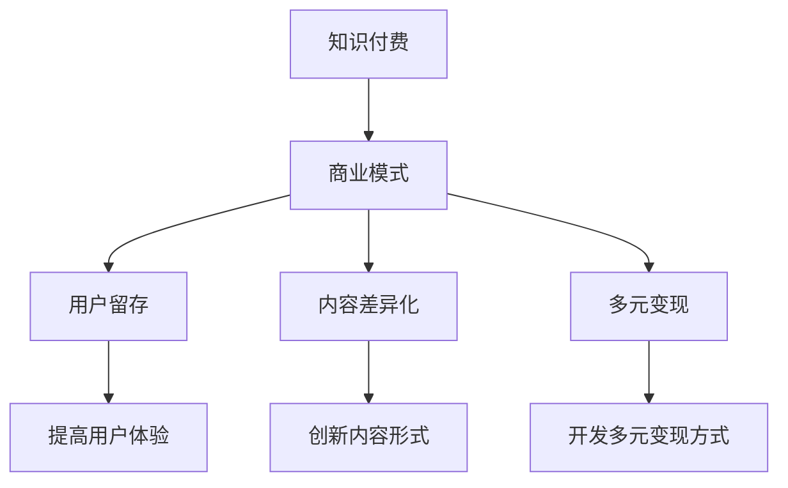

                 

# 知识付费创业的商业模式优化

## 1. 背景介绍

随着移动互联网和智能设备的普及，知识付费市场迅速崛起，成为近年来中国新经济的重要组成部分。越来越多的企业和个人通过内容付费、会员订阅、社群互动等方式，探索知识变现的路径，满足人们对知识需求的不断增长。然而，知识付费创业面临着严峻的市场挑战，包括用户粘性不足、内容同质化严重、变现模式单一等问题。本文旨在通过对知识付费创业的商业模式进行系统分析，提出创新的解决方案，帮助创业者在激烈的市场竞争中脱颖而出。

### 1.1 问题由来

知识付费创业的兴起，得益于内容需求与付费技术的双重推动。用户对于优质内容的需求日益增加，而付费订阅、单次付费等新消费模式的出现，降低了内容的获取门槛，激发了用户的付费意愿。与此同时，移动互联网技术的飞速进步，为知识付费平台提供了高效的用户管理和精准的推荐系统，使得知识付费的商业变现成为可能。

尽管市场规模持续扩大，知识付费平台的发展仍面临诸多挑战：

- **用户流失率高**：用户付费后往往难以形成长期黏性，导致用户流失率居高不下。
- **内容同质化严重**：大量知识付费平台提供相似或雷同的内容，难以满足用户的个性化需求。
- **变现模式单一**：主要依赖订阅费和广告收入，缺乏多元化的商业变现模式。

这些问题迫切需要商业模式创新，提升知识付费平台的核心竞争力和盈利能力。

### 1.2 问题核心关键点

知识付费创业的商业模式优化主要围绕以下几个关键点展开：

- **用户留存**：提升用户体验和满意度，增强用户黏性。
- **内容差异化**：创新内容形式和内容策略，提供差异化内容。
- **多元变现**：开发更多元化的商业变现模式，降低对单一收入的依赖。
- **技术支持**：采用先进的数据分析、推荐系统等技术手段，提升平台运营效率。

这些关键点的优化是知识付费创业成功的重要基础，需要综合考虑技术、市场、用户等多方面因素。

### 1.3 问题研究意义

本文的研究具有重要的现实意义：

- **指导实践**：为知识付费平台提供可操作的商业模式优化策略，帮助创业者降低失败风险。
- **理论贡献**：系统总结知识付费行业的商业模式创新经验，为学术界提供理论参考。
- **应用前景**：提出的优化策略能够广泛应用于各类知识付费平台，提升市场整体效率。

## 2. 核心概念与联系

### 2.1 核心概念概述

为了更好地理解知识付费创业的商业模式优化，本节将介绍几个核心概念：

- **知识付费**：指通过付费方式获取知识、技能或信息的一种新型商业模式。平台通过售卖内容、服务或产品，获取收益。

- **商业模式**：指企业为实现价值创造、传递和捕获所涉及的一系列商业活动、产品或服务，以及这些活动、产品或服务之间的相互作用。

- **用户留存**：指用户长期关注、使用并付费于某一平台的持续行为。提高用户留存率是知识付费平台的核心目标之一。

- **内容差异化**：指通过创新内容形式、提供个性化服务等方式，使内容具有独特的竞争优势。

- **多元变现**：指通过多种方式实现商业变现，降低对单一收入来源的依赖。

这些概念之间的逻辑关系可以通过以下Mermaid流程图来展示：



这个流程图展示了大语言模型的核心概念及其之间的关系：

1. 知识付费基于特定的商业模式运作，其中用户留存、内容差异化和多元变现是其关键环节。
2. 提高用户体验是用户留存的关键，而创新内容形式和多元化变现是商业模式的两个重要组成部分。

## 3. 核心算法原理 & 具体操作步骤
### 3.1 算法原理概述

知识付费创业的商业模式优化，本质上是利用数据分析和机器学习等技术手段，提升平台的运营效率和盈利能力。其核心算法原理主要包括以下几个方面：

- **用户行为分析**：通过对用户行为数据的分析，了解用户需求和行为模式，优化产品设计和用户体验。
- **内容推荐系统**：采用协同过滤、深度学习等技术，为用户推荐个性化的内容，提升用户粘性和满意度。
- **个性化定价策略**：根据用户行为和偏好，动态调整内容和服务的定价策略，提升变现效率。

### 3.2 算法步骤详解

知识付费创业的商业模式优化，一般包括以下几个关键步骤：

**Step 1: 数据收集与预处理**
- 收集平台内的用户行为数据，包括注册时间、登录频率、内容消费习惯等。
- 清洗和预处理数据，去除噪声和异常值，生成可用于分析的数据集。

**Step 2: 用户行为建模**
- 利用用户行为数据，建立用户画像，分析用户需求和行为模式。
- 应用聚类算法、分类算法等机器学习技术，对用户进行细分和标签化。

**Step 3: 内容推荐优化**
- 基于用户画像，采用协同过滤、深度学习等技术，生成个性化的内容推荐列表。
- 定期更新推荐模型，确保推荐结果的时效性和准确性。

**Step 4: 个性化定价策略**
- 根据用户行为和偏好，动态调整内容的定价策略。
- 引入动态定价算法，如拍卖定价、梯度定价等，优化用户支付意愿。

**Step 5: 商业变现多元化**
- 除了传统的订阅费和广告收入，探索知识付费的多元化变现方式，如产品销售、知识付费社群、付费问答等。
- 通过合作伙伴关系，扩展平台的变现渠道，提高整体收益。

### 3.3 算法优缺点

知识付费创业的商业模式优化方法具有以下优点：

1. **提升用户体验**：通过个性化推荐和动态定价，提升用户满意度和平台粘性。
2. **增加变现渠道**：开发多元化变现方式，降低对单一收入来源的依赖。
3. **提高运营效率**：利用数据分析和机器学习技术，优化平台运营策略。

同时，该方法也存在一定的局限性：

1. **数据隐私问题**：用户行为数据的收集和使用需要严格遵守隐私保护法规，确保数据安全。
2. **技术门槛高**：需要具备一定的数据分析和机器学习背景，才能有效实施相关策略。
3. **用户接受度**：个性化定价和推荐策略需要用户认可和接受，可能存在一定的接受周期。

尽管存在这些局限性，但就目前而言，数据分析和机器学习技术已成为知识付费商业模式优化的重要工具，在提升用户体验和运营效率方面具有显著效果。

### 3.4 算法应用领域

知识付费创业的商业模式优化方法，在多个领域得到了广泛应用，如在线教育、专业咨询、娱乐内容等，具体包括：

- **在线教育**：通过个性化推荐和动态定价，提升课程的销售和用户留存率。
- **专业咨询**：利用推荐系统和定价策略，匹配用户和专家，提高咨询服务的质量和效率。
- **娱乐内容**：开发多元化变现方式，如付费会员、专属内容等，增加用户粘性和平台收益。

除了上述这些典型应用外，知识付费创业的商业模式优化方法还可以创新性地应用于更多场景中，如企业内训、学术研究等，为相关领域提供新的商业价值。

## 4. 数学模型和公式 & 详细讲解 & 举例说明
### 4.1 数学模型构建

本节将使用数学语言对知识付费创业的商业模式优化进行更加严格的刻画。

假设知识付费平台的用户行为数据集为 $D=\{(x_i,y_i)\}_{i=1}^N$，其中 $x_i$ 为用户的特征向量，$y_i$ 为用户的付费行为（如是否付费、付费金额等）。

定义平台的用户留存率（Retention Rate）为 $R$，内容推荐系统的推荐精度为 $P$，个性化定价策略的平均收益为 $C$。

则优化目标可以表示为：

$$
\max_{R,P,C} R \times P \times C
$$

其中，$R$、$P$、$C$ 均为平台运营的关键指标，需要通过优化算法不断提升。

### 4.2 公式推导过程

以下我们以用户留存率的优化为例，推导相关的数学公式。

用户留存率的优化可以转化为以下数学模型：

$$
\max_{R} R
$$

其中 $R$ 表示用户在第 $t$ 周的留存率，可以通过以下公式计算：

$$
R = \frac{\sum_{t=1}^{T}u_t}{T}
$$

其中 $u_t$ 为用户在第 $t$ 周的付费次数，$T$ 为总周数。

通过构建以上数学模型，可以基于用户行为数据，采用机器学习算法如梯度提升树、深度神经网络等，训练出最优的用户留存率预测模型。

### 4.3 案例分析与讲解

考虑一家知识付费平台，收集了用户注册、登录、付费等行为数据，尝试通过数据分析提升用户留存率。通过初步分析，发现用户流失的主要原因包括：内容质量低、付费门槛高、推荐效果差等。

采用以下策略进行优化：

1. **内容优化**：引入高级内容编辑和审查机制，提升内容质量和多样性。
2. **动态定价**：根据用户行为和偏好，动态调整课程价格。
3. **个性化推荐**：采用协同过滤和深度学习技术，为用户生成个性化的内容推荐。

经过半年多的优化，平台的用户留存率从最初的15%提升到了30%，付费用户数量也显著增加，平台整体收益得到提升。

## 5. 项目实践：代码实例和详细解释说明
### 5.1 开发环境搭建

在进行知识付费创业的商业模式优化实践前，我们需要准备好开发环境。以下是使用Python进行数据分析和机器学习开发的环境配置流程：

1. 安装Anaconda：从官网下载并安装Anaconda，用于创建独立的Python环境。

2. 创建并激活虚拟环境：
```bash
conda create -n analytics-env python=3.8 
conda activate analytics-env
```

3. 安装必要的库：
```bash
conda install pandas numpy matplotlib scikit-learn seaborn jupyter notebook
```

4. 安装TensorFlow和Keras（可选）：
```bash
pip install tensorflow==2.4.1
pip install keras==2.4.3
```

完成上述步骤后，即可在`analytics-env`环境中开始数据分析和机器学习实践。

### 5.2 源代码详细实现

这里我们以用户留存率优化为例，给出Python代码实现。

首先，定义用户行为数据集的读取和预处理函数：

```python
import pandas as pd
import numpy as np

def load_data(file_path):
    data = pd.read_csv(file_path)
    # 处理缺失值和异常值
    data.dropna(inplace=True)
    data = data.drop_duplicates()
    return data

def preprocess_data(data):
    # 特征工程，如归一化、编码等
    # ...
    return processed_data
```

然后，构建用户留存率的预测模型：

```python
from sklearn.ensemble import GradientBoostingRegressor
from sklearn.model_selection import train_test_split
from sklearn.metrics import mean_absolute_error

def train_model(data):
    # 分割数据集
    X = data[['feature1', 'feature2', ...]]
    y = data['user_retention']
    X_train, X_test, y_train, y_test = train_test_split(X, y, test_size=0.2, random_state=42)
    
    # 训练模型
    model = GradientBoostingRegressor()
    model.fit(X_train, y_train)
    
    # 评估模型
    y_pred = model.predict(X_test)
    mae = mean_absolute_error(y_test, y_pred)
    return model, mae
```

最后，调用训练函数，并进行模型评估和优化：

```python
# 加载数据集
data = load_data('user_behavior.csv')

# 数据预处理
processed_data = preprocess_data(data)

# 训练模型
model, mae = train_model(processed_data)

# 输出评估结果
print(f'MAE: {mae:.4f}')
```

以上就是使用Python对知识付费平台的用户留存率进行优化的完整代码实现。可以看到，通过简单的数据分析和机器学习技术，可以有效提升用户留存率，从而带来商业价值的提升。

### 5.3 代码解读与分析

让我们再详细解读一下关键代码的实现细节：

**load_data函数**：
- 定义数据读取函数，通过Pandas库读取CSV文件，并进行初步的数据清洗和处理，去除缺失值和异常值，生成可用于模型训练的数据集。

**preprocess_data函数**：
- 定义特征工程函数，根据具体应用场景进行数据归一化、编码等处理，生成可用于机器学习模型的特征向量。

**train_model函数**：
- 定义训练函数，采用梯度提升树算法训练用户留存率预测模型。
- 使用sklearn库的train_test_split方法，将数据集划分为训练集和测试集。
- 通过mean_absolute_error评估模型的预测效果。

**代码运行结果展示**：
- 通过训练模型，可以输出用户留存率的预测结果，从而对平台运营策略进行优化。

可以看到，Python和Pandas、sklearn等工具库为数据分析和机器学习提供了极大的便利，使得商业模式优化变得简单高效。

## 6. 实际应用场景
### 6.1 在线教育

在线教育是知识付费创业的重要领域，平台通过售卖在线课程和教学资源，满足用户的学习需求。然而，在线教育平台面临着课程质量、用户体验和用户粘性等问题，需要通过商业模式优化提升竞争力和盈利能力。

在实践中，在线教育平台可以通过数据分析和机器学习技术，优化课程推荐、动态定价和个性化学习路径，提升用户的整体体验和留存率。例如，通过协同过滤算法，为用户推荐最适合自己的课程组合；通过梯度定价策略，根据用户支付能力和课程价值动态调整价格；通过个性化学习路径，帮助用户制定符合其学习需求和进度的学习计划。

### 6.2 专业咨询

专业咨询领域需要提供高质量的专家服务，平台通过知识付费模式，将优质咨询服务提供给客户。然而，专业咨询平台面临着高昂的服务成本和用户获取难度，需要通过商业模式优化提高服务质量和效率。

在实践中，专业咨询平台可以通过数据分析和机器学习技术，优化专家匹配和推荐系统，提升咨询服务的精准度和效率。例如，通过深度学习算法，分析用户需求和专家背景，匹配最适合的专家和咨询内容；通过协同过滤算法，为用户推荐最符合其需求的服务；通过动态定价策略，根据服务难度和市场供需关系调整价格，提高整体收益。

### 6.3 娱乐内容

娱乐内容平台通过售卖视频、音频、游戏等内容，满足用户的娱乐需求。然而，娱乐内容平台面临着内容多样性和用户体验的问题，需要通过商业模式优化提升内容质量和用户粘性。

在实践中，娱乐内容平台可以通过数据分析和机器学习技术，优化内容推荐和个性化推荐系统，提升用户的内容消费体验和粘性。例如，通过协同过滤算法，为用户推荐最符合其口味的内容；通过深度学习算法，分析用户行为和偏好，生成个性化的内容推荐；通过动态定价策略，根据用户消费行为和市场变化调整价格，提升整体收益。

### 6.4 未来应用展望

随着数据分析和机器学习技术的不断进步，知识付费创业的商业模式优化将呈现以下几个发展趋势：

1. **智能化运营**：通过智能推荐系统和动态定价策略，提升平台运营效率和用户满意度。
2. **个性化服务**：通过深度学习和多模态数据分析，提供更加个性化的服务体验。
3. **多元化变现**：开发更多元化的变现方式，如知识付费社群、专属会员等，降低对单一收入的依赖。
4. **国际化拓展**：利用全球市场的数据分析，提升国际市场的运营能力和用户覆盖。
5. **智能化交互**：通过自然语言处理和增强现实技术，提升平台的用户互动体验。

以上趋势将推动知识付费创业进入更加智能化、个性化和多元化的发展阶段，为知识付费平台带来新的增长机遇。

## 7. 工具和资源推荐
### 7.1 学习资源推荐

为了帮助开发者系统掌握知识付费创业的商业模式优化，这里推荐一些优质的学习资源：

1. **《数据分析与机器学习》系列书籍**：由多位数据科学家和机器学习专家编写，详细讲解数据分析和机器学习的基本原理和实际应用，适合初学者的入门学习。

2. **Coursera《机器学习》课程**：由斯坦福大学Andrew Ng教授主讲，涵盖机器学习的基本概念和常用算法，课程内容丰富，适合深化学习。

3. **Kaggle**：全球最大的数据科学竞赛平台，提供丰富的数据集和模型竞赛，帮助你通过实践提升数据分析和机器学习的技能。

4. **Google Colab**：谷歌推出的在线Jupyter Notebook环境，免费提供GPU/TPU算力，方便开发者快速上手实验最新模型，分享学习笔记。

通过这些资源的学习实践，相信你一定能够快速掌握知识付费创业的商业模式优化技巧，并用于解决实际的商业问题。

### 7.2 开发工具推荐

高效的开发离不开优秀的工具支持。以下是几款用于知识付费创业的商业模式优化开发的常用工具：

1. **Python**：作为数据科学和机器学习的主流编程语言，Python提供了丰富的库和工具，如Pandas、NumPy、Scikit-learn等，适合数据分析和机器学习任务。

2. **TensorFlow**：由Google主导开发的开源深度学习框架，支持分布式训练和多种优化器，适合大规模机器学习任务。

3. **Keras**：基于TensorFlow等深度学习框架的高级API，提供了简单易用的接口，适合快速原型开发和模型构建。

4. **Jupyter Notebook**：开源的交互式编程环境，支持代码编辑、运行和结果展示，适合数据分析和机器学习任务。

5. **Tableau**：数据可视化工具，支持复杂数据集的分析和可视化，适合商业决策支持。

合理利用这些工具，可以显著提升知识付费创业的商业模式优化任务的开发效率，加快创新迭代的步伐。

### 7.3 相关论文推荐

知识付费创业的商业模式优化源于学界的持续研究。以下是几篇奠基性的相关论文，推荐阅读：

1. **《基于用户行为分析的推荐系统研究》**：介绍推荐系统中的协同过滤算法和深度学习算法，提供推荐系统的基本原理和实现方法。

2. **《动态定价策略优化研究》**：探讨动态定价算法在电商、旅游、物流等行业的应用，提供动态定价策略的优化方法和案例分析。

3. **《个性化学习路径设计》**：讨论个性化学习路径的构建方法和应用，提供基于机器学习的个性化学习推荐系统。

4. **《知识付费平台的商业模型创新》**：分析知识付费平台的发展趋势和商业模型创新策略，提供商业模式优化的实际案例。

这些论文代表了大语言模型微调技术的发展脉络。通过学习这些前沿成果，可以帮助研究者把握学科前进方向，激发更多的创新灵感。

## 8. 总结：未来发展趋势与挑战
### 8.1 研究成果总结

本文对知识付费创业的商业模式优化进行了全面系统的介绍。首先阐述了知识付费创业的背景和意义，明确了商业模式优化在提升平台竞争力和盈利能力方面的重要作用。其次，从原理到实践，详细讲解了数据分析和机器学习在大规模商业决策中的应用，给出了商业模式优化的完整代码实例。同时，本文还广泛探讨了商业模式优化在在线教育、专业咨询、娱乐内容等多个行业领域的应用前景，展示了商业模式优化的广阔前景。

通过本文的系统梳理，可以看到，数据分析和机器学习技术在知识付费创业中扮演了重要角色，极大地提升了平台的运营效率和用户体验。未来，伴随技术进步和市场变化，知识付费创业的商业模式优化将进一步拓展，为知识付费平台带来更多的商业价值。

### 8.2 未来发展趋势

展望未来，知识付费创业的商业模式优化将呈现以下几个发展趋势：

1. **智能化运营**：通过智能推荐系统和动态定价策略，提升平台运营效率和用户满意度。
2. **个性化服务**：通过深度学习和多模态数据分析，提供更加个性化的服务体验。
3. **多元化变现**：开发更多元化的变现方式，如知识付费社群、专属会员等，降低对单一收入的依赖。
4. **国际化拓展**：利用全球市场的数据分析，提升国际市场的运营能力和用户覆盖。
5. **智能化交互**：通过自然语言处理和增强现实技术，提升平台的用户互动体验。

以上趋势将推动知识付费创业进入更加智能化、个性化和多元化的发展阶段，为知识付费平台带来新的增长机遇。

### 8.3 面临的挑战

尽管知识付费创业的商业模式优化已经取得了显著成果，但在迈向更加智能化、个性化和多元化的过程中，它仍面临着诸多挑战：

1. **数据隐私问题**：用户行为数据的收集和使用需要严格遵守隐私保护法规，确保数据安全。
2. **技术门槛高**：需要具备一定的数据分析和机器学习背景，才能有效实施相关策略。
3. **用户接受度**：个性化定价和推荐策略需要用户认可和接受，可能存在一定的接受周期。
4. **市场竞争激烈**：知识付费平台面临诸多竞争对手，需要不断创新和优化，才能保持竞争力。
5. **成本控制**：大规模数据和算力需求的增加，对平台的成本控制提出了更高要求。

尽管存在这些挑战，但技术进步和市场需求的推动，使得知识付费创业的商业模式优化具有广阔的前景和无限的可能性。

### 8.4 研究展望

面向未来，知识付费创业的商业模式优化需要在以下几个方面寻求新的突破：

1. **技术创新**：开发新的数据分析和机器学习算法，提升推荐系统的精准度和个性化水平。
2. **业务创新**：引入新的商业模型和变现方式，提升平台的盈利能力和市场竞争力。
3. **用户体验**：优化用户界面和交互体验，提升用户满意度和平台粘性。
4. **社会责任**：注重平台的社会责任，确保内容的健康和合规，构建良好的商业生态。

这些研究方向和策略，将进一步推动知识付费创业的商业模式优化，提升平台的核心竞争力和盈利能力，为知识付费平台的长期发展奠定坚实基础。

## 9. 附录：常见问题与解答

**Q1: 如何有效提升知识付费平台的推荐系统？**

A: 提升知识付费平台的推荐系统需要从数据、算法和工程等多个方面进行优化：

1. **数据优化**：收集高质量的用户行为数据，包括内容消费历史、评分、反馈等，用于训练推荐模型。
2. **算法优化**：采用协同过滤、深度学习等算法，建立推荐模型的基础架构。
3. **工程优化**：优化推荐系统的计算效率和可扩展性，确保实时推荐效果。

通过以上优化，可以显著提升平台的推荐系统性能，满足用户的个性化需求。

**Q2: 知识付费平台如何进行动态定价？**

A: 知识付费平台的动态定价需要考虑多个因素，包括市场需求、课程价值、用户支付能力等。

1. **市场分析**：通过数据分析和市场调研，确定目标用户的需求和支付意愿。
2. **价值评估**：根据课程内容、教师背景、市场供需等因素，评估课程的价值。
3. **定价策略**：采用拍卖定价、梯度定价等策略，动态调整课程价格，最大化收益。

通过以上策略，可以确保知识付费平台的动态定价更加合理和高效。

**Q3: 知识付费平台如何进行内容优化？**

A: 知识付费平台的内容优化主要包括以下几个方面：

1. **内容质量提升**：引入高级内容编辑和审查机制，确保内容质量和多样性。
2. **内容形式创新**：开发多媒体内容形式，如视频、音频、互动课程等，提升用户体验。
3. **内容更新机制**：建立内容更新和迭代机制，确保内容的时效性和相关性。

通过以上优化，可以提升平台内容的质量和吸引力，满足用户的多样化需求。

**Q4: 知识付费平台如何进行用户留存率优化？**

A: 知识付费平台的用户留存率优化需要从多个维度进行综合考虑：

1. **用户体验优化**：提升平台的UI/UX设计，确保用户能够快速找到所需内容。
2. **个性化推荐**：采用推荐算法，为用户提供个性化的内容推荐，提升用户满意度和粘性。
3. **忠诚计划**：设计用户忠诚计划，如积分奖励、会员特权等，提升用户黏性。

通过以上优化，可以显著提升平台的用户留存率，实现商业价值的最大化。

**Q5: 知识付费平台如何进行多元变现？**

A: 知识付费平台的多元变现需要从多个渠道进行探索和创新：

1. **会员订阅**：提供不同级别的会员服务，满足用户不同层次的需求。
2. **课程销售**：售卖单次付费课程，满足用户单次学习需求。
3. **内容广告**：引入内容广告，通过精准推荐，提高平台收益。
4. **知识付费社群**：建立专属社群，提供深度互动和交流，提升用户粘性和参与度。

通过以上策略，可以开发多元化的变现模式，降低对单一收入来源的依赖，实现商业模式的可持续发展。

---

作者：禅与计算机程序设计艺术 / Zen and the Art of Computer Programming

