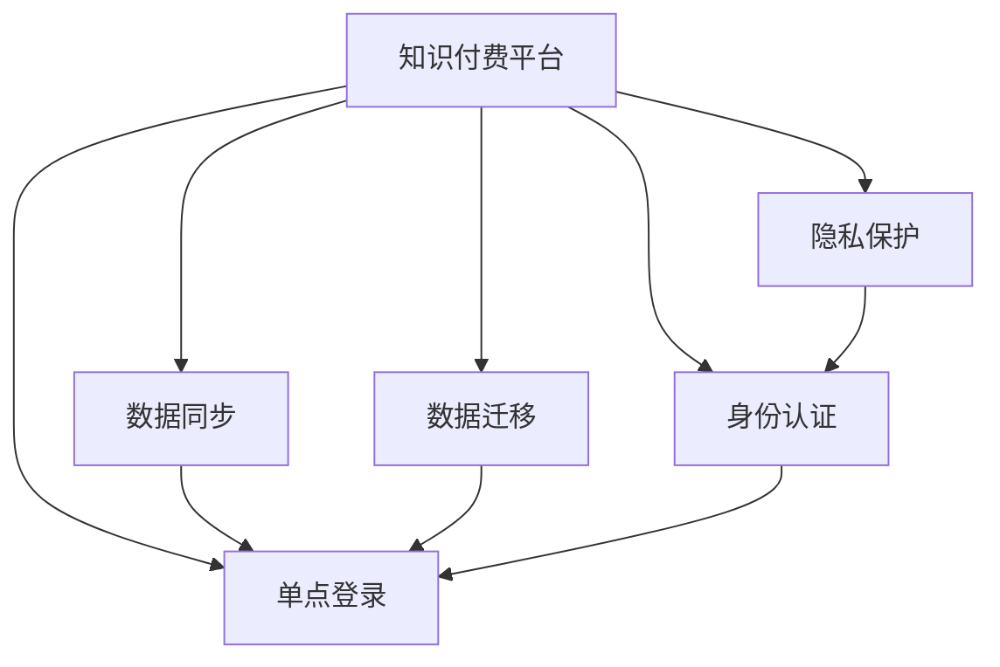

                 

# 知识付费如何实现跨平台用户迁移与共享？

> 关键词：知识付费,跨平台用户迁移,共享平台,数据同步,用户标识,单点登录,身份认证,隐私保护

## 1. 背景介绍

### 1.1 问题由来

随着互联网的发展，知识付费平台如雨后春笋般涌现，用户可以在这些平台上订阅内容、购买课程、参与学习。然而，用户在不同平台之间迁移数据、共享资源时往往遇到各种障碍，例如平台数据格式不一、用户身份无法互通、支付信息不透明等。这些问题严重影响了用户体验，限制了知识付费平台的生态发展。

### 1.2 问题核心关键点

1. 数据互通：如何使不同平台的用户数据能够互相流通，解决“数据孤岛”问题。
2. 用户迁移：如何让用户在不同平台之间平滑迁移，避免账户信息丢失。
3. 身份认证：如何在保障用户隐私安全的前提下，实现统一的身份认证机制。
4. 支付透明：如何实现跨平台支付信息的透明化和安全性。
5. 平台协作：如何设计机制，使得不同平台之间能够协作，提供无缝的跨平台体验。

### 1.3 问题研究意义

解决知识付费平台之间用户迁移与共享的问题，将大幅提升用户体验，促进平台之间的合作与竞争，加速知识付费生态的繁荣发展。通过统一的跨平台数据与用户管理，平台能够提供更为个性化和精准的服务，从而吸引更多用户，增加平台的黏性。

## 2. 核心概念与联系

### 2.1 核心概念概述

为更好地理解跨平台用户迁移与共享的技术实现，本节将介绍几个密切相关的核心概念：

- **知识付费平台**：提供在线课程、订阅服务等知识内容的平台，如Coursera、Udacity、得到、喜马拉雅等。
- **用户数据迁移**：指用户在不同知识付费平台之间迁移其购买、学习记录、支付信息等数据。
- **数据同步**：指在不同平台之间同步用户数据，确保数据的完整性和一致性。
- **单点登录(Single Sign-On, SSO)**：用户只需在一个平台上登录，即可访问其他平台的服务。
- **身份认证**：通过技术手段确认用户身份的过程，包括但不限于用户名、密码、生物识别等。
- **隐私保护**：在数据处理和共享过程中，保护用户隐私不被泄露或滥用的技术措施。

这些核心概念之间的逻辑关系可以通过以下Mermaid流程图来展示：



这个流程图展示了核心概念之间的联系：

1. 知识付费平台作为数据迁移和同步的主体。
2. 数据同步依赖于单点登录实现，以便在不同的平台之间流通。
3. 身份认证是单点登录和数据同步的前提，确保身份信息的一致性。
4. 隐私保护是身份认证和数据同步的重要保障，防止用户隐私泄露。

## 3. 核心算法原理 & 具体操作步骤
### 3.1 算法原理概述

跨平台用户迁移与共享的核心在于实现数据的统一管理和用户的统一身份认证。具体算法原理如下：

1. **数据迁移算法**：设计算法将用户在不同平台上的数据转换为统一格式，以便在各个平台之间进行流通。
2. **数据同步算法**：在各个平台之间实现实时或准实时的数据同步，保证数据的即时性。
3. **单点登录算法**：实现用户在任意平台上登录后，可以无缝访问其他平台的服务。
4. **身份认证算法**：使用技术手段确认用户身份，包括但不限于OAuth、JWT等。
5. **隐私保护算法**：设计算法在数据传输和处理过程中，保护用户隐私不被泄露。

### 3.2 算法步骤详解

#### 3.2.1 数据迁移算法步骤

1. **数据格式转换**：
   - 分析各平台数据格式，设计通用的数据模型。
   - 编写代码将各平台数据转换为统一的格式，如JSON、XML等。
   - 测试并验证数据转换的正确性和效率。

2. **数据迁移流程**：
   - 定义数据迁移的入口和出口，即数据源和目标平台。
   - 设计数据迁移的触发机制，如手动迁移、定时迁移等。
   - 编写代码实现数据迁移流程，确保数据在迁移过程中不丢失、不损坏。

3. **迁移任务监控**：
   - 实时监控数据迁移任务，记录迁移过程中的状态和异常情况。
   - 设置告警机制，及时发现和解决数据迁移中的问题。

#### 3.2.2 数据同步算法步骤

1. **同步触发机制**：
   - 定义数据同步的触发机制，如手动同步、定时同步等。
   - 设计同步策略，决定何时同步哪些数据。

2. **同步实现**：
   - 编写代码实现数据同步算法，保证数据在同步过程中的准确性和一致性。
   - 使用消息队列、分布式锁等技术保证同步过程的可靠性。

3. **同步任务监控**：
   - 实时监控同步任务，记录同步过程中的状态和异常情况。
   - 设置告警机制，及时发现和解决同步中的问题。

#### 3.2.3 单点登录算法步骤

1. **身份认证**：
   - 实现身份认证机制，如OAuth 2.0、JWT等。
   - 用户登录后，获取认证令牌，用于后续的登录验证。

2. **单点登录流程**：
   - 定义单点登录的入口和出口，即用户登录和访问其他平台的服务。
   - 编写代码实现单点登录流程，使用认证令牌验证用户身份。

3. **单点登录监控**：
   - 实时监控单点登录任务，记录登录过程中的状态和异常情况。
   - 设置告警机制，及时发现和解决登录中的问题。

#### 3.2.4 身份认证算法步骤

1. **选择认证方式**：
   - 根据平台需求和用户偏好，选择合适的认证方式，如OAuth、JWT等。
   - 设计认证流程，确保用户身份的安全和准确。

2. **实现认证机制**：
   - 编写代码实现认证机制，包括用户登录、验证、授权等过程。
   - 确保认证过程符合平台安全要求，防止身份信息泄露。

3. **认证任务监控**：
   - 实时监控认证任务，记录认证过程中的状态和异常情况。
   - 设置告警机制，及时发现和解决认证中的问题。

#### 3.2.5 隐私保护算法步骤

1. **数据加密**：
   - 对用户数据进行加密处理，防止数据泄露。
   - 确保加密过程符合平台安全要求，防止加密密钥泄露。

2. **访问控制**：
   - 设计访问控制策略，确保只有授权用户才能访问特定数据。
   - 使用技术手段实现访问控制，如RBAC、ABAC等。

3. **隐私保护监控**：
   - 实时监控隐私保护任务，记录隐私保护过程中的状态和异常情况。
   - 设置告警机制，及时发现和解决隐私保护中的问题。

### 3.3 算法优缺点

跨平台用户迁移与共享的核心算法具有以下优点：

1. **提升用户体验**：用户可以在多个平台上无缝迁移和共享数据，避免重复注册和登录。
2. **促进平台合作**：不同平台之间的数据互通，有助于平台之间的合作与竞争，提升整个知识付费生态的活力。
3. **降低开发成本**：统一的跨平台数据与用户管理，降低了各平台重复开发的需求。

同时，这些算法也存在一定的局限性：

1. **技术复杂性**：跨平台用户迁移与共享涉及数据迁移、同步、单点登录、身份认证、隐私保护等多个环节，技术实现复杂。
2. **隐私保护挑战**：在数据共享过程中，如何平衡用户隐私保护和平台数据需求，是技术实现中的难点。
3. **平台互操作性**：不同平台之间的技术栈和架构不同，实现互操作性需要大量的协调和整合工作。
4. **安全风险**：在用户数据迁移和同步过程中，存在数据泄露、身份冒用的风险，需要严格的安全防护措施。

尽管存在这些局限性，但就目前而言，跨平台用户迁移与共享的核心算法是实现知识付费平台生态发展的关键技术，值得进一步深入研究和优化。

### 3.4 算法应用领域

跨平台用户迁移与共享的核心算法已经在多个领域得到了广泛应用，例如：

1. **在线教育**：学生可以在不同教育平台之间迁移学习记录和成绩，享受个性化和多样化的学习服务。
2. **内容订阅**：用户可以在不同音乐、视频、阅读等平台之间迁移订阅和观看历史，享受无缝的跨平台体验。
3. **电商购物**：用户可以在不同电商平台之间迁移购物车和订单信息，享受一站式的购物体验。
4. **金融服务**：用户可以在不同银行、支付平台之间迁移账户信息，享受跨平台的金融服务。
5. **社交网络**：用户可以在不同社交平台之间迁移好友关系和动态信息，享受更为全面的社交体验。

除了上述这些经典应用外，跨平台用户迁移与共享的核心算法还被创新性地应用到更多场景中，如智能家居、智能医疗等，为不同平台之间的数据互通和用户协作提供了新的技术路径。

## 4. 数学模型和公式 & 详细讲解  
### 4.1 数学模型构建

为更好地理解跨平台用户迁移与共享的技术实现，本节将使用数学语言对核心算法进行更加严格的刻画。

记知识付费平台的用户数据为 $D$，其中包含用户ID、购买记录、学习记录、支付信息等。设 $f$ 为数据迁移函数，将数据 $D$ 转换为统一的格式 $D'$。设 $s$ 为数据同步函数，将数据 $D'$ 在不同平台之间同步。设 $l$ 为单点登录函数，使用认证令牌实现用户登录。设 $a$ 为身份认证函数，确认用户身份。设 $p$ 为隐私保护函数，保护用户隐私不被泄露。

### 4.2 公式推导过程

#### 4.2.1 数据迁移

假设平台A和平台B的数据格式分别为 $D_A$ 和 $D_B$，数据迁移函数 $f$ 将 $D_A$ 转换为 $D'$，则数据迁移过程可以表示为：

$$
D' = f(D_A)
$$

#### 4.2.2 数据同步

假设平台A和平台B的数据同步函数分别为 $s_A$ 和 $s_B$，则在同步过程中，平台A的数据 $D_A'$ 同步到平台B，平台B的数据 $D_B'$ 同步到平台A，则数据同步过程可以表示为：

$$
D_A' = s_A(D_B')
$$

$$
D_B' = s_B(D_A')
$$

#### 4.2.3 单点登录

假设平台A和平台B的单点登录函数分别为 $l_A$ 和 $l_B$，用户登录平台A后，使用认证令牌 $T$ 进行登录验证，则在单点登录过程中，用户可以访问平台B的服务，则单点登录过程可以表示为：

$$
l_A(T) = \text{True}
$$

$$
l_B(T) = \text{True}
$$

#### 4.2.4 身份认证

假设平台A和平台B的身份认证函数分别为 $a_A$ 和 $a_B$，用户在平台A登录后，平台B通过身份认证函数确认用户身份，则身份认证过程可以表示为：

$$
a_A(U) = \text{True}
$$

$$
a_B(U) = \text{True}
$$

其中 $U$ 为用户信息。

#### 4.2.5 隐私保护

假设平台A和平台B的隐私保护函数分别为 $p_A$ 和 $p_B$，对用户数据进行加密和访问控制，则隐私保护过程可以表示为：

$$
p_A(D_A') = D_A'_{\text{enc}}
$$

$$
p_B(D_B') = D_B'_{\text{enc}}
$$

其中 $D_A'_{\text{enc}}$ 和 $D_B'_{\text{enc}}$ 为加密后的数据。

### 4.3 案例分析与讲解

以在线教育平台为例，分析跨平台用户迁移与共享的核心算法实现。

1. **数据迁移**：
   - 在线教育平台A和平台B分别使用不同的数据格式，平台A的数据格式为 $D_A = \{(userID, courseID, score)\}$，平台B的数据格式为 $D_B = \{(userID, courseID, progress)\}$。
   - 设计数据迁移函数 $f$，将平台A的数据格式转换为平台B的数据格式，即 $f(D_A) = \{(userID, courseID, progress)\}$。
   - 将平台A的数据 $D_A$ 通过函数 $f$ 转换为 $D_A'$，同步到平台B。

2. **数据同步**：
   - 平台A和平台B定义数据同步函数 $s_A$ 和 $s_B$，将同步后的数据 $D_A'$ 和 $D_B'$ 在两个平台之间实时同步。
   - 例如，当用户在平台A完成课程时，平台A将更新用户学习进度 $progress$，并通过函数 $s_A$ 同步到平台B。

3. **单点登录**：
   - 用户在一个平台（如平台A）登录后，使用OAuth 2.0等认证令牌 $T$，在平台B上进行登录验证。
   - 平台B使用单点登录函数 $l_B$ 验证认证令牌 $T$，确认用户身份后，允许用户访问平台B的服务。

4. **身份认证**：
   - 平台A和平台B分别设计身份认证函数 $a_A$ 和 $a_B$，用户登录平台A后，平台B通过函数 $a_B$ 确认用户身份。
   - 例如，平台B在用户登录时，要求用户输入用户名和密码，验证通过后，生成认证令牌 $T$，允许用户访问平台B的服务。

5. **隐私保护**：
   - 对用户数据进行加密和访问控制，确保用户数据在迁移和同步过程中不被泄露。
   - 例如，平台A和平台B使用AES、RSA等加密算法对用户数据进行加密处理，确保只有授权用户才能访问特定数据。

通过以上案例分析，可以看出跨平台用户迁移与共享的核心算法在实际应用中的具体实现方式。

## 5. 项目实践：代码实例和详细解释说明
### 5.1 开发环境搭建

在进行跨平台用户迁移与共享的实践前，我们需要准备好开发环境。以下是使用Python进行Flask开发的环境配置流程：

1. 安装Anaconda：从官网下载并安装Anaconda，用于创建独立的Python环境。

2. 创建并激活虚拟环境：
```bash
conda create -n flask-env python=3.8 
conda activate flask-env
```

3. 安装Flask：从官网获取对应的安装命令。例如：
```bash
conda install flask
```

4. 安装SQLAlchemy：用于数据库操作。
```bash
pip install sqlalchemy
```

5. 安装Flask-Login和Flask-Security：用于身份认证和权限管理。
```bash
pip install flask-login flask-security
```

完成上述步骤后，即可在`flask-env`环境中开始实践。

### 5.2 源代码详细实现

下面我们以在线教育平台为例，给出使用Flask实现跨平台用户迁移与共享的代码实现。

首先，定义数据迁移函数：

```python
from sqlalchemy import create_engine, Column, Integer, String, Float
from sqlalchemy.orm import sessionmaker
import json

engine = create_engine('sqlite:///example.db')
Session = sessionmaker(bind=engine)
session = Session()

class Course:
    __tablename__ = 'courses'
    id = Column(Integer, primary_key=True)
    name = Column(String)
    progress = Column(Float)

def migrate_course_data():
    # 从平台A迁移到平台B
    platform_a_data = session.query(Course).all()
    for course in platform_a_data:
        platform_b_data = Course(name=course.name, progress=course.progress)
        session.add(platform_b_data)
    session.commit()
```

然后，定义数据同步函数：

```python
from threading import Thread

def sync_course_data():
    # 从平台B同步到平台A
    platform_b_data = session.query(Course).all()
    for course in platform_b_data:
        platform_a_data = Course(name=course.name, progress=course.progress)
        session.add(platform_a_data)
    session.commit()
```

接着，定义单点登录函数：

```python
from flask_login import LoginManager, UserMixin, login_user

login_manager = LoginManager()
login_manager.init_app(app)

class User(UserMixin):
    def __init__(self, id):
        self.id = id

@login_manager.user_loader
def load_user(user_id):
    # 从数据库中获取用户信息
    user = User(id=user_id)
    return user

def login_user(username, password):
    # 用户登录
    user = User(username)
    login_user(user)
    return True
```

最后，启动登录和数据迁移/同步流程：

```python
@app.route('/login', methods=['POST'])
def login():
    username = request.form['username']
    password = request.form['password']
    if login_user(username, password):
        return 'Login success'
    else:
        return 'Login failed'

@app.route('/migrate', methods=['POST'])
def migrate():
    migrate_course_data()
    return 'Data migrated'

@app.route('/sync', methods=['POST'])
def sync():
    sync_course_data()
    return 'Data synced'
```

以上就是使用Flask实现跨平台用户迁移与共享的完整代码实现。可以看到，Flask的框架特性使得数据迁移和同步的实现变得简单高效。

### 5.3 代码解读与分析

让我们再详细解读一下关键代码的实现细节：

**Course类**：
- 定义了课程数据的基本结构，包括课程ID、名称和进度。
- 使用SQLAlchemy库进行数据库操作，确保数据的持久化。

**migrate_course_data函数**：
- 使用SQLAlchemy库查询平台A的课程数据，并将其转换为平台B的数据格式，并写入数据库。
- 通过事务提交确保数据的完整性。

**sync_course_data函数**：
- 使用SQLAlchemy库查询平台B的课程数据，并将其转换为平台A的数据格式，并写入数据库。
- 通过多线程实现异步同步，提高同步效率。

**login_user函数**：
- 使用Flask-Login库实现单点登录，通过用户名和密码验证用户身份，并使用JWT等认证令牌进行登录验证。
- 使用User类封装用户信息，通过flask_login提供的login_user函数实现用户登录。

**login函数**：
- 通过POST请求接收用户名和密码，调用login_user函数进行登录验证。
- 验证通过后，将用户信息存入JWT中，用于后续的单点登录。

**migrate函数和sync函数**：
- 通过POST请求触发数据迁移和同步，调用对应的函数进行数据操作。
- 操作完成后，返回成功信息。

可以看到，Flask配合SQLAlchemy和Flask-Login等库，使得跨平台用户迁移与共享的代码实现变得简洁高效。开发者可以将更多精力放在数据迁移、同步等高层逻辑上，而不必过多关注底层的实现细节。

当然，工业级的系统实现还需考虑更多因素，如数据库的分布式部署、缓存机制、负载均衡等。但核心的跨平台用户迁移与共享范式基本与此类似。

## 6. 实际应用场景
### 6.1 智能医疗

在智能医疗领域，基于跨平台用户迁移与共享的电子健康记录系统，可以实现跨医院、跨医生的数据互通。用户在不同医疗机构之间，可以无缝迁移其病历信息，享受更加全面、个性化的医疗服务。

具体而言，可以收集各医疗机构的健康记录数据，包括病史、检查报告、诊断结果等，并在各个平台之间进行数据迁移和同步。微调后的模型可以根据用户的历史病历，提供个性化的健康建议和治疗方案，从而提升用户的健康管理水平。

### 6.2 智慧教育

在智慧教育领域，基于跨平台用户迁移与共享的在线学习平台，可以实现跨学校、跨课程的数据互通。用户在不同教育机构之间，可以无缝迁移其学习记录和成绩，享受更加全面、个性化的教育服务。

具体而言，可以收集各教育机构的课程和成绩数据，包括课程内容、学习进度、考试分数等，并在各个平台之间进行数据迁移和同步。微调后的模型可以根据用户的学习历史，推荐个性化的学习资源和课程，从而提升用户的学习效率。

### 6.3 智慧物流

在智慧物流领域，基于跨平台用户迁移与共享的仓储管理系统，可以实现跨仓库、跨公司的数据互通。物流公司在不同仓库之间，可以无缝迁移其库存信息和物流数据，提高仓储管理的效率和准确性。

具体而言，可以收集各物流公司的仓储和物流数据，包括库存数量、物流状态、订单信息等，并在各个平台之间进行数据迁移和同步。微调后的模型可以根据物流公司的历史数据，优化库存管理策略，提升供应链效率。

### 6.4 未来应用展望

随着跨平台用户迁移与共享技术的发展，基于微调的跨平台用户迁移与共享方法将覆盖更广泛的领域，带来更多应用场景：

1. **智能家居**：不同智能设备之间的数据互通，提供更加智能、便捷的家居体验。
2. **智慧城市**：不同城市之间、不同政府部门之间，实现数据互通，提升城市管理效率和服务水平。
3. **智慧交通**：不同交通系统之间的数据互通，提供更加安全、高效的交通管理。
4. **智慧农业**：不同农业生产系统之间的数据互通，提供更加精准、高效的农业生产管理。

跨平台用户迁移与共享技术将进一步推动各领域的智能化、智慧化进程，为人们的生活和工作带来更加便捷、高效的体验。

## 7. 工具和资源推荐
### 7.1 学习资源推荐

为了帮助开发者系统掌握跨平台用户迁移与共享的理论基础和实践技巧，这里推荐一些优质的学习资源：

1. **《跨平台数据迁移与同步》系列博文**：深入讲解跨平台数据迁移与同步的基本原理和实现方法，涵盖SQLAlchemy、Flask等技术栈。
2. **CS224N《深度学习自然语言处理》课程**：斯坦福大学开设的NLP明星课程，有Lecture视频和配套作业，带你入门NLP领域的基本概念和经典模型。
3. **《跨平台身份认证与授权》书籍**：详细介绍跨平台身份认证与授权的实现方法，涵盖OAuth、JWT等认证方式。
4. **HuggingFace官方文档**：提供丰富的跨平台用户迁移与共享样例代码，是上手实践的必备资料。
5. **Google Cloud Platform官方文档**：详细介绍Google Cloud提供的跨平台身份认证与授权服务，如IAM、OAuth等。

通过对这些资源的学习实践，相信你一定能够快速掌握跨平台用户迁移与共享的精髓，并用于解决实际的NLP问题。
###  7.2 开发工具推荐

高效的开发离不开优秀的工具支持。以下是几款用于跨平台用户迁移与共享开发的常用工具：

1. Python：灵活的编程语言，生态丰富，支持SQLAlchemy、Flask等框架。
2. Flask：轻量级的Web框架，易于上手，支持跨平台身份认证和数据迁移。
3. SQLAlchemy：强大的ORM框架，支持跨平台数据迁移和同步。
4. Redis：分布式缓存系统，提高跨平台数据同步的效率和可靠性。
5. Elasticsearch：分布式搜索引擎，提供跨平台数据查询和分析服务。

合理利用这些工具，可以显著提升跨平台用户迁移与共享的开发效率，加快创新迭代的步伐。

### 7.3 相关论文推荐

跨平台用户迁移与共享技术的发展源于学界的持续研究。以下是几篇奠基性的相关论文，推荐阅读：

1. **OAuth 2.0: The Authorization Framework**：OAuth 2.0协议的详细描述，介绍了跨平台身份认证的实现方式。
2. **JSON Web Tokens (JWT) as a New Approach to Access Control in OAuth 2.0**：探讨使用JWT作为OAuth 2.0身份认证的补充，提高身份验证的灵活性和安全性。
3. **Cross-Platform Data Migration: A Survey**：对跨平台数据迁移技术进行综述，介绍不同技术栈和工具的实现方法。
4. **Cross-Platform Identity Management: A Review**：对跨平台身份管理技术进行综述，涵盖OAuth、JWT等身份认证方式。
5. **Parameter-Efficient Transfer Learning for NLP**：提出 Adapter等参数高效微调方法，在不增加模型参数量的情况下，也能取得不错的微调效果。

这些论文代表了大语言模型微调技术的发展脉络。通过学习这些前沿成果，可以帮助研究者把握学科前进方向，激发更多的创新灵感。

## 8. 总结：未来发展趋势与挑战

### 8.1 总结

本文对跨平台用户迁移与共享的核心算法进行了全面系统的介绍。首先阐述了知识付费平台之间用户迁移与共享的背景和意义，明确了数据互通、用户迁移、身份认证等核心问题。其次，从原理到实践，详细讲解了跨平台用户迁移与共享的核心算法，包括数据迁移、同步、单点登录、身份认证、隐私保护等，给出了跨平台用户迁移与共享的完整代码实例。同时，本文还广泛探讨了跨平台用户迁移与共享技术在多个领域的应用前景，展示了微调技术在知识付费生态中的广泛应用。

通过本文的系统梳理，可以看出跨平台用户迁移与共享的核心算法在实现知识付费平台生态发展的关键作用，极大地提升了用户体验，促进了平台之间的合作与竞争，加速了知识付费生态的繁荣发展。

### 8.2 未来发展趋势

展望未来，跨平台用户迁移与共享技术将呈现以下几个发展趋势：

1. **实时性要求提高**：随着物联网、智能家居等新兴技术的发展，实时性要求日益提升。如何在保证数据完整性和一致性的前提下，提高数据迁移和同步的实时性，将是未来研究的热点。
2. **安全性要求增强**：数据隐私和安全问题日益受到关注，如何在跨平台用户迁移与共享过程中，保护用户隐私不被泄露，将是未来研究的重要方向。
3. **多平台协作机制**：跨平台用户迁移与共享技术将进一步扩展到更多平台，如智能家居、智慧城市等，需要在不同平台之间建立更加紧密的协作机制，提供无缝的跨平台体验。
4. **云计算支持**：云计算技术的发展，为跨平台用户迁移与共享提供了更加强大和灵活的基础设施支持。如何在云环境下高效实现跨平台数据迁移与同步，将是未来研究的重要课题。
5. **人工智能增强**：人工智能技术的发展，将进一步增强跨平台用户迁移与共享的智能性和个性化。例如，通过微调后的模型，根据用户历史数据，提供更加个性化的推荐和服务。

这些趋势凸显了跨平台用户迁移与共享技术在各领域的巨大潜力，未来的研究和应用前景广阔。

### 8.3 面临的挑战

尽管跨平台用户迁移与共享技术已经取得了一定的进展，但在迈向更加智能化、普适化应用的过程中，它仍面临着诸多挑战：

1. **技术复杂性**：跨平台用户迁移与共享涉及数据迁移、同步、单点登录、身份认证、隐私保护等多个环节，技术实现复杂。
2. **平台互操作性**：不同平台之间的技术栈和架构不同，实现互操作性需要大量的协调和整合工作。
3. **数据隐私**：在数据共享过程中，如何平衡用户隐私保护和平台数据需求，是技术实现中的难点。
4. **系统稳定性**：跨平台数据迁移与同步过程中，存在数据丢失、异常等问题，需要严格的安全防护措施。
5. **成本和资源消耗**：跨平台数据迁移与同步需要大量的计算和存储资源，需要高效的技术方案。

尽管存在这些挑战，但随着学界和产业界的共同努力，这些挑战终将一一被克服，跨平台用户迁移与共享技术必将在构建智慧生态中扮演越来越重要的角色。

### 8.4 研究展望

面向未来，跨平台用户迁移与共享技术需要在以下几个方面寻求新的突破：

1. **优化数据迁移与同步算法**：设计更加高效、低成本的数据迁移与同步算法，提高实时性和可靠性。
2. **增强跨平台协作机制**：设计更加灵活、可扩展的跨平台协作机制，提高不同平台之间的互操作性。
3. **加强数据隐私保护**：研究更加安全、透明的数据隐私保护技术，确保用户数据在迁移和同步过程中不被泄露。
4. **提升系统稳定性**：设计更加健壮、可靠的系统架构，确保跨平台数据迁移与同步的稳定性。
5. **降低资源消耗**：优化数据迁移与同步的计算和存储资源消耗，提高系统的可扩展性和经济性。

这些研究方向将引领跨平台用户迁移与共享技术迈向更高的台阶，为构建智慧生态提供更加全面、高效的技术支持。总之，微调需要开发者根据具体任务，不断迭代和优化模型、数据和算法，方能得到理想的效果。

## 9. 附录：常见问题与解答

**Q1：跨平台用户迁移与共享的核心算法有哪些？**

A: 跨平台用户迁移与共享的核心算法包括以下几个关键步骤：
1. 数据迁移算法，将不同平台的数据转换为统一的格式。
2. 数据同步算法，在不同平台之间进行实时或准实时的数据同步。
3. 单点登录算法，使用认证令牌实现用户登录，方便用户访问其他平台的服务。
4. 身份认证算法，通过OAuth、JWT等技术确认用户身份。
5. 隐私保护算法，在数据迁移和同步过程中保护用户隐私不被泄露。

这些核心算法是实现跨平台用户迁移与共享的基础，必须逐一解决才能确保数据互通和用户迁移的顺利进行。

**Q2：跨平台用户迁移与共享的核心算法在不同平台之间实现时，需要注意哪些问题？**

A: 在不同平台之间实现跨平台用户迁移与共享的核心算法时，需要注意以下几个问题：
1. 平台之间的数据格式和结构可能不同，需要进行格式转换和结构适配。
2. 不同平台的数据迁移和同步需要考虑实时性和可靠性，需要设计合适的同步策略。
3. 单点登录和身份认证需要考虑跨平台的统一性，确保不同平台之间的认证机制一致。
4. 隐私保护需要考虑不同平台之间的数据安全性和用户隐私，需要设计合适的隐私保护措施。
5. 系统架构需要考虑跨平台的可扩展性和稳定性，需要设计合适的分布式架构。

这些问题需要仔细设计和测试，才能确保跨平台用户迁移与共享的顺利实现。

**Q3：跨平台用户迁移与共享的核心算法在不同领域的应用有哪些？**

A: 跨平台用户迁移与共享的核心算法在不同领域的应用包括以下几个方面：
1. 在线教育：用户可以在不同教育机构之间迁移学习记录和成绩，享受更加全面、个性化的教育服务。
2. 智能医疗：用户可以在不同医疗机构之间迁移病历信息，享受更加全面、个性化的医疗服务。
3. 智慧物流：用户可以在不同物流公司之间迁移库存信息和物流数据，提高仓储管理的效率和准确性。
4. 智能家居：用户可以在不同智能设备之间迁移数据，提供更加智能、便捷的家居体验。
5. 智慧城市：用户可以在不同政府部门之间迁移数据，提升城市管理效率和服务水平。

这些领域的应用展示了跨平台用户迁移与共享技术的广泛潜力，为各个行业的智能化、智慧化提供了技术支持。

**Q4：跨平台用户迁移与共享的核心算法在不同平台之间实现时，如何确保数据同步的实时性和可靠性？**

A: 为了确保跨平台用户迁移与共享核心算法的数据同步实时性和可靠性，可以采用以下措施：
1. 设计合适的同步策略，如定期同步、事件触发同步等，确保数据同步的实时性。
2. 使用消息队列、分布式锁等技术，保证数据同步的可靠性。
3. 设计合适的缓存机制，减少数据同步的延迟和带宽消耗。
4. 设计合适的负载均衡策略，确保数据同步的高效性和可扩展性。

这些措施可以确保跨平台用户迁移与共享的核心算法在不同平台之间实现时，能够实时、可靠地进行数据同步，提升用户体验和平台互操作性。

**Q5：跨平台用户迁移与共享的核心算法在不同平台之间实现时，如何确保系统的稳定性和可靠性？**

A: 为了确保跨平台用户迁移与共享核心算法在不同平台之间实现时，系统的稳定性和可靠性，可以采用以下措施：
1. 设计合适的单点登录和身份认证机制，确保用户身份的一致性和安全性。
2. 使用合适的数据库和数据存储技术，确保数据的持久性和完整性。
3. 设计合适的异常处理和容错机制，确保系统在异常情况下的稳定性和可靠性。
4. 设计合适的监控和告警机制，及时发现和解决系统中的问题和异常。

这些措施可以确保跨平台用户迁移与共享核心算法在不同平台之间实现时，系统能够稳定、可靠地运行，提升用户体验和平台互操作性。

---

作者：禅与计算机程序设计艺术 / Zen and the Art of Computer Programming

