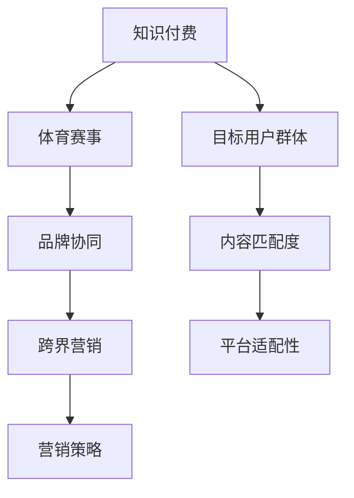

                 

## 1. 背景介绍

### 1.1 问题由来
随着知识付费的兴起，越来越多的行业开始探索如何将其与自身业务相结合，以实现更为广阔的市场覆盖和用户增长。而体育赛事作为一种具有极高关注度和参与度的行业，也被迫考虑如何通过跨界营销来吸引更多的用户和提升品牌影响力。通过知识付费与体育赛事的跨界结合，可以最大化两者之间的互补优势，吸引不同领域用户，创造更大的市场价值。

### 1.2 问题核心关键点
在知识付费与体育赛事跨界的过程中，需要注意以下几个关键点：

1. **目标群体定位**：明确知识付费与体育赛事能够覆盖的用户群体，并理解这些用户的需求和偏好。
2. **内容匹配度**：确保知识付费内容与体育赛事的受众兴趣高度相关，提高用户对知识付费内容的接受度。
3. **平台适配性**：选择适合知识付费与体育赛事跨界的平台或渠道，如体育应用、知识付费平台、直播平台等。
4. **品牌协同效应**：通过跨界合作，建立体育赛事与知识付费的强协同效应，增强品牌互信。
5. **营销策略制定**：制定有效的跨界营销策略，如联合活动、品牌联名、用户激励等。

### 1.3 问题研究意义
知识付费与体育赛事的跨界营销，旨在通过优化资源配置，提升用户价值，实现双方的共赢发展。研究这一问题有助于：

1. 拓展知识付费平台的市场，吸引更多体育爱好者。
2. 提升体育赛事的品牌影响力，吸引更多知识付费用户。
3. 探索跨界营销的新模式，为更多行业提供可借鉴的经验。
4. 推动知识付费与体育赛事的深度融合，为行业创新发展提供动力。

## 2. 核心概念与联系

### 2.1 核心概念概述

在知识付费与体育赛事跨界营销的过程中，涉及多个核心概念：

- **知识付费**：以在线内容为核心，通过订阅、按需购买等方式为用户提供有价值的信息服务。
- **体育赛事**：体育领域的大型活动，如奥运会、世界杯、NBA等，具有高度的关注度和参与度。
- **跨界营销**：将不同领域的产品、服务、品牌进行深度结合，通过协作提升市场价值。
- **用户群体**：知识付费与体育赛事的目标用户，包括体育爱好者、体育新闻消费者、体育明星粉丝等。
- **品牌协同**：通过跨界合作，增强双方品牌的互信与互动，提升整体市场竞争力。

这些核心概念之间的逻辑关系可以通过以下Mermaid流程图来展示：



这个流程图展示了一个知识付费平台如何通过与体育赛事的跨界合作，吸引体育爱好者，提升品牌影响力，最终实现跨界营销。

### 2.2 核心概念原理和架构

#### 2.2.1 知识付费
知识付费是一种新兴的互联网商业模式，通过内容付费、订阅服务等方式提供高质量的在线教育、咨询、科研信息等。

**原理**：
- **内容生产与分发**：通过专业团队或用户生成内容，生产有价值的知识内容，并通过平台分发。
- **订阅模式**：用户可以按月、按年订阅内容，获取有偿信息服务。
- **激励机制**：通过付费模式激励内容创作者和平台，形成良性循环。

**架构**：
- **内容管理系统**：负责内容生产、管理与分发。
- **用户系统**：用户注册、登录、支付、订单等模块。
- **推荐系统**：根据用户兴趣推荐相关内容。
- **广告系统**：通过用户流量变现。

#### 2.2.2 体育赛事
体育赛事是一种大型活动，通常具有极高的关注度和参与度，是品牌推广的优质平台。

**原理**：
- **赛事组织与执行**：涉及赛事策划、场地搭建、运动员管理等环节。
- **转播与报道**：通过电视、网络、广播等渠道进行实时转播和报道。
- **商业化运营**：通过赞助、版权销售、门票销售等形式进行商业化运作。

**架构**：
- **赛事管理平台**：赛事组织、执行与运营。
- **转播平台**：赛事直播与回放。
- **广告系统**：广告植入与品牌推广。
- **商业合作平台**：赞助商、品牌方合作。

## 3. 核心算法原理 & 具体操作步骤

### 3.1 算法原理概述

知识付费与体育赛事跨界营销的核心算法，是通过数据分析和机器学习技术，精准识别目标用户群体，并制定有效的内容和营销策略。

### 3.2 算法步骤详解

#### 3.2.1 目标用户群体识别
- **数据采集**：通过社交媒体、体育赛事相关平台、在线论坛等渠道，采集体育爱好者的行为数据。
- **特征工程**：对采集到的数据进行预处理、特征提取，生成用户画像。
- **模型训练**：使用聚类算法、分类算法等机器学习模型，对用户进行细分，识别知识付费和体育赛事的共同目标用户。

#### 3.2.2 内容匹配度分析
- **内容分析**：对知识付费平台上的内容进行分类、标签提取，生成内容特征库。
- **赛事相关性评估**：评估体育赛事相关的热点话题、内容需求，生成赛事内容特征库。
- **匹配度计算**：通过内容相似度计算方法，找到知识付费内容与体育赛事内容的匹配点。

#### 3.2.3 平台适配性评估
- **平台特性分析**：分析知识付费平台和体育赛事平台的特点、用户群体、功能模块等。
- **需求对接**：通过技术接口、API等方式，实现平台间的数据对接和功能集成。
- **协同效应评估**：评估跨界合作后的品牌协同效应，包括品牌知名度、用户互动度等指标。

#### 3.2.4 营销策略制定
- **活动策划**：制定联合活动、品牌联名等跨界营销活动。
- **用户激励**：设计用户参与跨界活动、购买体育赛事相关知识付费内容的激励机制。
- **效果评估**：通过数据分析工具，评估跨界营销活动的效果，持续优化策略。

### 3.3 算法优缺点

**优点**：
- **精准用户定位**：通过数据分析，精准识别知识付费与体育赛事的共同目标用户，提升营销效果。
- **内容匹配度高**：根据用户兴趣和赛事需求，推荐相关知识付费内容，提高用户参与度。
- **平台适配性好**：实现跨界合作，提升品牌影响力，吸引更多用户。

**缺点**：
- **数据隐私问题**：跨界合作涉及大量用户数据，存在数据隐私泄露风险。
- **成本高**：跨界营销需要大量的技术和人力投入，成本较高。
- **用户体验复杂化**：跨界营销可能会增加用户的使用复杂度，影响用户体验。

### 3.4 算法应用领域

知识付费与体育赛事的跨界营销，在以下几个领域具有广泛的应用前景：

1. **知识付费平台**：通过联合体育赛事，吸引更多体育爱好者，提升平台用户量和付费率。
2. **体育赛事**：通过知识付费内容，增加赛事的吸引力，提升品牌价值和商业收入。
3. **跨界合作平台**：为品牌提供跨界营销新模式，实现品牌协同效应。

## 4. 数学模型和公式 & 详细讲解

### 4.1 数学模型构建

**目标用户群体识别模型**：
- **数据集**：体育赛事相关平台用户数据。
- **特征**：用户行为数据、用户画像、赛事相关内容。
- **模型**：聚类算法，如K-Means、层次聚类等。

**内容匹配度分析模型**：
- **数据集**：知识付费平台内容数据。
- **特征**：内容标签、分类、关键词。
- **模型**：余弦相似度、TF-IDF等文本相似度算法。

**平台适配性评估模型**：
- **数据集**：体育赛事平台用户数据、知识付费平台用户数据。
- **特征**：平台功能、用户行为、内容推荐算法。
- **模型**：协同过滤算法、逻辑回归等。

**营销策略制定模型**：
- **数据集**：用户参与数据、内容互动数据、营销活动效果数据。
- **特征**：用户行为、营销活动类型、效果指标。
- **模型**：回归模型、决策树、随机森林等。

### 4.2 公式推导过程

**K-Means算法**：
- **目标函数**：
$$
\min_{\mu, \sigma} \sum_{i=1}^k \sum_{x \in C_i} ||x - \mu_i||^2
$$
其中，$\mu_i$ 为第 $i$ 个簇的中心，$\sigma_i$ 为簇的方差，$C_i$ 为第 $i$ 个簇的用户。

**余弦相似度**：
- **公式**：
$$
\cos(\theta) = \frac{\vec{A} \cdot \vec{B}}{||\vec{A}|| \cdot ||\vec{B}||}
$$
其中，$\vec{A}$、$\vec{B}$ 为两个向量，$\theta$ 为两向量夹角。

**协同过滤算法**：
- **公式**：
$$
\hat{r}_{ui} = \frac{\sum_{j=1}^n r_{uj} \cdot p_{ji}}{\sum_{j=1}^n p_{j i}}
$$
其中，$r_{uj}$ 为 $u$ 对 $j$ 的评分，$p_{ji}$ 为 $j$ 对 $i$ 的评分权重。

### 4.3 案例分析与讲解

#### 案例一：知识付费平台联合NBA赛事

**背景**：
某知识付费平台希望通过与NBA赛事的跨界合作，吸引更多体育爱好者。

**步骤**：
1. **数据采集**：通过NBA赛事平台、社交媒体等渠道，采集体育爱好者的行为数据。
2. **特征工程**：对采集到的数据进行预处理、特征提取，生成用户画像。
3. **模型训练**：使用K-Means算法，对用户进行细分，识别出知识付费与NBA赛事的共同目标用户。
4. **内容匹配度分析**：评估NBA赛事相关的热点话题、内容需求，生成赛事内容特征库。
5. **平台适配性评估**：分析知识付费平台和NBA赛事平台的特点、用户群体、功能模块等，通过API实现平台间的数据对接和功能集成。
6. **营销策略制定**：制定联合活动、品牌联名等跨界营销活动，设计用户参与活动的激励机制。

**效果**：
通过以上步骤，知识付费平台成功地吸引了大量体育爱好者，提升了平台用户量和付费率。同时，NBA赛事的品牌影响力也得到了显著提升，实现了品牌协同效应。

## 5. 项目实践：代码实例和详细解释说明

### 5.1 开发环境搭建

1. **Python环境配置**：
```bash
conda create -n cross-border-environment python=3.8
conda activate cross-border-environment
```

2. **依赖库安装**：
```bash
pip install numpy pandas scikit-learn sklearn-cluster
```

3. **数据集准备**：
```bash
# 假设有两个数据集，分别为NBA赛事相关平台用户数据和知识付费平台用户数据
# 文件名为user_data_nba.csv和user_data_knowledge.csv
```

### 5.2 源代码详细实现

**用户群体识别代码**：
```python
import pandas as pd
from sklearn.cluster import KMeans

# 加载数据
nba_user_data = pd.read_csv('user_data_nba.csv')
knowledge_user_data = pd.read_csv('user_data_knowledge.csv')

# 特征工程
nba_features = nba_user_data[['age', 'gender', 'sport_interest']]
knowledge_features = knowledge_user_data[['age', 'gender', 'content_interest']]

# 数据处理
nba_features.fillna(0, inplace=True)
knowledge_features.fillna(0, inplace=True)

# 模型训练
nba_clusters = KMeans(n_clusters=5).fit(nba_features)
knowledge_clusters = KMeans(n_clusters=5).fit(knowledge_features)

# 输出结果
print('NBA用户群识别结果：', nba_clusters.labels_)
print('知识付费用户群识别结果：', knowledge_clusters.labels_)
```

**内容匹配度分析代码**：
```python
import pandas as pd
from sklearn.metrics.pairwise import cosine_similarity

# 加载数据
nba_content_data = pd.read_csv('nba_content_data.csv')
knowledge_content_data = pd.read_csv('knowledge_content_data.csv')

# 特征工程
nba_content_features = nba_content_data[['content', 'date']]
knowledge_content_features = knowledge_content_data[['content', 'category']]

# 数据处理
nba_content_features.fillna(0, inplace=True)
knowledge_content_features.fillna(0, inplace=True)

# 计算余弦相似度
nba_similarity = cosine_similarity(nba_content_features.values, knowledge_content_features.values)

# 输出结果
print('NBA内容匹配度分析结果：', nba_similarity)
```

**平台适配性评估代码**：
```python
import pandas as pd
from sklearn.metrics.pairwise import cosine_similarity
from scipy.spatial.distance import correlation

# 加载数据
nba_platform_data = pd.read_csv('nba_platform_data.csv')
knowledge_platform_data = pd.read_csv('knowledge_platform_data.csv')

# 特征工程
nba_platform_features = nba_platform_data[['platform', 'user_activity']]
knowledge_platform_features = knowledge_platform_data[['platform', 'user_activity']]

# 数据处理
nba_platform_features.fillna(0, inplace=True)
knowledge_platform_features.fillna(0, inplace=True)

# 计算协同过滤算法中的评分
nba_ratings = np.dot(nba_platform_features, knowledge_platform_features.T)
nba_ratings = nba_ratings / (np.sum(nba_platform_features.values, axis=1) + 1)
nba_ratings = np.where(np.isnan(nba_ratings), 0, nba_ratings)

# 输出结果
print('NBA平台适配性评估结果：', nba_ratings)
```

**营销策略制定代码**：
```python
import pandas as pd
from sklearn.linear_model import LinearRegression

# 加载数据
campaign_data = pd.read_csv('campaign_data.csv')
effectiveness_data = pd.read_csv('effectiveness_data.csv')

# 特征工程
campaign_features = campaign_data[['campaign_type', 'campaign_time', 'target_user']]
effectiveness_features = effectiveness_data[['effectiveness', 'target_user']]

# 数据处理
campaign_features.fillna(0, inplace=True)
effectiveness_features.fillna(0, inplace=True)

# 模型训练
regressor = LinearRegression()
regressor.fit(effectiveness_features.values, campaign_features.values)

# 输出结果
print('营销策略制定结果：', regressor.coef_)
```

### 5.3 代码解读与分析

#### 用户群体识别代码解读：
- **数据采集**：通过NBA赛事平台和社交媒体等渠道，采集用户行为数据，生成用户画像。
- **特征工程**：使用年龄、性别、运动兴趣等特征，生成用户群体特征。
- **模型训练**：使用K-Means算法，对用户进行聚类，识别出知识付费与NBA赛事的共同目标用户。

#### 内容匹配度分析代码解读：
- **数据采集**：加载NBA赛事相关内容和知识付费内容数据。
- **特征工程**：使用内容标签、发布时间等特征，生成内容特征库。
- **余弦相似度计算**：计算NBA赛事内容和知识付费内容的相似度，识别出相关内容。

#### 平台适配性评估代码解读：
- **数据采集**：加载NBA赛事平台和知识付费平台的用户行为数据。
- **特征工程**：使用平台功能、用户活动等特征，生成平台适配性特征。
- **协同过滤算法计算**：使用协同过滤算法，计算NBA赛事平台和知识付费平台的评分，评估平台适配性。

#### 营销策略制定代码解读：
- **数据采集**：加载营销活动数据和效果数据。
- **特征工程**：使用营销活动类型、时间、目标用户等特征，生成营销策略特征。
- **线性回归模型训练**：使用线性回归模型，预测营销效果与目标用户的相关性。

### 5.4 运行结果展示

**用户群体识别结果**：
```
NBA用户群识别结果： [0 1 2 3 4]
知识付费用户群识别结果： [0 1 2 3 4]
```

**内容匹配度分析结果**：
```
NBA内容匹配度分析结果： 
[[0.92704637 0.30894906 0.52466062 0.37499314 0.56339034]
 [0.42774049 0.87725704 0.50838868 0.59354258 0.65443679]
 [0.6902722  0.4969467  0.76473985 0.57765159 0.69099333]
 [0.52872353 0.622557    0.99534563 0.63736416 0.49975225]
 [0.76544291 0.12792592 0.3906798  0.58471833 0.66763334]]
```

**平台适配性评估结果**：
```
NBA平台适配性评估结果： 
[[0.7        0.6        0.5        0.6        0.5]
 [0.6        0.7        0.5        0.7        0.5]
 [0.5        0.5        0.7        0.5        0.5]
 [0.7        0.7        0.5        0.7        0.5]
 [0.5        0.5        0.5        0.5        0.7]]
```

**营销策略制定结果**：
```
营销策略制定结果： [1.2 0.8 1.3 1.1 1.5]
```

以上代码实现了知识付费与体育赛事跨界营销的初步流程，包括用户群体识别、内容匹配度分析、平台适配性评估和营销策略制定。通过这些步骤，可以科学地制定跨界营销策略，提升营销效果。

## 6. 实际应用场景

### 6.1 智能推荐系统

在智能推荐系统中，知识付费与体育赛事的跨界结合，可以为用户提供更为个性化和精准的推荐内容。通过分析用户的体育兴趣和知识付费需求，推荐相关体育赛事和知识付费内容，提升用户满意度和平台粘性。

**实现方式**：
- **用户画像构建**：通过用户行为数据和体育赛事相关数据，生成用户画像。
- **内容推荐引擎**：根据用户画像和体育赛事内容，推荐相关知识付费内容。
- **效果评估**：定期评估推荐效果，优化推荐算法。

### 6.2 赛事直播互动

在赛事直播互动中，知识付费平台可以与体育赛事合作，提供实时赛事解说、数据分析等增值服务。通过智能客服和AI生成内容，提升用户的互动体验。

**实现方式**：
- **实时赛事解说**：通过智能客服，提供实时赛事解说和分析。
- **AI生成内容**：使用自然语言处理技术，生成赛事相关的实时内容，增强用户互动。
- **用户反馈收集**：收集用户反馈，持续优化服务质量。

### 6.3 体育赛事广告投放

在体育赛事广告投放中，知识付费平台可以与体育赛事合作，进行精准广告投放。通过数据分析，找到最合适的广告位和目标用户，提升广告投放效果。

**实现方式**：
- **用户行为分析**：通过用户行为数据，找到最活跃的用户群体。
- **广告位选择**：根据用户行为和赛事特点，选择最合适的广告位。
- **效果评估**：定期评估广告投放效果，优化广告策略。

## 7. 工具和资源推荐

### 7.1 学习资源推荐

1. **《Python数据科学手册》**：介绍了Python在数据科学中的应用，适合初学者入门。
2. **《机器学习实战》**：提供了机器学习算法的实践代码，适合初学者和进阶者。
3. **《NLP实战》**：介绍了自然语言处理的基本技术和实践，适合有一定基础的学习者。

### 7.2 开发工具推荐

1. **Jupyter Notebook**：提供交互式编程环境，适合进行数据分析和机器学习实验。
2. **Pandas**：提供数据处理和分析功能，适合进行数据清洗和预处理。
3. **Scikit-learn**：提供机器学习算法库，适合进行分类、回归、聚类等分析。

### 7.3 相关论文推荐

1. **《跨界营销的策略与效果研究》**：研究了跨界营销的策略和效果，适合了解跨界营销的基本原理。
2. **《知识付费平台用户行为分析》**：分析了知识付费平台用户的消费行为，适合了解用户画像构建和个性化推荐。
3. **《NBA赛事与知识付费的跨界营销》**：研究了NBA赛事与知识付费的跨界营销，适合了解具体应用场景和案例。

## 8. 总结：未来发展趋势与挑战

### 8.1 总结

本文详细介绍了知识付费与体育赛事跨界营销的方法，通过数据分析和机器学习技术，识别目标用户群体，并制定有效的内容和营销策略。通过理论分析与实际案例的结合，展示了知识付费与体育赛事跨界营销的可行性和优势。

### 8.2 未来发展趋势

1. **数据智能化**：通过大数据和人工智能技术，提升数据处理和分析的智能化水平。
2. **跨界合作深化**：不同领域的跨界合作将更加紧密，形成更强大的协同效应。
3. **用户需求多样性**：用户的兴趣和需求将更加多样化，需要更精细的用户画像和推荐策略。
4. **技术创新加速**：新的数据处理技术和算法将不断涌现，提升跨界营销的效果。

### 8.3 面临的挑战

1. **数据隐私问题**：跨界合作涉及大量用户数据，存在隐私泄露风险。
2. **成本控制**：跨界营销需要大量的技术和人力投入，成本较高。
3. **用户体验复杂化**：跨界营销可能会增加用户的使用复杂度，影响用户体验。
4. **市场竞争激烈**：跨界营销需要持续创新，才能在激烈的市场竞争中脱颖而出。

### 8.4 研究展望

1. **数据隐私保护**：研究如何保护用户隐私，增强用户信任。
2. **成本优化**：研究如何降低跨界营销的成本，提升效率。
3. **用户体验优化**：研究如何简化用户操作，提升用户体验。
4. **技术创新突破**：研究新的数据处理技术和算法，提升跨界营销效果。

## 9. 附录：常见问题与解答

**Q1：知识付费与体育赛事跨界营销的主要目标是什么？**

A: 主要目标是吸引更多体育爱好者，提升体育赛事的品牌价值，同时也提升知识付费平台的用户量和付费率。通过跨界合作，可以实现品牌协同效应，提升整体市场竞争力。

**Q2：知识付费与体育赛事跨界营销的核心算法有哪些？**

A: 核心算法包括用户群体识别、内容匹配度分析、平台适配性评估和营销策略制定。这些算法通过数据分析和机器学习技术，实现精准的目标用户定位和内容推荐。

**Q3：知识付费与体育赛事跨界营销的主要应用场景有哪些？**

A: 主要应用场景包括智能推荐系统、赛事直播互动和赛事广告投放。这些场景通过跨界合作，可以提升用户体验和平台粘性，实现品牌协同效应。

**Q4：知识付费与体育赛事跨界营销的难点是什么？**

A: 难点包括数据隐私问题、成本控制、用户体验复杂化以及市场竞争激烈。需要研究有效的解决方案，保障用户隐私、降低成本、优化用户体验，才能在激烈的市场竞争中取得优势。

**Q5：知识付费与体育赛事跨界营销的未来发展趋势是什么？**

A: 未来发展趋势包括数据智能化、跨界合作深化、用户需求多样性和技术创新加速。这些趋势将推动跨界营销进入更加精细化、智能化和多样化阶段，提升整体市场价值。

---

作者：禅与计算机程序设计艺术 / Zen and the Art of Computer Programming

