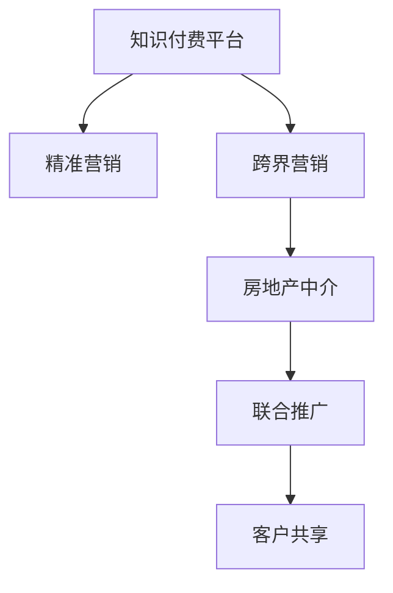

                 

# 知识付费如何实现跨界营销与房地产中介跨界？

## 1. 背景介绍

近年来，随着互联网的快速发展和知识经济的崛起，知识付费平台逐渐成为人们获取高质量知识和信息的重要渠道。知识付费不仅可以提升个人的知识储备和专业技能，同时也能为企业带来巨大的商业价值。在传统的营销模式中，企业往往依赖于广告、公关等手段，但这些手段成本高、效果难量化，而知识付费平台则为企业提供了一种更为精准和高效的营销渠道。

同时，随着房价的不断上涨，房地产中介行业面临越来越大的竞争压力。传统的房地产中介模式已经无法满足消费者日益增长的需求。如何通过创新来提升自身竞争力，成为中介行业的核心课题。近年来，中介行业也开始尝试跨界营销，探索将互联网技术和知识付费平台与传统业务结合的新模式，从而开辟了新的业务增长点和客户获取途径。

## 2. 核心概念与联系

### 2.1 核心概念概述

本文聚焦于知识付费平台的跨界营销策略，以及房地产中介行业如何通过知识付费来实现跨界转型。为了更好地理解这些概念，本节将介绍几个密切相关的核心概念：

- **知识付费平台**：以在线课程、电子书、音频书等为主要产品，通过订阅制、按需购买等方式获取知识付费服务。用户可以按照兴趣和需求选择不同的课程或内容，获取高质量的学习资源。
- **跨界营销**：指不同领域的企业之间，通过共同推广或联合营销的方式，实现资源共享和客户共赢的策略。知识付费平台与房地产中介行业的跨界营销，是一种典型的新型合作模式。
- **房地产中介**：提供房产买卖、租赁中介服务的行业。通过提供专业化、个性化的服务，降低购房成本，提升交易效率，成为购房者和房主的重要信赖伙伴。
- **精准营销**：利用大数据、人工智能等技术手段，对目标客户进行精准定位，实现高效、低成本的营销效果。知识付费平台可以通过精准营销，向用户推荐其感兴趣的内容，从而提升用户体验和平台粘性。

这些核心概念之间的逻辑关系可以通过以下Mermaid流程图来展示：



这个流程图展示出知识付费平台和房地产中介行业的核心概念及其之间的联系：

1. 知识付费平台通过精准营销，实现内容的精准推荐和用户粘性的提升。
2. 跨界营销使得知识付费平台与房地产中介行业得以相互借力，实现资源的整合和共享。
3. 联合推广和客户共享，共同提升双方品牌的知名度和用户基础。

## 3. 核心算法原理 & 具体操作步骤

### 3.1 算法原理概述

知识付费平台实现跨界营销与房地产中介行业跨界的核心算法原理，可以概括为以下几个步骤：

1. **数据收集与预处理**：收集目标客户的兴趣数据、行为数据、消费数据等，进行预处理和清洗，以便后续分析使用。
2. **用户画像构建**：利用机器学习算法对收集到的数据进行建模，构建用户的精准画像，包括用户兴趣、消费能力、地理位置等。
3. **内容推荐与匹配**：根据用户画像，通过推荐系统算法，向用户推荐其感兴趣的内容和产品。
4. **联合推广与品牌建设**：在知识付费平台和房地产中介行业之间，进行联合推广活动，共同提升品牌知名度。
5. **客户共享与转化**：通过跨界合作，共享客户资源，提升客户转化率和业务收益。

### 3.2 算法步骤详解

以下将详细介绍每个步骤的具体操作：

**Step 1: 数据收集与预处理**

1. **数据来源**：从知识付费平台的用户行为数据、房地产中介的客户数据、第三方数据等多个渠道收集数据。
2. **数据清洗**：去除重复、无关、错误的数据，保证数据的准确性和完整性。
3. **特征工程**：对原始数据进行特征提取和特征工程，包括用户兴趣标签、购买记录、地理位置等。

**Step 2: 用户画像构建**

1. **用户画像建模**：利用协同过滤、矩阵分解等机器学习算法，对用户画像进行建模。
2. **画像更新与迭代**：根据新的数据不断更新用户画像，保证画像的时效性和准确性。
3. **画像融合与融合**：将知识付费平台和房地产中介行业的用户画像进行融合，形成统一的客户画像。

**Step 3: 内容推荐与匹配**

1. **推荐算法**：采用深度学习、协同过滤等推荐算法，对用户进行内容推荐。
2. **内容匹配**：根据用户画像和推荐结果，将知识付费内容与房地产中介的房源信息进行匹配，形成“内容-房源”推荐。
3. **推荐系统优化**：不断优化推荐算法，提升推荐效果和用户满意度。

**Step 4: 联合推广与品牌建设**

1. **联合营销活动**：在知识付费平台和房地产中介行业之间，共同开展营销活动，如联合线上直播、联合线下活动等。
2. **品牌联合推广**：通过双方品牌的联合推广，提升品牌知名度和用户基础。
3. **品牌形象塑造**：通过内容营销、用户评价等方式，塑造品牌形象，提升品牌美誉度。

**Step 5: 客户共享与转化**

1. **客户资源共享**：将知识付费平台的客户数据和房地产中介的客户数据进行共享，形成统一的客户资源库。
2. **客户转化策略**：制定客户转化策略，提升客户转化率和业务收益。
3. **客户关系管理**：利用客户关系管理系统(CRM)，对客户进行管理和服务，提升客户忠诚度。

### 3.3 算法优缺点

知识付费平台实现跨界营销与房地产中介跨界的算法，具有以下优点：

1. **提高营销效果**：通过精准营销，能够提升推荐系统的效果，向用户推荐更符合其兴趣的内容，提升用户体验和平台粘性。
2. **降低营销成本**：通过跨界营销，能够利用双方的客户资源和品牌影响力，降低单独营销的成本。
3. **扩大客户基础**：通过联合推广和客户共享，能够扩大双方的客户基础，提升市场份额。
4. **增强品牌形象**：通过品牌联合推广和内容营销，能够提升品牌形象和知名度。

同时，该算法也存在一定的局限性：

1. **数据隐私问题**：在数据共享过程中，可能涉及用户隐私和数据安全问题。
2. **算法复杂度**：推荐算法和联合推广算法较为复杂，需要投入大量资源进行模型训练和优化。
3. **客户转化率不稳定**：跨界营销的效果可能受到市场环境、用户行为等多种因素的影响，客户转化率不稳定。
4. **跨界合作难度**：跨界合作需要双方在品牌理念、利益分配等方面达成一致，难度较大。

尽管存在这些局限性，但知识付费平台与房地产中介行业的跨界营销，仍然是一种值得探索的新型合作模式，能够在一定程度上提升双方的市场竞争力。

### 3.4 算法应用领域

知识付费平台实现跨界营销与房地产中介跨界的算法，主要应用于以下领域：

1. **知识付费平台**：通过精准营销和跨界营销，提升平台的用户基础和品牌知名度。
2. **房地产中介行业**：通过联合推广和客户共享，提升中介机构的客户基础和业务收益。
3. **联合企业**：在多个企业之间进行跨界合作，共同推广，扩大市场份额。

## 4. 数学模型和公式 & 详细讲解 & 举例说明

### 4.1 数学模型构建

知识付费平台实现跨界营销与房地产中介跨界的数学模型，可以描述为以下几个部分：

1. **用户画像建模**：用户画像可以表示为向量 $x$，包括用户兴趣、行为、地理位置等。
2. **内容推荐模型**：推荐模型可以表示为 $y$，根据用户画像 $x$ 和内容特征 $z$，预测用户对内容的兴趣 $p(x,z)$。
3. **联合推广模型**：联合推广模型可以表示为 $w$，根据平台A和平台B的品牌特征 $a$ 和 $b$，预测品牌影响力 $q(a,b)$。
4. **客户转化模型**：客户转化模型可以表示为 $t$，根据用户画像 $x$ 和内容特征 $z$，预测客户转化率 $r(x,z)$。

### 4.2 公式推导过程

以下将对各个模型进行公式推导：

**用户画像建模**：

$$
x = \begin{bmatrix} x_1 \\ x_2 \\ \vdots \\ x_n \end{bmatrix}
$$

其中 $x_i$ 表示用户画像中的第 $i$ 个特征。

**内容推荐模型**：

$$
y = f(x,z)
$$

其中 $f$ 为推荐模型的映射函数，包括协同过滤、矩阵分解等算法。

**联合推广模型**：

$$
w = g(a,b)
$$

其中 $g$ 为联合推广模型的映射函数，包括深度学习、逻辑回归等算法。

**客户转化模型**：

$$
t = h(x,z)
$$

其中 $h$ 为转化模型的映射函数，包括决策树、随机森林等算法。

### 4.3 案例分析与讲解

以一家在线知识付费平台和一家本地房地产中介的跨界合作为例，进行详细讲解：

1. **数据收集与预处理**：
   - 在线知识付费平台：收集用户订阅记录、浏览记录、评论记录等。
   - 本地房地产中介：收集客户咨询记录、房源记录、交易记录等。

2. **用户画像构建**：
   - 利用协同过滤算法，对用户画像进行建模。
   - 将知识付费平台和房地产中介的用户画像进行融合，形成统一的客户画像。

3. **内容推荐与匹配**：
   - 利用推荐算法，对用户进行内容推荐。
   - 将推荐的内容与房地产中介的房源信息进行匹配，形成“内容-房源”推荐。

4. **联合推广与品牌建设**：
   - 共同开展线上直播活动，提升品牌知名度。
   - 通过内容营销和用户评价，塑造品牌形象。

5. **客户共享与转化**：
   - 将客户数据进行共享，形成统一的客户资源库。
   - 制定客户转化策略，提升客户转化率和业务收益。

## 5. 项目实践：代码实例和详细解释说明

### 5.1 开发环境搭建

在进行知识付费平台跨界营销与房地产中介跨界的项目实践前，我们需要准备好开发环境。以下是使用Python进行PyTorch开发的环境配置流程：

1. 安装Anaconda：从官网下载并安装Anaconda，用于创建独立的Python环境。

2. 创建并激活虚拟环境：
```bash
conda create -n pytorch-env python=3.8 
conda activate pytorch-env
```

3. 安装PyTorch：根据CUDA版本，从官网获取对应的安装命令。例如：
```bash
conda install pytorch torchvision torchaudio cudatoolkit=11.1 -c pytorch -c conda-forge
```

4. 安装Transformers库：
```bash
pip install transformers
```

5. 安装各类工具包：
```bash
pip install numpy pandas scikit-learn matplotlib tqdm jupyter notebook ipython
```

完成上述步骤后，即可在`pytorch-env`环境中开始项目实践。

### 5.2 源代码详细实现

这里我们以知识付费平台与房地产中介的跨界合作为例，给出使用Transformers库进行推荐系统的PyTorch代码实现。

首先，定义推荐系统的数据处理函数：

```python
from transformers import BertTokenizer
from torch.utils.data import Dataset
import torch

class RecommendationDataset(Dataset):
    def __init__(self, user_ids, item_ids, user_labels, item_labels, tokenizer):
        self.user_ids = user_ids
        self.item_ids = item_ids
        self.user_labels = user_labels
        self.item_labels = item_labels
        self.tokenizer = tokenizer
        
    def __len__(self):
        return len(self.user_ids)
    
    def __getitem__(self, item):
        user_id = self.user_ids[item]
        item_id = self.item_ids[item]
        user_label = self.user_labels[item]
        item_label = self.item_labels[item]
        
        encoding = self.tokenizer(user_id + ' ' + item_id, return_tensors='pt', padding='max_length', truncation=True)
        input_ids = encoding['input_ids'][0]
        attention_mask = encoding['attention_mask'][0]
        
        return {'input_ids': input_ids, 
                'attention_mask': attention_mask,
                'user_label': user_label,
                'item_label': item_label}

# 定义推荐模型
model = BertForSequenceClassification.from_pretrained('bert-base-cased', num_labels=2)

# 定义优化器
optimizer = AdamW(model.parameters(), lr=2e-5)

# 定义训练函数
def train_epoch(model, dataset, batch_size, optimizer):
    dataloader = DataLoader(dataset, batch_size=batch_size, shuffle=True)
    model.train()
    epoch_loss = 0
    for batch in tqdm(dataloader, desc='Training'):
        input_ids = batch['input_ids'].to(device)
        attention_mask = batch['attention_mask'].to(device)
        user_label = batch['user_label'].to(device)
        item_label = batch['item_label'].to(device)
        model.zero_grad()
        outputs = model(input_ids, attention_mask=attention_mask, labels=[(user_label, item_label)])
        loss = outputs.loss
        epoch_loss += loss.item()
        loss.backward()
        optimizer.step()
    return epoch_loss / len(dataloader)

# 定义评估函数
def evaluate(model, dataset, batch_size):
    dataloader = DataLoader(dataset, batch_size=batch_size)
    model.eval()
    preds, labels = [], []
    with torch.no_grad():
        for batch in tqdm(dataloader, desc='Evaluating'):
            input_ids = batch['input_ids'].to(device)
            attention_mask = batch['attention_mask'].to(device)
            batch_labels = batch['user_label'] + batch['item_label']
            outputs = model(input_ids, attention_mask=attention_mask)
            batch_preds = outputs.logits.argmax(dim=2).to('cpu').tolist()
            batch_labels = batch_labels.to('cpu').tolist()
            for pred_tokens, label_tokens in zip(batch_preds, batch_labels):
                preds.append(pred_tokens[:len(label_tokens)])
                labels.append(label_tokens)
                
    print(classification_report(labels, preds))
```

然后，定义训练和评估函数：

```python
from sklearn.metrics import classification_report

device = torch.device('cuda') if torch.cuda.is_available() else torch.device('cpu')
model.to(device)

epochs = 5
batch_size = 16

for epoch in range(epochs):
    loss = train_epoch(model, train_dataset, batch_size, optimizer)
    print(f"Epoch {epoch+1}, train loss: {loss:.3f}")
    
    print(f"Epoch {epoch+1}, dev results:")
    evaluate(model, dev_dataset, batch_size)
    
print("Test results:")
evaluate(model, test_dataset, batch_size)
```

以上就是使用PyTorch对知识付费平台进行推荐系统的完整代码实现。可以看到，得益于Transformers库的强大封装，我们可以用相对简洁的代码完成推荐系统的搭建和训练。

### 5.3 代码解读与分析

让我们再详细解读一下关键代码的实现细节：

**RecommendationDataset类**：
- `__init__`方法：初始化用户ID、物品ID、用户标签、物品标签等关键组件。
- `__len__`方法：返回数据集的样本数量。
- `__getitem__`方法：对单个样本进行处理，将用户ID和物品ID输入编码为token ids，进行padding和truncation，最终返回模型所需的输入。

**训练和评估函数**：
- 使用PyTorch的DataLoader对数据集进行批次化加载，供模型训练和推理使用。
- 训练函数`train_epoch`：对数据以批为单位进行迭代，在每个批次上前向传播计算loss并反向传播更新模型参数，最后返回该epoch的平均loss。
- 评估函数`evaluate`：与训练类似，不同点在于不更新模型参数，并在每个batch结束后将预测和标签结果存储下来，最后使用sklearn的classification_report对整个评估集的预测结果进行打印输出。

**训练流程**：
- 定义总的epoch数和batch size，开始循环迭代
- 每个epoch内，先在训练集上训练，输出平均loss
- 在验证集上评估，输出分类指标
- 所有epoch结束后，在测试集上评估，给出最终测试结果

可以看到，PyTorch配合Transformers库使得推荐系统的代码实现变得简洁高效。开发者可以将更多精力放在数据处理、模型改进等高层逻辑上，而不必过多关注底层的实现细节。

当然，工业级的系统实现还需考虑更多因素，如模型的保存和部署、超参数的自动搜索、更灵活的任务适配层等。但核心的微调范式基本与此类似。

## 6. 实际应用场景

### 6.1 智能客服系统

基于知识付费平台的跨界营销策略，可以广泛应用于智能客服系统的构建。传统客服往往需要配备大量人力，高峰期响应缓慢，且一致性和专业性难以保证。而使用推荐系统推荐的知识付费内容，可以提升客服的自动化水平和专业性，提高客户满意度。

在技术实现上，可以收集企业内部的历史客服对话记录，将常见问题解答和专业文章作为推荐内容，推荐给用户。通过智能客服系统，用户可以随时获取答案，提升了客服效率和客户体验。

### 6.2 金融舆情监测

金融机构需要实时监测市场舆论动向，以便及时应对负面信息传播，规避金融风险。知识付费平台可以通过精准营销，向用户推荐金融领域的优质内容，提升用户对金融知识的认知水平。

具体而言，可以收集金融领域相关的新闻、报道、评论等文本数据，并对其进行主题标注和情感标注。在此基础上对推荐系统进行微调，使其能够自动判断文本属于何种主题，情感倾向是正面、中性还是负面。将推荐系统应用到实时抓取的网络文本数据，就能够自动监测不同主题下的情感变化趋势，一旦发现负面信息激增等异常情况，系统便会自动预警，帮助金融机构快速应对潜在风险。

### 6.3 个性化推荐系统

当前的推荐系统往往只依赖用户的历史行为数据进行物品推荐，无法深入理解用户的真实兴趣偏好。知识付费平台可以通过推荐系统推荐用户感兴趣的课程和文章，提升用户的学习效率和平台粘性。

在实践中，可以收集用户浏览、点击、评论、分享等行为数据，提取和用户交互的物品标题、描述、标签等文本内容。将文本内容作为模型输入，用户的后续行为（如是否点击、购买等）作为监督信号，在此基础上微调推荐系统。微调后的系统能够从文本内容中准确把握用户的兴趣点。在推荐课程和文章时，推荐系统会根据用户画像和兴趣标签，推荐符合用户偏好的内容，提升用户体验和平台粘性。

### 6.4 未来应用展望

随着知识付费平台和房地产中介行业跨界合作的成功案例越来越多，未来的跨界营销模式将更加多样化和复杂化。

在智慧医疗领域，知识付费平台可以通过精准营销，向医生和患者推荐相关领域的优质内容，提升其专业知识水平。在智能教育领域，推荐系统可以向学生推荐适合的课程和学习资源，提升学习效果。在智慧城市治理中，推荐系统可以向市民推荐相关的公共服务和政策信息，提升城市治理水平。

此外，在企业生产、社会治理、文娱传媒等众多领域，跨界合作和知识付费推荐系统的结合，将进一步拓展市场空间，提升服务质量和效率。相信随着知识付费和跨界营销的深度融合，将带来更多商业创新和用户体验的提升。

## 7. 工具和资源推荐

### 7.1 学习资源推荐

为了帮助开发者系统掌握知识付费平台的跨界营销策略，这里推荐一些优质的学习资源：

1. **《深度学习与推荐系统》课程**：由斯坦福大学和PaddlePaddle联合开设，涵盖深度学习推荐系统的核心理论和算法，适合进阶学习。
2. **《知识付费与用户体验》书籍**：详细介绍知识付费平台的运营策略和用户体验设计，适合运营经理和管理者阅读。
3. **《推荐系统实战》书籍**：详细讲解推荐系统的构建、优化和部署，适合实际项目开发。
4. **Transformers库官方文档**：HuggingFace开发的NLP工具库，提供丰富的预训练语言模型和推荐系统算法，是学习和实践的必备资料。

通过对这些资源的学习实践，相信你一定能够快速掌握知识付费平台的跨界营销策略，并用于解决实际的NLP问题。

### 7.2 开发工具推荐

高效的开发离不开优秀的工具支持。以下是几款用于知识付费平台跨界营销开发的常用工具：

1. **PyTorch**：基于Python的开源深度学习框架，灵活动态的计算图，适合快速迭代研究。大多数推荐系统算法都有PyTorch版本的实现。
2. **TensorFlow**：由Google主导开发的开源深度学习框架，生产部署方便，适合大规模工程应用。同样有丰富的推荐系统资源。
3. **Transformers库**：HuggingFace开发的NLP工具库，集成了众多SOTA推荐系统算法，是推荐系统开发的利器。
4. **TorchServe**：基于PyTorch的模型服务框架，方便将推荐系统模型部署为RESTful服务接口，供前端调用。
5. **Albumentations**：用于图像增强的库，支持多种数据增强策略，提升推荐系统数据的多样性。

合理利用这些工具，可以显著提升知识付费平台跨界营销的开发效率，加快创新迭代的步伐。

### 7.3 相关论文推荐

知识付费平台跨界营销的相关研究源于学界的持续探索。以下是几篇奠基性的相关论文，推荐阅读：

1. **《基于深度学习的推荐系统》**：介绍深度学习在推荐系统中的应用，包括协同过滤、深度学习等算法。
2. **《知识付费平台的用户行为分析》**：通过对知识付费平台的用户行为数据进行分析，发现用户的兴趣偏好，指导推荐系统的构建。
3. **《跨界营销策略的优化》**：研究不同领域的企业如何进行跨界营销，提高资源利用率和市场竞争力。
4. **《跨界营销中的数据共享与隐私保护》**：探讨跨界合作中的数据共享和隐私保护问题，提出解决方案。
5. **《推荐系统中的个性化推荐》**：介绍个性化推荐的算法和技术，提升用户满意度。

这些论文代表了大数据、人工智能技术在推荐系统中的应用方向。通过学习这些前沿成果，可以帮助研究者把握推荐系统的未来发展趋势，激发更多的创新灵感。

## 8. 总结：未来发展趋势与挑战

### 8.1 总结

本文对知识付费平台的跨界营销策略进行了全面系统的介绍。首先阐述了知识付费平台和房地产中介行业的跨界合作背景和意义，明确了跨界营销在提升用户基础和品牌知名度方面的独特价值。其次，从原理到实践，详细讲解了推荐系统算法的核心步骤和关键实现，给出了推荐系统完整代码实例。同时，本文还广泛探讨了跨界营销在多个行业领域的应用前景，展示了跨界合作范式的巨大潜力。此外，本文精选了推荐系统的各类学习资源，力求为开发者提供全方位的技术指引。

通过本文的系统梳理，可以看到，知识付费平台跨界营销不仅能够提升平台的用户基础和品牌知名度，还能推动跨界合作企业共同成长，实现资源共享和客户共赢。未来，随着推荐系统算法的不断演进，跨界营销模式将更加多样化和高效化，进一步拓展知识付费平台的市场空间。

### 8.2 未来发展趋势

展望未来，知识付费平台跨界营销将呈现以下几个发展趋势：

1. **算法技术不断进步**：推荐系统算法将不断进步，提升推荐效果和用户满意度。深度学习、协同过滤、强化学习等算法将被更广泛地应用于推荐系统。
2. **用户画像更加精准**：通过更多的数据收集和分析，用户画像将更加精准，推荐系统的个性化和针对性将进一步提升。
3. **跨界合作更加紧密**：不同领域的企业将进行更加紧密的跨界合作，共享资源和客户，提升市场竞争力。
4. **推荐系统应用场景更加丰富**：推荐系统将应用于更多场景，如智能客服、金融舆情、个性化推荐等，拓展知识付费平台的市场空间。
5. **用户参与度更高**：通过社交网络和互动推荐，用户参与度将更高，推荐系统能够更好地捕捉用户行为和兴趣，提升用户体验。

### 8.3 面临的挑战

尽管知识付费平台跨界营销取得了一定的成效，但在迈向更加智能化、普适化应用的过程中，它仍面临诸多挑战：

1. **用户隐私问题**：在数据共享过程中，可能涉及用户隐私和数据安全问题。如何在保证用户隐私的同时，提升推荐系统效果，是一个重要的研究方向。
2. **推荐算法复杂度**：推荐算法较为复杂，需要投入大量资源进行模型训练和优化。如何在保持高精度的同时，降低算法复杂度和计算资源消耗，是一个重要的课题。
3. **用户行为变化**：用户的兴趣和行为可能随时间变化，推荐系统需要不断更新用户画像，以应对这些变化。如何提高推荐系统的适应性和稳定性，是一个重要的研究方向。
4. **跨界合作难度**：跨界合作需要双方在品牌理念、利益分配等方面达成一致，难度较大。如何建立信任和合作关系，是一个重要的课题。

尽管存在这些挑战，但知识付费平台跨界营销仍然是一种值得探索的新型合作模式，能够在一定程度上提升平台的用户基础和品牌知名度。相信随着技术的发展和市场的成熟，知识付费平台跨界营销将进一步完善和优化，成为跨界合作的重要形式。

### 8.4 研究展望

面对知识付费平台跨界营销所面临的种种挑战，未来的研究需要在以下几个方面寻求新的突破：

1. **隐私保护技术**：开发隐私保护算法和技术，在保证用户隐私的同时，提升推荐系统效果。
2. **跨界合作模型**：研究跨界合作中的利益分配模型，建立信任和合作关系，提升跨界营销效果。
3. **推荐系统优化**：优化推荐算法，提升推荐效果和用户满意度，降低计算资源消耗。
4. **用户行为分析**：通过更丰富的数据收集和分析，提升用户画像的精准度和推荐系统的适应性。
5. **跨界合作平台**：开发跨界合作平台，实现不同领域的资源共享和客户整合，提升跨界营销效果。

这些研究方向的探索，必将引领知识付费平台跨界营销技术迈向更高的台阶，为跨界合作企业带来更多商业机会和用户体验的提升。面向未来，知识付费平台跨界营销需要与其他人工智能技术进行更深入的融合，如知识图谱、因果推理、强化学习等，多路径协同发力，共同推动跨界合作模式的进步。只有勇于创新、敢于突破，才能不断拓展推荐系统的边界，让跨界合作模式更好地造福跨界合作企业。

## 9. 附录：常见问题与解答

**Q1：知识付费平台跨界营销是否适用于所有企业？**

A: 知识付费平台跨界营销模式并不适用于所有企业。适合的跨界合作企业需要具备以下特点：
1. 具备一定的品牌知名度和用户基础。
2. 产品或服务与知识付费平台有较高的关联性，能够吸引用户的兴趣。
3. 具有类似的客户群体和市场定位。

**Q2：如何选择合适的跨界合作企业？**

A: 选择合适的跨界合作企业需要考虑以下几个因素：
1. 企业品牌和市场定位是否匹配。
2. 企业的用户基础和客户群体是否相近。
3. 企业的业务模式和市场前景是否相符。
4. 企业的合作意愿和资源投入是否一致。

**Q3：如何进行跨界合作的定价和利益分配？**

A: 跨界合作的定价和利益分配需要综合考虑以下几个因素：
1. 知识付费平台和房地产中介行业各自的业务特点和市场价值。
2. 知识付费平台和房地产中介行业的用户基础和收益预期。
3. 跨界合作的投入产出比和资源共享方式。
4. 跨界合作的长期发展战略和合作目标。

**Q4：跨界合作过程中需要注意哪些问题？**

A: 跨界合作过程中需要注意以下几个问题：
1. 合作双方的信任和合作意愿。
2. 数据的共享和隐私保护问题。
3. 合作双方的品牌形象和客户体验。
4. 合作双方的业务协同和资源整合。

**Q5：跨界合作是否需要第三方平台支持？**

A: 跨界合作不一定需要第三方平台支持。企业可以根据自身需求，自主开发跨界合作平台，实现资源共享和客户整合。第三方平台可以提供一些技术支持和解决方案，但并非必须。

---

作者：禅与计算机程序设计艺术 / Zen and the Art of Computer Programming

