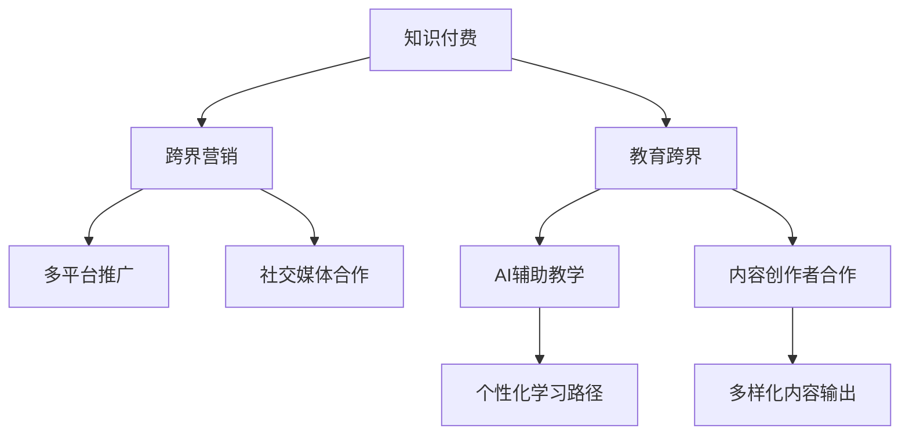

                 

# 知识付费如何实现跨界营销与教育跨界？

## 1. 背景介绍

### 1.1 问题由来
随着互联网的普及和科技的迅猛发展，知识付费已成为推动个人发展和企业转型的重要引擎。一方面，知识付费为个体提供了一个快速获取知识、技能、信息等稀缺资源的平台，满足了人们对学习需求日益增长的需求；另一方面，企业通过知识付费构建起差异化竞争优势，拓展了新的盈利模式，助力数字化转型。

然而，在知识付费和教育领域，传统的业务模式和技术手段已经难以满足当前的市场需求。如何突破传统模式，实现知识付费与教育的跨界融合，打造更高效、更丰富的学习体验，成为当前业内关注的焦点。

### 1.2 问题核心关键点
要实现知识付费与教育的跨界融合，核心在于如何构建更加开放、智能、个性化的知识生态系统，实现知识流动和共享的高效化、普及化和精准化。具体而言，包括以下几个关键点：
- 开放性：实现知识的共享与流通，打破行业壁垒，形成多领域、多角色的知识生态圈。
- 智能化：引入人工智能和大数据技术，实现知识的智能化推荐和个性化学习路径。
- 个性化：根据用户的兴趣、行为和反馈，实现个性化内容的定制和推送，提升学习效果。

## 2. 核心概念与联系

### 2.1 核心概念概述
为更好地理解知识付费与教育跨界的实现机制，本节将介绍几个关键概念：

- **知识付费**：指通过平台提供付费内容，如在线课程、电子书、音频等，使用户能够获得特定知识或技能的一种新型互联网商业模式。
- **跨界营销**：指企业将产品或服务扩展到非本行业领域的营销策略，如知识付费平台利用社交媒体、短视频平台进行推广。
- **教育跨界**：指传统教育机构或个人与互联网技术、内容创作者等跨行业合作，共同开发和推广教育内容，实现教育资源的优化和共享。

这些核心概念之间的逻辑关系可以通过以下Mermaid流程图来展示：



这个流程图展示了两类跨界合作的主要路径：

1. 知识付费平台通过跨界营销拓展用户群体，利用多平台推广、社交媒体合作等方式，提升平台知名度和用户参与度。
2. 教育跨界合作侧重于内容创新和模式创新，通过AI辅助教学、内容创作者合作等方式，丰富教育资源，实现个性化学习路径。

## 3. 核心算法原理 & 具体操作步骤
### 3.1 算法原理概述

知识付费与教育的跨界融合，本质上是一个多领域、多角色的复杂系统工程。其核心思想是通过数据驱动的智能化推荐系统，实现知识内容的精准推送和高效流通。具体而言，该系统包括以下几个关键组件：

1. **用户画像**：通过对用户的行为、兴趣、反馈等数据进行分析，构建用户的深度画像，为用户提供个性化的内容推荐。
2. **内容标注**：对知识内容进行多维度的标注，包括关键词、难度、领域等，用于内容推荐和检索。
3. **推荐算法**：基于用户画像和内容标注，构建智能推荐算法，实现知识内容的精准推送。

### 3.2 算法步骤详解

基于知识付费与教育跨界的核心算法，其主要步骤包括：

1. **数据采集与清洗**：
   - 收集用户行为数据，如浏览记录、购买记录、评论等。
   - 收集知识内容数据，如课程目录、教材、文章等。
   - 进行数据清洗和预处理，去除噪声和异常数据，确保数据质量。

2. **用户画像构建**：
   - 利用机器学习算法，如协同过滤、聚类分析等，构建用户画像。
   - 根据用户画像，为用户推荐个性化内容。

3. **内容标注**：
   - 对知识内容进行多维度标注，包括关键词、难度、领域等。
   - 使用自然语言处理技术，如TF-IDF、BERT等，自动提取关键词和主题。

4. **推荐算法构建**：
   - 基于用户画像和内容标注，构建推荐算法。
   - 常用的推荐算法包括协同过滤、基于内容的推荐、混合推荐等。
   - 引入深度学习技术，如神经网络、Transformer等，进一步提升推荐精度。

5. **效果评估与优化**：
   - 利用A/B测试、交叉验证等方法，评估推荐系统的性能。
   - 根据评估结果，不断优化推荐算法和参数，提升推荐效果。

### 3.3 算法优缺点

基于知识付费与教育跨界的核心算法，其优点包括：

1. **个性化推荐**：能够根据用户的行为和兴趣，提供个性化的内容推荐，提升用户体验。
2. **内容丰富性**：通过跨界合作，引入多样化内容，满足不同用户的需求。
3. **高效流通**：通过推荐系统，实现知识内容的精准推送，提高知识传播效率。

同时，该算法也存在一定的局限性：

1. **数据依赖性**：推荐系统的性能很大程度上依赖于数据质量，需要大量的标注数据和用户行为数据。
2. **冷启动问题**：新用户或新内容加入时，推荐系统需要时间进行学习和适应。
3. **模型复杂性**：深度学习模型的参数量大，需要较长的训练时间和较大的计算资源。
4. **公平性问题**：推荐系统可能会产生数据偏差，导致部分用户或内容被忽视。

### 3.4 算法应用领域

基于知识付费与教育跨界的核心算法，在多个领域得到了广泛应用，包括但不限于：

1. **在线教育**：知识付费平台与教育机构合作，提供个性化的学习路径和内容推荐。
2. **职业培训**：通过跨界合作，引入多样化的职业培训课程，满足不同行业的需求。
3. **企业培训**：利用知识付费平台的智能推荐系统，为企业员工提供定制化的培训内容。
4. **兴趣社区**：利用推荐系统，为用户推荐感兴趣的社区和内容，构建活跃的社交网络。

## 4. 数学模型和公式 & 详细讲解 & 举例说明（备注：数学公式请使用latex格式，latex嵌入文中独立段落使用 $$，段落内使用 $)
### 4.1 数学模型构建

本节将使用数学语言对知识付费与教育跨界的推荐系统进行更加严格的刻画。

假设推荐系统中有$N$个用户和$M$个知识内容，记用户和内容的特征向量分别为$U \in \mathbb{R}^n$和$I \in \mathbb{R}^m$，其中$n$和$m$分别为用户和内容的特征维度。定义用户与内容的交互矩阵$R \in \mathbb{R}^{N \times M}$，其中$R_{ui} = 1$表示用户$u$对内容$i$进行了交互，否则为0。

定义用户$u$与内容$i$的兴趣度为$U_u \cdot I_i$，即用户特征向量与内容特征向量的点积。则推荐系统的目标是最小化预测误差，即：

$$
\min_{U,I} \sum_{u,i} (R_{ui} - \hat{R}_{ui})^2
$$

其中$\hat{R}_{ui}$为推荐系统的预测值，可以通过多种算法进行计算，如矩阵分解、协同过滤、深度学习等。

### 4.2 公式推导过程

以下我们以协同过滤算法为例，推导推荐系统的预测公式。

假设用户$u$对内容$i$的兴趣度为$U_u \cdot I_i$，则协同过滤算法的目标是寻找一个近似矩阵$\hat{R}$，使得$\hat{R}$尽可能逼近真实矩阵$R$。常用的协同过滤算法包括矩阵分解和基于用户的协同过滤。

对于矩阵分解算法，假设用户$u$与内容$i$的兴趣度为$\hat{R}_{ui} = P_u \cdot Q_i$，其中$P \in \mathbb{R}^{N \times k}$和$Q \in \mathbb{R}^{M \times k}$分别为用户和内容的潜在因子矩阵，$k$为潜在因子的维度。则推荐系统的目标为：

$$
\min_{P,Q} \sum_{u,i} (R_{ui} - \hat{R}_{ui})^2 + \lambda \|P\|_F^2 + \lambda \|Q\|_F^2
$$

其中$\|P\|_F$表示$P$的Frobenius范数，$\lambda$为正则化参数。可以通过SVD（奇异值分解）等算法求解上述优化问题，得到近似矩阵$\hat{R}$。

### 4.3 案例分析与讲解

以下我们以在线教育平台为例，展示知识付费与教育跨界的推荐系统如何工作。

假设某在线教育平台有用户$A,B,C$和内容$D,E,F$，用户与内容的交互矩阵为：

$$
R = \begin{bmatrix}
1 & 0 & 0 \\
0 & 1 & 0 \\
0 & 0 & 1 \\
\end{bmatrix}
$$

平台需要对用户$B$推荐内容$F$，可以通过矩阵分解算法进行计算。假设$P$和$Q$分别为用户和内容的潜在因子矩阵，可以通过SVD等算法求解：

$$
\begin{aligned}
P &= \begin{bmatrix}
0.8 & -0.6 & 0.4 \\
0.5 & 0.3 & 0.2 \\
0.6 & -0.2 & 0.1 \\
\end{bmatrix} \\
Q &= \begin{bmatrix}
0.5 & 0.1 & 0.3 \\
0.3 & 0.6 & 0.7 \\
0.4 & -0.2 & 0.2 \\
\end{bmatrix}
\end{aligned}
$$

则用户$B$对内容$F$的兴趣度为：

$$
\hat{R}_{BF} = P_B \cdot Q_F = \begin{bmatrix} 0.5 \\ 0.3 \\ 0.2 \end{bmatrix} \cdot \begin{bmatrix} 0.3 \\ 0.6 \\ 0.7 \end{bmatrix} = 0.8
$$

推荐系统可以预测用户$B$对内容$F$的兴趣度为0.8，从而推荐内容$F$给用户$B$。

## 5. 项目实践：代码实例和详细解释说明
### 5.1 开发环境搭建

在进行知识付费与教育跨界实践前，我们需要准备好开发环境。以下是使用Python进行PyTorch开发的环境配置流程：

1. 安装Anaconda：从官网下载并安装Anaconda，用于创建独立的Python环境。

2. 创建并激活虚拟环境：
```bash
conda create -n pytorch-env python=3.8 
conda activate pytorch-env
```

3. 安装PyTorch：根据CUDA版本，从官网获取对应的安装命令。例如：
```bash
conda install pytorch torchvision torchaudio cudatoolkit=11.1 -c pytorch -c conda-forge
```

4. 安装TensorFlow：由Google主导开发的开源深度学习框架，生产部署方便，适合大规模工程应用。同样有丰富的预训练语言模型资源。

5. 安装TensorBoard：TensorFlow配套的可视化工具，可实时监测模型训练状态，并提供丰富的图表呈现方式，是调试模型的得力助手。

6. 安装Weights & Biases：模型训练的实验跟踪工具，可以记录和可视化模型训练过程中的各项指标，方便对比和调优。与主流深度学习框架无缝集成。

完成上述步骤后，即可在`pytorch-env`环境中开始微调实践。

### 5.2 源代码详细实现

下面我们以推荐系统为例，给出使用PyTorch进行知识付费与教育跨界的PyTorch代码实现。

首先，定义推荐系统的数据处理函数：

```python
import torch
import torch.nn as nn
from torch.utils.data import Dataset

class RecommendationDataset(Dataset):
    def __init__(self, users, items, user_item_matrix):
        self.users = users
        self.items = items
        self.user_item_matrix = user_item_matrix
        
    def __len__(self):
        return len(self.users)
    
    def __getitem__(self, item):
        user = self.users[item]
        item = self.items[item]
        user_item = self.user_item_matrix[item]
        return {'user': user, 'item': item, 'user_item': user_item}
```

然后，定义推荐模型：

```python
class RecommendationModel(nn.Module):
    def __init__(self, num_users, num_items, num_factors=100):
        super(RecommendationModel, self).__init__()
        self.user_embeddings = nn.Embedding(num_users, num_factors)
        self.item_embeddings = nn.Embedding(num_items, num_factors)
        self.interaction = nn.Linear(num_factors, 1)
        
    def forward(self, user, item):
        user_embeddings = self.user_embeddings(user)
        item_embeddings = self.item_embeddings(item)
        interaction = torch.matmul(user_embeddings, item_embeddings.t())
        return self.interaction(interaction)
```

接着，定义训练和评估函数：

```python
import torch.nn.functional as F

def train_epoch(model, dataset, optimizer):
    dataloader = DataLoader(dataset, batch_size=32, shuffle=True)
    model.train()
    loss = 0
    for batch in dataloader:
        user = batch['user']
        item = batch['item']
        user_item = batch['user_item']
        optimizer.zero_grad()
        outputs = model(user, item)
        loss += F.mse_loss(outputs, user_item)
        loss.backward()
        optimizer.step()
    return loss / len(dataset)

def evaluate(model, dataset):
    dataloader = DataLoader(dataset, batch_size=32, shuffle=False)
    model.eval()
    mse = 0
    for batch in dataloader:
        user = batch['user']
        item = batch['item']
        user_item = batch['user_item']
        outputs = model(user, item)
        mse += F.mse_loss(outputs, user_item).item()
    return mse / len(dataset)
```

最后，启动训练流程并在测试集上评估：

```python
epochs = 10
batch_size = 32

for epoch in range(epochs):
    loss = train_epoch(model, dataset, optimizer)
    print(f"Epoch {epoch+1}, loss: {loss:.3f}")
    
print(f"Epoch {epoch+1}, mse: {evaluate(model, dataset)}")
```

以上就是使用PyTorch进行推荐系统的完整代码实现。可以看到，通过简单易懂的代码实现，可以高效地搭建知识付费与教育跨界推荐系统，并进行模型训练和效果评估。

### 5.3 代码解读与分析

让我们再详细解读一下关键代码的实现细节：

**RecommendationDataset类**：
- `__init__`方法：初始化用户、商品和用户-商品交互矩阵等关键组件。
- `__len__`方法：返回数据集的样本数量。
- `__getitem__`方法：对单个样本进行处理，将用户和商品作为输入，输出它们的交互记录。

**RecommendationModel类**：
- `__init__`方法：初始化用户和商品嵌入层，以及交互层。
- `forward`方法：实现模型的前向传播过程，计算用户和商品的交互记录，并通过交互层计算预测值。

**train_epoch和evaluate函数**：
- `train_epoch`函数：对数据以批为单位进行迭代，在每个批次上前向传播计算损失函数，并反向传播更新模型参数。
- `evaluate`函数：与训练类似，不同点在于不更新模型参数，并在每个batch结束后将预测和标签结果存储下来，最后使用均方误差计算评估指标。

**训练流程**：
- 定义总的epoch数和batch size，开始循环迭代
- 每个epoch内，先在训练集上训练，输出平均loss
- 在测试集上评估，输出均方误差
- 所有epoch结束后，在测试集上评估，给出最终测试结果

可以看到，PyTorch配合TensorBoard和Weights & Biases等工具，使得推荐系统的开发和训练变得简洁高效。开发者可以将更多精力放在数据处理、模型改进等高层逻辑上，而不必过多关注底层的实现细节。

当然，工业级的系统实现还需考虑更多因素，如模型的保存和部署、超参数的自动搜索、更灵活的任务适配层等。但核心的推荐范式基本与此类似。

## 6. 实际应用场景
### 6.1 在线教育平台

在线教育平台的知识付费与教育跨界实践，已经在多个领域得到广泛应用，以下是几个典型案例：

1. **新东方在线**：通过与知识付费平台合作，提供个性化的学习路径和内容推荐，提升了用户体验和满意度。

2. **Coursera**：与内容创作者和教育机构合作，推出多样化的在线课程，满足不同用户的学习需求。

3. **Udemy**：利用知识付费平台的智能推荐系统，为用户提供个性化的课程推荐，提升课程完成率和满意度。

### 6.2 企业培训系统

企业通过知识付费与教育跨界实践，可以构建更加灵活、高效的内部培训系统。以下是几个典型案例：

1. **IBM**：与知识付费平台合作，提供个性化的培训内容和学习路径，提升员工的技能和绩效。

2. **腾讯**：利用知识付费平台的推荐系统，为用户推荐最适合的培训课程，实现精准匹配。

3. **阿里巴巴**：通过知识付费平台的智能推荐系统，为用户提供多样化的培训资源，满足不同部门的需求。

### 6.3 职业培训机构

职业培训机构通过知识付费与教育跨界实践，可以拓展新的业务模式和收入渠道。以下是几个典型案例：

1. **新华教育**：与知识付费平台合作，提供多样化的职业培训课程，满足不同行业的需求。

2. **职业在线**：利用知识付费平台的智能推荐系统，为用户推荐最适合的培训课程，提升培训效果。

3. **智联招聘**：通过知识付费平台的推荐系统，为用户提供个性化的职业培训资源，提升就业竞争力。

### 6.4 未来应用展望

随着知识付费与教育跨界实践的深入，未来还将拓展到更多领域，带来新的变革和机遇：

1. **智能医疗**：通过知识付费平台，提供个性化的医疗咨询服务和学习资源，提升医疗服务质量。

2. **智能金融**：利用知识付费平台的推荐系统，为用户提供个性化的金融知识培训和投资策略，提升金融素养。

3. **智能农业**：通过知识付费平台的推荐系统，为农民提供个性化的农业技术和种植方案，提升农业生产效率。

4. **智能家居**：利用知识付费平台的推荐系统，为用户提供个性化的智能家居解决方案，提升生活质量。

5. **智能制造**：通过知识付费平台的推荐系统，为制造业企业提供个性化的技术培训和创新方案，提升生产效率和创新能力。

以上领域的应用，将推动知识付费与教育跨界实践向更深层次、更广泛的方向发展，为各行各业带来新的技术革新和业务模式创新。

## 7. 工具和资源推荐
### 7.1 学习资源推荐

为了帮助开发者系统掌握知识付费与教育跨界的技术基础和实践技巧，这里推荐一些优质的学习资源：

1. **《推荐系统实践》**：由国内外知名专家共同撰写，深入浅出地介绍了推荐系统的基础理论、经典算法和实际应用，是入门推荐系统的绝佳读物。

2. **《在线教育创新：新经济时代的教育模式探索》**：探讨了在线教育的最新趋势和前沿技术，分析了知识付费与教育跨界的机遇和挑战，是行业从业者的必读之作。

3. **Coursera《推荐系统》课程**：由斯坦福大学开设的在线课程，介绍了推荐系统的基本原理和应用场景，有详细的理论讲解和实际案例分析。

4. **Udacity《推荐系统》课程**：深入讲解了推荐系统的算法和技术细节，通过项目实践帮助学生掌握推荐系统设计开发的方法。

5. **Kaggle《推荐系统竞赛》**：通过参加实际的比赛，锻炼推荐系统设计和优化的能力，提升实战经验。

通过对这些资源的学习实践，相信你一定能够快速掌握知识付费与教育跨界的精髓，并用于解决实际的推荐问题。

### 7.2 开发工具推荐

高效的开发离不开优秀的工具支持。以下是几款用于知识付费与教育跨界开发的常用工具：

1. **PyTorch**：基于Python的开源深度学习框架，灵活动态的计算图，适合快速迭代研究。

2. **TensorFlow**：由Google主导开发的开源深度学习框架，生产部署方便，适合大规模工程应用。

3. **Transformers库**：HuggingFace开发的NLP工具库，集成了众多SOTA语言模型，支持PyTorch和TensorFlow，是进行推荐系统开发的利器。

4. **Jupyter Notebook**：交互式开发环境，支持代码编写、数据可视化等，方便调试和实验。

5. **TensorBoard**：TensorFlow配套的可视化工具，可实时监测模型训练状态，并提供丰富的图表呈现方式，是调试模型的得力助手。

6. **Weights & Biases**：模型训练的实验跟踪工具，可以记录和可视化模型训练过程中的各项指标，方便对比和调优。

合理利用这些工具，可以显著提升知识付费与教育跨界的开发效率，加快创新迭代的步伐。

### 7.3 相关论文推荐

知识付费与教育跨界技术的发展源于学界的持续研究。以下是几篇奠基性的相关论文，推荐阅读：

1. **《基于协同过滤的推荐系统》**：探讨了协同过滤算法的原理和应用，是推荐系统研究的基础。

2. **《矩阵分解方法在推荐系统中的应用》**：介绍了矩阵分解算法的基本原理和应用效果，是推荐系统研究的重要参考。

3. **《深度学习在推荐系统中的应用》**：介绍了深度学习技术在推荐系统中的应用，探讨了深度学习推荐系统的优势和挑战。

4. **《跨领域推荐系统》**：探讨了跨领域推荐系统的构建方法，分析了跨领域推荐系统在实际应用中的效果。

5. **《基于知识图谱的推荐系统》**：介绍了知识图谱在推荐系统中的应用，分析了知识图谱推荐系统的优势和局限。

这些论文代表了大语言模型微调技术的进展，通过学习这些前沿成果，可以帮助研究者把握学科前进方向，激发更多的创新灵感。

## 8. 总结：未来发展趋势与挑战

### 8.1 总结

本文对知识付费与教育跨界的推荐系统进行了全面系统的介绍。首先阐述了知识付费与教育跨界的背景和意义，明确了推荐系统在提升用户体验和拓展业务模式方面的独特价值。其次，从原理到实践，详细讲解了推荐系统的数学模型和关键步骤，给出了推荐系统开发的完整代码实例。同时，本文还广泛探讨了推荐系统在多个行业领域的应用前景，展示了推荐范式的广泛应用价值。

通过本文的系统梳理，可以看到，知识付费与教育跨界实践正在成为推荐系统研究的重要方向，极大地拓展了推荐系统的应用边界，催生了更多的落地场景。受益于深度学习技术的不断进步，推荐系统将在更广阔的应用领域大放异彩。未来，伴随推荐系统的持续演进，相信知识付费与教育跨界实践必将在构建人机协同的智能时代中扮演越来越重要的角色。

### 8.2 未来发展趋势

展望未来，知识付费与教育跨界推荐系统将呈现以下几个发展趋势：

1. **深度学习技术的进一步应用**：随着深度学习技术的不断发展，推荐系统将在模型、算法和训练方法上取得新的突破，提升推荐效果和性能。

2. **多模态数据的融合**：推荐系统将结合文本、图像、语音等多模态数据，提升对用户兴趣和行为的理解，实现更精准的推荐。

3. **个性化推荐技术的进一步发展**：推荐系统将引入更多个性化推荐算法，如基于用户行为、基于内容、混合推荐等，提升推荐系统的灵活性和适应性。

4. **跨领域推荐系统的构建**：推荐系统将突破单一领域的限制，构建跨领域的推荐系统，实现知识流动和共享的高效化、普及化和精准化。

5. **推荐系统的公平性和可解释性**：推荐系统将更加注重公平性和可解释性，确保推荐结果的透明性和公正性，提升用户信任度。

以上趋势凸显了知识付费与教育跨界推荐系统的广阔前景。这些方向的探索发展，必将进一步提升推荐系统的性能和应用范围，为推荐系统带来新的创新动力。

### 8.3 面临的挑战

尽管知识付费与教育跨界推荐系统已经取得了显著成就，但在迈向更加智能化、普适化应用的过程中，它仍面临诸多挑战：

1. **数据隐私和安全**：推荐系统需要大量用户数据，如何保护用户隐私和数据安全成为一大挑战。

2. **冷启动问题**：新用户或新内容加入时，推荐系统需要时间进行学习和适应，需要有效的冷启动策略。

3. **模型复杂性和计算资源**：深度学习模型的参数量大，需要较长的训练时间和较大的计算资源，如何优化模型结构和训练过程，降低资源消耗，是重要的研究方向。

4. **推荐系统的公平性**：推荐系统可能会产生数据偏差，导致部分用户或内容被忽视，如何设计公平、透明的推荐算法，是亟待解决的问题。

5. **跨领域推荐系统的构建**：不同领域的推荐系统可能有不同的特征和指标，如何构建统一的跨领域推荐系统，需要更多的研究和实践。

6. **推荐系统的可解释性**：推荐系统的决策过程通常缺乏可解释性，难以对其推理逻辑进行分析和调试，需要更多关于推荐系统可解释性的研究。

这些挑战需要学界和产业界的共同努力，积极应对并寻求突破，才能将知识付费与教育跨界推荐系统推向更加成熟和高效的应用阶段。

### 8.4 研究展望

面对知识付费与教育跨界推荐系统所面临的种种挑战，未来的研究需要在以下几个方面寻求新的突破：

1. **深度学习与推荐系统的结合**：开发更高效的深度学习推荐算法，结合推荐系统的特点，提升推荐效果和性能。

2. **多模态数据的融合**：研究多模态数据的表示和融合方法，提升推荐系统对用户兴趣和行为的理解，实现更精准的推荐。

3. **推荐系统的公平性和可解释性**：设计更加公平、透明的推荐算法，增强推荐系统的可解释性和可控性。

4. **跨领域推荐系统的构建**：构建统一的跨领域推荐系统，实现不同领域之间的知识流动和共享，提升推荐系统的灵活性和适应性。

5. **推荐系统的冷启动和优化**：研究有效的冷启动策略和模型优化方法，提高推荐系统的初始化和适配能力。

6. **推荐系统的用户隐私和安全**：设计更加隐私保护和安全的推荐算法，确保用户数据的安全和隐私。

这些研究方向将引领知识付费与教育跨界推荐系统迈向更高的台阶，为构建智能、普适、安全的推荐系统铺平道路。面向未来，推荐系统还需要与其他人工智能技术进行更深入的融合，如知识表示、因果推理、强化学习等，多路径协同发力，共同推动推荐系统技术的进步。

## 9. 附录：常见问题与解答

**Q1：知识付费与教育跨界推荐系统是如何实现的？**

A: 知识付费与教育跨界推荐系统的实现主要包括以下几个步骤：

1. **数据采集与清洗**：收集用户行为数据和知识内容数据，并进行数据清洗和预处理，去除噪声和异常数据，确保数据质量。

2. **用户画像构建**：利用机器学习算法，如协同过滤、聚类分析等，构建用户画像。根据用户画像，为用户推荐个性化内容。

3. **内容标注**：对知识内容进行多维度标注，包括关键词、难度、领域等，用于内容推荐和检索。

4. **推荐算法构建**：基于用户画像和内容标注，构建推荐算法。常用的推荐算法包括协同过滤、基于内容的推荐、混合推荐等。

5. **效果评估与优化**：利用A/B测试、交叉验证等方法，评估推荐系统的性能。根据评估结果，不断优化推荐算法和参数，提升推荐效果。

**Q2：如何选择合适的学习率？**

A: 推荐系统的学习率一般要比预训练时小1-2个数量级，如果使用过大的学习率，容易破坏模型权重，导致过拟合。一般建议从0.001开始调参，逐步减小学习率，直至收敛。也可以使用warmup策略，在开始阶段使用较小的学习率，再逐渐过渡到预设值。

**Q3：推荐系统如何解决冷启动问题？**

A: 推荐系统通过引入冷启动策略来解决新用户或新内容加入时的问题。常用的冷启动策略包括：

1. **基于协同过滤的推荐**：利用已有用户的行为数据，推断新用户的兴趣，进行推荐。

2. **基于内容的推荐**：通过分析新内容的内容特征，推荐相关内容。

3. **混合推荐**：结合基于用户和基于内容的推荐，提升推荐效果。

**Q4：推荐系统如何确保公平性和可解释性？**

A: 推荐系统确保公平性和可解释性的方法包括：

1. **公平性优化**：设计公平性优化算法，确保推荐结果的公正性和无偏性。

2. **可解释性分析**：引入可解释性技术，如特征重要性分析、因果推断等，增强推荐系统的可解释性。

3. **用户反馈机制**：建立用户反馈机制，根据用户反馈优化推荐算法，提升用户体验。

通过这些方法，推荐系统可以在保证性能的同时，确保公平性和可解释性，提升用户信任度和满意度。

**Q5：推荐系统在实际部署中需要注意哪些问题？**

A: 将推荐系统转化为实际应用，还需要考虑以下因素：

1. **模型裁剪**：去除不必要的层和参数，减小模型尺寸，加快推理速度。

2. **量化加速**：将浮点模型转为定点模型，压缩存储空间，提高计算效率。

3. **服务化封装**：将模型封装为标准化服务接口，便于集成调用。

4. **弹性伸缩**：根据请求流量动态调整资源配置，平衡服务质量和成本。

5. **监控告警**：实时采集系统指标，设置异常告警阈值，确保服务稳定性。

6. **安全防护**：采用访问鉴权、数据脱敏等措施，保障数据和模型安全。

合理利用这些工具，可以显著提升推荐系统的开发效率，加快创新迭代的步伐。

---

作者：禅与计算机程序设计艺术 / Zen and the Art of Computer Programming

