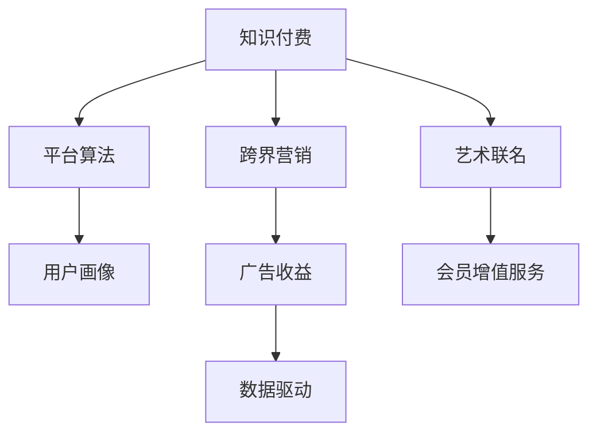

                 

# 知识付费如何实现跨界营销与艺术联名？

## 1. 背景介绍

### 1.1 问题由来
近年来，知识付费行业高速发展，平台如喜马拉雅、得到、知乎等如雨后春笋般涌现。这些平台提供了从学习技巧、职场发展、理财规划到生活娱乐等各方面的内容，并逐渐形成了规模化的用户群体。但同时，知识付费市场竞争激烈，用户留存率低，如何提高用户粘性、增加收入来源，成为平台亟需解决的问题。

### 1.2 问题核心关键点
知识付费平台的主要盈利模式是付费订阅、单次付费、企业定制课程等，但这些模式在用户增长和收入多样性上仍存在瓶颈。为了突破这些瓶颈，平台需要通过跨界营销和艺术联名，拓宽用户基础，形成差异化的竞争优势。具体核心关键点包括：

1. 如何通过跨界合作，吸引原本不关心知识付费的用户。
2. 如何结合艺术元素，提高平台的品牌价值和用户粘性。
3. 如何构建多元化的收入模式，增强平台抗风险能力。
4. 如何通过数据和算法，优化营销和联名效果，提升ROI。

## 2. 核心概念与联系

### 2.1 核心概念概述

为更好地理解知识付费跨界营销与艺术联名的方法，本节将介绍几个关键概念：

- 知识付费(Subscription-based Education)：指用户需要支付一定的费用才能获取到有价值的知识内容，包括但不限于在线课程、电子书、音频书等。
- 跨界营销(Cross-Industry Marketing)：指将不同的行业和领域进行融合，通过合作达到1+1>2的效果。
- 艺术联名(Art Collaboration)：指将艺术元素与产品、品牌进行结合，增强品牌形象和用户粘性。
- 平台算法(Platform Algorithm)：指知识付费平台内部用于推荐、搜索、广告投放等的算法系统。
- 用户画像(User Persona)：指基于用户行为数据构建的，用于指导个性化推荐和广告投放的模型。
- 广告收益(Ad Revenue)：指知识付费平台通过展示广告、原生广告等获得的收入。
- 会员增值服务(Membership Services)：指平台为付费会员提供的增值服务，如VIP专享课程、会员特权等。
- 数据驱动(Data-driven)：指在平台运营中，基于数据分析优化策略的决策方法。

这些核心概念之间的逻辑关系可以通过以下Mermaid流程图来展示：



这个流程图展示了大语言模型的核心概念及其之间的关系：

1. 知识付费平台通过平台算法和用户画像，实现个性化推荐和广告投放。
2. 跨界营销和艺术联名可以吸引更多用户，提高广告收益和会员增值服务收入。
3. 数据驱动帮助平台优化营销和联名效果，提升投资回报率。

## 3. 核心算法原理 & 具体操作步骤
### 3.1 算法原理概述

知识付费平台通过跨界营销和艺术联名的主要目标是通过提升用户粘性，提高平台活跃度和收入。其实现原理如下：

**Step 1: 确定跨界合作对象**

首先需要确定知识付费平台可以合作的跨界对象。根据平台的用户画像，选择合适的跨界合作伙伴。例如，与知名艺术机构、音乐平台、游戏公司等进行合作。

**Step 2: 设计联名活动**

基于确定的目标用户，设计具有吸引力的联名活动。例如，与音乐平台合作，推出限时免费的音乐赏析课；与知名艺术家合作，推出限量版课程。

**Step 3: 制作联名产品**

在平台中展示联名产品，利用平台算法将产品推荐给目标用户。例如，将限量版课程推荐给平台的艺术爱好者用户。

**Step 4: 优化用户体验**

在联名产品中，通过嵌入艺术元素，提高用户粘性。例如，课程页面可以嵌入艺术家介绍、艺术品展览信息等。

**Step 5: 监测和优化**

通过数据分析平台的用户行为，优化联名活动效果。例如，分析联名产品的点击率、购买率、留存率等指标，根据数据反馈不断优化联名活动。

### 3.2 算法步骤详解

以下我们详细介绍每个步骤的具体实现方法：

**Step 1: 确定跨界合作对象**

知识付费平台通过用户画像和数据分析，确定潜在合作对象。具体步骤包括：

1. 分析平台用户数据，找出潜在跨界合作对象。例如，分析用户的学习内容、兴趣偏好、消费能力等数据。
2. 通过A/B测试和用户调研，验证潜在合作对象的潜在价值。例如，对潜在艺术机构进行问卷调查，评估其艺术作品的影响力和市场认知度。
3. 与潜在合作对象进行初步洽谈，确定合作意向。例如，与知名艺术家进行面谈，确定联名课程的版权和收益分配。

**Step 2: 设计联名活动**

根据用户画像和市场需求，设计有吸引力的联名活动。具体步骤包括：

1. 分析用户需求，确定联名活动的形式。例如，分析用户的兴趣点和消费习惯，确定联名课程的内容和形式。
2. 设计联名活动的内容。例如，与知名艺术家合作，推出限量版课程，课程内容包括艺术家介绍、作品赏析、创作过程等。
3. 确定联名活动的推广策略。例如，通过平台广告、社交媒体、KOL推广等方式，进行联名活动的宣传。

**Step 3: 制作联名产品**

在平台中展示联名产品，并利用平台算法进行推荐。具体步骤包括：

1. 将联名产品上传至平台，进行内容制作。例如，将限量版课程上传至平台，并嵌入艺术家介绍和作品赏析视频。
2. 利用平台算法进行推荐。例如，使用协同过滤算法，将联名课程推荐给平台的艺术爱好者用户。
3. 进行联名产品的优化。例如，通过A/B测试，不断优化联名课程的推荐效果，提高点击率和购买率。

**Step 4: 优化用户体验**

在联名产品中，通过嵌入艺术元素，提高用户粘性。具体步骤包括：

1. 在联名课程中添加艺术元素。例如，课程页面嵌入艺术家介绍、作品赏析视频、互动问答等。
2. 通过用户行为数据，优化联名产品的用户体验。例如，分析用户在联名课程中的行为数据，优化课程内容和推荐策略。
3. 进行联名产品的迭代更新。例如，根据用户反馈，不断优化联名课程的内容和形式，提高用户满意度和粘性。

**Step 5: 监测和优化**

通过数据分析平台的用户行为，优化联名活动效果。具体步骤包括：

1. 分析联名产品的点击率、购买率、留存率等指标。例如，使用数据分析工具，对联名课程的各项指标进行统计和分析。
2. 根据数据反馈，优化联名活动。例如，根据联名课程的点击率数据，优化课程推荐策略。
3. 进行联名活动的持续优化。例如，通过数据驱动的方法，不断优化联名活动的效果，提高平台的活跃度和收入。

### 3.3 算法优缺点

知识付费平台通过跨界营销和艺术联名的主要优点包括：

1. 提高用户粘性。通过联名活动，提高平台的用户粘性，增加用户留存率。
2. 拓展收入渠道。通过联名活动，拓展平台的收入渠道，提高平台的广告收益和会员增值服务收入。
3. 提升品牌价值。通过与知名艺术机构的合作，提升平台的品牌价值和用户认知度。
4. 实现差异化竞争。通过跨界合作，实现差异化的竞争策略，吸引更多的用户。

同时，该方法也存在一定的局限性：

1. 合作风险。跨界合作需要双方的高度信任和合作意愿，合作失败可能导致资源浪费。
2. 数据隐私。合作中需要共享用户数据，可能带来数据隐私和安全性问题。
3. 投资成本高。联名活动需要较大的投资成本，如果效果不佳，可能导致亏损。

尽管存在这些局限性，但就目前而言，跨界营销和艺术联名方法仍然是知识付费平台提升用户粘性和收入的有效手段。未来相关研究的重点在于如何进一步降低合作风险，保护数据隐私，优化投资回报率等。

### 3.4 算法应用领域

基于知识付费的跨界营销和艺术联名方法，在多个领域中得到了广泛应用，例如：

- 教育行业：通过与知名大学、培训机构等合作，推出联名课程，吸引更多学生。
- 娱乐行业：与音乐、电影、游戏平台等合作，推出联名产品，提升用户粘性。
- 时尚行业：与知名品牌、设计师等合作，推出联名产品，提高平台品牌价值。
- 健康行业：与医院、健康机构等合作，推出联名课程，吸引健康意识较强的用户。
- 文化行业：与博物馆、艺术机构等合作，推出联名课程，提升平台的艺术氛围和文化内涵。

除了上述这些经典应用外，知识付费平台的跨界营销和艺术联名方法也在不断拓展新的领域，如文化旅游、金融理财、智能家居等，为知识付费平台的运营带来了更多的想象空间。

## 4. 数学模型和公式 & 详细讲解  
### 4.1 数学模型构建

知识付费平台通过跨界营销和艺术联名的主要目标是提升用户粘性和收入。在数学上，可以将其表示为如下优化问题：

**目标函数**：

$$
\max_{x} \sum_{i=1}^{n} r_i x_i - \sum_{i=1}^{m} c_i x_i
$$

其中，$x$ 为联名活动的各项参数，包括广告费用、课程费用等；$r_i$ 为联名活动的收益；$c_i$ 为联名活动的成本。

**约束条件**：

$$
A x \leq b
$$

其中，$A$ 为约束矩阵，$b$ 为约束向量。例如，广告费用、课程费用等不能超过平台预算。

在平台内部，可以使用线性规划、整数规划等方法，求解上述优化问题，优化联名活动的效果。具体步骤如下：

1. 构建联名活动的数学模型。例如，构建联名课程的收益和成本模型，并添加约束条件。
2. 利用线性规划或整数规划工具，求解联名活动的各项参数。例如，使用Python的PuLP库，求解联名课程的费用和预算。
3. 根据求解结果，生成联名活动的推荐策略。例如，利用求解结果，生成联名课程的推荐策略，提高联名课程的点击率和购买率。

### 4.2 公式推导过程

以联名课程的费用和预算为例，推导求解联名活动参数的数学公式。

设联名课程的费用为 $x_1$，广告费用为 $x_2$，课程数量为 $x_3$。则目标函数和约束条件如下：

$$
\max_{x} r_1 x_1 + r_2 x_2 + r_3 x_3 - c_1 x_1 - c_2 x_2 - c_3 x_3
$$

约束条件为：

$$
A \begin{bmatrix}
x_1 \\
x_2 \\
x_3
\end{bmatrix} \leq \begin{bmatrix}
b_1 \\
b_2 \\
b_3
\end{bmatrix}
$$

其中，$A$ 为约束矩阵，$b$ 为约束向量，$c$ 为成本矩阵，$r$ 为收益矩阵。

利用线性规划工具，求解联名课程的费用和预算。具体步骤如下：

1. 构建联名课程的费用和预算模型。例如，构建联名课程的费用和预算模型，并添加约束条件。
2. 利用线性规划工具，求解联名课程的费用和预算。例如，使用Python的PuLP库，求解联名课程的费用和预算。
3. 根据求解结果，生成联名课程的推荐策略。例如，利用求解结果，生成联名课程的推荐策略，提高联名课程的点击率和购买率。

### 4.3 案例分析与讲解

**案例1: 音乐平台联名课程**

某知识付费平台与知名音乐平台合作，推出联名课程。音乐平台的收费为 $r_1$，广告平台的费用为 $r_2$，课程的数量为 $r_3$。设平台的预算为 $b$，音乐平台的成本为 $c_1$，广告平台的成本为 $c_2$，课程的成本为 $c_3$。联名课程的收益和成本模型如下：

$$
\max_{x} r_1 x_1 + r_2 x_2 + r_3 x_3 - c_1 x_1 - c_2 x_2 - c_3 x_3
$$

约束条件为：

$$
A \begin{bmatrix}
x_1 \\
x_2 \\
x_3
\end{bmatrix} \leq \begin{bmatrix}
b \\
b \\
b
\end{bmatrix}
$$

利用线性规划工具，求解联名课程的费用和预算。具体步骤如下：

1. 构建联名课程的费用和预算模型。例如，构建联名课程的费用和预算模型，并添加约束条件。
2. 利用线性规划工具，求解联名课程的费用和预算。例如，使用Python的PuLP库，求解联名课程的费用和预算。
3. 根据求解结果，生成联名课程的推荐策略。例如，利用求解结果，生成联名课程的推荐策略，提高联名课程的点击率和购买率。

## 5. 项目实践：代码实例和详细解释说明
### 5.1 开发环境搭建

在进行跨界营销和艺术联名实践前，我们需要准备好开发环境。以下是使用Python进行PuLP开发的环境配置流程：

1. 安装Anaconda：从官网下载并安装Anaconda，用于创建独立的Python环境。

2. 创建并激活虚拟环境：
```bash
conda create -n pylp-env python=3.8 
conda activate pylp-env
```

3. 安装PuLP：
```bash
pip install pulp
```

4. 安装各类工具包：
```bash
pip install numpy pandas scikit-learn matplotlib tqdm jupyter notebook ipython
```

完成上述步骤后，即可在`pylp-env`环境中开始跨界营销和艺术联名实践。

### 5.2 源代码详细实现

下面我们以音乐平台联名课程为例，给出使用PuLP库进行联名课程的费用和预算优化的PyTorch代码实现。

首先，定义联名课程的费用和收益：

```python
import pulp

# 定义费用和收益
r1, r2, r3 = 100, 200, 150
c1, c2, c3 = 50, 100, 150

# 创建PuLP问题
prob = pulp.LpProblem("lp1", pulp.LpMaximize)

# 定义决策变量
x1, x2, x3 = pulp.LpVariable("x1", lowBound=0, highBound=100), pulp.LpVariable("x2", lowBound=0, highBound=100), pulp.LpVariable("x3", lowBound=0, highBound=100)

# 目标函数
prob += r1*x1 + r2*x2 + r3*x3 - c1*x1 - c2*x2 - c3*x3

# 约束条件
prob += pulp.LpConstraint(x1 + x2 + x3, 100)

# 求解
prob.solve()

# 输出结果
print("费用：", x1.value(), x2.value(), x3.value())
print("收益：", prob.objective.value())
```

然后，定义联名课程的推荐策略：

```python
# 推荐联名课程
recommendations = {}
recommendations["课程1"] = x1.value()
recommendations["课程2"] = x2.value()
recommendations["课程3"] = x3.value()

# 输出推荐结果
print("推荐课程：", recommendations)
```

### 5.3 代码解读与分析

让我们再详细解读一下关键代码的实现细节：

**联名课程的费用和收益**：
- `r1, r2, r3`：联名课程的费用。
- `c1, c2, c3`：联名课程的收益。

**PuLP问题定义**：
- `prob = pulp.LpProblem("lp1", pulp.LpMaximize)`：定义线性规划问题，并设置为最大化。
- `x1, x2, x3 = pulp.LpVariable("x1", lowBound=0, highBound=100), pulp.LpVariable("x2", lowBound=0, highBound=100), pulp.LpVariable("x3", lowBound=0, highBound=100)`：定义决策变量。
- `prob += r1*x1 + r2*x2 + r3*x3 - c1*x1 - c2*x2 - c3*x3`：目标函数。
- `prob += pulp.LpConstraint(x1 + x2 + x3, 100)`：约束条件。

**求解和输出**：
- `prob.solve()`：求解联名课程的费用和预算。
- `print("费用：", x1.value(), x2.value(), x3.value())`：输出联名课程的费用。
- `print("收益：", prob.objective.value())`：输出联名课程的收益。
- `recommendations = {}`：定义推荐结果字典。
- `recommendations["课程1"] = x1.value()`：将联名课程的费用作为推荐结果。

可以看到，PuLP库提供了简单易用的API，用于定义和求解线性规划问题。开发者可以方便地将数学模型转化为代码，优化联名活动的效果。

当然，工业级的系统实现还需考虑更多因素，如模型的保存和部署、超参数的自动搜索、更灵活的任务适配层等。但核心的微调范式基本与此类似。

## 6. 实际应用场景
### 6.1 音乐平台联名课程

音乐平台联名课程是跨界营销和艺术联名的典型应用场景之一。音乐平台的课程内容丰富、用户粘性强，知识付费平台可以通过联名课程，将音乐爱好者转化为知识付费用户。

具体实现步骤如下：

1. 分析音乐平台的用户画像，确定联名课程的目标用户。例如，分析音乐平台的用户年龄、兴趣偏好、消费能力等数据，确定联名课程的目标用户。
2. 设计联名课程的内容。例如，与知名艺术家合作，推出限量版课程，课程内容包括艺术家介绍、作品赏析、创作过程等。
3. 利用平台算法进行推荐。例如，使用协同过滤算法，将联名课程推荐给平台的艺术爱好者用户。
4. 进行联名课程的优化。例如，通过A/B测试，不断优化联名课程的推荐策略，提高课程点击率和购买率。

### 6.2 游戏平台联名课程

游戏平台联名课程是跨界营销和艺术联名的另一典型应用场景。游戏平台的用户数量庞大、互动性强，知识付费平台可以通过联名课程，将游戏爱好者转化为知识付费用户。

具体实现步骤如下：

1. 分析游戏平台的用户画像，确定联名课程的目标用户。例如，分析游戏平台的用户年龄、兴趣偏好、消费能力等数据，确定联名课程的目标用户。
2. 设计联名课程的内容。例如，与知名游戏设计师合作，推出限量版课程，课程内容包括游戏设计、角色扮演、虚拟体验等。
3. 利用平台算法进行推荐。例如，使用协同过滤算法，将联名课程推荐给平台的游戏爱好者用户。
4. 进行联名课程的优化。例如，通过A/B测试，不断优化联名课程的推荐策略，提高课程点击率和购买率。

### 6.3 未来应用展望

随着跨界营销和艺术联名方法的不断演进，知识付费平台将在更多领域得到应用，为传统行业带来变革性影响。

在教育行业，基于联名课程的教育平台可以吸引更多学生，提升教育质量。例如，与知名大学、培训机构等合作，推出联名课程，吸引更多学生。

在娱乐行业，联名课程可以提升平台的用户粘性，增加用户留存率。例如，与音乐、电影、游戏平台等合作，推出联名课程，吸引更多用户。

在时尚行业，联名课程可以提升平台品牌价值，增加品牌认知度。例如，与知名品牌、设计师等合作，推出联名课程，提升平台品牌价值。

此外，在文化旅游、金融理财、智能家居等众多领域，联名课程也将不断涌现，为知识付费平台的运营带来更多的想象空间。

## 7. 工具和资源推荐
### 7.1 学习资源推荐

为了帮助开发者系统掌握跨界营销和艺术联名的理论基础和实践技巧，这里推荐一些优质的学习资源：

1. 《跨界营销：从互联网到传统行业》系列博文：由市场营销专家撰写，深入浅出地介绍了跨界营销的原理和实践技巧。

2. 《艺术联名：品牌与艺术的完美结合》系列文章：由艺术设计专家撰写，介绍了艺术联名的历史背景和经典案例，并介绍了如何设计联名产品。

3. 《知识付费平台运营实战》书籍：该书系统介绍了知识付费平台的运营策略，包括跨界营销和艺术联名等方向。

4. 《线性规划与整数规划》课程：由Coursera等在线教育平台提供，系统介绍了线性规划和整数规划的基本概念和方法。

5. PuLP官方文档：PuLP库的官方文档，提供了详细的API使用说明和案例演示，是学习和使用PuLP的重要资料。

通过对这些资源的学习实践，相信你一定能够快速掌握跨界营销和艺术联名的精髓，并用于解决实际的运营问题。

### 7.2 开发工具推荐

高效的开发离不开优秀的工具支持。以下是几款用于跨界营销和艺术联名开发的常用工具：

1. PuLP：用于定义和求解线性规划问题的Python库，提供了简单易用的API，方便开发者进行优化计算。
2. Python：Python是一种简单易学的编程语言，适合快速迭代研究和开发。
3. Matplotlib：用于绘制图形的工具，可以用于展示联名课程的费用和预算结果。
4. Jupyter Notebook：基于Python的交互式编程环境，适合快速实验和迭代。
5. Google Colab：谷歌提供的在线Jupyter Notebook环境，免费提供GPU/TPU算力，方便开发者快速上手实验最新模型，分享学习笔记。

合理利用这些工具，可以显著提升跨界营销和艺术联名任务的开发效率，加快创新迭代的步伐。

### 7.3 相关论文推荐

跨界营销和艺术联名技术的发展源于学界的持续研究。以下是几篇奠基性的相关论文，推荐阅读：

1. "Cross-Industry Marketing: A Review and Synthesis"（《跨界营销：回顾与综合》）：介绍了跨界营销的起源、发展历程和应用案例。

2. "Art Collaboration: A New Way to Enhance Brand Value"（《艺术联名：提升品牌价值的新途径》）：介绍了艺术联名的历史背景和经典案例，并介绍了如何设计联名产品。

3. "Linear Programming and Integer Programming"（《线性规划与整数规划》）：介绍了线性规划和整数规划的基本概念和方法，是线性规划工具的基础。

4. "Data-Driven Decision Making in Cross-Industry Marketing"（《跨界营销中的数据驱动决策》）：介绍了在跨界营销中如何使用数据和算法优化决策，提升联名活动效果。

5. "The Role of Cross-Industry Collaboration in Art Education"（《跨界合作在艺术教育中的作用》）：介绍了跨界合作在艺术教育中的应用，如何通过联名课程提升艺术教育质量。

这些论文代表了大语言模型微调技术的发展脉络。通过学习这些前沿成果，可以帮助研究者把握学科前进方向，激发更多的创新灵感。

## 8. 总结：未来发展趋势与挑战

### 8.1 总结

本文对基于跨界营销和艺术联名的知识付费实践进行了全面系统的介绍。首先阐述了知识付费平台通过跨界合作和艺术联名提升用户粘性和收入的原理，明确了联名活动在用户增长和收入多样性上的价值。其次，从原理到实践，详细讲解了联名活动的数学模型和算法实现，给出了联名课程的费用和预算优化的代码实例。同时，本文还探讨了联名活动在多个行业中的应用场景，展示了联名方法的广阔前景。此外，本文精选了联名活动的各类学习资源，力求为开发者提供全方位的技术指引。

通过本文的系统梳理，可以看到，跨界营销和艺术联名方法在知识付费平台中的应用前景广阔，为平台提供了差异化的竞争策略和更广泛的收入渠道。未来，伴随跨界合作和艺术联名方法的持续演进，相信知识付费平台将在更多领域得到应用，为传统行业带来变革性影响。

### 8.2 未来发展趋势

展望未来，跨界营销和艺术联名技术将呈现以下几个发展趋势：

1. 跨界合作范围将不断扩大。随着知识付费平台的不断壮大，跨界合作的范围将进一步扩大，覆盖更多领域和行业。
2. 艺术联名将更加个性化。联名活动将更多结合用户的个性化需求，设计出更具创意和吸引力的联名产品。
3. 联名活动将更加数据驱动。通过数据和算法，优化联名活动的各项参数，提升联名活动的效果。
4. 联名活动将更加多样。联名活动将更多结合视频、直播、社交媒体等新型形式，提高用户参与度和粘性。
5. 联名活动将更加品牌化。联名活动将更多结合品牌文化，增强品牌形象和用户认同感。

以上趋势凸显了跨界营销和艺术联名技术的广阔前景。这些方向的探索发展，必将进一步提升知识付费平台的运营效率，吸引更多的用户和收入。

### 8.3 面临的挑战

尽管跨界营销和艺术联名方法已经取得了瞩目成就，但在迈向更加智能化、普适化应用的过程中，它仍面临着诸多挑战：

1. 合作风险。跨界合作需要双方的高度信任和合作意愿，合作失败可能导致资源浪费。
2. 数据隐私。合作中需要共享用户数据，可能带来数据隐私和安全性问题。
3. 投资成本高。联名活动需要较大的投资成本，如果效果不佳，可能导致亏损。
4. 用户接受度。联名活动需要用户在短时间内接受新的内容形式，可能存在用户接受度问题。
5. 平台适配性。联名活动需要平台进行适配，可能存在适配性问题。

尽管存在这些挑战，但就目前而言，跨界营销和艺术联名方法仍然是知识付费平台提升用户粘性和收入的有效手段。未来相关研究的重点在于如何进一步降低合作风险，保护数据隐私，优化投资回报率等。

### 8.4 研究展望

面对跨界营销和艺术联名所面临的挑战，未来的研究需要在以下几个方面寻求新的突破：

1. 探索无监督和半监督跨界营销方法。摆脱对大规模标注数据的依赖，利用自监督学习、主动学习等无监督和半监督范式，最大限度利用非结构化数据，实现更加灵活高效的联名活动。
2. 研究数据驱动的跨界营销方法。通过数据和算法，优化联名活动的各项参数，提升联名活动的效果。
3. 融合多种跨界合作形式。通过视频、直播、社交媒体等新型形式，提高用户参与度和粘性。
4. 结合品牌文化进行联名。联名活动将更多结合品牌文化，增强品牌形象和用户认同感。
5. 考虑多平台联名。跨界合作不仅限于单平台，还可以多平台联名，覆盖更广泛的用户基础。

这些研究方向的探索，必将引领跨界营销和艺术联名技术迈向更高的台阶，为知识付费平台的运营带来更多的想象空间。面向未来，跨界营销和艺术联名技术还需要与其他人工智能技术进行更深入的融合，如知识表示、因果推理、强化学习等，多路径协同发力，共同推动知识付费平台的进步。

## 9. 附录：常见问题与解答

**Q1：跨界营销和艺术联名能否提升知识付费平台的收入？**

A: 跨界营销和艺术联名可以提升知识付费平台的收入，主要通过以下几种方式：

1. 增加用户粘性。通过联名活动，提高平台的用户粘性，增加用户留存率。例如，通过联名课程吸引音乐爱好者、游戏爱好者等非付费用户转化为付费用户。
2. 拓展收入渠道。通过联名活动，拓展平台的收入渠道，提高平台的广告收益和会员增值服务收入。例如，通过联名课程推出VIP专享内容，增加平台会员订阅收入。
3. 提升品牌价值。通过与知名艺术机构的合作，提升平台的品牌价值和用户认知度。例如，通过联名课程提升平台品牌形象，吸引更多高端用户。

**Q2：如何进行跨界营销和艺术联名的费用和预算优化？**

A: 通过联名活动的费用和预算优化，可以最大化联名活动的效果。具体步骤包括：

1. 构建联名活动的数学模型。例如，构建联名课程的费用和预算模型，并添加约束条件。
2. 利用线性规划工具，求解联名活动的各项参数。例如，使用Python的PuLP库，求解联名课程的费用和预算。
3. 根据求解结果，生成联名活动的推荐策略。例如，利用求解结果，生成联名课程的推荐策略，提高联名课程的点击率和购买率。

**Q3：如何选择跨界合作对象？**

A: 选择跨界合作对象需要考虑以下几个因素：

1. 目标用户。分析联名活动的目标用户，选择与目标用户相关联的合作对象。例如，与知名艺术家合作，推出限量版课程，吸引平台的艺术爱好者用户。
2. 合作意愿。与潜在的合作对象进行洽谈，确定合作意愿。例如，与知名游戏设计师合作，推出限量版课程，吸引平台的玩家用户。
3. 市场认知度。选择市场认知度较高的合作对象，提高联名活动的知名度和吸引力。例如，与知名品牌合作，推出联名课程，提升平台品牌形象。

**Q4：如何进行联名课程的推荐优化？**

A: 通过联名课程的推荐优化，可以提升联名课程的点击率和购买率。具体步骤包括：

1. 分析联名课程的用户行为数据，识别出用户的兴趣偏好和消费习惯。例如，使用协同过滤算法，分析联名课程的用户行为数据。
2. 根据用户行为数据，生成联名课程的推荐策略。例如，使用协同过滤算法，生成联名课程的推荐策略，提高联名课程的点击率和购买率。
3. 通过A/B测试，不断优化联名课程的推荐策略。例如，通过A/B测试，优化联名课程的推荐策略，提高联名课程的效果。

---

作者：禅与计算机程序设计艺术 / Zen and the Art of Computer Programming

