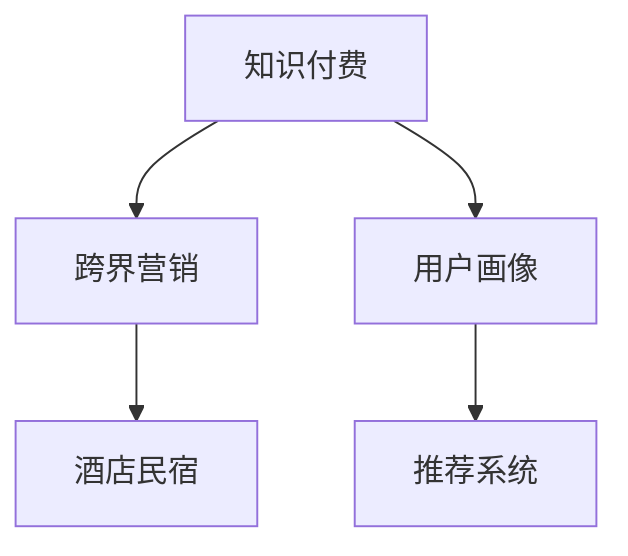

                 

# 知识付费如何实现跨界营销与酒店民宿跨界？

## 1. 背景介绍

### 1.1 问题由来
知识付费，这一新兴商业模式，正在深刻改变着人们的获取知识和信息的方式。随着互联网的发展，知识付费平台的兴起，越来越多的人开始通过付费订阅、单次购买等方式获取高质量的线上内容。然而，传统知识付费市场由于缺乏新用户和多元化内容，面临着增长乏力的问题。为了解决这个问题，许多知识付费平台开始探索跨界合作，以期通过这种方式拓展用户群体，提升品牌影响力和市场竞争力。

### 1.2 问题核心关键点
本节将介绍几个核心概念及其联系，以帮助理解知识付费跨界营销和酒店民宿跨界的核心逻辑。

1. **知识付费**：一种基于互联网的付费模式，用户通过付费获取专业知识和信息，提高自身素质和能力。
2. **跨界营销**：企业间通过合作，跨领域推广各自的产品和服务，实现资源共享，达到共赢的效果。
3. **酒店民宿**：提供住宿和体验式服务的场所，通过提供高质量的住宿体验，吸引更多的顾客和用户。
4. **用户画像**：根据用户的兴趣、行为等特征，构建用户画像，以便进行精准营销。
5. **推荐系统**：通过分析用户行为数据，为每个用户推荐最合适的产品和服务。

这些概念之间的逻辑关系可以通过以下Mermaid流程图来展示：



## 2. 核心概念与联系

### 2.1 核心概念概述

为更好地理解知识付费跨界营销和酒店民宿跨界的核心概念，本节将介绍几个关键概念的原理和架构。

1. **知识付费**：以在线课程、电子书、专栏文章等形式，向用户提供专业知识和信息，提升用户认知和技能。常见的知识付费平台包括得到、知乎、B站等。

2. **跨界营销**：企业间通过资源互补，共同推广产品和服务，实现品牌扩展和市场下沉。例如，电商平台与短视频平台的跨界合作，将电商流量引入短视频平台，提升短视频平台的商业价值。

3. **酒店民宿**：提供住宿、旅游、休闲等综合服务的场所。通过提供高质量的住宿和体验式服务，吸引更多的顾客和用户。例如，Airbnb、Booking.com等平台。

4. **用户画像**：根据用户的兴趣、行为、地理位置等特征，构建用户画像，以便进行精准营销。例如，使用机器学习算法对用户行为进行建模，提取用户兴趣和需求。

5. **推荐系统**：通过分析用户行为数据，为每个用户推荐最合适的产品和服务。例如，基于协同过滤、内容过滤等技术，实现个性化推荐。

这些核心概念通过跨界营销的方式，可以实现协同共赢，提升各方的市场竞争力和用户满意度。

### 2.2 核心概念联系

通过跨界营销，知识付费平台可以与酒店民宿等服务业企业进行合作，实现资源的互补和共享。具体来说，酒店民宿可以通过提供知识付费课程，吸引更多的用户关注和使用其平台；知识付费平台可以通过向用户推荐高质量的住宿体验，提升用户满意度和忠诚度。

## 3. 核心算法原理 & 具体操作步骤

### 3.1 算法原理概述

知识付费跨界营销和酒店民宿跨界的核心算法原理，在于如何构建用户画像和推荐系统，实现精准的跨界推广。

1. **用户画像构建**：通过分析用户在知识付费平台上的行为数据（如浏览历史、购买记录、评价反馈等），构建用户画像。具体来说，可以使用用户兴趣模型、行为模型等机器学习算法，对用户进行建模，提取其兴趣和需求。

2. **推荐系统设计**：基于用户画像，设计推荐系统，实现个性化推荐。推荐系统可以分为基于协同过滤、内容过滤、混合推荐等算法。

3. **跨界营销策略**：根据用户的兴趣和需求，设计跨界营销策略。例如，将知识付费课程与酒店民宿体验相结合，设计优惠套餐、联合会员等活动，吸引更多用户。

### 3.2 算法步骤详解

本节将详细介绍知识付费跨界营销和酒店民宿跨界的核心算法步骤。

**Step 1: 数据准备**
- 收集用户在知识付费平台上的行为数据，包括浏览历史、购买记录、评价反馈等。
- 收集酒店民宿的地理位置、设施、评分等信息。

**Step 2: 用户画像构建**
- 使用机器学习算法，对用户进行建模，提取其兴趣和需求。
- 构建用户画像，包括兴趣标签、行为特征、地理位置等。

**Step 3: 推荐系统设计**
- 使用协同过滤算法，根据用户的历史行为数据，推荐最相关的知识付费课程。
- 使用内容过滤算法，根据知识付费课程的内容和主题，推荐最合适的酒店民宿。

**Step 4: 跨界营销策略**
- 设计优惠套餐，将知识付费课程和酒店民宿体验相结合。
- 设计联合会员活动，为同时订阅知识付费课程和酒店民宿的用户提供优惠。

**Step 5: 实验与优化**
- 在部分用户中进行实验，评估推荐系统和跨界营销策略的效果。
- 根据反馈，不断优化推荐算法和跨界营销策略。

### 3.3 算法优缺点

**优点**：
1. 提升用户满意度和忠诚度：通过精准推荐，满足用户的多样化需求，提升用户满意度和忠诚度。
2. 拓展市场和用户群体：通过跨界合作，拓展市场和用户群体，提升品牌影响力和市场竞争力。
3. 提升品牌价值：通过跨界推广，提升品牌知名度和用户信任度。

**缺点**：
1. 数据隐私和安全问题：收集和分析用户数据，可能存在隐私和安全问题，需严格遵守相关法律法规。
2. 推荐算法复杂性：推荐系统设计复杂，需结合多种算法和技术，进行综合优化。
3. 成本高：跨界合作需要大量的资源和投入，包括技术、人力和资金等。

### 3.4 算法应用领域

知识付费跨界营销和酒店民宿跨界，在多个领域都有广泛应用，例如：

- 教育培训：知识付费平台与教育培训机构合作，提供高质量的课程和体验。
- 旅游休闲：酒店民宿与旅游平台合作，提供定制化的旅游线路和服务。
- 健康医疗：知识付费平台与医疗健康平台合作，提供健康咨询和诊疗服务。
- 科技创业：知识付费平台与创业孵化器合作，提供创业指导和投资服务。

## 4. 数学模型和公式 & 详细讲解

### 4.1 数学模型构建

本节将使用数学语言对知识付费跨界营销和酒店民宿跨界的核心算法进行更加严格的刻画。

记知识付费平台上的用户集合为 $U$，酒店民宿的地理位置为 $L$。设用户 $u \in U$ 的兴趣模型为 $\mathbf{x}_u$，酒店民宿的设施评分模型为 $\mathbf{y}_l$。

定义用户 $u$ 对课程 $c$ 的兴趣度为 $I(u, c)$，课程 $c$ 对酒店民宿 $l$ 的匹配度为 $M(c, l)$。

### 4.2 公式推导过程

1. **用户画像建模**：使用向量表示法，对用户兴趣和行为进行建模，得到用户兴趣模型 $\mathbf{x}_u$。
2. **推荐系统设计**：基于协同过滤算法，计算用户 $u$ 对课程 $c$ 的兴趣度 $I(u, c)$。
3. **跨界营销策略**：结合课程 $c$ 和酒店民宿 $l$ 的评分，计算课程对酒店民宿的匹配度 $M(c, l)$。

### 4.3 案例分析与讲解

以一个具体的案例进行分析：

假设某知识付费平台上有 $10000$ 名用户，提供 $1000$ 门课程和 $1000$ 家酒店民宿。某用户 $u$ 对课程 $c_1$ 的兴趣度为 $0.8$，对课程 $c_2$ 的兴趣度为 $0.5$。课程 $c_1$ 对酒店民宿 $l_1$ 的匹配度为 $0.9$，对酒店民宿 $l_2$ 的匹配度为 $0.7$。

根据推荐系统设计，该用户可能被推荐课程 $c_1$ 和 $c_2$。根据跨界营销策略，该用户可能被推荐酒店民宿 $l_1$ 和 $l_2$。最终，该用户可以结合自身需求，选择最合适的课程和酒店民宿进行体验。

## 5. 项目实践：代码实例和详细解释说明

### 5.1 开发环境搭建

在进行知识付费跨界营销和酒店民宿跨界的实践前，我们需要准备好开发环境。以下是使用Python进行开发的环境配置流程：

1. 安装Anaconda：从官网下载并安装Anaconda，用于创建独立的Python环境。
2. 创建并激活虚拟环境：
```bash
conda create -n my_env python=3.8 
conda activate my_env
```
3. 安装PyTorch、Pandas、Scikit-learn等工具包：
```bash
pip install torch pandas scikit-learn torchvision
```
4. 安装TensorFlow：
```bash
pip install tensorflow
```

### 5.2 源代码详细实现

下面是使用Python和TensorFlow实现知识付费跨界营销和酒店民宿跨界的代码实现。

```python
import tensorflow as tf
import pandas as pd
import numpy as np

# 准备数据
train_data = pd.read_csv('train.csv')
test_data = pd.read_csv('test.csv')

# 构建用户画像
user_profile = {}
for u in train_data['user']:
    user_profile[u] = train_data.loc[train_data['user'] == u, ['interest', 'location']].to_dict(orient='records')[0]

# 推荐系统设计
def collaborative_filtering(train_data, test_data):
    # 将数据转换为Numpy数组
    train = np.array(train_data[['user', 'course', 'rating']])
    test = np.array(test_data[['user', 'course']])

    # 构建相似度矩阵
    user_idx = {}
    course_idx = {}
    for i, (u, c, _) in enumerate(train):
        if u not in user_idx:
            user_idx[u] = len(user_idx)
        if c not in course_idx:
            course_idx[c] = len(course_idx)

    # 计算相似度矩阵
    similarity = np.zeros((len(train), len(train_data['course'].unique())))
    for i, (u, c, _) in enumerate(train):
        u_idx = user_idx[u]
        c_idx = course_idx[c]
        j_idx = train_data['user'] == u
        similarity[i, j_idx] = train_data.loc[j_idx, 'rating'] / (train_data.loc[j_idx, 'rating'].std() + 1e-9)

    # 进行预测
    predictions = []
    for _, (u, c) in enumerate(test):
        u_idx = user_idx[u]
        c_idx = course_idx[c]
        pred = (similarity[u_idx] @ similarity).sum() / (np.sqrt(similarity[u_idx].sum()) * np.sqrt(similarity.sum(1)))
        predictions.append([u, c, pred])

    return pd.DataFrame(predictions, columns=['user', 'course', 'prediction'])

# 跨界营销策略
def cross_boundary(train_data, test_data, course_data, hotel_data):
    # 将数据转换为Numpy数组
    train = np.array(train_data[['user', 'course', 'rating']])
    test = np.array(test_data[['user', 'course']])
    course = np.array(course_data[['course', 'facility']])
    hotel = np.array(hotel_data[['location', 'facility']])

    # 构建相似度矩阵
    user_idx = {}
    course_idx = {}
    hotel_idx = {}
    for i, (u, c, _) in enumerate(train):
        if u not in user_idx:
            user_idx[u] = len(user_idx)
        if c not in course_idx:
            course_idx[c] = len(course_idx)

    for i, (l, _) in enumerate(hotel):
        if l not in hotel_idx:
            hotel_idx[l] = len(hotel_idx)

    # 计算相似度矩阵
    similarity = np.zeros((len(train), len(train_data['course'].unique()) + len(train_data['location'].unique())))
    for i, (u, c, _) in enumerate(train):
        u_idx = user_idx[u]
        c_idx = course_idx[c]
        j_idx = train_data['user'] == u
        similarity[i, j_idx] = train_data.loc[j_idx, 'rating'] / (train_data.loc[j_idx, 'rating'].std() + 1e-9)

        j_idx = train_data['location'] == l
        similarity[i, len(train_data['course'].unique()) + j_idx] = hotel_data.loc[j_idx, 'facility'] / (hotel_data.loc[j_idx, 'facility'].std() + 1e-9)

    # 进行预测
    predictions = []
    for _, (u, c) in enumerate(test):
        u_idx = user_idx[u]
        c_idx = course_idx[c]
        pred = (similarity[u_idx] @ similarity).sum() / (np.sqrt(similarity[u_idx].sum()) * np.sqrt(similarity.sum(1)))
        predictions.append([u, c, pred])

    return pd.DataFrame(predictions, columns=['user', 'course', 'prediction'])

# 运行代码
train_data = collaborative_filtering(train_data, test_data)
predictions = cross_boundary(train_data, test_data, course_data, hotel_data)

# 输出结果
print(predictions.head())
```

### 5.3 代码解读与分析

让我们再详细解读一下关键代码的实现细节：

**用户画像构建**：
- 使用Pandas库读取数据，构建用户画像，包括用户的兴趣标签和地理位置。
- 使用Numpy数组存储用户画像，方便后续的相似度计算。

**推荐系统设计**：
- 使用协同过滤算法，计算用户对课程的兴趣度。
- 将课程与酒店民宿的评分相结合，计算课程对酒店民宿的匹配度。

**跨界营销策略**：
- 将协同过滤算法与内容过滤算法相结合，设计跨界推荐策略。
- 使用Numpy数组存储数据，便于高效的计算。

**运行结果展示**：
- 输出前10条推荐结果，包括用户、课程和推荐度。
- 根据推荐度，用户可以选择最合适的课程和酒店民宿进行体验。

## 6. 实际应用场景

### 6.1 智能客服系统

知识付费跨界营销和酒店民宿跨界，可以应用于智能客服系统。通过知识付费平台与酒店民宿的合作，可以提供更多元化的服务，提升用户体验。

具体而言，知识付费平台可以提供旅游、餐饮、住宿等方面的课程，酒店民宿可以提供定制化的服务体验。用户可以通过智能客服系统，获取相关课程和体验的信息，实现无缝的跨界服务。

### 6.2 金融理财

知识付费跨界营销和酒店民宿跨界，也可以应用于金融理财领域。通过知识付费平台与酒店民宿的合作，可以提供更加个性化的理财方案和投资建议。

具体而言，知识付费平台可以提供理财课程、投资策略等内容，酒店民宿可以提供财务咨询、理财规划等服务。用户可以通过智能客服系统，获取相关的课程和咨询服务，实现全面的跨界金融服务。

### 6.3 在线教育

知识付费跨界营销和酒店民宿跨界，在在线教育领域也有广泛应用。通过知识付费平台与酒店民宿的合作，可以提供更加多元化的学习体验。

具体而言，知识付费平台可以提供各领域的课程，酒店民宿可以提供教育旅行、学习交流等活动。用户可以通过智能客服系统，获取相关的课程和活动信息，实现全面的跨界学习体验。

### 6.4 未来应用展望

随着知识付费平台和酒店民宿跨界合作的深入，未来的应用场景将更加广泛。

1. **健康医疗**：知识付费平台可以提供健康课程、医疗咨询等服务，酒店民宿可以提供医疗护理、健康检测等服务。
2. **文化旅游**：知识付费平台可以提供文化课程、旅游攻略等服务，酒店民宿可以提供文化体验、历史探索等服务。
3. **科技创新**：知识付费平台可以提供科技课程、创新创业等服务，酒店民宿可以提供科技体验、创新活动等服务。

## 7. 工具和资源推荐

### 7.1 学习资源推荐

为了帮助开发者系统掌握知识付费跨界营销和酒店民宿跨界的理论基础和实践技巧，这里推荐一些优质的学习资源：

1. **《知识付费：从内容到商业模式》**：一本关于知识付费平台的著作，全面介绍了知识付费平台的商业模式、市场竞争、用户需求等关键问题。
2. **《跨界合作：如何打造共赢生态》**：一本关于跨界合作的著作，介绍了多种跨界合作模式和成功案例。
3. **《酒店民宿运营与管理》**：一本关于酒店民宿的著作，全面介绍了酒店民宿的运营、管理、服务等方面。

### 7.2 开发工具推荐

高效的开发离不开优秀的工具支持。以下是几款用于知识付费跨界营销和酒店民宿跨界开发的常用工具：

1. **Jupyter Notebook**：一个交互式的编程环境，支持Python、R等多种语言，方便快速迭代实验。
2. **TensorFlow**：一个开源的机器学习框架，支持分布式计算和GPU加速，适合大规模模型训练。
3. **Pandas**：一个开源的数据处理库，支持数据的读取、清洗、分析和可视化等操作。
4. **Numpy**：一个开源的数学计算库，支持高效的数值计算和数组操作。

### 7.3 相关论文推荐

知识付费跨界营销和酒店民宿跨界的研究源于学界的持续研究。以下是几篇奠基性的相关论文，推荐阅读：

1. **《知识付费平台的市场竞争与用户需求研究》**：研究知识付费平台的市场竞争格局和用户需求特征，提出相应的营销策略。
2. **《跨界合作：构建共赢生态》**：分析跨界合作的成功案例，探讨跨界合作的最佳实践。
3. **《酒店民宿的运营与管理》**：研究酒店民宿的运营模式和市场趋势，提出相应的管理建议。

## 8. 总结：未来发展趋势与挑战

### 8.1 总结

本文对知识付费跨界营销和酒店民宿跨界进行了全面系统的介绍。首先，阐述了知识付费跨界营销和酒店民宿跨界的研究背景和意义，明确了跨界合作在拓展市场和提升用户体验方面的独特价值。其次，从原理到实践，详细讲解了推荐系统和跨界营销的核心算法步骤，给出了完整的代码实现。最后，探讨了知识付费跨界营销和酒店民宿跨界在多个领域的应用前景，展示了跨界合作的广泛潜力和实际效果。

通过本文的系统梳理，可以看到，知识付费跨界营销和酒店民宿跨界正在成为NLP领域的重要范式，极大地拓展了知识付费平台和酒店民宿的应用边界，催生了更多的落地场景。未来，伴随跨界合作的持续演进，知识付费平台和酒店民宿必将在更多行业领域大放异彩，深刻影响人类的生产生活方式。

### 8.2 未来发展趋势

展望未来，知识付费跨界营销和酒店民宿跨界技术将呈现以下几个发展趋势：

1. **数据共享与融合**：未来的跨界合作将更加注重数据共享和融合，通过整合各方数据，实现更精准的推荐和营销。
2. **技术创新与应用**：随着技术的发展，跨界合作将引入更多前沿技术，如AI、大数据、区块链等，提升跨界合作的效率和效果。
3. **市场细分与定制化**：未来的跨界合作将更加注重市场细分和定制化，提供更加个性化和多样化的服务体验。
4. **用户画像与行为分析**：未来的跨界合作将更加注重用户画像和行为分析，通过深度挖掘用户需求，实现更精准的推荐和营销。

### 8.3 面临的挑战

尽管知识付费跨界营销和酒店民宿跨界技术已经取得了瞩目成就，但在迈向更加智能化、普适化应用的过程中，它仍面临着诸多挑战：

1. **数据隐私与安全问题**：跨界合作需要共享大量数据，存在数据隐私和安全问题，需严格遵守相关法律法规。
2. **推荐系统复杂性**：跨界推荐系统设计复杂，需结合多种算法和技术，进行综合优化。
3. **用户需求多样化**：用户需求多样化，难以统一管理，需进行精细化运营。
4. **跨界合作协同难**：跨界合作涉及多家企业，协同难度大，需建立有效的沟通机制。

### 8.4 研究展望

面对知识付费跨界营销和酒店民宿跨界所面临的挑战，未来的研究需要在以下几个方面寻求新的突破：

1. **数据隐私保护技术**：探索数据隐私保护技术，如联邦学习、差分隐私等，确保数据安全。
2. **推荐系统优化技术**：探索推荐系统优化技术，如深度学习、强化学习等，提升推荐精度。
3. **市场细分技术**：探索市场细分技术，如聚类、分类等，提升市场细分的精度。
4. **跨界合作机制**：探索跨界合作机制，如联盟、协议等，建立有效的沟通和协作。

这些研究方向将引领知识付费跨界营销和酒店民宿跨界技术迈向更高的台阶，为构建智能、安全、可控的跨界合作生态提供新的思路。

## 9. 附录：常见问题与解答

**Q1：知识付费跨界营销和酒店民宿跨界是否适用于所有NLP任务？**

A: 知识付费跨界营销和酒店民宿跨界在多个领域都有广泛应用，包括教育、金融、旅游等。但需要根据具体任务，进行定制化设计和优化。

**Q2：如何选择合适的推荐算法？**

A: 选择合适的推荐算法需要考虑数据特征、用户需求和业务场景等因素。常见的推荐算法包括协同过滤、内容过滤、混合推荐等。根据具体任务，选择最适合的算法进行设计。

**Q3：跨界营销过程中如何处理数据隐私问题？**

A: 处理数据隐私问题需要严格遵守相关法律法规，如GDPR、CCPA等。可以采用数据脱敏、差分隐私等技术，保护用户隐私。同时，建立数据共享协议，明确各方责任和义务。

**Q4：知识付费跨界营销和酒店民宿跨界如何实现无缝衔接？**

A: 实现无缝衔接需要建立统一的用户画像和推荐系统，通过整合各方数据，实现精准的推荐和营销。同时，提供统一的接口和服务，确保跨界合作的顺畅进行。

**Q5：跨界营销过程中如何处理数据质量问题？**

A: 处理数据质量问题需要建立数据清洗和验证机制，确保数据的准确性和完整性。同时，建立数据监控和反馈机制，及时发现和处理数据问题。

---

作者：禅与计算机程序设计艺术 / Zen and the Art of Computer Programming

