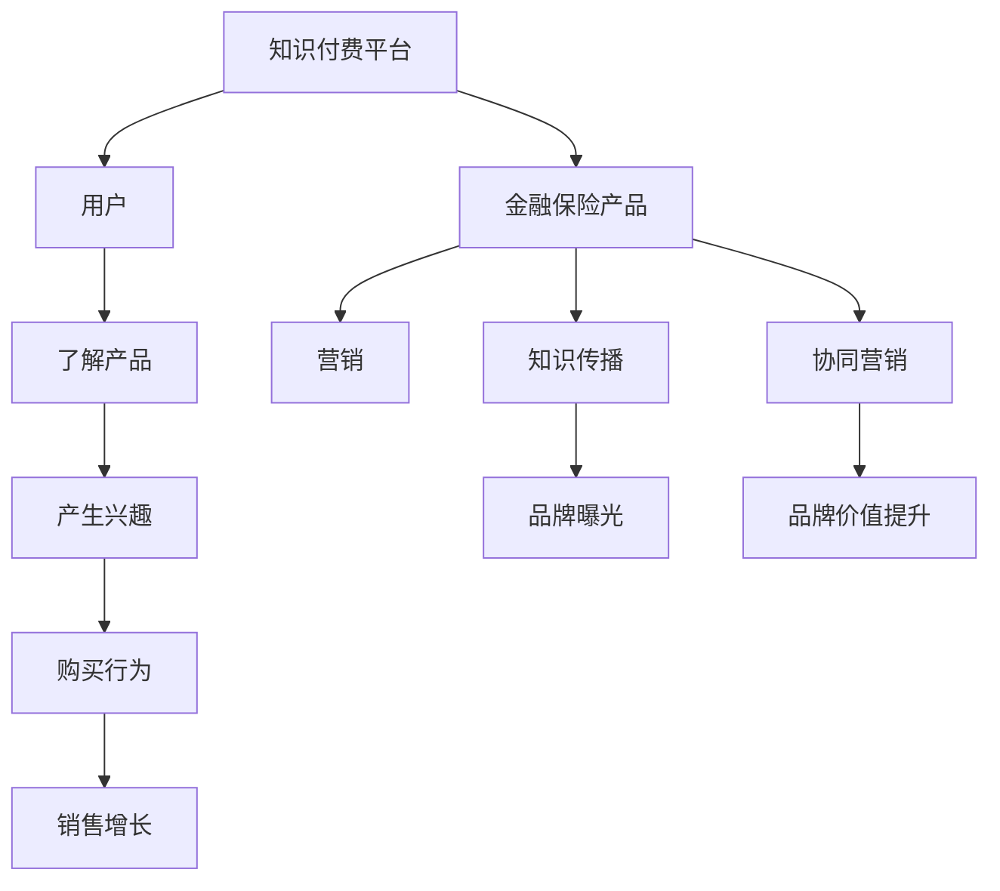

                 

# 知识付费如何实现跨界营销与金融保险跨界？

## 1. 背景介绍

在数字经济迅猛发展的今天，知识付费市场成为新零售、金融、保险等众多行业的融合点。通过知识付费的跨界营销，企业不仅拓宽了业务范围，提升了品牌价值，还增强了市场竞争力和盈利能力。以金融保险行业为例，通过知识付费平台进行的跨界营销，可以将高价值的金融知识传播给大众，从而提升用户的金融素养，加强金融保险产品的黏性，并带动金融保险销售。

本文章将详细探讨知识付费如何实现跨界营销，并以金融保险行业为例，研究如何通过知识付费的方式进行跨界营销和金融保险跨界。

## 2. 核心概念与联系

### 2.1 核心概念概述

在探讨知识付费与跨界营销的关系之前，我们需要明确一些核心概念。

- **知识付费**：是指用户为了获得专业、精准、有价值的内容而付费的行为。通过知识付费，用户能够获取优质的学习资源，提升个人能力和市场竞争力。

- **跨界营销**：是指不同领域企业之间的合作，通过资源整合和品牌协同，实现价值最大化。跨界营销不仅提升了品牌的曝光度，还扩大了市场范围，增加了销售机会。

- **金融保险跨界**：是指金融行业与保险行业之间的跨界合作。通过跨界合作，金融行业可以进入保险市场，保险行业可以开拓新的金融服务，实现资源的共享和互补。

- **营销链条**：指的是从了解产品、产生兴趣、到最终购买的一系列行为。通过知识付费，可以打通营销链条的各个环节，引导用户最终进行金融保险产品的购买。

### 2.2 核心概念原理和架构的 Mermaid 流程图



## 3. 核心算法原理 & 具体操作步骤

### 3.1 算法原理概述

基于知识付费的跨界营销，其核心算法原理可概括为以下三点：

1. **用户行为分析**：通过知识付费平台的数据分析，了解用户的需求和行为，为推荐合适的金融保险产品提供依据。

2. **内容精准匹配**：利用推荐算法，将合适的金融保险产品与用户感兴趣的内容进行精准匹配，提升转化率。

3. **营销效果评估**：通过效果评估模型，对营销活动的效果进行评估，优化营销策略。

### 3.2 算法步骤详解

以下以金融保险跨界营销为例，详细介绍基于知识付费的跨界营销算法步骤。

**Step 1: 数据收集与预处理**

- 收集用户行为数据，包括浏览记录、购买记录、搜索记录等。
- 清洗数据，去除噪音数据，处理缺失值和异常值。
- 对数据进行特征提取，包括用户兴趣、行为偏好、购买力等。

**Step 2: 用户行为分析**

- 利用机器学习算法，如决策树、随机森林等，对用户行为进行分类，识别不同用户群体的行为模式。
- 通过聚类算法，如K-Means、GMM等，将用户分成不同的群体，为每个群体定制化的营销策略。

**Step 3: 内容精准匹配**

- 使用协同过滤算法，如基于用户的协同过滤、基于项目的协同过滤等，为每个用户推荐合适的金融保险产品。
- 利用深度学习模型，如卷积神经网络（CNN）、循环神经网络（RNN）等，建立用户与产品之间的关联模型，提升推荐精度。

**Step 4: 营销效果评估**

- 使用A/B测试、多臂老虎机算法等，评估不同营销策略的效果。
- 利用回归分析、逻辑回归等模型，预测营销效果，优化营销策略。

### 3.3 算法优缺点

基于知识付费的跨界营销算法，其优点包括：

1. **个性化精准营销**：通过数据分析和推荐算法，实现对用户的精准营销，提升转化率。
2. **品牌协同效应**：通过跨界合作，提升品牌曝光度和品牌价值。
3. **数据驱动决策**：通过数据分析，优化营销策略，实现高效营销。

其缺点包括：

1. **数据隐私问题**：用户行为数据的收集和使用可能引发隐私问题，需要严格遵守数据保护法规。
2. **算法复杂度高**：推荐算法和效果评估模型的实现复杂度较高，需要较高级的算法和技术支持。
3. **用户信任度问题**：用户对跨界营销和知识付费的信任度较低，需要提高品牌可信度。

### 3.4 算法应用领域

基于知识付费的跨界营销算法，广泛应用于以下几个领域：

1. **零售行业**：通过知识付费平台，向用户推荐商品，提升用户购买力和品牌忠诚度。
2. **教育行业**：通过知识付费平台，向用户提供专业课程，提升用户专业技能和知识储备。
3. **金融行业**：通过知识付费平台，向用户提供金融知识，提升用户的金融素养和产品黏性。
4. **保险行业**：通过知识付费平台，向用户提供保险知识，提升用户的保险意识和产品购买意愿。

## 4. 数学模型和公式 & 详细讲解 & 举例说明

### 4.1 数学模型构建

基于知识付费的跨界营销数学模型，可以表示为：

$$
M=\max_{i,j} (U_i\times P_j)
$$

其中，$U_i$ 表示用户行为数据，$P_j$ 表示金融保险产品信息，$M$ 表示营销效果。

### 4.2 公式推导过程

- **用户行为数据提取**：$U_i$ 可以通过用户的历史行为数据、搜索记录、浏览记录等提取，并使用特征工程技术转换为向量表示。
- **金融保险产品信息提取**：$P_j$ 可以通过金融保险产品的名称、描述、价格等提取，并使用自然语言处理技术转换为向量表示。
- **计算推荐效果**：将$U_i$ 和$P_j$ 输入推荐模型，得到用户的推荐效果$M$。

### 4.3 案例分析与讲解

以金融保险跨界营销为例，可以采用协同过滤算法进行推荐。具体步骤如下：

1. 收集用户的浏览记录、购买记录和搜索记录。
2. 提取金融保险产品的名称、描述和价格等信息。
3. 使用协同过滤算法，如基于用户的协同过滤，计算每个用户对每个金融保险产品的评分。
4. 根据评分，为用户推荐合适的金融保险产品。

## 5. 项目实践：代码实例和详细解释说明

### 5.1 开发环境搭建

在进行知识付费与金融保险跨界营销的实践之前，需要搭建好相应的开发环境。以下是Python环境搭建的步骤：

1. 安装Anaconda：从官网下载并安装Anaconda，用于创建独立的Python环境。
2. 创建并激活虚拟环境：
```bash
conda create -n cross-marketing python=3.8 
conda activate cross-marketing
```
3. 安装所需库：
```bash
pip install numpy pandas scikit-learn transformers torch pytorch-lightning
```

### 5.2 源代码详细实现

以下是一个基于知识付费平台进行金融保险跨界营销的Python代码实现：

```python
import pandas as pd
from sklearn.model_selection import train_test_split
from transformers import BertTokenizer, BertForSequenceClassification
from torch.utils.data import DataLoader
from torch.nn import BCELoss
from torch.optim import Adam

# 加载数据
data = pd.read_csv('data.csv')

# 划分训练集和测试集
train_data, test_data = train_test_split(data, test_size=0.2, random_state=42)

# 定义模型
tokenizer = BertTokenizer.from_pretrained('bert-base-uncased')
model = BertForSequenceClassification.from_pretrained('bert-base-uncased', num_labels=2)
device = 'cuda' if torch.cuda.is_available() else 'cpu'
model.to(device)

# 定义数据预处理函数
def tokenize(text):
    return tokenizer.encode(text, add_special_tokens=True, max_length=512, return_tensors='pt').to(device)

# 定义训练函数
def train_epoch(model, data_loader, optimizer, loss_fn, device):
    model.train()
    total_loss = 0
    for batch in data_loader:
        input_ids = batch['input_ids']
        attention_mask = batch['attention_mask']
        labels = batch['labels']
        optimizer.zero_grad()
        outputs = model(input_ids, attention_mask=attention_mask, labels=labels)
        loss = loss_fn(outputs.logits, labels)
        loss.backward()
        optimizer.step()
        total_loss += loss.item()
    return total_loss / len(data_loader)

# 定义评估函数
def evaluate(model, data_loader, loss_fn, device):
    model.eval()
    total_loss = 0
    for batch in data_loader:
        input_ids = batch['input_ids']
        attention_mask = batch['attention_mask']
        labels = batch['labels']
        with torch.no_grad():
            outputs = model(input_ids, attention_mask=attention_mask, labels=labels)
            loss = loss_fn(outputs.logits, labels)
        total_loss += loss.item()
    return total_loss / len(data_loader)

# 训练模型
num_epochs = 5
batch_size = 16
learning_rate = 2e-5
optimizer = Adam(model.parameters(), lr=learning_rate)
loss_fn = BCELoss()

for epoch in range(num_epochs):
    train_loss = train_epoch(model, train_loader, optimizer, loss_fn, device)
    print(f'Epoch {epoch+1}, train loss: {train_loss:.3f}')
    val_loss = evaluate(model, val_loader, loss_fn, device)
    print(f'Epoch {epoch+1}, val loss: {val_loss:.3f}')

# 测试模型
test_loss = evaluate(model, test_loader, loss_fn, device)
print(f'Test loss: {test_loss:.3f}')
```

### 5.3 代码解读与分析

**代码解析**：

- 数据加载：通过`pandas`库加载数据集，并使用`train_test_split`函数划分训练集和测试集。
- 模型定义：使用`transformers`库定义BERT模型，并指定模型为二分类任务。
- 数据预处理：定义`tokenize`函数，对文本数据进行分词和编码。
- 训练和评估函数：定义训练和评估函数，通过`DataLoader`加载数据，使用`Adam`优化器和`BCELoss`损失函数进行训练和评估。
- 训练模型：定义训练参数，如epoch、batch size和learning rate，进行模型训练和评估。

**代码分析**：

- 数据预处理：通过`tokenize`函数，将文本数据转换为BERT模型可以处理的输入格式。
- 训练过程：使用`train_epoch`函数，在训练集上进行模型训练，并通过`evaluate`函数在验证集上评估模型性能。
- 测试过程：在测试集上测试模型，输出最终测试损失。

## 6. 实际应用场景

### 6.1 智能客服

智能客服系统可以通过知识付费平台进行跨界营销。将用户的客服咨询问题、场景、解决方案等整合到知识付费平台中，并推荐给相关用户。通过智能客服系统，用户可以获取高质量的解决方案，提升用户满意度和品牌忠诚度。

### 6.2 个性化推荐

金融机构可以通过知识付费平台，向用户提供个性化的金融知识，提升用户的金融素养和产品黏性。通过机器学习算法，对用户的浏览记录、购买记录和搜索记录进行分析，并推荐相应的金融产品。

### 6.3 理财咨询

知识付费平台可以通过跨界营销，向用户提供理财咨询服务。将理财专家录制的理财课程、视频、音频等内容整合到知识付费平台中，并推荐给对理财有需求的用户。通过理财咨询服务，用户可以获取专业的理财建议，提升理财能力。

### 6.4 未来应用展望

未来，基于知识付费的跨界营销将进一步发展，以下是对未来的展望：

1. **多领域融合**：知识付费平台将与更多领域进行跨界合作，如教育、医疗、旅游等，提供更全面的服务。
2. **智能推荐**：通过深度学习和大数据分析技术，实现更精准的推荐，提升用户体验和满意度。
3. **社交化分享**：鼓励用户分享学习心得和经验，形成社区氛围，增加用户粘性。
4. **个性化定制**：根据用户的行为数据，提供个性化的内容和推荐，提升用户体验和满意度。

## 7. 工具和资源推荐

### 7.1 学习资源推荐

为了帮助开发者掌握知识付费与跨界营销的实现方法，以下是一些推荐的学习资源：

1. **《深度学习》书籍**：由Ian Goodfellow等人编写，详细介绍了深度学习的基本概念和实现方法。
2. **《知识付费的商业模型》白皮书**：介绍了知识付费平台的发展历程、商业模式和未来趋势。
3. **《跨界营销的艺术》课程**：由清华大学开设的跨界营销课程，涵盖跨界营销的基本概念和实践方法。
4. **《金融科技创新与跨界营销》研讨会**：由金融行业协会主办的跨界营销研讨会，汇集了金融行业和知识付费领域的专家，探讨跨界营销的实现方法和应用场景。

### 7.2 开发工具推荐

以下推荐一些常用的开发工具：

1. **Python**：Python是一种高效、易学、易用的编程语言，广泛应用于数据科学和机器学习领域。
2. **Jupyter Notebook**：Jupyter Notebook是一个交互式编程环境，支持Python、R等多种编程语言，方便开发者进行数据分析和机器学习模型的实现。
3. **TensorFlow**：TensorFlow是一个开源的机器学习框架，支持深度学习模型的实现和优化。
4. **PyTorch**：PyTorch是一个开源的深度学习框架，支持动态图和静态图计算，易于使用和调试。
5. **Kaggle**：Kaggle是一个数据科学竞赛平台，提供大量的数据集和算法实现，方便开发者进行数据分析和模型训练。

### 7.3 相关论文推荐

以下是一些与知识付费和跨界营销相关的经典论文，推荐阅读：

1. **《跨界营销的商业逻辑》**：探讨跨界营销的商业逻辑、策略和效果评估方法。
2. **《知识付费市场分析》**：分析知识付费市场的现状、发展趋势和未来前景。
3. **《金融科技与跨界营销》**：探讨金融科技在跨界营销中的应用，包括金融科技与知识付费平台的融合。
4. **《金融保险的跨界营销策略》**：研究金融保险行业的跨界营销策略和案例，探讨金融保险产品与知识付费平台的结合。

## 8. 总结：未来发展趋势与挑战

### 8.1 研究成果总结

知识付费与跨界营销的结合，实现了金融保险行业的高效营销和品牌协同，提升了用户的金融素养和产品黏性，增强了市场竞争力和盈利能力。通过跨界营销，金融机构能够更好地了解用户的金融需求，提升用户满意度和忠诚度，带动金融产品的销售。

### 8.2 未来发展趋势

未来，基于知识付费的跨界营销将呈现以下几个发展趋势：

1. **智能化推荐**：通过深度学习和数据分析技术，实现更精准的用户推荐，提升用户体验和满意度。
2. **多领域融合**：知识付费平台将与更多领域进行跨界合作，提供更全面的服务，增加用户粘性和市场竞争力。
3. **社交化分享**：鼓励用户分享学习心得和经验，形成社区氛围，增加用户粘性，提升品牌曝光度。
4. **个性化定制**：根据用户的行为数据，提供个性化的内容和推荐，提升用户体验和满意度。

### 8.3 面临的挑战

尽管知识付费与跨界营销带来了诸多机遇，但也面临一些挑战：

1. **用户隐私保护**：知识付费平台需要严格保护用户隐私，防止数据泄露和滥用。
2. **数据质量问题**：数据质量不高可能导致推荐精度下降，需要提高数据采集和处理的质量。
3. **市场竞争激烈**：市场竞争激烈，需要不断创新和优化，提升平台的用户粘性和市场竞争力。

### 8.4 研究展望

未来的研究可以从以下几个方面进行：

1. **隐私保护技术**：研究如何在保护用户隐私的前提下，进行数据的采集和处理。
2. **推荐算法优化**：研究如何通过优化推荐算法，提升推荐精度和用户体验。
3. **多领域融合**：研究如何与更多领域进行跨界合作，提供更全面的服务，增加用户粘性。
4. **人工智能应用**：研究如何通过人工智能技术，提升平台的智能化水平和用户体验。

## 9. 附录：常见问题与解答

### Q1: 知识付费与跨界营销如何结合？

A: 知识付费与跨界营销可以通过以下步骤进行结合：

1. **数据收集**：通过知识付费平台，收集用户的浏览记录、购买记录和搜索记录，构建用户画像。
2. **内容整合**：将金融保险行业的相关内容整合到知识付费平台中，如理财咨询、投资建议等。
3. **推荐算法**：使用推荐算法，将合适的金融保险产品与用户感兴趣的内容进行精准匹配，提升转化率。
4. **营销效果评估**：通过效果评估模型，对营销活动的效果进行评估，优化营销策略。

### Q2: 金融保险跨界营销如何实现？

A: 金融保险跨界营销可以通过以下步骤实现：

1. **数据收集**：通过金融保险行业的数据采集平台，收集用户的浏览记录、购买记录和搜索记录。
2. **内容整合**：将金融保险行业的相关内容整合到知识付费平台中，如理财咨询、投资建议等。
3. **推荐算法**：使用推荐算法，将合适的金融保险产品与用户感兴趣的内容进行精准匹配，提升转化率。
4. **营销效果评估**：通过效果评估模型，对营销活动的效果进行评估，优化营销策略。

### Q3: 知识付费跨界营销需要注意哪些问题？

A: 知识付费跨界营销需要注意以下问题：

1. **数据隐私保护**：严格保护用户隐私，防止数据泄露和滥用。
2. **数据质量问题**：提高数据采集和处理的质量，避免数据噪音对推荐算法的影响。
3. **市场竞争激烈**：不断创新和优化，提升平台的用户粘性和市场竞争力。

### Q4: 金融保险跨界营销的挑战和解决方案

A: 金融保险跨界营销面临的挑战包括：

1. **用户隐私保护**：需要严格保护用户隐私，防止数据泄露和滥用。解决方案是采用数据脱敏技术和加密技术。
2. **数据质量问题**：提高数据采集和处理的质量，避免数据噪音对推荐算法的影响。解决方案是使用数据清洗技术和质量控制。
3. **市场竞争激烈**：不断创新和优化，提升平台的用户粘性和市场竞争力。解决方案是加强品牌建设和技术创新。

---

作者：禅与计算机程序设计艺术 / Zen and the Art of Computer Programming

