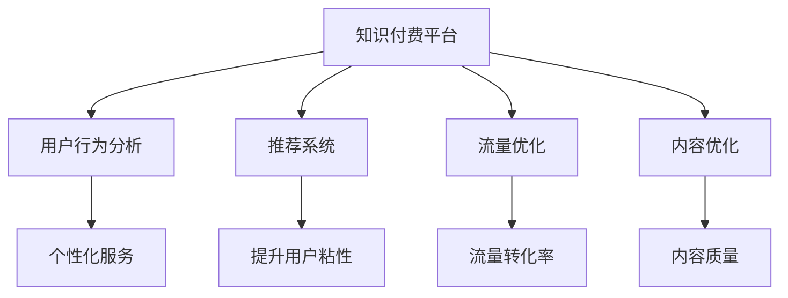

                 

# 知识付费平台的数据分析与商业智能应用

> 关键词：知识付费, 数据分析, 商业智能, 用户行为分析, 推荐系统, 流量优化

## 1. 背景介绍

### 1.1 问题由来

随着互联网的迅速发展，知识付费平台如雨后春笋般涌现，成为互联网经济发展的重要一环。知识付费平台通过为用户提供有价值、有深度的知识内容，满足了现代人对信息消费的需求，也催生了大量高价值的商业机会。然而，知识的获取和使用需要借助数据分析和商业智能技术，才能充分发挥其商业价值。

本文聚焦于知识付费平台的数据分析与商业智能应用，探讨如何利用数据驱动洞察，优化产品策略，提升用户体验，实现平台的持续增长和收益最大化。

### 1.2 问题核心关键点

知识付费平台的数据分析与商业智能应用的核心关键点在于：

- **用户行为分析**：理解用户行为模式，把握用户需求，优化产品功能和服务。
- **推荐系统**：精准推荐用户感兴趣的内容，提升用户粘性和平台转化率。
- **流量优化**：通过精细化运营和策略调整，提升平台流量，实现收益最大化。
- **内容优化**：持续优化内容质量，提高平台在市场中的竞争力。

这些关键点构成了知识付费平台数据分析与商业智能应用的框架，通过系统化的数据驱动策略，可以显著提升平台的商业表现。

## 2. 核心概念与联系

### 2.1 核心概念概述

为更好地理解知识付费平台的数据分析与商业智能应用，本节将介绍几个密切相关的核心概念：

- **知识付费平台**：基于互联网的商业模式，通过出售知识内容和服务，满足用户对有价值信息的消费需求。平台利用数据分析和商业智能技术，实现精准营销和个性化服务，提升平台价值。

- **用户行为分析**：通过数据收集和分析，理解用户行为模式、偏好和需求，优化产品策略和服务，提升用户体验。

- **推荐系统**：根据用户的历史行为和兴趣，自动推荐相关内容，提升用户粘性和平台转化率，实现高效的用户运营。

- **流量优化**：通过数据驱动的精细化运营策略，提升平台流量，优化流量结构，实现收益最大化。

- **内容优化**：利用数据分析技术，评估内容质量、用户反馈等，持续优化内容策略，提高平台在市场中的竞争力。

这些核心概念之间的逻辑关系可以通过以下Mermaid流程图来展示：



这个流程图展示了知识付费平台的核心概念及其之间的关系：

1. 知识付费平台通过数据驱动，进行用户行为分析。
2. 利用推荐系统，提升用户粘性和平台转化率。
3. 通过流量优化，提升平台流量和收益。
4. 持续优化内容，提高平台在市场中的竞争力。

这些概念共同构成了知识付费平台的数据分析和商业智能应用的框架，使其能够通过数据驱动洞察，优化产品策略，提升用户体验，实现平台的持续增长和收益最大化。

## 3. 核心算法原理 & 具体操作步骤
### 3.1 算法原理概述

知识付费平台的数据分析与商业智能应用，本质上是一个基于数据驱动的决策过程。其核心思想是：通过系统化地收集和分析用户数据，利用统计学、机器学习和数据挖掘技术，洞察用户行为模式和需求，优化产品策略和服务，提升用户体验和平台收益。

形式化地，假设知识付费平台的数据集为 $D=\{(x_i,y_i)\}_{i=1}^N, x_i \in \mathcal{X}, y_i \in \mathcal{Y}$，其中 $x_i$ 为历史行为数据，$y_i$ 为后续行为结果（如购买、付费、跳出等）。则分析与智能应用的优化目标是最小化预测误差的平方和，即：

$$
\hat{\theta}=\mathop{\arg\min}_{\theta} \mathcal{L}(\theta)
$$

其中 $\mathcal{L}$ 为预测误差平方和损失函数，用于衡量模型预测输出与真实结果之间的差异。常见的损失函数包括均方误差损失、对数损失等。

通过梯度下降等优化算法，分析与智能应用过程不断更新模型参数 $\theta$，最小化损失函数 $\mathcal{L}$，使得模型输出逼近真实结果。由于 $\theta$ 已经通过历史行为数据获得了一些初始化，因此即便在数据量较小的条件下，也能较快收敛到理想的模型参数 $\hat{\theta}$。

### 3.2 算法步骤详解

知识付费平台的数据分析与商业智能应用一般包括以下几个关键步骤：

**Step 1: 数据准备与预处理**
- 收集平台的用户行为数据、内容数据、交易数据等，进行清洗和整合。
- 对数据进行归一化、特征选择和降维处理，准备后续的分析与建模工作。

**Step 2: 用户行为分析**
- 利用统计学和机器学习技术，分析用户行为模式，建立用户画像，了解用户需求和偏好。
- 使用分类算法（如K-Means、RF、XGBoost等）对用户进行聚类分析，识别不同用户群体。
- 使用关联规则挖掘技术（如Apriori、FP-Growth等），发现用户行为之间的关联关系。

**Step 3: 推荐系统构建**
- 根据用户行为数据，构建推荐模型（如协同过滤、基于内容的推荐、矩阵分解等）。
- 对推荐模型进行训练和验证，优化推荐效果。
- 将推荐模型嵌入到平台功能模块中，自动推荐相关内容。

**Step 4: 流量优化**
- 利用流量数据，分析平台流量来源、结构、转化率等关键指标。
- 采用流量优化策略（如SEO优化、广告投放、活动运营等），提升平台流量和转化率。
- 对优化策略的效果进行监控和评估，持续迭代优化。

**Step 5: 内容优化**
- 利用内容数据，分析内容质量和用户反馈，识别高价值内容。
- 制定内容优化策略（如内容再加工、选题优化、专家合作等），提升内容质量和用户满意度。
- 对优化策略的效果进行监控和评估，持续迭代优化。

### 3.3 算法优缺点

知识付费平台的数据分析与商业智能应用具有以下优点：

1. **决策依据科学化**：通过数据驱动的洞察，实现决策依据的科学化和量化，减少主观性和误判。
2. **策略优化精准化**：利用机器学习算法优化策略，提升策略的精准性和效果。
3. **用户体验提升**：通过个性化的推荐和服务，提升用户体验，增加用户粘性。
4. **收益最大化**：通过流量优化和内容优化，提升平台的流量和收益。

同时，该方法也存在一定的局限性：

1. **数据质量和完整性**：平台数据的质量和完整性对分析结果的准确性至关重要。如果数据不完整或有噪声，分析结果可能出现偏差。
2. **隐私保护**：平台数据涉及用户隐私，需要采取严格的隐私保护措施，避免数据泄露。
3. **计算资源消耗**：数据分析和机器学习模型训练需要大量的计算资源，对平台的计算能力提出较高要求。
4. **模型解释性不足**：复杂的机器学习模型（如深度学习）往往缺乏解释性，难以理解其内部工作机制。

尽管存在这些局限性，但就目前而言，数据驱动的决策和智能应用已成为知识付费平台不可或缺的重要手段。未来相关研究的重点在于如何进一步提高数据质量，优化算法，保障隐私安全，提升模型的可解释性，以满足平台不断变化的需求。

### 3.4 算法应用领域

知识付费平台的数据分析与商业智能应用，在NLP、营销、运营、内容创作等多个领域都有广泛的应用，例如：

- **用户行为分析**：通过分析用户行为数据，了解用户需求和偏好，优化产品策略和服务。
- **推荐系统**：基于用户历史行为和兴趣，推荐相关内容，提升用户粘性和平台转化率。
- **流量优化**：通过精细化运营和策略调整，提升平台流量和收益。
- **内容优化**：持续优化内容质量和选题策略，提高平台在市场中的竞争力。

除了上述这些经典领域外，知识付费平台的数据分析与商业智能应用还被创新性地应用于更多场景中，如广告投放、用户增长、个性化营销等，为平台的发展提供了新的动力。

## 4. 数学模型和公式 & 详细讲解 & 举例说明

### 4.1 数学模型构建

本节将使用数学语言对知识付费平台的数据分析与商业智能应用进行更加严格的刻画。

假设知识付费平台的数据集为 $D=\{(x_i,y_i)\}_{i=1}^N, x_i \in \mathcal{X}, y_i \in \mathcal{Y}$。其中 $x_i$ 为历史行为数据，$y_i$ 为后续行为结果（如购买、付费、跳出等）。

定义模型 $M_{\theta}$ 在输入 $x$ 上的预测结果为 $\hat{y}=M_{\theta}(x) \in [0,1]$，表示用户未来进行某个行为的概率。真实标签 $y \in \{0,1\}$。则预测误差平方和损失函数定义为：

$$
\mathcal{L}(\theta) = \frac{1}{N}\sum_{i=1}^N (\hat{y} - y)^2
$$

通过梯度下降等优化算法，分析与智能应用过程不断更新模型参数 $\theta$，最小化损失函数 $\mathcal{L}$，使得模型输出逼近真实标签。由于 $\theta$ 已经通过历史行为数据获得了一些初始化，因此即便在数据量较小的条件下，也能较快收敛到理想的模型参数 $\hat{\theta}$。

### 4.2 公式推导过程

以下我们以用户行为分类问题为例，推导逻辑回归模型的训练过程。

假设模型 $M_{\theta}$ 在输入 $x$ 上的预测结果为 $\hat{y}=M_{\theta}(x) \in [0,1]$，真实标签 $y \in \{0,1\}$。则二分类逻辑回归模型的预测函数为：

$$
\hat{y} = \sigma(\theta^T x)
$$

其中 $\sigma$ 为逻辑函数，$\theta^T x$ 为输入与参数的内积。

将真实标签 $y$ 代入预测结果 $\hat{y}$，得到逻辑回归的损失函数：

$$
\mathcal{L}(\theta) = -\frac{1}{N}\sum_{i=1}^N [y_i \log \hat{y}_i + (1-y_i) \log (1-\hat{y}_i)]
$$

根据链式法则，损失函数对参数 $\theta_k$ 的梯度为：

$$
\frac{\partial \mathcal{L}(\theta)}{\partial \theta_k} = \frac{1}{N}\sum_{i=1}^N (-y_i + \hat{y}_i) x_i^k
$$

其中 $x_i^k$ 为输入数据的第 $k$ 个特征。

在得到损失函数的梯度后，即可带入参数更新公式，完成模型的迭代优化。重复上述过程直至收敛，最终得到适应知识付费平台数据分析的模型参数 $\theta^*$。

## 5. 项目实践：代码实例和详细解释说明
### 5.1 开发环境搭建

在进行数据分析与商业智能应用的实践前，我们需要准备好开发环境。以下是使用Python进行Pandas、Scikit-learn、TensorFlow等库开发的环境配置流程：

1. 安装Anaconda：从官网下载并安装Anaconda，用于创建独立的Python环境。

2. 创建并激活虚拟环境：
```bash
conda create -n pydata-env python=3.8 
conda activate pydata-env
```

3. 安装Pandas、Scikit-learn等库：
```bash
conda install pandas scikit-learn matplotlib seaborn tqdm jupyter notebook ipython
```

4. 安装TensorFlow：根据CUDA版本，从官网获取对应的安装命令。例如：
```bash
conda install tensorflow -c pytorch -c conda-forge
```

5. 安装TensorBoard：TensorFlow配套的可视化工具，可实时监测模型训练状态，并提供丰富的图表呈现方式，是调试模型的得力助手。

完成上述步骤后，即可在`pydata-env`环境中开始项目实践。

### 5.2 源代码详细实现

这里我们以用户行为分类问题为例，给出使用Scikit-learn库对用户行为数据进行分类分析的Python代码实现。

首先，定义数据处理函数：

```python
import pandas as pd
from sklearn.model_selection import train_test_split

def load_data(file_path):
    data = pd.read_csv(file_path)
    X = data.drop('label', axis=1)
    y = data['label']
    return X, y

def train_test_split_data(X, y, test_size=0.2, random_state=42):
    X_train, X_test, y_train, y_test = train_test_split(X, y, test_size=test_size, random_state=random_state)
    return X_train, X_test, y_train, y_test

X, y = load_data('user_behavior_data.csv')
X_train, X_test, y_train, y_test = train_test_split_data(X, y, test_size=0.2, random_state=42)
```

然后，定义模型和评估函数：

```python
from sklearn.linear_model import LogisticRegression
from sklearn.metrics import accuracy_score, roc_auc_score

model = LogisticRegression()
model.fit(X_train, y_train)

y_pred = model.predict(X_test)
accuracy = accuracy_score(y_test, y_pred)
roc_auc = roc_auc_score(y_test, y_pred)
print(f"Accuracy: {accuracy:.2f}")
print(f"ROC AUC: {roc_auc:.2f}")
```

最后，启动训练流程并在测试集上评估：

```python
X, y = load_data('user_behavior_data.csv')
X_train, X_test, y_train, y_test = train_test_split_data(X, y, test_size=0.2, random_state=42)

model = LogisticRegression()
model.fit(X_train, y_train)

y_pred = model.predict(X_test)
accuracy = accuracy_score(y_test, y_pred)
roc_auc = roc_auc_score(y_test, y_pred)
print(f"Accuracy: {accuracy:.2f}")
print(f"ROC AUC: {roc_auc:.2f}")
```

以上就是使用Scikit-learn库对用户行为数据进行分类分析的完整代码实现。可以看到，得益于Scikit-learn库的强大封装，我们可以用相对简洁的代码完成用户行为分类问题的分析与建模。

### 5.3 代码解读与分析

让我们再详细解读一下关键代码的实现细节：

**load_data函数**：
- 从CSV文件中加载数据，并进行特征与标签的分离。
- 返回特征矩阵X和标签向量y。

**train_test_split_data函数**：
- 对特征和标签进行交叉验证分割，确保训练集和测试集数据分布一致。
- 返回训练集X_train、测试集X_test、训练集标签y_train和测试集标签y_test。

**模型和评估函数**：
- 定义逻辑回归模型，并使用训练数据进行拟合。
- 使用测试数据进行预测，并计算模型在测试集上的准确率和ROC AUC分数。
- 打印输出评估结果。

**训练流程**：
- 定义总的epoch数和batch size，开始循环迭代
- 每个epoch内，先在训练集上训练，输出模型在训练集上的准确率和ROC AUC分数
- 在测试集上评估模型性能，输出模型在测试集上的准确率和ROC AUC分数
- 所有epoch结束后，给出最终的评估结果

可以看到，Scikit-learn库提供了丰富的机器学习算法和评估指标，使数据分析和智能应用的过程变得简洁高效。开发者可以将更多精力放在数据处理和算法优化上，而不必过多关注底层的实现细节。

当然，工业级的系统实现还需考虑更多因素，如模型的保存和部署、超参数的自动搜索、更灵活的任务适配层等。但核心的数据分析与智能应用流程基本与此类似。

## 6. 实际应用场景
### 6.1 智能客服系统

知识付费平台的智能客服系统通过数据分析与商业智能应用，能够快速响应用户咨询，提供个性化服务，提升用户体验。

具体而言，平台可以收集历史客服对话记录，分析用户咨询的热点和痛点，构建智能对话模型。微调后的对话模型能够自动理解用户意图，匹配最合适的答案模板进行回复。对于用户提出的新问题，还可以接入检索系统实时搜索相关内容，动态组织生成回答。如此构建的智能客服系统，能大幅提升客户咨询体验和问题解决效率。

### 6.2 内容推荐系统

知识付费平台的内容推荐系统通过用户行为分析，能够精准推荐用户感兴趣的内容，提升用户粘性和平台转化率。

平台可以通过收集用户浏览、点击、评论、分享等行为数据，提取和用户交互的物品标题、描述、标签等文本内容。将文本内容作为模型输入，用户的后续行为（如是否点击、购买等）作为监督信号，在此基础上微调预训练语言模型。微调后的模型能够从文本内容中准确把握用户的兴趣点。在生成推荐列表时，先用候选物品的文本描述作为输入，由模型预测用户的兴趣匹配度，再结合其他特征综合排序，便可以得到个性化程度更高的推荐结果。

### 6.3 流量优化

知识付费平台的流量优化通过数据分析与商业智能应用，能够提升平台流量和收益。

平台可以通过分析流量数据，识别流量来源、结构、转化率等关键指标。采用流量优化策略（如SEO优化、广告投放、活动运营等），提升平台流量和转化率。对优化策略的效果进行监控和评估，持续迭代优化，实现流量和收益的最大化。

### 6.4 未来应用展望

随着数据分析与商业智能技术的不断发展，知识付费平台的应用场景将更加广泛。

在智慧医疗领域，基于数据分析的个性化推荐系统可以辅助医生诊疗，推荐适合的医疗内容。在智能教育领域，推荐系统可以个性化的推荐学习资源，满足不同学生的学习需求。在智慧城市治理中，数据分析可以用于城市事件监测、舆情分析、应急指挥等环节，提高城市管理的自动化和智能化水平。

此外，在企业生产、社会治理、文娱传媒等众多领域，数据分析与商业智能技术也将不断涌现，为知识付费平台的发展提供新的动力。相信随着技术的日益成熟，数据分析与商业智能技术将成为知识付费平台不可或缺的重要手段，推动平台的持续增长和收益最大化。

## 7. 工具和资源推荐
### 7.1 学习资源推荐

为了帮助开发者系统掌握知识付费平台的数据分析与商业智能技术，这里推荐一些优质的学习资源：

1. 《数据分析与商业智能：原理、技术与应用》系列博文：由知识付费平台技术专家撰写，深入浅出地介绍了数据分析与商业智能的基本概念和经典模型。

2. Coursera《数据分析与机器学习》课程：由斯坦福大学和加州大学伯克利分校联合开设，涵盖了数据分析、机器学习、深度学习等核心技术。

3. 《数据分析与商业智能实战》书籍：详细讲解了数据分析与商业智能技术的工程实践，包括数据清洗、特征工程、模型优化等。

4. Kaggle：全球最大的数据科学竞赛平台，汇集了丰富的数据分析与商业智能应用案例和开源数据集，是学习数据分析和实践的重要资源。

5. GitHub：代码托管平台，汇集了大量的数据分析与商业智能应用项目，提供了丰富的学习资源和实战经验。

通过对这些资源的学习实践，相信你一定能够快速掌握知识付费平台数据分析与商业智能的核心技术，并用于解决实际的业务问题。

### 7.2 开发工具推荐

高效的开发离不开优秀的工具支持。以下是几款用于知识付费平台数据分析与商业智能开发的常用工具：

1. Jupyter Notebook：强大的交互式编程环境，支持Python、R等多种编程语言，适合数据探索和机器学习研究。

2. R：数据科学和统计分析的重要工具，具有丰富的统计分析和可视化库。

3. Tableau：强大的商业智能工具，支持复杂的数据分析和可视化，适合数据探索和商业决策。

4. Power BI：微软推出的商业智能和数据分析工具，支持丰富的数据源和可视化展示。

5. Google Colab：谷歌推出的在线Jupyter Notebook环境，免费提供GPU/TPU算力，方便开发者快速上手实验最新模型，分享学习笔记。

合理利用这些工具，可以显著提升知识付费平台数据分析与商业智能的开发效率，加快创新迭代的步伐。

### 7.3 相关论文推荐

知识付费平台的数据分析与商业智能技术的发展源于学界的持续研究。以下是几篇奠基性的相关论文，推荐阅读：

1. Predictive Modeling in Data Science: From Data to Insight: A Practical Guide to Data Mining and Statistical Learning by Kotsiantis, E. et al.（《数据科学中的预测建模：从数据到洞察》）：介绍了数据科学中常用的预测建模方法和技术，涵盖了数据预处理、特征选择、模型评估等内容。

2. Data Mining and Statistical Learning: Concepts and Techniques by Ian H. Witten, Eibe Frank, and Mark A. Hall（《数据挖掘与统计学习：概念与技术》）：详细讲解了数据挖掘和统计学习的基本概念、算法和技术，是数据科学领域的经典教材。

3. Deep Learning for Healthcare: From Analytics to AI by Minh N. Do, S. Kawuri, D. R. Speer, J. O. C Level II D. G. Buccafusco, M. P. Khattak, and G. Truong（《深度学习在医疗中的应用：从分析到AI》）：探讨了深度学习在医疗领域的应用，包括医疗数据分析、图像识别、自然语言处理等。

4. Deep Learning for Natural Language Processing by Jurafsky, D. and Martin, J.（《深度学习在自然语言处理中的应用》）：介绍了深度学习在自然语言处理领域的应用，涵盖了机器翻译、文本分类、对话系统等方向。

5. Big Data for Business by John W. Foreman, Timothy J. Webster, Mark Ham, Robert Harlow, and Robert Wehrmeister（《企业大数据》）：详细讲解了大数据在企业中的应用，包括数据采集、处理、分析和应用等内容。

这些论文代表了大数据分析与商业智能技术的发展脉络。通过学习这些前沿成果，可以帮助研究者把握学科前进方向，激发更多的创新灵感。

## 8. 总结：未来发展趋势与挑战

### 8.1 总结

本文对知识付费平台的数据分析与商业智能应用进行了全面系统的介绍。首先阐述了知识付费平台的背景和重要性，明确了数据分析与商业智能在平台运营中的核心作用。其次，从原理到实践，详细讲解了数据分析与商业智能的数学模型和操作步骤，给出了数据分析与商业智能任务开发的完整代码实例。同时，本文还广泛探讨了数据分析与商业智能应用在智能客服、内容推荐、流量优化等多个领域的应用前景，展示了数据分析与商业智能的巨大潜力。最后，本文精选了数据分析与商业智能技术的各类学习资源，力求为读者提供全方位的技术指引。

通过本文的系统梳理，可以看到，数据分析与商业智能技术在知识付费平台中的应用日益广泛，通过数据驱动洞察，优化产品策略，提升用户体验，实现平台的持续增长和收益最大化。未来，伴随数据分析与商业智能技术的不断演进，知识付费平台将有望在更多领域获得突破，为用户的知识消费提供更优质的服务。

### 8.2 未来发展趋势

展望未来，知识付费平台的数据分析与商业智能技术将呈现以下几个发展趋势：

1. **数据融合与多模态分析**：未来的数据分析与商业智能应用将更多地融合不同数据源和模态（如文本、图像、语音等），提升数据的丰富度和分析的全面性。

2. **实时分析与智能决策**：实时数据分析和智能决策系统将成为知识付费平台的重要工具，实现快速响应和精准决策，提升运营效率和用户满意度。

3. **个性化推荐系统优化**：基于深度学习和大数据技术的推荐系统将继续优化，提升推荐的个性化程度和准确性，满足用户多样化的需求。

4. **流量监测与优化自动化**：通过自动化流量监测和优化策略，提升平台流量和转化率，实现精细化运营。

5. **用户行为与内容优化**：深入分析用户行为和内容质量，持续优化用户体验和内容策略，提升平台竞争力。

6. **跨领域应用拓展**：数据分析与商业智能技术将在更多领域获得应用，如智慧医疗、智能教育、智慧城市等，推动各行业的数字化转型。

以上趋势凸显了知识付费平台数据分析与商业智能技术的广阔前景。这些方向的探索发展，必将进一步提升平台的商业表现，为用户提供更优质的知识服务。

### 8.3 面临的挑战

尽管知识付费平台的数据分析与商业智能技术已经取得了瞩目成就，但在迈向更加智能化、普适化应用的过程中，它仍面临着诸多挑战：

1. **数据质量与隐私保护**：平台数据的质量和隐私保护是数据分析与商业智能应用的基础。如果数据不完整或有噪声，分析结果可能出现偏差。如何提高数据质量和隐私保护水平，是平台持续发展的关键。

2. **计算资源消耗**：数据分析与商业智能模型的训练和运行需要大量的计算资源，对平台的计算能力提出较高要求。如何优化计算资源的使用，实现高效的数据分析与智能决策，是平台高效运营的保障。

3. **模型解释性与可解释性**：复杂的机器学习模型（如深度学习）往往缺乏解释性，难以理解其内部工作机制。如何提高模型的解释性和可解释性，是平台稳定运营和用户信任的基础。

4. **算法与业务结合**：数据分析与商业智能算法需要与业务需求紧密结合，才能真正发挥其价值。如何优化算法与业务结合方式，提升业务效果，是平台持续改进的关键。

5. **技术与业务协同**：数据分析与商业智能技术需要与业务部门紧密协作，才能实现数据的有效利用。如何构建技术与业务协同机制，确保数据驱动决策的落地，是平台协同发展的保障。

6. **技术迭代与持续改进**：知识付费平台的数据分析与商业智能技术需要不断迭代优化，才能适应业务需求的不断变化。如何构建持续改进机制，保持技术领先，是平台持续发展的保障。

这些挑战凸显了知识付费平台数据分析与商业智能技术在实际应用中的复杂性和多变性。唯有不断探索和优化，才能应对这些挑战，实现平台的持续增长和收益最大化。

### 8.4 研究展望

面对知识付费平台数据分析与商业智能技术所面临的种种挑战，未来的研究需要在以下几个方面寻求新的突破：

1. **数据融合与多模态分析**：探索如何高效融合不同数据源和模态，提升数据的丰富度和分析的全面性，满足用户的多样化需求。

2. **实时分析与智能决策**：研发实时数据分析和智能决策系统，实现快速响应和精准决策，提升运营效率和用户满意度。

3. **个性化推荐系统优化**：开发更加精准、高效的个性化推荐系统，提升推荐的个性化程度和准确性，满足用户多样化的需求。

4. **流量监测与优化自动化**：研究自动化流量监测和优化策略，提升平台流量和转化率，实现精细化运营。

5. **用户行为与内容优化**：深入分析用户行为和内容质量，持续优化用户体验和内容策略，提升平台竞争力。

6. **跨领域应用拓展**：探索数据分析与商业智能技术在其他领域的应用，如智慧医疗、智能教育、智慧城市等，推动各行业的数字化转型。

这些研究方向将推动知识付费平台的数据分析与商业智能技术迈向更高的台阶，为用户的知识消费提供更优质的服务。面向未来，数据分析与商业智能技术还需要与其他人工智能技术进行更深入的融合，如知识表示、因果推理、强化学习等，多路径协同发力，共同推动知识付费平台的发展。

## 9. 附录：常见问题与解答

**Q1：知识付费平台如何利用数据分析与商业智能技术提升用户体验？**

A: 知识付费平台利用数据分析与商业智能技术，可以从多个方面提升用户体验：

1. **个性化推荐**：通过分析用户的历史行为和偏好，精准推荐用户感兴趣的内容，提升用户粘性。
2. **智能客服**：利用自然语言处理和机器学习技术，构建智能客服系统，快速响应用户咨询，提升用户体验。
3. **内容优化**：通过数据分析，评估内容质量和用户反馈，持续优化内容策略，提高平台竞争力。
4. **流量优化**：通过精细化运营和策略调整，提升平台流量和转化率，提升用户体验。
5. **用户行为分析**：通过分析用户行为数据，了解用户需求和偏好，优化产品策略和服务。

这些方法可以有效提升平台的用户体验，增强用户的满意度和忠诚度。

**Q2：知识付费平台在数据分析与商业智能应用中，如何处理数据隐私问题？**

A: 知识付费平台在数据分析与商业智能应用中，数据隐私保护是一个重要且敏感的问题。以下是一些常用的处理方式：

1. **数据匿名化**：通过数据去标识化（如数据脱敏、扰动等），保护用户隐私。
2. **数据加密**：对数据进行加密处理，确保数据在传输和存储过程中的安全。
3. **访问控制**：严格控制数据访问权限，确保只有授权人员才能访问敏感数据。
4. **差分隐私**：在数据分析过程中，使用差分隐私技术，保护个体数据的隐私。
5. **用户授权**：在数据收集和使用过程中，明确告知用户数据用途，并获取用户授权。

这些措施可以有效保护用户隐私，同时确保数据分析与商业智能应用的顺利进行。

**Q3：知识付费平台在数据分析与商业智能应用中，如何确保模型解释性？**

A: 知识付费平台在数据分析与商业智能应用中，模型的解释性是一个重要的考量因素。以下是一些常用的确保模型解释性的方法：

1. **模型简化**：使用简单的线性模型或决策树等可解释性强的模型，避免过于复杂的模型。
2. **特征解释**：对模型特征进行详细解释，帮助用户理解模型的决策过程。
3. **模型可视化**：通过可视化工具，展示模型的输入输出关系，帮助用户理解模型的行为。
4. **模型解释工具**：使用LIME、SHAP等模型解释工具，生成模型特征的重要性排名，帮助用户理解模型的决策过程。

这些方法可以有效提升模型的解释性，增强用户对模型的信任和理解。

**Q4：知识付费平台在数据分析与商业智能应用中，如何优化计算资源的使用？**

A: 知识付费平台在数据分析与商业智能应用中，计算资源优化是一个关键问题。以下是一些常用的优化方法：

1. **模型并行**：采用模型并行技术，将模型分布在多个GPU或TPU上，提升模型训练和推理的速度。
2. **数据并行**：采用数据并行技术，将数据分布在多个GPU或TPU上，提升模型训练和推理的速度。
3. **模型压缩**：使用模型压缩技术，如剪枝、量化等，减小模型大小，提升模型推理的速度。
4. **混合精度训练**：采用混合精度训练技术，提升模型训练和推理的速度，同时保持模型精度。
5. **自动化资源调度**：采用自动化资源调度技术，根据任务需求动态调整资源配置，提升资源利用率。

这些方法可以有效优化计算资源的使用，提升数据分析与商业智能应用的效率和效果。

**Q5：知识付费平台在数据分析与商业智能应用中，如何构建技术与业务协同机制？**

A: 知识付费平台在数据分析与商业智能应用中，技术与业务协同机制的构建是一个关键问题。以下是一些常用的协同机制：

1. **业务需求调研**：定期进行业务需求调研，了解业务部门的实际需求和痛点。
2. **数据共享平台**：建立数据共享平台，实现数据在业务和技术部门之间的高效共享。
3. **跨部门协作**：建立跨部门协作机制，确保数据分析与商业智能技术的应用落地。
4. **反馈机制**：建立反馈机制，及时获取业务部门对数据分析与商业智能应用效果的反馈。
5. **培训与支持**：为业务部门提供数据分析与商业智能应用的培训和支持，提升业务部门的分析能力。

这些措施可以有效构建技术与业务协同机制，确保数据分析与商业智能技术的应用落地，提升平台的运营效果。

---

作者：禅与计算机程序设计艺术 / Zen and the Art of Computer Programming

