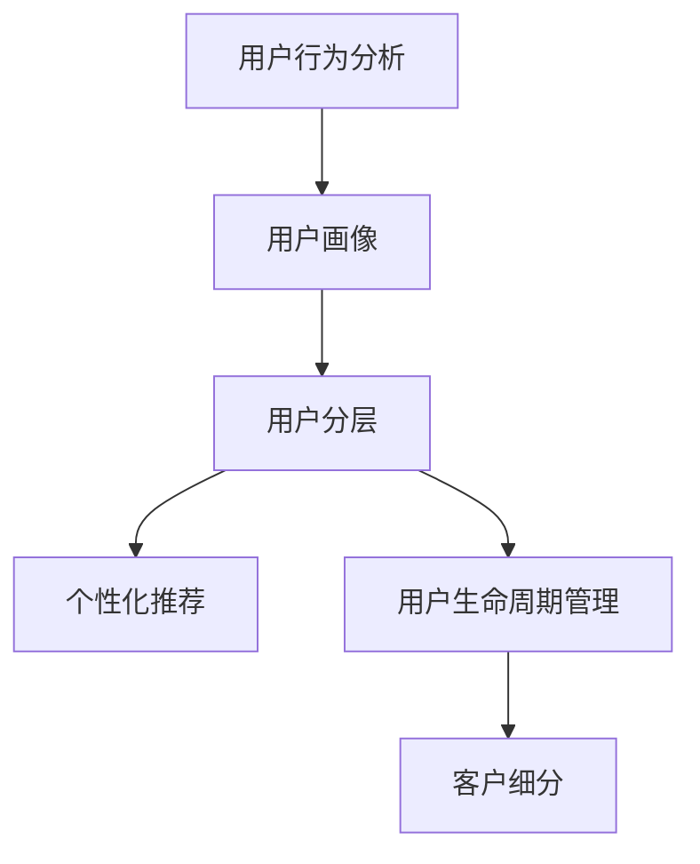

                 

# 知识付费平台的用户分层策略

## 1. 背景介绍

### 1.1 问题由来
随着互联网和数字技术的发展，知识付费平台如雨后春笋般涌现。这些平台通过整合优质内容，为用户提供专业的知识服务，满足其多样化、个性化的学习需求。然而，知识付费市场竞争激烈，用户留存率低，服务同质化严重，亟需创新的用户分层策略来提升用户粘性和平台收益。

### 1.2 问题核心关键点
用户分层策略是指根据用户行为、兴趣、消费习惯等维度将用户划分为不同层次，针对不同层次的用户提供差异化的服务和产品，从而实现精准营销、提升用户满意度和平台收益。核心关键点包括：
1. 如何定义用户分层维度？
2. 如何选择合适的用户分层算法？
3. 如何根据用户分层结果进行个性化推荐？
4. 如何评估分层策略的效果？

### 1.3 问题研究意义
通过深入研究用户分层策略，可以解决以下问题：
1. 提高用户留存率和活跃度，增加平台收入。
2. 优化资源配置，提升平台整体运营效率。
3. 实现更精准的个性化服务，提升用户体验。
4. 为未来的产品创新和市场拓展提供数据支持。

## 2. 核心概念与联系

### 2.1 核心概念概述

为更好地理解用户分层策略，本节将介绍几个密切相关的核心概念：

- **用户行为分析(Upper Behavior Analysis, UBA)**：通过分析用户的行为数据，如访问频率、互动时间、浏览路径等，了解用户偏好和需求。
- **用户画像(User Profile)**：根据用户行为、兴趣、人口统计信息等维度，刻画用户特征，形成用户画像。
- **用户分层(User Segmentation)**：根据用户画像，将用户划分为不同层次，便于进行针对性的服务设计。
- **个性化推荐(Personalized Recommendation)**：根据用户分层结果，针对不同层次用户提供差异化的内容推荐，提升用户体验。
- **用户生命周期管理(User Lifecycle Management, ULM)**：通过跟踪用户从加入平台到流失的整个过程，及时干预，提升用户忠诚度。
- **客户细分(Customer Segmentation)**：将用户按照业务需求或市场特征进行分类，进行更精细化的市场定位。

这些核心概念之间的逻辑关系可以通过以下Mermaid流程图来展示：



这个流程图展示了大规模用户分层策略的核心概念及其之间的关系：

1. 用户行为分析了解用户行为，形成基础的用户画像。
2. 用户画像进一步刻画用户特征，为后续用户分层奠定基础。
3. 用户分层根据画像结果，将用户划分为不同层次，进行差异化服务。
4. 个性化推荐根据分层结果，进行内容推荐，提升用户满意度和留存率。
5. 用户生命周期管理跟踪用户全生命周期，及时干预，提升用户忠诚度。
6. 客户细分针对业务需求或市场特征，进行更精细化的分类，指导市场策略。

这些概念共同构成了用户分层策略的理论框架，帮助平台从多维度对用户进行深入理解，从而提供更精准、有效的服务。

## 3. 核心算法原理 & 具体操作步骤
### 3.1 算法原理概述

用户分层策略的实现核心在于选择合适的用户分层算法，根据用户行为数据进行聚类分析，得到用户分层结果。常用的算法包括K-means、层次聚类、DBSCAN、高斯混合模型等。这里以K-means算法为例，介绍核心算法原理。

K-means算法是一种基于距离度量的聚类算法，其核心思想是将用户数据点划分为K个簇，使得簇内数据点相似度最大化，簇间数据点差异度最大化。具体步骤如下：

1. 随机选择K个初始质心。
2. 对于每个数据点，计算其到质心的距离，将其划分到最近的簇。
3. 重新计算每个簇的质心，作为下一次迭代的基础。
4. 重复步骤2和3，直到质心不再变化或达到预设迭代次数。

### 3.2 算法步骤详解

#### 3.2.1 数据准备
用户行为数据是用户分层的核心输入。数据通常包含用户的基本信息（如年龄、性别、职业等）、行为数据（如访问频率、浏览时长、互动次数等）、消费数据（如购买记录、付费金额等）。数据准备阶段需要进行数据清洗、去重、归一化等预处理工作，确保数据的准确性和一致性。

#### 3.2.2 特征选择
选择合适的特征是用户分层的关键。特征需要能够有效刻画用户行为和需求，且具有较高的区分度。常用的特征包括：
- 基本特征：如年龄、性别、职业等。
- 行为特征：如访问频率、浏览时长、互动次数等。
- 消费特征：如购买记录、付费金额、会员等级等。
- 组合特征：如访问频率和浏览时长之和等。

#### 3.2.3 模型训练
采用K-means算法对用户行为数据进行聚类分析。具体步骤如下：

1. 随机选择K个初始质心。
2. 对于每个数据点，计算其到质心的距离，将其划分到最近的簇。
3. 重新计算每个簇的质心，作为下一次迭代的基础。
4. 重复步骤2和3，直到质心不再变化或达到预设迭代次数。

#### 3.2.4 分层结果评估
评估用户分层的质量通常使用轮廓系数(Silhouette Coefficient)，其计算公式为：

$$
SC = \frac{(a-b)}{\max(a,b)}
$$

其中 $a$ 表示样本与所在簇内其他样本的平均距离，$b$ 表示样本与最近簇内其他样本的平均距离。$SC$ 的取值范围为 $[-1,1]$，值越大表示样本与其所在簇的凝聚度越高。

### 3.3 算法优缺点

#### 3.3.1 优点
1. 简单易用：K-means算法实现简单，计算效率高。
2. 可解释性强：聚类结果直观，易于理解和解释。
3. 鲁棒性好：对噪声数据和异常值具有较好的鲁棒性。

#### 3.3.2 缺点
1. 对初始质心的敏感：初始质心的选择对聚类结果有较大影响。
2. 聚类数需要提前指定：K-means算法需要提前指定聚类数K，对K的选择较敏感。
3. 对非球形簇的适应性差：K-means算法假设簇是球形的，对非球形簇的适应性较差。

### 3.4 算法应用领域

用户分层策略在多个领域得到了广泛应用，例如：

1. 电子商务：通过用户分层，电子商务平台可以精准推荐商品，提高用户购买率。
2. 社交媒体：社交媒体平台可以细分用户，提供差异化的内容和广告，提升用户粘性。
3. 在线教育：在线教育平台根据用户的学习进度和兴趣，进行个性化课程推荐，提高学习效果。
4. 旅游行业：旅游平台根据用户偏好，提供个性化的旅游线路和产品，提升用户满意度。
5. 健康管理：健康管理平台根据用户健康数据，进行分层，提供个性化的健康建议和干预方案。

除了上述这些经典应用外，用户分层策略还可以创新性地应用到更多场景中，如智能客服、智能推荐系统、智能广告投放等，为各行各业提供个性化的智能服务。

## 4. 数学模型和公式 & 详细讲解
### 4.1 数学模型构建

用户分层算法通常使用聚类算法进行模型构建。这里以K-means算法为例，介绍其数学模型。

K-means算法的数学模型为：

$$
\min_{C,\mu} \sum_{x \in X} \min_{c \in C} \Vert x - \mu_c \Vert^2
$$

其中 $X$ 表示用户行为数据集，$C$ 表示聚类簇数，$\mu_c$ 表示第 $c$ 个簇的质心。

### 4.2 公式推导过程

K-means算法的基础是欧式距离，其公式为：

$$
d(x,y) = \sqrt{\sum_{i=1}^n (x_i-y_i)^2}
$$

其中 $x$ 和 $y$ 表示两个数据点，$n$ 表示维度。

K-means算法的目标是最小化聚类内数据点的距离和聚类间数据点的距离。对于第 $c$ 个簇，目标函数为：

$$
J_c = \sum_{x \in X_c} \Vert x - \mu_c \Vert^2
$$

其中 $X_c$ 表示第 $c$ 个簇内的所有数据点。

### 4.3 案例分析与讲解

以一个简单的用户行为数据集为例，展示K-means算法的应用过程。

假设我们有5个用户的访问数据，如下：

| 用户ID | 访问频率 | 浏览时长 | 互动次数 |
| ------ | -------- | -------- | -------- |
| 1      | 5        | 20       | 2        |
| 2      | 3        | 15       | 1        |
| 3      | 2        | 10       | 2        |
| 4      | 1        | 5        | 1        |
| 5      | 4        | 25       | 3        |

我们希望将其聚类为2个簇。首先随机选择2个初始质心 $\mu_1$ 和 $\mu_2$，假设初始质心为：

$$
\mu_1 = (10,15,1)
$$
$$
\mu_2 = (15,10,3)
$$

对于每个用户，计算其到质心的距离，将其划分到最近的簇。对于用户1，计算其到两个质心的距离：

$$
d_1^1 = \Vert (5,20,2) - (10,15,1) \Vert = 2.8284
$$
$$
d_1^2 = \Vert (5,20,2) - (15,10,3) \Vert = 8.6066
$$

用户1距离 $\mu_1$ 更近，因此将其划分到簇1。重复上述步骤，得到所有用户的划分结果如下：

| 用户ID | 访问频率 | 浏览时长 | 互动次数 | 所属簇 |
| ------ | -------- | -------- | -------- | ----- |
| 1      | 5        | 20       | 2        | 1     |
| 2      | 3        | 15       | 1        | 1     |
| 3      | 2        | 10       | 2        | 1     |
| 4      | 1        | 5        | 1        | 2     |
| 5      | 4        | 25       | 3        | 1     |

然后重新计算每个簇的质心，作为下一次迭代的基础。对于簇1，新的质心为：

$$
\mu_1' = \frac{(5+3+2+4)}{4} = (3.25, 17.5, 1.75)
$$

对于簇2，新的质心为：

$$
\mu_2' = \frac{(1+15+10+25)}{4} = (11.5, 10.5, 2.25)
$$

再次计算每个用户到新质心的距离，进行重新划分。最终，用户1和用户2划分到簇1，用户3、用户4和用户5划分到簇2。

重复上述过程，直到质心不再变化或达到预设迭代次数。例如，当质心停止变化时，聚类结果如下：

| 用户ID | 访问频率 | 浏览时长 | 互动次数 | 所属簇 |
| ------ | -------- | -------- | -------- | ----- |
| 1      | 5        | 20       | 2        | 1     |
| 2      | 3        | 15       | 1        | 1     |
| 3      | 2        | 10       | 2        | 2     |
| 4      | 1        | 5        | 1        | 2     |
| 5      | 4        | 25       | 3        | 1     |

通过这个过程，我们可以得到用户分层的初步结果。

## 5. 项目实践：代码实例和详细解释说明
### 5.1 开发环境搭建

在进行用户分层策略的实现前，我们需要准备好开发环境。以下是使用Python进行K-means算法实现的开发环境配置流程：

1. 安装Anaconda：从官网下载并安装Anaconda，用于创建独立的Python环境。

2. 创建并激活虚拟环境：
```bash
conda create -n kmeans-env python=3.8 
conda activate kmeans-env
```

3. 安装必要的库：
```bash
pip install numpy scipy pandas sklearn matplotlib scikit-learn
```

完成上述步骤后，即可在`kmeans-env`环境中开始K-means算法的实现。

### 5.2 源代码详细实现

这里以用户分层为例，展示使用Scikit-learn库实现K-means算法的完整代码：

```python
from sklearn.cluster import KMeans
from sklearn.metrics import silhouette_score
import numpy as np
import pandas as pd

# 准备数据
data = pd.read_csv('user_behavior_data.csv')

# 数据预处理
X = data[['access_frequency', 'view_duration', 'interaction_count']].to_numpy()

# 特征选择
features = np.array([np.sqrt(x) for x in X])

# 定义K-means模型
kmeans = KMeans(n_clusters=2, random_state=0)

# 训练模型
kmeans.fit(features)

# 获取聚类结果
labels = kmeans.labels_

# 评估模型
silhouette_avg = silhouette_score(features, labels)
print('Silhouette Score:', silhouette_avg)
```

### 5.3 代码解读与分析

让我们再详细解读一下关键代码的实现细节：

**特征选择**：
```python
features = np.array([np.sqrt(x) for x in X])
```

通过计算平方根，对数据进行归一化处理，使其具有较好的分布特性，便于K-means算法进行聚类分析。

**模型训练**：
```python
kmeans = KMeans(n_clusters=2, random_state=0)
kmeans.fit(features)
```

定义K-means模型，并设置聚类簇数为2。通过调用`fit`方法，对特征矩阵进行聚类分析。

**获取聚类结果**：
```python
labels = kmeans.labels_
```

获取每个数据点的聚类标签，用于后续的分析和应用。

**模型评估**：
```python
silhouette_avg = silhouette_score(features, labels)
```

计算轮廓系数，评估聚类效果。轮廓系数越大，表示聚类效果越好。

通过这段代码，我们可以快速实现K-means算法，进行用户行为数据的聚类分析。

## 6. 实际应用场景

### 6.1 智能客服系统

基于用户分层策略的智能客服系统，可以更好地为用户提供个性化的服务。智能客服系统通过分析用户历史行为数据，如访问频率、问题类型、解决时间等，将用户分为不同层次，然后针对不同层次的用户提供差异化的服务。例如，对于高频次问题用户，可以提供更快速的服务响应和更详细的问题解决方案；对于低频次问题用户，可以提供更多常规问题的自助解答和引导。

### 6.2 电商平台

电商平台的个性化推荐系统可以根据用户分层策略，推荐用户最感兴趣的商品。电商平台通过分析用户的购买历史、浏览记录、评价反馈等数据，将用户分为不同层次，然后针对不同层次的用户推荐不同的商品。例如，对于高价值用户，可以推荐更多高毛利的商品；对于新用户，可以推荐热门商品和新品。

### 6.3 在线教育平台

在线教育平台可以根据用户分层策略，提供个性化的学习方案。在线教育平台通过分析用户的学习进度、考试成绩、互动情况等数据，将用户分为不同层次，然后针对不同层次的用户推荐不同的课程和学习材料。例如，对于基础薄弱的用户，可以推荐基础课程；对于高阶用户，可以推荐进阶课程和挑战性任务。

### 6.4 未来应用展望

随着用户分层策略的不断优化和应用，未来的NLP技术将在更多领域发挥重要作用。例如，在医疗领域，可以根据用户的健康数据，进行分层，提供个性化的健康建议和干预方案；在金融领域，可以根据用户的投资偏好，进行分层，提供个性化的投资建议和理财方案；在旅游领域，可以根据用户的旅游历史和偏好，进行分层，提供个性化的旅游线路和产品。

## 7. 工具和资源推荐
### 7.1 学习资源推荐

为了帮助开发者系统掌握用户分层策略的理论基础和实践技巧，这里推荐一些优质的学习资源：

1. 《机器学习实战》：由机器学习专家编写的经典书籍，介绍了机器学习的基本概念和算法，适合入门学习。
2. 《Python数据分析实战》：由数据分析专家编写的实战书籍，介绍了Python在数据处理和分析中的应用，适合提升实战能力。
3. 《K-means算法》：清华大学公开课，详细讲解了K-means算法的原理和实现，适合系统学习。
4. 《Python科学计算基础》：由科学计算专家编写的实战书籍，介绍了Python在科学计算中的应用，适合提升计算能力。
5. 《深度学习入门》：由深度学习专家编写的入门书籍，介绍了深度学习的基本概念和应用，适合提升深度学习能力。

通过对这些资源的学习实践，相信你一定能够快速掌握用户分层策略的精髓，并用于解决实际的NLP问题。

### 7.2 开发工具推荐

高效的开发离不开优秀的工具支持。以下是几款用于用户分层策略开发的常用工具：

1. Python：Python是一门易于学习且功能强大的编程语言，适合数据分析和机器学习任务。
2. Scikit-learn：Scikit-learn是一个开源的Python机器学习库，提供了丰富的算法实现和工具函数，适合用户分层等聚类任务。
3. TensorBoard：TensorBoard是一个可视化工具，可以帮助开发者实时监测模型训练状态，提供丰富的图表呈现方式，适合模型调试和优化。
4. Weights & Biases：Weights & Biases是一个实验跟踪工具，可以帮助开发者记录和可视化模型训练过程中的各项指标，适合模型调参和实验记录。

合理利用这些工具，可以显著提升用户分层策略的开发效率，加快创新迭代的步伐。

### 7.3 相关论文推荐

用户分层策略的研究源于学界的持续研究。以下是几篇奠基性的相关论文，推荐阅读：

1. Aloise, D., Bertsekas, D. P., & Vetterli, M. (2009). An approximate solution for nonseparable euclidean optimization problems with Z-set data. In The Foundations of Computational Geometry on Scalable Text Mining (pp. 25-38). Springer, Berlin, Heidelberg.
2. Hartigan, J. A. (1975). Clustering algorithm which maximizes the randomness of the data assignment. Biometrics, 31(4), 837-850.
3. Arabie, P. (1985). Classes of variables for hierarchical clustering. IEEE transactions on systems, man, and cybernetics, 15(5), 640-649.
4. Kaufman, L., & Rousseeuw, P. J. (1990). Finding groups in data: An introduction to cluster analysis. Wiley-Interscience.

这些论文代表了大语言模型微调技术的发展脉络。通过学习这些前沿成果，可以帮助研究者把握学科前进方向，激发更多的创新灵感。

## 8. 总结：未来发展趋势与挑战
### 8.1 总结

本文对基于用户行为数据的大规模用户分层策略进行了全面系统的介绍。首先阐述了用户行为数据分析、用户画像构建、用户分层算法选择等核心概念，明确了用户分层在提高用户粘性和平台收益方面的重要价值。其次，从原理到实践，详细讲解了K-means算法的核心步骤和案例分析，给出了用户分层策略的完整代码实现。同时，本文还广泛探讨了用户分层策略在智能客服、电商平台、在线教育等多个行业领域的应用前景，展示了用户分层策略的广阔前景。

通过本文的系统梳理，可以看到，用户分层策略正在成为NLP领域的重要范式，极大地拓展了用户行为数据的分析应用边界，催生了更多的落地场景。受益于大规模数据和算法的演进，用户分层策略将为NLP技术带来新的突破，推动人工智能技术的不断进步。

### 8.2 未来发展趋势

展望未来，用户分层策略将呈现以下几个发展趋势：

1. 算法模型的多样化。未来的用户分层算法将更加丰富多样，如层次聚类、DBSCAN、高斯混合模型等，可以更好地应对不同类型的数据和任务需求。
2. 自动化程度提升。自动化用户分层技术将进一步发展，能够根据不同业务需求自动选择算法和参数，提升分层效率和效果。
3. 模型可解释性增强。未来的用户分层模型将更注重可解释性，能够提供详细的分层依据和过程，帮助用户理解和信任模型。
4. 跨领域应用的普及。用户分层策略将不仅仅应用于NLP领域，更多领域也将引入用户分层技术，提升业务决策和运营效果。
5. 与AI技术的融合。用户分层策略将与AI技术深度融合，如自然语言处理、计算机视觉等，形成更加全面的用户分析体系。

以上趋势凸显了用户分层策略的广阔前景。这些方向的探索发展，必将进一步提升用户分层的准确性和应用范围，为构建智能化的业务系统提供数据支持。

### 8.3 面临的挑战

尽管用户分层策略已经取得了瞩目成就，但在迈向更加智能化、普适化应用的过程中，它仍面临着诸多挑战：

1. 数据质量和完整性问题。用户行为数据的质量和完整性直接影响分层的准确性和效果，如何获取高质量的数据是关键。
2. 用户隐私保护。用户行为数据涉及个人隐私，如何保护用户数据安全和隐私权益，是用户分层策略的重要考量。
3. 模型复杂度控制。用户分层模型通常较为复杂，如何简化模型结构，提升计算效率，是实际应用中的重要问题。
4. 分层结果的可解释性。用户分层结果往往包含复杂的内在关系，如何提升模型的可解释性，让用户理解和信任模型，是未来的研究方向。
5. 自动化分层技术的普及。虽然自动化技术在逐步发展，但在不同业务场景中，如何实现高效、准确的自动化分层，仍需进一步研究。

正视用户分层策略面临的这些挑战，积极应对并寻求突破，将是大规模用户分层技术走向成熟的必由之路。相信随着学界和产业界的共同努力，这些挑战终将一一被克服，用户分层策略必将在构建智能化的业务系统，提升用户体验和平台收益中发挥重要作用。

### 8.4 研究展望

面对用户分层策略所面临的挑战，未来的研究需要在以下几个方面寻求新的突破：

1. 探索自动化和半自动化的用户分层方法。通过引入自监督学习、半监督学习等方法，降低对标注数据的依赖，提升分层效率。
2. 研究多模态用户行为数据的融合。如何将文本、语音、图像等不同类型的用户行为数据进行有效融合，提升分层的全面性和准确性。
3. 结合因果推断方法。通过引入因果推断方法，解析用户行为数据的因果关系，提升分层的稳定性和可信度。
4. 引入机器学习与传统方法的结合。如何将机器学习与传统的统计方法、专家知识等结合，形成更加全面、可靠的模型。
5. 关注模型与业务需求的结合。如何将用户分层策略与具体业务需求紧密结合，优化分层模型的决策依据和效果评估。

这些研究方向将推动用户分层策略不断演进，为构建更智能化、个性化的业务系统提供有力支撑。面向未来，用户分层策略将在用户行为数据分析和业务决策中发挥更加重要的作用，带来更广阔的应用前景。

## 9. 附录：常见问题与解答

**Q1：用户行为数据是否需要实时更新？**

A: 用户行为数据需要定期更新，以便及时反映用户最新行为和需求变化。一般建议每周或每月进行一次数据更新，根据业务需求和数据量情况灵活调整。

**Q2：用户行为数据的预处理流程是怎样的？**

A: 用户行为数据的预处理流程包括数据清洗、去重、归一化、特征工程等步骤。数据清洗主要是去除缺失、异常值等不完整数据；数据去重主要是消除重复记录；数据归一化主要是对不同量级的数据进行标准化处理；特征工程主要是选择和构造有区分度的特征，提升模型效果。

**Q3：如何选择合适的用户分层算法？**

A: 选择用户分层算法需要考虑数据类型、数据分布、聚类效果、计算资源等因素。K-means算法适用于数据分布近似球形的情况，层次聚类适用于数据层次关系明显的场景，DBSCAN适用于数据密度差异较大的情况。

**Q4：用户分层后的结果如何应用到实际业务中？**

A: 用户分层后的结果可以应用于个性化推荐、智能客服、广告投放等多个业务场景。例如，在推荐系统，可以根据用户分层结果，推荐用户最感兴趣的商品或内容；在智能客服系统，可以根据用户分层结果，提供个性化的服务响应和解决方案；在广告投放系统，可以根据用户分层结果，进行精准的广告投放和优化。

通过这些问题的解答，可以帮助读者更全面地理解用户分层策略，掌握其实现细节和应用方法。

---

作者：禅与计算机程序设计艺术 / Zen and the Art of Computer Programming

