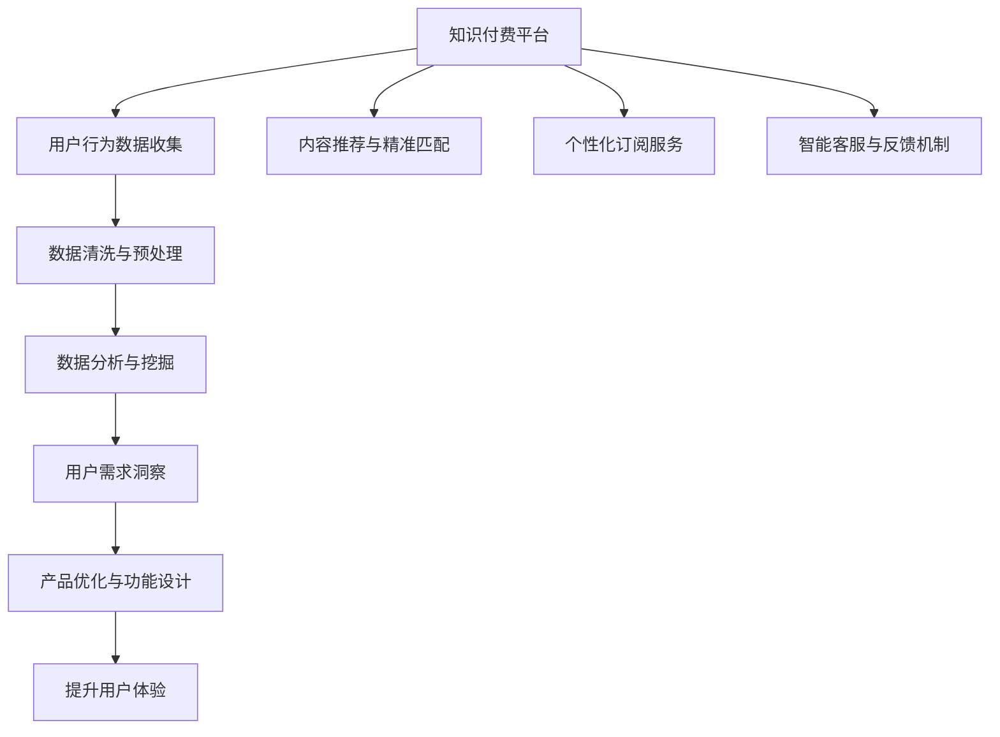

                 

# 知识付费平台的用户需求挖掘

> 关键词：知识付费平台, 用户需求, 数据分析, 机器学习, 数据挖掘, 产品设计, 用户体验

## 1. 背景介绍

在信息爆炸的时代，知识的获取变得越来越容易，但如何从中筛选出有价值、高效的信息，成为越来越多人的困扰。知识付费平台应运而生，通过专业的筛选和提炼，为用户提供高效、系统的知识服务。然而，作为平台运营者，仅仅提供优质的内容并不足以吸引用户，还需要深刻挖掘用户需求，提升用户体验，从而实现平台价值的最大化。

本文聚焦于知识付费平台的用户需求挖掘，从数据收集、处理、分析等角度，探索如何通过数据驱动的策略，提升平台的用户粘性、满意度，进而提升平台的商业价值。通过对用户行为数据的分析，可以发现用户的潜在需求，优化平台的功能设计，提升内容的精准推荐，使平台能够更好地满足用户的个性化需求，实现商业闭环。

## 2. 核心概念与联系

### 2.1 核心概念概述

在进行用户需求挖掘的过程中，我们需要关注以下几个核心概念：

- **知识付费平台**：指通过订阅、购买等方式，为用户提供高质量知识服务的平台。用户可以根据自身需求，订阅感兴趣的专栏、课程、文章等内容。
- **用户需求挖掘**：指通过数据收集和分析，识别用户行为背后的真实需求，从而指导产品优化和功能设计的行为。
- **数据分析**：指通过收集和处理用户行为数据，利用统计学、机器学习等技术，提取有价值的信息和洞察的过程。
- **机器学习**：指通过算法训练模型，使计算机能够从数据中自动学习和提取规律，并进行预测和决策的行为。
- **数据挖掘**：指从大量数据中挖掘出有价值的模式、规律和知识，用于辅助决策和优化行为。

这些核心概念共同构成了知识付费平台用户需求挖掘的技术基础和理论框架。

### 2.2 核心概念原理和架构的 Mermaid 流程图



这个流程图展示了知识付费平台用户需求挖掘的基本流程：

1. 从平台收集用户行为数据。
2. 对数据进行清洗和预处理，确保数据的质量。
3. 利用数据分析和机器学习技术，挖掘用户需求。
4. 根据用户需求洞察，优化产品设计和功能。
5. 提升用户体验，使用户更愿意在平台上消费和参与。
6. 通过内容推荐、个性化订阅、智能客服等功能，实现内容的精准匹配和个性化服务。

## 3. 核心算法原理 & 具体操作步骤

### 3.1 算法原理概述

知识付费平台的用户需求挖掘，本质上是利用数据分析和机器学习技术，从用户行为数据中提取有价值的信息，从而优化产品设计和提升用户体验的过程。这一过程可以分为以下几个步骤：

1. **数据收集**：通过用户行为数据、内容消费数据、订阅行为数据等，收集平台上的用户交互信息。
2. **数据清洗与预处理**：对收集到的数据进行去重、去噪、标准化处理，确保数据的质量和一致性。
3. **数据分析与挖掘**：利用统计学、机器学习等技术，从数据中提取模式、规律和知识，发现用户的潜在需求和兴趣。
4. **用户需求洞察**：根据数据分析结果，识别用户的关键需求和痛点，为产品优化提供依据。
5. **产品优化与功能设计**：根据用户需求洞察，设计并实现产品功能和界面优化，提升用户体验。

### 3.2 算法步骤详解

#### 3.2.1 数据收集

数据收集是用户需求挖掘的第一步，主要通过以下几种方式：

1. **用户行为数据**：包括用户在平台上浏览、点击、订阅、购买等行为数据。
2. **内容消费数据**：包括用户阅读、收听、观看等内容的消费数据。
3. **订阅行为数据**：包括用户订阅专栏、课程、文章等的信息。
4. **评价与反馈数据**：包括用户在内容消费后给出的评价和反馈。

#### 3.2.2 数据清洗与预处理

数据清洗和预处理是确保数据质量的重要环节。主要包括以下步骤：

1. **去重去噪**：删除重复和无效的数据，去除噪音和异常值。
2. **标准化处理**：将数据格式统一，处理缺失值和异常值，确保数据的一致性和完整性。
3. **数据集成**：将来自不同渠道的数据整合，形成完整的数据集。

#### 3.2.3 数据分析与挖掘

数据分析和挖掘是用户需求挖掘的核心步骤。主要通过以下几种方法：

1. **描述性分析**：利用统计学方法，对数据进行基本描述，发现数据的基本特征和趋势。
2. **探索性分析**：通过数据可视化工具，探索数据之间的关系和规律。
3. **预测性分析**：利用机器学习模型，对未来用户行为进行预测，识别潜在需求。
4. **关联规则挖掘**：利用数据挖掘算法，发现不同行为之间的关联关系，识别用户兴趣和需求。

#### 3.2.4 用户需求洞察

用户需求洞察是数据分析与挖掘的最终目的，主要包括以下步骤：

1. **需求识别**：通过数据分析和挖掘，识别用户的关键需求和痛点。
2. **需求分析**：对识别出的需求进行深入分析，了解用户的具体需求和使用场景。
3. **需求验证**：通过小规模的实验和测试，验证需求分析的准确性和可行性。

#### 3.2.5 产品优化与功能设计

根据用户需求洞察，进行产品优化和功能设计。主要包括以下步骤：

1. **功能设计**：根据用户需求，设计新的功能和界面，提升用户体验。
2. **优先级排序**：对新功能和需求进行优先级排序，制定产品优化计划。
3. **实验与测试**：在小规模用户中进行实验和测试，验证功能效果。
4. **迭代优化**：根据测试结果和用户反馈，不断迭代优化产品功能和设计。

### 3.3 算法优缺点

知识付费平台用户需求挖掘方法具有以下优点：

1. **数据驱动**：通过数据驱动的策略，发现用户的真实需求和痛点，提升产品设计和功能优化。
2. **精准推荐**：利用数据分析和机器学习技术，实现内容的精准匹配和个性化推荐。
3. **用户粘性提升**：通过个性化订阅服务、智能客服等功能，提升用户粘性和满意度。
4. **市场竞争力提升**：通过优化产品设计和功能，提升平台的市场竞争力和用户留存率。

同时，也存在以下缺点：

1. **数据隐私问题**：收集和处理用户数据需要遵守隐私保护法规，确保用户数据的安全和隐私。
2. **数据质量问题**：数据收集和清洗过程中，可能会存在数据不完整、不准确的问题。
3. **算法模型复杂**：数据分析和挖掘过程中，需要训练复杂的机器学习模型，对算力要求较高。
4. **用户行为多样性**：用户行为和需求具有多样性和复杂性，难以通过单一模型全面覆盖。

### 3.4 算法应用领域

知识付费平台用户需求挖掘方法，可以应用于以下领域：

1. **个性化推荐系统**：通过分析用户行为数据，实现内容的精准推荐。
2. **订阅服务优化**：通过识别用户需求，设计个性化的订阅服务，提升用户满意度。
3. **智能客服系统**：通过分析用户反馈和行为数据，提升智能客服系统的响应速度和准确性。
4. **用户体验优化**：通过用户行为数据，优化平台的用户界面和交互设计，提升用户体验。
5. **内容优化与创新**：通过分析用户行为数据，识别用户兴趣和需求，优化内容生产和创新。
6. **市场分析和预测**：通过分析用户行为数据，预测市场趋势和用户需求，指导市场策略。

## 4. 数学模型和公式 & 详细讲解 & 举例说明

### 4.1 数学模型构建

在进行用户需求挖掘的过程中，主要利用以下数学模型：

1. **聚类分析**：利用聚类算法，将用户分成不同的群体，识别出不同的用户需求。
2. **关联规则挖掘**：利用Apriori算法等，发现不同行为之间的关联关系，识别用户兴趣和需求。
3. **预测模型**：利用回归、分类等模型，对用户行为进行预测，识别潜在需求。
4. **推荐系统**：利用协同过滤、内容过滤等算法，实现内容的精准匹配和个性化推荐。

### 4.2 公式推导过程

#### 4.2.1 聚类分析

聚类分析通过将用户分为不同的群体，识别出不同的用户需求。常用的聚类算法包括K-means、层次聚类等。

以K-means算法为例，其基本思想是将用户分为K个簇，使得每个簇内的用户具有相似的特征。K-means的公式推导如下：

1. **初始化**：随机选择K个簇中心。
2. **分配**：将每个用户分配到最近的簇中心。
3. **更新**：重新计算每个簇的中心。
4. **迭代**：重复2、3步骤，直到收敛。

公式推导如下：

$$
C_k = \left\{ x \middle| x = \underset{k}{\arg\min}\|x-\mu_k\| \right\}
$$

其中，$\mu_k$ 表示簇k的中心点。

#### 4.2.2 关联规则挖掘

关联规则挖掘通过发现不同行为之间的关联关系，识别用户兴趣和需求。常用的算法包括Apriori算法等。

以Apriori算法为例，其基本思想是通过频繁项集，发现用户的行为规律。

Apriori算法的核心公式如下：

1. **候选生成**：通过前一个频繁项集，生成候选项集。
2. **剪枝**：根据支持度阈值，剪去不满足条件的候选项集。
3. **迭代**：重复1、2步骤，直到无新的频繁项集。

公式推导如下：

$$
L_k = \left\{ x \middle| x \subseteq I, |x| = k, sup(x) \geq minsup \right\}
$$

其中，$I$ 表示所有项的集合，$sup(x)$ 表示项集$x$的支持度，$minsup$ 表示支持度阈值。

#### 4.2.3 预测模型

预测模型通过分析用户历史行为，预测未来的行为和需求。常用的模型包括线性回归、逻辑回归等。

以线性回归模型为例，其基本思想是通过历史数据，构建线性模型，预测用户未来的行为。

线性回归模型的公式如下：

$$
y = \theta_0 + \theta_1 x_1 + \theta_2 x_2 + \cdots + \theta_n x_n
$$

其中，$y$ 表示预测值，$\theta_0, \theta_1, \theta_2, \cdots, \theta_n$ 表示模型的参数，$x_1, x_2, \cdots, x_n$ 表示特征变量。

#### 4.2.4 推荐系统

推荐系统通过分析用户历史行为，实现内容的精准匹配和个性化推荐。常用的算法包括协同过滤、内容过滤等。

以协同过滤算法为例，其基本思想是通过用户之间的相似性，推荐用户感兴趣的内容。

协同过滤算法的核心公式如下：

1. **用户相似度计算**：通过余弦相似度等方法，计算用户之间的相似度。
2. **推荐计算**：通过相似度矩阵，计算每个用户对每个内容的评分。
3. **排序输出**：根据评分结果，对内容进行排序，推荐给用户。

公式推导如下：

$$
sim(u_i, u_j) = \frac{\sum_{k=1}^{n} x_{ik}y_{jk}}{\sqrt{\sum_{k=1}^{n}x_{ik}^2}\sqrt{\sum_{k=1}^{n}y_{jk}^2}}
$$

其中，$x_{ik}$ 表示用户$u_i$对内容$c_k$的评分，$y_{jk}$ 表示用户$u_j$对内容$c_k$的评分，$n$ 表示内容的数量。

### 4.3 案例分析与讲解

#### 4.3.1 聚类分析案例

某知识付费平台通过聚类分析，将用户分为不同的群体，识别出不同的用户需求。

首先，收集用户的历史行为数据，包括浏览内容、订阅专栏、购买课程等。然后，使用K-means算法，将用户分为3个群体：

1. **学习型群体**：喜欢订阅专业课程，有较强的学习需求。
2. **娱乐型群体**：喜欢阅读短篇文章，更注重娱乐和消遣。
3. **实用型群体**：注重实用信息，关注工具类和技能提升类内容。

根据聚类结果，平台可以针对不同群体，设计不同的内容推荐和服务，提升用户体验。

#### 4.3.2 关联规则挖掘案例

某知识付费平台通过关联规则挖掘，发现不同行为之间的关联关系，识别用户兴趣和需求。

首先，收集用户的历史行为数据，包括浏览、订阅、购买等。然后，使用Apriori算法，发现以下关联规则：

1. **订阅用户可能购买课程**：如果用户订阅了某一专栏，那么该用户更可能购买该专栏的相关课程。
2. **阅读用户可能订阅专栏**：如果用户阅读了某一文章，那么该用户更可能订阅该文章所属的专栏。
3. **购买用户可能继续订阅**：如果用户购买了某一课程，那么该用户更可能继续订阅该课程所属的专栏。

根据关联规则，平台可以设计个性化的订阅服务，提升用户粘性和满意度。

#### 4.3.3 预测模型案例

某知识付费平台通过预测模型，对用户行为进行预测，识别潜在需求。

首先，收集用户的历史行为数据，包括浏览内容、订阅专栏、购买课程等。然后，使用线性回归模型，预测用户未来的行为，如下：

1. **预测用户是否会订阅专栏**：根据用户的历史订阅行为，预测用户是否会订阅某一新的专栏。
2. **预测用户是否会购买课程**：根据用户的历史购买行为，预测用户是否会购买某一新的课程。
3. **预测用户是否会继续订阅平台**：根据用户的历史行为，预测用户是否会继续订阅平台。

根据预测结果，平台可以设计个性化订阅服务，提升用户粘性和满意度。

#### 4.3.4 推荐系统案例

某知识付费平台通过推荐系统，实现内容的精准匹配和个性化推荐。

首先，收集用户的历史行为数据，包括浏览内容、订阅专栏、购买课程等。然后，使用协同过滤算法，推荐用户感兴趣的内容，如下：

1. **用户相似度计算**：通过余弦相似度，计算用户$u_i$与$u_j$之间的相似度。
2. **推荐计算**：通过相似度矩阵，计算每个用户对每个内容的评分。
3. **排序输出**：根据评分结果，对内容进行排序，推荐给用户。

根据推荐结果，平台可以优化内容推荐算法，提升用户体验和满意度。

## 5. 项目实践：代码实例和详细解释说明

### 5.1 开发环境搭建

在进行用户需求挖掘的过程中，我们需要准备好Python开发环境。以下是Python开发环境的配置步骤：

1. 安装Anaconda：从官网下载并安装Anaconda，用于创建独立的Python环境。

```bash
conda create -n pyenv python=3.8 
conda activate pyenv
```

2. 安装必要的Python包：

```bash
pip install pandas numpy scikit-learn matplotlib seaborn sklearn
```

3. 安装Python机器学习库：

```bash
pip install scikit-learn
```

### 5.2 源代码详细实现

以下是一个基于Python和Scikit-learn库的用户需求挖掘代码实例，包括聚类分析、关联规则挖掘和推荐系统等。

#### 5.2.1 聚类分析

```python
from sklearn.cluster import KMeans
import pandas as pd

# 读取用户行为数据
data = pd.read_csv('user_behavior.csv')

# 计算每个用户的特征向量
user_features = data.groupby('user_id').agg({'behavior1': 'sum', 'behavior2': 'sum', 'behavior3': 'sum'}).reset_index()

# 选择前5个特征进行聚类
features = user_features[['behavior1', 'behavior2', 'behavior3']]

# 使用K-means算法进行聚类，分为3个簇
kmeans = KMeans(n_clusters=3)
clusters = kmeans.fit_predict(features)

# 输出聚类结果
print(clusters)
```

#### 5.2.2 关联规则挖掘

```python
from mlxtend.frequent_patterns import apriori, association_rules

# 读取用户行为数据
data = pd.read_csv('user_behavior.csv')

# 计算每个用户的频繁项集
frequent_items = apriori(data, min_support=0.1, use_colnames=True)

# 计算关联规则
rules = association_rules(frequent_items, metric="lift", min_threshold=1.2)

# 输出关联规则
print(rules)
```

#### 5.2.3 推荐系统

```python
from surprise import Dataset, Reader, KNNBasic
from surprise.model_selection import train_test_split

# 读取用户行为数据
data = pd.read_csv('user_behavior.csv')

# 构建数据集
reader = Reader(rating_scale=(1, 5))
data = reader.load_data(data)
dataset = Dataset.load_from_df(data[['user_id', 'item_id', 'rating']], reader)

# 划分训练集和测试集
trainset, testset = train_test_split(dataset, test_size=0.2)

# 使用KNN推荐算法
algo = KNNBasic()
algo.fit(trainset)
predictions = algo.test(testset)

# 输出推荐结果
print(predictions)
```

### 5.3 代码解读与分析

#### 5.3.1 聚类分析

代码中首先使用`pandas`库读取用户行为数据，然后计算每个用户的特征向量。接着，使用`scikit-learn`库的`KMeans`算法，将用户分为3个簇。最后，输出聚类结果。

#### 5.3.2 关联规则挖掘

代码中首先使用`pandas`库读取用户行为数据，然后计算每个用户的频繁项集。接着，使用`mlxtend`库的`apriori`算法，计算关联规则。最后，输出关联规则。

#### 5.3.3 推荐系统

代码中首先使用`pandas`库读取用户行为数据，然后构建数据集。接着，使用`surprise`库的`KNNBasic`算法，进行推荐。最后，输出推荐结果。

## 6. 实际应用场景

### 6.1 智能推荐系统

知识付费平台的智能推荐系统，通过用户需求挖掘，可以提升内容的精准匹配和个性化推荐，从而提高用户粘性和满意度。

首先，通过聚类分析、关联规则挖掘等技术，识别用户的兴趣和需求。然后，根据用户的历史行为数据，利用推荐算法，为用户推荐最感兴趣的内容。最后，根据用户的反馈和互动数据，不断优化推荐算法，提升推荐效果。

### 6.2 个性化订阅服务

通过用户需求挖掘，平台可以设计个性化的订阅服务，提升用户满意度和留存率。

首先，通过聚类分析、关联规则挖掘等技术，识别用户的兴趣和需求。然后，根据用户的历史行为数据，设计个性化的订阅服务。最后，根据用户的反馈和互动数据，不断优化订阅服务，提升用户粘性和满意度。

### 6.3 智能客服系统

知识付费平台的智能客服系统，通过用户需求挖掘，可以提升客服的响应速度和准确性。

首先，通过聚类分析、关联规则挖掘等技术，识别用户的常见问题和需求。然后，根据用户的历史行为数据，设计智能客服系统。最后，根据用户的反馈和互动数据，不断优化智能客服系统，提升用户体验。

### 6.4 未来应用展望

随着用户需求挖掘技术的不断进步，知识付费平台将实现更加精准的个性化推荐和更高效的用户服务。未来，知识付费平台将进一步结合AI技术，如自然语言处理、语音识别等，为用户提供更加智能化的服务体验。同时，平台还将引入更多元化的内容形式，如视频、直播等，丰富用户的学习体验。

## 7. 工具和资源推荐

### 7.1 学习资源推荐

为了帮助开发者掌握用户需求挖掘的理论与实践，以下是一些推荐的学习资源：

1. **《Python数据分析实战》**：详细介绍Python在数据分析中的应用，包括Pandas、Scikit-learn等库的使用。
2. **《机器学习实战》**：涵盖机器学习的基本概念和常用算法，通过案例实战帮助理解。
3. **《数据挖掘导论》**：介绍数据挖掘的基本概念和常用算法，适合初学者入门。
4. **《Python深度学习实战》**：涵盖深度学习的基本概念和常用算法，通过案例实战帮助理解。
5. **《深度学习与数据挖掘实战》**：结合深度学习和数据挖掘的最新研究成果，介绍实用案例和应用。

通过这些资源的学习，可以全面掌握用户需求挖掘的理论基础和实践技巧，从而更好地优化知识付费平台的产品设计和功能优化。

### 7.2 开发工具推荐

知识付费平台的用户需求挖掘，需要借助多种开发工具进行实现。以下是一些推荐的开发工具：

1. **Python**：Python是数据分析和机器学习的主流编程语言，具有丰富的第三方库和工具。
2. **Pandas**：用于数据处理和分析，支持多种数据格式和操作。
3. **Scikit-learn**：用于机器学习和数据挖掘，支持多种算法和模型。
4. **mlxtend**：用于数据挖掘和分析，支持多种算法和工具。
5. **surprise**：用于推荐系统的开发和评估，支持多种推荐算法。
6. **TensorFlow**：用于深度学习开发和部署，支持多种神经网络和算法。

合理利用这些工具，可以显著提升用户需求挖掘的开发效率和优化效果。

### 7.3 相关论文推荐

用户需求挖掘技术的不断发展，带来了诸多前沿研究成果。以下是一些推荐的论文：

1. **《聚类分析》**：介绍聚类算法的原理和实现，适合初学者入门。
2. **《关联规则挖掘》**：介绍关联规则挖掘算法的原理和实现，适合深入研究。
3. **《推荐系统》**：介绍推荐系统的原理和实现，涵盖协同过滤、内容过滤等算法。
4. **《深度学习在数据分析中的应用》**：介绍深度学习在数据分析中的各种应用，涵盖图像、文本等数据。
5. **《数据挖掘与人工智能》**：介绍数据挖掘和人工智能的最新研究成果，涵盖多个前沿领域。

这些论文代表了大数据时代下的用户需求挖掘技术的发展方向，对于理解技术和未来研究方向具有重要意义。

## 8. 总结：未来发展趋势与挑战

### 8.1 研究成果总结

本文从数据收集、处理、分析等角度，介绍了知识付费平台用户需求挖掘的技术方法和应用场景。通过聚类分析、关联规则挖掘、预测模型和推荐系统等方法，可以识别用户的兴趣和需求，优化产品设计和功能优化，提升用户体验和满意度。未来，随着数据挖掘技术和人工智能技术的不断发展，知识付费平台将实现更加精准的个性化推荐和更高效的用户服务。

### 8.2 未来发展趋势

随着用户需求挖掘技术的不断进步，知识付费平台将实现更加精准的个性化推荐和更高效的用户服务。未来，知识付费平台将进一步结合AI技术，如自然语言处理、语音识别等，为用户提供更加智能化的服务体验。同时，平台还将引入更多元化的内容形式，如视频、直播等，丰富用户的学习体验。

### 8.3 面临的挑战

尽管用户需求挖掘技术已经取得了诸多进展，但在实际应用中仍面临诸多挑战：

1. **数据隐私问题**：收集和处理用户数据需要遵守隐私保护法规，确保用户数据的安全和隐私。
2. **数据质量问题**：数据收集和清洗过程中，可能会存在数据不完整、不准确的问题。
3. **算法模型复杂**：数据分析和挖掘过程中，需要训练复杂的机器学习模型，对算力要求较高。
4. **用户行为多样性**：用户行为和需求具有多样性和复杂性，难以通过单一模型全面覆盖。

### 8.4 研究展望

面向未来，知识付费平台用户需求挖掘技术还需要在以下几个方面进行深入研究：

1. **无监督学习和半监督学习**：探索无监督和半监督学习范式，摆脱对大规模标注数据的依赖。
2. **模型压缩与优化**：优化算法模型，降低计算和存储成本，提高推荐系统的实时性。
3. **跨模态数据融合**：结合多种数据源，如文本、图像、音频等，丰富用户需求挖掘的多样性。
4. **用户情感分析**：结合自然语言处理技术，分析用户情感和反馈，优化个性化推荐和服务。
5. **人机交互优化**：结合智能交互技术，优化用户体验，提升用户粘性和满意度。

## 9. 附录：常见问题与解答

**Q1: 知识付费平台如何通过用户需求挖掘，提升用户粘性和满意度？**

A: 知识付费平台可以通过用户需求挖掘，提升用户粘性和满意度，具体步骤如下：

1. 收集用户行为数据：包括浏览、订阅、购买等行为。
2. 数据分析和挖掘：利用聚类分析、关联规则挖掘等方法，识别用户需求和兴趣。
3. 个性化推荐：利用推荐算法，实现内容的精准匹配和个性化推荐。
4. 个性化订阅服务：根据用户需求，设计个性化的订阅服务。
5. 智能客服系统：根据用户需求，设计智能客服系统。
6. 持续优化：根据用户反馈和互动数据，不断优化推荐算法和服务，提升用户粘性和满意度。

通过这些步骤，知识付费平台可以更好地满足用户需求，提升用户体验和满意度。

**Q2: 用户需求挖掘中，如何选择适合的聚类算法？**

A: 在用户需求挖掘中，选择适合的聚类算法需要考虑以下几个因素：

1. 数据类型：不同数据类型适合不同的聚类算法。例如，数值型数据适合K-means算法，而文本数据适合层次聚类。
2. 数据规模：数据规模越大，越适合使用分布式聚类算法，如MHA、GDAS等。
3. 聚类目标：不同聚类算法有不同的聚类目标，需要根据具体需求选择。例如，K-means算法适用于初始簇中心随机的场景，而层次聚类适用于无标签数据。
4. 算法性能：不同的聚类算法在计算效率和精度上有所差异，需要根据具体场景选择。例如，K-means算法计算效率高，但可能存在局部最优解；层次聚类计算复杂度高，但聚类结果更稳定。

综上所述，需要根据具体数据类型、数据规模、聚类目标和算法性能，选择适合的聚类算法。

**Q3: 用户需求挖掘中，如何处理异常值和缺失值？**

A: 在用户需求挖掘中，处理异常值和缺失值是数据清洗和预处理的重要环节。以下是一些处理异常值和缺失值的方法：

1. 异常值处理：使用均值、中位数等统计方法，对异常值进行修正。或者使用箱线图、Z-score等方法，识别和删除异常值。
2. 缺失值处理：使用均值、中位数等方法，对缺失值进行填补。或者使用插值法、回归法等方法，估计缺失值。
3. 数据标准化：对数据进行标准化处理，使其符合正态分布，便于聚类分析。
4. 数据集成：将不同来源的数据进行整合，形成完整的数据集。

综上所述，处理异常值和缺失值需要结合具体场景，选择合适的方法，确保数据的质量和一致性。

**Q4: 用户需求挖掘中，如何优化推荐算法？**

A: 在用户需求挖掘中，优化推荐算法需要考虑以下几个因素：

1. 数据特征：选择合适的特征进行建模，提升推荐效果。例如，用户的历史行为、兴趣偏好等。
2. 模型选择：选择适合的推荐算法，如协同过滤、内容过滤等。根据数据特征和推荐场景，选择合适的模型。
3. 模型训练：优化模型训练过程，减少过拟合和欠拟合。例如，使用正则化、交叉验证等方法，优化模型训练。
4. 算法优化：优化推荐算法，提高推荐精度和效率。例如，引入稀疏矩阵计算、增量学习等技术，提升推荐系统的实时性。
5. 评估指标：选择合适的评估指标，评估推荐效果。例如，准确率、召回率、F1-score等。

综上所述，优化推荐算法需要结合具体数据和场景，选择合适的方法，进行全面优化，提升推荐效果。

**Q5: 用户需求挖掘中，如何保护用户隐私？**

A: 在用户需求挖掘中，保护用户隐私是至关重要的。以下是一些保护用户隐私的方法：

1. 数据匿名化：对用户数据进行匿名化处理，保护用户隐私。例如，使用随机化、加密等方法，保护用户数据。
2. 数据加密：对用户数据进行加密处理，防止数据泄露。例如，使用AES、RSA等加密算法，保护数据安全。
3. 数据访问控制：对数据进行严格的访问控制，确保只有授权人员能够访问。例如，使用RBAC、ABAC等方法，控制数据访问。
4. 合规审查：遵守隐私保护法规，如GDPR、CCPA等，确保数据处理的合规性。

综上所述，保护用户隐私需要结合具体场景，采取多种措施，确保用户数据的安全和隐私。

---

作者：禅与计算机程序设计艺术 / Zen and the Art of Computer Programming

