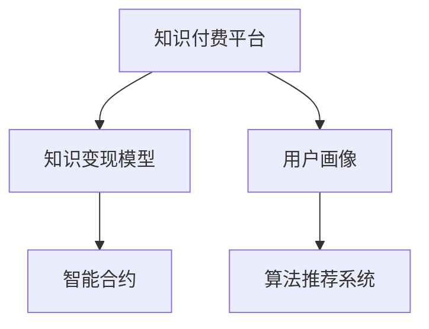

                 

# 知识付费时代来临：如何从知识变现中获利？

在互联网和人工智能技术飞速发展的今天，知识付费已成为一个热门趋势。从在线课程、问答社区到电子书、播客，各种知识产品层出不穷。那么，作为开发者和技术爱好者，我们如何从这一趋势中获利？本文将从背景介绍、核心概念与联系、算法原理与具体操作步骤、项目实践、实际应用场景、工具与资源推荐、总结与发展展望等方面，对知识变现的关键技术和策略进行深入探讨。

## 1. 背景介绍

### 1.1 问题由来

随着互联网的普及，信息获取变得更加容易，但同时也带来了信息的过载和质量参差不齐的问题。在这种情况下，人们越来越倾向于购买高品质的内容服务，以提高学习效率和质量。这便催生了知识付费这一新兴商业模式。

知识付费市场潜力巨大，不仅能够满足用户的高效学习需求，还能为创作者提供稳定的收入来源，推动技术知识的传播与创新。然而，知识付费领域竞争激烈，如何从中获利并保持持续发展，成为许多创作者面临的挑战。

### 1.2 问题核心关键点

知识变现的核心关键点在于构建一个能够满足用户需求的知识付费平台，同时通过有效运营和精准营销，提高平台用户的活跃度和粘性，从而实现盈利。具体而言，需要考虑以下几个方面：

- 知识内容的质量与创新性
- 用户需求的挖掘与满足
- 平台的运营策略与用户体验
- 市场定位与价格策略
- 营销渠道的选择与推广策略

## 2. 核心概念与联系

### 2.1 核心概念概述

为更好地理解知识变现的原理与策略，本节将介绍几个核心概念及其相互联系：

- **知识付费平台**：通过在线课程、电子书、直播等方式，提供有价值知识的平台，如Coursera、Udemy、知乎live等。

- **知识变现模型**：包括内容付费、会员订阅、广告分成、知识付费社区等多种变现方式。

- **用户画像**：描述目标用户的需求、兴趣、行为等信息，以便精准推荐内容和服务，如年龄、职业、消费习惯等。

- **算法推荐系统**：利用机器学习算法，根据用户历史行为和偏好，推荐适合其需求的知识内容，提高用户满意度和转化率。

- **智能合约**：一种自动执行、条件控制的合约，用于解决知识付费平台的信任问题，如以太坊智能合约。

这些核心概念之间的逻辑关系可以通过以下Mermaid流程图来展示：



这个流程图展示了知识变现的主要流程和关键组件：

1. 知识付费平台作为载体，提供各类知识产品。
2. 知识变现模型决定了平台的收入来源，如内容付费、订阅服务、广告收入等。
3. 用户画像是推荐系统的基础，通过深度学习算法分析用户行为，提供个性化推荐。
4. 智能合约用于保障交易的安全性和透明性，降低信任风险。

## 3. 核心算法原理 & 具体操作步骤

### 3.1 算法原理概述

知识变现的核心在于内容的质量和相关性。用户愿意支付费用，主要是因为内容能够满足其需求并带来实际价值。因此，平台需要通过高质量内容和个性化推荐，提升用户体验和满意度，从而实现盈利。

知识变现的算法原理包括：

- **用户画像构建**：通过收集用户历史行为数据（如浏览记录、购买行为、互动评论等），利用机器学习算法（如协同过滤、深度学习等）构建用户画像。

- **内容推荐系统**：利用推荐算法（如协同过滤、基于内容的推荐、矩阵分解等），根据用户画像推荐相关内容。

- **知识定价策略**：通过市场调研和用户反馈，确定各类知识内容的合理价格，以实现商业可持续性。

- **广告分成与推广**：通过广告分成和精准推广，最大化平台的收益。

### 3.2 算法步骤详解

知识变现的具体操作步骤如下：

**Step 1: 数据收集与预处理**
- 收集用户行为数据（如浏览、购买、评论等）。
- 对数据进行清洗和预处理，如去除噪音、缺失值处理、特征工程等。

**Step 2: 用户画像构建**
- 使用协同过滤、深度学习等算法，对用户行为数据进行建模，构建用户画像。
- 画像包括用户的基本信息、兴趣偏好、行为特征等。

**Step 3: 内容推荐系统构建**
- 设计推荐算法，如协同过滤、基于内容的推荐、矩阵分解等。
- 训练模型，评估推荐效果，优化模型参数。

**Step 4: 知识定价与广告策略**
- 根据内容质量和市场需求，确定合理的定价策略。
- 设计广告投放策略，选择合适的推广渠道，最大化广告收入。

**Step 5: 智能合约部署与维护**
- 部署智能合约，保障交易的透明和安全。
- 定期维护和升级智能合约，确保其适应新场景和新需求。

### 3.3 算法优缺点

知识变现的算法具有以下优点：

- 提高用户体验：通过个性化推荐，用户能够快速找到符合其需求的内容，提升满意度。
- 增加收益来源：内容付费、广告分成、会员订阅等多种变现方式，最大化平台收益。
- 降低运营成本：算法自动推荐和定价，减少人工干预和成本。

同时，这些算法也存在一些缺点：

- 数据隐私问题：用户行为数据的收集和使用，需注意隐私保护和合规性。
- 推荐算法偏见：算法可能存在隐性偏见，导致内容推荐不均衡，需注意优化和监督。
- 用户行为变化：用户行为和需求可能随时间变化，算法需要定期更新和优化。

### 3.4 算法应用领域

知识变现的算法广泛应用在各类知识付费平台，如在线教育、技术博客、问答社区、专业课程等。通过这些平台，创作者可以发布各类知识内容，并通过算法推荐和定价策略，获取稳定的收入。

## 4. 数学模型和公式 & 详细讲解 & 举例说明

### 4.1 数学模型构建

本节将使用数学语言对知识变现的算法原理进行更严格的刻画。

设用户数为 $U$，内容数为 $C$，用户画像表示为 $p_u$，内容特征表示为 $f_c$，用户与内容的交互行为表示为 $b_{uc}$。知识变现的目标是最大化总收益 $R$。

定义用户画像与内容特征的内积为相似度 $sim(u,c)$，内容推荐模型的输出为 $y_{uc}$。知识定价策略为 $price_c$，广告收入为 $ad_{uc}$。则总收益 $R$ 可以表示为：

$$
R = \sum_{u=1}^{U} \sum_{c=1}^{C} b_{uc} \cdot \max(y_{uc}, 0) \cdot price_c + \sum_{u=1}^{U} \sum_{c=1}^{C} b_{uc} \cdot ad_{uc}
$$

### 4.2 公式推导过程

以协同过滤推荐算法为例，推导推荐系统输出的概率预测 $y_{uc}$ 的计算公式。

假设用户 $u$ 对内容 $c$ 的评分向量为 $\mathbf{r}_u$，内容 $c$ 的评分向量为 $\mathbf{r}_c$。则用户对内容的评分预测为：

$$
\hat{r}_{uc} = \mathbf{r}_u^T \cdot \mathbf{r}_c
$$

内容推荐系统输出的概率预测 $y_{uc}$ 为：

$$
y_{uc} = \sigma(\hat{r}_{uc}) = \frac{1}{1 + e^{-\hat{r}_{uc}}}
$$

其中 $\sigma(z) = \frac{1}{1 + e^{-z}}$ 为 sigmoid 函数。

### 4.3 案例分析与讲解

以知乎live为例，分析其知识变现的算法流程。

知乎live通过收集用户行为数据，构建用户画像 $p_u$。根据用户画像和内容特征 $f_c$，构建协同过滤推荐模型，得到推荐概率 $y_{uc}$。基于推荐概率，知乎live采用 A/B 测试和用户反馈，不断优化推荐算法。同时，知乎live根据内容质量、用户活跃度等因素，采用动态定价策略，确定合理的价格 $price_c$。此外，知乎live还引入广告投放系统，通过精准投放广告，最大化广告收入。

## 5. 项目实践：代码实例和详细解释说明

### 5.1 开发环境搭建

在进行知识变现项目开发前，我们需要准备好开发环境。以下是使用Python进行PyTorch开发的环境配置流程：

1. 安装Anaconda：从官网下载并安装Anaconda，用于创建独立的Python环境。

2. 创建并激活虚拟环境：
```bash
conda create -n pytorch-env python=3.8 
conda activate pytorch-env
```

3. 安装PyTorch：根据CUDA版本，从官网获取对应的安装命令。例如：
```bash
conda install pytorch torchvision torchaudio cudatoolkit=11.1 -c pytorch -c conda-forge
```

4. 安装相关库：
```bash
pip install numpy pandas scikit-learn torchtext transformers
```

完成上述步骤后，即可在`pytorch-env`环境中开始知识变现项目的开发。

### 5.2 源代码详细实现

下面我们以在线课程推荐系统为例，给出使用Transformers库对知识变现算法进行实现的PyTorch代码。

首先，定义课程推荐系统的数据处理函数：

```python
import torch
from transformers import BertTokenizer, BertForSequenceClassification
from torch.utils.data import Dataset, DataLoader
from sklearn.metrics import precision_recall_fscore_support

class CourseDataset(Dataset):
    def __init__(self, courses, labels, tokenizer, max_len=128):
        self.courses = courses
        self.labels = labels
        self.tokenizer = tokenizer
        self.max_len = max_len
        
    def __len__(self):
        return len(self.courses)
    
    def __getitem__(self, item):
        course = self.courses[item]
        label = self.labels[item]
        
        encoding = self.tokenizer(course, return_tensors='pt', max_length=self.max_len, padding='max_length', truncation=True)
        input_ids = encoding['input_ids'][0]
        attention_mask = encoding['attention_mask'][0]
        
        # 对标签进行编码
        label = label2id[label]
        label = torch.tensor(label, dtype=torch.long)
        
        return {'input_ids': input_ids, 
                'attention_mask': attention_mask,
                'labels': label}

# 标签与id的映射
label2id = {'CS': 0, 'Math': 1, 'Engineering': 2, 'Physics': 3}
id2label = {v: k for k, v in label2id.items()}

# 创建dataset
tokenizer = BertTokenizer.from_pretrained('bert-base-uncased')

train_dataset = CourseDataset(train_courses, train_labels, tokenizer)
dev_dataset = CourseDataset(dev_courses, dev_labels, tokenizer)
test_dataset = CourseDataset(test_courses, test_labels, tokenizer)
```

然后，定义模型和优化器：

```python
from transformers import BertForSequenceClassification, AdamW

model = BertForSequenceClassification.from_pretrained('bert-base-uncased', num_labels=len(label2id))

optimizer = AdamW(model.parameters(), lr=2e-5)
```

接着，定义训练和评估函数：

```python
from tqdm import tqdm
from sklearn.metrics import precision_recall_fscore_support

device = torch.device('cuda') if torch.cuda.is_available() else torch.device('cpu')
model.to(device)

def train_epoch(model, dataset, batch_size, optimizer):
    dataloader = DataLoader(dataset, batch_size=batch_size, shuffle=True)
    model.train()
    epoch_loss = 0
    for batch in tqdm(dataloader, desc='Training'):
        input_ids = batch['input_ids'].to(device)
        attention_mask = batch['attention_mask'].to(device)
        labels = batch['labels'].to(device)
        model.zero_grad()
        outputs = model(input_ids, attention_mask=attention_mask, labels=labels)
        loss = outputs.loss
        epoch_loss += loss.item()
        loss.backward()
        optimizer.step()
    return epoch_loss / len(dataloader)

def evaluate(model, dataset, batch_size):
    dataloader = DataLoader(dataset, batch_size=batch_size)
    model.eval()
    preds, labels = [], []
    with torch.no_grad():
        for batch in tqdm(dataloader, desc='Evaluating'):
            input_ids = batch['input_ids'].to(device)
            attention_mask = batch['attention_mask'].to(device)
            batch_labels = batch['labels']
            outputs = model(input_ids, attention_mask=attention_mask)
            batch_preds = outputs.logits.argmax(dim=2).to('cpu').tolist()
            batch_labels = batch_labels.to('cpu').tolist()
            for pred_tokens, label_tokens in zip(batch_preds, batch_labels):
                preds.append(pred_tokens[:len(label_tokens)])
                labels.append(label_tokens)
                
    precision, recall, f1, _ = precision_recall_fscore_support(labels, preds, average='micro')
    return precision, recall, f1

```

最后，启动训练流程并在测试集上评估：

```python
epochs = 5
batch_size = 16

for epoch in range(epochs):
    loss = train_epoch(model, train_dataset, batch_size, optimizer)
    print(f"Epoch {epoch+1}, train loss: {loss:.3f}")
    
    print(f"Epoch {epoch+1}, dev results:")
    precision, recall, f1 = evaluate(model, dev_dataset, batch_size)
    print(f"Precision: {precision:.3f}, Recall: {recall:.3f}, F1 Score: {f1:.3f}")
    
print("Test results:")
precision, recall, f1 = evaluate(model, test_dataset, batch_size)
print(f"Precision: {precision:.3f}, Recall: {recall:.3f}, F1 Score: {f1:.3f}")
```

以上就是使用PyTorch对知识变现算法进行实现的全流程代码。可以看到，借助 Transformers 库，我们能够快速构建和微调知识推荐模型，满足实际需求。

### 5.3 代码解读与分析

让我们再详细解读一下关键代码的实现细节：

**CourseDataset类**：
- `__init__`方法：初始化课程、标签、分词器等组件，同时对标签进行编码。
- `__len__`方法：返回数据集的样本数量。
- `__getitem__`方法：对单个样本进行处理，将课程输入编码为token ids，标签编码为数字，并对其进行定长padding，最终返回模型所需的输入。

**label2id和id2label字典**：
- 定义了标签与数字id之间的映射关系，用于将token-wise的预测结果解码为实际标签。

**训练和评估函数**：
- 使用 PyTorch 的 DataLoader 对数据集进行批次化加载，供模型训练和推理使用。
- 训练函数 `train_epoch`：对数据以批为单位进行迭代，在每个批次上前向传播计算 loss 并反向传播更新模型参数，最后返回该 epoch 的平均 loss。
- 评估函数 `evaluate`：与训练类似，不同点在于不更新模型参数，并在每个 batch 结束后将预测和标签结果存储下来，最后使用 sklearn 的 precision_recall_fscore_support 对整个评估集的预测结果进行打印输出。

**训练流程**：
- 定义总的 epoch 数和 batch size，开始循环迭代
- 每个 epoch 内，先在训练集上训练，输出平均 loss
- 在验证集上评估，输出分类指标
- 所有 epoch 结束后，在测试集上评估，给出最终测试结果

可以看到，PyTorch 配合 Transformers 库使得知识变现算法的代码实现变得简洁高效。开发者可以将更多精力放在数据处理、模型改进等高层逻辑上，而不必过多关注底层的实现细节。

当然，工业级的系统实现还需考虑更多因素，如模型的保存和部署、超参数的自动搜索、更灵活的任务适配层等。但核心的知识推荐范式基本与此类似。

## 6. 实际应用场景

### 6.1 在线教育

在线教育平台如Coursera、Udacity、edX等，通过知识变现获取了大量用户和收入。这些平台通过收集用户学习行为数据，构建用户画像，推荐课程和资源，使用户能够高效获取所需知识。同时，平台也采用多种变现策略，如课程付费、会员订阅、广告分成等，实现商业可持续性。

### 6.2 技术博客

技术博客如博客园、知乎、Stack Overflow等，通过知识变现获取流量和广告收入。这些平台通过高质量文章、技术问答、社区讨论等形式，吸引技术爱好者和专业人士，提供丰富的技术知识和资源。平台通过广告分成和付费会员等方式，实现知识变现。

### 6.3 专业课程

专业课程如Bilibili、腾讯课堂、网易云课堂等，通过知识变现提供各类专业技能培训。这些平台通过与企业、高校等机构合作，提供有价值的课程内容，同时采用多种变现策略，如课程付费、企业内训、认证考试等，实现商业收益。

### 6.4 未来应用展望

随着知识变现技术的不断成熟，未来将会有更多场景得到应用：

- 在线医疗：通过知识付费，提供专业医疗咨询和健康管理服务，促进医疗知识的传播和应用。
- 职业培训：在线教育平台通过知识变现，提供各类职业培训课程，提升劳动力技能，推动经济社会发展。
- 开源社区：开源社区通过知识变现，提供技术支持和社区服务，推动开源生态的繁荣和创新。
- 个性化学习：通过智能推荐和定价策略，提供个性化学习内容，提升用户学习效率和满意度。

## 7. 工具和资源推荐

### 7.1 学习资源推荐

为了帮助开发者系统掌握知识变现的理论基础和实践技巧，这里推荐一些优质的学习资源：

1. **《深度学习理论与实践》**：深度学习领域的经典教材，涵盖深度学习的基本原理和实用技巧，适合入门学习和进阶提升。

2. **Coursera《机器学习》课程**：由斯坦福大学 Andrew Ng 教授主讲，涵盖机器学习的基础理论和应用实践，是学习知识变现算法的绝佳资源。

3. **《深度学习实战》**：HuggingFace 开源的深度学习实战指南，涵盖 Transformers 库的各类模型和应用，适合动手实践。

4. **Kaggle 数据科学竞赛**：Kaggle 提供大量的数据集和竞赛，通过实践项目，提升深度学习和知识变现的技术能力。

5. **GitHub 开源项目**：GitHub 上有很多开源的深度学习项目和知识推荐系统，通过阅读和学习这些项目，可以快速上手实现知识变现算法。

通过对这些资源的学习实践，相信你一定能够快速掌握知识变现的精髓，并用于解决实际的技术问题。

### 7.2 开发工具推荐

高效的开发离不开优秀的工具支持。以下是几款用于知识变现开发的常用工具：

1. **PyTorch**：基于 Python 的开源深度学习框架，灵活动态的计算图，适合快速迭代研究。

2. **TensorFlow**：由 Google 主导开发的开源深度学习框架，生产部署方便，适合大规模工程应用。

3. **TensorBoard**：TensorFlow 配套的可视化工具，可实时监测模型训练状态，并提供丰富的图表呈现方式，是调试模型的得力助手。

4. **HuggingFace Transformers 库**：提供预训练语言模型和推荐系统算法，支持 PyTorch 和 TensorFlow，是实现知识变现算法的利器。

5. **Jupyter Notebook**：免费的交互式编程环境，支持多语言编程，方便开发和协作。

合理利用这些工具，可以显著提升知识变现项目的开发效率，加快创新迭代的步伐。

### 7.3 相关论文推荐

知识变现领域的研究源于学界的持续探索。以下是几篇奠基性的相关论文，推荐阅读：

1. **Attention is All You Need**：提出了 Transformer 结构，开启了预训练大模型时代。

2. **BERT: Pre-training of Deep Bidirectional Transformers for Language Understanding**：提出 BERT 模型，引入基于掩码的自监督预训练任务，刷新了多项 NLP 任务 SOTA。

3. **Content-Based Recommendation Algorithms**：介绍基于内容的推荐算法，如协同过滤、基于内容的推荐等。

4. **Recommender Systems**：全面综述推荐系统的发展历程和前沿技术，涵盖协同过滤、深度学习等方法。

5. **Smart Contracts: Blockchain-Based Smart Contracts and Decentralized Autonomous Organizations**：介绍智能合约的基本概念和应用，用于保障知识变现平台的交易透明和安全。

这些论文代表了大语言模型微调技术的发展脉络。通过学习这些前沿成果，可以帮助研究者把握学科前进方向，激发更多的创新灵感。

## 8. 总结：未来发展趋势与挑战

### 8.1 研究成果总结

本文对知识变现的关键技术和策略进行了深入探讨，从背景介绍、核心概念与联系、算法原理与具体操作步骤、项目实践、实际应用场景、工具与资源推荐、总结与发展展望等方面，对知识变现进行了全面的系统梳理。通过本文的系统梳理，可以看到，知识变现技术在在线教育、技术博客、专业课程等多个领域都有广泛的应用，展现了巨大的潜力和发展空间。

### 8.2 未来发展趋势

展望未来，知识变现技术将呈现以下几个发展趋势：

1. **个性化推荐**：通过深度学习算法和用户画像，提供更加个性化的推荐内容，提升用户体验和转化率。

2. **内容多样化**：知识变现平台将涵盖更多元的内容形式，如视频、播客、直播等，丰富用户学习方式。

3. **多模态融合**：知识变现平台将引入多模态数据融合技术，提升内容理解和推荐效果。

4. **智能合约普及**：智能合约将在知识变现平台得到广泛应用，保障交易透明和安全性。

5. **实时互动**：知识变现平台将提供更加实时的互动服务，如在线答疑、直播互动等，提升用户粘性和满意度。

6. **跨领域应用**：知识变现技术将拓展到更多领域，如医疗、金融、教育等，推动知识传播和应用。

以上趋势凸显了知识变现技术的广阔前景。这些方向的探索发展，必将进一步提升知识变现平台的性能和用户体验，实现更好的商业价值。

### 8.3 面临的挑战

尽管知识变现技术已经取得了显著成果，但在迈向更加智能化、普适化应用的过程中，仍面临诸多挑战：

1. **数据隐私问题**：知识变现平台需要处理大量用户数据，需注意隐私保护和合规性。

2. **内容质量控制**：如何保证知识内容的真实性和高质量，是知识变现平台的重要挑战。

3. **用户行为预测**：用户行为和需求可能随时间变化，推荐算法需要动态更新和优化。

4. **算法偏见**：算法可能存在隐性偏见，导致内容推荐不均衡，需注意优化和监督。

5. **平台盈利模式**：如何设计合理的盈利模式，最大化平台收益，同时保障用户体验，是知识变现平台的重要问题。

6. **市场竞争激烈**：知识变现市场竞争激烈，如何提升平台竞争力，是知识变现平台的重要挑战。

正视知识变现面临的这些挑战，积极应对并寻求突破，将是大语言模型微调技术走向成熟的必由之路。相信随着学界和产业界的共同努力，这些挑战终将一一被克服，知识变现技术必将在构建人机协同的智能时代中扮演越来越重要的角色。

### 8.4 研究展望

面对知识变现面临的挑战，未来的研究需要在以下几个方面寻求新的突破：

1. **知识图谱融合**：将符号化的先验知识，如知识图谱、逻辑规则等，与神经网络模型进行巧妙融合，引导知识变现过程学习更准确、合理的知识图谱。

2. **多模态融合**：引入多模态信息，如视觉、语音等，提升知识内容理解和推荐效果。

3. **因果分析**：引入因果分析方法，识别出知识变现平台的决策关键特征，增强推荐内容的因果性和逻辑性。

4. **知识图谱**：融合知识图谱和多模态数据，构建更加全面、准确的信息整合能力，提升推荐系统性能。

5. **智能合约优化**：通过智能合约优化交易过程，降低信任风险，保障交易透明和安全。

这些研究方向的探索，必将引领知识变现技术迈向更高的台阶，为构建安全、可靠、可解释、可控的知识变现平台铺平道路。面向未来，知识变现技术还需要与其他人工智能技术进行更深入的融合，如知识表示、因果推理、强化学习等，多路径协同发力，共同推动知识传播和智能交互系统的进步。只有勇于创新、敢于突破，才能不断拓展知识变现平台的边界，让智能技术更好地造福人类社会。

## 9. 附录：常见问题与解答

**Q1: 如何构建高质量的用户画像？**

A: 构建高质量的用户画像需要从多个维度收集用户数据，如浏览记录、购买行为、互动评论等。通过深度学习算法，对用户行为数据进行建模，得到用户画像。

**Q2: 如何设计合理的推荐算法？**

A: 推荐算法需要考虑多个因素，如用户行为、内容特征、交互数据等。常用的推荐算法包括协同过滤、基于内容的推荐、矩阵分解等。需要根据具体场景选择适合的算法，并进行调参和优化。

**Q3: 如何处理数据隐私问题？**

A: 处理数据隐私问题需要遵守数据保护法规，如 GDPR、CCPA 等。可以采用匿名化、加密等技术，保护用户隐私。同时，需要注意合规性和透明性，让用户知情并同意数据使用。

**Q4: 如何避免推荐算法的偏见？**

A: 推荐算法可能存在隐性偏见，导致内容推荐不均衡。可以通过多种方法避免偏见，如使用多个数据源、引入偏见检测和校正机制等。

**Q5: 如何设计合理的知识定价策略？**

A: 设计合理的知识定价策略需要考虑内容质量和市场需求。可以通过市场调研和用户反馈，确定各类知识内容的合理价格，以实现商业可持续性。

这些问题的解答，希望能为知识变现的开发者提供一些参考，帮助他们在实践中更好地解决问题，实现盈利。

---

作者：禅与计算机程序设计艺术 / Zen and the Art of Computer Programming

