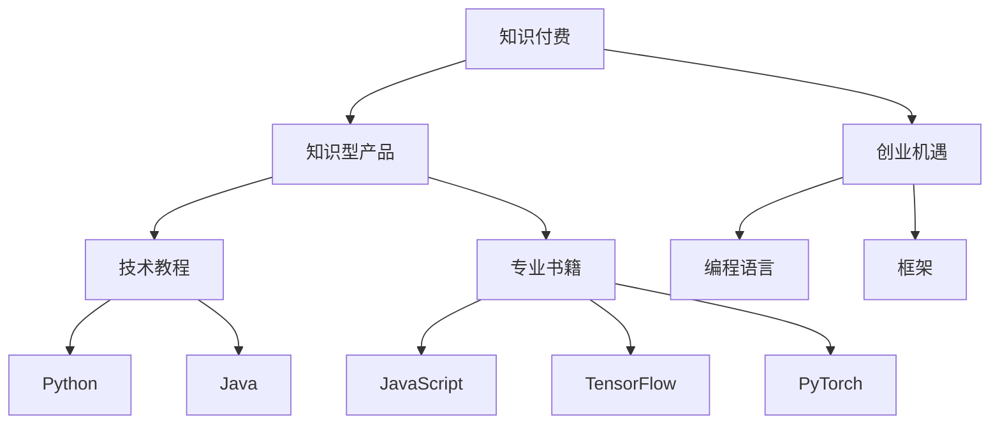

                 

# 知识付费时代程序员的创业机遇

## 1. 背景介绍

随着信息技术的飞速发展和互联网的普及，人们获取知识的方式已经发生了深刻的变化。从传统的教科书和报纸杂志，到在线课程和免费论坛，再到近年来兴起的知识付费平台。人们开始愿意为高质量的、经过专业筛选和整理的知识点付费，以节约自己的时间成本和提升学习效率。这背后反映出社会对知识型产品的需求日益增加，也预示着知识付费时代正以不可阻挡的趋势进入人们的日常生活。

知识付费时代为程序员提供了前所未有的机遇。技术的更新迭代和市场的不断扩大，为有志于此领域的创业者提供了广阔的发展空间。本文将从技术、市场和策略三个层面，探讨知识付费时代程序员的创业机遇。

## 2. 核心概念与联系

### 2.1 核心概念概述

为了更好地理解知识付费时代程序员的创业机遇，我们首先需要明确几个关键概念：

- **知识付费**：指用户为获取有价值的知识、技能或信息支付费用的商业模式。涵盖电子书、在线课程、咨询问答、技术文章等多种形式。
- **知识型产品**：以知识、信息为核心的产品，如技术教程、专业书籍、解决方案文档等。
- **创业机遇**：指创业者通过技术、资源、市场等因素，发现并抓住有利时机，创建有价值的企业或项目的机遇。
- **编程语言和框架**：如Python、Java、JavaScript等主流编程语言，以及TensorFlow、PyTorch等先进的机器学习框架。

这些概念通过以下Mermaid流程图进行连接，展示了知识付费和程序员创业的关系：



## 3. 核心算法原理 & 具体操作步骤
### 3.1 算法原理概述

在知识付费时代，程序员的创业机遇主要源于技术知识的传播和应用。创业者在以下方面利用算法和模型的原理进行商业化实践：

- **内容推荐算法**：利用协同过滤、内容相似度等算法，为用户推荐个性化的知识型产品，提高用户粘性。
- **文本生成算法**：如GPT-3等生成式模型，能够自动生成高质量的技术文档、文章等内容，降低内容制作成本。
- **数据分析模型**：如深度学习模型，用于分析用户行为数据，优化产品推荐和定价策略。

### 3.2 算法步骤详解

以内容推荐算法为例，其核心步骤如下：

1. **数据收集**：从用户行为日志、购买记录、评论反馈等多渠道收集用户数据。
2. **特征工程**：对收集的数据进行清洗、处理、特征提取等预处理操作。
3. **模型训练**：使用协同过滤、矩阵分解等算法训练模型，生成用户-产品相似度矩阵。
4. **推荐系统搭建**：搭建推荐引擎，根据相似度矩阵为用户推荐相关产品。
5. **系统优化**：通过A/B测试、在线学习等方法优化推荐算法，提高推荐效果。

### 3.3 算法优缺点

内容推荐算法具有以下优点：
- **个性化强**：能够根据用户行为生成个性化的推荐，提高用户满意度。
- **效果显著**：在实际应用中，推荐算法能够显著提升用户购买率和满意度。
- **易于扩展**：推荐算法的应用场景广泛，可以应用于电商、教育、旅游等多个领域。

同时，算法也存在一些缺点：
- **数据依赖**：需要大量用户行为数据进行训练，数据收集成本较高。
- **冷启动问题**：新用户或新产品加入系统时，推荐效果较差。
- **算法复杂度**：推荐算法的实现较为复杂，需要较高的技术门槛。

### 3.4 算法应用领域

内容推荐算法已经在多个领域得到广泛应用，如电商推荐、视频推荐、音乐推荐等。以电商平台为例，推荐算法能够显著提升用户购买率，同时通过个性化推荐，提升用户粘性和满意度，成为电商运营的重要工具。

## 4. 数学模型和公式 & 详细讲解 & 举例说明

### 4.1 数学模型构建

内容推荐算法通常使用协同过滤、矩阵分解等方法进行建模。以矩阵分解为例，设用户-产品评分矩阵为$R$，用户数为$m$，产品数为$n$，训练矩阵为$R^T$，则可以构建用户-产品相似度矩阵$S$：

$$S = \min(\frac{R^T R}{\epsilon}, 1)$$

其中，$\epsilon$为噪声项，$S$用于度量用户和产品的相似度。

### 4.2 公式推导过程

对于用户$u$和产品$p$的相似度$S_{up}$，计算公式为：

$$S_{up} = \min(\frac{s_u s_p^T}{\epsilon}, 1)$$

其中$s_u$和$s_p$分别为用户$u$和产品$p$的低维向量表示。

### 4.3 案例分析与讲解

以电商平台商品推荐为例，使用协同过滤算法进行推荐。首先，从用户行为数据中提取特征，生成用户和商品的低维向量表示。然后，利用矩阵分解得到用户-产品相似度矩阵$S$。最后，根据相似度矩阵$S$和用户历史行为，生成推荐列表。

## 5. 项目实践：代码实例和详细解释说明

### 5.1 开发环境搭建

开发环境搭建主要包括选择编程语言、框架、数据源和测试工具等。

- **编程语言**：Python是最常用的知识付费开发语言，具有丰富的库和工具支持。
- **框架**：TensorFlow、PyTorch等深度学习框架，提供了丰富的推荐算法和模型库。
- **数据源**：用户行为数据、产品信息、评论反馈等，通常存储在数据库中，如MySQL、PostgreSQL等。
- **测试工具**：Junit、Pytest等自动化测试工具，用于对推荐算法进行单元测试和性能测试。

### 5.2 源代码详细实现

以下是一个基于协同过滤算法的内容推荐系统的代码实现示例：

```python
from tensorflow.keras.layers import Input, Embedding, Dot, Dense
from tensorflow.keras.models import Model
from tensorflow.keras.optimizers import Adam

# 定义模型
input_u = Input(shape=(d_dim,))
input_p = Input(shape=(d_dim,))
dot = Dot(1)([input_u, input_p])
dot = Dense(1)(dot)
model = Model(inputs=[input_u, input_p], outputs=dot)

# 编译模型
model.compile(optimizer=Adam(learning_rate=0.001), loss='mse')

# 训练模型
model.fit([user_features, product_features], user_product_ratings, epochs=10, batch_size=128)
```

### 5.3 代码解读与分析

代码中，我们使用TensorFlow搭建了一个基于协同过滤算法的内容推荐系统。模型输入为用户和产品特征，输出为用户-产品相似度。模型训练过程中，我们使用了Adam优化器和均方误差损失函数，并进行了10个epoch的训练。

## 6. 实际应用场景

### 6.1 在线教育平台

在线教育平台需要为用户提供个性化的课程推荐，帮助用户更快地找到适合自己的课程。通过内容推荐算法，平台可以分析用户的学习行为数据，为用户推荐相关课程，从而提高用户的学习效率和满意度。

### 6.2 视频分享平台

视频分享平台如YouTube、Bilibili等，可以通过推荐算法为用户推荐相关视频，提高用户观看体验。通过分析用户的观看历史、点赞评论等信息，平台可以生成个性化视频推荐列表，吸引用户持续观看。

### 6.3 知识社区平台

知识社区平台如知乎、Stack Overflow等，可以通过推荐算法为用户推荐感兴趣的话题和文章，增加用户的活跃度和留存率。通过分析用户的阅读行为和互动数据，平台可以生成个性化的推荐列表，丰富用户知识获取渠道。

### 6.4 未来应用展望

未来，随着技术的发展，内容推荐算法将进一步应用于更多领域。例如，通过自然语言处理技术，推荐算法可以理解用户提问的语义，生成更准确的问题推荐。通过多模态信息融合技术，推荐算法可以结合视频、音频等多模态数据，生成更加全面的推荐结果。

## 7. 工具和资源推荐

### 7.1 学习资源推荐

为了帮助开发者掌握知识付费时代的创业技能，我们推荐以下学习资源：

- **Coursera《深度学习专项课程》**：涵盖深度学习的基础知识和应用，适合初学者学习。
- **Udacity《机器学习工程师纳米学位》**：提供系统性的机器学习知识，涵盖数据处理、模型优化、推荐算法等内容。
- **Kaggle竞赛**：参加数据科学和机器学习竞赛，积累实战经验，提升技术能力。

### 7.2 开发工具推荐

为了提高开发效率，我们推荐以下开发工具：

- **Jupyter Notebook**：适合编写和运行Python代码，支持数据可视化和交互式开发。
- **PyCharm**：适用于Python开发的IDE，提供代码调试、版本控制、自动化测试等功能。
- **Github**：代码托管平台，支持代码版本控制和团队协作，适合开源项目管理和版本迭代。

### 7.3 相关论文推荐

以下是几篇相关的学术论文，推荐阅读：

- **《推荐系统的协同过滤算法》**：介绍了协同过滤算法的基本原理和应用场景，适合入门学习。
- **《深度学习在推荐系统中的应用》**：介绍了深度学习在推荐系统中的各种应用，包括基于深度学习的推荐模型。
- **《知识图谱在推荐系统中的应用》**：介绍了知识图谱在推荐系统中的应用，探讨了知识图谱与深度学习的融合。

## 8. 总结：未来发展趋势与挑战

### 8.1 研究成果总结

本文从技术、市场和策略三个方面，探讨了知识付费时代程序员的创业机遇。通过分析推荐算法的基本原理和应用，我们认为内容推荐算法在未来将发挥越来越重要的作用，推动知识付费市场的发展。

### 8.2 未来发展趋势

未来，内容推荐算法将进一步发展，推动知识付费市场的深度和广度：

- **算法多样性增加**：除了协同过滤和矩阵分解，将出现更多先进的推荐算法，如深度学习、强化学习等。
- **多模态融合**：结合视频、音频等多模态数据，生成更全面的推荐结果。
- **实时推荐**：通过在线学习技术，实现实时推荐，提高用户体验。
- **个性化推荐**：利用用户行为数据，生成更加个性化的推荐，提高用户满意度。

### 8.3 面临的挑战

虽然内容推荐算法具有广阔的应用前景，但也面临着一些挑战：

- **数据隐私**：用户在平台上的行为数据涉及隐私问题，需要采取合适的数据保护措施。
- **冷启动问题**：新用户或新产品加入系统时，推荐效果较差，需要额外的策略来解决。
- **算法复杂度**：推荐算法实现较为复杂，需要较高的技术门槛。
- **算法公平性**：需要保证推荐算法的公平性，避免算法偏见和歧视。

### 8.4 研究展望

未来的研究需要针对这些挑战进行深入探索，包括：

- **隐私保护**：研究如何在推荐过程中保护用户隐私，设计合适的隐私保护算法。
- **冷启动**：研究新用户和新产品的推荐策略，提高推荐效果。
- **算法优化**：研究如何优化推荐算法，降低复杂度，提升性能。
- **算法公平性**：研究如何保证推荐算法的公平性，避免算法偏见和歧视。

## 9. 附录：常见问题与解答

### Q1：推荐算法是否适用于所有场景？

A：推荐算法并非适用于所有场景，但其适用范围非常广泛。适用于任何需要个性化推荐产品的场景，如电商、在线教育、视频分享等。

### Q2：推荐算法的性能如何评估？

A：推荐算法的性能可以通过多种指标进行评估，如点击率、转化率、用户满意度等。具体指标的选择需要根据具体的业务场景和目标进行确定。

### Q3：如何处理推荐算法中的冷启动问题？

A：冷启动问题是推荐算法中常见的问题，可以通过以下几种方法解决：
- 提供默认推荐：为用户推荐平台上的热门产品。
- 利用历史数据：通过分析已有用户行为，生成个性化推荐。
- 利用专家知识：通过领域专家推荐相关产品。

### Q4：推荐算法中的数据隐私问题如何处理？

A：数据隐私是推荐算法中的重要问题，需要采取合适的数据保护措施，如数据匿名化、加密存储等。同时，需要建立用户数据使用的透明机制，确保用户知情同意。

### Q5：推荐算法中如何保证公平性？

A：推荐算法中的公平性问题可以通过以下几种方法解决：
- 引入公平性约束：在算法中引入公平性约束，避免算法偏见。
- 多维度推荐：结合多种推荐策略，提高推荐公平性。
- 用户反馈机制：建立用户反馈机制，及时纠正不合理的推荐结果。

本文从技术、市场和策略三个方面，探讨了知识付费时代程序员的创业机遇。通过分析推荐算法的基本原理和应用，我们认为内容推荐算法在未来将发挥越来越重要的作用，推动知识付费市场的发展。同时，本文还从学习资源、开发工具和相关论文等方面，为程序员提供了一站式的创业指导。希望本文能为程序员创业提供有价值的参考，助其在知识付费领域取得成功。

作者：禅与计算机程序设计艺术 / Zen and the Art of Computer Programming

