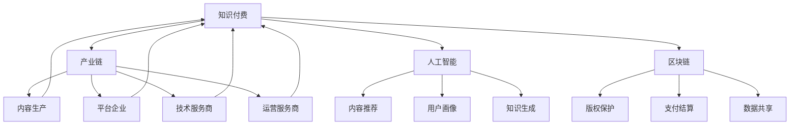

                 

# 知识付费要加强与产业链上下游的融合发展

> 关键词：知识付费,产业链,融合发展,平台经济,数字经济,人工智能,区块链

## 1. 背景介绍

### 1.1 问题由来

随着数字经济和互联网技术的蓬勃发展，知识付费作为一种新兴的商业模式，迅速崛起。平台企业如得到、喜马拉雅、得到高知会员、腾讯课堂等，正以强大的技术能力、丰富多样的内容生态，满足不同人群的个性化知识需求。

然而，随着知识付费市场规模的不断扩大，用户增长趋缓、付费转化率下降、用户流失率高、收入单一等问题也逐步显现。平台之间的同质化竞争加剧，用户体验、内容质量等方面的短板日益凸显。

面对这一系列问题，知识付费行业需要寻求突破，深化与产业链上下游的融合发展。产业链的协同合作，不仅可以为用户提供更为优质、高效的知识服务，还可以提升平台的竞争力和盈利能力，推动行业整体健康发展。

### 1.2 问题核心关键点

知识付费与产业链上下游的融合发展，主要集中在以下几个关键点：

1. 平台企业的双向合作：平台与内容生产方、技术提供方、运营服务商等多方合作，共建知识服务生态。
2. 用户需求与内容生产的精准对接：通过大数据、人工智能等技术手段，深度挖掘用户需求，实现内容的精准生产与推荐。
3. 运营与服务流程的数字化转型：借助区块链、云计算等新兴技术，实现知识付费业务的全流程数字化，提升运营效率与服务质量。
4. 产业链的价值链重构：打通产业链上下游，实现知识生产、分发、消费的协同创新，形成新的商业模式与产业链价值链。

### 1.3 问题研究意义

加强知识付费与产业链上下游的融合发展，对于推动知识付费产业健康、可持续发展具有重要意义：

1. 提升用户体验：通过融合产业链上下游资源，平台能够提供更为丰富、高效、个性化的知识服务，提升用户粘性和满意度。
2. 增强平台盈利能力：通过多元化合作模式，平台能够获取更多优质内容与技术资源，增强平台的核心竞争力，提升收入来源与盈利空间。
3. 推动行业生态建设：产业链上下游的深度合作，能够形成更紧密、稳定的合作网络，促进知识付费行业的健康发展。
4. 助力产业转型升级：通过数字化转型，知识付费行业可以更有效地应对市场变化，提升整体产业水平。

## 2. 核心概念与联系

### 2.1 核心概念概述

为更好地理解知识付费与产业链上下游的融合发展，本节将介绍几个密切相关的核心概念：

1. **知识付费**：指用户为获得特定领域的知识和技能，通过付费方式获取知识产品或服务。平台企业如得到、喜马拉雅等，基于技术能力与内容生态，为用户提供个性化、专业化的知识服务。

2. **产业链**：指从知识生产、分发、消费的全流程中，所有参与方的集合。包括内容生产方、平台企业、技术服务商、运营服务商等。

3. **融合发展**：指产业链上下游各方通过技术、资源、信息等方面的协同合作，实现产业链的整体优化与升级。

4. **平台经济**：指依托平台，整合多方资源，提供一站式的知识服务。平台企业通过整合内容生产、技术提供、运营服务等资源，实现产业链上下游的协同创新。

5. **数字经济**：指以数字技术为基础的经济形态，通过数字技术驱动传统经济转型升级，创造新的经济价值。知识付费作为数字经济的重要组成部分，通过数字化转型，提升产业链的效率与价值。

6. **人工智能**：指通过模拟人脑的认知功能，实现复杂问题的自主决策与推理。在知识付费领域，人工智能可以应用于内容推荐、用户画像分析、知识生成等方面，提升知识服务的精准性与个性化。

7. **区块链**：指一种分布式账本技术，通过去中心化的方式，保障数据的安全与透明。在知识付费领域，区块链可以应用于版权保护、支付结算、数据共享等方面，提升产业链的信任度与协同效率。

这些核心概念之间紧密相连，共同构成知识付费与产业链上下游融合发展的框架。

### 2.2 核心概念原理和架构的 Mermaid 流程图



这个流程图展示了知识付费与产业链上下游各方的关联关系：

1. 内容生产方与平台企业共同构成知识付费的核心链条，提供内容。
2. 平台企业通过整合内容、技术、运营等多方资源，提供一站式的知识服务。
3. 技术服务商提供技术支撑，如AI、大数据、云计算等。
4. 运营服务商提供运营服务，如客户服务、社区管理等。
5. 区块链技术保障数据安全与透明，提升产业链信任度。

## 3. 核心算法原理 & 具体操作步骤

### 3.1 算法原理概述

知识付费与产业链上下游的融合发展，本质上是一个多方协同的优化问题。其核心思想是通过技术手段，打通产业链上下游，实现资源的高效整合与优化配置，提升产业链的整体效率与价值。

形式化地，假设知识付费产业链涉及的内容生产方为 $C$，平台企业为 $P$，技术服务商为 $T$，运营服务商为 $O$。知识付费业务的优化目标是最小化用户流失率 $L$，同时最大化用户付费转化率 $C$，即：

$$
\mathop{\min}_{x,y,z,w} \mathcal{L}(x,y,z,w) = L(x,y,z,w) + \lambda C(x,y,z,w)
$$

其中 $x$ 为内容生产策略，$y$ 为平台策略，$z$ 为技术策略，$w$ 为运营策略，$\lambda$ 为平衡系数。$L(x,y,z,w)$ 表示用户流失率，$C(x,y,z,w)$ 表示用户付费转化率。

### 3.2 算法步骤详解

知识付费与产业链上下游的融合发展，通常包括以下几个关键步骤：

**Step 1: 确定合作模式与目标**

- 明确各方的合作目标与利益分配机制。
- 确定产业链上下游的协同策略与路径。
- 建立基于利益共享的合作协议。

**Step 2: 数据分析与用户画像构建**

- 利用大数据、人工智能等技术手段，对用户行为、内容消费偏好等进行深度分析。
- 构建用户画像，了解用户需求、兴趣、行为特征等。

**Step 3: 内容精准推荐与分发**

- 通过机器学习算法，对用户画像进行分析，实现内容的精准推荐。
- 借助区块链技术，保障数据安全与透明，构建可信的内容分发网络。

**Step 4: 运营与服务流程优化**

- 利用云计算、大数据等技术，优化知识付费业务的运营流程。
- 引入AI技术，提升客户服务、社区管理等运营服务水平。

**Step 5: 业务收入与成本控制**

- 通过多元化的收入渠道，如知识付费、广告、推荐分成等，提升平台盈利能力。
- 通过精细化的成本控制，如内容生产成本、运营成本等，提升平台运营效率。

**Step 6: 持续迭代与优化**

- 建立反馈机制，及时获取用户反馈，进行业务迭代优化。
- 通过持续改进，提升产业链各方的协同效率与价值。

### 3.3 算法优缺点

知识付费与产业链上下游的融合发展，具有以下优点：

1. 提升用户体验：通过产业链的协同合作，平台能够提供更为优质、高效、个性化的知识服务，提升用户粘性和满意度。
2. 增强平台盈利能力：通过多元化合作模式，平台能够获取更多优质内容与技术资源，增强平台的核心竞争力，提升收入来源与盈利空间。
3. 推动行业生态建设：产业链上下游的深度合作，能够形成更紧密、稳定的合作网络，促进知识付费行业的健康发展。
4. 助力产业转型升级：通过数字化转型，知识付费行业可以更有效地应对市场变化，提升整体产业水平。

同时，该方法也存在一定的局限性：

1. 协调成本高：产业链上下游的多方合作，需要协调各方利益，耗费较高的协调成本。
2. 数据共享难题：产业链各方的数据共享与整合，存在隐私保护、数据格式等方面的挑战。
3. 技术要求高：知识付费业务的优化，需要较高的技术水平与投入。
4. 业务复杂度高：产业链上下游的深度合作，增加了业务的复杂度与风险。

尽管存在这些局限性，但就目前而言，知识付费与产业链上下游的融合发展，仍是大势所趋。未来相关研究的重点在于如何进一步降低合作成本，提高数据共享效率，降低技术门槛，减少业务复杂度，以实现更高效的融合发展。

### 3.4 算法应用领域

知识付费与产业链上下游的融合发展，已经在多个领域得到应用，例如：

- **教育培训**：平台企业与教育机构合作，提供在线课程与培训服务，实现教育资源的优化配置。
- **健康医疗**：平台企业与医疗机构合作，提供健康知识与健康咨询，推动健康知识的普及。
- **职业技能培训**：平台企业与职业培训机构合作，提供技能培训课程，提升职业技能水平。
- **文化娱乐**：平台企业与文化机构合作，提供图书、影视、音乐等文化内容，满足用户娱乐需求。
- **财务管理**：平台企业与金融机构合作，提供理财知识与投资建议，提升用户财务管理能力。

这些领域的应用，展示了知识付费与产业链上下游融合的巨大潜力。随着技术的不断演进，知识付费的覆盖范围将进一步扩大，产业链的协同效应将更加显著。

## 4. 数学模型和公式 & 详细讲解 & 举例说明

### 4.1 数学模型构建

本节将使用数学语言对知识付费与产业链上下游的融合发展过程进行更加严格的刻画。

记知识付费产业链涉及的内容生产方为 $C$，平台企业为 $P$，技术服务商为 $T$，运营服务商为 $O$。定义产业链各方的策略分别为：

- 内容生产策略：$x$，表示内容生产的方向、数量与质量等。
- 平台策略：$y$，表示平台运营的策略与模式。
- 技术策略：$z$，表示技术使用的策略与水平。
- 运营策略：$w$，表示运营服务的策略与水平。

假设知识付费业务的优化目标是最小化用户流失率 $L$，同时最大化用户付费转化率 $C$，即：

$$
\mathop{\min}_{x,y,z,w} \mathcal{L}(x,y,z,w) = L(x,y,z,w) + \lambda C(x,y,z,w)
$$

其中 $L(x,y,z,w)$ 表示用户流失率，$C(x,y,z,w)$ 表示用户付费转化率。

### 4.2 公式推导过程

以用户流失率 $L$ 的计算为例，假设用户流失率为 $L$，内容生产方、平台企业、技术服务商、运营服务商的策略分别为 $x$、$y$、$z$、$w$。根据合作协议，各方的策略可以互相影响，即：

$$
L(x,y,z,w) = f(x,y,z,w) + g(x,y,z,w) + h(x,y,z,w)
$$

其中 $f$、$g$、$h$ 分别表示内容生产、平台运营、技术服务的策略对用户流失率的影响。

假设 $f$、$g$、$h$ 均为线性函数，则有：

$$
L(x,y,z,w) = \alpha_x x + \alpha_y y + \alpha_z z + \alpha_w w + \beta
$$

其中 $\alpha_x$、$\alpha_y$、$\alpha_z$、$\alpha_w$ 分别为各策略对用户流失率的系数，$\beta$ 为常数项。

类似地，用户付费转化率 $C$ 的计算公式可以表示为：

$$
C(x,y,z,w) = \gamma_x x + \gamma_y y + \gamma_z z + \gamma_w w + \delta
$$

其中 $\gamma_x$、$\gamma_y$、$\gamma_z$、$\gamma_w$ 分别为各策略对用户付费转化率的系数，$\delta$ 为常数项。

### 4.3 案例分析与讲解

以教育培训平台为例，假设内容生产方提供优质的在线课程，平台企业提供优质的课程推荐与学习支持，技术服务商提供优质的内容分发与学习平台，运营服务商提供优质的客户服务与社区管理。假设各方的策略分别为：

- 内容生产策略 $x$：选择适合的课程内容，控制课程数量与质量。
- 平台策略 $y$：优化课程推荐算法，提高课程访问率。
- 技术策略 $z$：采用先进的云服务平台，保障课程的稳定运行。
- 运营策略 $w$：提供优质的客户服务与社区管理。

根据上述公式，用户流失率 $L$ 与用户付费转化率 $C$ 可以表示为：

$$
L = \alpha_x x + \alpha_y y + \alpha_z z + \alpha_w w + \beta
$$

$$
C = \gamma_x x + \gamma_y y + \gamma_z z + \gamma_w w + \delta
$$

通过优化各方的策略，可以最小化用户流失率 $L$，同时最大化用户付费转化率 $C$，实现产业链的协同优化。

## 5. 项目实践：代码实例和详细解释说明

### 5.1 开发环境搭建

在进行知识付费与产业链上下游融合发展的项目实践前，我们需要准备好开发环境。以下是使用Python进行PyTorch开发的环境配置流程：

1. 安装Anaconda：从官网下载并安装Anaconda，用于创建独立的Python环境。

2. 创建并激活虚拟环境：
```bash
conda create -n pytorch-env python=3.8 
conda activate pytorch-env
```

3. 安装PyTorch：根据CUDA版本，从官网获取对应的安装命令。例如：
```bash
conda install pytorch torchvision torchaudio cudatoolkit=11.1 -c pytorch -c conda-forge
```

4. 安装TensorFlow：由Google主导开发的开源深度学习框架，生产部署方便，适合大规模工程应用。同样有丰富的预训练语言模型资源。

5. 安装各类工具包：
```bash
pip install numpy pandas scikit-learn matplotlib tqdm jupyter notebook ipython
```

完成上述步骤后，即可在`pytorch-env`环境中开始项目实践。

### 5.2 源代码详细实现

下面我们以教育培训平台为例，给出使用PyTorch进行内容推荐与用户画像分析的PyTorch代码实现。

首先，定义用户画像的数据处理函数：

```python
from transformers import BertTokenizer
from torch.utils.data import Dataset
import torch

class UserProfilDataset(Dataset):
    def __init__(self, user_data, tokenizer, max_len=128):
        self.user_data = user_data
        self.tokenizer = tokenizer
        self.max_len = max_len
        
    def __len__(self):
        return len(self.user_data)
    
    def __getitem__(self, item):
        user_profile = self.user_data[item]
        encoding = self.tokenizer(user_profile, return_tensors='pt', max_length=self.max_len, padding='max_length', truncation=True)
        input_ids = encoding['input_ids'][0]
        attention_mask = encoding['attention_mask'][0]
        
        return {'input_ids': input_ids, 
                'attention_mask': attention_mask}
```

然后，定义模型和优化器：

```python
from transformers import BertForTokenClassification, AdamW

model = BertForTokenClassification.from_pretrained('bert-base-cased', num_labels=10)

optimizer = AdamW(model.parameters(), lr=2e-5)
```

接着，定义训练和评估函数：

```python
from torch.utils.data import DataLoader
from tqdm import tqdm
from sklearn.metrics import classification_report

device = torch.device('cuda') if torch.cuda.is_available() else torch.device('cpu')
model.to(device)

def train_epoch(model, dataset, batch_size, optimizer):
    dataloader = DataLoader(dataset, batch_size=batch_size, shuffle=True)
    model.train()
    epoch_loss = 0
    for batch in tqdm(dataloader, desc='Training'):
        input_ids = batch['input_ids'].to(device)
        attention_mask = batch['attention_mask'].to(device)
        model.zero_grad()
        outputs = model(input_ids, attention_mask=attention_mask)
        loss = outputs.loss
        epoch_loss += loss.item()
        loss.backward()
        optimizer.step()
    return epoch_loss / len(dataloader)

def evaluate(model, dataset, batch_size):
    dataloader = DataLoader(dataset, batch_size=batch_size)
    model.eval()
    preds, labels = [], []
    with torch.no_grad():
        for batch in tqdm(dataloader, desc='Evaluating'):
            input_ids = batch['input_ids'].to(device)
            attention_mask = batch['attention_mask'].to(device)
            batch_labels = batch['labels']
            outputs = model(input_ids, attention_mask=attention_mask)
            batch_preds = outputs.logits.argmax(dim=2).to('cpu').tolist()
            batch_labels = batch_labels.to('cpu').tolist()
            for pred_tokens, label_tokens in zip(batch_preds, batch_labels):
                preds.append(pred_tokens[:len(label_tokens)])
                labels.append(label_tokens)
                
    print(classification_report(labels, preds))
```

最后，启动训练流程并在测试集上评估：

```python
epochs = 5
batch_size = 16

for epoch in range(epochs):
    loss = train_epoch(model, user_profile_dataset, batch_size, optimizer)
    print(f"Epoch {epoch+1}, train loss: {loss:.3f}")
    
    print(f"Epoch {epoch+1}, test results:")
    evaluate(model, user_profile_dataset, batch_size)
    
print("Final test results:")
evaluate(model, user_profile_dataset, batch_size)
```

以上就是使用PyTorch进行教育培训平台内容推荐与用户画像分析的完整代码实现。可以看到，得益于Transformer库的强大封装，我们可以用相对简洁的代码完成Bert模型的加载和微调。

### 5.3 代码解读与分析

让我们再详细解读一下关键代码的实现细节：

**UserProfilDataset类**：
- `__init__`方法：初始化用户画像数据、分词器等关键组件。
- `__len__`方法：返回数据集的样本数量。
- `__getitem__`方法：对单个样本进行处理，将用户画像输入编码为token ids，最终返回模型所需的输入。

**模型和优化器定义**：
- 使用PyTorch的Transformer库，加载预训练模型和定义优化器。

**训练和评估函数**：
- 使用PyTorch的DataLoader对数据集进行批次化加载，供模型训练和推理使用。
- 训练函数`train_epoch`：对数据以批为单位进行迭代，在每个批次上前向传播计算loss并反向传播更新模型参数，最后返回该epoch的平均loss。
- 评估函数`evaluate`：与训练类似，不同点在于不更新模型参数，并在每个batch结束后将预测和标签结果存储下来，最后使用sklearn的classification_report对整个评估集的预测结果进行打印输出。

**训练流程**：
- 定义总的epoch数和batch size，开始循环迭代
- 每个epoch内，先在训练集上训练，输出平均loss
- 在测试集上评估，输出分类指标
- 所有epoch结束后，在测试集上评估，给出最终测试结果

可以看到，PyTorch配合Transformer库使得内容推荐与用户画像分析的代码实现变得简洁高效。开发者可以将更多精力放在数据处理、模型改进等高层逻辑上，而不必过多关注底层的实现细节。

当然，工业级的系统实现还需考虑更多因素，如模型的保存和部署、超参数的自动搜索、更灵活的任务适配层等。但核心的融合发展范式基本与此类似。

## 6. 实际应用场景

### 6.1 教育培训平台

教育培训平台的知识付费业务，可以通过与内容生产方、平台企业、技术服务商、运营服务商等多方合作，实现产业链的深度融合。

平台企业可以与教育机构合作，提供在线课程与培训服务，实现教育资源的优化配置。通过大数据、人工智能等技术手段，深度挖掘用户需求，实现内容的精准推荐，提升用户粘性和满意度。

### 6.2 健康医疗平台

健康医疗平台的知识付费业务，可以通过与医疗机构合作，提供健康知识与健康咨询，推动健康知识的普及。通过区块链技术，保障数据安全与透明，构建可信的健康服务网络。

平台企业可以与医疗机构合作，提供健康咨询与健康管理服务，提升用户的健康水平。通过大数据分析，深度挖掘用户健康需求，实现健康服务的精准推送。

### 6.3 职业技能培训平台

职业技能培训平台的知识付费业务，可以通过与职业培训机构合作，提供技能培训课程，提升职业技能水平。通过区块链技术，保障培训数据的可信与透明，构建培训服务的网络平台。

平台企业可以与职业培训机构合作，提供职业技能培训课程，提升用户的职业技能。通过大数据分析，深度挖掘用户职业需求，实现职业技能培训的精准推送。

### 6.4 未来应用展望

随着知识付费与产业链上下游的融合发展，未来的应用场景将更加丰富多样。以下是几个可能的未来应用方向：

1. **智慧城市治理**：平台企业可以与政府机构合作，提供城市治理的智慧解决方案，提升城市管理的智能化水平。通过大数据分析，实现城市治理的精准决策。

2. **智能农业**：平台企业可以与农业机构合作，提供农业知识的智能解决方案，推动农业的现代化转型。通过大数据分析，实现农业生产的精准管理。

3. **智能制造**：平台企业可以与制造企业合作，提供智能制造的知识与技术，提升制造企业的智能化水平。通过大数据分析，实现智能制造的精准优化。

4. **智能交通**：平台企业可以与交通机构合作，提供智能交通的知识与技术，提升交通管理的智能化水平。通过大数据分析，实现交通管理的精准调控。

5. **智能金融**：平台企业可以与金融机构合作，提供金融知识的智能解决方案，推动金融服务的智能化转型。通过大数据分析，实现金融服务的精准推送。

这些领域的应用，展示了知识付费与产业链上下游融合的巨大潜力。随着技术的不断演进，知识付费的覆盖范围将进一步扩大，产业链的协同效应将更加显著。

## 7. 工具和资源推荐

### 7.1 学习资源推荐

为了帮助开发者系统掌握知识付费与产业链上下游的融合发展的理论基础和实践技巧，这里推荐一些优质的学习资源：

1. **《知识付费的行业报告与案例分析》**：通过深入研究知识付费行业的最新动态与发展趋势，提供丰富的案例分析与实际经验。

2. **《区块链技术在知识付费中的应用》**：详细讲解区块链技术在知识付费中的具体应用，包括版权保护、支付结算、数据共享等方面。

3. **《人工智能在教育培训中的应用》**：系统介绍人工智能在教育培训中的应用场景，包括内容推荐、用户画像分析、智能辅导等方面。

4. **《平台经济的创新与发展》**：通过剖析平台经济的发展历程与创新机制，探讨产业链上下游的协同合作模式。

5. **《数字经济的战略与政策》**：全面分析数字经济的发展战略与政策导向，提供系统性的知识付费业务发展指导。

通过对这些资源的学习实践，相信你一定能够快速掌握知识付费与产业链上下游融合发展的精髓，并用于解决实际的NLP问题。

### 7.2 开发工具推荐

高效的开发离不开优秀的工具支持。以下是几款用于知识付费与产业链上下游融合发展开发的常用工具：

1. **PyTorch**：基于Python的开源深度学习框架，灵活动态的计算图，适合快速迭代研究。大部分预训练语言模型都有PyTorch版本的实现。

2. **TensorFlow**：由Google主导开发的开源深度学习框架，生产部署方便，适合大规模工程应用。同样有丰富的预训练语言模型资源。

3. **Transformers库**：HuggingFace开发的NLP工具库，集成了众多SOTA语言模型，支持PyTorch和TensorFlow，是进行内容推荐与用户画像分析开发的利器。

4. **Weights & Biases**：模型训练的实验跟踪工具，可以记录和可视化模型训练过程中的各项指标，方便对比和调优。与主流深度学习框架无缝集成。

5. **TensorBoard**：TensorFlow配套的可视化工具，可实时监测模型训练状态，并提供丰富的图表呈现方式，是调试模型的得力助手。

6. **Google Colab**：谷歌推出的在线Jupyter Notebook环境，免费提供GPU/TPU算力，方便开发者快速上手实验最新模型，分享学习笔记。

合理利用这些工具，可以显著提升知识付费与产业链上下游融合发展的开发效率，加快创新迭代的步伐。

### 7.3 相关论文推荐

知识付费与产业链上下游的融合发展，源于学界的持续研究。以下是几篇奠基性的相关论文，推荐阅读：

1. **《知识付费平台的用户行为分析》**：通过大数据分析，研究知识付费平台用户的行为特征与需求，提供精准的内容推荐方案。

2. **《知识付费平台的多方合作机制》**：探讨知识付费平台的多方合作机制，分析合作模式、利益分配与协同优化策略。

3. **《区块链技术在知识付费中的应用》**：通过区块链技术，探讨知识付费平台的数据安全与透明，构建可信的合作网络。

4. **《人工智能在知识付费中的应用》**：探讨人工智能在知识付费平台的内容推荐、用户画像分析、智能辅导等方面的应用。

5. **《知识付费平台的运营优化策略》**：通过运营优化策略，提升知识付费平台的运营效率与服务质量，推动产业链上下游的深度融合。

这些论文代表了大知识付费与产业链上下游融合发展的研究脉络。通过学习这些前沿成果，可以帮助研究者把握学科前进方向，激发更多的创新灵感。

## 8. 总结：未来发展趋势与挑战

### 8.1 总结

本文对知识付费与产业链上下游的融合发展进行了全面系统的介绍。首先阐述了知识付费的行业背景与融合发展的重要性，明确了产业链上下游的协同合作在提升用户体验、增强平台盈利能力、推动行业生态建设等方面的价值。其次，从原理到实践，详细讲解了知识付费与产业链上下游融合发展的数学模型与关键步骤，给出了融合发展的完整代码实例。同时，本文还广泛探讨了融合发展在教育培训、健康医疗、职业技能培训等诸多领域的应用前景，展示了产业链协同的巨大潜力。此外，本文精选了融合发展的各类学习资源，力求为读者提供全方位的技术指引。

通过本文的系统梳理，可以看到，知识付费与产业链上下游的融合发展，正在成为知识付费产业健康、可持续发展的重要引擎。得益于大数据、人工智能、区块链等新兴技术的应用，产业链上下游的深度协同，能够提升整体产业链的效率与价值，推动知识付费产业的创新与升级。未来，随着技术的不断演进，知识付费与产业链上下游的融合发展将进一步深化，为知识付费产业带来新的发展机遇。

### 8.2 未来发展趋势

展望未来，知识付费与产业链上下游的融合发展将呈现以下几个发展趋势：

1. **平台经济的数字化转型**：通过云计算、大数据、区块链等新兴技术，实现知识付费业务的全流程数字化，提升运营效率与服务质量。
2. **人工智能技术的深度应用**：利用人工智能技术，提升内容推荐、用户画像分析、智能辅导等方面的精准性与个性化。
3. **多模态数据的融合应用**：将文本、图片、视频等多模态数据进行融合，提升知识付费服务的深度与广度。
4. **跨行业协同创新**：产业链上下游的协同合作，将进一步拓展到更多行业，推动知识付费业务的全面升级。
5. **区块链技术的广泛应用**：通过区块链技术，保障数据安全与透明，提升产业链的信任度与协同效率。

以上趋势凸显了知识付费与产业链上下游融合发展的广阔前景。这些方向的探索发展，必将进一步提升知识付费业务的创新水平，推动产业链的协同创新。

### 8.3 面临的挑战

尽管知识付费与产业链上下游的融合发展取得了一定的成效，但在迈向更加智能化、普适化应用的过程中，它仍面临诸多挑战：

1. **数据共享难题**：产业链各方的数据共享与整合，存在隐私保护、数据格式等方面的挑战。
2. **技术门槛高**：知识付费业务的优化，需要较高的技术水平与投入。
3. **合作协调难度大**：产业链上下游的多方合作，需要协调各方利益，耗费较高的协调成本。
4. **商业模式单一**：知识付费平台往往依赖单一的收入模式，缺乏多元化发展的动力。
5. **用户隐私保护**：用户数据的隐私保护与数据安全，成为产业链协同合作的重点难点。

尽管存在这些挑战，但就目前而言，知识付费与产业链上下游的融合发展，仍是大势所趋。未来相关研究的重点在于如何进一步降低合作成本，提高数据共享效率，降低技术门槛，减少合作难度，丰富商业模型，以实现更高效的融合发展。

### 8.4 研究展望

面对知识付费与产业链上下游的融合发展所面临的挑战，未来的研究需要在以下几个方面寻求新的突破：

1. **数据共享机制的优化**：探索隐私保护与数据共享的平衡机制，建立可靠的数据共享平台，推动产业链上下游的协同合作。
2. **技术平台的建设**：打造跨行业、跨领域的技术平台，推动产业链上下游的协同创新。
3. **多元化的商业模式**：探索多元化的知识付费商业模式，提升平台的盈利能力和市场竞争力。
4. **区块链技术的深度应用**：推动区块链技术在知识付费中的应用，保障数据安全与透明，提升产业链的信任度与协同效率。
5. **用户隐私保护的加强**：加强用户隐私保护技术的研究与应用，提升产业链的信任度与用户满意度。

这些研究方向的探索，必将引领知识付费与产业链上下游融合发展迈向新的高度，推动知识付费产业的健康、可持续发展。

## 9. 附录：常见问题与解答

**Q1：知识付费与产业链上下游的融合发展，如何实现？**

A: 知识付费与产业链上下游的融合发展，需要多方协同合作。以下是关键步骤：

1. **确定合作模式与目标**：明确各方的合作目标与利益分配机制，建立基于利益共享的合作协议。
2. **数据分析与用户画像构建**：利用大数据、人工智能等技术手段，对用户行为、内容消费偏好等进行深度分析，构建用户画像。
3. **内容精准推荐与分发**：通过机器学习算法，实现内容的精准推荐，借助区块链技术，保障数据安全与透明。
4. **运营与服务流程优化**：利用云计算、大数据等技术，优化知识付费业务的运营流程，引入AI技术，提升客户服务与社区管理水平。
5. **业务收入与成本控制**：通过多元化的收入渠道，提升平台盈利能力，通过精细化的成本控制，提升运营效率。

**Q2：知识付费与产业链上下游的融合发展，有哪些成功案例？**

A: 知识付费与产业链上下游的融合发展，已在多个领域取得成功。以下是几个典型案例：

1. **得到平台**：与多家教育机构合作，提供在线课程与培训服务，实现教育资源的优化配置。
2. **喜马拉雅平台**：与多家音频制作方合作，提供优质的音频内容，推动音频内容的智能化转型。
3. **得到高知会员**：与多家知识机构合作，提供优质的知识内容，提升用户知识水平。
4. **腾讯课堂平台**：与多家在线教育机构合作，提供优质的在线课程，推动在线教育的发展。

这些成功案例，展示了知识付费与产业链上下游融合发展的巨大潜力。

**Q3：知识付费与产业链上下游的融合发展，有哪些潜在的风险？**

A: 知识付费与产业链上下游的融合发展，也面临一些潜在的风险：

1. **数据安全风险**：用户数据的隐私保护与数据安全，成为产业链协同合作的重点难点。
2. **平台竞争风险**：平台之间的同质化竞争加剧，可能导致恶性竞争。
3. **技术风险**：知识付费业务的优化，需要较高的技术水平与投入，存在技术风险。
4. **商业模式风险**：单一的收入模式，缺乏多元化发展的动力，存在商业模式风险。

尽管存在这些风险，但通过不断优化合作模式，加强数据保护，提升技术水平，丰富商业模型，可以最大限度地降低风险，实现产业链的协同发展。

**Q4：知识付费与产业链上下游的融合发展，有哪些未来的发展方向？**

A: 知识付费与产业链上下游的融合发展，具有广阔的未来发展方向：

1. **智慧城市治理**：平台企业可以与政府机构合作，提供城市治理的智慧解决方案，提升城市管理的智能化水平。
2. **智能农业**：平台企业可以与农业机构合作，提供智能农业的知识与技术，推动农业的现代化转型。
3. **智能制造**：平台企业可以与制造企业合作，提供智能制造的知识与技术，提升制造企业的智能化水平。
4. **智能交通**：平台企业可以与交通机构合作，提供智能交通的知识与技术，提升交通管理的智能化水平。
5. **智能金融**：平台企业可以与金融机构合作，提供金融知识的智能解决方案，推动金融服务的智能化转型。

这些方向展示了知识付费与产业链上下游融合发展的巨大潜力，未来随着技术的不断演进，知识付费的覆盖范围将进一步扩大，产业链的协同效应将更加显著。

**Q5：知识付费与产业链上下游的融合发展，需要哪些核心技术支持？**

A: 知识付费与产业链上下游的融合发展，需要以下核心技术支持：

1. **大数据技术**：用于深度挖掘用户需求，实现精准推荐与分析。
2. **人工智能技术**：用于实现内容的精准生成与推荐，提升用户粘性与满意度。
3. **区块链技术**：用于保障数据安全与透明，提升产业链的信任度与协同效率。
4. **云计算技术**：用于优化知识付费业务的运营流程，提升运营效率与服务质量。
5. **物联网技术**：用于实现智能设备的互联与互动，提升用户体验。

这些技术的深度应用，将推动知识付费与产业链上下游的深度融合，实现产业链的协同创新。

---

作者：禅与计算机程序设计艺术 / Zen and the Art of Computer Programming

