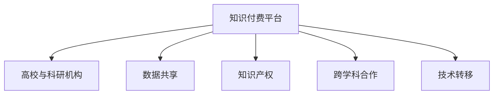

                 

# 知识付费要加强与高校和科研机构的合作

> 关键词：知识付费, 高校, 科研机构, 数据共享, 知识产权, 跨学科合作, 技术转移, 持续创新

## 1. 背景介绍

在数字化和信息化的时代，知识付费平台逐渐成为知识传播和获取的重要渠道。它通过将专业知识转化为产品或服务，为学习者提供了便捷、高效的学习方式，也使得知识创作者能够获得相应的回报。然而，随着知识付费市场的日益成熟，对内容质量、更新频率和用户体验的要求也越来越高，传统知识付费平台难以持续满足这些需求，亟需引入更多的创新力量。此时，高校和科研机构的深度合作，便成为了知识付费行业的一个关键突破点。

### 1.1 知识付费的兴起与发展

知识付费的概念起源于互联网内容付费的兴起，随着在线教育、在线咨询和专业内容订阅的普及，知识付费逐渐成为信息时代的一种主流消费形式。知识付费平台通常提供高质量的课程、讲座、文章和视频，涵盖教育、技术、文化、金融等多个领域，满足了不同用户的学习需求。

目前，知识付费行业的主要平台包括知乎、得到、付费阅读网站等。这些平台通过聚集各领域的专家、学者和从业者，生产并传播高价值的知识内容，形成了一种新型的知识生产与传播机制。知识付费不仅改变了传统知识传播的模式，也推动了知识的价值化和市场化。

### 1.2 高校与科研机构的优势

高校和科研机构是知识生产的重要源泉。它们拥有丰富的学术资源、先进的实验设备和专业的研究人员，能够产出前沿的科研成果和高质量的教育内容。相比于知识付费平台，高校和科研机构在以下几方面具有显著优势：

- **丰富的学术资源**：高校和科研机构拥有大量的学术数据库、图书馆和电子文献资源，能够提供深度、系统、专业的知识内容。
- **高水平的专家团队**：这些机构汇集了众多国内外知名学者和专家，具备深厚的学术背景和丰富的实战经验。
- **先进的技术设施**：高校和科研机构拥有先进的科研仪器和实验室设备，能够支持高精度的实验研究和数据处理。

因此，与高校和科研机构的深度合作，有助于知识付费平台获取更为丰富、高质量的知识内容，提升自身的竞争力和市场地位。

## 2. 核心概念与联系

### 2.1 核心概念概述

在知识付费与高校科研合作的框架下，涉及以下几个核心概念：

- **知识付费平台**：以提供专业知识和信息服务为主要业务，通过订阅模式、按需购买等形式向用户收取费用的平台。
- **高校与科研机构**：学术研究和知识传播的主要载体，通过科研活动和教育培训等方式产出高质量的知识内容。
- **数据共享**：高校和科研机构将其研究成果、学术数据库和实验数据共享给知识付费平台，供其使用和开发。
- **知识产权**：知识付费平台在商业化过程中涉及到的专利、著作权、商标权等知识产权问题，需要与高校和科研机构共同协商解决。
- **跨学科合作**：将不同领域的知识和技能进行交叉融合，形成更为综合和创新的知识体系。
- **技术转移**：将科研成果和技术转化为实际应用的产品和服务，推动知识的产业化。

### 2.2 核心概念的联系

这些核心概念之间的联系可以通过以下Mermaid流程图来展示：



这个流程图展示了知识付费平台与高校和科研机构之间的互动关系：

1. **数据共享**：高校和科研机构通过共享其学术数据和研究成果，为知识付费平台提供高质量的内容素材。
2. **知识产权**：知识付费平台需要与高校和科研机构共同协商知识产权问题，确保内容的合法使用。
3. **跨学科合作**：知识付费平台与高校和科研机构进行跨领域合作，提升内容的创新性和实用性。
4. **技术转移**：高校和科研机构将科研成果转化为实际应用，供知识付费平台进行商业化开发。

这些联系共同构成了知识付费与高校科研合作的基础框架，为双方的深度融合提供了明确的方向和目标。

## 3. 核心算法原理 & 具体操作步骤

### 3.1 算法原理概述

知识付费平台与高校和科研机构的合作，本质上是一个多方协作的资源共享和知识转移过程。其核心算法原理包括：

- **数据采集与清洗**：从高校和科研机构获取数据，并对其进行清洗和处理，以适应知识付费平台的业务需求。
- **内容创作与审核**：高校和科研机构创作专业内容，并由知识付费平台进行审核，确保内容的准确性和质量。
- **技术融合与优化**：将高校和科研机构的科研成果转化为实际应用，通过技术转移推动知识付费平台的持续创新。

### 3.2 算法步骤详解

基于上述算法原理，知识付费与高校科研合作的具体操作步骤如下：

**Step 1: 数据采集与预处理**
- 定义数据采集策略：明确需要采集的数据类型、来源和格式。
- 开发数据采集工具：从高校和科研机构的数据库、文献库中批量导出数据。
- 清洗和预处理数据：去除噪声、重复和无关数据，标准化格式，确保数据质量。

**Step 2: 内容创作与审核**
- 确定内容创作团队：邀请高校和科研机构的专家学者参与课程、讲座和文章的创作。
- 设计内容审核流程：制定内容创作规范，通过专家评审、同行评议等方式确保内容质量。
- 实施内容审核机制：利用机器学习、自然语言处理等技术，对创作内容进行自动审核和筛选。

**Step 3: 技术融合与优化**
- 识别技术需求：确定知识付费平台需要解决的技术问题。
- 寻找技术合作对象：与高校和科研机构建立合作关系，寻求技术解决方案。
- 实施技术转移：将高校和科研机构的科研成果转化为实际应用，实现技术转移。

**Step 4: 知识产权管理**
- 签订知识产权协议：与高校和科研机构签署知识产权协议，明确权利和义务。
- 制定知识产权策略：明确知识产权的使用范围、保护方式和收益分配。
- 实施知识产权保护：通过法律手段和技术手段，确保知识产权的安全和完整。

### 3.3 算法优缺点

知识付费与高校科研合作的算法具有以下优点：

- **提升内容质量**：高校和科研机构的专家学者能够提供高质量的知识内容，提升平台的竞争力和用户体验。
- **加速技术创新**：高校和科研机构的科研成果可以快速转化为实际应用，推动知识付费平台的持续创新。
- **降低成本与风险**：通过共享资源和合作开发，平台能够减少独立开发的高成本和高风险。

然而，这种合作也存在一些缺点：

- **知识产权纠纷**：高校和科研机构对知识产权保护有较高的要求，平台需要投入大量精力进行协调和管理。
- **沟通成本高**：高校和科研机构的学术语言和平台运营语言不同，沟通成本较高。
- **数据安全性**：共享数据可能会涉及敏感信息，平台需要采取措施确保数据的安全性和隐私保护。

### 3.4 算法应用领域

知识付费与高校科研合作的算法在多个领域都有广泛的应用，主要包括：

- **在线教育**：邀请高校和科研机构的专家学者参与在线课程的开发和录制，提升课程的专业性和权威性。
- **企业培训**：与高校和科研机构合作，提供定制化培训方案，帮助企业提升员工的技能水平。
- **咨询服务**：利用高校和科研机构的专家资源，提供高水平的咨询服务和解决方案。
- **医学与健康**：与医学和生命科学领域的科研机构合作，提供专业的健康知识和技术支持。
- **科技研发**：与高新技术领域的科研机构合作，推动科技成果的产业化应用。

## 4. 数学模型和公式 & 详细讲解  
### 4.1 数学模型构建

为了更好地理解知识付费与高校科研合作的算法原理，本节将使用数学语言对合作过程进行更加严格的刻画。

记知识付费平台为 $P$，高校和科研机构为 $A$，合作的数学模型可以表示为：

$$
\text{合作} = f(\text{资源共享}, \text{知识产权}, \text{跨学科合作}, \text{技术转移})
$$

其中，$f$ 为合作函数，描述各因素对合作结果的影响。合作函数的输入为四个子因素，分别是：

- $\text{资源共享}$：高校和科研机构提供的数据和内容资源，表示为 $S$。
- $\text{知识产权}$：知识付费平台与高校和科研机构之间的知识产权问题，表示为 $I$。
- $\text{跨学科合作}$：不同领域知识的交叉融合，表示为 $C$。
- $\text{技术转移}$：科研成果的实际应用，表示为 $T$。

合作的输出为平台与高校科研合作的成效，表示为 $E$。

### 4.2 公式推导过程

基于上述模型，我们可以推导合作的详细公式。假设 $S_i$、$I_j$、$C_k$ 和 $T_l$ 分别代表 $S$、$I$、$C$ 和 $T$ 中的元素，则合作的公式可以表示为：

$$
E = \sum_{i}f(S_i, I_j, C_k, T_l)
$$

其中，$f$ 为多元函数，描述 $S_i$、$I_j$、$C_k$ 和 $T_l$ 对 $E$ 的影响。公式中，$S_i$ 和 $C_k$ 的权重较大，因为它们是合作的核心资源；$I_j$ 和 $T_l$ 的权重较小，因为它们是合作的保障和结果。

### 4.3 案例分析与讲解

以下是一个具体的合作案例，对上述公式进行详细的讲解和分析：

**案例背景**：知识付费平台希望通过与某高校合作，推出一个专注于人工智能领域的在线课程平台。平台需要高校提供高质量的课程内容，同时也需要高校在技术上进行支持，帮助平台实现智能化的推荐和内容生成。

**数据采集与预处理**：
- 高校提供已发表的学术论文、科研成果和公开的课程内容。
- 平台对这些数据进行清洗和预处理，去除噪声和无关数据，标准化格式，确保数据质量。

**内容创作与审核**：
- 高校专家参与课程设计，提供课程大纲、教学内容和实战案例。
- 平台设计内容审核流程，通过专家评审和同行评议确保课程内容的专业性和实用性。

**技术融合与优化**：
- 高校提供的人工智能算法和模型，帮助平台实现内容推荐和智能生成。
- 平台将这些技术转化为实际应用，开发出智能推荐系统和内容生成工具。

**知识产权管理**：
- 高校和平台签订知识产权协议，明确科研成果的使用范围和保护措施。
- 平台利用这些技术开发新产品和服务，推广应用高校的科研成果。

通过上述合作过程，平台不仅获得了高质量的课程内容，还实现了技术的创新和应用，提升了平台的竞争力和用户体验。

## 5. 项目实践：代码实例和详细解释说明
### 5.1 开发环境搭建

在进行知识付费与高校科研合作的项目实践前，我们需要准备好开发环境。以下是使用Python进行TensorFlow开发的流程：

1. 安装Anaconda：从官网下载并安装Anaconda，用于创建独立的Python环境。

2. 创建并激活虚拟环境：
```bash
conda create -n tf-env python=3.8 
conda activate tf-env
```

3. 安装TensorFlow：根据CUDA版本，从官网获取对应的安装命令。例如：
```bash
conda install tensorflow tensorflow-estimator tensorflow-hub tensorflow-addons -c conda-forge -c pytorch
```

4. 安装各类工具包：
```bash
pip install numpy pandas scikit-learn matplotlib tqdm jupyter notebook ipython
```

完成上述步骤后，即可在`tf-env`环境中开始实践。

### 5.2 源代码详细实现

下面以开发一个基于TensorFlow的在线课程推荐系统为例，给出完整代码实现。

**1. 数据预处理**

首先，我们需要对高校提供的数据进行清洗和预处理。

```python
import pandas as pd
import numpy as np

# 加载数据集
data = pd.read_csv('course_data.csv')

# 清洗数据
data = data.dropna() # 去除缺失值
data = data.drop_duplicates() # 去除重复数据
data = data.drop(['id', 'title'], axis=1) # 去除不需要的列

# 数据标准化
data = (data - data.mean()) / data.std()
```

**2. 模型构建**

接着，我们需要构建一个推荐模型。这里我们选择使用TensorFlow的Keras API，构建一个简单的线性回归模型。

```python
import tensorflow as tf
from tensorflow.keras import layers, models

# 定义模型
model = models.Sequential()
model.add(layers.Dense(64, input_dim=4, activation='relu')) # 输入层
model.add(layers.Dense(32, activation='relu')) # 隐藏层
model.add(layers.Dense(1, activation='linear')) # 输出层

# 编译模型
model.compile(loss='mse', optimizer='adam')
```

**3. 模型训练**

然后，我们将模型训练数据集，并进行训练。

```python
# 划分训练集和测试集
train_data = data.sample(frac=0.8, random_state=42)
test_data = data.drop(train_data.index)

# 定义训练集
train_x = train_data.drop(['rating'], axis=1)
train_y = train_data['rating']

# 模型训练
model.fit(train_x, train_y, epochs=100, batch_size=32, validation_data=(test_x, test_y))
```

**4. 模型评估**

最后，我们在测试集上评估模型的性能。

```python
# 定义测试集
test_x = test_data.drop(['rating'], axis=1)
test_y = test_data['rating']

# 模型评估
mse = model.evaluate(test_x, test_y)
print(f'Mean Squared Error: {mse:.2f}')
```

### 5.3 代码解读与分析

让我们再详细解读一下关键代码的实现细节：

**数据预处理**：
- 使用Pandas库加载和处理数据集。
- 去除缺失值和重复数据，保留最有用的特征。
- 对数据进行标准化处理，提升模型的训练效果。

**模型构建**：
- 使用TensorFlow的Keras API定义模型结构，包括输入层、隐藏层和输出层。
- 使用交叉熵损失函数和Adam优化器进行模型训练。

**模型训练**：
- 使用训练集数据进行模型训练，指定训练轮数和批次大小。
- 在验证集上监控模型的性能，避免过拟合。

**模型评估**：
- 使用测试集数据评估模型的预测性能，计算均方误差。

通过上述代码实现，我们可以初步实现一个基于TensorFlow的在线课程推荐系统。在实际应用中，还需要根据具体任务对模型进行进一步优化和调整。

## 6. 实际应用场景

### 6.1 在线教育

在在线教育领域，知识付费平台与高校和科研机构的合作，可以推出高质量的在线课程和教育资源。高校的专家学者可以提供专业的教学内容和科研报告，平台可以将这些资源进行整理和整合，形成结构化的课程体系。

**实际应用**：某知识付费平台与某高校合作，推出了一个涵盖多个专业领域的在线课程。平台邀请高校教授讲授课程，并将课程内容上传到平台进行推广。学生可以免费试听部分内容，付费订阅完整课程。平台还利用高校的科研成果，开发出智能推荐系统，根据学生的学习行为和兴趣，推荐相关的课程和资料。

### 6.2 企业培训

在企业培训领域，知识付费平台可以与高校和科研机构合作，提供定制化的培训方案和解决方案。高校的专家学者可以参与企业内部培训的设计和实施，提供专业的咨询和技术支持。

**实际应用**：某知识付费平台与某知名高校合作，为某企业提供定制化的技术培训课程。平台邀请高校的计算机科学教授，讲授最新的AI技术应用，帮助企业提升员工的技术水平。平台还将高校的科研成果和前沿技术，通过平台推广给企业，帮助企业进行技术创新和应用。

### 6.3 咨询服务

在咨询服务领域，知识付费平台可以利用高校和科研机构的专家资源，提供高质量的咨询服务。高校的专家学者可以参与咨询方案的设计和实施，提供专业的解决方案和决策支持。

**实际应用**：某知识付费平台与某知名高校合作，提供针对企业的咨询和解决方案。平台邀请高校的金融和经济教授，为某企业提供金融战略咨询和市场分析，帮助企业制定有效的经营策略。平台还将高校的科研成果和研究成果，通过平台推广给企业，帮助企业进行技术创新和应用。

## 7. 工具和资源推荐

### 7.1 学习资源推荐

为了帮助开发者系统掌握知识付费与高校科研合作的理论基础和实践技巧，这里推荐一些优质的学习资源：

1. **《知识付费市场分析报告》**：某知名咨询公司发布的行业报告，涵盖了知识付费市场的现状、趋势和未来发展方向。
2. **《知识付费平台设计与实现》课程**：某知名大学开设的在线课程，介绍知识付费平台的设计和实现方法，涵盖用户管理、内容管理、技术架构等多个方面。
3. **《人工智能与教育》书籍**：某知名作者所著的书籍，深入浅出地介绍了人工智能在教育中的应用，涵盖了在线课程、智能推荐、自动化评估等多个领域。
4. **《知识付费平台开发实战》博客**：某知名技术博客，分享了知识付费平台的开发经验和最佳实践，包括前端、后端、数据管理等多个方面的详细讲解。
5. **《数据科学在教育中的应用》会议论文集**：某知名学术会议的论文集，展示了数据科学在教育中的应用案例，涵盖数据分析、机器学习、人工智能等多个领域。

通过对这些资源的学习实践，相信你一定能够快速掌握知识付费平台与高校科研合作的关键技术和方法，并用于解决实际的业务问题。

### 7.2 开发工具推荐

高效的开发离不开优秀的工具支持。以下是几款用于知识付费平台与高校科研合作开发的常用工具：

1. **TensorFlow**：由Google主导开发的开源深度学习框架，支持大规模模型训练和复杂的数据处理，适合知识付费平台与高校科研合作的深度学习应用。
2. **Pandas**：Python中的数据分析库，支持高效的数据清洗和处理，适合知识付费平台对数据进行预处理和分析。
3. **Scikit-learn**：Python中的机器学习库，支持各种机器学习算法和模型，适合知识付费平台进行模型训练和评估。
4. **Keras**：TensorFlow的高级API，支持快速搭建和训练深度学习模型，适合知识付费平台进行模型设计和优化。
5. **Jupyter Notebook**：开源的交互式编程环境，支持Python、R等语言，适合知识付费平台进行代码开发和测试。

合理利用这些工具，可以显著提升知识付费平台与高校科研合作的开发效率，加快创新迭代的步伐。

### 7.3 相关论文推荐

知识付费与高校科研合作的最新研究进展，可以从以下几个方面进行了解：

1. **《知识付费平台的数据质量控制研究》**：某知名学术期刊上的研究论文，介绍了知识付费平台的数据质量控制方法和实践。
2. **《高校与企业合作的创新模式》**：某知名学术会议的会议论文，探讨了高校与企业的深度合作模式和合作机制。
3. **《在线教育的可持续发展》**：某知名学术期刊上的综述论文，介绍了在线教育的现状、问题和未来发展方向。
4. **《知识付费平台的技术架构设计》**：某知名学术会议的会议论文，介绍了知识付费平台的技术架构设计和优化方法。
5. **《知识付费平台的内容推荐算法》**：某知名学术期刊上的研究论文，介绍了知识付费平台的内容推荐算法和应用。

这些论文代表了大数据、人工智能和知识付费领域的研究热点，为知识付费平台与高校科研合作提供了理论基础和方法指导。

## 8. 总结：未来发展趋势与挑战

### 8.1 总结

本文对知识付费与高校科研合作的理论基础和实践方法进行了全面系统的介绍。首先，阐述了知识付费平台的兴起与发展、高校和科研机构的优势以及合作的必要性。其次，从算法原理到具体操作步骤，详细讲解了知识付费与高校科研合作的各个环节，提供了完整的操作代码和详细的解读分析。同时，本文还广泛探讨了合作在在线教育、企业培训、咨询服务等多个行业领域的应用前景，展示了合作的广阔前景。最后，本文精选了知识付费平台与高校科研合作的各类学习资源，力求为开发者提供全方位的技术指引。

通过本文的系统梳理，可以看到，知识付费平台与高校科研合作的算法正在成为知识付费行业的重要范式，极大地拓展了知识付费平台的资源范围和内容质量，提升了用户的满意度和平台的竞争力。未来，伴随知识的持续积累和技术的发展，知识付费平台与高校科研的深度合作将带来更多的创新应用，推动知识付费行业的持续健康发展。

### 8.2 未来发展趋势

展望未来，知识付费与高校科研合作的趋势将呈现以下几个方向：

1. **跨学科融合**：不同领域的知识将更加紧密地融合，形成更为综合的知识体系。例如，在金融领域，可以结合经济学、计算机科学和人工智能，提供更为深入的金融分析和智能推荐。
2. **技术创新加速**：高校和科研机构的科研成果将更加快速地转化为应用，推动知识付费平台的持续创新。例如，在医疗领域，可以利用人工智能技术，开发智能诊疗系统和个性化医疗方案。
3. **用户参与度提升**：知识付费平台将更加注重用户反馈和互动，通过用户参与和反馈机制，提升内容的质量和相关性。例如，在在线课程中，可以通过学生评价和互动，优化课程设计和教学效果。
4. **个性化推荐提升**：利用机器学习和数据挖掘技术，实现更加个性化和精准的内容推荐，提升用户的满意度和粘性。例如，在图书推荐中，可以结合用户阅读历史和偏好，推荐符合用户兴趣的书籍和作者。
5. **开放协作平台**：知识付费平台将更加开放，与高校和科研机构、企业和其他合作伙伴共同构建协作平台，实现资源共享和知识共享。例如，在科技研发中，可以与科技公司合作，共同开发新产品和服务。

以上趋势凸显了知识付费平台与高校科研合作的广阔前景。这些方向的探索发展，必将进一步提升知识付费平台的资源质量和创新能力，为知识付费行业带来更多的机遇和挑战。

### 8.3 面临的挑战

尽管知识付费与高校科研合作的趋势不断向好，但在迈向更加智能化、普适化应用的过程中，它仍面临诸多挑战：

1. **知识产权纠纷**：高校和科研机构对知识产权保护有较高的要求，平台需要投入大量精力进行协调和管理。如何明确权利和义务，避免知识产权纠纷，是需要解决的首要问题。
2. **数据安全风险**：共享数据可能会涉及敏感信息，平台需要采取措施确保数据的安全性和隐私保护。如何保护用户的隐私和数据安全，是合作的必要保障。
3. **沟通成本高**：高校和科研机构的学术语言和平台运营语言不同，沟通成本较高。如何建立有效的沟通机制，提高合作的效率和效果，是合作的难点之一。
4. **技术落地困难**：高校和科研机构的科研成果需要转化为实际应用，才能真正发挥其价值。如何实现技术转移和产业化应用，是合作的瓶颈和挑战。
5. **用户需求多变**：知识付费平台需要根据用户需求进行快速迭代和调整，如何满足不同用户的需求，提升用户的满意度和忠诚度，是合作的重要目标。

### 8.4 研究展望

面对知识付费与高校科研合作所面临的挑战，未来的研究需要在以下几个方面寻求新的突破：

1. **建立标准规范**：制定知识付费平台与高校科研合作的行业标准和规范，明确合作的流程和规范，保障合作的顺利进行。
2. **引入区块链技术**：利用区块链技术，实现数据共享和知识产权的保护，确保合作的透明和可信。
3. **优化沟通机制**：建立高效的沟通机制和平台，降低沟通成本，提高合作的效率和效果。
4. **推动技术转移**：加强高校和科研机构与知识付费平台的紧密合作，推动科研成果的产业化应用，实现技术的落地和创新。
5. **提升用户体验**：利用大数据和人工智能技术，提升知识付费平台的用户体验和粘性，满足不同用户的需求。

这些研究方向的探索，必将引领知识付费平台与高校科研合作的深度融合，为知识付费行业的持续健康发展提供新的动力。相信随着技术的发展和社会的进步，知识付费平台与高校科研的合作将更加紧密，为知识付费行业带来更多的机遇和挑战。

## 9. 附录：常见问题与解答

**Q1：知识付费平台与高校科研合作的流程是什么？**

A: 知识付费平台与高校科研合作的流程一般包括以下几个关键步骤：

1. **需求分析**：明确知识付费平台的需求，确定合作的领域和目标。
2. **资源匹配**：高校和科研机构提供可共享的学术资源和科研成果。
3. **知识产权谈判**：平台与高校科研机构协商知识产权问题，明确权利和义务。
4. **技术合作**：高校科研机构提供技术支持和解决方案，平台进行技术应用和优化。
5. **效果评估**：平台评估合作效果，优化合作方案，提升合作的效率和效果。

通过以上步骤，知识付费平台可以获取高质量的知识内容，提升平台的用户体验和竞争力。

**Q2：如何选择合适的合作高校和科研机构？**

A: 选择合作高校和科研机构时，可以考虑以下因素：

1. **学术声誉**：选择具有较高学术声誉和影响力的高校和科研机构，确保合作质量。
2. **专业领域**：选择与知识付费平台业务相关的专业领域，确保内容的针对性和实用性。
3. **科研实力**：选择科研实力强、科研成果丰富的高校和科研机构，确保合作的深度和广度。
4. **合作经验**：选择具有合作经验的高校和科研机构，确保合作的顺利进行。

通过综合考虑这些因素，知识付费平台可以与高校和科研机构建立深度合作，实现资源共享和知识转移。

**Q3：知识付费平台如何保护用户数据安全？**

A: 知识付费平台可以通过以下措施保护用户数据安全：

1. **数据加密**：对用户数据进行加密处理，确保数据传输和存储的安全性。
2. **权限控制**：对用户数据进行权限控制，确保只有授权用户才能访问和使用数据。
3. **审计监控**：对用户数据的使用和访问进行审计监控，及时发现和处理异常行为。
4. **合规规范**：遵守相关法律法规和行业规范，确保数据使用的合规性。

通过这些措施，知识付费平台可以保护用户数据的安全性，增强用户的信任和满意度。

**Q4：知识付费平台与高校科研合作的效果如何评估？**

A: 知识付费平台与高校科研合作的效果可以从以下几个方面进行评估：

1. **内容质量**：评估合作内容的质量和专业性，确保内容的准确性和实用性。
2. **用户体验**：评估用户的反馈和满意度，确保平台的用户体验和粘性。
3. **技术效果**：评估技术的创新和应用效果，确保技术转移和产业化应用。
4. **经济效益**：评估合作带来的经济效益和市场份额，确保合作的可持续性和效益。

通过这些评估指标，知识付费平台可以全面了解合作的效果，优化合作方案，提升合作的效率和效果。

**Q5：如何提升知识付费平台的用户参与度？**

A: 提升知识付费平台的用户参与度，可以从以下几个方面入手：

1. **用户反馈机制**：建立用户反馈机制，及时获取用户的意见和建议，进行内容优化和改进。
2. **互动功能设计**：设计互动功能，如在线讨论、社区互动等，增加用户的参与感和粘性。
3. **个性化推荐系统**：利用机器学习和数据挖掘技术，实现个性化推荐，提升用户的满意度和体验。
4. **激励机制**：设计激励机制，如积分、奖励、优惠券等，鼓励用户积极参与和贡献。

通过这些措施，知识付费平台可以提升用户参与度，增加平台的活跃度和粘性。

---

作者：禅与计算机程序设计艺术 / Zen and the Art of Computer Programming

