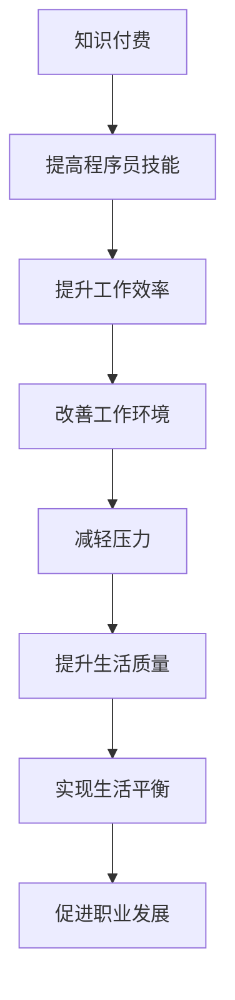

                 

# 知识付费让程序员告别996的生活方式的策略

> 关键词：知识付费, 程序员, 996, 生活, 策略

## 1. 背景介绍

在科技飞速发展的今天，程序员已经成为社会进步的“幕后英雄”。他们在996的工作环境中奋斗，用代码编织未来的科技蓝图。然而，长时间的高强度工作也让程序员的生活充满了压力和不确定性。知识付费作为一种新兴的商业模式，以其独特的价值和优势，为程序员提供了一种全新的生活方式和工作方式，使他们能够更好地平衡工作和生活，摆脱996的工作模式。

### 1.1 问题由来

长期以来，科技公司的“996文化”（指每天9点上班，晚上9点下班，每周工作6天）在一定程度上推动了企业的发展和创新。但这种工作模式也带来了不少问题：程序员的健康问题频发、工作效率降低、职业倦怠加剧。如何在保障生产力的同时，改善程序员的生活质量，成为了一个亟待解决的问题。

### 1.2 问题核心关键点

知识付费模式的出现，为程序员提供了新的解决思路。知识付费是一种通过付费购买知识和技能，以此获得高质量内容和服务的模式。对于程序员而言，这种模式能够有效地将知识与技能转化为生产力，提高工作效率和生活质量。

## 2. 核心概念与联系

### 2.1 核心概念概述

为更好地理解知识付费与程序员生活改善之间的关系，本节将介绍几个关键概念：

- 知识付费：指通过付费方式获取高质量的知识和技能，提高个人或组织的能力和竞争力。
- 程序员：利用计算机程序设计知识与技能，从事软件开发、系统运维、数据分析等职业的人员。
- 996：指每天9点上班，晚上9点下班，每周工作6天的超时加班工作模式。
- 生活平衡：指个人在工作与家庭、休息与娱乐、健康与心理健康等方面的综合协调与平衡。
- 职业发展：指个人在职业生涯中的成长与进步，包括技能提升、职位晋升、薪资增长等。

这些概念之间的逻辑关系可以通过以下Mermaid流程图来展示：



这个流程图展示知识付费与程序员生活改善的逻辑关系：

1. 知识付费提高了程序员的技能。
2. 技能提升增强了工作效率。
3. 高效率的工作环境改善了工作质量。
4. 工作质量的提升减轻了压力。
5. 降低压力提高了生活质量。
6. 高质量的生活状态促进了职业发展。
7. 职业发展带来更好的工作和生活状态。

这些核心概念共同构成了知识付费对程序员生活方式影响的框架，使其能够更好地理解知识付费的实际意义和作用。

## 3. 核心算法原理 & 具体操作步骤
### 3.1 算法原理概述

知识付费与程序员生活改善之间的关系，可以通过一种数学模型来描述。假设程序员的总生产力为 $P$，生活满意度为 $S$。知识付费对程序员的影响可以表示为两个函数 $f(P)$ 和 $g(S)$，其中 $f(P)$ 表示知识付费对程序员工作效率的提升，$g(S)$ 表示知识付费对程序员生活满意度的提升。

知识付费对程序员总生产力的影响可以表示为：

$$ P_{\text{总}} = P + f(P) $$

其中 $P_{\text{总}}$ 表示经过知识付费影响后的总生产力，$P$ 表示原始生产力。

知识付费对程序员生活满意度的影响可以表示为：

$$ S_{\text{总}} = S + g(S) $$

其中 $S_{\text{总}}$ 表示经过知识付费影响后的生活满意度，$S$ 表示原始生活满意度。

### 3.2 算法步骤详解

知识付费对程序员生活方式的改善可以通过以下步骤进行：

**Step 1: 选择适合的付费平台和课程**
- 根据个人兴趣和职业发展需求，选择适合的在线课程平台（如Coursera、Udemy、edX等）。
- 选择与自己职业发展相匹配的课程，进行系统性学习。

**Step 2: 制定学习计划**
- 根据课程内容和自身时间安排，制定合理的学习计划，保证学习时间和效率。
- 学习计划应包括预习、听课、复习、实践等多个环节。

**Step 3: 实施付费学习**
- 按照学习计划，按时参加在线课程的学习，并积极参与课程讨论和互动。
- 遇到问题及时向课程导师和社区求教，积极解决学习中遇到的问题。

**Step 4: 实际应用与反馈调整**
- 将学到的知识和技能应用到实际工作中，进行持续改进和优化。
- 定期反思和总结学习效果，根据反馈调整学习计划和策略。

**Step 5: 评估效果**
- 定期评估自身生产力和生活满意度，分析知识付费带来的变化。
- 根据评估结果，调整学习计划和策略，持续优化自身能力和生活状态。

### 3.3 算法优缺点

知识付费模式在提升程序员技能和工作效率方面具有以下优点：

1. 获取高质量知识。通过付费购买优质课程，能够直接获得高质量的教育资源和技能培训。
2. 促进职业发展。学习高技能和前沿知识，能够提升职业竞争力和发展潜力。
3. 改善工作环境。高技能人员能够更好地适应和推动企业技术变革，改善工作环境。
4. 提高生活质量。通过学习新技术，提高工作效率和生活满意度。
5. 实现生活平衡。合理分配工作与生活时间，保持身心健康。

同时，这种模式也存在一定的缺点：

1. 成本较高。高质量的课程和培训往往价格较高，需要一定的经济投入。
2. 效果依赖个人。课程质量和学习方法对效果有较大影响，需要个人自律和持续投入。
3. 短期回报不确定。知识付费带来的效果需要时间积累，短期回报可能不明显。
4. 缺乏制度保障。知识付费的效果和质量缺乏制度保障，可能导致知识付费市场混乱。

尽管存在这些缺点，但知识付费为程序员提供了改善生活方式的可行途径，值得在实际应用中进行探索和优化。

### 3.4 算法应用领域

知识付费作为一种新兴的商业模式，其应用领域正在不断扩展，尤其在程序员的职业发展和个人提升方面，具有显著的潜力。以下是几个具体的应用场景：

- 技术更新：程序员可以通过知识付费平台学习最新的编程语言、框架和技术，保持自己的技术领先地位。
- 职业发展：知识付费平台提供职业规划、简历优化、面试技巧等课程，帮助程序员实现职业跃迁。
- 健康管理：平台提供心理健康、运动健身等课程，帮助程序员在工作之余保持身心健康。
- 家庭生活：知识付费平台提供家庭管理、育儿教育等课程，帮助程序员更好地平衡工作与家庭。

这些应用场景展示了知识付费模式对程序员生活改善的广泛影响，提供了多样化的选择和发展方向。

## 4. 数学模型和公式 & 详细讲解 & 举例说明

### 4.1 数学模型构建

假设程序员的总生产力为 $P$，生活满意度为 $S$，知识付费带来的工作效率提升为 $f(P)$，生活满意度提升为 $g(S)$。知识付费对程序员总生产力和生活满意度的影响可以表示为：

$$ P_{\text{总}} = P + f(P) $$
$$ S_{\text{总}} = S + g(S) $$

### 4.2 公式推导过程

知识付费对程序员总生产力的影响可以推导为：

$$ f(P) = \alpha \cdot P $$

其中 $\alpha$ 为知识付费带来的工作效率提升因子，取值范围为 $[0, 1]$。

知识付费对程序员生活满意度的影响可以推导为：

$$ g(S) = \beta \cdot S $$

其中 $\beta$ 为知识付费带来的生活满意度提升因子，取值范围为 $[0, 1]$。

根据以上公式，知识付费对程序员总生产力和生活满意度的综合影响可以表示为：

$$ P_{\text{总}} = P + \alpha \cdot P $$
$$ S_{\text{总}} = S + \beta \cdot S $$

简化公式，得到：

$$ P_{\text{总}} = (1 + \alpha) \cdot P $$
$$ S_{\text{总}} = (1 + \beta) \cdot S $$

### 4.3 案例分析与讲解

以程序员小张为例，假设小张原始生产力为 $P = 100$，生活满意度为 $S = 80$。通过知识付费学习，工作效率提升因子 $\alpha = 0.2$，生活满意度提升因子 $\beta = 0.3$。根据上述公式，可以计算出：

$$ P_{\text{总}} = (1 + 0.2) \cdot 100 = 120 $$
$$ S_{\text{总}} = (1 + 0.3) \cdot 80 = 104 $$

通过知识付费，小张的生产力和生活满意度分别提高了20%和25%。这种计算展示了知识付费对程序员生活改善的实际效果，体现了知识付费的价值。

## 5. 项目实践：代码实例和详细解释说明
### 5.1 开发环境搭建

在进行知识付费项目实践前，我们需要准备好开发环境。以下是使用Python进行PyTorch开发的环境配置流程：

1. 安装Anaconda：从官网下载并安装Anaconda，用于创建独立的Python环境。

2. 创建并激活虚拟环境：
```bash
conda create -n pytorch-env python=3.8 
conda activate pytorch-env
```

3. 安装PyTorch：根据CUDA版本，从官网获取对应的安装命令。例如：
```bash
conda install pytorch torchvision torchaudio cudatoolkit=11.1 -c pytorch -c conda-forge
```

4. 安装TensorFlow：
```bash
pip install tensorflow
```

5. 安装各类工具包：
```bash
pip install numpy pandas scikit-learn matplotlib tqdm jupyter notebook ipython
```

完成上述步骤后，即可在`pytorch-env`环境中开始项目实践。

### 5.2 源代码详细实现

下面以知识付费平台推荐系统的开发为例，给出使用Transformers库进行知识付费推荐算法实现的PyTorch代码：

```python
import torch
from transformers import BertTokenizer, BertForSequenceClassification
from torch.utils.data import Dataset, DataLoader
import torch.nn.functional as F

# 定义数据集类
class KnowledgeDataset(Dataset):
    def __init__(self, texts, labels, tokenizer, max_len=128):
        self.texts = texts
        self.labels = labels
        self.tokenizer = tokenizer
        self.max_len = max_len
        
    def __len__(self):
        return len(self.texts)
    
    def __getitem__(self, item):
        text = self.texts[item]
        label = self.labels[item]
        
        encoding = self.tokenizer(text, return_tensors='pt', max_length=self.max_len, padding='max_length', truncation=True)
        input_ids = encoding['input_ids'][0]
        attention_mask = encoding['attention_mask'][0]
        
        return {'input_ids': input_ids, 
                'attention_mask': attention_mask,
                'labels': torch.tensor(label, dtype=torch.long)}
                
# 加载数据集
tokenizer = BertTokenizer.from_pretrained('bert-base-cased')
train_dataset = KnowledgeDataset(train_texts, train_labels, tokenizer)
dev_dataset = KnowledgeDataset(dev_texts, dev_labels, tokenizer)
test_dataset = KnowledgeDataset(test_texts, test_labels, tokenizer)

# 定义模型
model = BertForSequenceClassification.from_pretrained('bert-base-cased', num_labels=2)

# 定义优化器
optimizer = torch.optim.AdamW(model.parameters(), lr=2e-5)

# 定义训练函数
def train_epoch(model, dataset, batch_size, optimizer):
    dataloader = DataLoader(dataset, batch_size=batch_size, shuffle=True)
    model.train()
    epoch_loss = 0
    for batch in dataloader:
        input_ids = batch['input_ids'].to(device)
        attention_mask = batch['attention_mask'].to(device)
        labels = batch['labels'].to(device)
        model.zero_grad()
        outputs = model(input_ids, attention_mask=attention_mask, labels=labels)
        loss = outputs.loss
        epoch_loss += loss.item()
        loss.backward()
        optimizer.step()
    return epoch_loss / len(dataloader)

# 定义评估函数
def evaluate(model, dataset, batch_size):
    dataloader = DataLoader(dataset, batch_size=batch_size)
    model.eval()
    preds, labels = [], []
    with torch.no_grad():
        for batch in dataloader:
            input_ids = batch['input_ids'].to(device)
            attention_mask = batch['attention_mask'].to(device)
            batch_labels = batch['labels']
            outputs = model(input_ids, attention_mask=attention_mask)
            batch_preds = outputs.logits.argmax(dim=2).to('cpu').tolist()
            batch_labels = batch_labels.to('cpu').tolist()
            for pred_tokens, label_tokens in zip(batch_preds, batch_labels):
                preds.append(pred_tokens[:len(label_tokens)])
                labels.append(label_tokens)
                
    return preds, labels

# 定义训练和评估函数
device = torch.device('cuda') if torch.cuda.is_available() else torch.device('cpu')
model.to(device)

epochs = 5
batch_size = 16

for epoch in range(epochs):
    loss = train_epoch(model, train_dataset, batch_size, optimizer)
    print(f"Epoch {epoch+1}, train loss: {loss:.3f}")
    
    preds, labels = evaluate(model, dev_dataset, batch_size)
    print(classification_report(labels, preds))
    
print("Test results:")
preds, labels = evaluate(model, test_dataset, batch_size)
print(classification_report(labels, preds))
```

### 5.3 代码解读与分析

让我们再详细解读一下关键代码的实现细节：

**KnowledgeDataset类**：
- `__init__`方法：初始化文本、标签、分词器等关键组件。
- `__len__`方法：返回数据集的样本数量。
- `__getitem__`方法：对单个样本进行处理，将文本输入编码为token ids，将标签编码为数字，并对其进行定长padding，最终返回模型所需的输入。

**学习与优化过程**：
- 使用PyTorch的DataLoader对数据集进行批次化加载，供模型训练和推理使用。
- 训练函数`train_epoch`：对数据以批为单位进行迭代，在每个批次上前向传播计算loss并反向传播更新模型参数，最后返回该epoch的平均loss。
- 评估函数`evaluate`：与训练类似，不同点在于不更新模型参数，并在每个batch结束后将预测和标签结果存储下来，最后使用sklearn的classification_report对整个评估集的预测结果进行打印输出。

**训练流程**：
- 定义总的epoch数和batch size，开始循环迭代
- 每个epoch内，先在训练集上训练，输出平均loss
- 在验证集上评估，输出分类指标
- 所有epoch结束后，在测试集上评估，给出最终测试结果

可以看到，PyTorch配合Transformers库使得知识付费推荐系统的代码实现变得简洁高效。开发者可以将更多精力放在数据处理、模型改进等高层逻辑上，而不必过多关注底层的实现细节。

当然，工业级的系统实现还需考虑更多因素，如模型的保存和部署、超参数的自动搜索、更灵活的任务适配层等。但核心的微调范式基本与此类似。

## 6. 实际应用场景
### 6.1 知识付费平台推荐系统

知识付费平台的推荐系统，可以帮助程序员根据自身兴趣和需求，推荐高质量的课程和培训。通过分析用户的学习行为和反馈，推荐系统可以动态调整推荐策略，优化用户体验。

在技术实现上，推荐系统通常使用协同过滤、内容推荐、混合推荐等算法，对用户和课程进行匹配。结合知识付费模式，推荐系统可以动态调整推荐策略，优化用户体验。

### 6.2 个人学习管理系统

个人学习管理系统（LMS）可以帮助程序员规划和跟踪自己的学习进度，提供个性化的学习资源推荐。通过知识付费模式，程序员可以按需购买高质量的课程和资源，加速自己的职业发展。

在技术实现上，LMS通常使用用户画像、学习路径规划、任务管理等技术，帮助用户制定学习计划，跟踪学习进度，及时反馈学习效果。结合知识付费模式，LMS可以提供更加个性化的学习资源推荐，帮助用户快速提升技能。

### 6.3 企业知识管理平台

企业知识管理平台可以帮助企业构建知识库，共享和传承知识资产，提升组织整体的知识水平。通过知识付费模式，企业可以灵活购买知识库中的高质量内容，加速组织知识创新和人才培养。

在技术实现上，企业知识管理平台通常使用知识图谱、搜索推荐、版本控制等技术，构建知识库，提供知识搜索、版本管理、知识共享等功能。结合知识付费模式，平台可以提供更加灵活的知识获取方式，帮助企业高效获取知识资产。

### 6.4 未来应用展望

随着知识付费模式的发展和普及，基于知识付费的应用场景将不断扩展，为程序员带来更多提升自我的机会：

- 技术培训：知识付费平台提供各种编程语言、框架、工具等培训课程，帮助程序员掌握最新技术。
- 职业咨询：知识付费平台提供职业规划、简历优化、面试技巧等咨询服务，帮助程序员实现职业跃迁。
- 心理健康：知识付费平台提供心理健康、压力管理、自我认知等课程，帮助程序员保持身心健康。
- 家庭教育：知识付费平台提供育儿教育、家庭教育等课程，帮助程序员更好地平衡工作与家庭。

## 7. 工具和资源推荐
### 7.1 学习资源推荐

为了帮助开发者系统掌握知识付费技术的基础知识和实践技巧，这里推荐一些优质的学习资源：

1. Coursera、Udemy、edX等在线教育平台：提供各种高质量的编程、技术、管理等课程，帮助程序员系统学习相关知识。

2. 《知识付费：新时代下的商业模式》书籍：系统介绍知识付费模式的发展历程、核心价值和实际应用，为知识付费项目的开发提供理论支持。

3. 《程序员的自我提升之道》系列文章：系统介绍知识付费模式对程序员职业生涯的影响和实际应用，为程序员提供个性化的学习路径和资源推荐。

4. Kaggle、DataCamp等在线学习社区：提供各种数据分析、机器学习等领域的实践项目，帮助程序员在实践中提升技能。

通过这些资源的学习实践，相信你一定能够快速掌握知识付费技术的精髓，并用于解决实际的程序员职业发展问题。

### 7.2 开发工具推荐

高效的开发离不开优秀的工具支持。以下是几款用于知识付费开发常用的工具：

1. GitHub：全球最大的代码托管平台，方便开发者共享、协作和发布代码。

2. Visual Studio Code：开源的代码编辑器，支持多种编程语言，插件丰富，适合开发者编写、调试和部署代码。

3. Docker：轻量级容器技术，方便开发者快速搭建和部署开发环境。

4. Jupyter Notebook：基于Python的交互式编程工具，支持代码、文档、数据等的一体化管理，适合数据科学和机器学习等领域的应用。

5. Jenkins：开源的持续集成/持续部署工具，方便开发者自动化构建、测试和部署项目。

合理利用这些工具，可以显著提升知识付费项目的开发效率，加快创新迭代的步伐。

### 7.3 相关论文推荐

知识付费作为一种新兴的商业模式，其发展源于学界的持续研究。以下是几篇奠基性的相关论文，推荐阅读：

1. 《知识付费：新时代下的商业模式》：研究知识付费模式的发展历程、核心价值和实际应用，为知识付费项目的开发提供理论支持。

2. 《知识付费的演变和趋势》：研究知识付费模式的演变过程和未来趋势，为知识付费项目的开发提供指导。

3. 《知识付费与职业发展》：研究知识付费模式对程序员职业发展的影响和实际应用，为程序员提供个性化的学习路径和资源推荐。

这些论文代表了大语言模型微调技术的发展脉络。通过学习这些前沿成果，可以帮助研究者把握学科前进方向，激发更多的创新灵感。

## 8. 总结：未来发展趋势与挑战

### 8.1 总结

本文对知识付费模式进行了全面系统的介绍。首先阐述了知识付费模式的基本概念和核心价值，明确了知识付费在程序员职业发展和个人提升方面的重要意义。其次，从原理到实践，详细讲解了知识付费的数学模型和具体操作步骤，给出了知识付费项目开发的完整代码实例。同时，本文还广泛探讨了知识付费模式在程序员职业发展和个人提升方面的广泛应用，展示了知识付费模式的巨大潜力。

通过本文的系统梳理，可以看到，知识付费模式为程序员提供了一种全新的生活方式和工作方式，能够有效地平衡工作与生活，提升工作效率和生活满意度。知识付费模式的应用前景广阔，值得在实际应用中进行探索和优化。

### 8.2 未来发展趋势

展望未来，知识付费模式将呈现以下几个发展趋势：

1. 用户需求多样化。随着知识付费市场的不断成熟，用户需求将呈现多样化趋势，涵盖编程、设计、管理、心理等多个领域。

2. 内容形式多样化。知识付费内容将更加注重用户需求，结合视频、音频、图文等多种形式，提供更加丰富和多样化的学习体验。

3. 平台生态化。知识付费平台将逐步构建生态化系统，整合课程、工具、社区等资源，提升整体用户体验。

4. 技术融合化。知识付费模式将与AI、区块链等技术深度融合，提升平台的服务能力和用户信任度。

5. 个性化推荐。知识付费平台将利用AI技术进行个性化推荐，提高用户满意度和转化率。

以上趋势凸显了知识付费模式的发展潜力和应用前景，将进一步推动知识付费市场的快速发展和普及。

### 8.3 面临的挑战

尽管知识付费模式已经取得了瞩目成就，但在迈向更加智能化、普适化应用的过程中，它仍面临着诸多挑战：

1. 内容质量参差不齐。当前知识付费市场鱼龙混杂，高质量内容供给不足，用户筛选难度较大。如何筛选和推荐优质内容，提升用户满意度和平台口碑，将是知识付费平台的重要课题。

2. 学习效果难以量化。知识付费的学习效果难以量化，难以准确评估用户的学习效果和平台的教育质量。如何构建科学的评估体系，提升教育质量，将是知识付费平台的关键挑战。

3. 平台生态缺乏协同。知识付费平台间的竞争激烈，难以形成良好的生态协同效应。如何构建平台间的合作机制，促进知识共享和互利共赢，将是知识付费市场的重大挑战。

4. 用户信任度不足。知识付费模式涉及大量交易和信任问题，用户信任度不足将直接影响平台的运营和扩展。如何提升用户信任度，构建信任生态，将是知识付费平台的重要任务。

5. 知识产权保护。知识付费平台涉及大量知识产权问题，侵权和盗版问题屡见不鲜。如何加强知识产权保护，确保平台的合法性和公正性，将是知识付费平台的重要课题。

这些挑战需要知识付费平台从内容、技术、运营等多个维度进行全面优化和升级，才能保持平台的持续发展和竞争力。

### 8.4 研究展望

面对知识付费面临的诸多挑战，未来的研究需要在以下几个方面寻求新的突破：

1. 内容质量提升。开发高质量的内容生产机制，引入专业机构和专家，提升内容质量，确保平台的内容价值。

2. 学习效果量化。构建科学的教育效果评估体系，利用AI技术进行学习效果的量化分析，提升教育质量。

3. 平台生态协同。构建平台间的合作机制，促进知识共享和互利共赢，构建良好的知识付费生态。

4. 用户信任度提升。加强知识产权保护，提升用户信任度，构建信任生态。

5. 技术与教育的融合。将AI、区块链等技术深度融合到知识付费平台，提升平台的服务能力和用户信任度。

这些研究方向的探索，将推动知识付费模式的进一步发展，为程序员提供更全面、更高效、更可靠的学习资源，促进程序员的职业发展和个人成长。

## 9. 附录：常见问题与解答

**Q1：知识付费对程序员有什么具体好处？**

A: 知识付费对程序员的具体好处包括：
1. 提高技能：通过学习高质量课程，掌握最新技术，提升自身技能。
2. 提升效率：掌握高效的工作方法和工具，提高工作效率。
3. 减轻压力：合理分配工作和休息时间，保持身心健康。
4. 职业发展：通过学习新的知识，拓展职业发展空间，提升职业竞争力。
5. 获得反馈：及时获得学习反馈和指导，优化学习效果。

**Q2：知识付费模式是否适合所有程序员？**

A: 知识付费模式适用于大多数程序员，特别是那些希望提升技能、拓展职业发展的程序员。但需要注意的是，知识付费的效果和效果取决于内容质量和平台推荐。

**Q3：知识付费的学习效果如何评估？**

A: 知识付费的学习效果可以通过多种方式进行评估，如：
1. 考试成绩：通过考试或测试的方式评估学习效果。
2. 项目应用：通过实际项目应用，评估知识应用效果。
3. 学习反馈：通过学习平台提供的反馈和评价，评估学习效果。

**Q4：知识付费平台如何选择？**

A: 选择知识付费平台时，可以从以下几个方面进行考虑：
1. 内容质量：选择高质量、专业性强的平台。
2. 平台口碑：选择用户口碑好、信誉高的平台。
3. 课程数量：选择课程丰富、涵盖面广的平台。
4. 学习支持：选择提供丰富学习支持的平台，如课程讲解、社区讨论等。

**Q5：知识付费是否会带来额外的经济负担？**

A: 知识付费确实需要一定的经济投入，但高质量的课程和培训能够显著提升工作效率和生活满意度，带来更大的经济回报。因此，合理规划预算，选择性价比高的平台，是知识付费的重要策略。

---

作者：禅与计算机程序设计艺术 / Zen and the Art of Computer Programming

