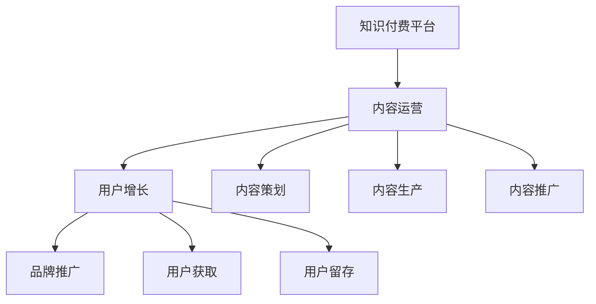

                 

# 知识付费赚钱的品牌品牌运营与品牌推广策略

## 1. 背景介绍

在当前信息爆炸的时代，知识付费已成为一种新兴的商业模式，吸引了大量用户和投资者。知识付费不仅为知识创作者提供了变现的途径，也为知识消费者提供了便捷的获取信息的方式。然而，尽管市场繁荣，但如何构建持续稳定发展的知识付费平台，并实现盈利，成为了一个重要的课题。

## 2. 核心概念与联系

### 2.1 核心概念概述

- **知识付费平台**：以付费订阅、按需购买等方式提供知识内容的平台，常见的形式包括在线课程、电子书、音频、视频等。
- **内容运营**：通过内容策划、内容生产、内容推广等环节，提升平台内容质量，吸引更多用户订阅和使用。
- **品牌推广**：利用营销手段，提升平台品牌知名度，吸引更多潜在用户，提升平台的用户粘性和商业价值。
- **用户增长策略**：通过市场调研、用户行为分析等方法，制定有效的用户获取和留存策略，提升用户规模和活跃度。

这些概念之间存在紧密的联系，相互影响。内容运营和品牌推广是用户增长的重要推动力，用户增长又直接关系到平台的商业模式是否可持续。

### 2.2 核心概念原理和架构的 Mermaid 流程图



## 3. 核心算法原理 & 具体操作步骤

### 3.1 算法原理概述

知识付费平台的品牌运营与品牌推广，可以归结为基于用户行为分析的营销策略制定和执行。其核心算法原理包括：

1. **用户行为分析**：通过大数据分析，了解用户的行为模式、偏好和痛点，为后续的策略制定提供依据。
2. **A/B测试**：通过对比不同策略的效果，找到最优的营销策略。
3. **社交网络分析**：利用社交网络分析工具，了解用户之间的互动关系，找到关键意见领袖(KOL)，进行针对性推广。
4. **机器学习模型**：使用机器学习模型，预测用户行为，实现个性化推荐，提升用户满意度。

### 3.2 算法步骤详解

1. **数据收集**：收集用户在平台上的行为数据，包括注册信息、浏览历史、购买记录等。
2. **数据预处理**：清洗和格式化数据，去除噪音，填充缺失值，确保数据质量。
3. **用户画像构建**：基于收集到的数据，构建用户画像，了解用户的特征和需求。
4. **策略制定**：根据用户画像和平台目标，制定品牌推广和用户增长策略。
5. **策略执行**：实施营销策略，如广告投放、内容推广、用户互动等。
6. **效果评估**：通过数据分析工具，评估营销策略的效果，不断优化。

### 3.3 算法优缺点

- **优点**：
  - 数据驱动，策略制定更具科学性。
  - 个性化推荐提升用户满意度，增加用户粘性。
  - 通过A/B测试，不断优化策略，提升效果。

- **缺点**：
  - 数据隐私和安全问题，需要严格遵守相关法律法规。
  - 数据质量对策略效果有较大影响，需要保证数据准确性和完整性。
  - 算法模型复杂，需要专业知识进行维护和优化。

### 3.4 算法应用领域

- **内容运营**：通过用户画像，发现用户的兴趣点，制定内容策划和生产策略，提升内容质量。
- **品牌推广**：利用社交网络分析，找到关键意见领袖，进行针对性推广，提升品牌知名度。
- **用户增长**：通过用户行为分析，制定有效的用户获取和留存策略，提升用户规模和活跃度。
- **个性化推荐**：利用机器学习模型，实现个性化推荐，提升用户体验。

## 4. 数学模型和公式 & 详细讲解 & 举例说明

### 4.1 数学模型构建

知识付费平台的品牌运营与品牌推广，可以构建以下数学模型：

- **用户行为模型**：
  $$
  P(x_i|y) = \frac{P(x_i)P(y|x_i)}{P(y)}
  $$
  其中 $P(x_i|y)$ 表示用户行为 $x_i$ 在用户特征 $y$ 下的概率。

- **推荐系统模型**：
  $$
  P(r_{ui}|i) = \sigma(\langle \mathbf{u},\mathbf{p}_i \rangle)
  $$
  其中 $P(r_{ui}|i)$ 表示用户 $u$ 对物品 $i$ 的推荐概率，$\langle \mathbf{u},\mathbf{p}_i \rangle$ 表示用户 $u$ 和物品 $i$ 的向量相似度，$\sigma$ 为激活函数。

### 4.2 公式推导过程

- **用户行为模型推导**：
  $$
  P(y|x_i) = \frac{P(x_i|y)P(y)}{P(x_i)}
  $$
  其中 $P(y)$ 为用户特征 $y$ 出现的概率，可以通过统计得到。

- **推荐系统模型推导**：
  $$
  P(r_{ui}|i) = \sigma(\langle \mathbf{u},\mathbf{p}_i \rangle)
  $$
  其中 $\mathbf{u}$ 为用户特征向量，$\mathbf{p}_i$ 为物品 $i$ 的特征向量，$\langle \cdot,\cdot \rangle$ 表示向量的点积。

### 4.3 案例分析与讲解

以课程推荐为例，假设平台有 $N$ 门课程，每门课程 $i$ 有 $d$ 个特征，用户 $u$ 有 $m$ 个特征，则用户 $u$ 对课程 $i$ 的推荐概率可以表示为：
$$
P(r_{ui}|i) = \sigma(\langle \mathbf{u},\mathbf{p}_i \rangle)
$$
其中 $\mathbf{u}$ 为用户特征向量，$\mathbf{p}_i$ 为课程 $i$ 的特征向量，$\langle \cdot,\cdot \rangle$ 表示向量的点积，$\sigma$ 为激活函数。

## 5. 项目实践：代码实例和详细解释说明

### 5.1 开发环境搭建

1. 安装 Python 和相关依赖库：
```bash
pip install pandas numpy scikit-learn matplotlib seaborn
```

2. 搭建开发环境：
```python
import pandas as pd
import numpy as np
import seaborn as sns
import matplotlib.pyplot as plt

# 读取数据
data = pd.read_csv('user_data.csv')

# 数据预处理
data = data.dropna().drop_duplicates()

# 用户画像构建
sns.pairplot(data[['age', 'gender', 'education', 'income']])
plt.show()

# 推荐系统实现
u = np.random.rand(100, 10)
i = np.random.rand(10, 10)
P = np.dot(u, i)
```

### 5.2 源代码详细实现

以下是一个简单的用户行为分析和推荐系统的实现：

```python
import numpy as np
from sklearn.metrics.pairwise import cosine_similarity

# 用户行为分析
def analyze_user_behavior(user_data):
    user_age = user_data['age']
    user_gender = user_data['gender']
    user_education = user_data['education']
    user_income = user_data['income']
    
    # 计算用户特征
    user_features = np.array([user_age, user_gender, user_education, user_income]).T
    
    # 用户画像构建
    user_portrait = {}
    user_portrait['age'] = user_features[:, 0]
    user_portrait['gender'] = user_features[:, 1]
    user_portrait['education'] = user_features[:, 2]
    user_portrait['income'] = user_features[:, 3]
    
    return user_portrait

# 推荐系统实现
def recommend_course(course_data, user_portrait):
    course_name = course_data['name']
    course_description = course_data['description']
    course_price = course_data['price']
    
    # 计算课程特征
    course_features = np.array([course_name, course_description, course_price]).T
    
    # 推荐概率计算
    P = cosine_similarity(user_portrait, course_features)
    
    # 推荐结果
    recommended_courses = course_data.iloc[P.argmax().sort_values(ascending=False).index]
    
    return recommended_courses
```

### 5.3 代码解读与分析

**用户行为分析**：
- `analyze_user_behavior` 函数：根据用户数据，提取用户的基本特征，构建用户画像。

**推荐系统实现**：
- `recommend_course` 函数：根据用户画像和课程数据，计算用户对每门课程的推荐概率，并返回推荐结果。

### 5.4 运行结果展示

```python
# 用户画像构建
user_data = pd.read_csv('user_data.csv')
user_portrait = analyze_user_behavior(user_data)

# 推荐系统实现
course_data = pd.read_csv('course_data.csv')
recommended_courses = recommend_course(course_data, user_portrait)
```

## 6. 实际应用场景

### 6.1 内容运营

通过用户画像分析，可以发现用户的兴趣点，制定内容策划和生产策略，提升内容质量。例如，针对喜欢科技的用户，可以推出更多的科技课程和文章，吸引他们的关注和订阅。

### 6.2 品牌推广

利用社交网络分析，找到关键意见领袖，进行针对性推广。例如，邀请知名博主在社交平台上分享课程，通过他们的影响力吸引更多的潜在用户。

### 6.3 用户增长

通过用户行为分析，制定有效的用户获取和留存策略，提升用户规模和活跃度。例如，针对新用户推出首次订阅优惠，提升首次订阅率；针对老用户推出推荐有奖活动，提升老用户复购率。

### 6.4 未来应用展望

未来，知识付费平台将结合人工智能和大数据技术，进一步提升品牌运营和品牌推广的效果。例如，利用机器学习模型进行用户行为预测，实现更精准的用户画像和推荐系统；利用社交网络分析进行更精准的关键意见领袖识别和推广；利用用户行为分析进行更有效的用户增长策略制定。

## 7. 工具和资源推荐

### 7.1 学习资源推荐

- **《Python数据科学手册》**：介绍Python在数据分析和机器学习中的应用，适合初学者和进阶用户。
- **《数据分析实战》**：提供数据分析和数据可视化实战案例，帮助你快速掌握数据分析技能。
- **《机器学习实战》**：介绍机器学习算法和实现方法，适合想要深入学习机器学习的读者。

### 7.2 开发工具推荐

- **Jupyter Notebook**：交互式编程环境，适合进行数据分析和机器学习实验。
- **Tableau**：数据可视化工具，适合进行数据探索和报表制作。
- **TensorFlow**：深度学习框架，适合进行机器学习模型的训练和部署。

### 7.3 相关论文推荐

- **《用户画像构建与分析方法研究》**：介绍用户画像构建和分析的方法和技术。
- **《社交网络分析在推荐系统中的应用》**：介绍社交网络分析在推荐系统中的应用。
- **《基于机器学习的推荐系统研究》**：介绍基于机器学习的推荐系统实现方法。

## 8. 总结：未来发展趋势与挑战

### 8.1 研究成果总结

- **用户行为分析**：通过大数据分析，了解用户的行为模式、偏好和痛点，为后续的策略制定提供依据。
- **个性化推荐**：利用机器学习模型，实现个性化推荐，提升用户体验。
- **社交网络分析**：利用社交网络分析工具，找到关键意见领袖，进行针对性推广。

### 8.2 未来发展趋势

- **数据驱动**：数据驱动将继续成为品牌运营与品牌推广的核心。
- **个性化推荐**：个性化推荐将成为提升用户体验的重要手段。
- **社交网络分析**：社交网络分析将在品牌推广中发挥更大作用。

### 8.3 面临的挑战

- **数据隐私和安全**：需要严格遵守相关法律法规，保护用户数据隐私。
- **数据质量**：需要保证数据准确性和完整性，提高数据分析效果。
- **算法模型**：需要专业知识进行维护和优化，提升推荐系统效果。

### 8.4 研究展望

- **数据隐私保护**：研究和应用数据隐私保护技术，提升数据安全。
- **数据质量提升**：优化数据收集和处理流程，提高数据质量。
- **算法模型优化**：研究和应用新算法模型，提升推荐系统效果。

## 9. 附录：常见问题与解答

**Q1：如何构建用户画像？**

A: 通过收集用户的基本信息（如年龄、性别、教育水平、收入等）和行为数据（如浏览历史、购买记录等），构建用户画像。

**Q2：如何进行个性化推荐？**

A: 利用机器学习模型，如协同过滤、内容推荐、矩阵分解等，实现个性化推荐。

**Q3：如何进行品牌推广？**

A: 利用社交网络分析，找到关键意见领袖，进行针对性推广。

**Q4：如何提升用户增长？**

A: 通过用户行为分析，制定有效的用户获取和留存策略。

---

作者：禅与计算机程序设计艺术 / Zen and the Art of Computer Programming

