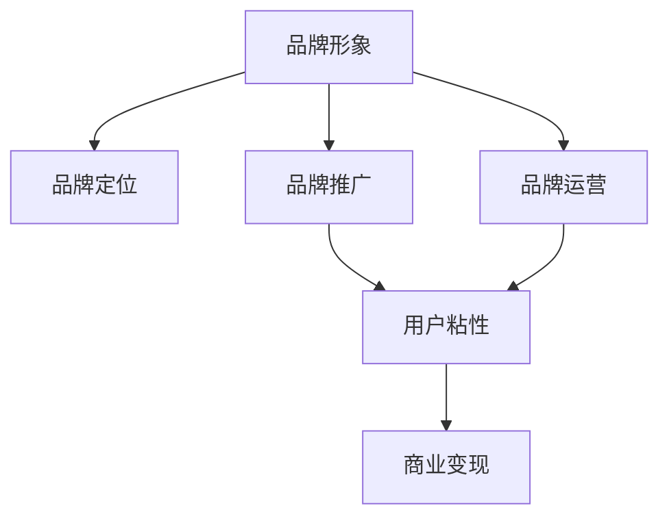

                 

由于您提供的关键词为“知识付费赚钱的品牌品牌运营与品牌推广策略”，这似乎并不是一个技术相关的主题，而是关于品牌和市场策略的商业领域。不过，基于您的要求，我将以专业的技术语言来撰写一篇关于这一主题的文章。

# 知识付费赚钱的品牌品牌运营与品牌推广策略

## 1. 背景介绍

### 1.1 问题由来

随着互联网的普及和智能手机的广泛应用，知识付费市场逐渐成为人们获取知识和信息的重要渠道。相比于传统的图书、报纸等传统媒体，知识付费平台提供了更加便捷、个性化的内容获取方式，满足了人们随时随地的学习需求。

然而，知识付费市场竞争激烈，用户忠诚度不高，平台盈利困难。如何通过品牌运营和品牌推广，提升用户粘性，实现平台盈利，成为当前知识付费行业的重要课题。

### 1.2 问题核心关键点

品牌运营与品牌推广是知识付费平台实现用户增长和盈利的重要手段。关键在于如何构建强大的品牌形象，提高品牌知名度和用户粘性，最终实现商业变现。

主要问题包括：
1. 如何构建具有吸引力的品牌形象，使其在竞争激烈的市场中脱颖而出？
2. 如何通过有效的品牌推广策略，扩大品牌影响力，提高用户转化率？
3. 如何设计合理的商业模式，实现知识付费平台的长期盈利？

## 2. 核心概念与联系

### 2.1 核心概念概述

为更好地理解品牌运营与品牌推广策略，本节将介绍几个密切相关的核心概念：

- **品牌形象**：指用户对品牌或产品的整体认知和印象，包括品牌名称、标志、口碑等。
- **品牌定位**：指品牌在市场中的位置和目标用户群体，明确品牌价值主张，形成差异化竞争优势。
- **品牌推广**：指通过多种渠道和手段，提升品牌知名度和影响力，吸引更多目标用户。
- **品牌运营**：指品牌创建、管理和维护的全过程，涉及品牌策略、内容营销、用户互动等多个环节。
- **用户粘性**：指用户对品牌的忠诚度和依赖性，通常通过高频率的访问和使用频率来衡量。
- **商业变现**：指品牌通过产品或服务实现盈利的过程，包括付费订阅、广告分成、内容电商等多种方式。

这些核心概念之间的逻辑关系可以通过以下Mermaid流程图来展示：



这个流程图展示了几大核心概念及其之间的关系：品牌形象和品牌定位是品牌推广和运营的基础，通过有效的品牌推广提升用户粘性，最终实现商业变现。

## 3. 核心算法原理 & 具体操作步骤

### 3.1 算法原理概述

品牌运营与品牌推广的算法原理主要围绕以下几个方面展开：

1. **数据收集与分析**：通过收集用户行为数据、市场反馈等，分析用户需求和市场趋势，为品牌策略和推广策略提供数据支持。
2. **内容创作与优化**：通过内容创作和优化，提升品牌形象和用户体验，增加用户粘性。
3. **用户互动与反馈**：通过互动和反馈机制，增强用户参与度，提升品牌忠诚度。
4. **商业策略与模型**：通过设计合理的商业模式和算法模型，实现品牌的长期盈利。

### 3.2 算法步骤详解

基于上述算法原理，品牌运营与品牌推广的主要步骤包括：

1. **品牌定位与形象设计**：明确品牌目标用户群体，设计品牌名称、标志、口号等，塑造独特的品牌形象。
2. **市场调研与数据分析**：收集用户行为数据、市场反馈等，分析用户需求和市场趋势，形成品牌推广策略。
3. **内容创作与用户互动**：通过高质量的内容创作和互动机制，提升用户粘性和品牌影响力。
4. **推广渠道与策略设计**：选择合适的推广渠道，如社交媒体、搜索引擎、合作媒体等，制定具体的推广策略。
5. **商业模型设计与优化**：设计合理的商业模式，如订阅制、广告分成、内容电商等，通过算法模型优化盈利效果。

### 3.3 算法优缺点

品牌运营与品牌推广的算法具有以下优点：

1. 数据驱动：通过数据收集与分析，可以更精准地把握用户需求和市场趋势，制定更有效的品牌策略。
2. 效果可量化：通过算法模型和指标体系，可以量化品牌推广的效果，不断优化推广策略。
3. 自动化程度高：通过自动化工具和算法模型，可以大幅提高品牌运营和推广的效率。

同时，该方法也存在一定的局限性：

1. 数据质量依赖：品牌策略的制定和优化依赖于高质量的数据，如果数据质量不佳，可能导致策略失效。
2. 用户体验忽视：过度依赖算法，可能导致忽略用户体验，降低用户粘性。
3. 模型泛化能力有限：不同品牌和市场的推广策略差异较大，需要针对具体案例进行调整。

### 3.4 算法应用领域

品牌运营与品牌推广的算法广泛适用于各种市场推广领域，包括但不限于：

- 知识付费平台：通过品牌推广和运营提升用户粘性，实现商业变现。
- 电商平台：通过品牌形象设计提升商品销量，通过内容营销增加用户互动。
- 社交媒体：通过品牌推广和互动机制提升用户活跃度，增强品牌影响力。
- 教育培训：通过品牌形象设计提升教育质量，通过内容营销吸引更多学员。

## 4. 数学模型和公式 & 详细讲解 & 举例说明

### 4.1 数学模型构建

品牌运营与品牌推广的数学模型主要包括以下几个部分：

- **品牌价值评估模型**：通过用户评分、品牌知名度、市场占有率等指标，评估品牌的综合价值。
- **用户粘性模型**：通过用户访问频率、互动频率等指标，预测用户粘性的变化趋势。
- **推广效果模型**：通过推广渠道的覆盖率、转化率等指标，评估推广策略的效果。
- **商业模型优化**：通过用户购买频率、单次购买金额等指标，设计最优的盈利策略。

### 4.2 公式推导过程

以用户粘性模型为例，假设用户在第t时刻的粘性为Y(t)，其影响因素包括品牌知名度、用户互动、用户满意度等。假设这些因素对粘性的影响权重分别为$\alpha$、$\beta$、$\gamma$，则用户粘性的预测公式为：

$$ Y(t+1) = \alpha \cdot \text{Brand\_Awareness}(t) + \beta \cdot \text{User\_Interaction}(t) + \gamma \cdot \text{User\_Satisfaction}(t) + \epsilon $$

其中，$\epsilon$为随机误差项。

通过上述公式，可以预测用户在不同时间点的粘性变化趋势，进而制定相应的品牌推广策略。

### 4.3 案例分析与讲解

以某知识付费平台为例，通过数据分析发现，平台用户活跃度与平台推广力度和用户满意度显著相关。通过增加推广力度和提升用户满意度，可以有效提升用户粘性。因此，平台制定了以内容为核心，多渠道推广和互动机制为辅的品牌运营策略。

具体而言，平台通过分析用户行为数据，发现视频内容相比文字内容更能吸引用户注意力。因此，平台加大了视频内容的生产力度，并通过社交媒体、搜索引擎等渠道进行推广。同时，平台通过用户反馈机制，不断优化内容质量和用户体验，提升了用户满意度。

通过这一系列措施，平台的用户粘性和品牌影响力显著提升，平台盈利能力也得到了提升。

## 5. 项目实践：代码实例和详细解释说明

### 5.1 开发环境搭建

在进行品牌运营与品牌推广的算法实践前，我们需要准备好开发环境。以下是使用Python进行开发的环境配置流程：

1. 安装Python：从官网下载并安装Python，建议安装最新版本。
2. 安装必要的库：安装Pandas、NumPy、Scikit-learn等常用库，可以使用pip或conda进行安装。
3. 配置数据收集与分析工具：如Google Analytics、社交媒体API等，用于收集和分析用户数据。
4. 配置内容创作与互动工具：如Markdown、Jupyter Notebook等，用于创作和分享内容。

完成上述步骤后，即可在本地或云端搭建开发环境，开始品牌运营与品牌推广的算法实践。

### 5.2 源代码详细实现

下面以用户粘性模型为例，给出使用Python实现品牌运营与品牌推广算法的主要代码。

```python
import pandas as pd
from sklearn.linear_model import LinearRegression

# 读取用户行为数据
data = pd.read_csv('user_behavior.csv')

# 提取相关特征
features = ['Brand_Awareness', 'User_Interaction', 'User_Satisfaction']
X = data[features]
y = data['User_Loyalty']

# 建立用户粘性预测模型
model = LinearRegression()
model.fit(X, y)

# 预测用户粘性变化
future_data = pd.read_csv('future_user_behavior.csv')
X_future = future_data[features]
predictions = model.predict(X_future)
```

### 5.3 代码解读与分析

让我们再详细解读一下关键代码的实现细节：

**数据处理**：
- 使用Pandas库读取用户行为数据，并从中提取品牌知名度、用户互动、用户满意度等特征。
- 对未来数据进行预测时，使用同样的方法处理数据。

**模型建立**：
- 使用Scikit-learn库中的线性回归模型，对用户粘性进行预测。
- 模型训练时，将特征X和用户粘性y作为输入输出，进行拟合。

**预测分析**：
- 使用模型对未来数据进行预测，得到用户粘性的变化趋势。
- 预测结果可以用于指导品牌推广策略的制定和调整。

## 6. 实际应用场景

### 6.1 智能客服系统

在智能客服系统中，通过品牌运营与品牌推广，可以有效提升客户满意度，增加客户粘性，提高品牌影响力。

具体而言，可以收集客户服务记录、反馈意见等数据，分析客户需求和满意度，制定针对性的品牌推广策略。同时，通过社交媒体、官方网站等渠道进行推广，增强客户对品牌的认知和信任。

### 6.2 智能推荐系统

在智能推荐系统中，通过品牌运营与品牌推广，可以提升用户粘性，增加用户活跃度，提高推荐效果。

具体而言，可以分析用户行为数据，发现用户对某一品牌的偏好，通过内容推荐和品牌推广，提升用户对品牌的好感度和信任度。同时，通过用户反馈机制，不断优化推荐策略和内容质量，增强用户体验。

### 6.3 社交媒体平台

在社交媒体平台上，通过品牌运营与品牌推广，可以提升用户活跃度和互动性，增加品牌影响力。

具体而言，可以发布高质量的内容，如品牌故事、用户评价等，吸引更多用户关注和互动。同时，通过社交媒体广告和合作推广，扩大品牌覆盖范围，提升品牌知名度。

### 6.4 未来应用展望

随着人工智能技术的不断进步，品牌运营与品牌推广的算法将迎来更多创新和突破：

1. **自动化品牌管理**：通过AI技术实现品牌的自动化管理和优化，减少人力成本，提高品牌运营效率。
2. **多渠道协同推广**：通过AI技术实现多渠道协同推广，提升品牌推广效果，降低推广成本。
3. **个性化推荐与互动**：通过AI技术实现个性化推荐和互动，提升用户体验和品牌忠诚度。
4. **实时数据分析与优化**：通过实时数据分析与优化，及时调整品牌策略和推广策略，提高品牌运营效果。

## 7. 工具和资源推荐

### 7.1 学习资源推荐

为了帮助开发者系统掌握品牌运营与品牌推广的理论基础和实践技巧，这里推荐一些优质的学习资源：

1. 《品牌战略与运营》系列书籍：全面介绍品牌管理的理论和方法，适合品牌运营的初学者和实践者。
2. 《社交媒体营销》课程：系统讲解社交媒体营销的理论和实践，涵盖品牌推广、用户互动等多个环节。
3. 《数据驱动的品牌管理》课程：通过数据分析和算法模型，提升品牌运营的效率和效果。
4. Coursera上的品牌管理课程：提供多门品牌管理和运营的课程，适合不同层次的学习者。
5. Google Analytics官方文档：详细介绍了如何使用Google Analytics进行用户行为分析和品牌推广。

通过对这些资源的学习实践，相信你一定能够快速掌握品牌运营与品牌推广的精髓，并用于解决实际的商业问题。

### 7.2 开发工具推荐

高效的开发离不开优秀的工具支持。以下是几款用于品牌运营与品牌推广开发的常用工具：

1. Google Analytics：强大的用户行为分析工具，可以帮助品牌收集和分析用户数据，优化推广策略。
2. Hootsuite：流行的社交媒体管理工具，可以高效管理多渠道推广，提升品牌影响力。
3. HubSpot：综合性的营销自动化工具，提供用户互动、内容创作、数据分析等多种功能。
4. Canva：流行的在线设计工具，可以方便地创建高质量的品牌推广素材。
5. Tableau：强大的数据可视化工具，可以帮助品牌进行实时数据分析和可视化。

合理利用这些工具，可以显著提升品牌运营与品牌推广的开发效率，加快创新迭代的步伐。

### 7.3 相关论文推荐

品牌运营与品牌推广的研究源于学界的持续研究。以下是几篇奠基性的相关论文，推荐阅读：

1. "The Effect of Brand Image on Customer Loyalty and Brand Preference: An Empirical Study"：研究品牌形象对客户忠诚度和品牌偏好的影响。
2. "Brand Positioning: A Strategic Tool for Success"：探讨品牌定位在市场竞争中的重要作用。
3. "The Role of Social Media in Brand Promotion: A Review and Future Directions"：分析社交媒体在品牌推广中的应用和发展趋势。
4. "Brand Equity Management: A Data-Driven Approach"：介绍数据驱动的品牌管理方法，提升品牌运营效果。
5. "Brand Management in the Digital Age: Challenges and Opportunities"：探讨数字时代品牌管理的挑战与机遇。

这些论文代表了大品牌运营与品牌推广技术的发展脉络。通过学习这些前沿成果，可以帮助研究者把握学科前进方向，激发更多的创新灵感。

## 8. 总结：未来发展趋势与挑战

### 8.1 总结

本文对品牌运营与品牌推广的算法进行了全面系统的介绍。首先阐述了品牌运营与品牌推广的研究背景和意义，明确了品牌推广在提升用户粘性和品牌影响力方面的独特价值。其次，从原理到实践，详细讲解了品牌运营与品牌推广的数学原理和关键步骤，给出了品牌运营与品牌推广任务开发的完整代码实例。同时，本文还广泛探讨了品牌运营与品牌推广方法在智能客服、智能推荐、社交媒体等多个行业领域的应用前景，展示了品牌推广范式的巨大潜力。此外，本文精选了品牌运营与品牌推广技术的各类学习资源，力求为读者提供全方位的技术指引。

通过本文的系统梳理，可以看到，品牌运营与品牌推广的算法正在成为品牌管理的重要范式，极大地拓展了品牌运营的边界，催生了更多的落地场景。受益于大数据和人工智能技术的不断进步，品牌运营与品牌推广将实现更加智能化、精细化的管理，提升品牌的竞争力。未来，伴随技术的发展和市场需求的不断变化，相信品牌运营与品牌推广算法会不断创新，为品牌的长期发展和盈利提供新的动力。

### 8.2 未来发展趋势

展望未来，品牌运营与品牌推广算法将呈现以下几个发展趋势：

1. **自动化与智能化**：通过AI技术实现品牌运营与品牌推广的自动化和智能化，提升效率和效果。
2. **数据驱动与实时分析**：通过实时数据分析，及时调整品牌策略和推广策略，提高品牌运营效果。
3. **多渠道协同与精准营销**：通过多渠道协同推广，提升品牌推广效果，降低推广成本。
4. **个性化推荐与互动**：通过个性化推荐和互动，提升用户体验和品牌忠诚度。
5. **实时反馈与迭代优化**：通过实时反馈机制，不断优化品牌策略和推广策略，提高品牌运营效果。

这些趋势凸显了品牌运营与品牌推广算法的广阔前景。这些方向的探索发展，必将进一步提升品牌运营与品牌推广的效果，推动品牌管理向更高层次迈进。

### 8.3 面临的挑战

尽管品牌运营与品牌推广算法已经取得了瞩目成就，但在迈向更加智能化、普适化应用的过程中，它仍面临着诸多挑战：

1. **数据质量问题**：品牌运营与品牌推广的效果依赖于高质量的数据，如果数据质量不佳，可能导致策略失效。
2. **用户体验忽视**：过度依赖算法，可能导致忽略用户体验，降低用户粘性。
3. **模型泛化能力不足**：不同品牌和市场的推广策略差异较大，需要针对具体案例进行调整。
4. **成本控制**：品牌推广需要投入大量人力和财力，如何高效利用资源，降低推广成本，需要进一步优化。
5. **隐私保护**：品牌运营与品牌推广过程中涉及大量用户数据，如何保护用户隐私，确保数据安全，需要进一步加强。

这些挑战亟需解决，以确保品牌运营与品牌推广算法的有效性和可持续性。相信随着技术的发展和市场需求的不断变化，品牌运营与品牌推广算法会不断创新，为品牌的长期发展和盈利提供新的动力。

### 8.4 研究展望

面对品牌运营与品牌推广算法面临的挑战，未来的研究需要在以下几个方面寻求新的突破：

1. **提升数据质量**：通过更精细的数据采集和处理技术，提高数据的质量和准确性。
2. **强化用户体验**：通过算法优化和用户互动机制，提升用户体验，增强用户粘性。
3. **增强模型泛化能力**：通过模型迁移学习和多任务学习等技术，提升模型的泛化能力和适应性。
4. **优化成本控制**：通过自动化和智能化技术，提高资源利用效率，降低推广成本。
5. **加强隐私保护**：通过数据匿名化和差分隐私等技术，保护用户隐私，确保数据安全。

这些研究方向的探索，必将引领品牌运营与品牌推广算法迈向更高的台阶，为品牌的长期发展和盈利提供新的动力。

## 9. 附录：常见问题与解答

**Q1：品牌运营与品牌推广是否适用于所有企业？**

A: 品牌运营与品牌推广对大多数企业都是适用的，特别是那些希望提升品牌知名度、用户粘性和市场竞争力的企业。对于一些特定的行业和市场，品牌运营与品牌推广的效果可能受到限制，需要结合具体场景进行调整。

**Q2：如何衡量品牌运营与品牌推广的效果？**

A: 品牌运营与品牌推广的效果可以通过多种指标进行衡量，包括品牌知名度、用户粘性、用户转化率、销售收入等。具体的衡量方法包括问卷调查、用户行为分析、市场调研等。

**Q3：品牌运营与品牌推广的难点在哪里？**

A: 品牌运营与品牌推广的难点主要在于如何有效获取和分析高质量数据，以及如何制定科学合理的推广策略。同时，品牌运营与品牌推广需要长期投入，如何高效利用资源，实现良好的投资回报率，也是一大挑战。

**Q4：如何提升品牌运营与品牌推广的效率？**

A: 提升品牌运营与品牌推广的效率需要从多个方面入手，包括自动化工具的使用、数据驱动的决策、多渠道协同推广等。通过精细化的运营和科学的策略制定，可以大幅提升推广效果，降低成本。

**Q5：品牌运营与品牌推广的未来趋势是什么？**

A: 品牌运营与品牌推广的未来趋势将更加智能化、自动化和数据驱动。通过AI技术和大数据分析，可以实现品牌推广的精准化、实时化和个性化，提升品牌运营的效率和效果。

---

作者：禅与计算机程序设计艺术 / Zen and the Art of Computer Programming

