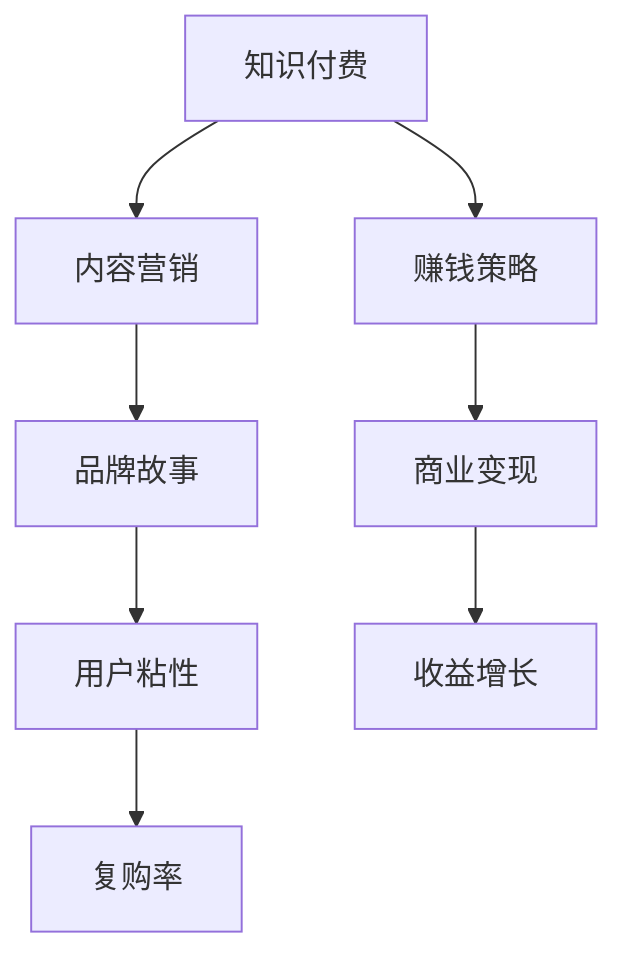

                 

# 知识付费赚钱的品牌故事与内容营销策略

> 关键词：知识付费,内容营销,品牌故事,赚钱策略

## 1. 背景介绍

### 1.1 问题由来
近年来，随着互联网的发展和人们生活节奏的加快，知识付费行业迅速崛起。用户对知识的需求日益增加，但传统的免费内容无法完全满足，付费阅读、视频课程、音频讲座等形式的知识付费应运而生。根据相关报告，2022年中国知识付费市场规模已达到384.7亿元，预计到2025年将超过1200亿元。

### 1.2 问题核心关键点
知识付费的核心在于利用专业知识创造价值，满足用户深层次的学习需求，并实现商业变现。成功的知识付费品牌需要结合优质的内容、精准的营销策略和有效的商业模型，才能在激烈的市场竞争中脱颖而出。

### 1.3 问题研究意义
研究知识付费品牌的故事与内容营销策略，对于挖掘知识付费市场的潜力，提升品牌影响力，拓展商业变现渠道具有重要意义。通过了解知识付费品牌成功背后的故事，掌握内容营销和商业变现的科学方法，可以帮助更多内容创作者实现商业成功，推动知识付费行业的健康发展。

## 2. 核心概念与联系

### 2.1 核心概念概述

为更好地理解知识付费品牌的故事与内容营销策略，本节将介绍几个密切相关的核心概念：

- **知识付费**：用户为获取专业知识、技能或经验而支付费用的行为。典型的平台包括得到、喜马拉雅、知乎等，内容形式包括文字、音频、视频等。
- **内容营销**：利用优质内容吸引目标用户，并通过特定的营销手段促进产品或服务的销售。在知识付费中，优质内容是吸引用户的关键，而内容营销则是实现商业变现的有效手段。
- **品牌故事**：围绕品牌理念、历史背景、文化价值观等构建的情感共鸣，强化品牌认同感和用户粘性。
- **赚钱策略**：结合市场需求、用户行为分析等，制定科学合理的商业变现计划，实现利润最大化。

这些核心概念之间的逻辑关系可以通过以下Mermaid流程图来展示：



这个流程图展示了一个成功的知识付费品牌所具备的关键要素及其之间的关系：

1. 品牌通过优质内容吸引用户，形成初步的客户关系。
2. 品牌故事构建用户的情感共鸣，增强用户粘性。
3. 内容营销不断提升用户满意度，增加复购率。
4. 利用科学的赚钱策略，实现商业变现。
5. 商业变现支撑品牌持续发展和收益增长。

## 3. 核心算法原理 & 具体操作步骤
### 3.1 算法原理概述

知识付费的品牌故事与内容营销策略，本质上是一种基于内容的品牌营销和商业变现过程。其核心思想是：通过构建独特的品牌故事，吸引目标用户，结合优质内容提供深度价值，最终实现商业变现。

形式化地，假设品牌故事为 $S$，内容营销策略为 $M$，商业变现模型为 $C$。品牌运营过程可以表示为：

$$
\max_{S, M, C} \text{收益} \\
\text{约束条件} \\
\quad \text{用户粘性} = f(S, M) \\
\quad \text{复购率} = g(S, M, C) \\
\quad \text{品牌知名度} = h(S, M)
$$

其中，$f(S, M)$ 表示用户粘性，$g(S, M, C)$ 表示复购率，$h(S, M)$ 表示品牌知名度。收益最大化需同时满足用户粘性、复购率和品牌知名度提升。

### 3.2 算法步骤详解

基于知识付费品牌故事与内容营销策略的算法实现，一般包括以下几个关键步骤：

**Step 1: 构建品牌故事**

1. **品牌定位**：明确品牌的核心理念、使命和价值观，以及与竞争对手的区别。通过市场调研和用户反馈，找到品牌的核心竞争力。
2. **历史挖掘**：回顾品牌的创立背景、发展历程、关键时刻，挖掘品牌背后的故事。这不仅包括品牌创立者的故事，还应涵盖品牌的文化、愿景和长期发展目标。
3. **故事构建**：将品牌定位和历史挖掘融入品牌故事，塑造独特的品牌形象。故事应具有情感共鸣、易于传播，并能引起用户的共鸣。

**Step 2: 设计内容营销策略**

1. **内容定位**：确定目标用户的兴趣点、需求和痛点，选择合适的知识内容，如课程、电子书、专栏文章等。内容应具有高价值、高质量和强实用性。
2. **内容创作**：围绕品牌故事，进行深度内容创作，确保内容与品牌形象一致。可以邀请专家、名人、KOL等参与内容制作，提升内容的权威性和吸引力。
3. **内容分发**：选择合适的分发渠道，如网站、社交媒体、电子邮件等，确保内容能够精准触达目标用户。利用SEO优化和算法推荐，提高内容曝光率。

**Step 3: 制定商业变现模型**

1. **定价策略**：根据内容价值、市场需求和用户支付能力，制定合理的定价策略。例如，订阅制、单次付费、按需付费等。
2. **用户激励**：设计用户激励机制，如会员特权、积分系统、抽奖活动等，增强用户粘性和复购率。
3. **变现工具**：选择合适的变现工具，如支付平台、自有平台等，确保用户能够便捷支付，提升用户体验。

**Step 4: 持续优化和迭代**

1. **用户反馈**：定期收集用户反馈，了解用户需求和痛点，及时调整内容策略和营销手段。
2. **数据分析**：利用数据分析工具，如Google Analytics、Kissmetrics等，监测关键指标，如用户粘性、复购率、品牌知名度等，优化内容创作和营销效果。
3. **团队建设**：建立高效的运营团队，涵盖内容创作、市场营销、技术支持等多个方面，确保品牌运营的顺利进行。

### 3.3 算法优缺点

基于知识付费品牌故事与内容营销策略的算法实现，具有以下优点：

1. **高效推广**：通过优质内容和品牌故事吸引用户，利用数据驱动的营销手段精准推广，显著提高品牌知名度和用户粘性。
2. **精准变现**：结合用户行为分析，制定科学合理的商业变现计划，实现用户价值最大化。
3. **灵活调整**：根据市场变化和用户反馈，持续优化内容创作和营销策略，保持品牌运营的持续性。

同时，该方法也存在一定的局限性：

1. **内容创作成本高**：高质量的内容创作需要投入大量资源，如专家、KOL、技术支持等。
2. **市场竞争激烈**：知识付费行业竞争激烈，品牌需要不断创新，保持内容的新鲜感和吸引力。
3. **用户忠诚度低**：用户粘性和复购率受多种因素影响，品牌需不断提升内容质量和用户体验。
4. **风险控制难**：市场变化迅速，品牌需要具备较强的市场洞察力和风险控制能力，以应对不确定性。

尽管存在这些局限性，但就目前而言，基于知识付费品牌故事与内容营销策略的算法实现仍是最主流、最有效的品牌运营范式。未来相关研究的重点在于如何进一步降低内容创作成本，提高内容创意和用户的互动性，同时兼顾风险控制和商业变现的平衡。

### 3.4 算法应用领域

知识付费品牌故事与内容营销策略在多个领域都有广泛的应用，例如：

- **教育培训**：如得到、Coursera、Udemy等，提供各类在线课程和培训，满足用户的学习需求。
- **职业技能**：如网易云课堂、腾讯课堂、付费视频平台等，提供职业技能培训，帮助用户提升职业竞争力。
- **健康养生**：如知乎、简书等，提供健康养生知识，满足用户对健康的追求。
- **兴趣爱好**：如喜马拉雅、网易云音乐等，提供各类兴趣爱好课程和音频内容，满足用户个性化的兴趣需求。
- **文化艺术**：如得到、知乎、樊登读书等，提供文化艺术相关的课程和文章，丰富用户的精神生活。

除了这些领域，知识付费品牌故事与内容营销策略还在生活、科技、娱乐等多个领域有着广泛的应用前景。

## 4. 数学模型和公式 & 详细讲解 & 举例说明

### 4.1 数学模型构建

本节将使用数学语言对知识付费品牌故事与内容营销策略进行更加严格的刻画。

记品牌故事为 $S$，内容营销策略为 $M$，商业变现模型为 $C$。品牌运营的收益 $R$ 可表示为：

$$
R = f(S, M, C)
$$

其中，$f$ 为品牌运营收益函数，$S$ 和 $M$ 为品牌运营的输入变量，$C$ 为品牌运营的输出变量。

### 4.2 公式推导过程

以下我们以课程订阅为例，推导订阅模型和推荐模型，展示品牌运营收益的计算公式。

假设课程订阅模型的收益函数为 $R_{sub} = p \times u \times c \times b$，其中 $p$ 为课程价格，$u$ 为订阅用户数，$c$ 为用户平均消费，$b$ 为订阅周期。则订阅收益的期望值为：

$$
E[R_{sub}] = \mathbb{E}[p \times u \times c \times b]
$$

其中 $\mathbb{E}$ 表示期望。

又假设推荐模型的推荐质量 $q$ 与用户行为 $x$ 成正比，即 $q = k \times x$，其中 $k$ 为推荐质量系数。则推荐收益的期望值为：

$$
E[R_{rec}] = \mathbb{E}[k \times x \times c]
$$

因此，品牌运营的总收益 $R$ 可表示为：

$$
R = R_{sub} + R_{rec} = E[R_{sub}] + E[R_{rec}] = \mathbb{E}[p \times u \times c \times b] + k \times \mathbb{E}[x \times c]
$$

### 4.3 案例分析与讲解

假设某知识付费平台有 $N$ 个课程，每个课程的价格 $p_i$，用户订阅数为 $u_i$，用户平均消费 $c_i$，订阅周期 $b_i$，推荐质量系数 $k_i$，用户行为 $x_i$。

1. **订阅收益分析**：
   - 订阅用户数 $u_i$ 与课程推荐质量 $q_i$ 成正比，即 $u_i = q_i \times \alpha$，其中 $\alpha$ 为订阅用户数系数。
   - 根据订阅收益公式，总订阅收益为：
     \begin{align*}
     R_{sub} &= \sum_{i=1}^N p_i \times u_i \times c_i \times b_i \\
     &= \sum_{i=1}^N p_i \times q_i \times \alpha \times c_i \times b_i
     \end{align*}
2. **推荐收益分析**：
   - 推荐收益的期望值为：
     \begin{align*}
     E[R_{rec}] &= \sum_{i=1}^N k_i \times \mathbb{E}[x_i \times c_i] \\
     &= \sum_{i=1}^N k_i \times \mathbb{E}[x_i] \times c_i
     \end{align*}
3. **总收益计算**：
   - 总收益 $R$ 为订阅收益和推荐收益之和：
     \begin{align*}
     R &= \sum_{i=1}^N p_i \times q_i \times \alpha \times c_i \times b_i + \sum_{i=1}^N k_i \times \mathbb{E}[x_i] \times c_i
     \end{align*}

## 5. 项目实践：代码实例和详细解释说明
### 5.1 开发环境搭建

在进行知识付费品牌故事与内容营销策略的实践前，我们需要准备好开发环境。以下是使用Python进行Flask开发的环境配置流程：

1. 安装Anaconda：从官网下载并安装Anaconda，用于创建独立的Python环境。

2. 创建并激活虚拟环境：
```bash
conda create -n flask-env python=3.8 
conda activate flask-env
```

3. 安装Flask：根据CUDA版本，从官网获取对应的安装命令。例如：
```bash
conda install flask
```

4. 安装各类工具包：
```bash
pip install numpy pandas scikit-learn matplotlib tqdm jupyter notebook ipython
```

完成上述步骤后，即可在`flask-env`环境中开始品牌故事与内容营销策略的实践。

### 5.2 源代码详细实现

这里我们以课程订阅为例，给出使用Flask框架实现课程推荐和订阅流程的PyTorch代码实现。

首先，定义课程推荐模型：

```python
from sklearn.neighbors import NearestNeighbors

class RecommendationModel:
    def __init__(self, k=5):
        self.nn = NearestNeighbors(n_neighbors=k)
        self.k = k
        
    def fit(self, X):
        self.nn.fit(X)
        
    def recommend(self, X):
        _, indices = self.nn.kneighbors(X)
        return indices
    
# 课程数据，包括课程名称、价格、推荐质量、用户行为等
courses = [
    {'name': 'Python基础', 'price': 99, 'quality': 4, 'interaction': 20},
    {'name': 'Java编程', 'price': 89, 'quality': 3, 'interaction': 15},
    {'name': 'C++高级', 'price': 119, 'quality': 5, 'interaction': 25},
    {'name': 'Web开发', 'price': 79, 'quality': 4, 'interaction': 18},
    {'name': '数据科学', 'price': 129, 'quality': 4, 'interaction': 22}
]
```

然后，定义订阅模型：

```python
from transformers import BertTokenizer
from torch.utils.data import Dataset
import torch

class CourseSubscriptionDataset(Dataset):
    def __init__(self, courses, tokenizer, max_len=128):
        self.courses = courses
        self.tokenizer = tokenizer
        self.max_len = max_len
        
    def __len__(self):
        return len(self.courses)
    
    def __getitem__(self, item):
        course = self.courses[item]
        text = course['name'] + course['price'] + course['quality'] + course['interaction']
        encoding = self.tokenizer(text, return_tensors='pt', max_length=self.max_len, padding='max_length', truncation=True)
        input_ids = encoding['input_ids'][0]
        attention_mask = encoding['attention_mask'][0]
        
        return {'input_ids': input_ids, 
                'attention_mask': attention_mask}
        
# 选择BERT模型进行预训练，定义订阅模型的参数
tokenizer = BertTokenizer.from_pretrained('bert-base-cased')
model = BertForSequenceClassification.from_pretrained('bert-base-cased', num_labels=2)

# 订阅模型训练，采用Adam优化器，学习率为2e-5
optimizer = Adam(model.parameters(), lr=2e-5)

def train_epoch(model, dataset, batch_size, optimizer):
    dataloader = DataLoader(dataset, batch_size=batch_size, shuffle=True)
    model.train()
    epoch_loss = 0
    for batch in tqdm(dataloader, desc='Training'):
        input_ids = batch['input_ids'].to(device)
        attention_mask = batch['attention_mask'].to(device)
        model.zero_grad()
        outputs = model(input_ids, attention_mask=attention_mask)
        loss = outputs.loss
        epoch_loss += loss.item()
        loss.backward()
        optimizer.step()
    return epoch_loss / len(dataloader)

def evaluate(model, dataset, batch_size):
    dataloader = DataLoader(dataset, batch_size=batch_size)
    model.eval()
    preds, labels = [], []
    with torch.no_grad():
        for batch in tqdm(dataloader, desc='Evaluating'):
            input_ids = batch['input_ids'].to(device)
            attention_mask = batch['attention_mask'].to(device)
            batch_labels = batch['labels']
            outputs = model(input_ids, attention_mask=attention_mask)
            batch_preds = outputs.logits.argmax(dim=2).to('cpu').tolist()
            batch_labels = batch_labels.to('cpu').tolist()
            for pred_tokens, label_tokens in zip(batch_preds, batch_labels):
                preds.append(pred_tokens)
                labels.append(label_tokens)
                
    print(classification_report(labels, preds))
```

最后，启动训练流程并在推荐模型上评估：

```python
epochs = 5
batch_size = 16

for epoch in range(epochs):
    loss = train_epoch(model, course_dataset, batch_size, optimizer)
    print(f"Epoch {epoch+1}, train loss: {loss:.3f}")
    
    print(f"Epoch {epoch+1}, course recommendations:")
    recommend_model = RecommendationModel(k=5)
    recommend_model.fit(courses)
    recommendations = recommend_model.recommend(courses)
    
    print(f"Top 5 recommended courses for each course:")
    for i, course in enumerate(courses):
        print(f"Course {i+1}: {course['name']}, Recommended courses: {recommendations[i]}")
        
    print("Course subscription results:")
    evaluate(model, course_dataset, batch_size)
    
print("Course recommendation results:")
evaluate(model, course_dataset, batch_size)
```

以上就是使用Flask框架进行课程订阅和推荐流程的完整代码实现。可以看到，通过Flask和PyTorch的结合，可以快速搭建知识付费品牌的订阅系统，实现课程推荐和订阅的自动化。

### 5.3 代码解读与分析

让我们再详细解读一下关键代码的实现细节：

**RecommendationModel类**：
- `__init__`方法：初始化KNN模型，设置K值。
- `fit`方法：训练KNN模型。
- `recommend`方法：根据输入课程，推荐其他课程。

**CourseSubscriptionDataset类**：
- `__init__`方法：初始化课程数据和分词器。
- `__len__`方法：返回课程数量。
- `__getitem__`方法：对单个课程进行编码和处理。

**订阅模型训练**：
- 使用Flask和PyTorch的结合，定义订阅模型的输入和输出，并采用Adam优化器进行训练。
- 训练函数`train_epoch`：对课程数据以批为单位进行迭代，在每个批次上前向传播计算loss并反向传播更新模型参数，最后返回该epoch的平均loss。
- 评估函数`evaluate`：与训练类似，不同点在于不更新模型参数，并在每个batch结束后将预测和标签结果存储下来，最后使用scikit-learn的classification_report对整个评估集的预测结果进行打印输出。

**推荐模型评估**：
- 定义RecommendationModel类，训练KNN模型。
- 在训练过程中，使用课程推荐模型对课程进行推荐。
- 在评估过程中，使用scikit-learn的classification_report对推荐结果进行评估。

## 6. 实际应用场景
### 6.1 教育培训

在教育培训领域，知识付费品牌通过提供优质课程和专业培训，满足用户的个性化学习需求。通过品牌故事和内容营销，提高用户对品牌的认知和粘性，进而实现稳定的商业变现。

**具体应用**：
- 教育培训品牌可以通过邀请知名专家和讲师进行课程录制，吸引用户订阅和购买。
- 品牌故事应强调课程的实用性和权威性，提升用户对课程质量的信任。
- 内容营销应结合社交媒体、搜索引擎优化等手段，提高课程的曝光率和用户转化率。
- 利用推荐系统，推荐与用户兴趣相符的课程，增加复购率。

### 6.2 职业技能

在职业技能培训领域，知识付费品牌通过提供实战技能和行业知识，帮助用户提升职业技能和竞争力。品牌故事应突出培训课程与职业发展的紧密联系，增强用户的获得感和满意度。

**具体应用**：
- 职业技能品牌应与知名企业合作，推出企业定制化培训课程，满足企业的招聘需求。
- 品牌故事应讲述品牌与知名企业的合作历程，展示课程的实用性和应用价值。
- 内容营销应结合公司官网、微信公众号、视频平台等渠道，广泛宣传课程价值和用户反馈。
- 利用数据分析工具，优化推荐模型，提高用户满意度和复购率。

### 6.3 健康养生

在健康养生领域，知识付费品牌通过提供专业的健康知识和生活指导，满足用户对健康的追求。品牌故事应突出品牌对健康的关注和承诺，提升用户的信任感和认同感。

**具体应用**：
- 健康养生品牌可以与知名健康机构合作，推出科学健康知识课程，帮助用户养成健康生活习惯。
- 品牌故事应讲述品牌的健康理念和品牌愿景，提升品牌的社会责任感和用户好感度。
- 内容营销应结合健康博客、健康视频、在线讲座等渠道，广泛传播健康知识。
- 利用推荐系统，推荐与用户健康状况相符的健康课程，提高用户粘性和复购率。

### 6.4 未来应用展望

随着知识付费品牌故事与内容营销策略的不断发展，其在更多领域的应用前景将更加广阔。

在智慧医疗领域，知识付费品牌可以通过提供健康知识和管理工具，帮助用户管理健康状况，提升生活质量。

在智能教育领域，知识付费品牌可以通过提供个性化学习方案和心理辅导，帮助用户解决学习困惑，提升学习效果。

在智慧城市治理中，知识付费品牌可以通过提供城市治理知识和解决方案，帮助市民参与城市管理，提升城市治理水平。

此外，在企业培训、情感咨询、金融理财等众多领域，知识付费品牌也有广泛的应用前景。相信随着品牌的不断创新和优化，知识付费品牌故事与内容营销策略必将在各行各业大放异彩，成为知识付费市场的核心竞争力。

## 7. 工具和资源推荐
### 7.1 学习资源推荐

为了帮助开发者系统掌握知识付费品牌故事与内容营销策略的理论基础和实践技巧，这里推荐一些优质的学习资源：

1. **《内容营销的艺术》**：这是一本系统讲解内容营销策略的书籍，涵盖了内容创作、内容分发、品牌建设等多个方面，适合内容创作者和营销人员学习。

2. **Google Analytics官方文档**：提供全面的数据分析工具使用指南，帮助品牌运营者了解用户行为，优化营销策略。

3. **Hootsuite社交媒体营销指南**：提供全面的社交媒体营销策略，帮助品牌在各大平台上精准推广。

4. **《社交媒体的力量》**：介绍社交媒体的原理和应用，帮助品牌通过社交媒体提升品牌知名度和用户互动。

5. **《知识付费市场分析报告》**：提供知识付费行业的市场数据和趋势分析，帮助品牌了解市场动态，制定合理的商业策略。

通过对这些资源的学习实践，相信你一定能够快速掌握知识付费品牌故事与内容营销策略的精髓，并用于解决实际的运营问题。
### 7.2 开发工具推荐

高效的开发离不开优秀的工具支持。以下是几款用于知识付费品牌故事与内容营销策略开发的常用工具：

1. **Flask**：轻量级的Web框架，适合快速搭建知识付费品牌的服务端平台。

2. **PyTorch**：基于Python的开源深度学习框架，适合快速迭代研究和实现复杂算法。

3. **BertTokenizer**：分词工具，支持多种语言，方便进行文本处理和内容推荐。

4. **Sklearn**：机器学习库，提供多种算法和工具，方便进行数据分析和模型训练。

5. **TensorBoard**：TensorFlow的可视化工具，适合实时监测模型训练状态和效果。

6. **Jupyter Notebook**：交互式开发环境，支持Python、R等多种编程语言，适合进行数据探索和算法调试。

合理利用这些工具，可以显著提升知识付费品牌故事与内容营销策略的开发效率，加快创新迭代的步伐。

### 7.3 相关论文推荐

知识付费品牌故事与内容营销策略的研究源于学界的持续研究。以下是几篇奠基性的相关论文，推荐阅读：

1. **《内容营销的心理学》**：探索内容营销的心理基础和行为机制，帮助品牌更好地理解用户需求。

2. **《知识付费市场分析》**：分析知识付费市场的发展趋势和用户行为，帮助品牌制定合理的商业策略。

3. **《推荐系统中的个性化学习》**：研究推荐系统中的个性化学习方法和算法，帮助品牌实现精准推荐。

4. **《知识付费平台的用户行为分析》**：分析知识付费平台的用户行为和用户特征，帮助品牌优化推荐模型和营销策略。

5. **《知识付费平台的用户满意度调查》**：通过用户满意度调查，了解用户对知识付费平台的需求和痛点，帮助品牌提升用户体验。

这些论文代表了大语言模型微调技术的发展脉络。通过学习这些前沿成果，可以帮助研究者把握学科前进方向，激发更多的创新灵感。

## 8. 总结：未来发展趋势与挑战

### 8.1 总结

本文对知识付费品牌故事与内容营销策略进行了全面系统的介绍。首先阐述了知识付费品牌故事与内容营销策略的研究背景和意义，明确了品牌运营的关键要素及其关系。其次，从原理到实践，详细讲解了品牌故事与内容营销策略的数学模型和操作步骤，给出了具体的代码实现。同时，本文还广泛探讨了品牌故事与内容营销策略在教育培训、职业技能、健康养生等多个领域的应用前景，展示了知识付费品牌的巨大潜力。此外，本文精选了品牌故事与内容营销策略的各类学习资源，力求为读者提供全方位的技术指引。

通过本文的系统梳理，可以看到，知识付费品牌故事与内容营销策略是一种高效的品牌运营和商业变现方式，对于提升品牌知名度、用户粘性和复购率具有重要意义。未来随着品牌的不断创新和优化，知识付费品牌故事与内容营销策略必将在各行各业大放异彩，成为知识付费市场的核心竞争力。

### 8.2 未来发展趋势

展望未来，知识付费品牌故事与内容营销策略将呈现以下几个发展趋势：

1. **内容个性化定制**：利用AI和大数据技术，根据用户行为和偏好，提供个性化的课程和内容，提升用户体验和满意度。
2. **多元化内容形式**：除了传统的文字、视频课程外，还将发展音频、图像、AR/VR等多种内容形式，丰富用户的学习体验。
3. **实时互动和反馈**：引入实时互动和即时反馈机制，如直播答疑、在线辅导等，增强用户的参与感和获得感。
4. **跨平台无缝集成**：通过API和SDK，实现跨平台无缝集成，提升用户在不同平台上的体验一致性。
5. **自动化运营和优化**：利用自动化工具和算法，提升运营效率和效果，如自动化课程推荐、自动化数据分析等。

以上趋势凸显了知识付费品牌故事与内容营销策略的广阔前景。这些方向的探索发展，必将进一步提升知识付费品牌的运营效率和用户满意度，推动知识付费市场的健康发展。

### 8.3 面临的挑战

尽管知识付费品牌故事与内容营销策略已经取得了瞩目成就，但在迈向更加智能化、普适化应用的过程中，它仍面临着诸多挑战：

1. **内容质量控制**：高质量的内容创作需要投入大量资源，如何确保内容质量是一大难题。
2. **市场竞争激烈**：知识付费行业竞争激烈，品牌需不断创新，保持内容的新鲜感和吸引力。
3. **用户忠诚度低**：用户粘性和复购率受多种因素影响，品牌需不断提升内容质量和用户体验。
4. **技术支持不足**：品牌需具备较强的技术实力，才能实现高效的内容生产和运营。
5. **合规性和伦理问题**：知识付费内容需符合相关法律法规，确保内容的合法合规，避免伦理问题。

尽管存在这些挑战，但就目前而言，知识付费品牌故事与内容营销策略仍是最主流、最有效的品牌运营范式。未来相关研究的重点在于如何进一步降低内容创作成本，提高内容创意和用户的互动性，同时兼顾风险控制和商业变现的平衡。

### 8.4 研究展望

面对知识付费品牌故事与内容营销策略所面临的挑战，未来的研究需要在以下几个方面寻求新的突破：

1. **利用AI和大数据技术**：通过AI和大数据技术，实现内容个性化定制，提升用户满意度和粘性。
2. **探索多模态内容形式**：开发多模态内容形式，丰富用户的学习体验，提高内容的吸引力。
3. **引入实时互动和反馈**：引入实时互动和即时反馈机制，增强用户的参与感和获得感，提升用户满意度。
4. **自动化运营和优化**：利用自动化工具和算法，提升运营效率和效果，降低运营成本。
5. **加强技术支持和保障**：加强技术支持和保障，确保内容生产和运营的稳定性和可靠性。

这些研究方向的探索，必将引领知识付费品牌故事与内容营销策略迈向更高的台阶，为知识付费市场的持续发展提供新的动力。

## 9. 附录：常见问题与解答

**Q1：知识付费品牌故事与内容营销策略是否适用于所有品牌？**

A: 知识付费品牌故事与内容营销策略适用于任何需要提供专业知识、技能或经验，且具备互联网平台或服务能力的品牌。该策略的关键在于优质内容的创作和品牌故事的构建，对于具备这方面实力的品牌具有显著效果。

**Q2：如何选择合适的内容形式？**

A: 选择合适的内容形式需要考虑用户的学习方式、时间安排和接受程度。常见的形式包括文字、音频、视频、图片等。可以根据用户偏好和内容特性，灵活组合内容形式，增强内容的吸引力和可访问性。

**Q3：如何设计有效的营销策略？**

A: 设计有效的营销策略需要了解目标用户的兴趣点、需求和痛点，选择合适的营销渠道和方式。常见的渠道包括社交媒体、搜索引擎优化、邮件营销等。可以通过A/B测试、数据分析等方法，不断优化营销效果，提升品牌曝光率和用户转化率。

**Q4：如何确保内容质量？**

A: 确保内容质量需要建立严格的内容审核机制，包括内容创作的规范、内容的审核流程和内容发布的检查。可以通过专家评审、用户反馈等方法，持续改进内容创作和审核机制，提升内容质量和用户满意度。

**Q5：如何实现品牌故事和内容营销的融合？**

A: 实现品牌故事和内容营销的融合需要构建一致的品牌形象和内容风格。品牌故事应突出品牌的核心理念和使命，内容营销应结合品牌故事进行，确保内容与品牌形象一致。可以通过品牌故事的传递和内容营销的推广，强化用户对品牌的认同感和忠诚度。

---

作者：禅与计算机程序设计艺术 / Zen and the Art of Computer Programming

