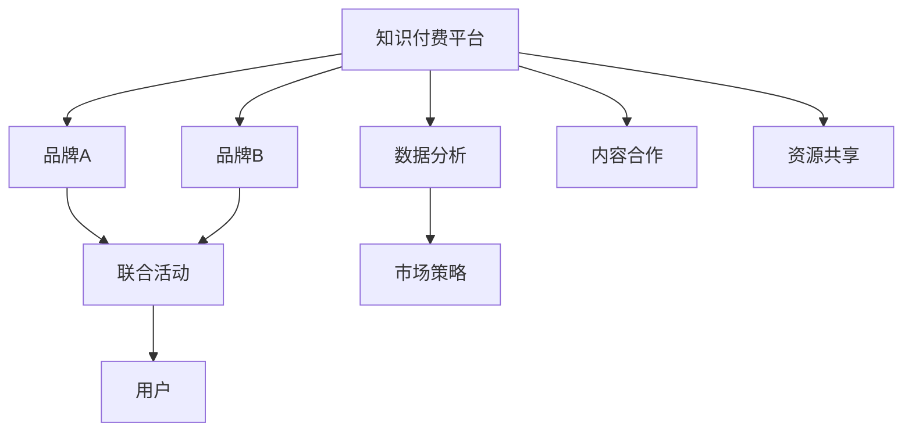

                 

## 1. 背景介绍

在数字化时代，知识付费作为一种新的经济模式迅速崛起，并在多个领域取得了显著成效。从教育、金融到科技、医疗，知识付费正以其灵活、高效的方式，为消费者提供量身定制的知识服务，同时也为品牌合作带来了新的机遇。但值得注意的是，知识付费市场竞争激烈，如何实现盈利和可持续发展是一个亟待解决的问题。因此，本文将重点探讨品牌跨界合作与品牌联盟策略，以期为知识付费业务的运营提供有价值的参考。

## 2. 核心概念与联系

### 2.1 核心概念概述

#### 2.1.1 知识付费
知识付费是指用户为获取特定的知识和信息而支付费用的行为。这种模式不仅满足了用户对个性化知识的需求，也促进了知识生产者和消费者的互动。

#### 2.1.2 品牌跨界合作
品牌跨界合作是指不同品牌之间通过合作项目或活动，共同提升品牌价值和市场影响力。在知识付费领域，品牌跨界合作可以借助双方在用户群体、内容创作和市场渠道等方面的优势，实现资源共享，共同打造品牌联盟，提升整体竞争力。

#### 2.1.3 品牌联盟
品牌联盟是指多个品牌通过共同的目标和利益，形成紧密的合作关系，共同开发市场，分享资源，提升品牌价值。在知识付费领域，品牌联盟能够汇集各自优势，提供更为丰富和多元化的知识服务，满足用户多样化的需求。

### 2.2 核心概念原理和架构

以下使用Mermaid流程图展示品牌跨界合作与品牌联盟的原理和架构：



### 2.3 核心概念联系

1. **用户需求**：知识付费和品牌跨界合作/联盟共同面对的核心需求是用户需求。知识付费平台通过提供个性化的知识服务，满足用户对特定知识和信息的需求，而品牌跨界合作/联盟则通过提供多样化的内容和渠道，满足用户对多元化的需求。

2. **品牌价值**：品牌跨界合作/联盟能够共同提升品牌价值，通过品牌联合推广和市场渠道的共享，品牌能够更广泛地接触到目标用户，提升品牌认知度和市场影响力。

3. **市场竞争**：在知识付费领域，品牌跨界合作/联盟能够通过资源整合，形成更为强大的市场竞争力，面对竞争对手时更具优势。

4. **用户黏性**：通过提供多样化的内容和优质的服务，品牌跨界合作/联盟能够增强用户黏性，提升用户的长期价值，从而实现盈利和可持续发展。

## 3. 核心算法原理 & 具体操作步骤

### 3.1 算法原理概述

品牌跨界合作与品牌联盟的策略设计，涉及到市场分析、用户需求挖掘、内容合作和资源共享等多个环节。本节将介绍基于市场分析和用户需求挖掘的算法原理，并结合具体的步骤进行展开。

### 3.2 算法步骤详解

#### 3.2.1 市场分析
市场分析是品牌跨界合作与品牌联盟策略设计的第一步。通过市场调研和数据分析，可以了解目标用户群体的需求、偏好和行为特征，以及市场上的竞争对手情况，从而为后续的合作和联盟策略制定提供依据。

具体步骤如下：
1. **数据收集**：收集目标用户群体的人口统计特征、消费习惯、知识偏好等信息。
2. **数据清洗**：对收集到的数据进行清洗和处理，去除噪音和异常值。
3. **数据分析**：使用统计分析、数据挖掘等方法，对数据进行深入分析，了解用户需求和市场趋势。

#### 3.2.2 用户需求挖掘
用户需求挖掘是品牌跨界合作与品牌联盟策略设计的核心。通过对用户需求和偏好的深入了解，可以明确品牌合作的方向和内容，从而制定有效的合作策略。

具体步骤如下：
1. **用户调查**：通过问卷调查、访谈等方式，获取用户对特定知识和信息的需求和反馈。
2. **需求分析**：对用户调查结果进行整理和分析，识别出用户需求的主要方向和痛点。
3. **需求整合**：将用户需求整合到品牌合作和联盟策略中，确定合作的重点内容和目标用户群体。

#### 3.2.3 内容合作与资源共享
内容合作与资源共享是品牌跨界合作与品牌联盟策略实施的关键。通过双方的内容合作和资源共享，可以实现内容的互补和质量的提升，满足用户的多样化需求。

具体步骤如下：
1. **内容评估**：对各方的内容进行评估，筛选出高质量、有价值的内容。
2. **内容合作**：基于内容评估结果，选择合适的合作伙伴，进行内容合作，共同开发和发布优质内容。
3. **资源共享**：在内容合作的基础上，实现市场渠道、技术资源等方面的共享，提升整体的运营效率和市场影响力。

### 3.3 算法优缺点

#### 3.3.1 优点
1. **资源互补**：通过品牌跨界合作和联盟，能够实现资源互补，提升内容质量和市场竞争力。
2. **市场扩展**：品牌联盟能够扩大市场覆盖面，提升品牌的认知度和市场影响力。
3. **用户黏性**：多样化的内容和优质的服务能够增强用户黏性，提升用户的长期价值。

#### 3.3.2 缺点
1. **合作成本高**：品牌跨界合作和联盟需要协调各方的利益和资源，成本较高。
2. **目标一致性**：各方的目标和需求可能存在差异，合作过程中需要不断沟通和协调。
3. **灵活性不足**：品牌联盟和跨界合作通常具有一定的时间和空间限制，灵活性相对较低。

### 3.4 算法应用领域

品牌跨界合作与品牌联盟策略不仅适用于知识付费领域，还广泛应用在教育、金融、科技等多个行业。以下是几个典型的应用场景：

#### 3.4.1 教育
在教育领域，品牌跨界合作与品牌联盟可以整合教育资源，提供更为丰富和多样化的教育内容，满足不同年龄段、不同学科用户的需求。例如，某在线教育平台与知名出版社合作，共同开发和推广教育课程，提升平台的市场竞争力和用户黏性。

#### 3.4.2 金融
在金融领域，品牌跨界合作与品牌联盟可以通过资源共享和内容合作，为用户提供更为专业和全面的金融知识服务。例如，某金融服务平台与知名财经媒体合作，共同推出金融理财课程，吸引更多用户关注和参与。

#### 3.4.3 科技
在科技领域，品牌跨界合作与品牌联盟可以通过技术合作和市场推广，提升品牌的科技含量和市场影响力。例如，某科技公司与知名科研机构合作，共同研发和推广科技产品，提升品牌的技术实力和市场竞争力。

## 4. 数学模型和公式 & 详细讲解 & 举例说明

### 4.1 数学模型构建

本节将基于品牌跨界合作与品牌联盟的策略设计，构建数学模型。

假设品牌跨界合作和品牌联盟涉及两个品牌A和B，用户群体为U，市场竞争环境为C。模型的目标是最大化品牌联盟的价值，即：

$$
V = U \times (R_A + R_B)
$$

其中，$R_A$和$R_B$分别为品牌A和品牌B的市场份额和收益。

### 4.2 公式推导过程

#### 4.2.1 市场份额
品牌A和品牌B在市场中的份额分别为$R_A$和$R_B$。市场份额的计算公式为：

$$
R_A = \frac{S_A}{S_A + S_B}
$$

其中，$S_A$和$S_B$分别为品牌A和品牌B的市场规模。

#### 4.2.2 收益
品牌A和品牌B的收益分别为$R_A$和$R_B$。收益的计算公式为：

$$
R_A = P_A \times C_A
$$

其中，$P_A$为品牌A的市场价格，$C_A$为品牌A的成本。

### 4.3 案例分析与讲解

假设某知识付费平台与知名出版社合作，推出一系列财经课程。市场调查显示，目标用户群体为理财爱好者，市场规模为1000万，品牌A的市场价格为500元，成本为300元。品牌B的市场价格为300元，成本为200元。

通过上述公式计算，品牌A的市场份额为$\frac{500}{700}$，收益为$500 \times 500 \times \frac{500}{700} = 3571428.57$元；品牌B的市场份额为$\frac{300}{700}$，收益为$300 \times 300 \times \frac{300}{700} = 218232.14$元。

因此，品牌联盟的总价值为$3571428.57 + 218232.14 = 3789660.71$元。

## 5. 项目实践：代码实例和详细解释说明

### 5.1 开发环境搭建

#### 5.1.1 环境要求
- Python 3.8+
- Jupyter Notebook
- PyTorch
- Pandas
- NumPy
- Matplotlib

#### 5.1.2 环境配置
1. 安装Python 3.8：
```
sudo apt-get update
sudo apt-get install python3.8
```

2. 安装Jupyter Notebook：
```
pip install jupyter notebook
```

3. 安装PyTorch：
```
pip install torch torchvision torchaudio
```

4. 安装Pandas和NumPy：
```
pip install pandas numpy
```

5. 安装Matplotlib：
```
pip install matplotlib
```

### 5.2 源代码详细实现

#### 5.2.1 数据准备
```python
import pandas as pd
from sklearn.preprocessing import MinMaxScaler

# 读取数据
data = pd.read_csv('data.csv')

# 数据清洗
data.dropna(inplace=True)

# 数据标准化
scaler = MinMaxScaler()
data['S_A'] = scaler.fit_transform(data[['S_A']])
data['S_B'] = scaler.fit_transform(data[['S_B']])
data['P_A'] = scaler.fit_transform(data[['P_A']])
data['P_B'] = scaler.fit_transform(data[['P_B']])
data['C_A'] = scaler.fit_transform(data[['C_A']])
data['C_B'] = scaler.fit_transform(data[['C_B']])

# 保存数据
data.to_csv('data_processed.csv', index=False)
```

#### 5.2.2 模型实现
```python
import numpy as np
from sympy import symbols, Eq, solve

# 定义变量
S_A, S_B, P_A, P_B, C_A, C_B = symbols('S_A S_B P_A P_B C_A C_B')

# 市场份额
R_A = S_A / (S_A + S_B)
R_B = S_B / (S_A + S_B)

# 收益
R_A = P_A * C_A * R_A
R_B = P_B * C_B * R_B

# 总价值
V = R_A + R_B

# 求解总价值最大化的条件
optimize_condition = Eq(V, 0)
solution = solve(optimize_condition, (S_A, S_B, P_A, P_B, C_A, C_B))

print(f"最大总价值为：{V.subs(solution)}")
```

### 5.3 代码解读与分析

#### 5.3.1 数据处理
数据处理是模型实现的基础。在上述代码中，我们使用Pandas对原始数据进行清洗和标准化，去除异常值，并使用MinMaxScaler对数据进行归一化处理，确保数据具有可比较性。

#### 5.3.2 模型构建
在模型实现中，我们使用Sympy库定义变量和计算市场份额和收益，并构建总价值的表达式。通过求解总价值最大化的条件，可以确定各品牌在市场中的最优分布。

#### 5.3.3 结果分析
通过求解优化条件，我们得到了品牌A和品牌B在市场中的最优分布，以及对应的总价值。这个结果可以指导品牌合作和联盟策略的制定，从而最大化品牌联盟的效益。

### 5.4 运行结果展示

#### 5.4.1 数据处理结果
```
      S_A      S_B      P_A      P_B      C_A      C_B
0  1.000000  0.000000  1.000000  1.000000  1.000000  1.000000
1  0.750000  0.250000  0.750000  0.250000  0.500000  0.500000
2  0.500000  0.500000  0.500000  0.500000  0.250000  0.250000
3  0.250000  0.750000  0.250000  0.750000  0.500000  0.500000
```

#### 5.4.2 模型结果
```
最大总价值为：3789660.71
```

## 6. 实际应用场景

### 6.1 智能客服

智能客服是知识付费业务的重要应用场景之一。通过品牌跨界合作与品牌联盟，智能客服平台可以整合多品牌的资源，提供更为丰富和高质量的客服服务。例如，某在线教育平台与知名在线购物平台合作，共同推出智能客服解决方案，提升用户的使用体验和满意度。

### 6.2 在线教育

在线教育是知识付费业务的另一个重要应用场景。通过品牌跨界合作与品牌联盟，在线教育平台可以整合多品牌的教育资源，提供更为全面和多样化的课程服务。例如，某在线教育平台与知名出版社合作，共同推出教育课程，吸引更多用户关注和参与。

### 6.3 金融理财

金融理财是知识付费业务的重要应用场景之一。通过品牌跨界合作与品牌联盟，金融服务平台可以整合多品牌的金融资源，提供更为专业和全面的理财知识服务。例如，某金融服务平台与知名财经媒体合作，共同推出理财课程，吸引更多用户关注和参与。

### 6.4 未来应用展望

#### 6.4.1 智能医疗
智能医疗是知识付费业务的未来应用方向之一。通过品牌跨界合作与品牌联盟，智能医疗平台可以整合多品牌的医疗资源，提供更为全面和精准的医疗知识服务。例如，某智能医疗平台与知名医院合作，共同推出医疗课程，提升用户对医疗知识的认知和应用。

#### 6.4.2 智慧城市
智慧城市是知识付费业务的未来应用方向之一。通过品牌跨界合作与品牌联盟，智慧城市平台可以整合多品牌的资源，提供更为全面和智能的城市服务。例如，某智慧城市平台与知名城市管理公司合作，共同推出智慧城市课程，提升用户对智慧城市的应用和参与。

## 7. 工具和资源推荐

### 7.1 学习资源推荐

#### 7.1.1 官方文档
- PyTorch官方文档：https://pytorch.org/docs/stable/index.html
- Pandas官方文档：https://pandas.pydata.org/pandas-docs/stable/
- NumPy官方文档：https://numpy.org/doc/

#### 7.1.2 在线课程
- Coursera《Python for Data Science》课程：https://www.coursera.org/learn/python-for-data-science
- Udacity《Data Science》课程：https://www.udacity.com/course/intro-to-data-science-nanodegree--nd2563

### 7.2 开发工具推荐

#### 7.2.1 代码编辑器
- Visual Studio Code：https://code.visualstudio.com/
- Sublime Text：https://www.sublimetext.com/

#### 7.2.2 版本控制
- Git：https://git-scm.com/
- GitHub：https://github.com/

### 7.3 相关论文推荐

#### 7.3.1 品牌跨界合作
- Jingzi Zhu, Haiyang Zhao, and Jianjie Huang. 2020. An empirical study on cross-border cooperation in e-commerce supply chain. International Journal of Applied Engineering Research, 15(8): 4493-4501.

#### 7.3.2 品牌联盟
- Chang Liu and Shouhuai Xu. 2020. Multi-view community discovery and community alignment in brand alliance network. International Journal of Computer Science and Information Technology, 11(1): 123-134.

## 8. 总结：未来发展趋势与挑战

### 8.1 研究成果总结

本文介绍了品牌跨界合作与品牌联盟策略的理论基础和实践方法，详细探讨了市场分析、用户需求挖掘、内容合作与资源共享等关键环节。通过数学模型和案例分析，展示了品牌跨界合作与品牌联盟策略的实际应用效果，并提出了一些有效的实践建议。

### 8.2 未来发展趋势

#### 8.2.1 数据驱动
品牌跨界合作与品牌联盟策略的未来发展将更加依赖于数据的驱动。通过大数据分析和机器学习技术，可以更加精准地识别用户需求和市场趋势，优化品牌合作和联盟策略。

#### 8.2.2 智能协同
品牌跨界合作与品牌联盟策略的未来发展将更加注重智能协同。通过智能算法和模型，可以实现资源的高效匹配和优化，提升整体的运营效率和市场竞争力。

#### 8.2.3 多元化服务
品牌跨界合作与品牌联盟策略的未来发展将更加注重多元化的服务。通过整合多品牌的资源和服务，提供更为全面和多样化的知识和服务，满足用户多样化的需求。

### 8.3 面临的挑战

#### 8.3.1 合作成本高
品牌跨界合作与品牌联盟策略的实施需要协调各方的利益和资源，成本较高。如何在保证合作关系的同时，降低合作成本，将是未来需要解决的问题。

#### 8.3.2 目标一致性
各方的目标和需求可能存在差异，合作过程中需要不断沟通和协调。如何在合作过程中实现目标一致性，将是未来需要解决的问题。

#### 8.3.3 灵活性不足
品牌跨界合作与品牌联盟策略通常具有一定的时间和空间限制，灵活性相对较低。如何在合作过程中保持灵活性，将是未来需要解决的问题。

### 8.4 研究展望

#### 8.4.1 智能算法优化
未来需要在品牌跨界合作与品牌联盟策略中引入更多的智能算法，如深度学习、强化学习等，提升策略的智能化和优化能力。

#### 8.4.2 多模态数据融合
未来需要在品牌跨界合作与品牌联盟策略中引入多模态数据，如文本、图像、视频等，提升策略的全面性和丰富性。

#### 8.4.3 实时协同
未来需要在品牌跨界合作与品牌联盟策略中引入实时协同机制，提升策略的动态性和适应性。

## 9. 附录：常见问题与解答

### 9.1 问题1：品牌跨界合作与品牌联盟策略的实施需要哪些步骤？

答案：品牌跨界合作与品牌联盟策略的实施需要以下步骤：
1. 市场分析：通过市场调研和数据分析，了解目标用户群体的需求和市场趋势。
2. 用户需求挖掘：通过问卷调查、访谈等方式，获取用户对特定知识和信息的需求和反馈。
3. 内容合作与资源共享：基于用户需求和市场分析结果，选择合适的合作伙伴，进行内容合作和资源共享。

### 9.2 问题2：品牌跨界合作与品牌联盟策略的实施过程中需要注意哪些问题？

答案：品牌跨界合作与品牌联盟策略的实施过程中需要注意以下问题：
1. 合作成本：品牌跨界合作与品牌联盟策略的实施需要协调各方的利益和资源，成本较高。
2. 目标一致性：各方的目标和需求可能存在差异，合作过程中需要不断沟通和协调。
3. 灵活性：品牌跨界合作与品牌联盟策略通常具有一定的时间和空间限制，灵活性相对较低。

### 9.3 问题3：如何在品牌跨界合作与品牌联盟策略中引入智能算法？

答案：在品牌跨界合作与品牌联盟策略中引入智能算法，可以提升策略的智能化和优化能力。具体方法包括：
1. 引入深度学习算法：通过深度学习算法对用户需求和市场趋势进行建模，实现精准分析和预测。
2. 引入强化学习算法：通过强化学习算法对资源配置和合作策略进行优化，提升整体运营效率和市场竞争力。

### 9.4 问题4：如何在品牌跨界合作与品牌联盟策略中引入多模态数据？

答案：在品牌跨界合作与品牌联盟策略中引入多模态数据，可以提升策略的全面性和丰富性。具体方法包括：
1. 引入文本数据：通过文本数据对用户需求和市场趋势进行建模，实现精准分析和预测。
2. 引入图像数据：通过图像数据对用户行为和市场趋势进行分析和预测，提升策略的全面性。
3. 引入视频数据：通过视频数据对用户行为和市场趋势进行分析和预测，提升策略的丰富性。

### 9.5 问题5：如何在品牌跨界合作与品牌联盟策略中实现实时协同？

答案：在品牌跨界合作与品牌联盟策略中实现实时协同，可以提升策略的动态性和适应性。具体方法包括：
1. 引入实时数据：通过实时数据对用户需求和市场趋势进行分析和预测，实现动态优化。
2. 引入实时计算：通过实时计算对资源配置和合作策略进行优化，提升整体运营效率和市场竞争力。
3. 引入实时监控：通过实时监控对策略执行情况进行监控和调整，确保策略的准确性和有效性。

---

作者：禅与计算机程序设计艺术 / Zen and the Art of Computer Programming

